A **flash sheet** is the page of ready-to-tattoo designs on a tattoo parlour's
wall. It has bold outlines, a small palette and every piece framed so a client
can point and pick. This one is a steampunk sheet of seven Victorian
curiosities: a winged pocket watch, an airship, a clockwork heart, an Edison
bulb, a pair of cogs, a goggled top hat and a skeleton key.

It's mostly drawn. Every shape is a **Lasso** or **Elliptical Marquee**
selection filled with ink and then with colour. The only photo is a
public-domain 1741 engraving of watch parts by Antoine Thiout, from
[Wikimedia Commons](https://commons.wikimedia.org/wiki/File:Antoine_Thiout_engraving_1741.jpg).
It becomes a ghost texture in the paper.

One recipe draws every piece, from back to front:

1. Fill the shape with ink `#15110E`.
2. Choose **Select → Shrink…**, enter 5–7 px, and fill the smaller selection with its colour. That leaves an even black outline between overlapping parts.
3. For metal, fill with a gradient instead of a flat colour.

For tiny round parts such as rivets and bulb dots, skip the Shrink and draw
the smaller colour circle directly with the **Elliptical Marquee**. It keeps
very small circles perfectly round.

The palette:

- Verdigris sheet: `#1F3B35`
- Ink: `#15110E`
- Ivory: `#EFE4C8`
- Brass: `#F0CF78` → `#C8952F` → `#8A5A1C`
- Copper: `#E08A55` → `#B4532A` → `#6E2A12`
- Teal: `#3F9A86`
- Oxblood: `#7C1D23`
- Heart red: `#B8323A`

## Start a 1650 × 2200 sheet

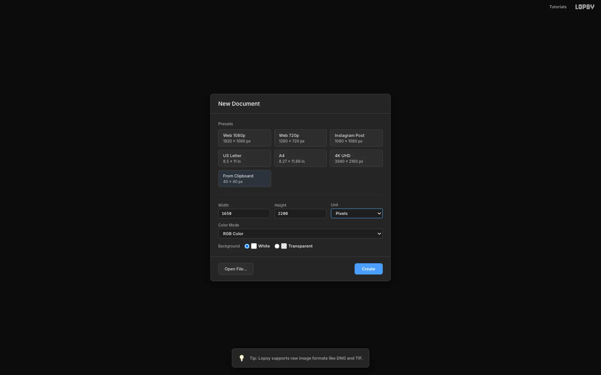

Choose **File → New**, check that **Unit** says **Pixels**, and enter
**1650 × 2200**. That's 3:4, about the shape of an 11 × 14 inch flash sheet.
Click **Create**.

## Emboss a leather grain

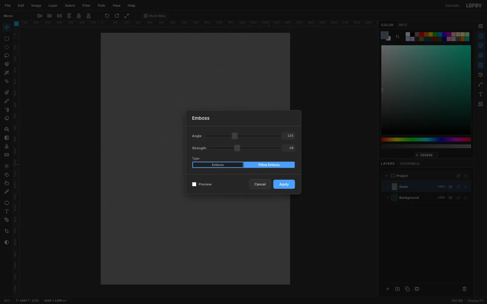

Click **Background**, set the foreground to `#1F3B35` and choose
**Edit → Fill**. Rename **Layer 1** to **Grain**, fill it with `#808080`, and
run three filters:

1. **Filter → Add Noise…**: **Amount 60**, **Mono**.
2. **Filter → Gaussian Blur…**: **Radius 2**.
3. **Filter → Emboss…**: **Pillow Emboss**, **Angle 135**, **Strength 40**.

In the Layers panel, set the layer's blend mode to **Overlay** and its opacity
to **35%**.

## Mottle the patina with Clouds

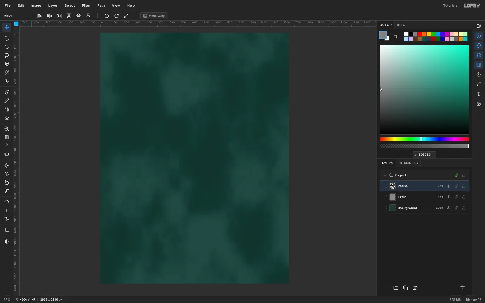

Add a layer named **Patina**, fill it with grey, and run **Filter → Clouds…**
at the default scale. Set it to **Soft Light** at **20%**. The big soft blotches
read as oxidised copper. Keep them faint, because the designs have to sit on
top of them.

## Paste and scale the engraving

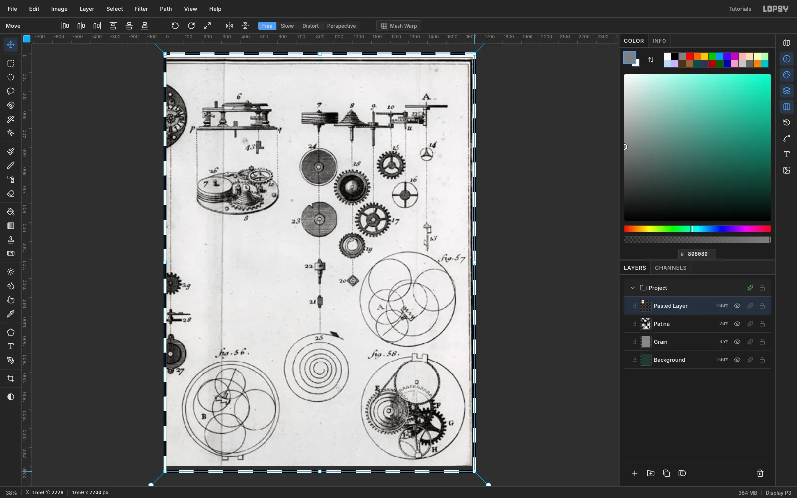

Copy the Thiout engraving in your browser and press [[Cmd+V]]. An image
pasted from outside Lopsy arrives already selected, with the **Move** tool
active, and a large one is shrunk to fit inside the sheet.

Hold [[Cmd]] and drag the bottom-right corner handle out until the image is
big enough to cover the whole sheet, then drag it into place. [[Cmd]] keeps
the scale uniform. Press [[Cmd+D]] to commit, then rename the layer
**Engraving**.

## Turn it into a ghost

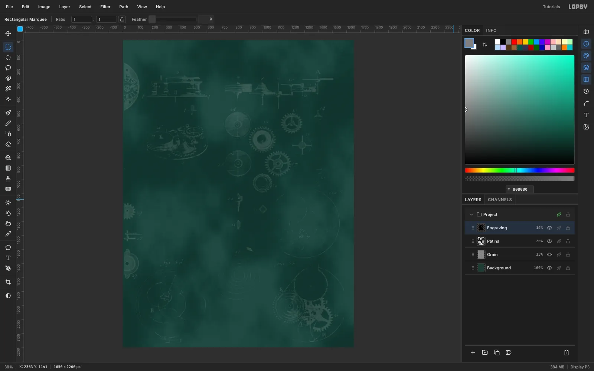

1. Run **Filter → Desaturate**, then **Filter → Invert**. The paper turns black and the lines turn white.
2. **Filter → Brightness/Contrast…** with **Brightness −45** and **Contrast 70** crushes the paper to pure black.
3. Marquee the scan's printed frame lines where they show along the top and right edges, and press [[Delete]].
4. Set the layer to **Screen** at **16%**. Black vanishes in Screen, so only the gears and springs remain, like a watermark.

## Cut a wing from layered feathers

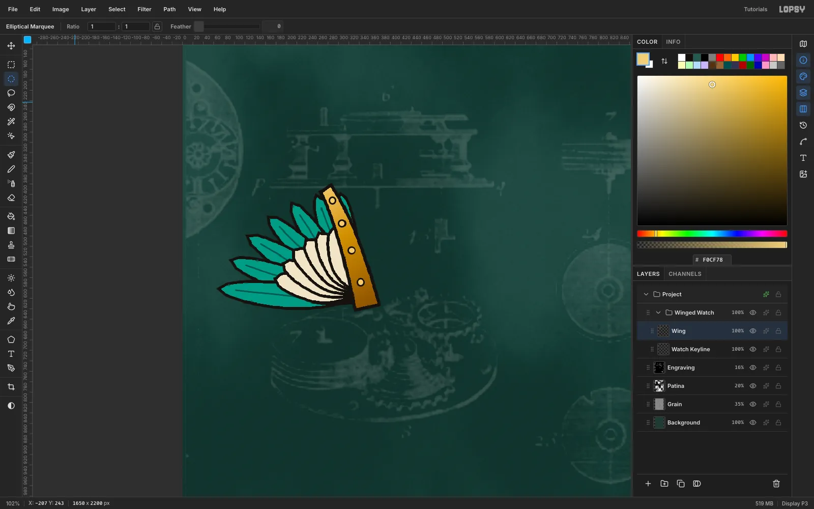

Make a group with the **New Group** button in the Layers panel and name it
**Winged Watch**. Add an empty layer named **Watch Keyline** (you'll fill it
later), then a layer named **Wing** above it.

Draw the wing from the back forward:

- **Seven long feathers**, fanning from pointing left to pointing up. For each one, lasso a rounded-tip feather, fill it ink, then Shrink 5 and fill teal. Add a darker teal quill line with a 4 px Brush.
- **Six shorter cream feathers** on top, with the same ink-then-shrink fill.
- **A curved brass arm** along the leading edge, filled with the brass gradient and finished with four rivets.

## Mirror it with Duplicate and Flip

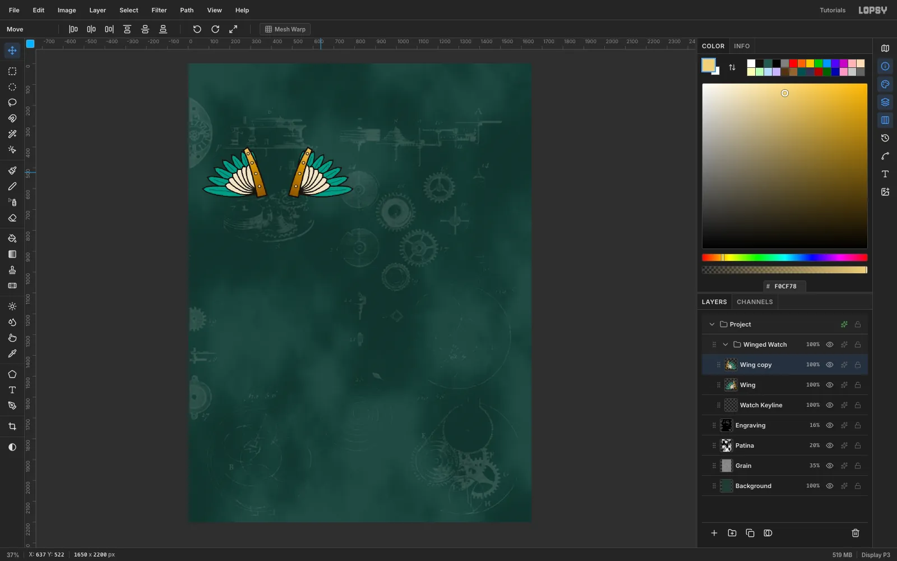

With **Wing** active, choose **Layer → Duplicate Layer**, then click the copy's
row. **Image → Flip Horizontal** mirrors it.

Drag the copy with the **Move** tool until the two wings sit symmetrically on
either side of where the watch will go, then fine-tune with the arrow keys
(1 px per press, or 10 px with [[Shift]]). Choose **Layer → Merge Down** to
join the pair.

## Build the pocket watch

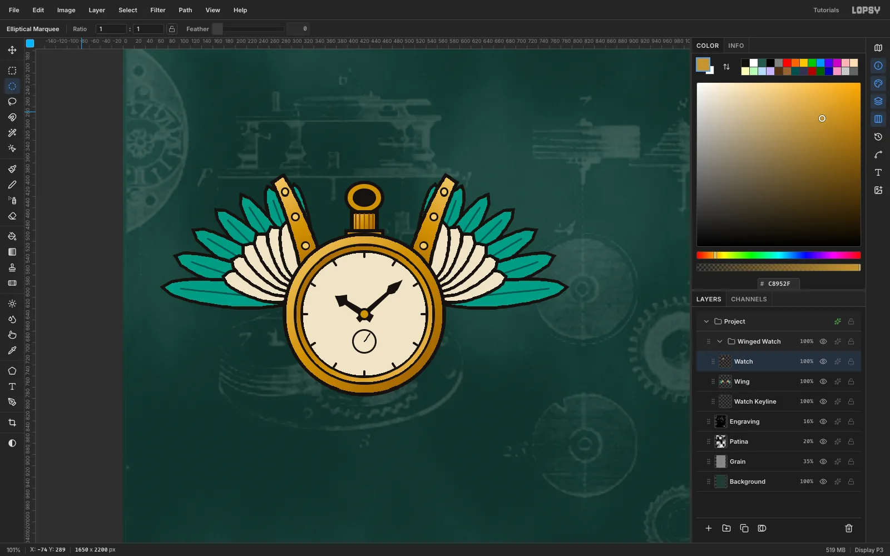

On a new **Watch** layer, stack Elliptical Marquee fills:

- The case: a circle about 290 px across, centred between the wings, in ink. [[Cmd]]-drag keeps it round. Then fill it with the brass gradient, dragged from top-left to bottom-right.
- An inner bezel with the gradient reversed.
- A cream dial.

Add a knurled crown and bow on top. Then add 5 px brush ticks at every five
minutes, a small seconds sub-dial where VI would be, and two spade-tipped hands
at 10:08. Merge **Watch** down onto **Wing** and rename the result
**Watch Art**.

## Add the outer keyline and numerals

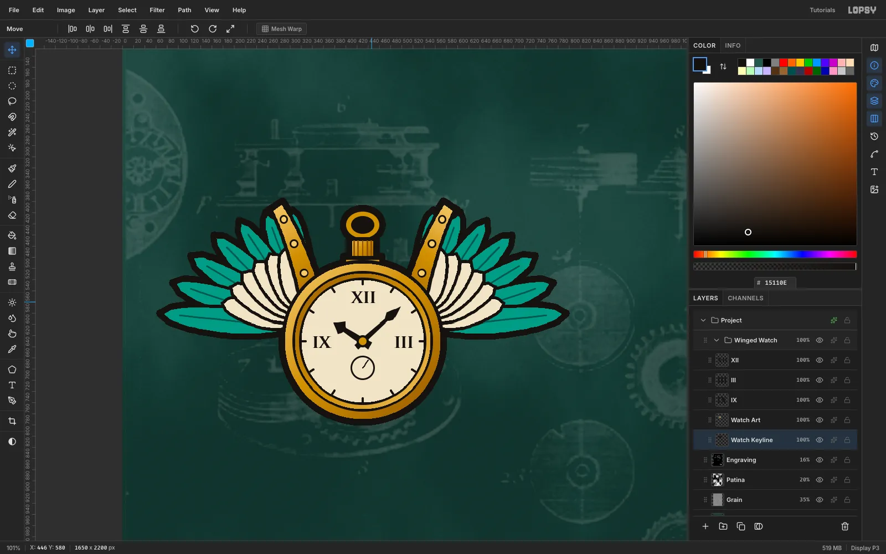

A heavier outer line makes each design read from across the room:

1. [[Cmd]]-click the **Watch Art** thumbnail to load its shape as a selection.
2. Choose **Select → Grow…** and enter **5**.
3. Click the empty **Watch Keyline** row and choose **Edit → Fill** with ink.

Set **XII**, **III** and **IX** in **Cinzel Bold** at 30 px. Create each one in
empty canvas, so the click doesn't land in another text layer, then move it
onto the dial, just inside the ticks.

## Draw and rotate the airship

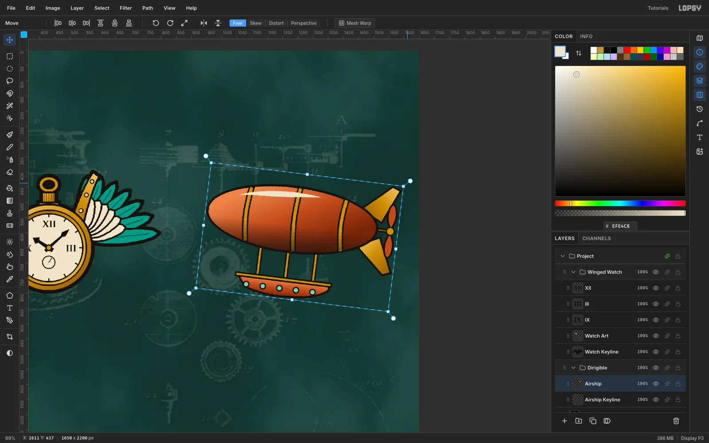

In a **Dirigible** group, add an **Airship Keyline** layer, then draw the
airship on an **Airship** layer:

- **Envelope:** an Elliptical Marquee filled with the copper gradient, plus three brass straps.
- **Tail:** two brass fins and a copper two-blade propeller.
- **Gondola:** three brass struts, then a copper hull with teal portholes.

On an **Airship Shade** layer, draw a cream crescent highlight along the top
and a soft black gradient on the belly, then merge it down.

To tilt the nose up, marquee the whole airship and switch to **Move**. Drag
the round handle outside the top-right corner about **7°** clockwise, then
press [[Cmd+D]]. Build the keyline afterwards, growing it from the rotated
shape, so it follows the new angle.

## Move a whole group

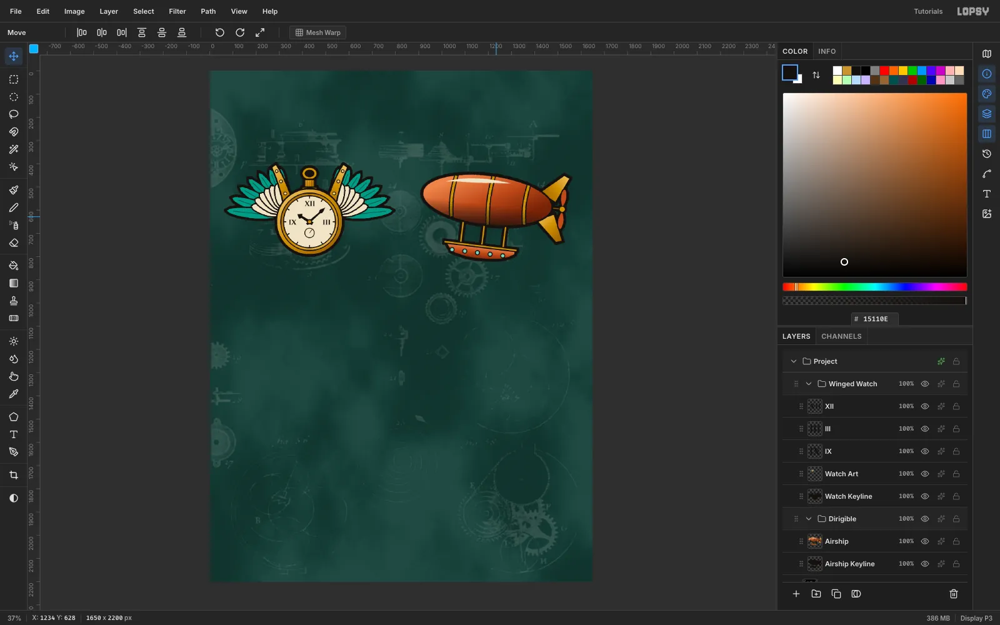

The rotation pushed the propeller too close to the right edge. Click the
**Dirigible** group row and drag on the canvas with **Move**, or tap
[[Shift+Left]] a few times. The art and its keyline move together, here
about 36 px to the left. Groups are the easiest way to keep multi-layer
pieces aligned.

## Draw the clockwork heart

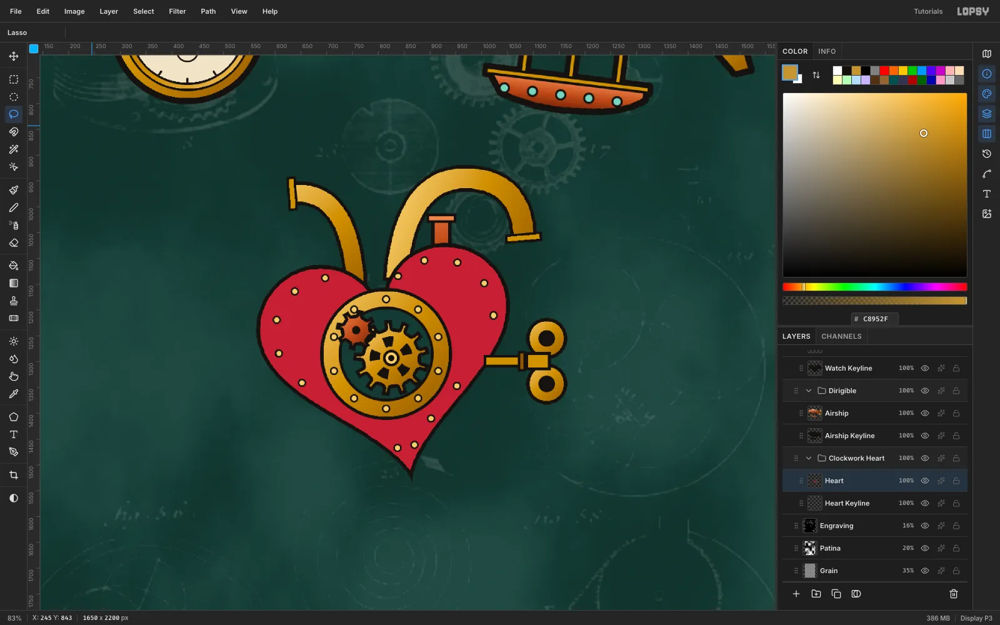

In a **Clockwork Heart** group, draw from back to front:

- **Pipes:** three brass and copper pipes, each drawn as a curved band selection and filled with a gradient, plus flanges.
- **The heart:** a heart-shaped lasso in ink, then Shrink 7 and fill `#B8323A`.
- **A brass porthole:** a dark glass disc with a spoked brass gear and a small copper gear behind the glass.
- **A wind-up key:** a figure-eight key on the right side.
- **A riveted seam:** small brass rivets spaced around the heart, about 30 px in from its edge.

## Seat the porthole and finish the rivets

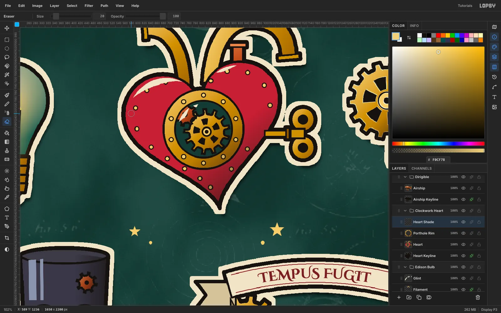

The small copper gear overlapped the bezel, which looked wrong. Redraw the
brass rim and its ten rivets on a **Porthole Rim** layer above **Heart**. Then
select a circle the size of the glass and press [[Delete]] to reopen the
window. The gear now sits behind the rim.

On **Heart Shade**:

- Add cream crescent highlights on each lobe and two glints on the glass.
- Add a black whip-shade gradient on the lower right.

Where the rivets gap or bunch, add or paint over one. Use the **Eraser** to
remove any stray dot.

## Light the Edison bulb

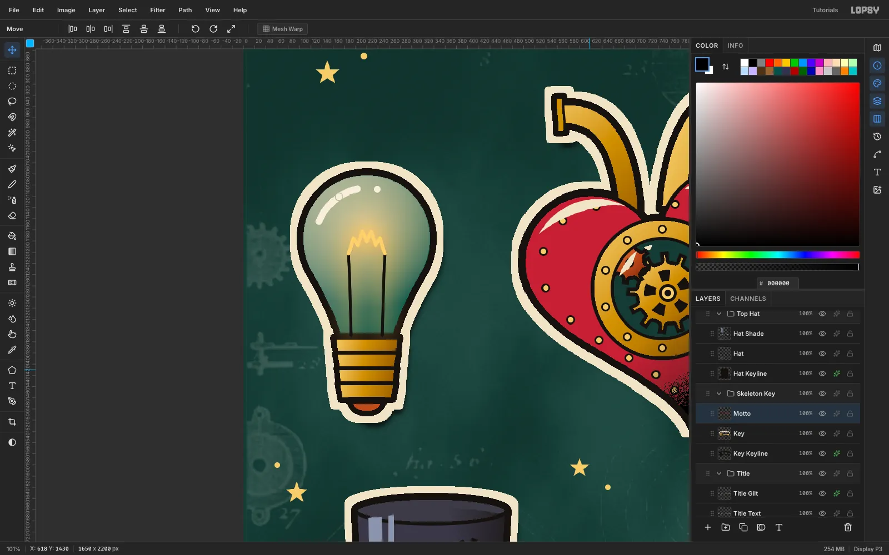

Build the bulb's glass and brass screw base the same way on a **Bulb** layer.
Then light it:

- **Lamp Light:** lasso the glass, Shrink 7, and drag a **radial** amber gradient (`#FFB84A`, 75% alpha to 0%) out from the filament. Set the layer to **Screen**.
- **Filament:** two ink support wires and a zigzag in `#FFD27A`, with an **Outer Glow** in `#FFC45A` (Size 50, Spread 25).
- **Glint:** one 13 px Brush arc along the upper-left of the glass, plus a dot.

## Emboss the cogs

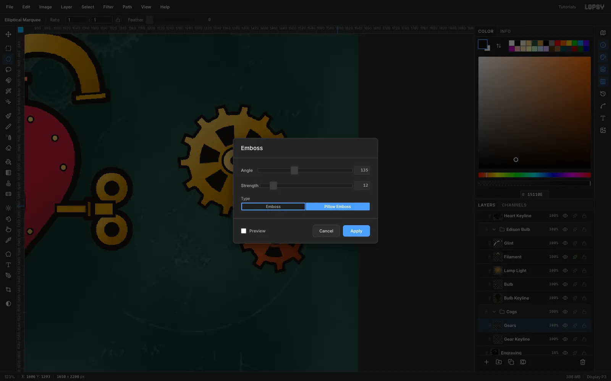

Cogs mesh when a tooth of one gear points into a gap in the other. Space their
centres at the sum of the pitch radii, and match the tooth sizes: 14 teeth on
the big gear and 9 on the small.

After filling both with gradients, run **Filter → Emboss…**: **Pillow Emboss**,
**Angle 135**, **Strength 12**. The top-left edges pick up a machined bevel.
Add a black whip gradient on each gear's lower right.

## Add the top hat and goggles

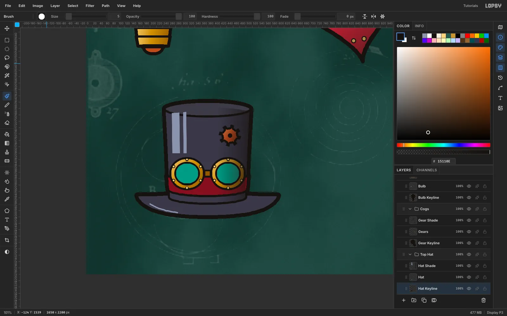

Draw the brim as one ellipse, then the crown, top oval and oxblood band over
it. Push the goggles up so they overlap the band, as if they were resting on
the hat.

The silk sheen is two hard pale-blue stripes (`#8C93AB`) on the crown's left,
plus a thin line along the front of the brim. Flash avoids airbrushed
highlights.

## Hang a banner over the skeleton key

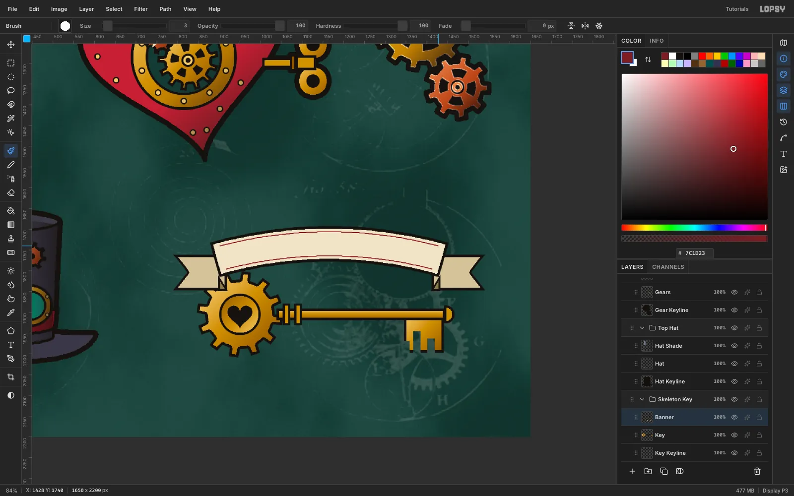

The key's bow is a 12-tooth gear with a round hole and a heart cut-out, on a
brass shaft with two collars. Cut notches into the bit with small marquee
Deletes.

Above the key, the banner is an arc band 86 px tall with two thin oxblood
rules. It has swallowtail tails tucked behind it, with dark fold triangles
where they turn under. Merge the banner onto the key so they share one
keyline.

## Set a gilt title

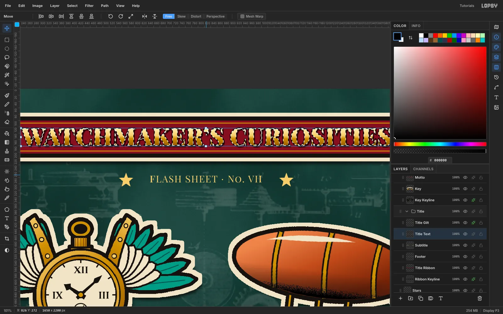

The ribbon is an oxblood band with brass rules and notched tails. Set the
title in **Playfair Display SC**, **Black**, 76 px. Paste a curly apostrophe
(’), because a straight tick looks cheap in a didone. Use **Align center
horizontally** to centre it, then Move it between the rules.

To gild it:

1. [[Cmd]]-click the text thumbnail and add a **Title Gilt** layer.
2. Drag a four-stop gold gradient from the top of the letters to the bottom.
3. Give the layer a 3 px dark **Stroke** and a hard 4 × 5 px **Drop Shadow** (Blur 0).

Set the subtitle and footer in Playfair Display SC Regular, with 2–3 px letter
spacing.

## Curve the motto along the banner

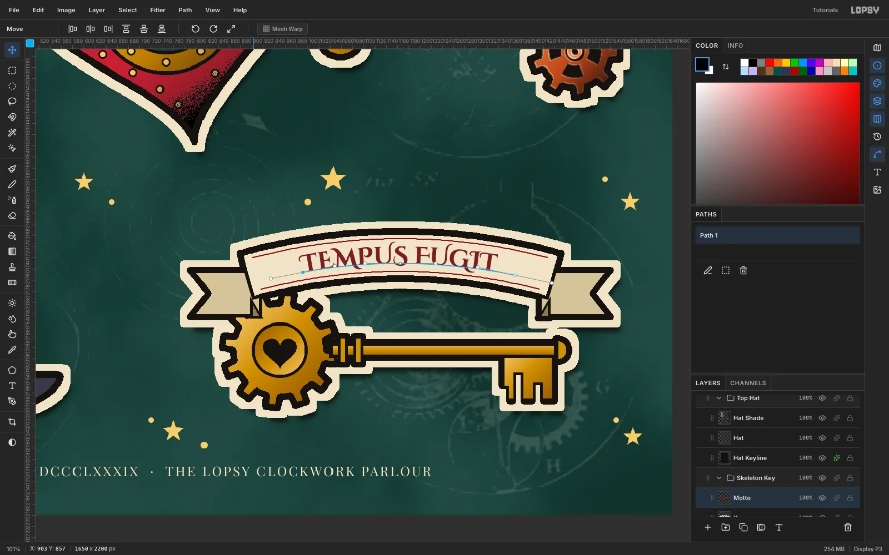

1. Type **TEMPUS FUGIT** in **Cinzel Decorative Bold** at 42 px in oxblood, and note its width.
2. Draw a three-anchor **Pen** arc, the same length plus a little slack, about 15 px below the banner's centre line, and click **Commit path**.
3. With the text layer selected, pick the path in the Text options' **Path** menu.

The caps then sit centred between the rules, and the swashes stay clear of
them.

## Give every piece a sticker halo

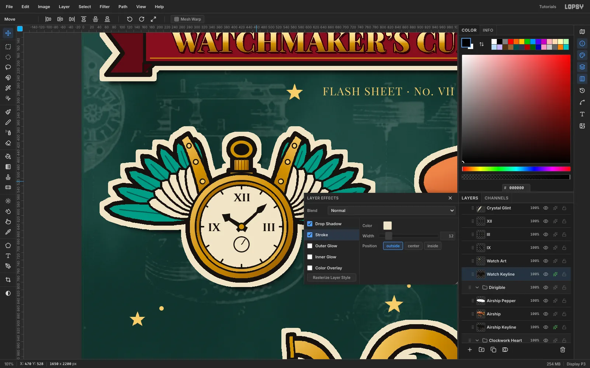

On each **Keyline** layer, open **Layer effects**:

- **Stroke:** cream `#EFE4C8`, **Width 12**, **Outside**.
- **Drop Shadow:** `#050706`, **12 × 20**, **Blur 14**, **75%**.

The keyline gives the halo its clean outer edge, so the designs read as
die-cut stickers on the dark sheet.

## Pepper the shadows

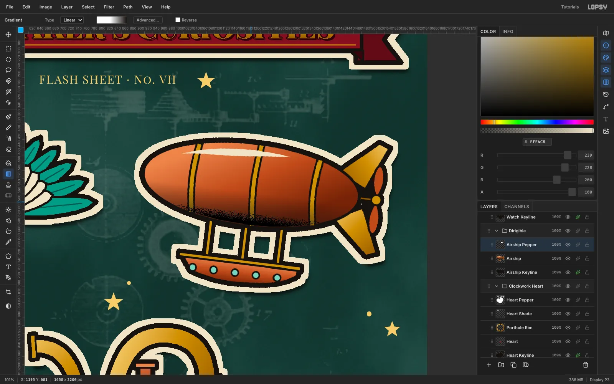

Tattoo shading breaks up into dots instead of fading smoothly. On a new layer
above the airship:

1. Lasso the envelope and drag a white → white → black gradient toward the belly.
2. Run **Add Noise** at **90**, **Mono**.
3. Run **Filter → Threshold…** at **Level 128**.
4. Set the layer to **Multiply**.

The solid black at the edge breaks into pepper dots as it fades. Repeat on the
heart's tip. Keep the selection tight: anything past the gradient's end turns
solid black.

## Check the balance with guides

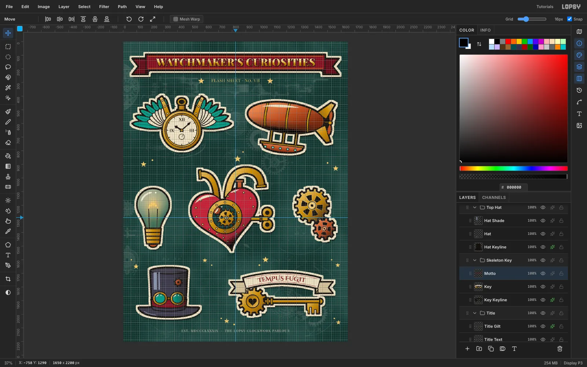

Choose **View → Show Grid**. [[Cmd]]-click the middle of the top ruler to
drop a guide exactly on the sheet's centre line, and click the left ruler
level with the middle row of designs. Compare the gaps between the halos and
the distance from each halo to the sheet edge. Here, the bulb floated alone
while the heart crowded the cogs.

## Rebalance the rows

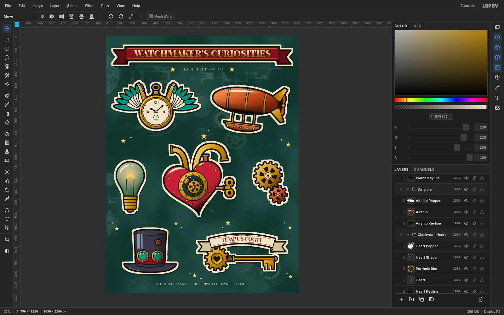

Showing the grid also switches on **Snap** in the options bar. Untick it
before you move anything, or drags and arrow-key nudges jump in whole grid
cells.

Then fix the spacing by moving whole groups, by eye:

- **Clockwork Heart:** well to the left, about 70 px.
- **Top Hat:** a little left, about 45 px.
- **Edison Bulb:** a nudge to the right.
- **Cogs:** scaled up slightly with a [[Cmd]]-corner drag, then their keyline refilled.

Then turn the grid off, choose **Edit → Clear Guides**, and use
**File → Quick Export PNG**.

> **Tip:** Choose **File → Save Project** after every design. Project files
> reopen exactly as you left them, so you can always go back to a stage.
