A spray-paint stencil is built from a few flat colours laid down in
separate passes. Each layer of cardboard only holds the shapes of one
colour, thin **bridges** keep islands from falling out, and the paint
leaves soft **overspray** around every edge. When passes don't line up
perfectly you get **misregistration**, a coloured edge peeking out
beside the shape.

In this tutorial you'll make a 1500 × 2100 px (5 × 7) Hanukkah card
called **Quokka Hanukkah**: a grinning quokka holding a dreidel in front of
a menorah whose arms fan out behind its head like a halo. Everything is
drawn with lasso and marquee fills, copy/paste, transform handles, the
Spray tool, a few filters and layer effects.

The palette:

- Kraft `#C29A6B`, cream `#F3E8D2` / `#F1E4C8`, tape `#EFE4CC`
- Flames `#F6B31E` and `#E2571E`
- Fur `#6A4A36`, light fur `#A88468`, shadow pass `#3A2A20`, ink `#1D1714`
- Dreidel `#2E4F8A` / `#223B69` / `#4A6CA6`, gelt `#C9962E` / `#8A6418`
- Print blue `#243E73`, tongue `#B8665C`

## Make the kraft card stock

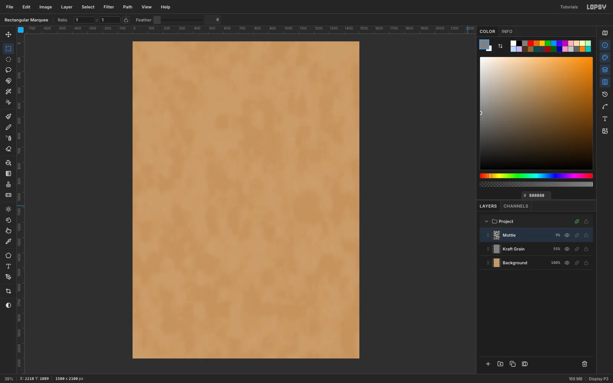

Choose **File → New**, set the unit to **Pixels**, and create a
**1500 × 2100** document. Marquee the whole page and **Edit → Fill** the
*Background* with kraft `#C29A6B`.

Rename *Layer 1* to *Kraft Grain*:

1. Fill it with grey `#808080`.
2. Run **Filter → Add Noise**: Amount 80, **Mono**, **Gaussian**.
3. Run **Filter → Motion Blur**: Angle 8, Distance 14. This stretches the noise into paper fibres.
4. Set the layer to **Overlay** at **55%**.

Add a *Mottle* layer, run **Filter → Clouds** (Scale 60), and set it to
**Soft Light** at only **9%**. Stronger mottle looks like camouflage, not
card.

## Draw the menorah

Click the rulers to add guides:

- a vertical guide at **750** (the centre line)
- horizontal guides at **509** (the cup line) and **1700** (the top of the type)

Add a **Menorah** group with a *Menorah Body* layer inside it, and set the
foreground to cream `#F3E8D2`.

1. **Arms:** draw each one as a thick half-ring with the **Lasso**, centred on (750, 509), with radii of about 113, 225, 338 and 451 px and 21 px thick. Fill each with **Edit → Fill**.
2. **Stem:** add a 28 px stem down the centre guide and a flared triangle base at the bottom.
3. **Cups:** add small trapezoid cups on the cup line.
4. **Candles:** draw each with a **Rectangular Marquee**, 30 px wide, spaced every 112.6 px. The centre *shamash* candle is about 62 px taller than the rest.

## Cut stencil bridges

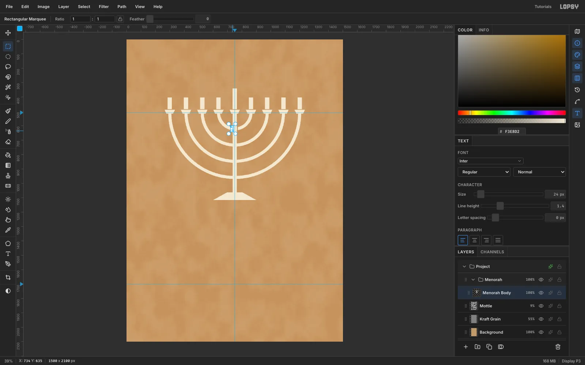

A real stencil can't hold a ring connected to a stem at every point, so
cutters leave gaps. With *Menorah Body* active, draw a **7 × 28 px**
marquee across each arm just beside the stem, on both sides, and press
**Delete**.

Eight small gaps make the shape read as cut cardboard instead of vector
art.

## Paint one flame and paste the rest

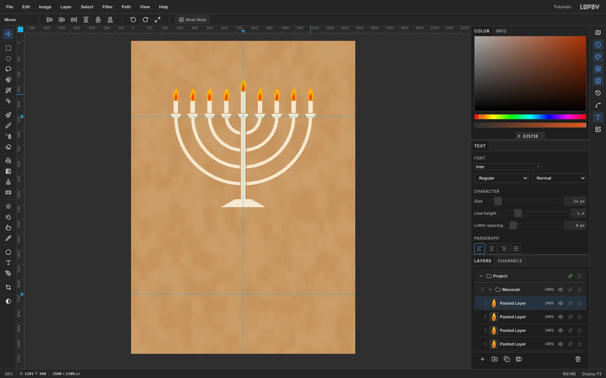

Add a *Flames* layer above the body. On the leftmost candle:

1. Lasso a teardrop flame about 37 × 88 px and fill it gold `#F6B31E`.
2. Lasso a smaller core inside it and fill it orange `#E2571E`.

To copy it along the row:

1. Marquee the flame, press **⌘C**, wait a second, then press **⌘V**. Lopsy pastes it in place on a new layer.
2. With the **Move** tool, drag the copy onto the next candle and fine-tune with the arrow keys.
3. Repeat, copying each new flame, until all nine candles are lit. Drop the centre flame 62 px higher onto the shamash.

## Scale the shamash flame and tilt two flames

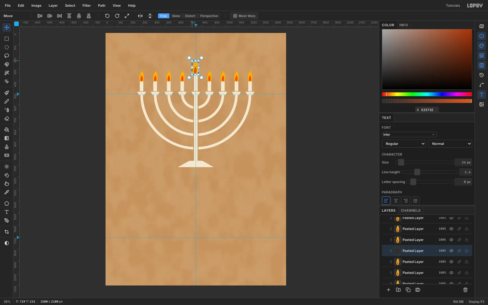

**Scale the shamash flame:**

1. Marquee the centre flame and switch to the **Move** tool.
2. Hold **⌘** and drag the top-left corner handle outward until the flame is about **22% larger**.
3. Press **⌘D** to commit, then nudge it back so it sits centred on the candle.

**Tilt two flames:** marquee the third and seventh flames one at a time and
drag just outside the top-right corner (the cursor becomes a crosshair) to
rotate them **−12°** and **+12°**. Press ⌘D after each.

To combine them, select the top pasted layer and choose **Layer → Merge
Down** eight times, which leaves one *Flames* layer.

## Add the flame glow and menorah overspray

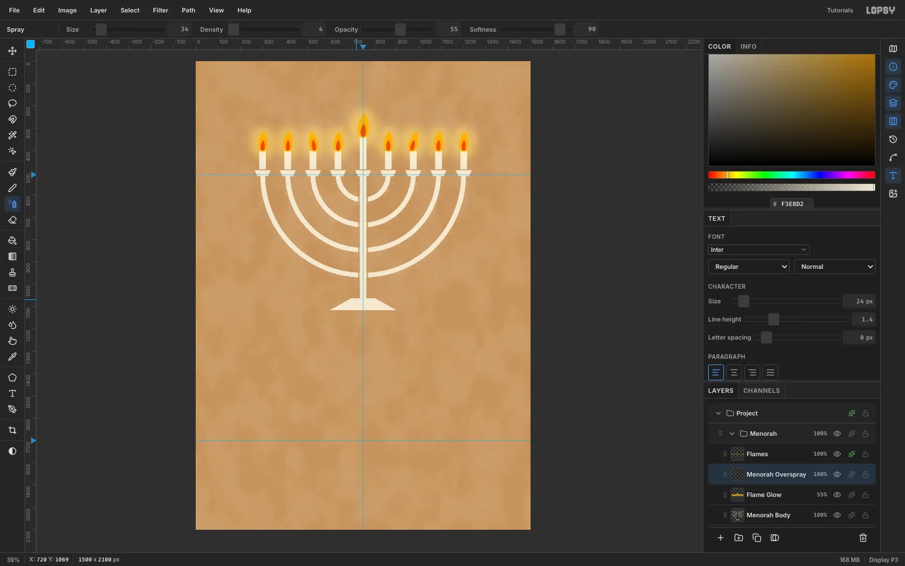

On *Flames*, open the layer effects and enable **Outer Glow**: gold
`#F6B31E`, Size 24, Spread 8, Opacity 60.

For a softer sprayed halo:

1. Add a *Flame Glow* layer below *Flames*.
2. Set the **Elliptical Marquee** Feather to **40**.
3. Fill a tall ellipse in gold around each flame.
4. Reset Feather to 0, then set the layer to **Screen** at **55%**.

Add a *Menorah Overspray* layer. Pick the **Spray** tool:

- Colour cream `#F3E8D2`
- Size 34, Density 4, Opacity 55, Softness 90

Drag it once along the outside of each arm and down the stem. The fine
speckle stops the menorah looking like clean vector art.

## Block in the quokka silhouette

Create a **Quokka** group above the Menorah group and add a *Fur* layer.
Fill every silhouette piece in fur brown `#6A4A36` with the **Lasso**:

- two small ears, about 42 px radius, half tucked behind the head at the sides
- a pear-shaped head, narrow at the crown and widest at the cheeks
- a round, hunched body
- two long flat feet
- a tail that tapers to a point on the right

Because the menorah is underneath, its arms now frame the head like a halo.

## Add the shadow pass

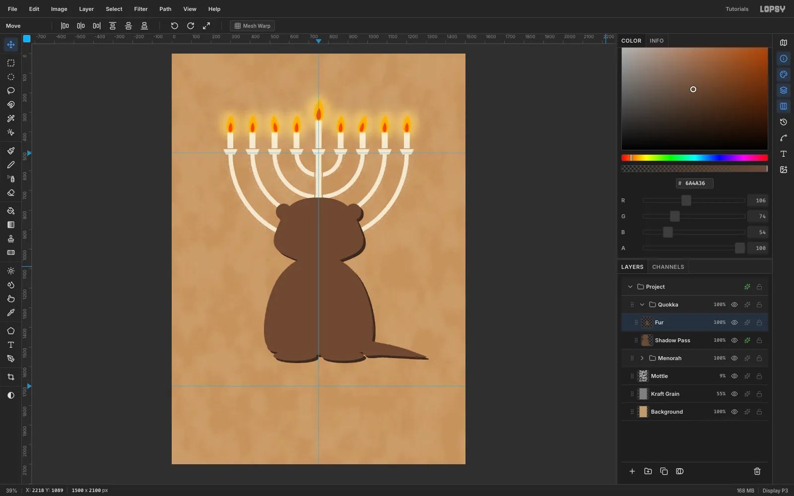

A second, darker stencil layer that is slightly offset gives stencils
their depth.

1. With the Move tool active, choose **Layer → Duplicate Layer** and rename the copy *Fur Top*. Lopsy nudges duplicates **+10/+10**, so move the copy back until it lines up with the original.
2. Rename the original (below) *Shadow Pass*.
3. Give *Shadow Pass* a **Color Overlay** effect in `#3A2A20`.
4. Nudge *Shadow Pass* **12 px right and 12 px down** with Shift+Arrow and Arrow.
5. Rename *Fur Top* back to *Fur*.

## Stencil the face

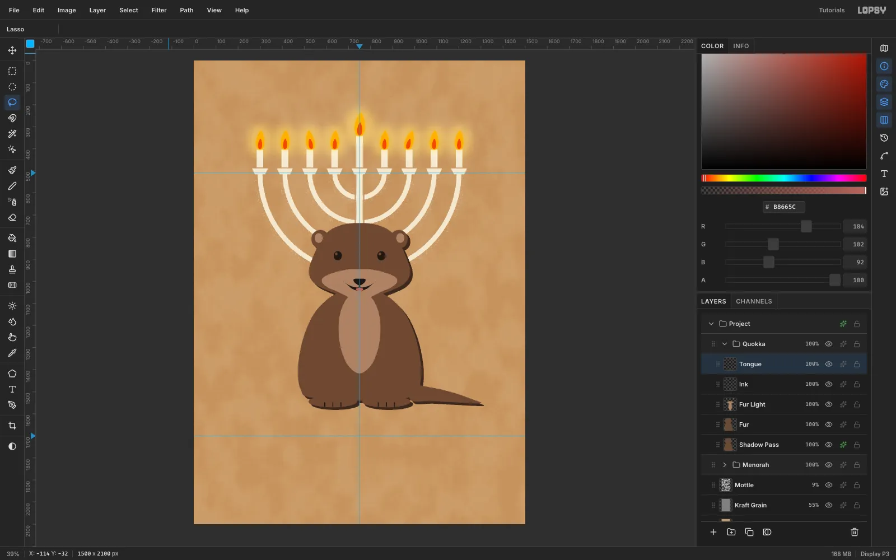

**Light fur.** Add a *Fur Light* layer and lasso-fill these in `#A88468`:

- the inner ears
- a light snout mask from the cheeks down to the chin
- a narrow chest blaze that tapers up into the chin

**Ink.** Add an *Ink* layer in `#1D1714`:

1. Fill the eyes, the nose, a short philtrum line and an upturned smile shape.
2. Cut a small ellipse out of each eye with **Delete**. These are the highlights, and they're bridges too.

**Tongue.** Add a *Tongue* layer:

1. Fill a small `#B8665C` ellipse.
2. Lasso the mouth shape, choose **Select → Inverse** and press **Delete** so the tongue stays inside the smile.

## Make the dreidel

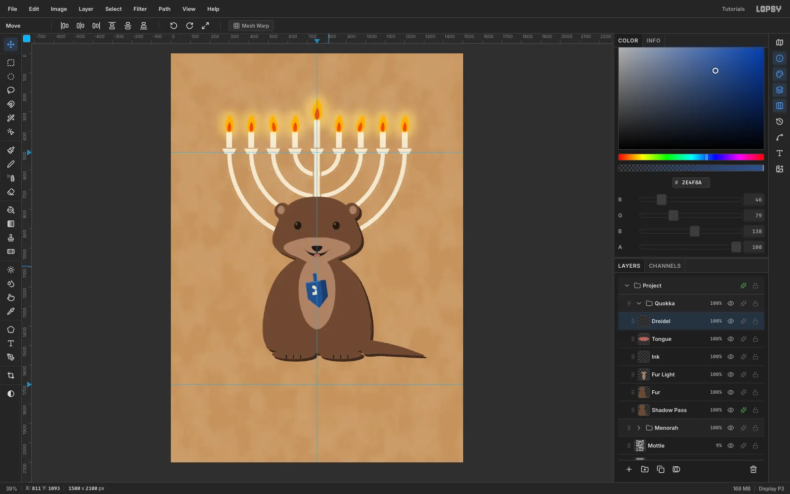

**Body.** On a new *Dreidel* layer, lasso-fill:

- the body and handle in `#2E4F8A`
- the right side face in `#223B69`
- a thin top edge in `#4A6CA6`

**Letter.** Type the Hebrew letter **נ** (nun) with the **Text** tool in
**Suez One**, Size 86, cream `#F1E4C8`. Paste it with ⌘V if your keyboard
can't type Hebrew.

1. Click **Rasterize Layer**.
2. Drag the letter onto the front face and **Merge Down**.
3. Fill a 4 px strip of dreidel blue across the letter. That's the stencil bridge.

**Tilt.** Marquee the dreidel, rotate it **−8°** with the rotate handle,
and press ⌘D.

## Add the arms and gelt

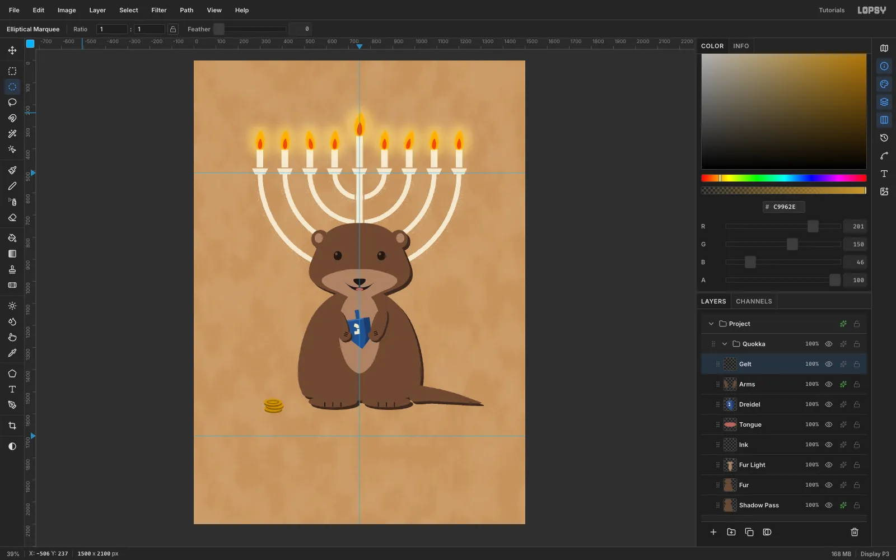

**Arms.** Add an *Arms* layer above the dreidel:

1. Fill two small forearms and paws in fur brown so they grip the dreidel's sides.
2. Add three short ink claw marks on each paw.
3. Give the layer a hard **Drop Shadow**: `#3A2A20`, Offset 7/7, Blur 0, Opacity 100. It matches the shadow pass.

**Gelt.** On a *Gelt* layer, stack three 80 × 30 px ellipses. Fill each one
twice:

- first in `#8A6418`, 7 px lower, for the coin edge
- then in `#C9962E` for the face

For an engraved ring on the top coin, fill a smaller ellipse in dark gold,
choose **Select → Shrink…** 3 px and fill again with the face colour. Nudge
the stack about 48 px right so it sits beside the foot.

## Spray overspray around the quokka

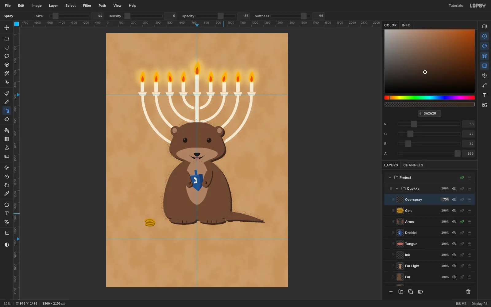

Add an *Overspray* layer at the top of the Quokka group. Set the **Spray**
tool:

- Colour `#3A2A20`
- Size 44, Density 6, Opacity 65, Softness 90

Softness is labelled backwards: 90 gives the hardest dots.

Drag slow passes that hug the whole outline: around the head, down both
sides of the body and along the tail. Then drop the layer to **75%**.
Overspray on every side reads as paint. On only one side it looks like a
mistake.

## Set the type

Add a **Type** group above the Quokka group, with a raster *Tape* layer
inside it to anchor new text. Create each line in empty canvas, click
**Align center horizontally**, then nudge it vertically with
Shift+Arrow:

- **HANUKKAH:** Stardos Stencil Bold, 180 px, `#F1E4C8`, letter spacing 0. Glyph top at 1810.
- **HAPPY:** the same font at 106 px with **23 px** letter spacing. Glyph top at 1688, which leaves about 40 px above HANUKKAH.
- **חג אורים שמח** ("Happy Festival of Lights"): Suez One, 104 px, pasted from the clipboard. Glyph top at 84, with letter spacing at **0** (letter spacing garbles right-to-left text).

## Misregister the print

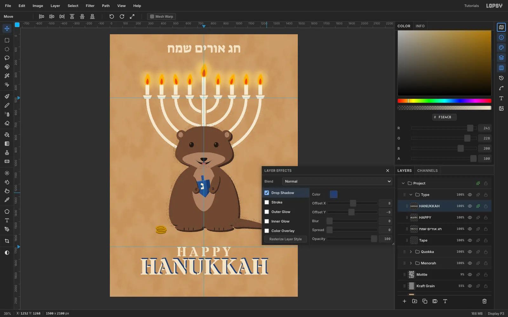

Select each text layer and enable **Drop Shadow**:

- Colour print blue `#243E73`
- Offset X **8**, Offset Y **−8**
- Blur 0, Spread 0, Opacity 100

Offsetting up and to the right in a second colour reads as a misaligned
screen pass, not a shadow.

## Drip the paint and dust the type

**Drips.** Add a *Drips* layer under HANUKKAH. With a hard round
**Brush** (8–11 px) in cream, drag five short drips straight down from
letter stems: under the first H, the A, the N, a K and the last A. Give them
lengths between 22 and 50 px, and finish each one with a small filled circle.
Keep them in the letter colour so they don't read as dark tips.

**Speckle.** Add a *Type Overspray* layer and run the cream Spray (Size 34,
Density 4) once along the top and bottom of HANUKKAH and over HAPPY.

## Tape down the corners

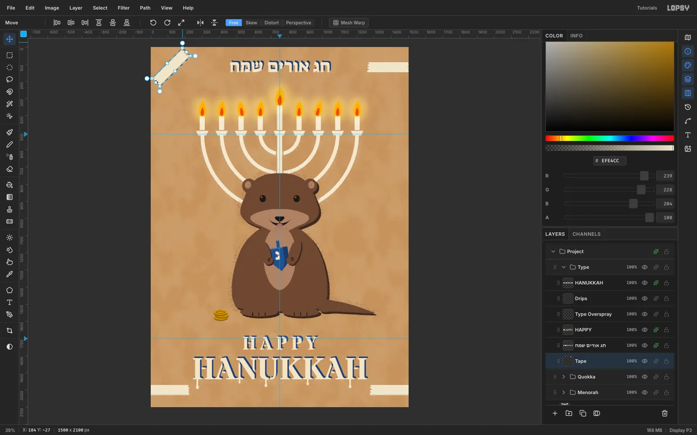

On the *Tape* layer, lasso four 240 × 58 px strips of `#EFE4CC` with
zig-zag torn ends, centred on:

- (118, 118) and (1382, 118)
- (102, 2000) and (1398, 2000)

Rotate each strip in turn: marquee it, switch to **Move**, drag the rotate
handle **±45°**, and press ⌘D. Set the layer to **72%** and add a soft Drop
Shadow (`#3A2A20`, 2/3, Blur 4, 30%). Keep the bottom strips well clear of
the first and last H.

## Add the edition label and registration marks

**Edition label.**

1. Type *NO. 5787 · 8 NIGHTS* in **Allerta Stencil**, 36 px, letter spacing 6, print blue `#243E73`.
2. Click **Rasterize Layer**, marquee it and rotate it **−90°** with the rotate handle. Press ⌘D.
3. Move it to x 1418 so its bottom lines up with HAPPY's baseline.

**Registration marks.** On a *Registration* layer, draw two marks in
`#1D1714` at (58, 1050) and (1442, 1050):

1. Fill a 36 px circle, then **Select → Shrink…** 4 px and press Delete to leave a ring.
2. Add two 60 × 3 px marquee fills to make the crosshair.
3. Set the layer to 70%.

Hide the guides, then **File → Quick Export PNG**. Save the project too:
it reopens pixel-identical.
