A real multi-layer stencil is cut as a few flat sheets, one per ink, and
sprayed one after another. The sheets never line up perfectly, so each ink
sits a few pixels off the one below. In this tutorial you'll fake that look
on a 1800 × 720 billboard for an imaginary late-night jazz series,
**Xylophone Nocturne**.

You'll build a plywood hoarding with a stage-light glow and a halftone
crescent moon. Then you'll cut a xylophone with stencil bridges and a black
cat sitting on it, and set dripping stencil type. On the way you'll use
gradients, **Quick Mask**, filters, the Spray tool, lasso and marquee
selections, groups, copy and paste, transforms, layer effects and blend
modes.

The whole piece uses four inks on a navy wall:

- Ink `#0E0B1A`
- Cream `#F2E6C8`
- Hot pink `#FF2E88`
- Teal `#19C7B4`

## Create the billboard document

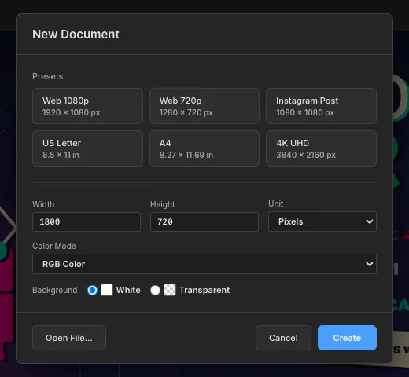

Open [Lopsy](/) and choose **File → New**. Set **Width** `1800` and
**Height** `720` in pixels, choose a **White** background and click
**Create**. At 2.5:1 it has the long, low shape of a roadside billboard.

## Set up a night-sky gradient

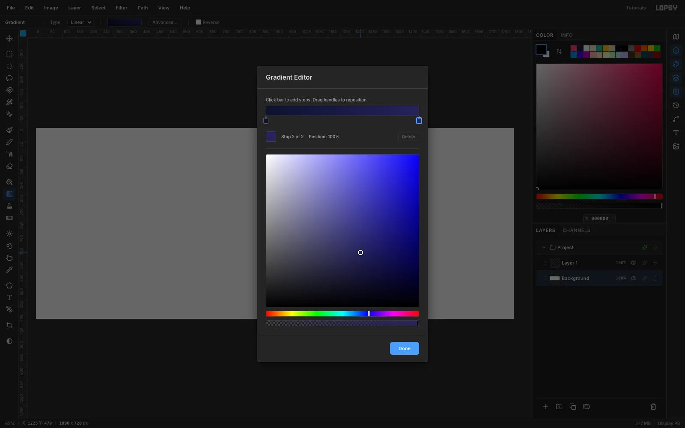

Click the **Background** row and pick the **Gradient** tool. It has no
keyboard shortcut, so pick it from the toolbox. Set **Type** to **Linear**
and click **Advanced…**. Click the left stop and use the hue strip and color
square to pick a deep navy (about `#0E1230`). Click the right stop and pick
a dusky violet (about `#2A2360`). Click **Done**.

## Drag the sky

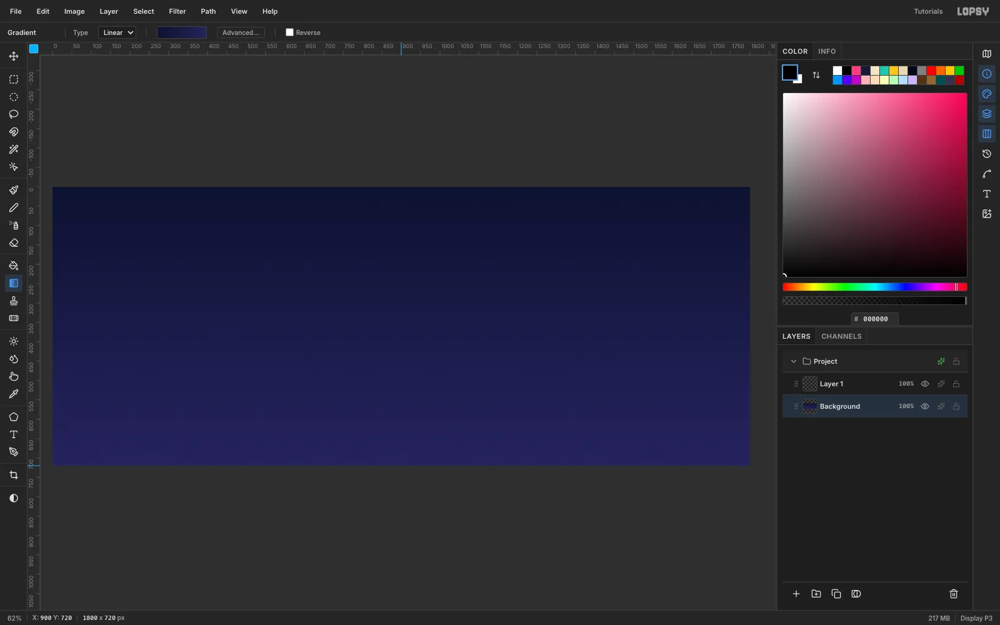

Drag straight down from the top edge of the canvas to the bottom edge. The
top is darkest, as the sky would be, and the bottom glows a little violet.

## Add plywood grain with Fibers

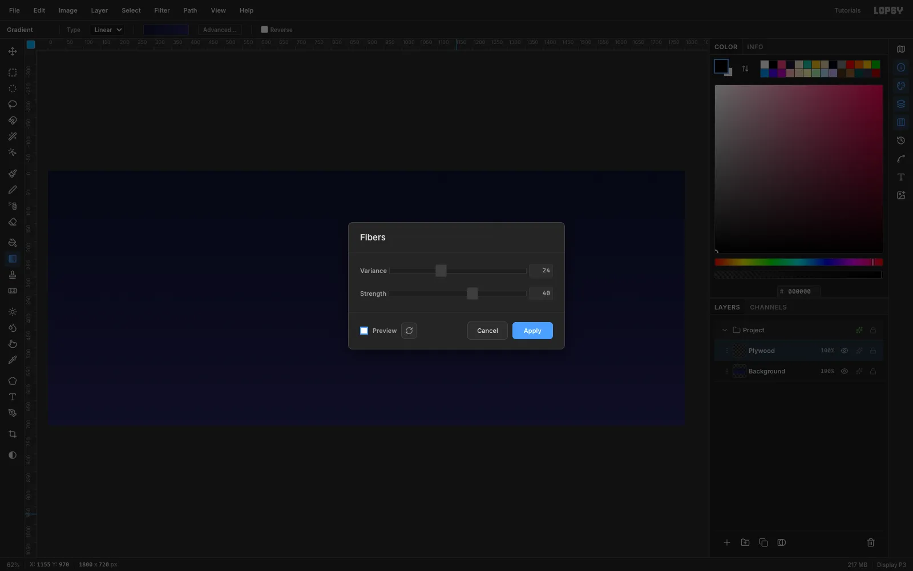

Double-click `Layer 1` and rename it `Plywood`. Choose **Filter → Fibers**
and set **Variance** `24` and **Strength** `40`, then click **Apply**. Open
the row's **Layer effects** (the sparkle button), set **Blend** to
**Overlay** and close the drawer. Then set the row's opacity to `35%`. The
grain now tints the sky instead of covering it.

## Place guides and cut the panel seams

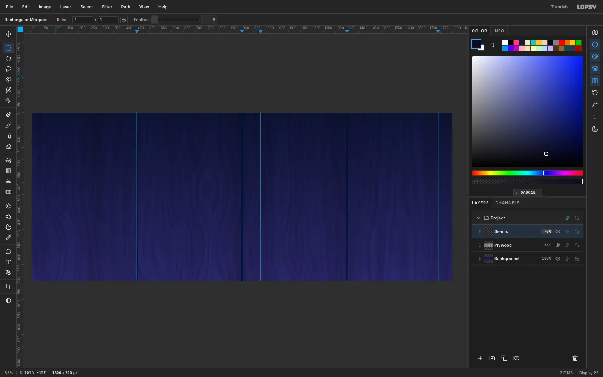

Click the top ruler at x `450`, `900` and `1350` to drop guides where the
plywood sheets meet. Add two more at `980` and `1740`: those are the left and
right edges of the type block.

Click **Add Layer** and name the layer `Seams`. With the **Rectangular
Marquee**, select a strip 6 px wide and the full canvas height centered on
each sheet guide. Fill each strip with `#0A0C1E` using **Edit → Fill**. Set
`Seams` to `70%`.

## Paint a radial selection in Quick Mask

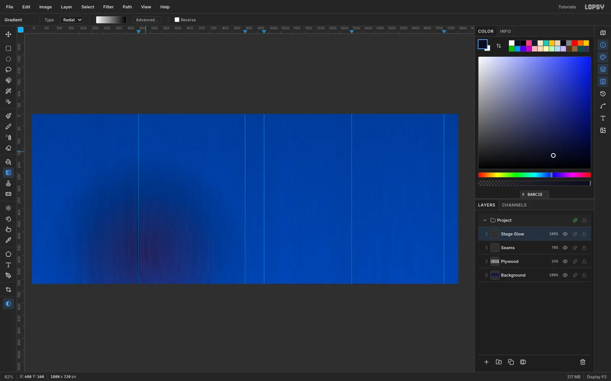

Click **Add Layer** and name it `Stage Glow`. Press [[Q]] to enter **Quick
Mask**. Pick the Gradient tool, switch **Type** to **Radial** and open
**Advanced…**. Set the left stop to white and the right stop to black. Then
drag from (480, 590) up to (480, 160).

In Quick Mask, white adds to the selection and black leaves it out. So this
paints a selection that is strongest behind where the xylophone will stand.

> **Tip:** The gradient's stop colors decide the mask. Dark stops (such as
> the sky colors) barely select anything, so always switch to white and
> black first.

## Fill the pink stage glow

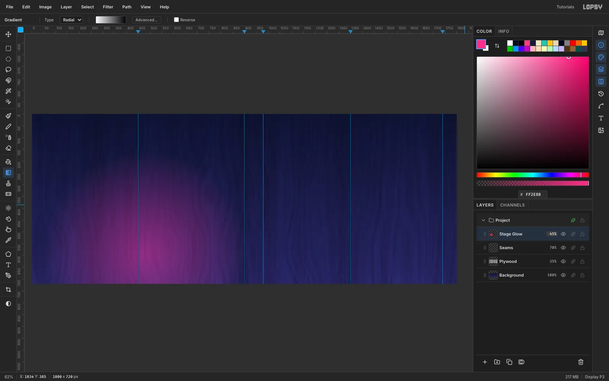

Press [[Q]] again to turn the painted mask into a selection. The marching
ants show where it passes 50%. Set the foreground to `#FF2E88`, choose
**Edit → Fill**, then press [[Cmd+D]] to deselect. Set the layer's **Blend**
to **Screen** and its opacity to `45%`. You get a soft pink spill of light,
like a stage lamp on the hoarding.

## Draw the moon disc

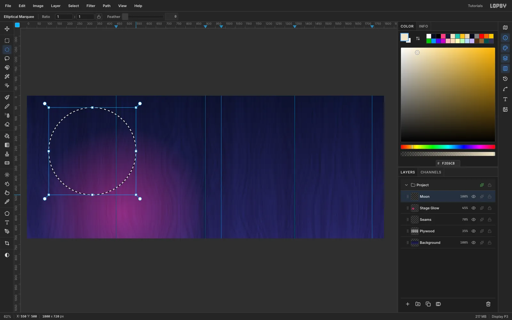

Click **Add Layer** and name it `Moon`. Set the foreground to `#F2E6C8`.
With the **Elliptical Marquee**, drag from (110, 60) to (550, 500), then
choose **Edit → Fill**.

## Cut the crescent and a stencil bridge

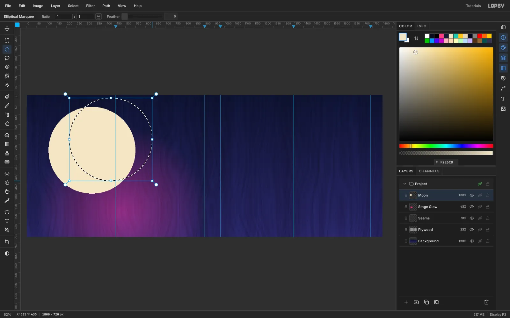

Draw a second ellipse from (215, 15) to (635, 435) and press
[[Delete]] to bite out the crescent. Then select a 5 px strip from (100, 318)
to (300, 323) and press [[Delete]] again.

That thin gap is a **stencil bridge**. A real cardboard stencil needs
bridges to hold its islands together, and those gaps are a big part of what
makes a piece read as sprayed.

## Give the moon a soft glow

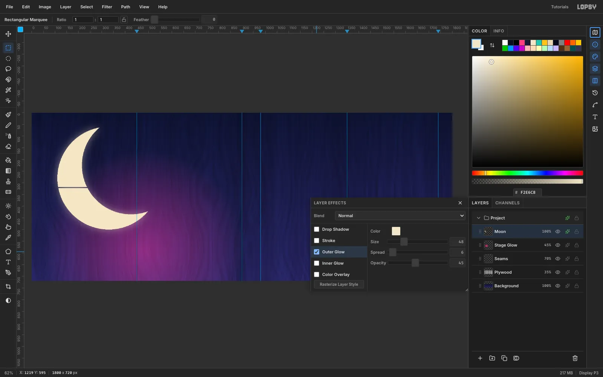

Press [[Cmd+D]], open the `Moon` row's **Layer effects** and tick **Outer
Glow**. Set the color to `#F2E6C8`, **Size** `48`, **Spread** `6` and
**Opacity** `45`.

## Halftone the moon's shading

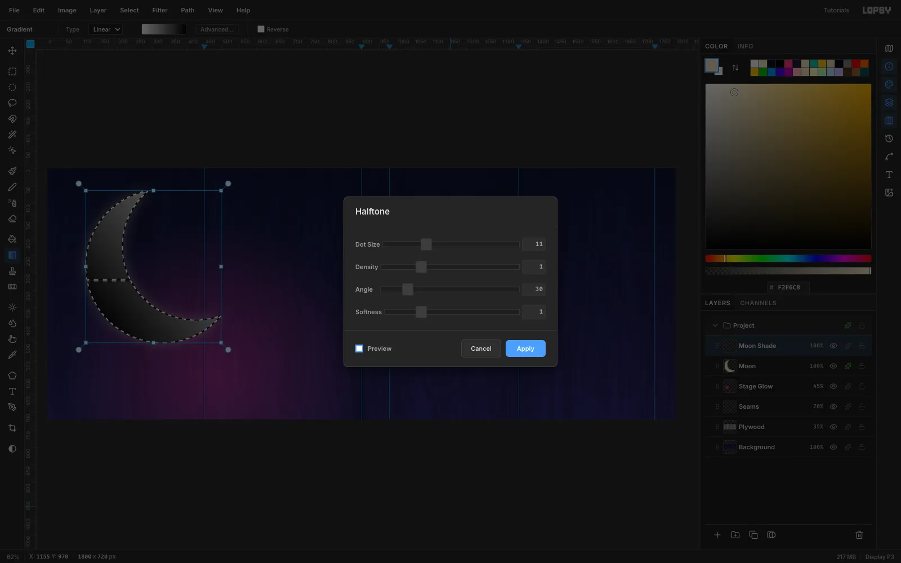

Pick the **Magic Wand**, untick **Contiguous** and click the crescent. That
selects both halves on either side of the bridge. Click **Add Layer** and
name it `Moon Shade`. Pick the Gradient tool with **Linear** type (the stops
are still white to black) and drag from (470, 120) to (120, 400) inside the
selection.

Then choose **Filter → Halftone**. Set **Dot Size** `11`, **Density** `1`,
**Angle** `30` and **Softness** `1`, and click **Apply**.

## Tint the dots pink

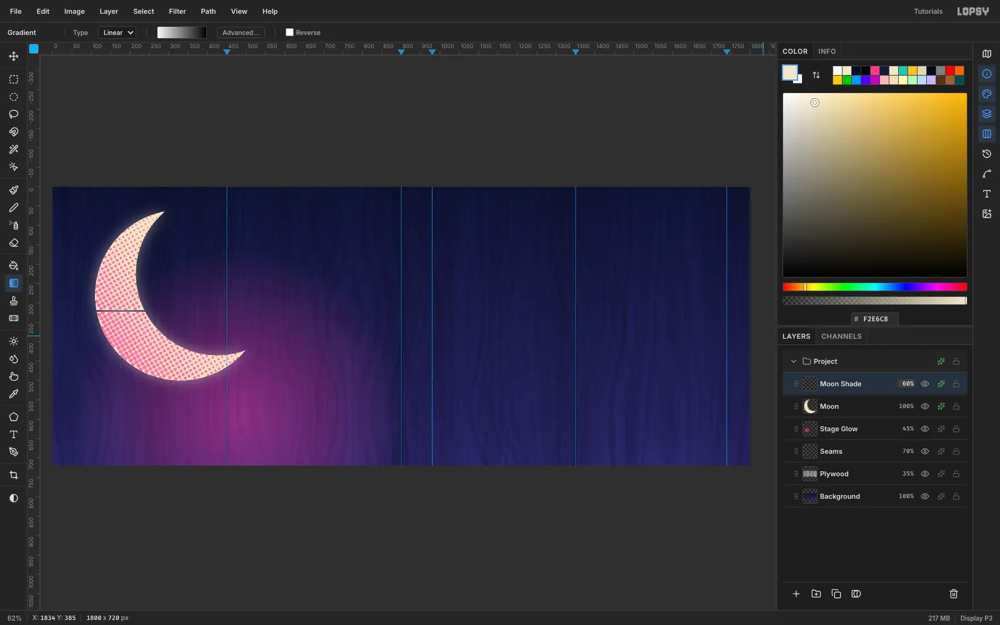

Press [[Cmd+D]]. Open `Moon Shade`'s effects, tick **Color Overlay** and set
it to `#FF2E88`. Then drop the layer to `60%`. The dots print like a
screen-printed tone over the cream.

## Spray the stars

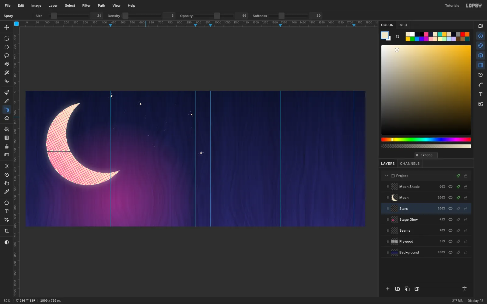

Click the `Stage Glow` row and add a layer named `Stars`. Pick the
**Spray** tool and set **Size** `34`, **Density** `14` and **Opacity** `75`.
Click once each at (610, 70), (880, 125), (455, 28) and (930, 330). Give
each one a hard core by filling an 8 × 8 ellipse at its center. Then drop
the spray to Size `24` and Density `3`, and click a few times across the
sky for stray paint dust.

## Start the xylophone group with rails

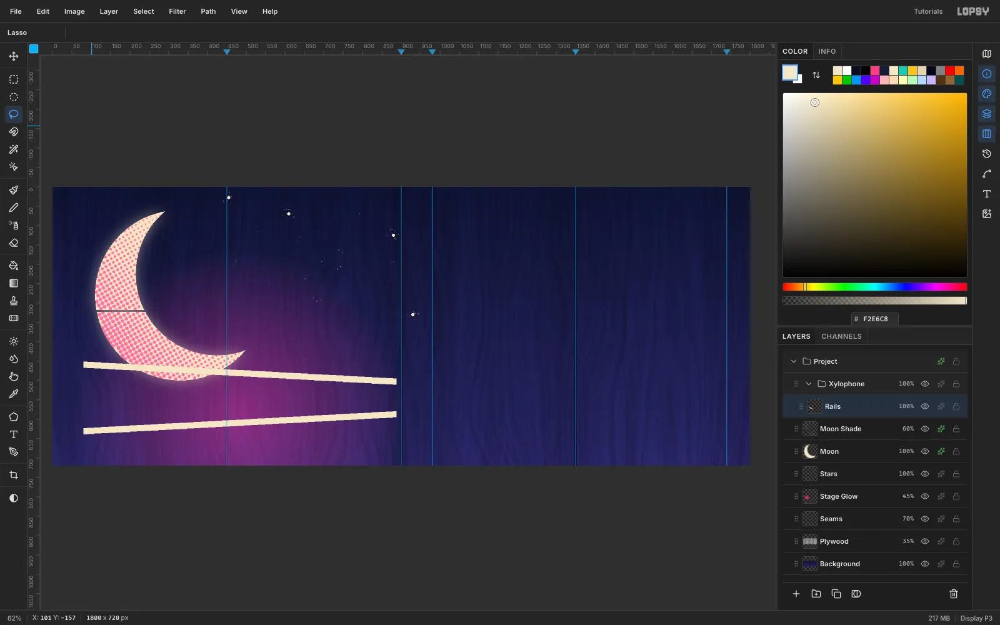

Click `Moon Shade`, then click **New Group** and name the group
`Xylophone`. Everything for the instrument goes inside it.

Add a layer named `Rails`. With the **Lasso**, click four corners for a
16 px-tall rail sloping from (80, 459) to (888, 503) and fill it with cream.
Then do a second rail from (80, 631) to (888, 587). The rails slope
because the bars get shorter to the right.

## Fill the eight bars

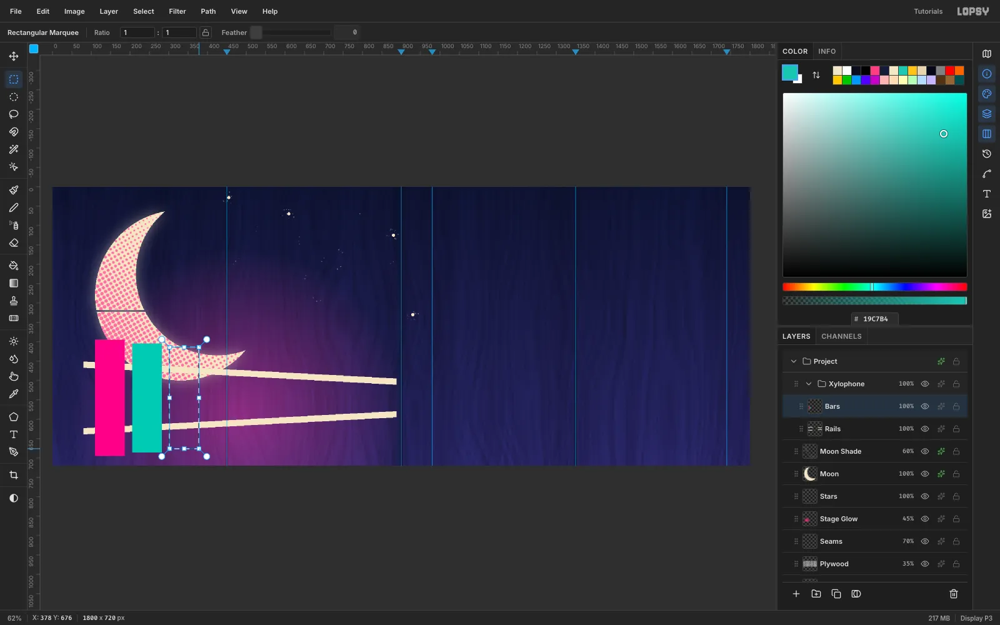

Add a layer named `Bars`. Each bar is 76 px wide with a 20 px gap, starting
at x `110`, and centered on y `545`. The heights step down from `300` to
`170`: 300, 281, 263, 244, 226, 207, 189, 170. Marquee each bar and fill it,
cycling pink, teal and cream from left to right.

## Punch cord holes and stencil bridges

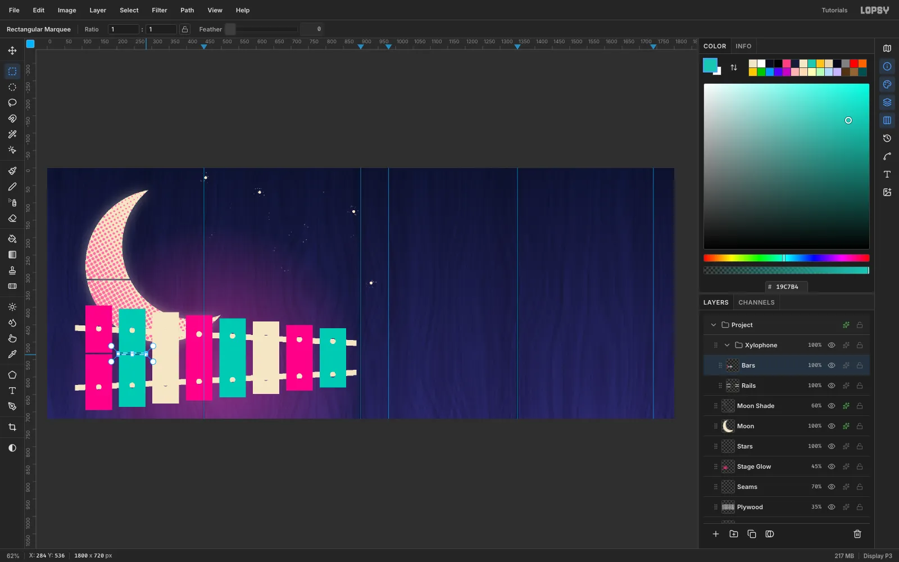

Where each bar crosses a rail, draw a 16 × 16 ellipse on the bar's center
line and press [[Delete]]. Then cut a 5 px-tall bridge right across each
bar, 45% of the way down, and press [[Delete]] again. These bridges split
every bar into two stencil islands.

## Let a few bars drip

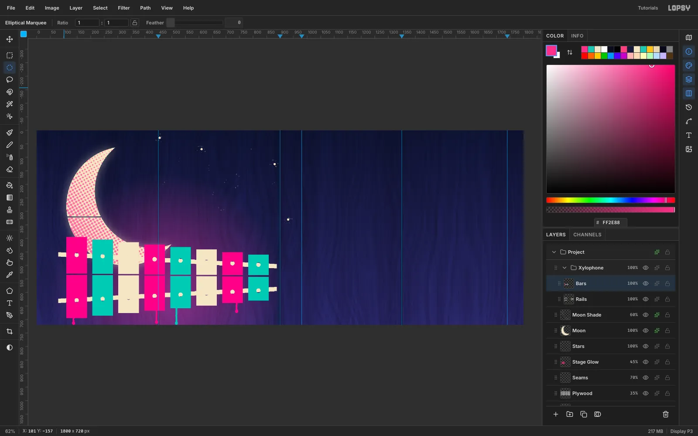

Press [[Cmd+D]]. Pick the **Brush** at **Size** `7` and **Hardness** `100`.
Draw straight lines 18–55 px long down from the bottom edge of bars 1, 4, 5
and 7, each in its bar's color. End each drip with a small filled ellipse
as the bead. Too much paint pooling at the bottom is the classic spray-can
tell.

## Make a misregistered key plate

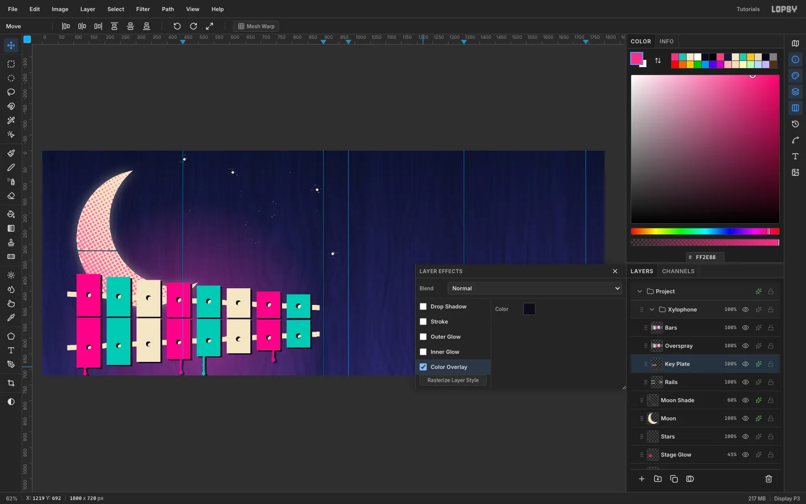

Switch to the **Move** tool and choose **Layer → Duplicate Layer** twice.
Each copy lands 10 px to the right, so press [[Shift+Left]] on each one to
line it back up. Rename the three layers, from the bottom up: `Key Plate`,
`Overspray` and `Bars`.

Click `Key Plate` and nudge it 6 px right and 4 px down with the arrow
keys. Then add a **Color Overlay** of `#0E0B1A`. It reads as a black
stencil sheet that was sprayed slightly out of line.

## Blur the overspray

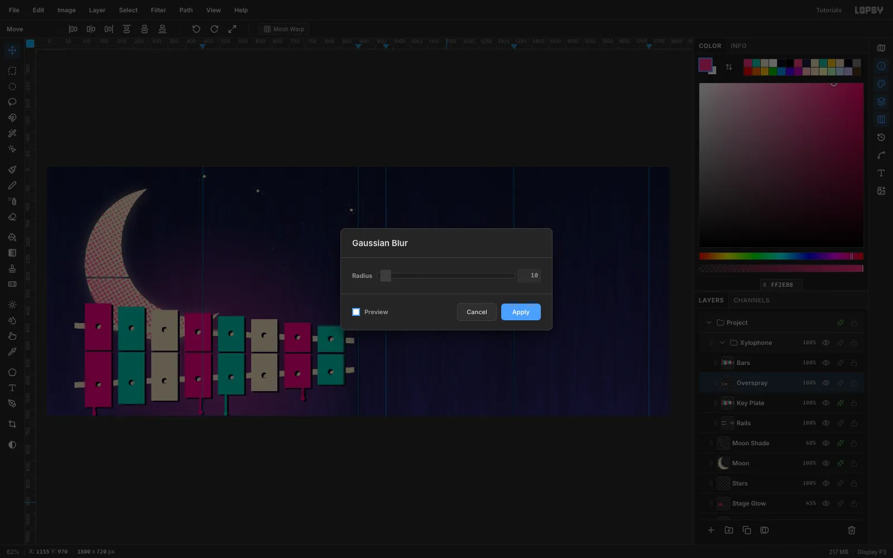

Click `Overspray` and choose **Filter → Gaussian Blur**. Set **Radius**
`10`, click **Apply**, and drop the layer to `55%`. The soft halo sits just
under the crisp bars, like paint that drifted past the stencil edge.

## Spray speckles past the edges

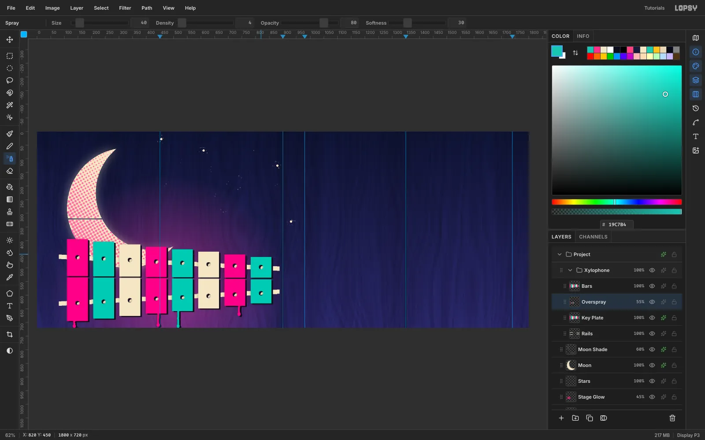

Still on `Overspray`, pick the Spray tool at **Size** `40`, **Density** `4`
and **Opacity** `80`. Click once or twice near the top corners of each bar
in that bar's color. Keep it sparse: a few flecks sell the effect.

## Lasso a sitting cat

Click `Bars` and add a layer named `Cat`. With the **Lasso**, click round a
sitting cat facing right: its feet on top of the first bar at about (158,
395), and its pointed ears reaching up to y 220. Fill it with `#0E0B1A`. It
sits right in front of the moon, so the silhouette reads from across the
street.

## Add the tail and cut the eye

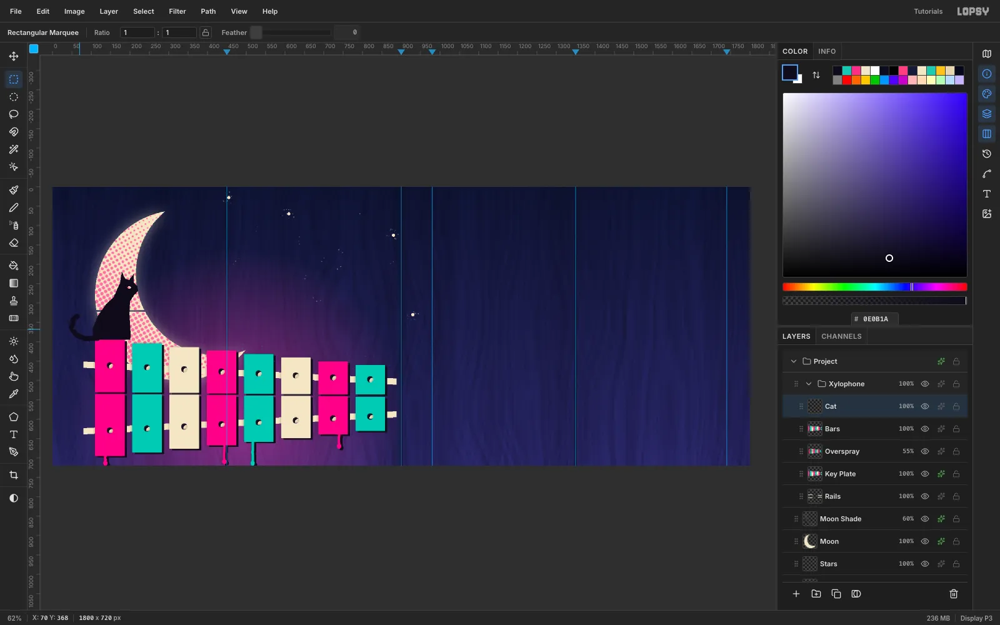

Paint the tail with the Brush at **Size** `14`, curling from the cat's rear
out to the left. Then cut the eye as a small 10 × 6 ellipse with
[[Delete]], so the moon shows through as a glint. Add one more 16 × 4
bridge across the tail.

## Draw and rotate the first mallet

Add a layer named `Mallet A`. Draw a cream 8 px Brush line straight down
from (786, 278) to (786, 460) and fill a teal 40 px ellipse at its bottom
end for the head. Do the same on `Mallet B` at x `757`, with a pink head.

Marquee `Mallet A` loosely, switch to the Move tool, and drag the rotate
handle just outside the box's top-right corner 40° clockwise. Press
[[Cmd+D]] to commit.

## Cross the mallets

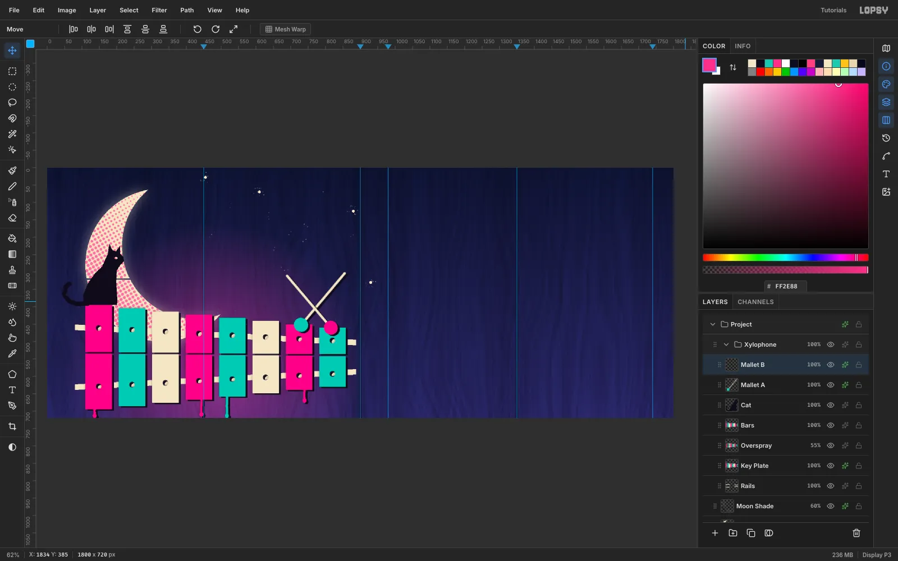

Rotate `Mallet B` 40° the other way so the handles cross in an X and each
head rests on one of the last two bars. Give both mallets a **Drop Shadow**
of `#0E0B1A`, **Offset X** `6`, **Offset Y** `4`, **Blur** `0` and
**Opacity** `100`. That matches the key-plate offset.

## Draw an eighth note

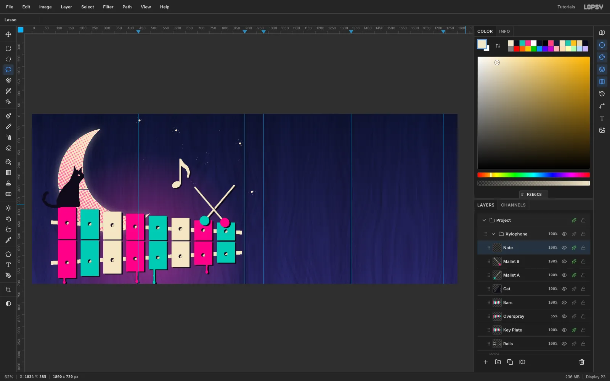

Add a layer named `Note`. Lasso a tilted oval head at about (610, 300) and
fill it cream. Marquee a 7 × 108 stem up from its right side, then lasso
the curved flag. Give it the same hard black Drop Shadow (5, 4).

## Copy and paste a second note

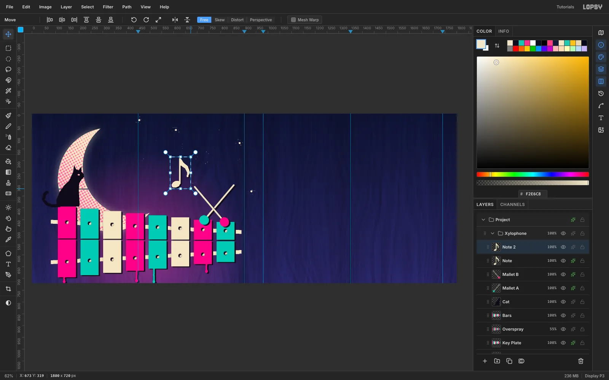

Marquee the note, press [[Cmd+C]] and then [[Cmd+V]]. The paste lands in
place on a new layer: rename it `Note 2`. Marquee it again and drag it up
and to the left, to about (520, 80). Press [[Cmd+D]].

## Scale the pasted note

Marquee `Note 2` again and hold [[Cmd]] while you drag its bottom-right
corner handle inward to about 75%. Holding [[Cmd]] keeps the proportions.
Press [[Cmd+D]].

## Rotate and recolor it

Marquee it once more, rotate it 14° clockwise and press [[Cmd+D]]. Add a
**Color Overlay** of `#19C7B4` and the black Drop Shadow. Then tilt the
first note 12° the other way so the pair drifts up out of the mallets.

## Set the XYLOPHONE title

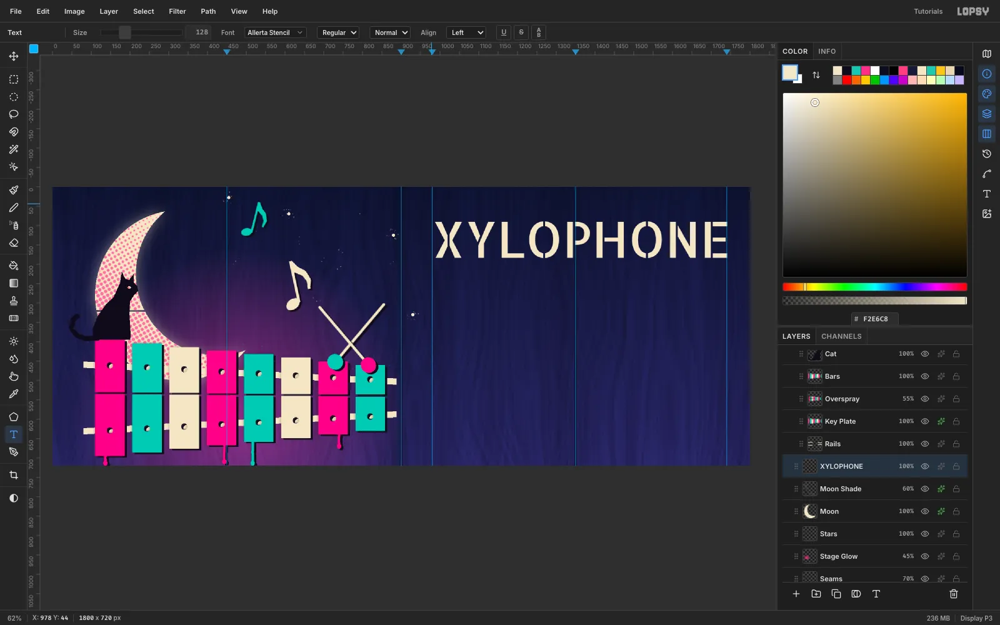

Click `Moon Shade` first. With a raster layer active, changing the text
options won't restyle an existing text layer. Pick the **Text** tool, set
**Size** `128` and the font to **Allerta Stencil**, and set the foreground
to cream. Click at (978, 44), type `XYLOPHONE` and press [[Tab]]. It spans
the two type guides, from about x 987 to 1740.

## Set NOCTURNE and stretch it to width

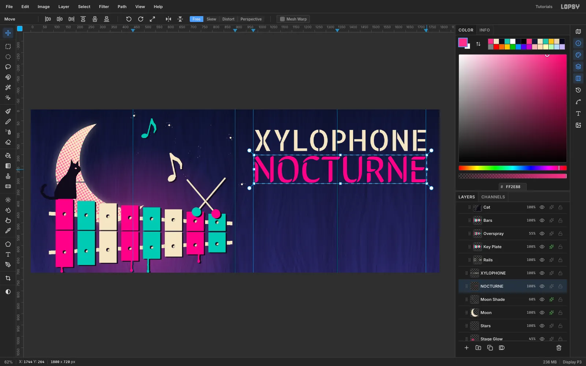

Click `Moon Shade` again. Set the font to **Sirin Stencil** at Size `165`
and the foreground to `#FF2E88`. Click in empty space lower down, type
`NOCTURNE` and press [[Tab]]. With the Move tool, nudge it up with
[[Shift+Up]] (10 px per press) and the arrow keys until its top sits 22 px
under XYLOPHONE and its left edge lines up at x 987.

Click **Rasterize Layer** in the Layers panel footer. Marquee the word and
drag the right-middle handle out to the 1740 guide. Press [[Cmd+D]]. The two
words now lock together as one block.

## Drip paint off the letters

On the rasterized `NOCTURNE` layer, use the 8 px pink Brush plus ellipse
beads to hang drips from the N, C, U and E. Make them different lengths,
from about 26 to 62 px.

## Misregister the title inks

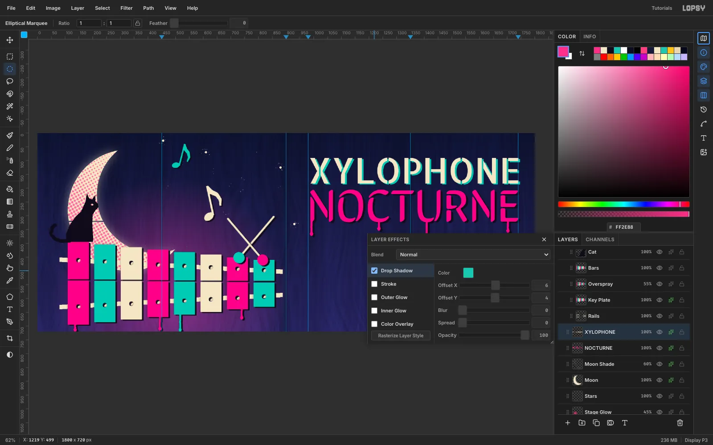

Give `NOCTURNE` a **Drop Shadow** of `#0E0B1A` at offset (7, 5), Blur `0`,
Opacity `100`. Give `XYLOPHONE` a teal `#19C7B4` shadow at (6, 4). Each word
now looks sprayed through two sheets that didn't quite line up.

## Add a rotated script tagline

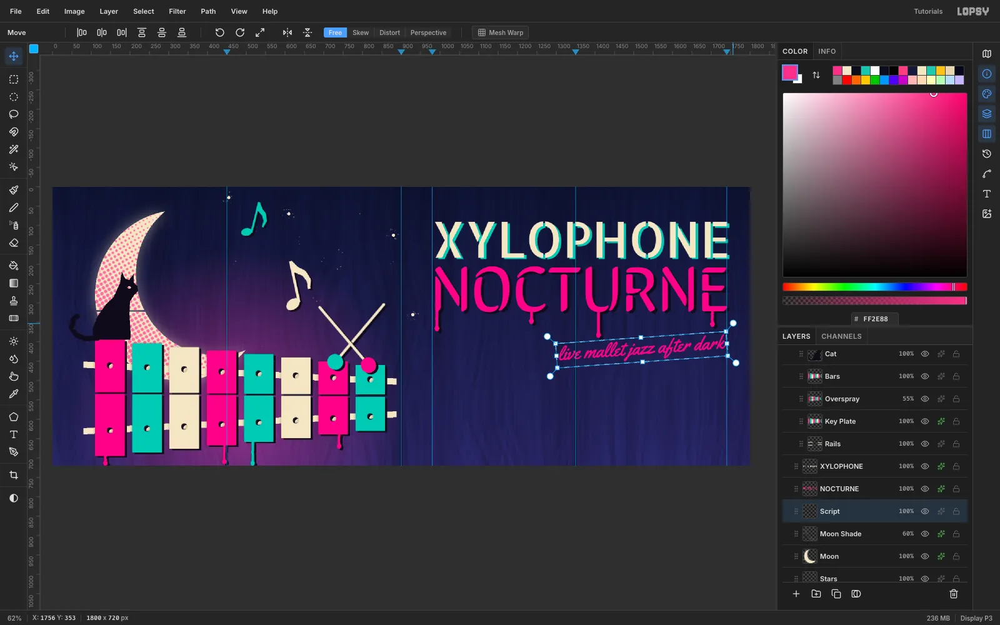

Click `Moon Shade`. Type `live mallet jazz after dark` in **Yellowtail**,
Size `50` and pink, somewhere in empty space. Rasterize it and rename it
`Script`. Move it under NOCTURNE so its right edge sits at x 1735. Then
marquee it, rotate it about 4° counter-clockwise and press [[Cmd+D]].

## Set the event details

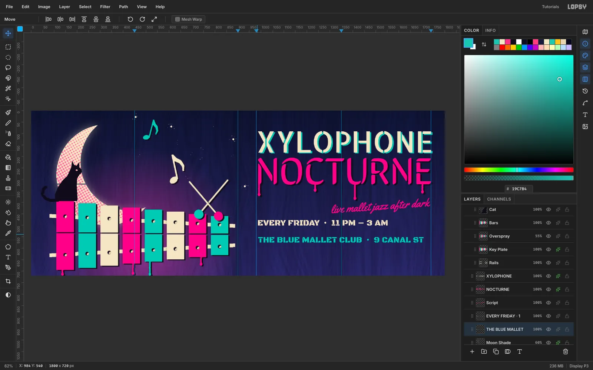

Use **Black Ops One** at Size `36`. Put `EVERY FRIDAY  ·  11 PM – 3 AM` in
cream at y ≈ 478, and `THE BLUE MALLET CLUB  ·  9 CANAL ST` in teal at y ≈
552. Nudge both so they start at x 987, and keep the right margin at least
60 px.

> **Tip:** A click inside an existing text layer's box edits that layer.
> Click for the second line well below the first, and paste characters like
> `·` and `–` with [[Cmd+V]].

## Marquee the ticket stub

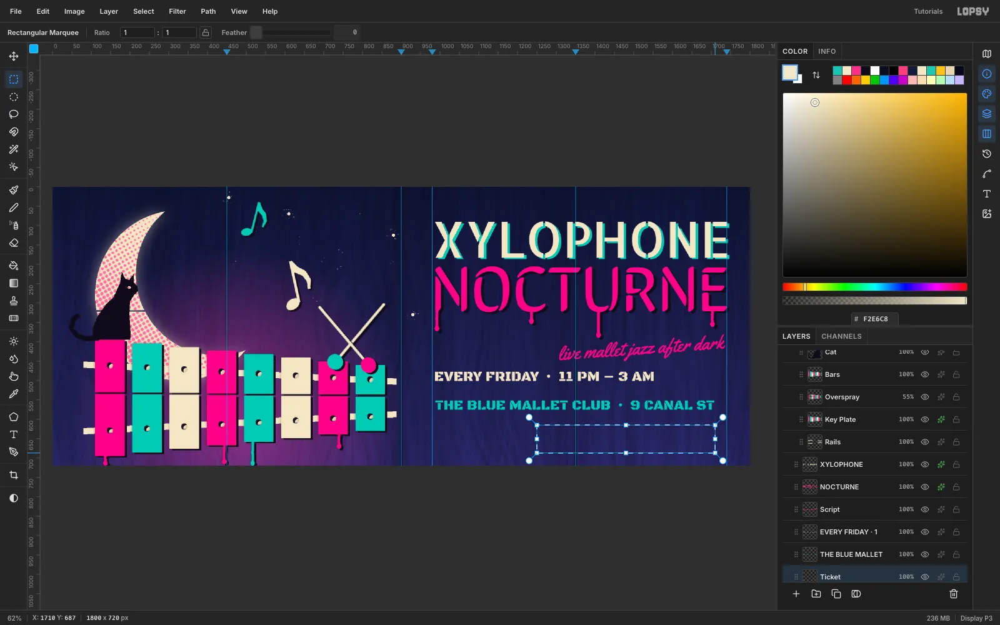

Click `Moon Shade`, add a layer named `Ticket`, and marquee (1250, 615) at
460 × 72. Fill it with cream.

## Cut the notches and perforation

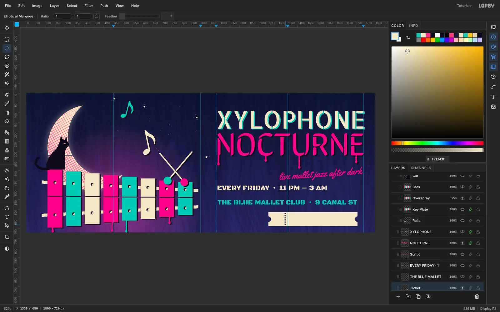

Delete a 28 × 28 circle centered on each short end for the notches. Then
delete a column of 6 × 6 circles every 11 px at x 1333 for the
perforation.

## Type on the ticket

With `Ticket` active, set `07` in pink Black Ops One at Size `30` on the
stub. Click **Rasterize Layer**, then **Layer → Merge Down**. Do the same
with `NO COVER  ·  CATS WELCOME` at Size `22` in `#0E0B1A`, centered between
the perforation and the right notch.

## Tilt the ticket

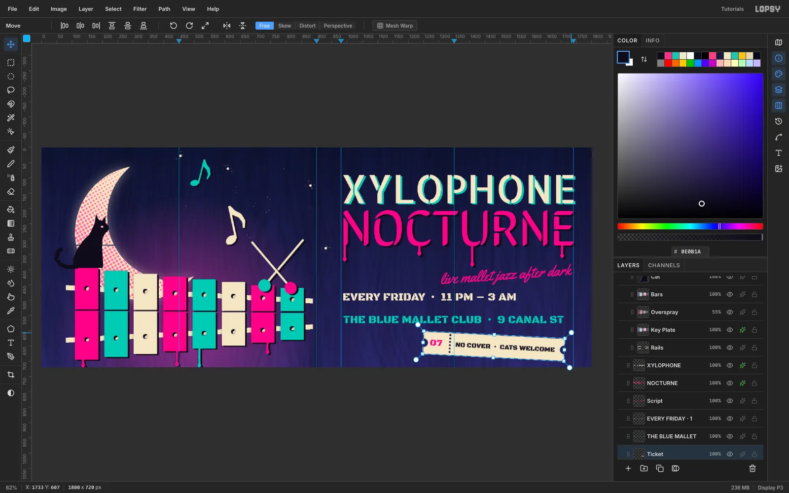

Marquee the ticket, rotate it 3° clockwise and press [[Cmd+D]]. Give it
the black key-plate Drop Shadow at (7, 5).

## Wear the paint with the Eraser

Click `Bars` and pick the **Eraser** at **Size** `16` and **Opacity** `45`.
Drag a few short scuffs across some of the bars. Weathered paint is what
stops the piece from looking freshly printed.

## Mottle the wall

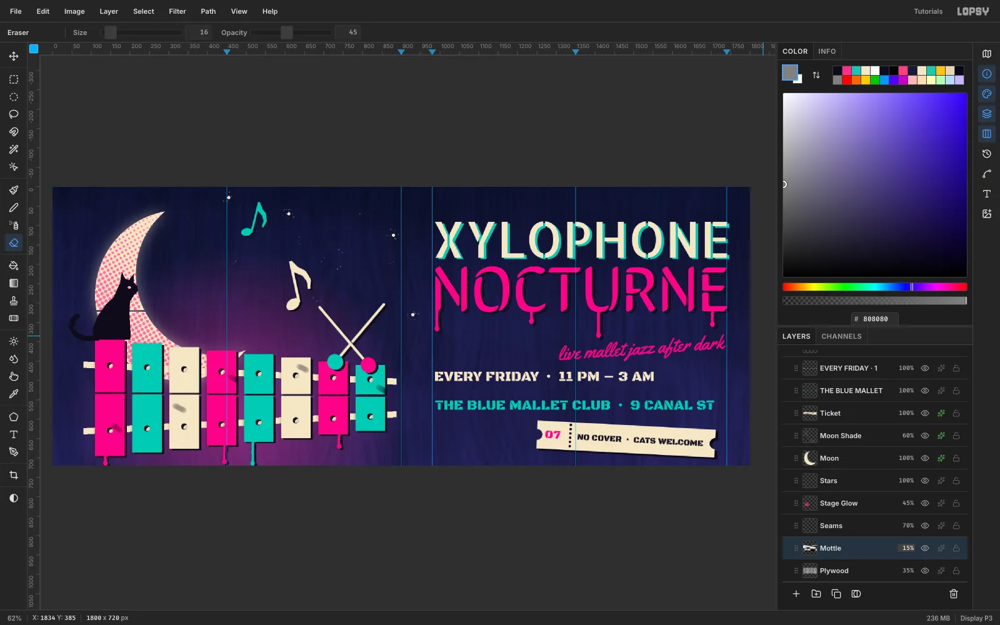

Click `Plywood` and add a layer named `Mottle`. Fill it with `#808080`,
choose **Filter → Clouds** at **Scale** `5`, set it to **Multiply** and
drop it to `15%`. It adds uneven grime to the plywood.

## Make a grain layer

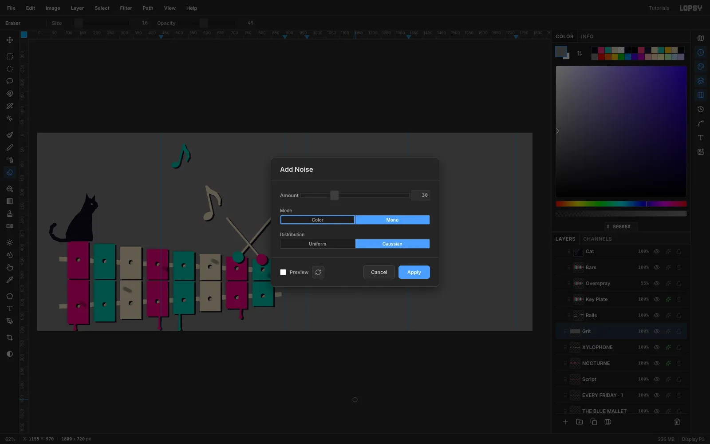

Click `XYLOPHONE` and add a layer named `Grit`. Fill it with `#808080`,
then choose **Filter → Add Noise…** with **Amount** `30`, **Mono** and
**Gaussian**. Click **Apply**, then set it to **Overlay** at `40%`.

## Drag the grit over everything

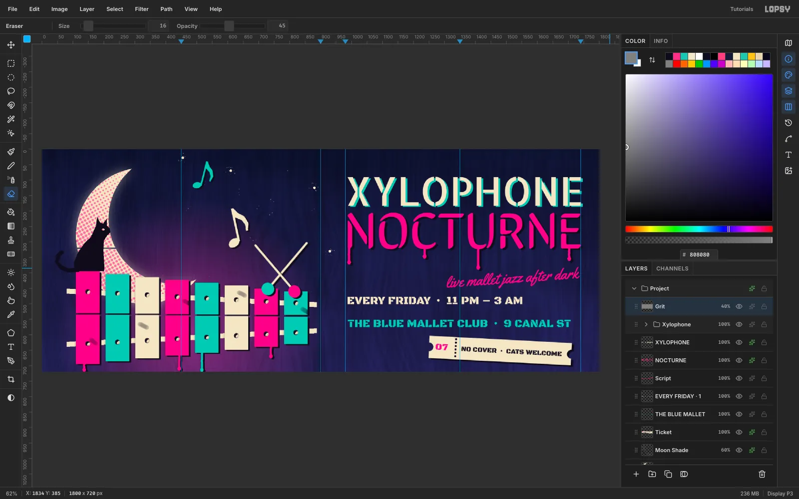

Collapse the `Xylophone` group with its arrow. Then drag `Grit` by its grip
handle up above the group row. The fine grain now runs over the paint as
well as the wall, so everything looks sprayed onto the same rough surface.

## Save and export

Choose **File → Save Project** to keep an editable `.lopsy` file, then
**File → Quick Export PNG** for the finished billboard. For more spray-can
techniques, try the [stencil street art billboard](/tutorials/stencil-street-art-billboard/).
