A real multi-layer stencil is cut as a few flat sheets, one per ink, and
sprayed one after another. The sheets never line up perfectly, so each ink
sits a few pixels off the one below. In this tutorial you'll fake that look
on a 1800 × 720 billboard for an imaginary late-night jazz series,
**Xylophone Nocturne**.

You'll build a plywood hoarding with a stage-light glow and a halftone
crescent moon. Then you'll cut a xylophone with stencil bridges and a black
cat sitting on it, and set dripping stencil type. On the way you'll use
gradients, **Quick Mask**, filters, the Spray tool, lasso and marquee
selections, groups, copy and paste, transforms, layer effects and blend
modes.

The whole piece uses four inks on a navy wall:

- Ink `#0E0B1A`
- Cream `#F2E6C8`
- Hot pink `#FF2E88`
- Teal `#19C7B4`

## Create the billboard document

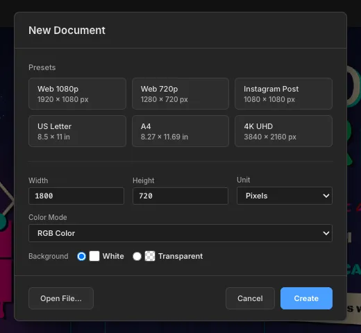

Open [Lopsy](/) and choose **File → New**. Set **Width** `1800` and
**Height** `720` in pixels, choose a **White** background and click
**Create**. At 2.5:1 it has the long, low shape of a roadside billboard.

## Set up a night-sky gradient

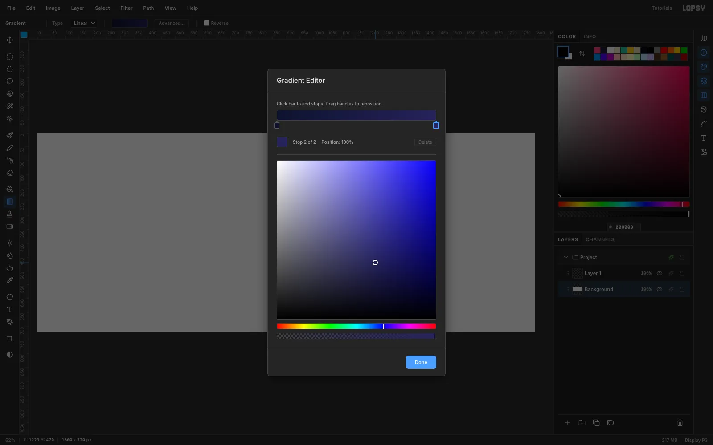

Click the **Background** row and pick the **Gradient** tool. It has no
keyboard shortcut, so pick it from the toolbox. Set **Type** to **Linear**
and click **Advanced…**. Click the left stop and use the hue strip and color
square to pick a deep navy (about `#0E1230`). Click the right stop and pick
a dusky violet (about `#2A2360`). Click **Done**.

## Drag the sky

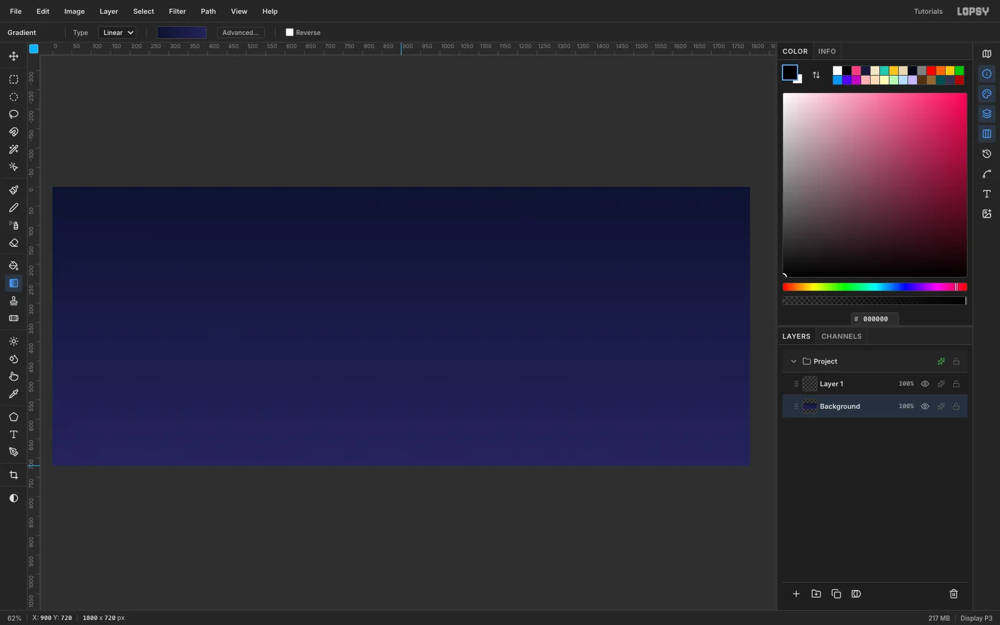

Drag straight down from the top edge of the canvas to the bottom edge. The
top is darkest, as the sky would be, and the bottom glows a little violet.

## Add plywood grain with Fibers

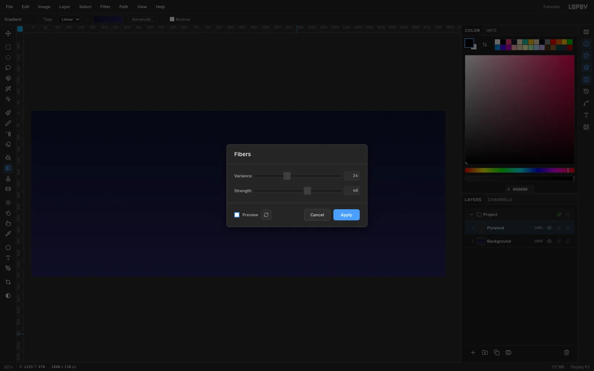

Double-click `Layer 1` and rename it `Plywood`. Choose **Filter → Fibers**
and set **Variance** `24` and **Strength** `40`, then click **Apply**. Open
the row's **Layer effects** (the sparkle button), set **Blend** to
**Overlay** and close the drawer. Then set the row's opacity to `35%`. The
grain now tints the sky instead of covering it.

## Place guides and cut the panel seams

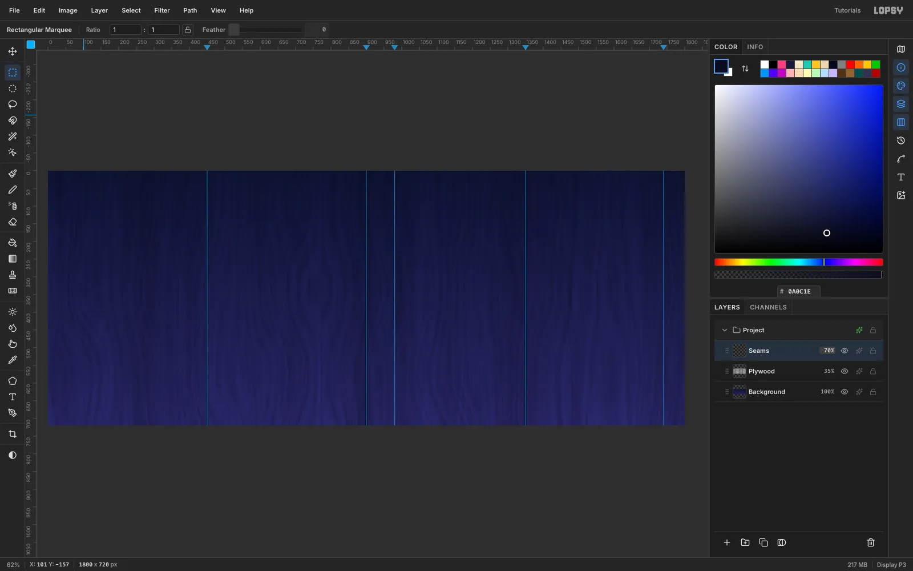

The plywood comes in four equal sheets. [[Cmd]]-click the top ruler at a
quarter, half and three quarters of the way across. [[Cmd]] snaps each guide
to that exact fraction. Then plain-click two more guides for the type block:
one a little right of the centre guide (about 980 px) for its left edge, and
one about 60 px in from the right edge for its right edge.

Click **Add Layer** and name the layer `Seams`. Pick the **Pencil** ([[N]])
at **Size** `6` with the foreground set to `#0A0C1E`. For each of the three
sheet guides, click on the guide at the top edge, then hold [[Cmd+Shift]] and
click on it at the bottom edge for a straight vertical seam. Set `Seams` to
`70%`.

## Paint a radial selection in Quick Mask

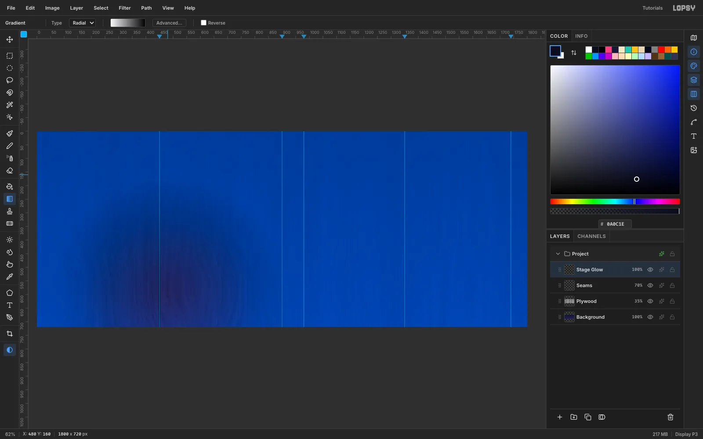

Click **Add Layer** and name it `Stage Glow`. Press [[Q]] to enter **Quick
Mask**. Pick the Gradient tool, switch **Type** to **Radial** and open
**Advanced…**. Set the left stop to white and the right stop to black. Then
start just right of the first guide, about 130 px above the bottom edge, and
drag straight up to about 160 px from the top.

In Quick Mask, white adds to the selection and black leaves it out. So this
paints a selection that is strongest behind where the xylophone will stand.

> **Tip:** The gradient's stop colors decide the mask. Dark stops (such as
> the sky colors) barely select anything, so always switch to white and
> black first.

## Fill the pink stage glow

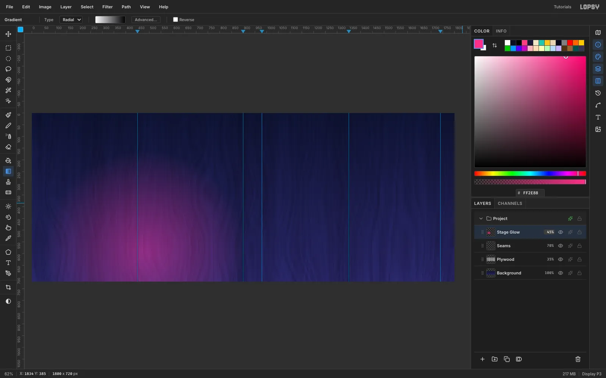

Press [[Q]] again to turn the painted mask into a selection. The marching
ants show where it passes 50%. Set the foreground to `#FF2E88`, choose
**Edit → Fill**, then press [[Cmd+D]] to deselect. Set the layer's **Blend**
to **Screen** and its opacity to `45%`. You get a soft pink spill of light,
like a stage lamp on the hoarding.

## Draw the moon disc

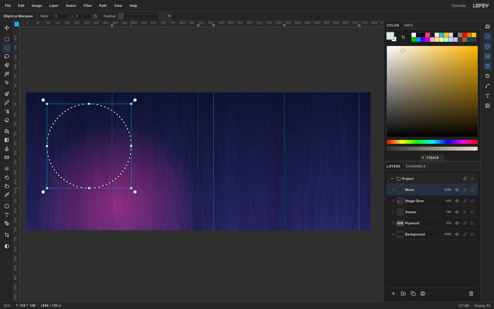

Click **Add Layer** and name it `Moon`. Set the foreground to `#F2E6C8`.
With the **Elliptical Marquee**, [[Cmd]]-drag a circle about 440 px across,
starting about 110 px in from the left edge and 60 px down from the top. It
reaches a little past the first guide. Choose **Edit → Fill**.

> **Tip:** For an exact circle, click once with the Elliptical Marquee while
> nothing is selected, instead of dragging. A dialog opens where you can type
> the **From** and **To** corners, here 110, 60 and 550, 500.

## Cut the crescent and a stencil bridge

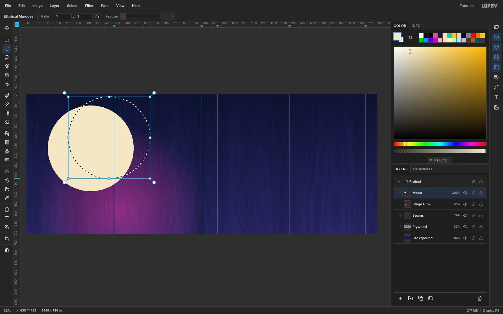

Draw a second, slightly smaller circle, shifted about 100 px to the right
and 45 px up so it covers most of the disc, and press [[Delete]] to bite out
the crescent. Then marquee a strip about 5 px tall straight across the
crescent, just below its middle, and press [[Delete]] again.

That thin gap is a **stencil bridge**. A real cardboard stencil needs
bridges to hold its islands together, and those gaps are a big part of what
makes a piece read as sprayed.

## Give the moon a soft glow

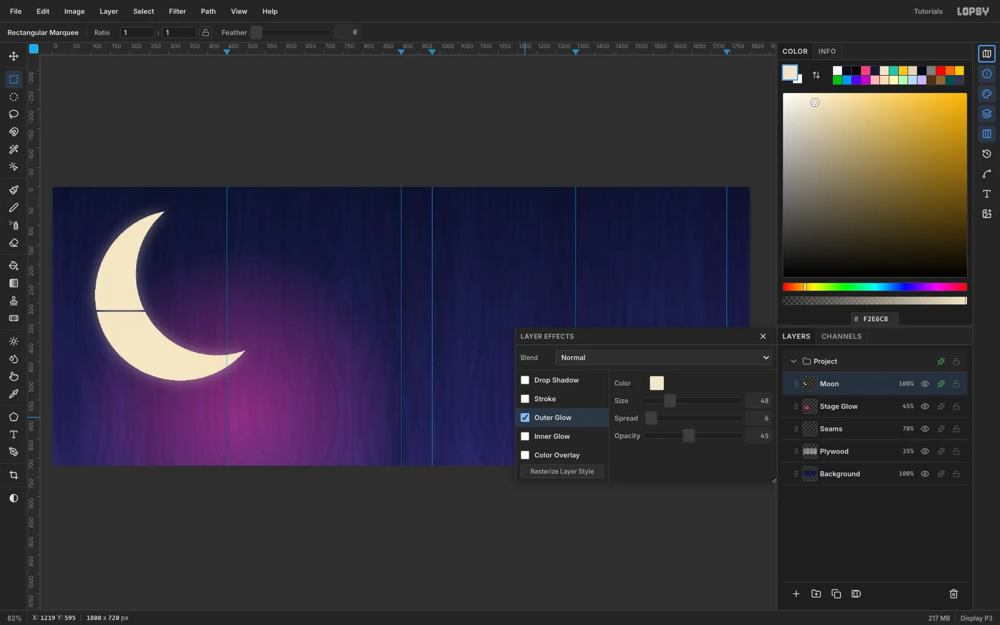

Press [[Cmd+D]], open the `Moon` row's **Layer effects** and tick **Outer
Glow**. Set the color to `#F2E6C8`, **Size** `48`, **Spread** `6` and
**Opacity** `45`.

## Halftone the moon's shading

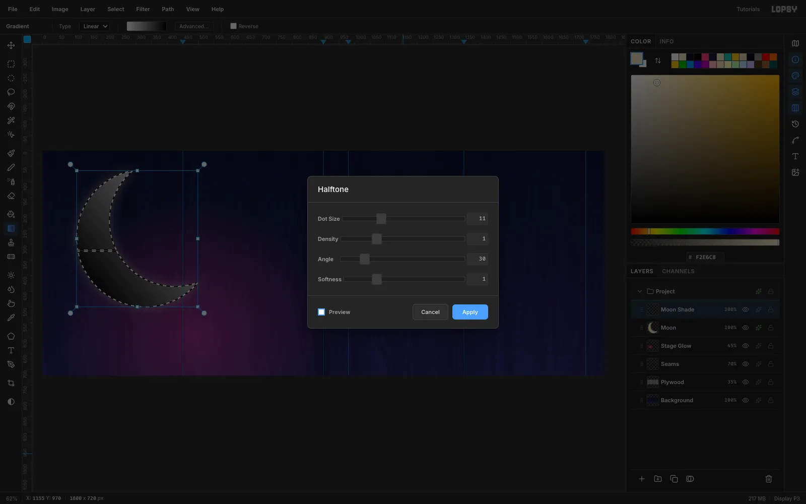

Pick the **Magic Wand**, untick **Contiguous** and click the crescent. That
selects both halves on either side of the bridge. Click **Add Layer** and
name it `Moon Shade`. Pick the Gradient tool with **Linear** type (the stops
are still white to black) and drag inside the selection from the crescent's
upper right toward its lower left.

Then choose **Filter → Halftone**. Set **Dot Size** `11`, **Density** `1`,
**Angle** `30` and **Softness** `1`, and click **Apply**.

## Tint the dots pink

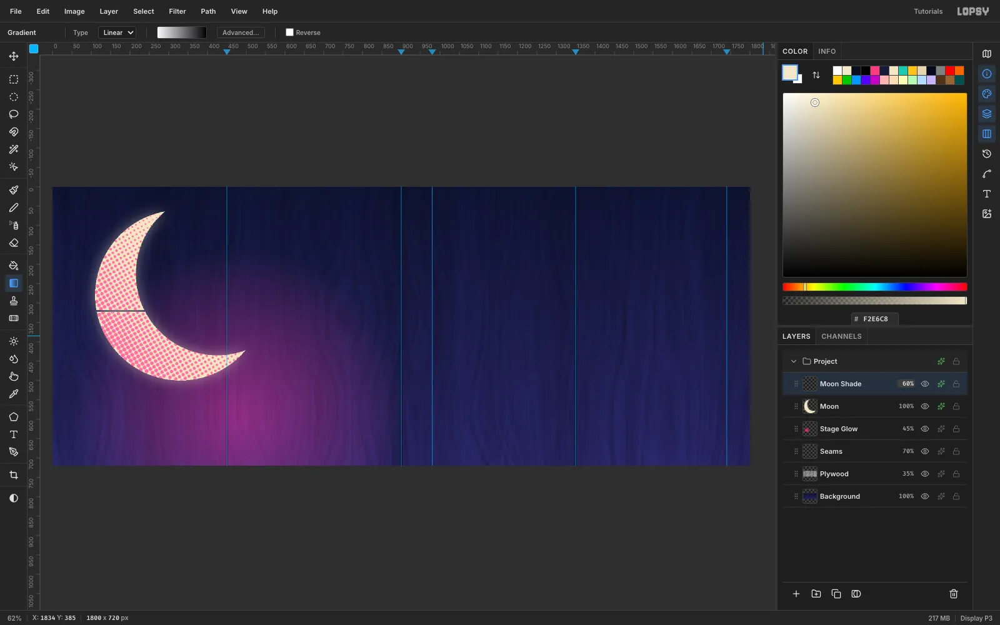

Press [[Cmd+D]]. Open `Moon Shade`'s effects, tick **Color Overlay** and set
it to `#FF2E88`. Then drop the layer to `60%`. The dots print like a
screen-printed tone over the cream.

## Spray the stars

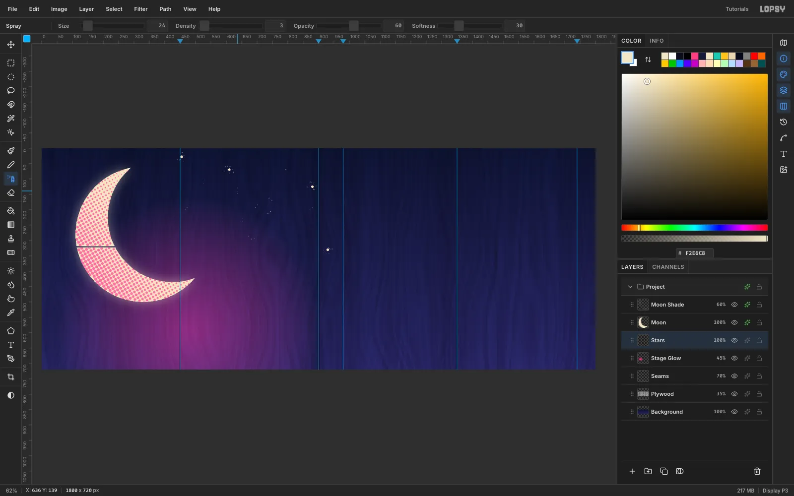

Click the `Stage Glow` row and add a layer named `Stars`. Pick the
**Spray** tool and set **Size** `34`, **Density** `14` and **Opacity** `75`.
Click once each in four spots across the sky to the right of the moon: two
near the top between the first and centre guides, one just left of the
centre guide a little lower, and one just right of it about halfway down.
Give each one a hard core: switch to the **Brush** at **Size** `8` and
**Hardness** `100` and click once at its center. Then go back to the Spray at Size `24` and Density `3`, and click a
few times across the sky for stray paint dust.

## Start the xylophone group with rails

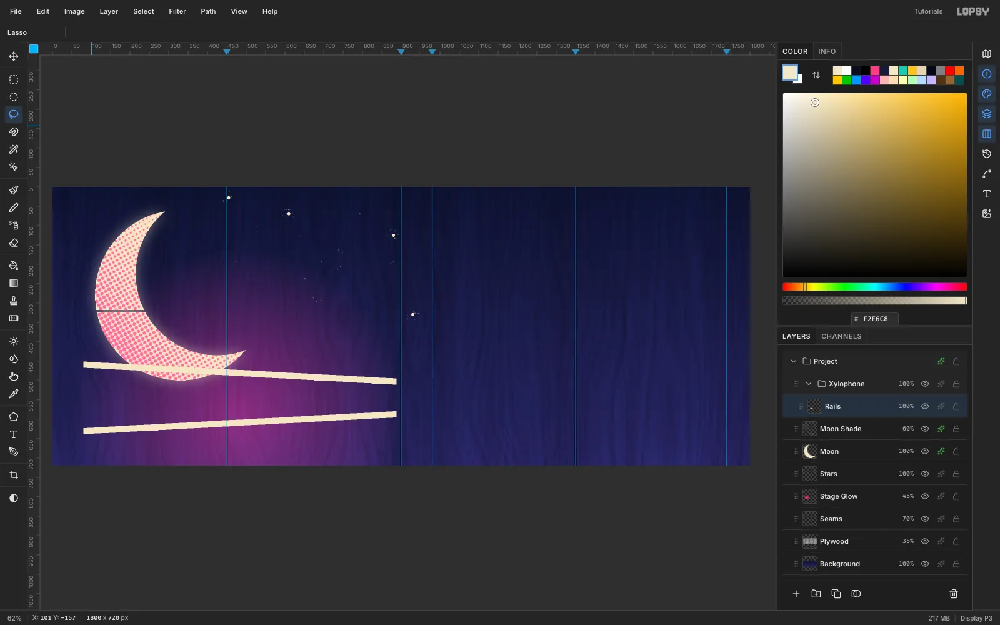

Click `Moon Shade`, then click **New Group** and name the group
`Xylophone`. Everything for the instrument goes inside it.

Add a layer named `Rails`. With the **Lasso**, drag straight through four
corners for a thin rail, about 16 px tall, that starts near the left edge about two-thirds
of the way down and runs to just short of the centre guide, sloping gently
down as it goes. Fill it with cream. Then do a second rail near the bottom
that slopes gently up, so the two rails close in toward the right. They
slope because the bars get shorter to the right.

## Fill the eight bars

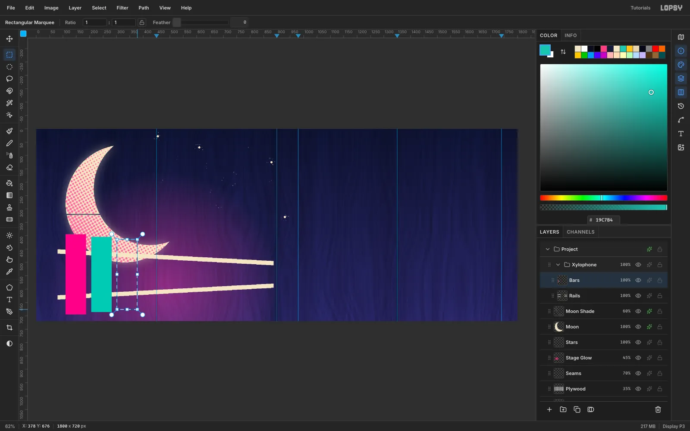

Add a layer named `Bars`. Each bar is about 76 px wide with a 20 px gap.
The first starts just inside the rails' left ends, and every bar is centred
halfway between the two rails. The heights step down from `300` to `170`:
300, 281, 263, 244, 226, 207, 189, 170. Marquee each bar and fill it,
cycling pink, teal and cream from left to right.

> **Tip:** The **Info** tab beside the Color panel shows the selection's
> position and size. For exact bars, click once with the marquee while
> nothing is selected and type each bar's corners.

## Punch cord holes and stencil bridges

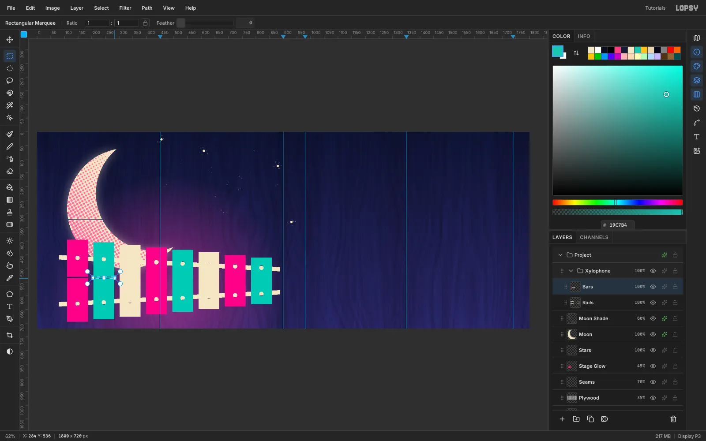

Where each bar crosses a rail, draw a small circle, about 16 px across, on
the bar's center line and press [[Delete]]. Then marquee a 5 px-tall bridge
right across each bar, a little above its middle, and press [[Delete]]
again. These bridges split every bar into two stencil islands.

## Let a few bars drip

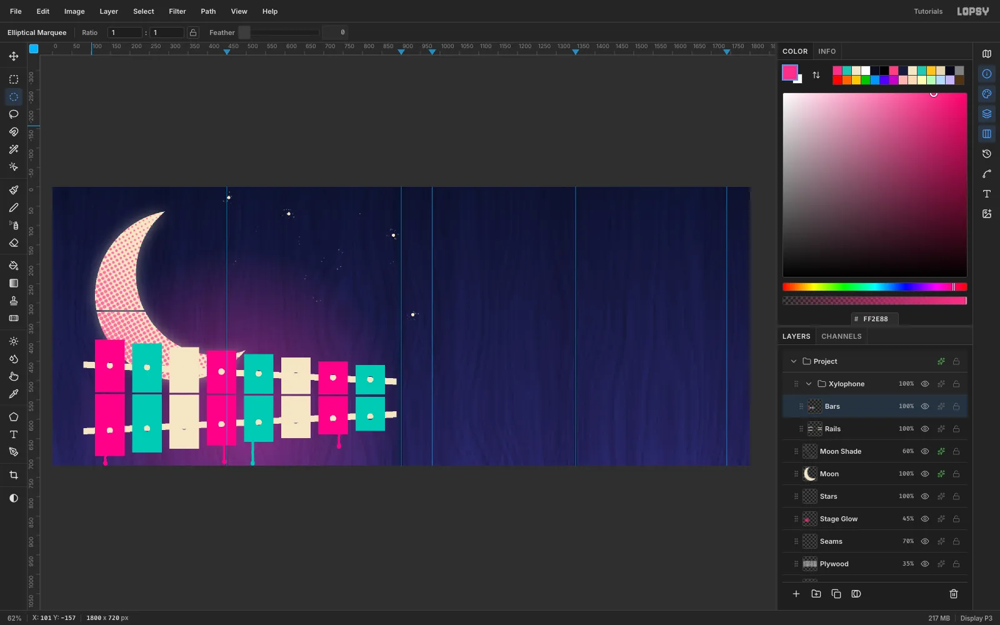

Press [[Cmd+D]]. Pick the **Brush** at **Size** `7` and **Hardness** `100`.
Draw straight drips 18–55 px long down from the bottom edge of bars 1, 4, 5
and 7, each in its bar's color: click at the bar's edge, then
[[Cmd+Shift]]-click straight below. End each drip with a bead: raise the
Size a little and click once at the bottom. Too much paint pooling at the bottom is the classic spray-can
tell.

## Make a misregistered key plate

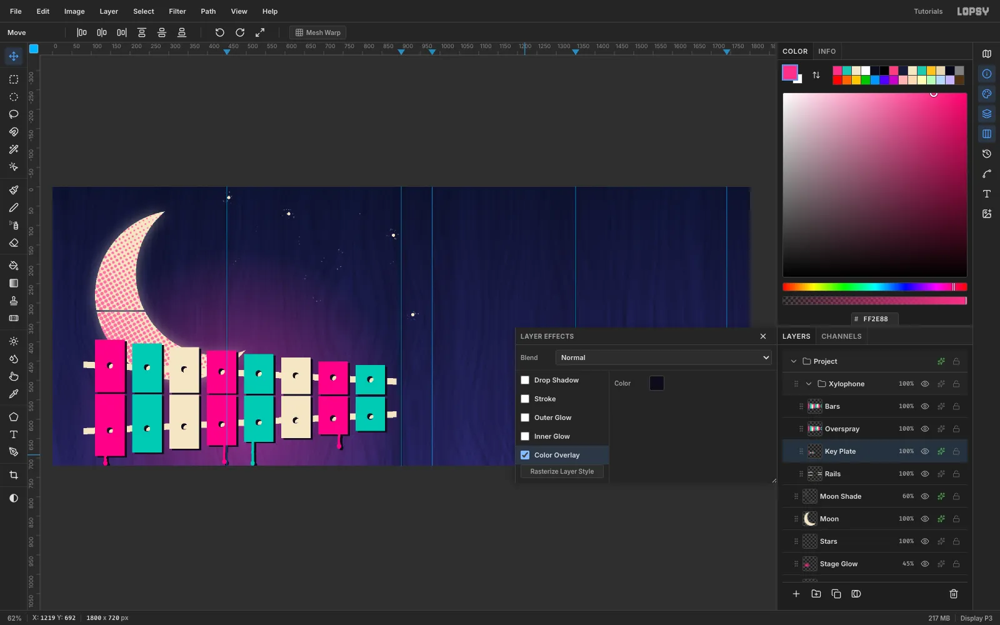

Switch to the **Move** tool and choose **Layer → Duplicate Layer** twice.
Each copy lands offset by 10 px, so nudge it back into line with the
[[Shift]]+arrow keys, which move 10 px per press. Rename the three layers,
from the bottom up: `Key Plate`, `Overspray` and `Bars`.

Click `Key Plate` and nudge it 6 px right and 4 px down with the arrow
keys (1 px per press). Then add a **Color Overlay** of `#0E0B1A`. It reads as a black
stencil sheet that was sprayed slightly out of line.

## Blur the overspray

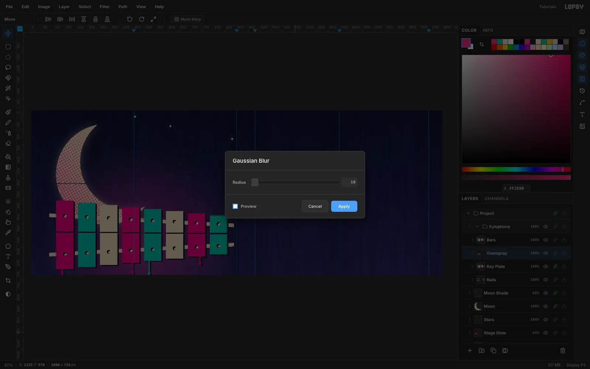

Click `Overspray` and choose **Filter → Gaussian Blur**. Set **Radius**
`10`, click **Apply**, and drop the layer to `55%`. The soft halo sits just
under the crisp bars, like paint that drifted past the stencil edge.

## Spray speckles past the edges

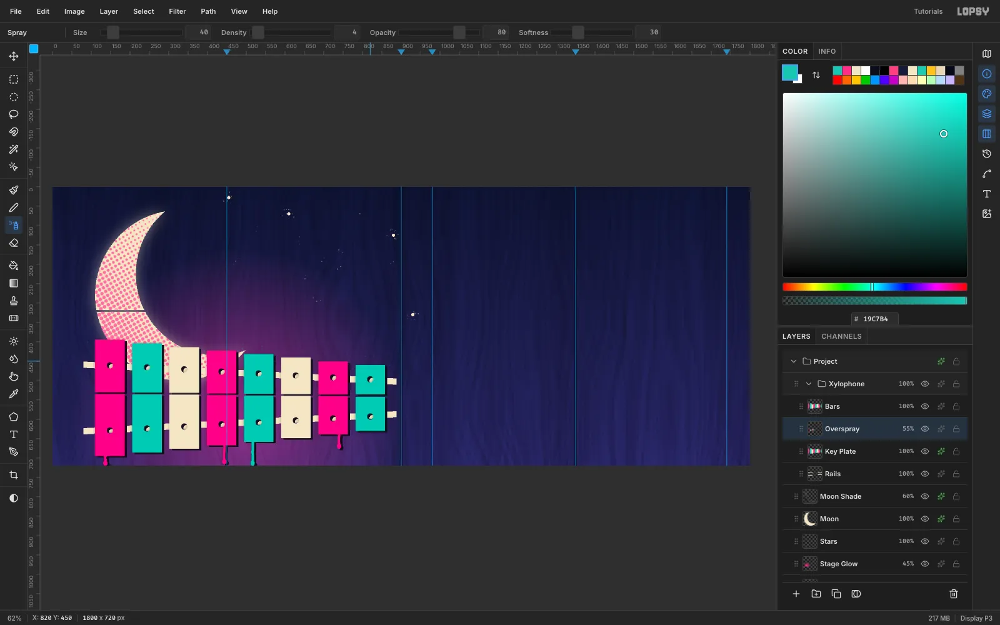

Still on `Overspray`, pick the Spray tool at **Size** `40`, **Density** `4`
and **Opacity** `80`. Click once or twice near the top corners of each bar
in that bar's color. Keep it sparse: a few flecks sell the effect.

## Lasso a sitting cat

Click `Bars` and add a layer named `Cat`. With the **Lasso**, drag round a
sitting cat facing right, its feet on top of the first bar and its pointed
ears reaching up to about the middle of the moon. Fill it with `#0E0B1A`. It
sits right in front of the moon, so the silhouette reads from across the
street.

## Add the tail and cut the eye

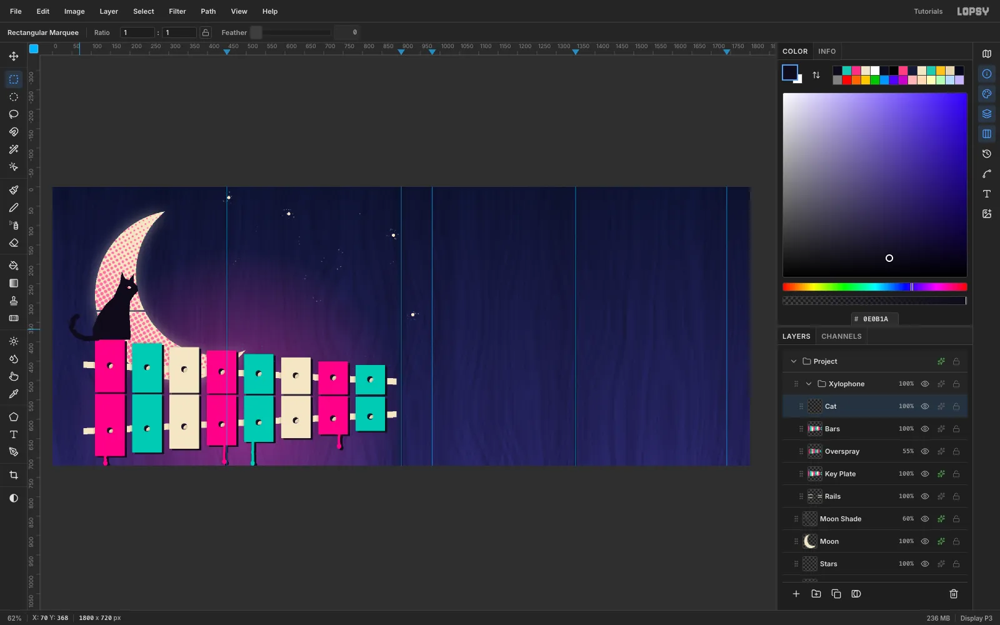

Paint the tail with the Brush at **Size** `14`, curling from the cat's rear
out to the left. Then cut the eye as a tiny ellipse, about 10 × 6 px, with
[[Delete]], so the moon shows through as a glint. Add one more small bridge,
about 16 × 4 px, across the tail.

## Draw and rotate the first mallet

Add a layer named `Mallet A`. With a cream 8 px Brush, click about 180 px
above the left edge of the last bar, then [[Shift]]-click straight down at
the bar's top to draw a straight handle. Switch to teal, set the Brush **Size** to
`40` and click once at its bottom end for the head. Do
the same on `Mallet B` about 30 px to the left, with a pink head.

Marquee `Mallet A` loosely, switch to the Move tool, and drag the rotate
handle just outside the box's top-right corner 40° clockwise. Press
[[Cmd+D]] to commit.

## Cross the mallets

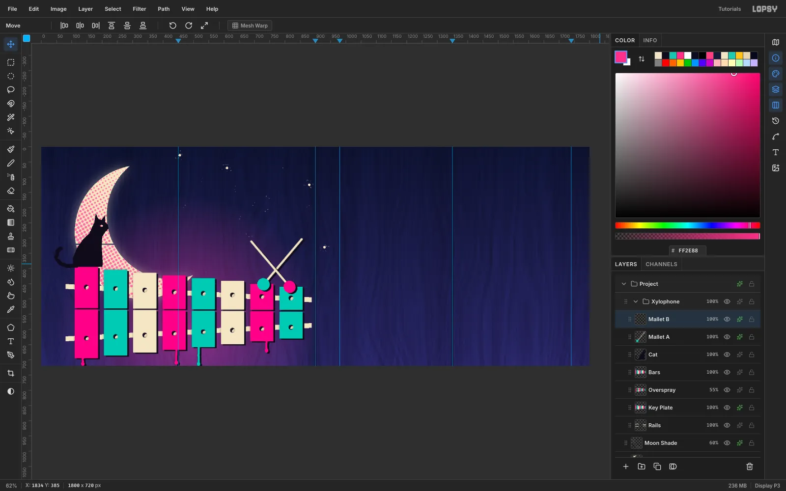

Rotate `Mallet B` 40° the other way so the handles cross in an X and each
head rests on one of the last two bars. Give both mallets a **Drop Shadow**
of `#0E0B1A`, **Offset X** `6`, **Offset Y** `4`, **Blur** `0` and
**Opacity** `100`. That matches the key-plate offset.

## Draw an eighth note

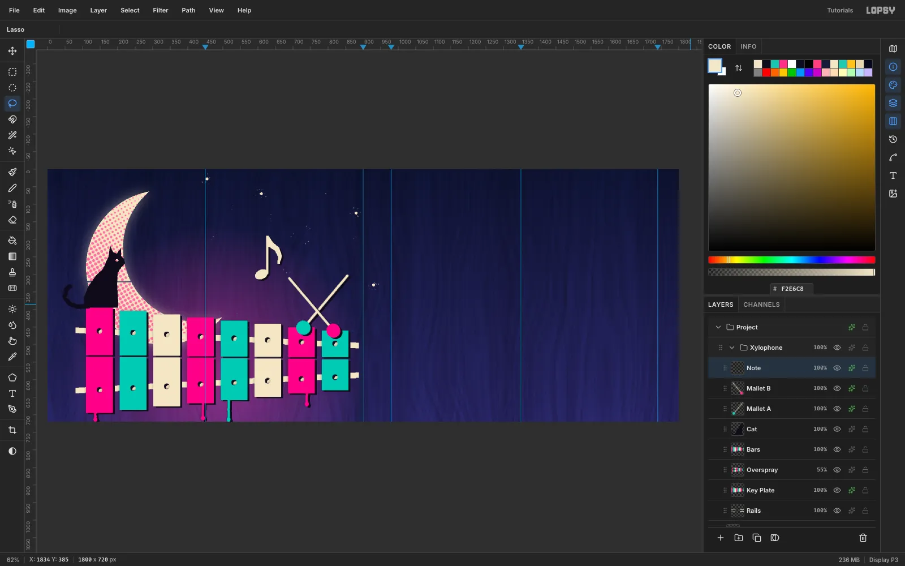

Add a layer named `Note`. Lasso a tilted oval head in the open sky above
the middle bars and fill it cream. With a cream 7 px Brush, click at its right
side and [[Cmd+Shift]]-click about 108 px straight up for the stem, then lasso
the curved flag and fill it. Give it the same hard black
Drop Shadow, at **Offset X** `5` and **Offset Y** `4`.

## Copy and paste a second note

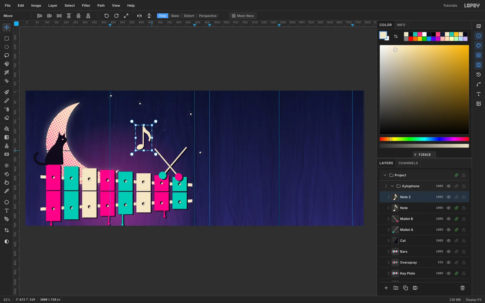

Marquee the note, press [[Cmd+C]] and then [[Cmd+V]]. The paste lands in
place on a new layer: rename it `Note 2`. Marquee it again and drag it up
and to the left, until it sits near the top of the canvas, just right of the
first guide. Press [[Cmd+D]].

## Scale the pasted note

Marquee `Note 2` again and hold [[Cmd]] while you drag its bottom-right
corner handle inward to about 75%. Holding [[Cmd]] keeps the proportions.
Press [[Cmd+D]].

## Rotate and recolor it

Marquee it once more, rotate it 14° clockwise and press [[Cmd+D]]. Add a
**Color Overlay** of `#19C7B4` and the black Drop Shadow. Then tilt the
first note 12° the other way so the pair drifts up out of the mallets.

## Set the XYLOPHONE title

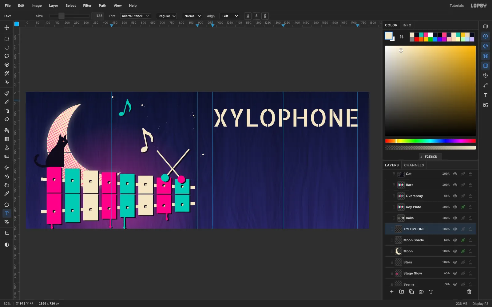

Click `Moon Shade` first. With a raster layer active, changing the text
options won't restyle an existing text layer. Pick the **Text** tool, set
**Size** `128` and the font to **Allerta Stencil**, and set the foreground
to cream. Click on the left type guide, just below the top edge, type
`XYLOPHONE` and press [[Tab]]. It fills the space between the two type
guides.

## Set NOCTURNE and stretch it to width

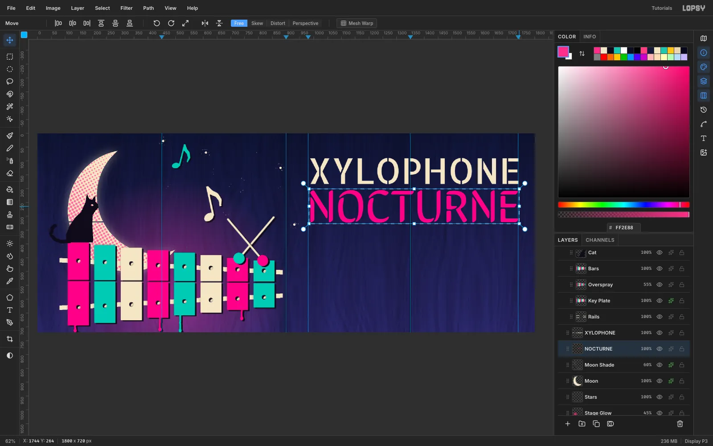

Click `Moon Shade` again. Set the font to **Sirin Stencil** at Size `165`
and the foreground to `#FF2E88`. Click in empty space lower down, type
`NOCTURNE` and press [[Tab]]. With the Move tool, drag it up until its top
sits a narrow gap, about 22 px, under XYLOPHONE and its left edge lines up
with XYLOPHONE's on the left type guide. Fine-tune with the arrow keys.

Click **Rasterize Layer** in the Layers panel footer. You'll paint on the
word next, and a raster layer keeps the stretch for good. Marquee the word
and drag the right-middle handle out to the right type guide. Press
[[Cmd+D]]. The two words now lock together as one block.

## Drip paint off the letters

On the rasterized `NOCTURNE` layer, use the 8 px pink Brush the same way
as the bar drips, a straight line plus a one-click bead, to hang drips from
the N, C, U and E. Make them different lengths,
from about 26 to 62 px.

## Misregister the title inks

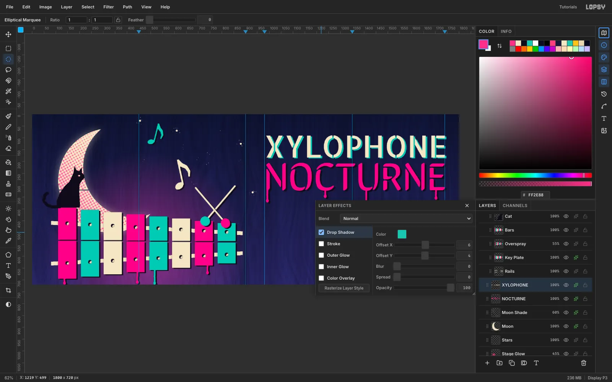

Give `NOCTURNE` a **Drop Shadow** of `#0E0B1A` at **Offset X** `7` and
**Offset Y** `5`, Blur `0`, Opacity `100`. Give `XYLOPHONE` a teal `#19C7B4`
shadow at `6` and `4`. Each word
now looks sprayed through two sheets that didn't quite line up.

## Add a rotated script tagline

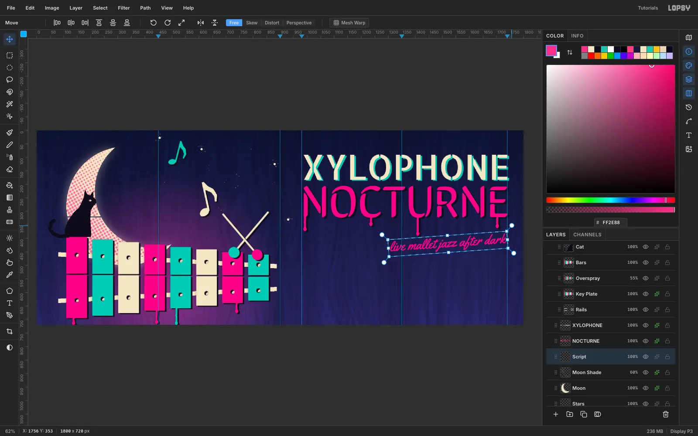

Click `Moon Shade`. Type `live mallet jazz after dark` in **Yellowtail**,
Size `50` and pink, somewhere in empty space. Rasterize it, so the rotation
sticks, and rename it `Script`. Move it under NOCTURNE so its right edge sits
just inside the right type guide. Then marquee it, rotate it about 4°
counter-clockwise and press [[Cmd+D]].

## Set the event details

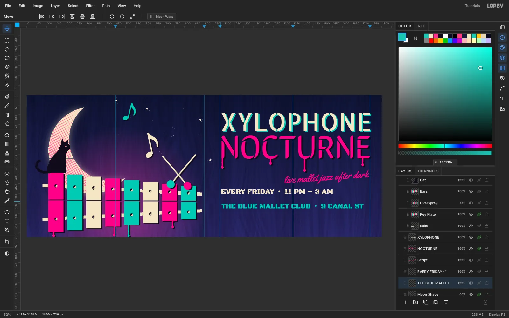

Use **Black Ops One** at Size `36`. Put `EVERY FRIDAY  ·  11 PM – 3 AM` in
cream a little below the script, and `THE BLUE MALLET CLUB  ·  9 CANAL ST` in
teal about 75 px under that. Nudge both so they start on the same left edge
as the title, and keep at least 60 px clear of the canvas's right edge.

> **Tip:** A click inside an existing text layer's box edits that layer.
> Click for the second line well below the first, and paste characters like
> `·` and `–` with [[Cmd+V]].

## Marquee the ticket stub

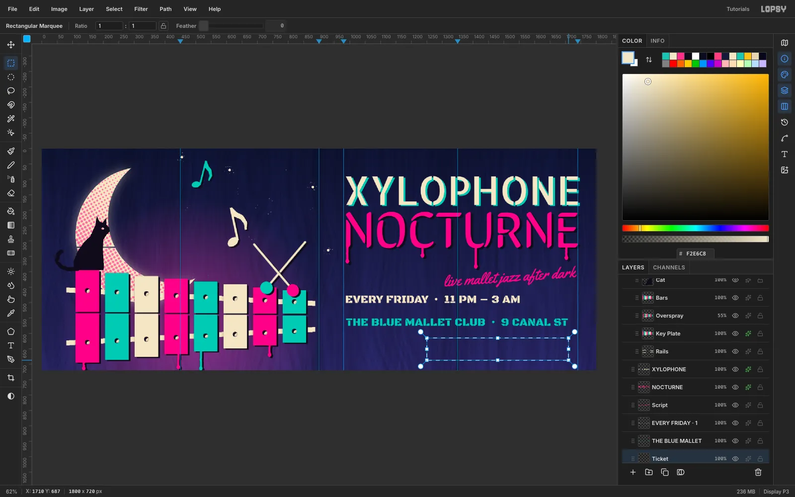

Click `Moon Shade`, add a layer named `Ticket`, and marquee a 460 × 72 strip
in the bottom right, below the event details and ending just inside the
right type guide. Fill it with cream.

## Cut the notches and perforation

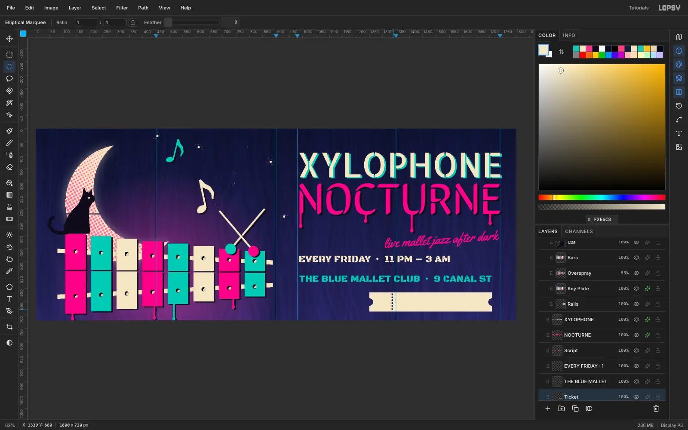

Delete a circle about 28 px across centered on each short end for the
notches. Then, about 80 px in from the left end, delete a column of tiny
circles, about 6 px across and 11 px apart, for the perforation.

## Type on the ticket

With `Ticket` active, set `07` in pink Black Ops One at Size `30` on the
stub, then choose **Layer → Merge Down** to fold it into `Ticket`. Merge Down
rasterizes the text for you. Do the same with `NO COVER  ·  CATS WELCOME` at
Size `22` in `#0E0B1A`, centered between the perforation and the right
notch.

## Tilt the ticket

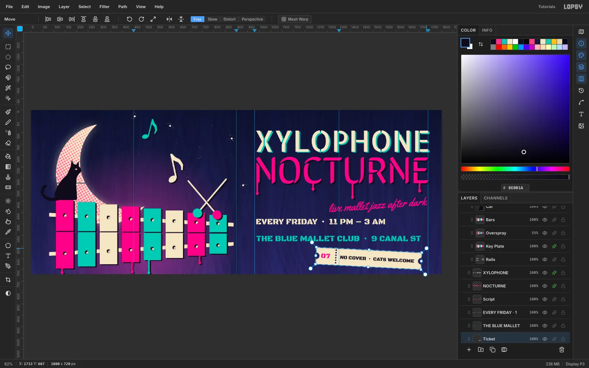

Marquee the ticket, rotate it 3° clockwise and press [[Cmd+D]]. Give it
the black key-plate Drop Shadow at **Offset X** `7` and **Offset Y** `5`.

## Wear the paint with the Eraser

Click `Bars` and pick the **Eraser** at **Size** `16` and **Opacity** `45`.
Drag a few short scuffs across some of the bars. Weathered paint is what
stops the piece from looking freshly printed.

## Mottle the wall

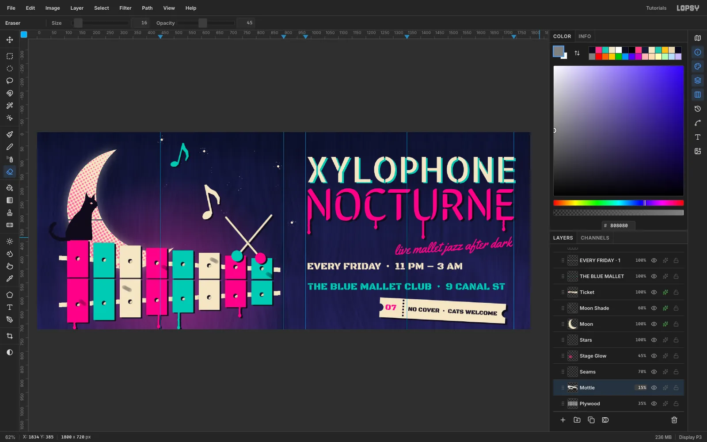

Click `Plywood` and add a layer named `Mottle`. Fill it with `#808080`,
choose **Filter → Clouds** at **Scale** `5`, set it to **Multiply** and
drop it to `15%`. It adds uneven grime to the plywood.

## Make a grain layer

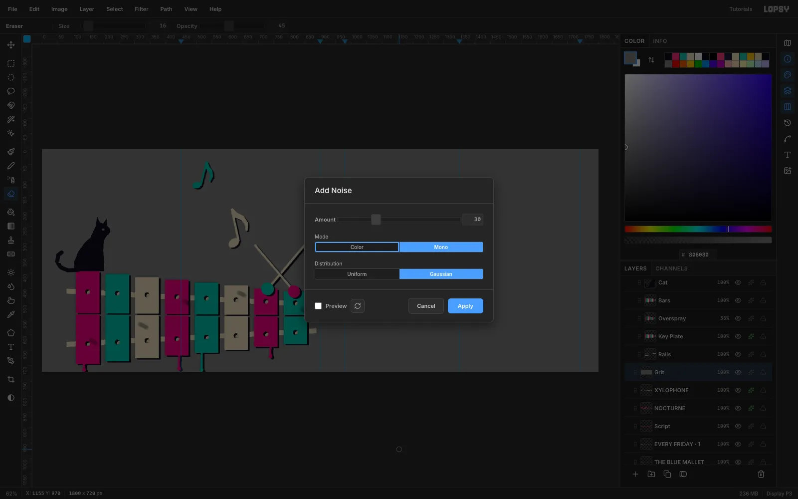

Click `XYLOPHONE` and add a layer named `Grit`. Fill it with `#808080`,
then choose **Filter → Add Noise…** with **Amount** `30`, **Mono** and
**Gaussian**. Click **Apply**, then set it to **Overlay** at `40%`.

## Drag the grit over everything

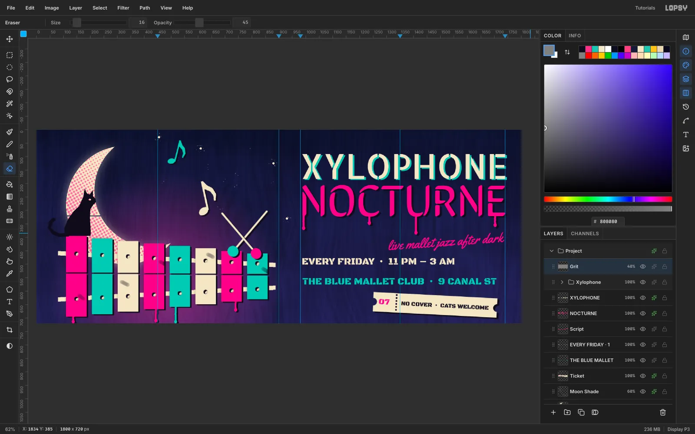

Collapse the `Xylophone` group with its arrow. Then drag `Grit` by its grip
handle up above the group row. The fine grain now runs over the paint as
well as the wall, so everything looks sprayed onto the same rough surface.

## Save and export

Choose **File → Save Project** to keep an editable `.lopsy` file, then
**File → Quick Export PNG** for the finished billboard. For more spray-can
techniques, try the [stencil street art billboard](/tutorials/stencil-street-art-billboard/).
