Stencil art is flat shapes in two or three tones, cut with sharp edges and
sprayed onto a rough wall, so a little paint always drifts past the edge.
In this tutorial you'll make a 1600 × 640 billboard for an imaginary street
art festival, **Rogue Koala**. You'll build a cinder-block wall from a
pattern, cut a three-tone koala in a bandit mask, and set dripping stencil
type with a paper-tape tagline and a graffiti tag. On the way you'll use
pattern fills, filters, the Spray tool, lasso selections, groups, copy and
paste, transforms, layer effects and a group adjustment.

The palette has five colors:

- Ink `#141312`
- Bone `#EEE6D6`
- Mid grey `#8A8580`
- Safety orange `#FF5B1F`
- Eucalyptus green `#2F6F55`

## Look at the finished billboard

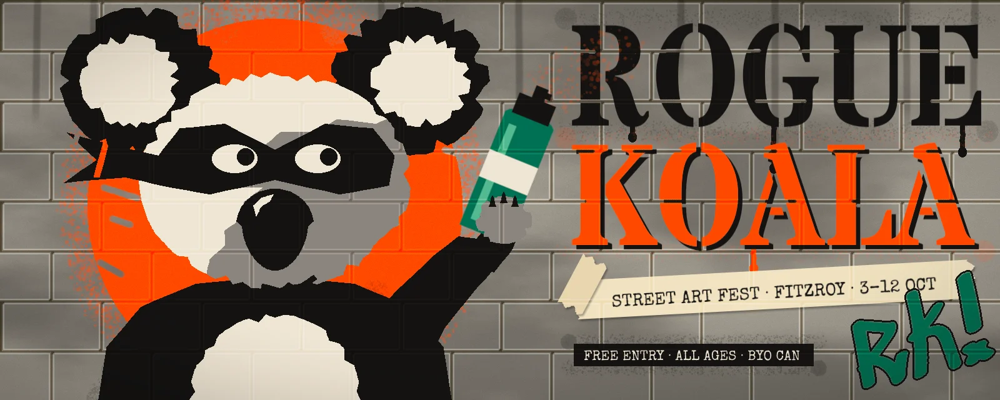

This is where you're headed. Every shape is a flat fill made with a
selection and **Edit → Fill**. The wall texture comes back over the top at
the end, so the paint looks sprayed onto the blocks rather than pasted over
them.

## Create the billboard document

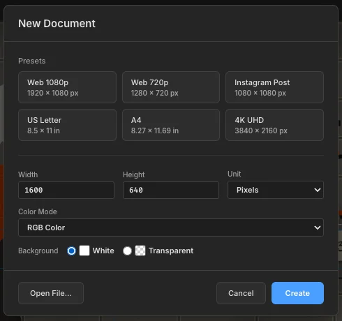

Open [Lopsy](/) and choose **File → New**. Set **Width** `1600` and
**Height** `640` in pixels, pick a **White** background and click
**Create**. That's a 2.5:1 ratio, close to a roadside billboard.

## Start with grainy concrete

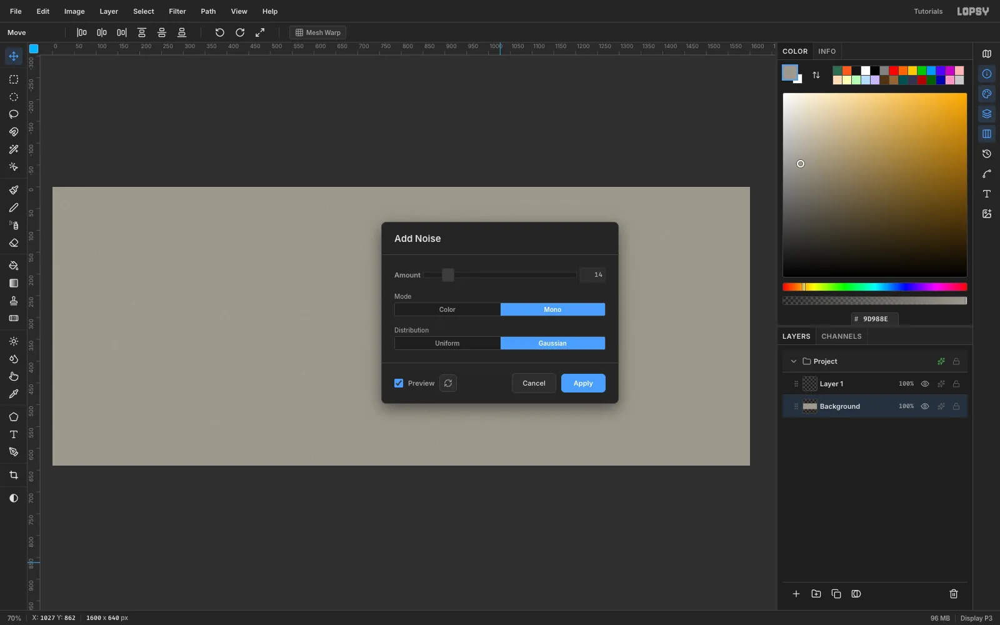

Click the **Background** row. Set the foreground color to `#9D988E` and
choose **Edit → Fill**. Then choose **Filter → Add Noise…** and set
**Amount** `14`, **Mono** and **Gaussian**. Click **Apply**. This fine grain
is what the concrete looks like up close.

## Draw one cinder-block tile

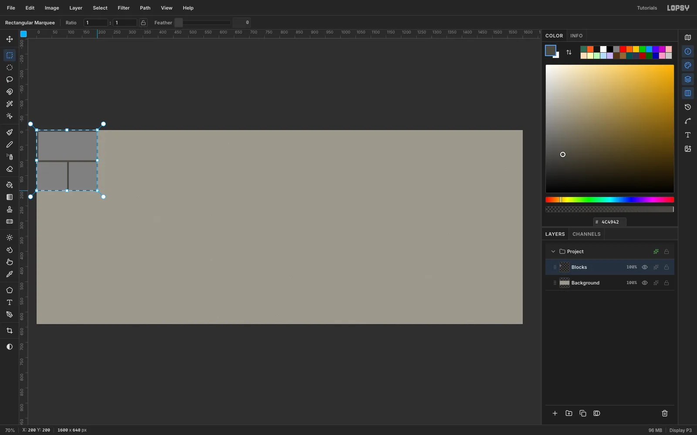

Double-click `Layer 1` and rename it `Blocks`. With the **Rectangular
Marquee**, select (0, 0) to (200, 200) and fill it with `#808080`. Switch
the foreground to `#4C4942` and fill four thin selections for the mortar:

1. (0, 0), 200 × 6, the top joint
2. (0, 100), 200 × 6, the middle joint
3. (0, 0), 6 × 100, the vertical joint in the top course
4. (100, 100), 6 × 100, the vertical joint in the bottom course, offset by half a block

Select the whole 200 × 200 tile again and choose **Edit → Define Pattern**.

## Tile the wall with Fill with Pattern

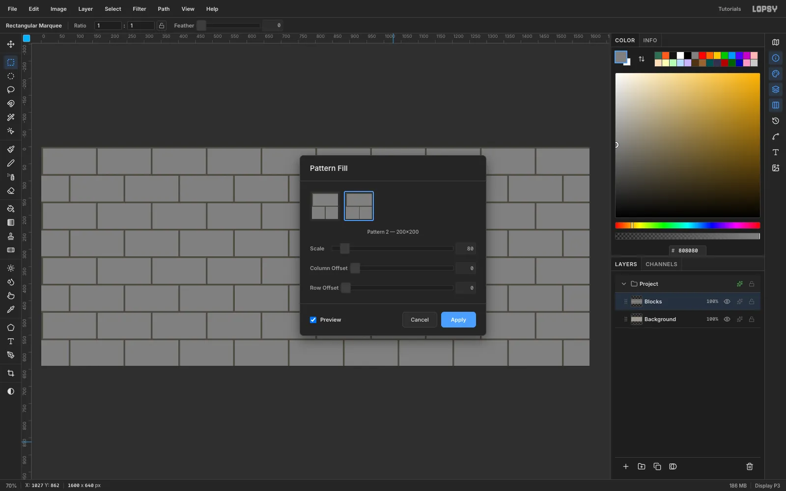

Press [[Cmd+D]] to deselect, then fill the whole `Blocks` layer with
`#808080`. Choose **Edit → Fill with Pattern…**, pick your new pattern and
set **Scale** `80`. Leave both offsets at `0` and click **Apply**.

> **Tip:** Row Offset staggers each *column* of tiles vertically. Leave it
> at 0 here, because the stagger is already drawn into the tile.

## Emboss the blocks

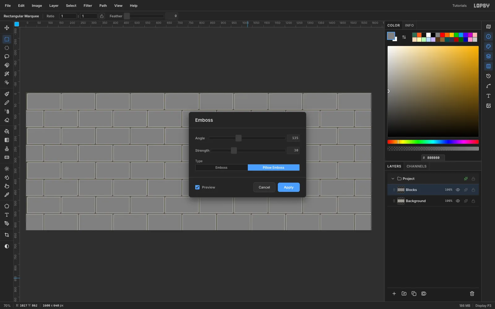

Choose **Filter → Emboss…** and set **Angle** `135`, **Strength** `30` and
**Pillow Emboss**, then click **Apply**. Open the layer's effects (✦) and set
its **Blend** to **Overlay**. Mid grey disappears in Overlay, so only the
light and dark edges of each block show on the concrete.

## Add cloudy grime

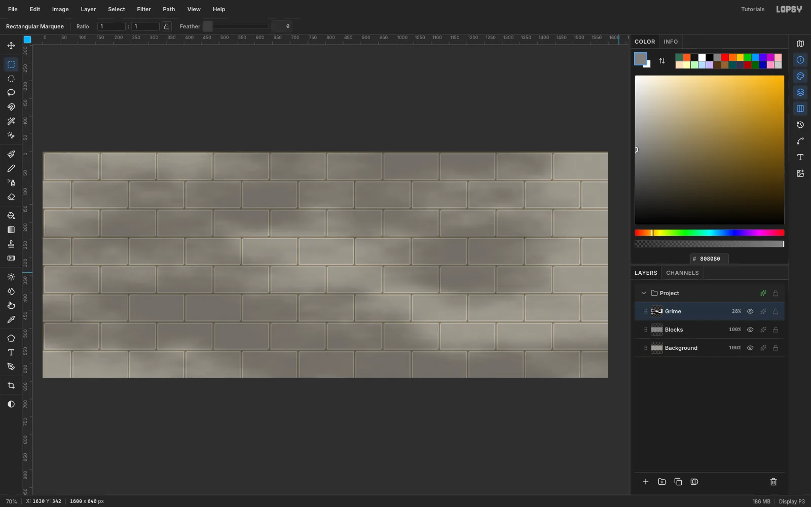

Click **Add Layer** and name it `Grime`. Choose **Filter → Clouds…**, set
**Scale** `4` and apply it. Set the blend mode to **Multiply** and the
layer's opacity to `28%` for uneven, weathered patches.

## Streak the wall with Motion Blur

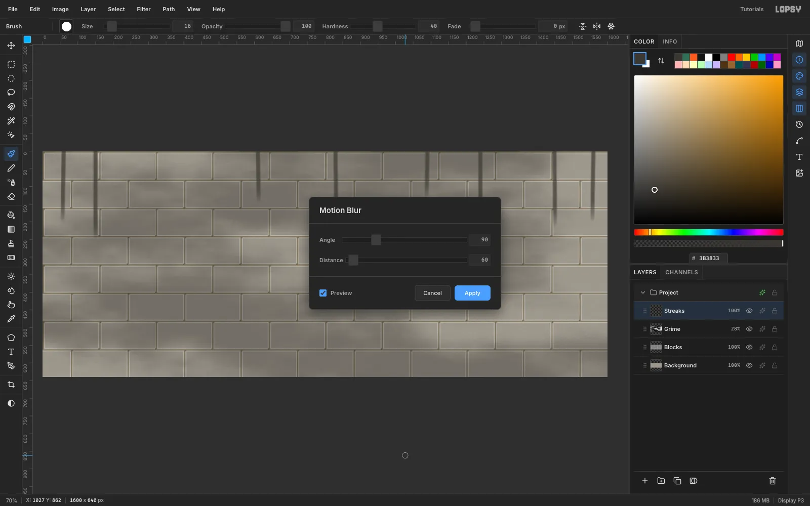

Add a layer called `Streaks`. Pick the **Brush** and set **Size** `16`,
**Hardness** `40` and **Opacity** `70`, with the color `#3B3833`. Drag eight
short vertical strokes down from the top edge, 90–270 px long, at x ≈ 60,
150, 610, 830, 1090, 1240, 1450 and 1560.

Choose **Filter → Motion Blur…** with **Angle** `90` and **Distance** `60`.
Set the layer to **Multiply** at `40%` to get soft rain stains.

## Spray the orange disc

Add a layer called `Disc`. With the **Elliptical Marquee**, select a
600 × 600 circle starting at (140, 30), then fill it with `#FF5B1F`.

## Add overspray with the Spray tool

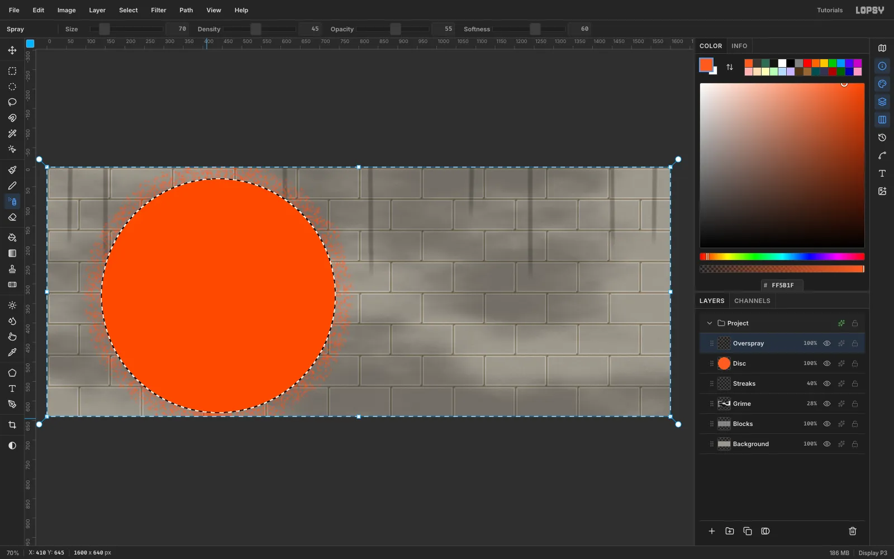

A stencil holds paint back, but some always drifts past the edge. Add a
layer called `Overspray` and choose **Select → Inverse**, so you can only
paint *outside* the circle.

Pick the **Spray** tool and set **Size** `70`, **Density** `45`,
**Opacity** `55` and **Softness** `60`. Drag two laps around the disc, just
outside its edge. Move in big steps of about 30 px, because the Spray tool
skips very short drag segments. Start each lap at the bottom, where the
koala will cover the denser cloud you get at pointer-down.

Deselect, click the `Disc` row and add **Add Noise** at `10`, **Mono**, for
spray-can grain.

## Cut the koala silhouette in a group

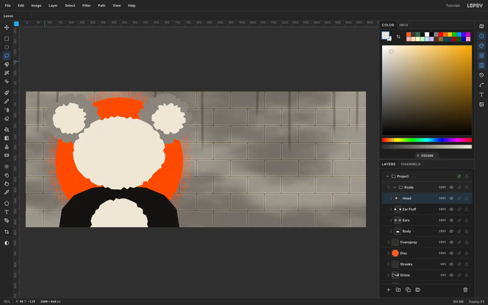

With `Overspray` active, click **New Group** and name it `Koala`. Layers you
add while inside the group stay inside it. Build four layers from the bottom
up with the **Lasso** and **Edit → Fill**:

- `Body`: a wide ink trapezoid for the shoulders that runs off the bottom
  edge, plus a jagged bone chest patch centered at (440, 640)
- `Ears`: two jagged mid-grey circles about 250 px across, centered at
  (237, 129) and (656, 129)
- `Ear Fluff`: smaller jagged bone circles inside each ear
- `Head`: a jagged bone oval about 435 × 350 centered at (440, 289)

Click short, uneven zig-zags into the lasso edges so they read as cut fur
rather than smooth vector curves.

## Shade the face with the Magic Wand

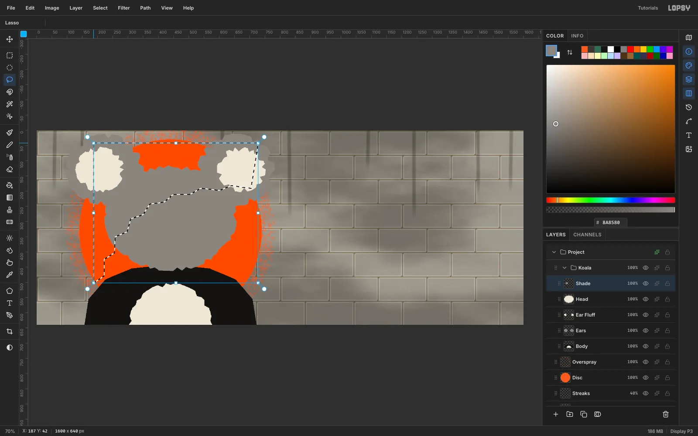

Click the `Head` row, pick the **Magic Wand** and click inside the head.
Add a layer called `Shade` and fill the selection with mid grey `#8A8580`.

Now cut the lit side out of it. Lasso a jagged diagonal region over the top
of the head and press [[Delete]]. Then lasso the left cheek and delete that
too. What's left is a hard-edged shadow down the right side, the classic
two-tone stencil split.

## Cut the bandit mask

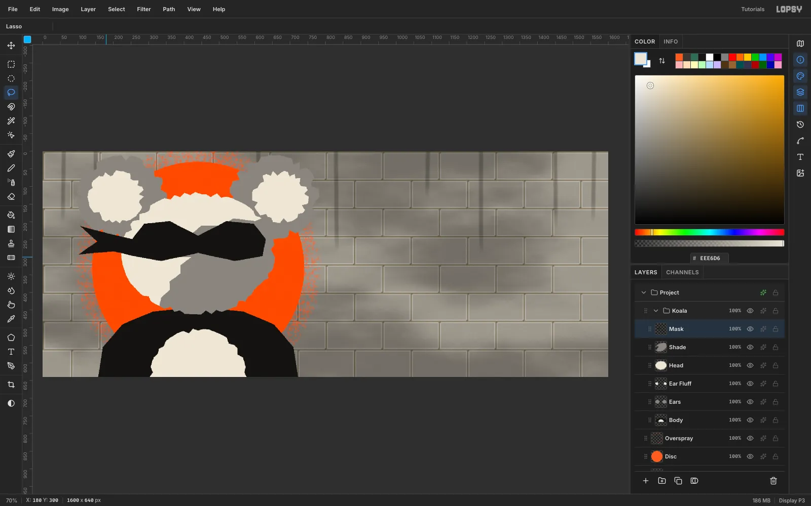

Add a layer called `Mask` and lasso-fill it in ink. Give the top edge a V
that dips between the eyes, for a scowl. Add two pointed tails flying out to
the left, like a knot blowing in the wind.

Stencils need **bridges**, thin uncut strips that hold the stencil sheet
together. Lasso two thin slivers across the mask tails and press
[[Delete]], so the orange shows through as gaps.

## Copy and paste the second eye

Add a layer called `Eyes`. Fill a 74 × 46 ellipse in bone at (339, 231).
Then fill a 28 px ink pupil against its right side, so he's giving shifty
side-eye.

Marquee around the eye, press [[Cmd+C]] then [[Cmd+V]]. Use the **Move**
tool to drag the pasted copy 133 px to the right. Deselect and choose
**Layer → Merge Down** to fold it back into `Eyes`.

## Add the nose and smirk

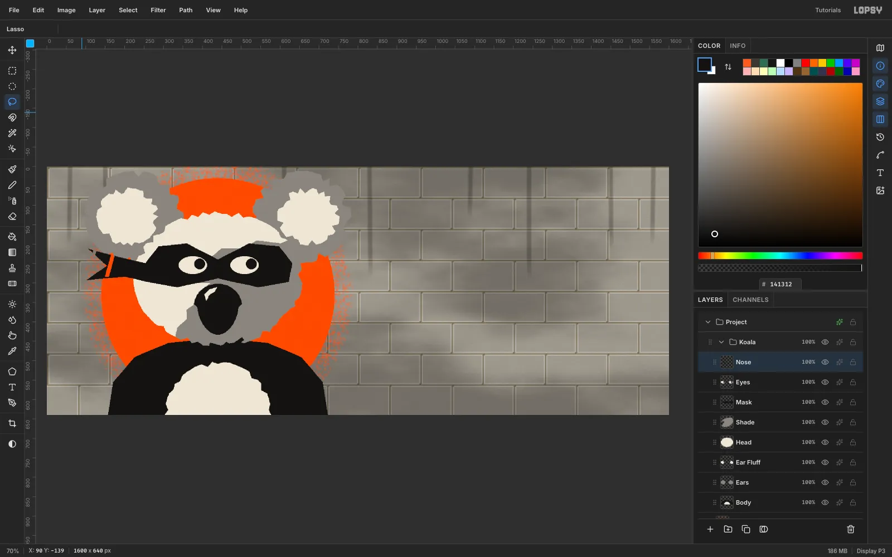

Add a layer called `Nose`. Lasso-fill a big rounded ink shape about
115 × 130, centered at (440, 362), slightly wider at the top. Koala noses
are huge. Add a small bone crescent at its upper left as a highlight, and a
thin ink smirk curving up to the right below it.

## Draw the arm and spray can

Add an `Arm` layer and lasso-fill an ink arm that rises from the right
shoulder toward (790, 380).

Add a `Can` layer and draw the can upright at (700, 150) from marquee fills:

- a 64 × 150 body in green `#2F6F55`
- a 10 px highlight stripe in `#6FB893`
- a bone label band
- a green ellipse for the shoulder
- an ink cap and nozzle

## Scale the can up

Select the can with a marquee and Move-drag it about 80 px to the right,
then press [[Cmd+D]]. Marquee it again and hold [[Cmd]] while you drag the
bottom-right handle outward to about **130%**. The [[Cmd]] key keeps the
proportions locked. Press [[Cmd+D]] to commit.

> **Tip:** Commit each transform with [[Cmd+D]] before you start the next
> one. Scale, commit, then rotate.

## Tilt the can

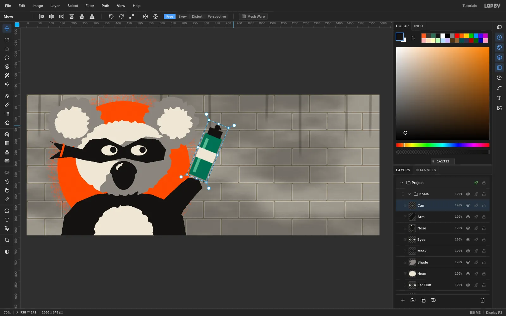

Marquee the can once more. Drag the round rotation handle just outside the
top-right corner clockwise, about **22°**, so the nozzle points at the
headline. Press [[Cmd+D]].

## Add the paw and claws

Extend the arm up to the can on the `Arm` layer. Then add a `Paw` layer
above `Can`, with a jagged mid-grey blob about 90 × 80 over the lower third
of the can. Fill three small ink triangles across the top of it for claws.

## Set the stencil headline

Click the `Overspray` row so the type lands outside the group. Pick the
**Text** tool and set **Stardos Stencil**, **Bold**, **Size** `195`.

Type `KOALA` first, in orange, clicking at (930, 200). Then click the
`Overspray` row again and type `ROGUE` in ink, clicking at (930, 5).

> **Tip:** Create the lower line first. A text layer's click area reaches
> well below its glyphs, so clicking just under `ROGUE` would edit it
> instead of starting new text.

## Stretch the letters taller

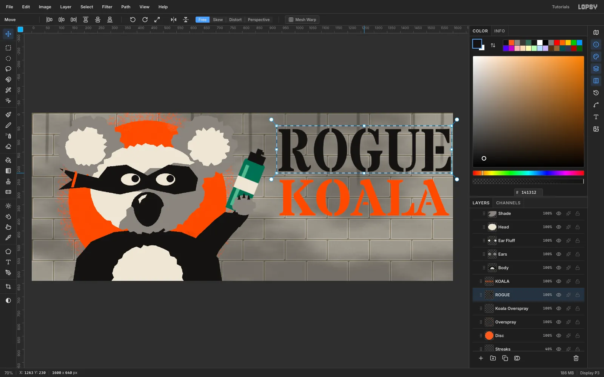

Real stencil lettering is often condensed. Click `ROGUE` and click
**Rasterize Layer**. Marquee tightly around the word and drag the
**bottom-middle** handle down 28 px, about 120% taller. Press [[Cmd+D]],
then Move-drag the word so its left edge sits at x = 915 and its top at
y = 36.

Repeat for `KOALA`, placing it at x = 915, y = 227.

## Add a hard shadow and paint drips

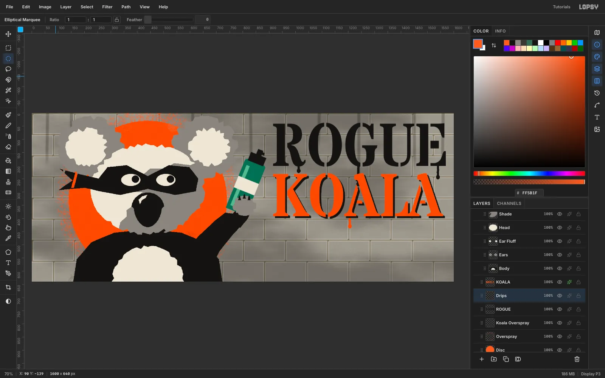

Give `KOALA` a **Drop Shadow** in ink with **Offset X** `7`, **Offset Y**
`7`, **Blur** `0` and **Opacity** `100`. It looks like a second,
misregistered spray pass.

Add a `Drips` layer above `ROGUE`. Set the **Brush** to **Size** `9` and
**Hardness** `100`. Drag three drips of uneven length straight down from the
bottoms of the letters: 22, 72 and 46 px. Let the longest run into `KOALA`.
Fill a small ellipse at the end of each drip for the bead of paint. Add one
orange drip from `KOALA` that reaches the tape line.

## Spray the type edges and the nozzle mist

Add a `Title Overspray` layer. Set the **Spray** to **Size** `34`,
**Density** `30` and **Opacity** `22`. Drag slow horizontal passes just above
and below `ROGUE` in ink, and just above and below `KOALA` in orange.

Add a `Mist` layer. Spray a short orange puff (**Size** `90`, **Opacity**
`35`) from the nozzle up toward the top of the **R**, as if the koala is
tagging the headline.

## Make a paper-tape tagline

Add a `Tape` layer and fill a 670 × 62 rectangle at (905, 432) with
`#EFE3C4`. For torn ends, lasso a zig-zag over each end of the strip and
press [[Delete]].

Set the Text tool to **Special Elite**, **Size** `28` and ink. Click at
(978, 452) and paste `STREET ART FEST · FITZROY · 3–12 OCT`. Pasting is the
easiest way to get the middle dots and the dash. Click **Rasterize Layer**,
then **Layer → Merge Down** onto `Tape`.

## Rotate the tape

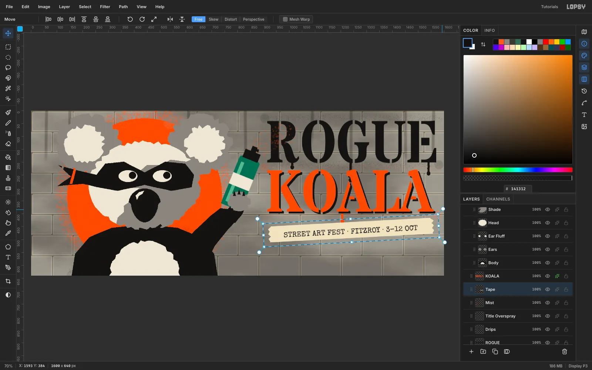

Marquee around the tape and drag the rotation handle about **3°**
counter-clockwise. Press [[Cmd+D]]. Give `Tape` a soft **Drop Shadow**:
**Offset** `2` / `3`, **Blur** `4`, **Opacity** `35`.

## Pin it with a cross-strip

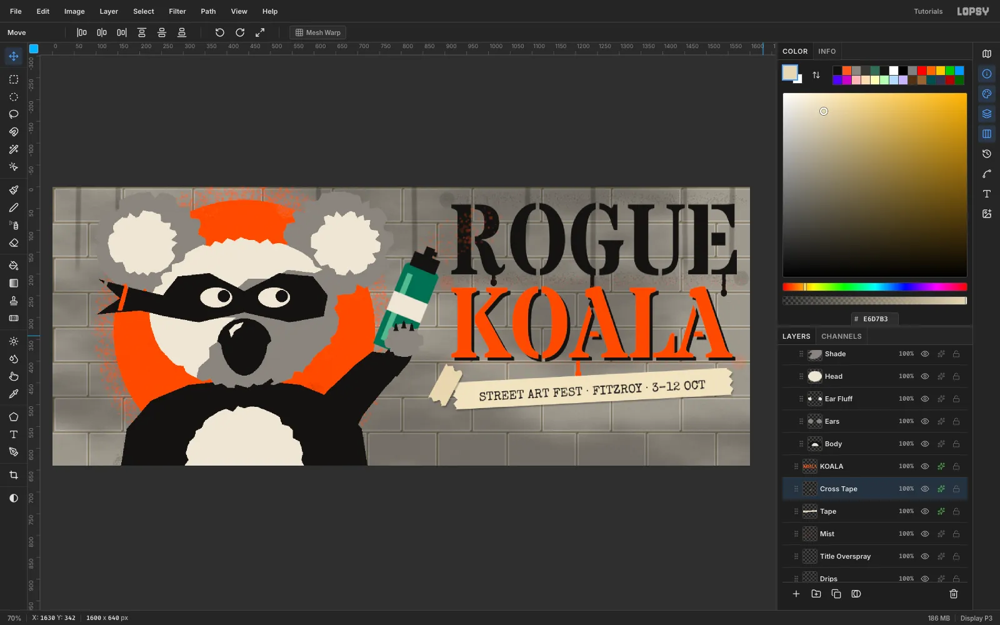

Add a `Cross Tape` layer. Fill a 44 × 110 strip with `#E6D7B3` and tear its
top and bottom the same way. Rotate it about **28°**, commit, and nudge it
over the left end of the tape with [[Shift+Right]]. Give it the same soft
shadow.

## Spray a footer bar

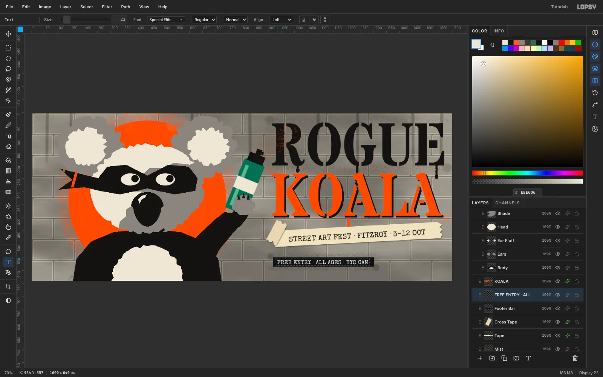

Add a `Footer Bar` layer. Fill a 384 × 36 ink rectangle at (918, 550),
left-aligned with the tape. Spray along its top and bottom edges in ink at
**Size** `24` and **Opacity** `30`.

Set **Special Elite**, **Size** `22` and bone `#EEE6D6`. Click at
(934, 557) and paste `FREE ENTRY · ALL AGES · BYO CAN`.

## Throw up a graffiti tag

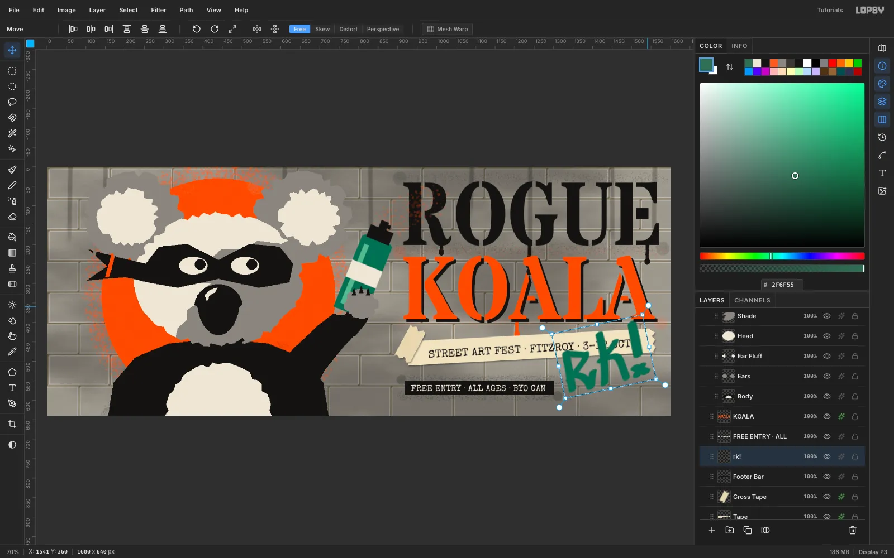

Set the Text tool to **Sedgwick Ave Display**, **Size** `96`, green
`#2F6F55`. Type `rk!` at (1420, 470), then click **Rasterize Layer**.

Marquee it and [[Cmd]]-drag the top-left handle out to about **180%**.
Commit, marquee again and rotate it about **12°** counter-clockwise. Commit,
then Move-drag it so it overlaps the lower-right corner of the tape. Taggers
always hit on top of other work.

## Outline the tag

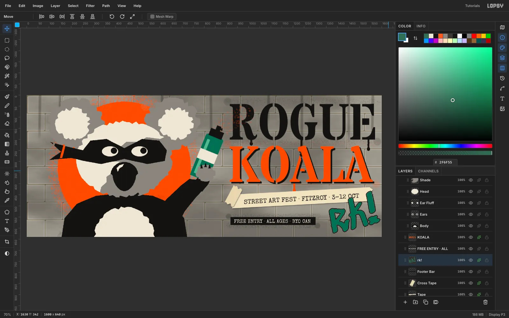

Open the tag's effects and enable **Stroke**. Set the color to ink and
**Width** to `3`, positioned **outside**. The outline makes the tag pop off
the busy wall.

## Put the wall texture back on top

Click `Blocks` and click **Duplicate Layer**. Drag the copy's grip to the
very top of the Layers panel and rename it `Wall Texture`. It keeps the
**Overlay** blend. Set its opacity to `60%`.

Now the mortar lines and block edges run through every shape. That's the
single biggest step in making digital paint look sprayed onto a wall.

## Add a vignette

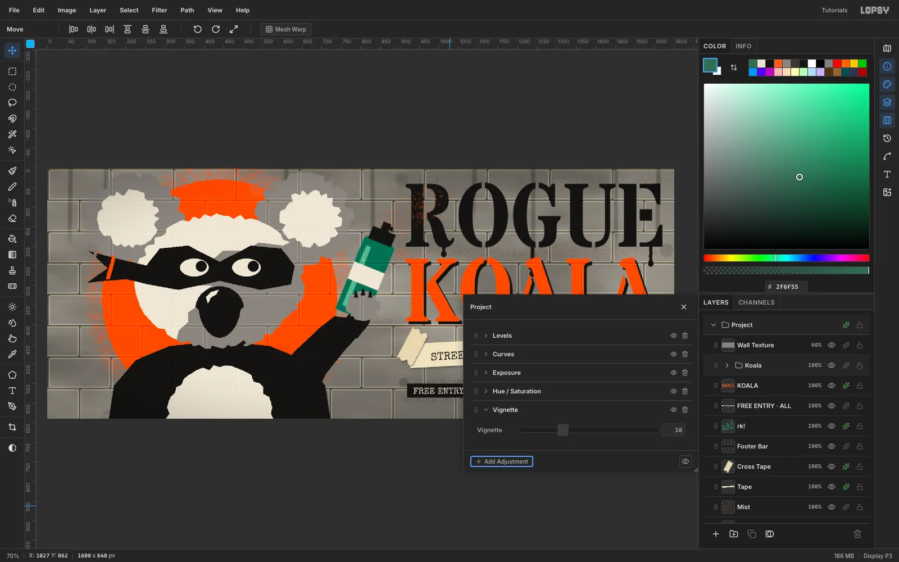

Choose **Layer → Adjustment Layer…** and click **Got it**. Lopsy puts
adjustments on the document's root group. Click **Add Adjustment →
Vignette** and set it to `30`, then close the drawer.

## Ink the ears with Color Overlay

With the wall texture on, mid-grey ears almost vanish into the concrete.
Click the `Ears` layer inside the `Koala` group and enable **Color Overlay**
in its effects, set to ink `#141312`. Solid black ears make a much stronger
silhouette.

## Erase paint skips along the mortar

Spray paint skips over the recessed mortar joints. Pick the **Eraser** at
**Size** `6` and **Opacity** `65`. On `ROGUE`, drag short broken strokes
along the mortar lines at y = 80 and 160. Do the same on `KOALA` at y = 240
and 320. Then set **Size** `12` and add a few diagonal scuffs to the edges of
`Disc`.

## Export the billboard

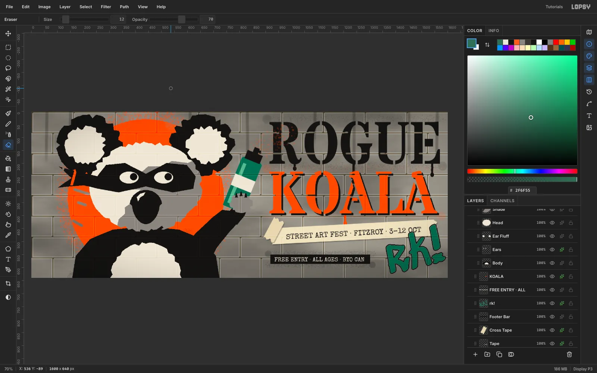

Choose **File → Quick Export PNG** for the finished billboard, and **File →
Save Project** to keep every layer editable. You now have:

- a concrete wall that's embossed, grimy and rain-streaked
- a three-tone stencil koala with bridges and overspray
- condensed stencil type with drips and a hard shadow
- paper tape, a sprayed footer bar and a graffiti tag

For another take on outdoor type, try the
[liquid chrome text billboard](/tutorials/liquid-chrome-text-billboard/).
