A good graphic tee reads from across the room and still rewards a closer
look. In this tutorial you'll make **T-REX XING**, a pun on a road warning
sign, laid out at a 1200 × 1500 print size. The design uses only four
screen-print inks on a charcoal shirt. You'll rotate a square into a diamond
sign and cut a T-rex silhouette with the Lasso. Stencil fonts set the type,
pasted and rotated copies make a trackway of dinosaur footprints, and a
pattern-fill tile becomes hazard tape. To finish, you'll spray overspray
around the sign and build a knock-out distress texture from Clouds, Noise
and Threshold, so the print looks washed and worn.

The palette:

- Shirt charcoal `#2F3136` (the background, not an ink)
- Amber `#F2A900`
- Black `#111111`
- Cream `#EDE6D6`
- Safety orange `#E8622A`

## Set the shirt color

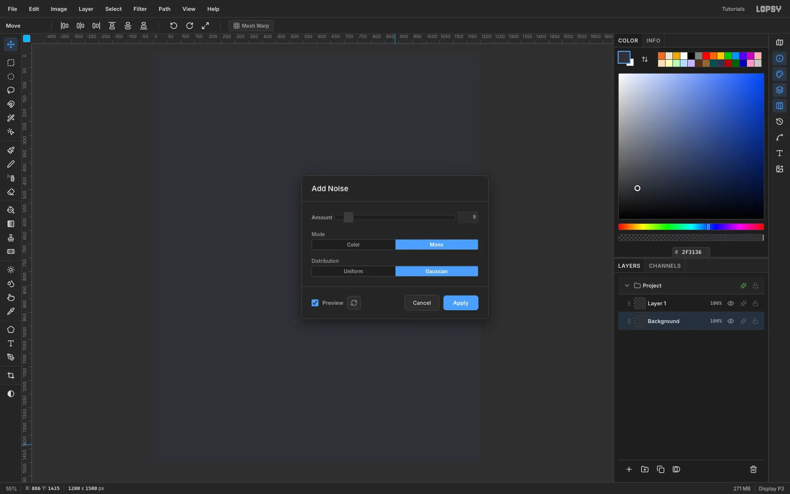

Choose **File → New**, enter **1200 × 1500**, pick a **White** background
and click **Create**. Set the foreground color to `#2F3136` and choose
**Edit → Fill** with nothing selected to flood the Background. Then run
**Filter → Add Noise…** with **Mono**, **Gaussian** and **Amount 9**. That
faint grain reads as heathered cotton, so you can judge the colors against
the shirt they'll be printed on. Double-click the layer name and rename it
**Tee Heather**.

## Draw the sign as a square

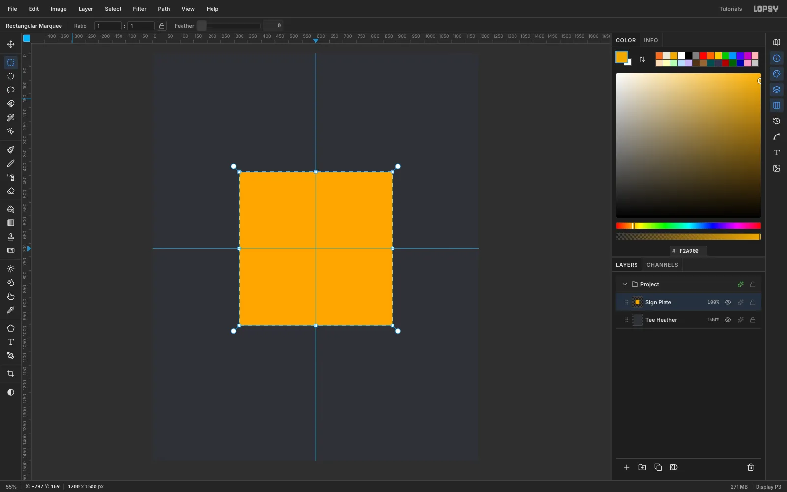

Click the top ruler at **600** and the left ruler at **720** to drop two
guides that cross at the sign's center. Rename **Layer 1** to **Sign Plate**.
With the **Rectangular Marquee** (M), drag a **566 × 566** square from
**(317, 437)**, set the foreground to amber `#F2A900`, and choose
**Edit → Fill**.

## Rotate it into a diamond

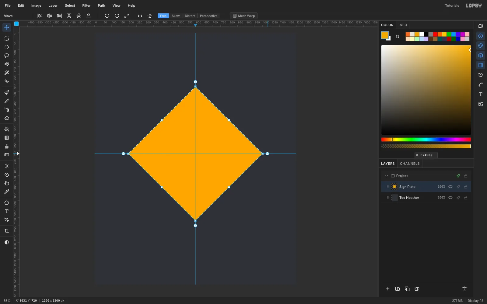

Keep the selection and switch to the **Move** tool (V). Hover just outside the
top-right corner until the cursor turns into a crosshair, then drag
clockwise until the square has turned **45°**. The guides make it easy to
check that the points line up. Press **⌘D** to commit the rotation. The
diamond now spans 800 px from point to point.

## Select an inset for the border

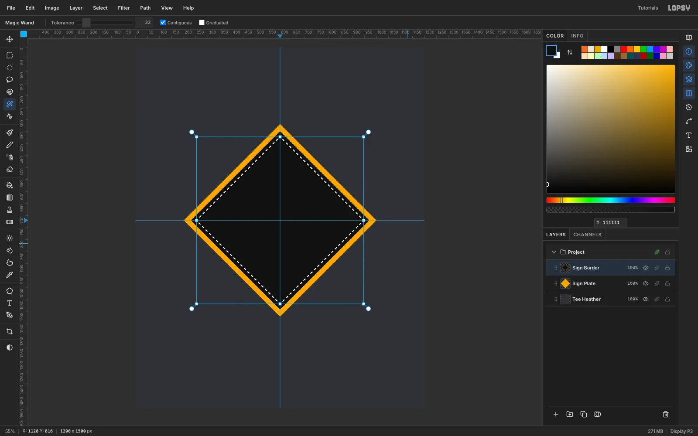

Pick the **Magic Wand** (W) with **Contiguous** ticked and click the
diamond. Choose **Select → Shrink…**, enter **20** px and click **Apply**.
Click **Add Layer**, rename the layer **Sign Border**, set the foreground to
`#111111` and choose **Edit → Fill**.

## Cut the black ring

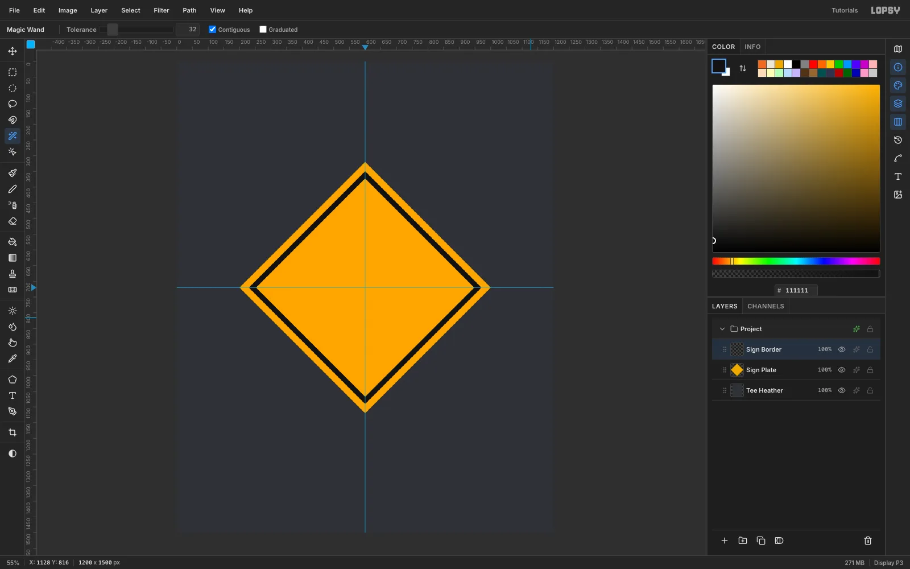

Run **Select → Shrink…** again with **16** px, then press **Delete**. That
leaves a 16 px black ring with a 20 px amber margin outside it, which is
the classic warning-sign border. Press **⌘D** to deselect.

## Lasso the T-rex

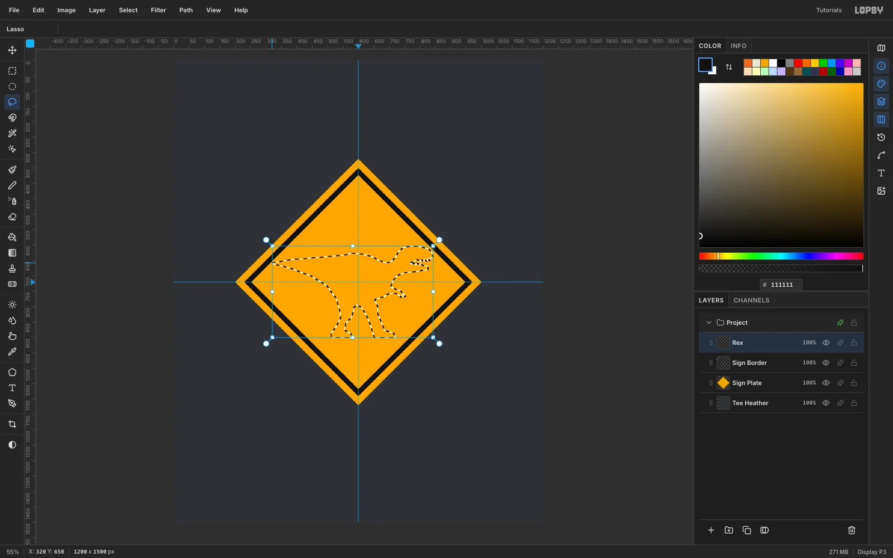

Click **Add Layer** and name it **Rex**. With the **Lasso** (L), trace a
side-on T-rex facing right, about **520 px** wide and **300 px** tall,
between x 320 and 842 and y 603 and 899:

- A long tail that tapers to a point at the left.
- A back that rises to the hips, then an **S-curved neck**.
- A blocky skull with a zigzag of **teeth** in an open jaw.
- One **tiny arm** with two claws. It's the joke of the whole shirt, so make it readable.
- Two legs in mid-stride with flat, forward-pointing feet.

Keep the silhouette inside the black ring. The tail tip and snout should
come close to it without touching.

## Fill it and punch an eye

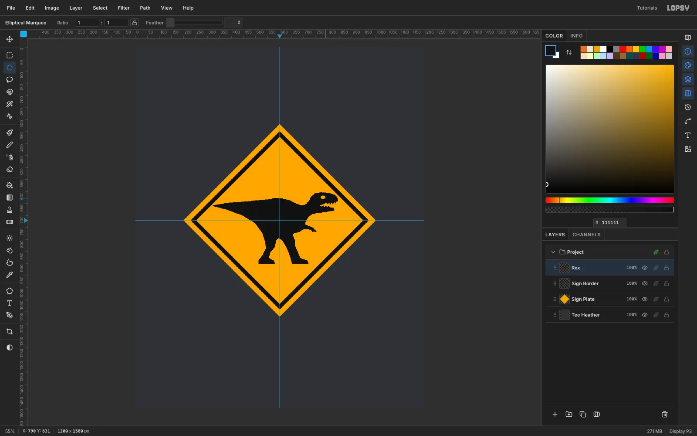

Fill the selection with `#111111` using **Edit → Fill**. Switch to the
**Elliptical Marquee**, drag a small **20 × 14** oval over the head at about
**(770, 617)**, and press **Delete**. The amber that shows through is the
eye, the same trick a stencil cutter uses. Press **⌘D**.

## Group the sign

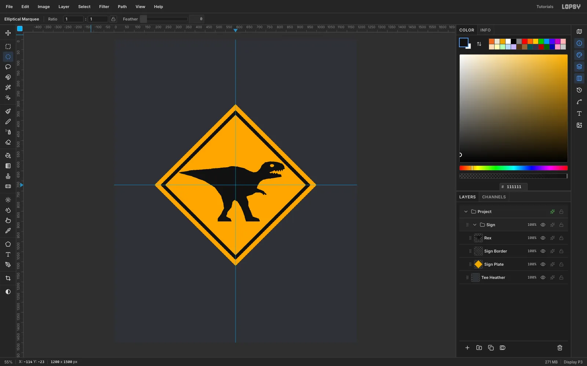

Click **Sign Plate**, then Shift-click **Rex** so all three sign layers are
selected. Choose **Layer → Group Layers** and rename the new group **Sign**.
From now on you can move the whole sign in one drag.

## Set the headline

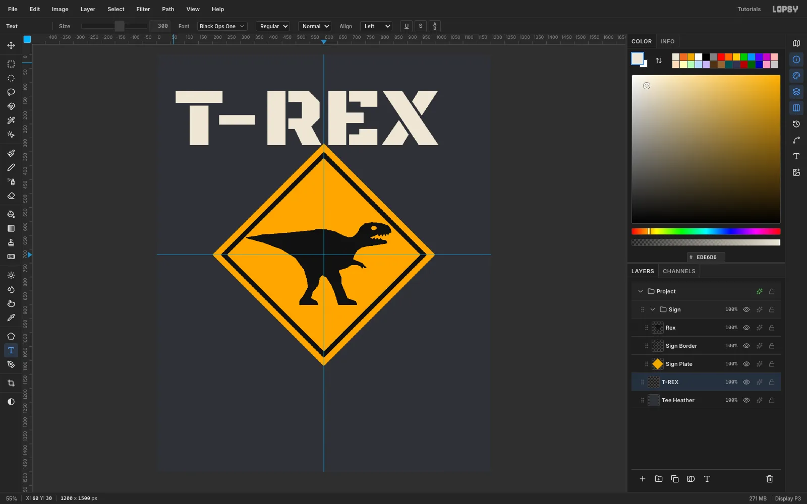

Click **Tee Heather** first, so the new text lands under the sign and your
settings don't restyle another text layer. Pick the **Text** tool (T), set
**Size 300**, choose **Black Ops One** in the font browser, and set the
foreground to cream `#EDE6D6`. Click in the empty space at the top of the
canvas, type **T-REX** and press **Tab** to commit. Black Ops One has the
bridged gaps of a real stencil built into every letter.

## Add XING in a second stencil face

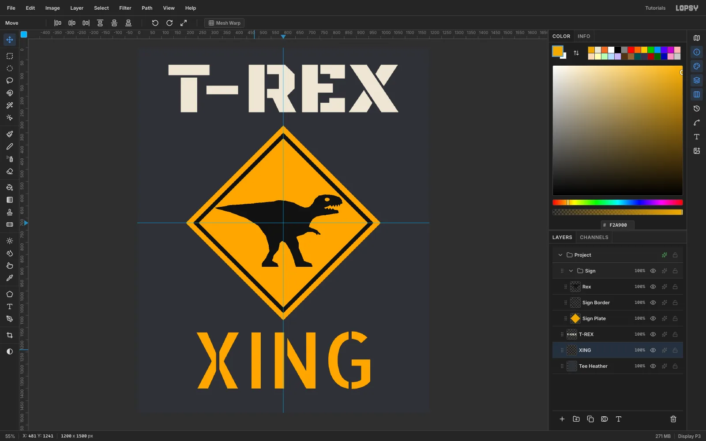

With the **Move** tool, drag T-REX until it's centered on the vertical guide
with its top at about **y 70**. Click **Tee Heather** again, then set a new
text layer in **Allerta Stencil**, **Size 320**, amber `#F2A900`: type
**XING**. Center it the same way, with its top at about **y 1165**. That
leaves a gap between the sign's bottom point and the type. A lighter stencil
face under the heavy one keeps the two words from competing.

## Draw one footprint

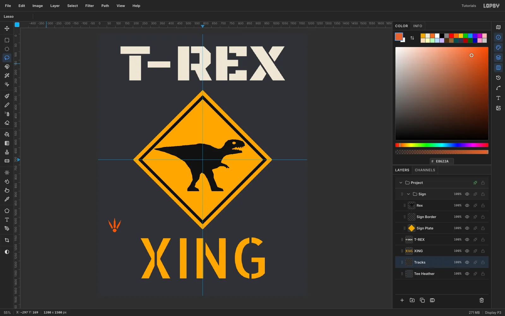

Click **Tee Heather** and **Add Layer**, then name it **Tracks**. Set the
foreground to safety orange `#E8622A`. Around **(95, 1120)**, use the
**Lasso** to draw three long, thin, pointed toes that fan upward, with the
middle one about 65 px long. Then add a small round heel pad just below
them, and leave a gap between the toes and the heel. Run **Edit → Fill**
after each shape.

## Turn it to face the sign

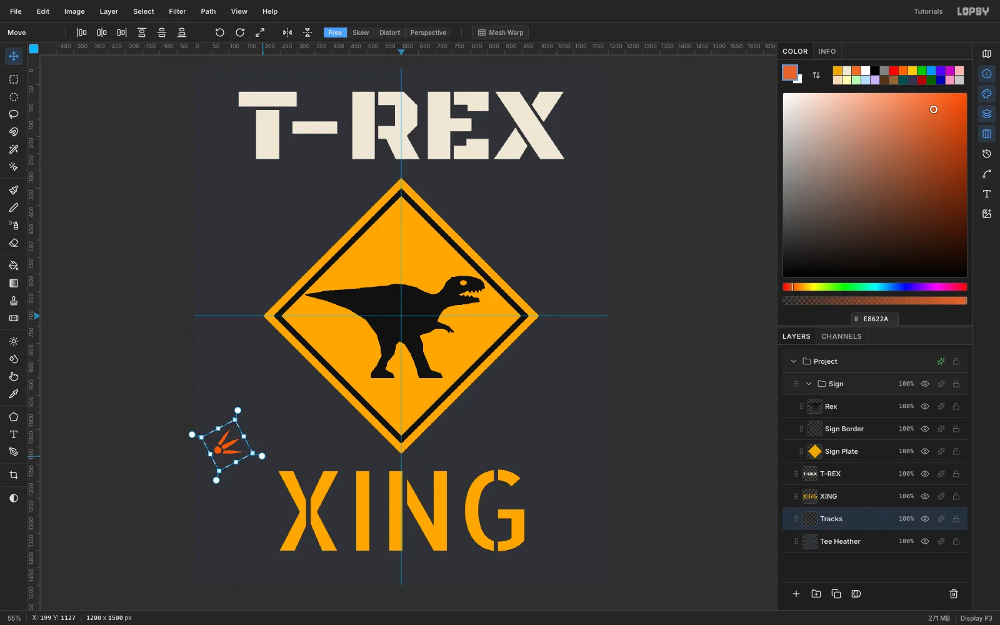

Drag a **110 × 110** marquee around the print, starting at **(40, 1040)**.
Switch to the **Move** tool and drag the rotate handle clockwise about
**62°**, so the toes point up and to the right, toward the sign. Press
**⌘D**.

## Paste, move and rotate each step

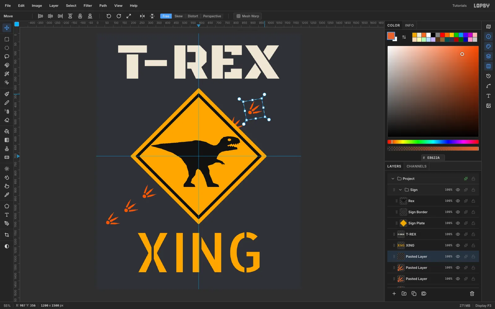

Marquee the print again and press **⌘C**, then **⌘D**. Now build the trail
one step at a time:

1. Press **⌘V**. The copy pastes in place on a new layer.
2. With the **Move** tool, drag it to the next spot, then press **⌘D**.
3. Draw a 110 × 110 marquee around it and rotate it a few degrees, then press **⌘D**.

Place the steps at about (200, 1045) and (305, 960) at the lower left, then
(815, 560), (925, 470) and (1040, 385) at the upper right. Vary the turn a
little at each step (55°, 48°, 44°, 52° and 60° in total), so the trail
curves like a real walk rather than a stamped row.

## Merge the trackway

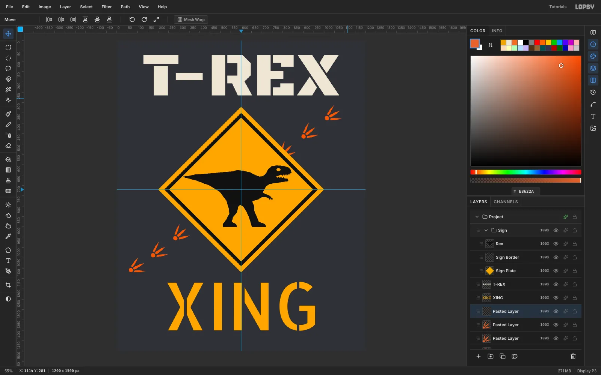

With the top pasted layer active, choose **Layer → Merge Down** five times.
All the prints end up on **Tracks**. The layer sits under the Sign group, so
the dinosaur walks *behind* the sign. The print at (815, 560) peeks out
from behind the sign's edge, which sells the depth.

## Make a hazard-stripe tile

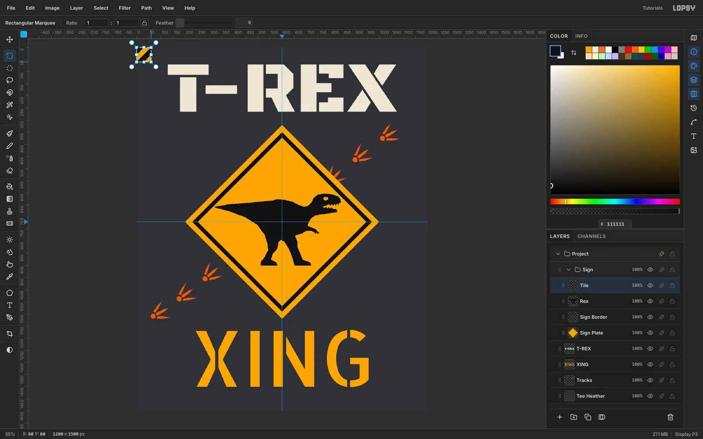

Click **Rex** and **Add Layer**, then name it **Tile**. The new layer lands
inside the Sign group. Marquee **60 × 60** at the top-left corner **(0, 0)**
and fill it amber. Then, with the Lasso, fill two black shapes: the triangle
(0, 0), (30, 0), (0, 30), and the band (60, 0), (60, 30), (30, 60), (0, 60).
The stripes line up across the tile edges, so the pattern repeats with no
seams. Marquee the tile again and choose **Edit → Define Pattern**. Then
delete the Tile layer.

## Pattern-fill the tape

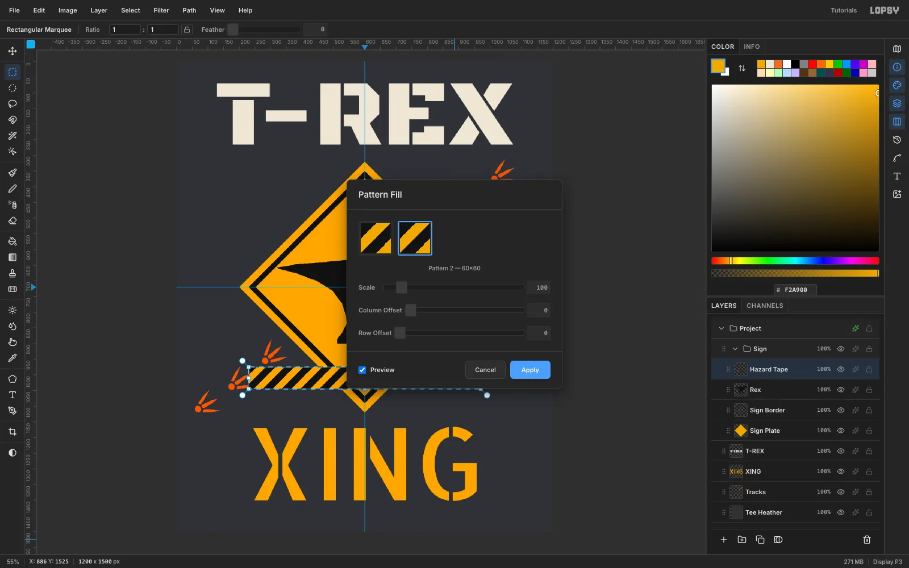

Click **Rex**, **Add Layer**, and name it **Hazard Tape**. Marquee a
**740 × 70** strip at **(230, 975)** and fill it amber first. Pattern Fill
needs pixels on the layer to fill into. Then choose **Edit → Fill with
Pattern…**, keep your new 60 × 60 pattern at **Scale 100**, and click
**Apply**.

## Tear the ends and tilt it

Lasso a zigzag over each end of the strip and press **Delete**, so the tape
looks torn off the roll. Then marquee **744 × 80** at **(228, 970)**, switch
to the **Move** tool, and rotate it **−7°** (counterclockwise). Press **⌘D**.

## Give the tape a hard shadow

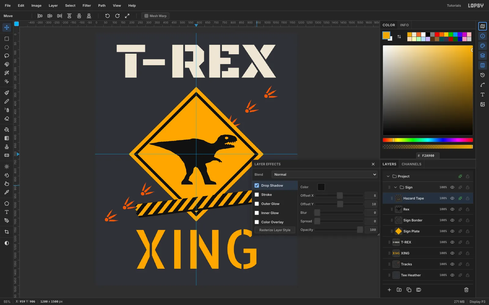

Open **Layer effects** on Hazard Tape and enable **Drop Shadow**: color
`#111111`, **Offset X 8**, **Offset Y 10**, **Blur 0**, **Spread 0**,
**Opacity 100**. A zero-blur shadow stays a solid black shape, so it prints
with the same black ink as the dinosaur. Close the drawer.

## Spray the overspray

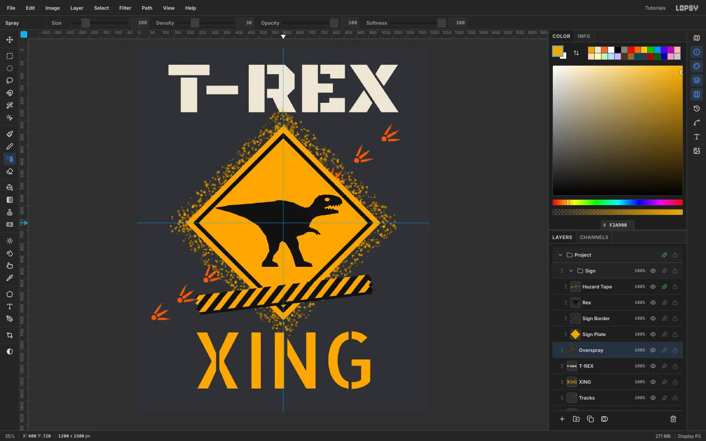

Click the **T-REX** layer and **Add Layer**, then name it **Overspray**. It
sits under the Sign group. Pick the **Spray** tool (J) with amber and set
**Size 100**, **Density 30**, **Opacity 100** and **Softness 100**. On Spray,
Softness 100 gives the *hardest* dots, and hard, full-strength dots are
something a screen printer can actually print.

Press down in the **middle of the sign**. The plate hides any paint that
builds up there while you hold still. Then trace just outside the diamond's
edge and come back to the middle before you let go. Keep the stroke moving,
in steps larger than about a third of the Size.

## Add a tagline along the tracks

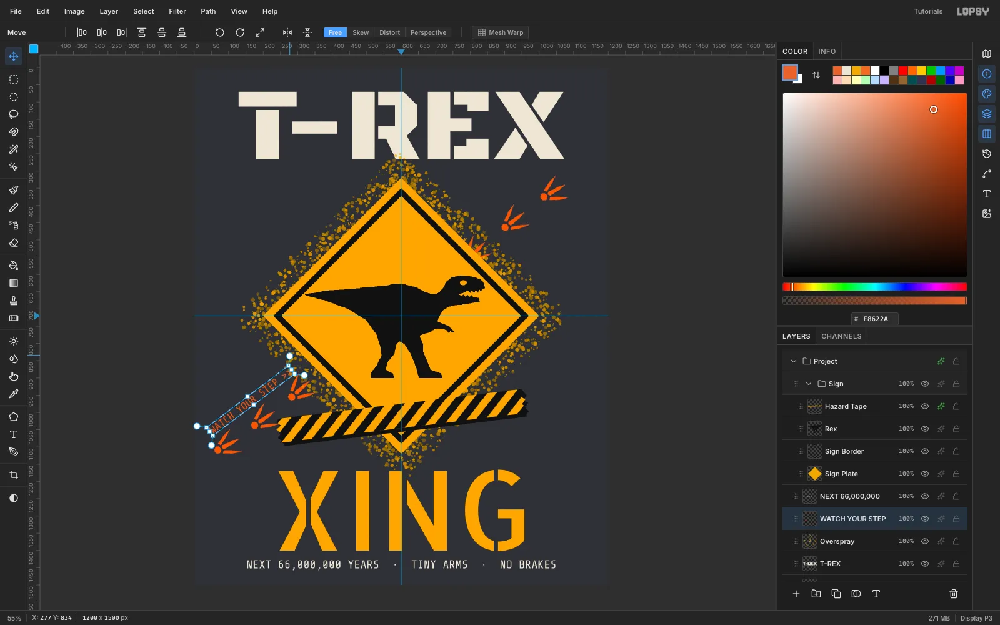

Click **Overspray**, then set **WATCH YOUR STEP >>** in **Share Tech Mono**,
**Size 30**, orange `#E8622A`, in empty space. Move it next to the lower-left
footprints, then press **⌘D**. Marquee around it, rotate it **−37°** so it
runs parallel to the trackway, and press **⌘D** again. Nudge it with the
Move tool until it clears the toes.

## Set the fine print

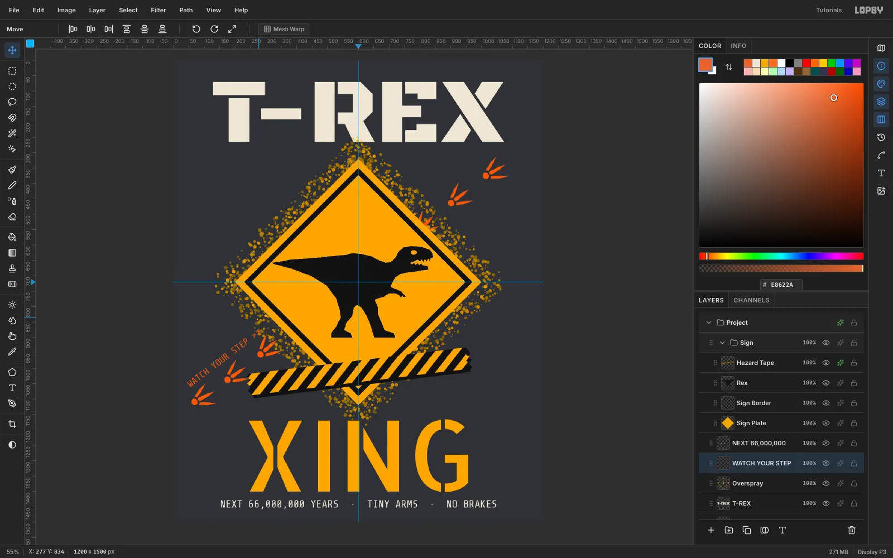

Click **Overspray** again, then set **NEXT 66,000,000 YEARS · TINY ARMS ·
NO BRAKES** in **Share Tech Mono**, **Size 34**, cream. The middle dots
aren't on most keyboards, so paste the line in with ⌘V. Center it on the
guide with its top at about **y 1428**. It's small enough to sit near the
hem, and it gives anyone reading up close a second joke.

## Start the distress texture

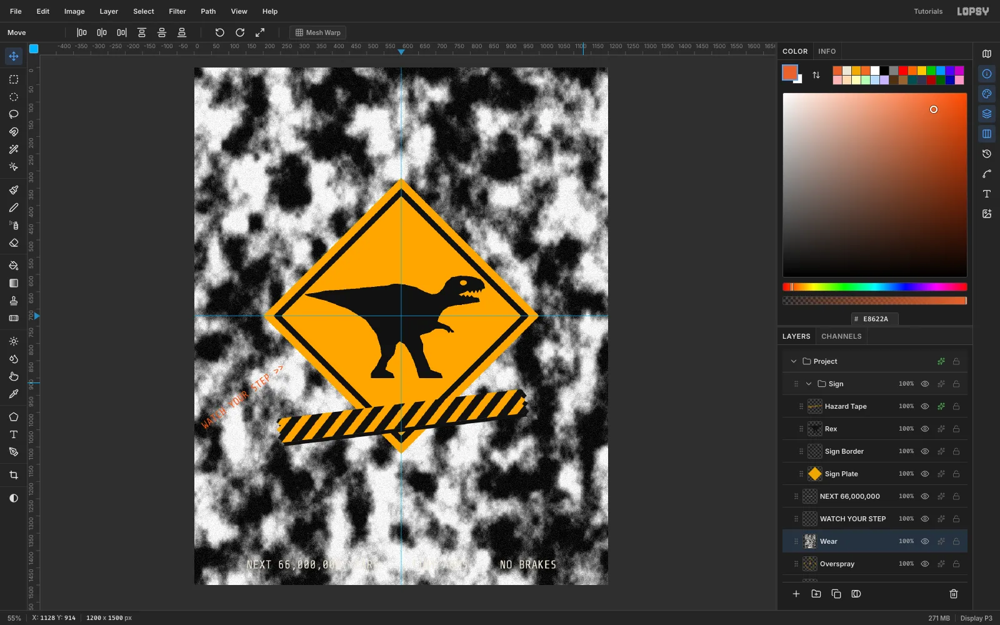

Click **Overspray** and **Add Layer**, then name it **Wear**. Run
**Filter → Clouds…** at **Scale 20**. Then run **Filter → Add Noise…** with
**Mono** and **Amount 80**. The noise breaks the soft cloud edges into
grain, like ink that's cracked and washed out.

## Threshold it into specks

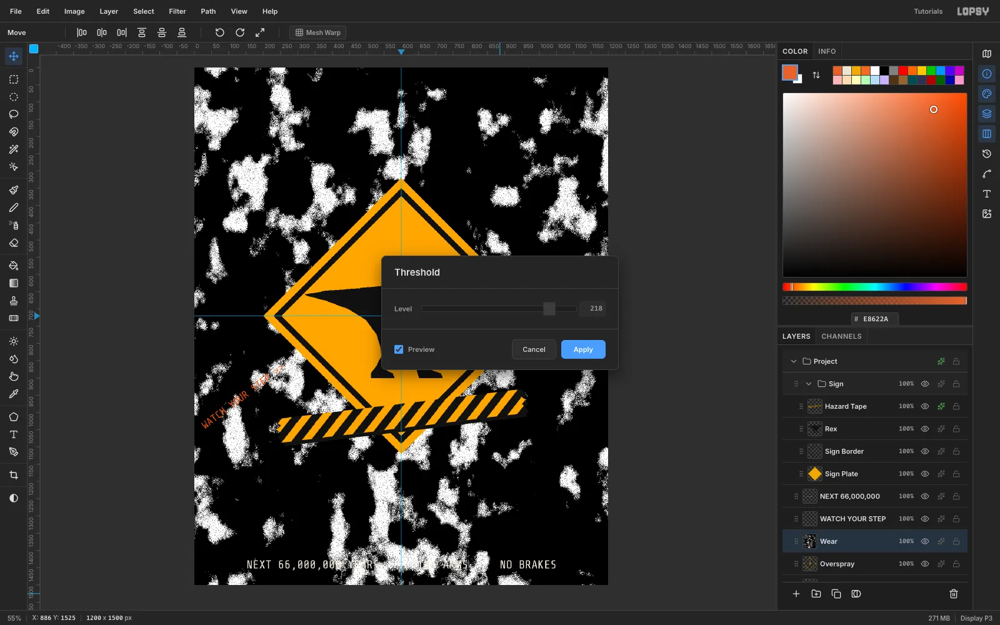

Choose **Filter → Threshold…** and set **Level 218**. Only about a fifth of
the layer stays white, in grainy patches. Click **Apply**.

Next, pick the **Magic Wand** with **Contiguous** unticked and click any
black area. Press **Delete** straight away, then **⌘D**. A selection with
thousands of islands makes the marching ants slow to draw, so don't leave
it active.

## Recolor the specks to the shirt

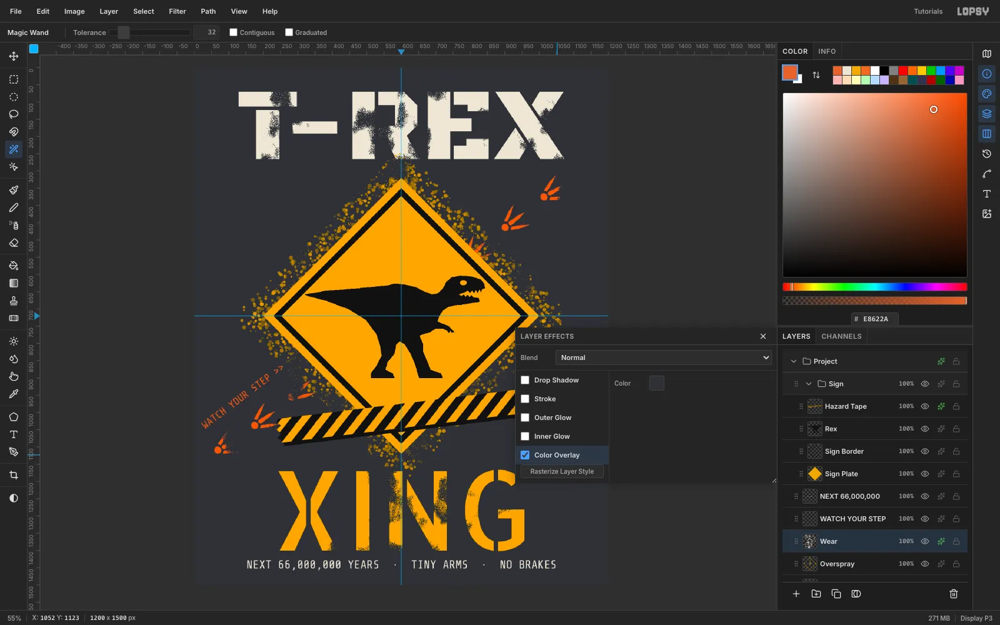

Open **Layer effects** on Wear, enable **Color Overlay**, and set it to the
shirt color `#2F3136`. The specks now look like bare fabric showing through
the ink. That's the key to a convincing distressed print: the wear must be
the **exact** shirt color, never a grey or a tint, or it reads as an extra
muddy ink.

## Move the wear above everything

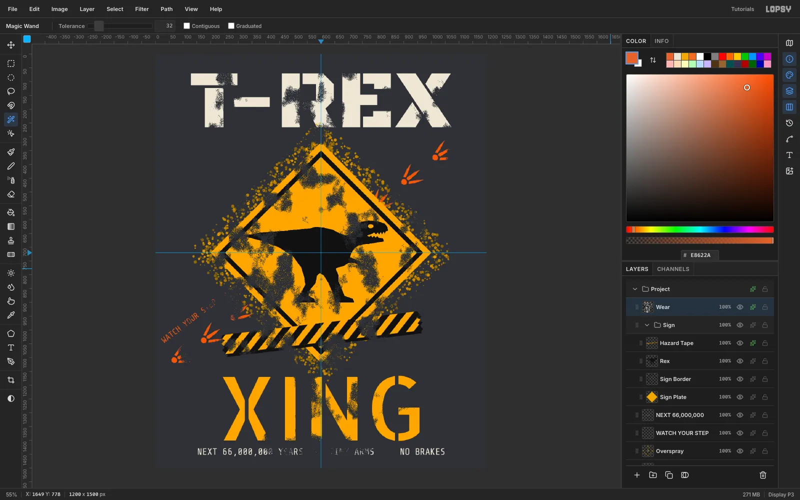

Drag the grip on the **Wear** row up onto the top half of the **Sign**
group's row. Wear drops above the whole group, and now it cuts into the
sign, the tracks and both headlines.

## Protect the small type

Fine print can't survive heavy wear. On the Wear layer, marquee a
**960 × 52** band from **(120, 1416)** over the fine print and press
**Delete**. Then lasso a tilted box around WATCH YOUR STEP and delete that
too.

## Keep the pictogram clean

The dinosaur has to read at a glance, so the wear should cling to the
sign's edges. Pick the **Eraser** (E), set **Size 200**, and zigzag across
the middle of the sign on the Wear layer. Leave the corners, the border and
the headlines worn.

## Export the print file

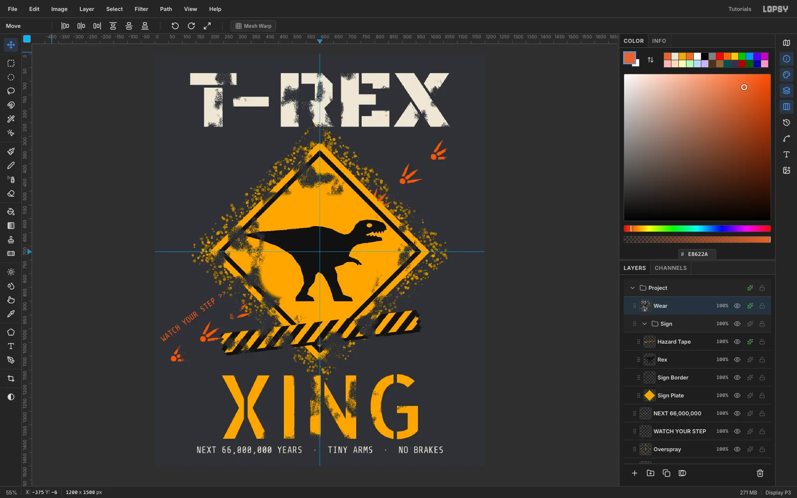

That's the finished graphic. Choose **File → Quick Export PNG** for the
artwork, and **File → Save Project** to keep an editable `.lopsy` copy with
every layer. Every shape is a flat fill in one of four inks, and every
worn speck is exactly the shirt color. A printer can separate the file
straight into screens and treat the specks as knock-outs.
