This flash sheet retells the Soviet space programme, 1957–1963, in the language of **Suprematism**. That's Malevich's flat squares, circles and bars floating on a pale ground. El Lissitzky's *About Two Squares* is a direct influence.

Each design is built from marquee and lasso fills and gets a tattoo-style ink outline. The dotwork shading is made with noise and Threshold. The title is rotated to the angle of a red bar. The labels are set in two typefaces that both include Cyrillic.

Palette (typed as hex in Lopsy):

- Paper `#EAE3CE`, ink `#161410`
- Brick red `#B6392A`, ochre `#CF9E44`, slate blue `#2F4F88`, stone `#B9B3A5`
- Edge toning `#8A6A44`, rust `#A8683A` / `#5E3217`

Fonts: **Russo One** for the headline and №7, and **Tenor Sans** for the subtitle and labels.

The document is **1500 × 2100 px**. Keep the width a multiple of 4.

## Set up the sheet with guides and a snapped frame

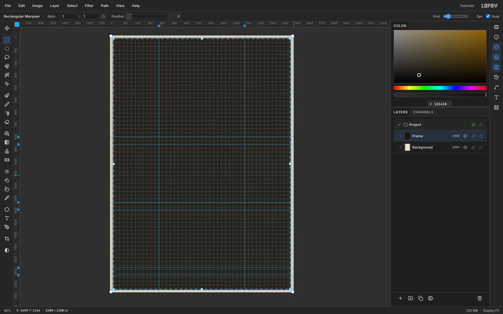

1. Create a **1500 × 2100** document and fill the Background with paper `#EAE3CE` using **Edit → Fill**.
2. Click the top ruler at **400** and **1100** to add the two column axes. Click the left ruler at **830, 890, 1365, 1425, 1900 and 1960**. Each row gets two guides: one where the design ends and one where its label starts, 60 px lower.
3. Turn on **View → Show Grid** and set the grid slider to **8 px**. Snap turns on with the grid.
4. Rename Layer 1 to **Frame**. Drag a rectangular marquee from about (21, 21) to (1479, 2079). It snaps to the grid.
5. Fill it with ink, run **Select → Shrink…** by **6** px and press [[Delete]]. That leaves a crisp 6 px border.
6. Hide the grid again.

## Lay down the red bar and the black square

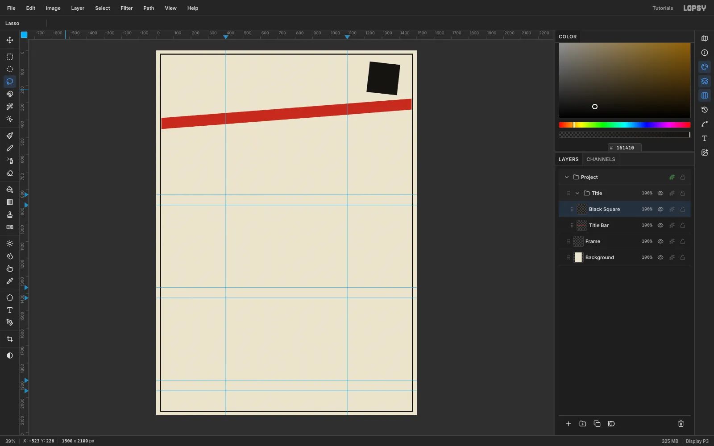

Make a group called **Title**. This composition starts where Malevich's paintings do: a long red plane and a black square.

1. On a **Title Bar** layer, use the **Lasso** to draw a four-point bar, 64 px thick, from (22, 420) up to (1478, 308). Fill it with red. The ends run right out to the frame, so the bar looks like it passes under it.
2. On a **Black Square** layer, lasso a 176 px square tilted **6°**, centred at (1308, 160), and fill it with ink.
3. Leave about 30 px of paper between the square's lowest corner and the bar. If they nearly touch, it reads as a mistake.

## Draw every shape with a tattoo outline

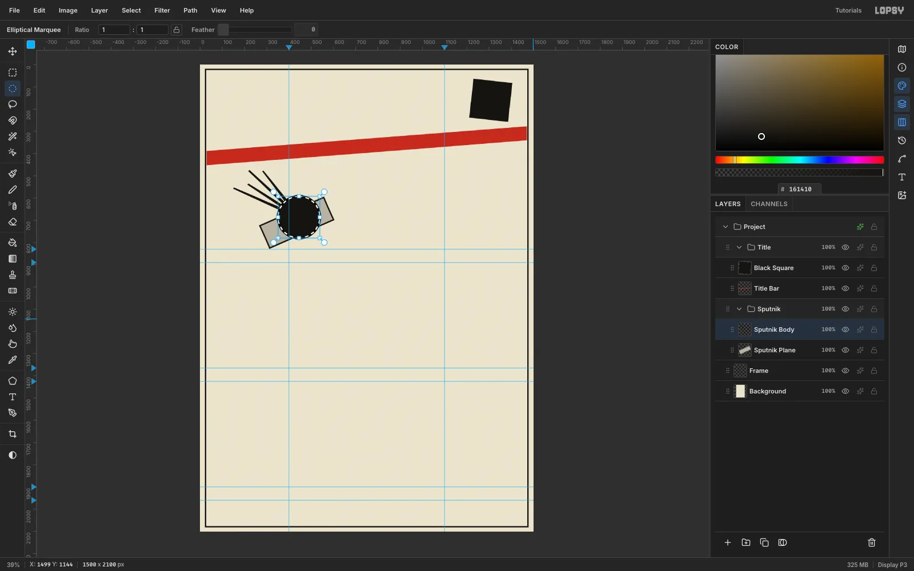

Each flash design gets its own group. Every coloured shape uses the same outline trick:

1. Draw the shape with the Lasso or Elliptical Marquee.
2. Fill it with **ink**.
3. Run **Select → Shrink…** by **6** px.
4. Fill with the colour.

You get an even 6 px keyline with no Stroke effect. Shapes that overlap on the same layer keep their own outlines.

For **Sputnik** (group *Sputnik*):
- **Plate:** a stone-grey plate 320 × 116, rotated −24°.
- **Antennae:** four tapered ink bars, 13 px at the root and 7 px at the tip, swept back from the disc.
- **Disc:** a red disc, 200 px across, outlined as above.

## Build the rocket upright, then rotate it

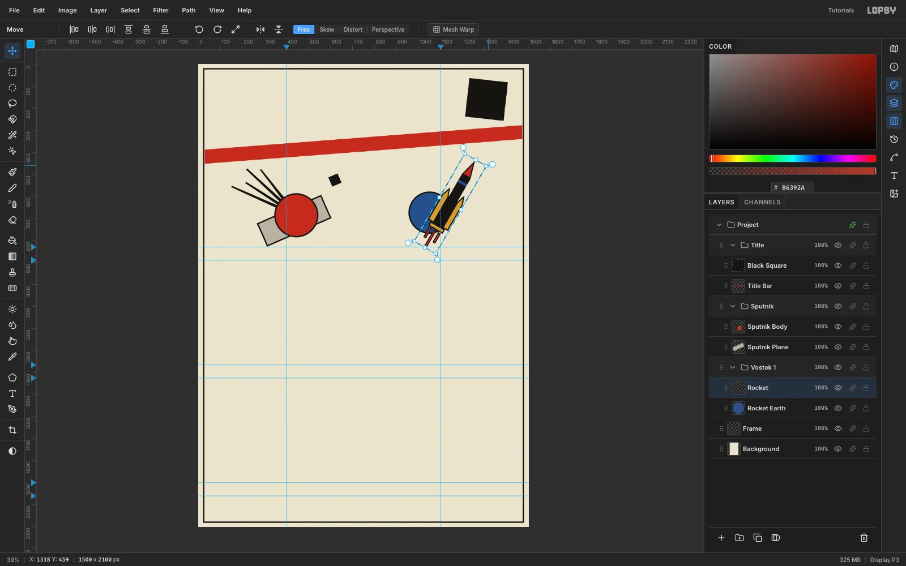

Diagonals give Suprematism its sense of flight. Straight shapes are easier to draw, so build the rocket upright first.

1. In a group called **Vostok 1**, draw a blue **Rocket Earth** disc with an ink outline.
2. On a **Rocket** layer, draw these parts, using the outline trick with **5** px on the ochre and red parts:
   - A black core with a blue stage band.
   - A red nose cone and two ochre boosters.
   - An ochre engine plate and three short red exhaust bars.
3. Marquee the rocket and switch to the **Move** tool.
4. Hold [[Cmd]] and drag the rotation handle outside the top-right corner. [[Cmd]] snaps rotation to 15° steps, so stop at exactly **30°**.
5. Press [[Cmd+D]] to commit.

## Tilt an orbit ring behind a black planet

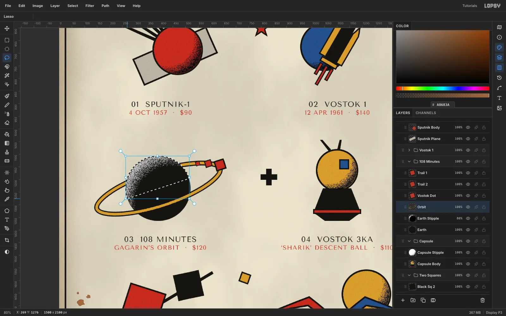

The **108 Minutes** piece is Gagarin's single orbit, built around Malevich's black circle.

1. **Planet:** on an **Earth** layer, fill a black disc 256 px across.
2. **Ring:** on an **Orbit** layer, make an ellipse 532 × 156 around the same centre. Then:
   - Fill it with ink, then Shrink 4.
   - Fill ochre, then Shrink 10.
   - Fill ink, then Shrink 4.
   - Press [[Delete]], which leaves an ink–ochre–ink band.
3. Marquee the ring and rotate it about **−18°** with the Move tool, then press [[Cmd+D]].
4. **Back of the ring:** lasso the planet's upper half, above the ring's long axis and slightly wider than the planet, and press [[Delete]] on the Orbit layer. The ring now disappears behind the planet and comes back in front.

## Add a motion trail with copy, paste and scale

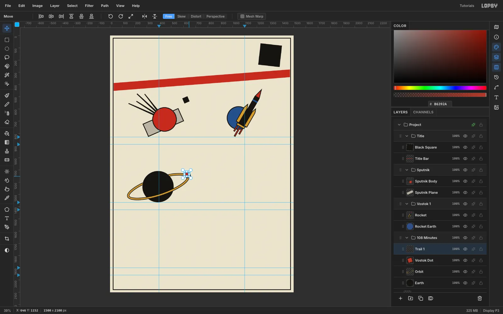

1. Draw the **Vostok Dot**: a 42 px red square with a 5 px outline, sitting on the ring.
2. Marquee it, press [[Cmd+C]], wait a moment and press [[Cmd+V]]. The copy is pasted in place as a new layer.
3. Marquee the copy. With the **Move** tool, hold [[Cmd]] and drag the bottom-right corner in to about **66%**. [[Cmd]] keeps the aspect ratio. Press [[Cmd+D]].
4. Drag the copy back along the ring.
5. Repeat for a third copy at about **42%**. The shrinking squares read as speed.

## Make Lissitzky's two squares fly over a curved horizon

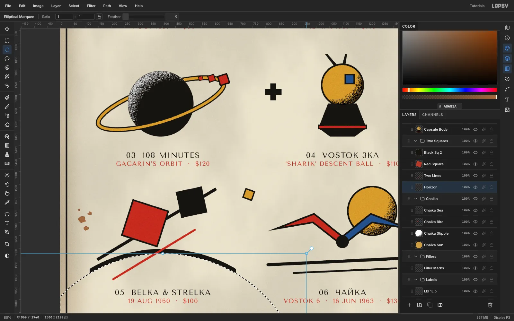

**Belka & Strelka**, the two dogs of Korabl-Sputnik 2, become Lissitzky's red and black squares arriving over the Earth.

1. **Horizon:** on a **Horizon** layer, fill an ink circle 1120 px across, centred well below the design.
   - Select the same circle **18 px lower** and press [[Delete]]. What's left is a crescent that tapers toward its ends.
   - Marquee-delete everything more than 285 px left or right of the centre.
2. **Lines:** on **Two Lines**, lasso a 12 px ink diagonal and an 8 px red one. Keep them clear of each other and of the square corners, so no three shapes meet at one point.
3. **Red square:** draw a 150 px red square with an outline, axis-aligned. Rotate it **18°** with the Move tool's rotation handle.
4. **Black square:** add a 104 px black square tilted −12°.

The capsule next to it is built the same way:
- An ochre sphere with an outline.
- A black cone with a red band.
- A blue hatch.
- Two thin antennae.

## Draw the gull and its sea lines with the Pen

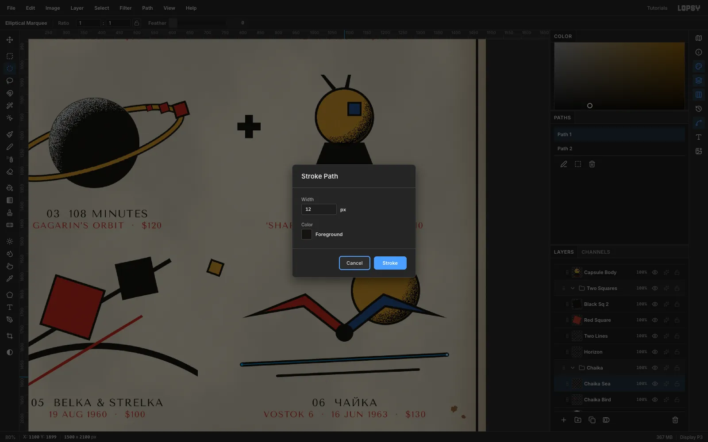

*Чайка* ("seagull") was Valentina Tereshkova's call sign on Vostok 6.

1. **Sun:** in a **Chaika** group, draw an ochre sun with an outline.
2. **Wings:** on a **Chaika Bird** layer, lasso two outlined wings, red on the left and blue on the right. Each rises from the body to a wrist and then sweeps out to a pointed tip. Add a black disc for the body where they meet.
3. **Sea lines:**
   - Add a **Chaika Sea** layer.
   - With the **Pen** tool, click two points for each line and click **Commit path**.
   - Set the foreground to ink. Select each path in the **Paths** panel and click **Stroke Path**: Width **12** for the first line and **7** for the second.

## Shade the spheres with stipple dotwork

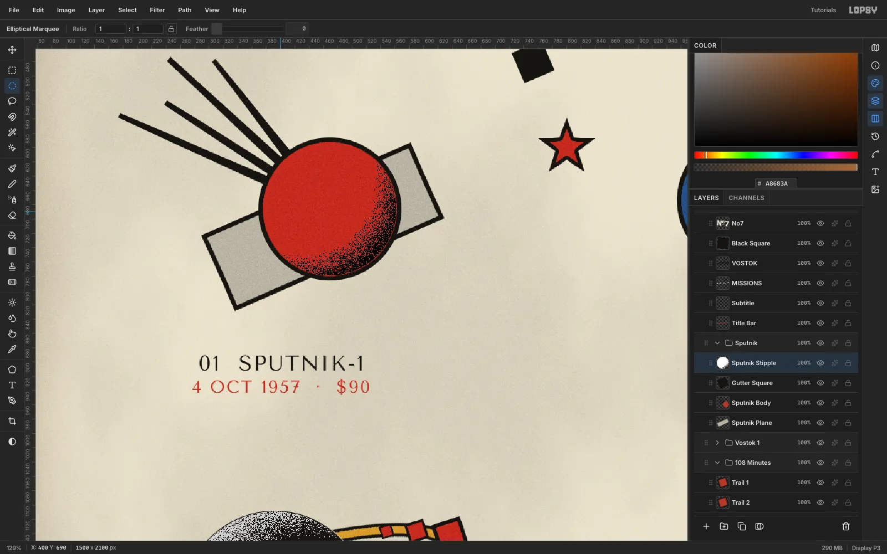

The light comes from the top left, so shade the bottom-right of every sphere.

1. Above each sphere, add a stipple layer, such as **Sputnik Stipple**.
2. Select the sphere's coloured inside with the Elliptical Marquee.
3. With the **Gradient** tool set to **Radial**, set these stops in **Advanced…**:
   - White at 0 and at 48%.
   - Mid-grey `#606060` at 100%.
4. Drag from a point up and to the left of the centre, out past the lower-right edge.
5. Run **Filter → Add Noise…** at **Amount 100**, **Mono**.
6. Run **Filter → Threshold…** at **128**. The grey end breaks into dots and fades out toward the light.
7. Set the layer to **Multiply**. The white disappears and only the dots stay.

For the black planet, reverse the colours: use black stops and a light-grey edge, drag from the lower right, and set the layer to **Screen** at 80%. That gives a pale dotted rim on its lit side.

## Put small filler motifs in the gutters

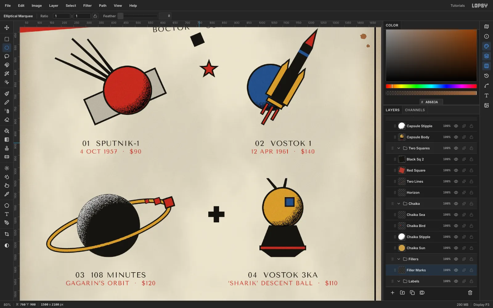

Real flash sheets fill the gaps with small motifs.

1. In a **Fillers** group, lasso these shapes onto the column axis (x ≈ 750):
   - A red **five-point star** with an outline.
   - A black **cross**.
   - A small ochre square with an outline.
2. If a small shape ends up in the wrong place, move it with a marquee, [[Cmd+X]] and [[Cmd+V]], then drag the pasted layer onto the gutter axis. The pasted layer lands in place above the layer you cut from.

## Set the title to the angle of the bar

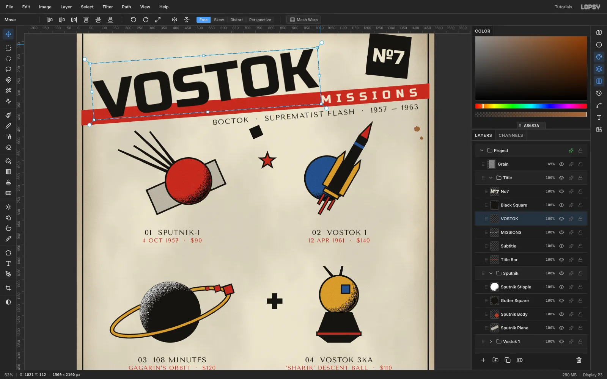

1. Create each text layer flat, in empty space, then rasterize and rotate it:
   - **VOSTOK:** Russo One **230**, ink.
   - **MISSIONS:** Russo One **48**, paper colour, **letter spacing 22**.
   - **Subtitle:** Tenor Sans **30**, letter spacing 3. The text is `ВОСТОК · SUPREMATIST FLASH · 1957 – 1963`.
   - **№7:** Russo One **80**, paper colour.
2. Click **Rasterize Layer** on each one. Marquee it, and rotate it **−4.43°** with the Move tool (the №7 gets **+6°**). Commit each with [[Cmd+D]].
3. Seat each piece:
   - **VOSTOK:** move it so the letter feet sink about **12 px** into the red bar.
   - **MISSIONS:** centre it inside the bar, about 40 px from the bar's end.
   - **Subtitle:** right-align it under the bar, about 17 px below it.
   - **№7:** centre it in the black square.

> **Tip:** Set letter spacing back to 0 before you create the next text. The Text panel carries the last value over to new type.

## Centre two-line labels on the column axes

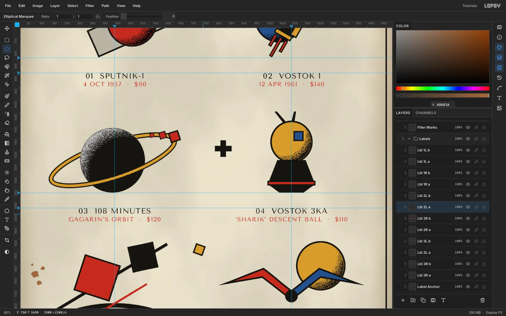

Each design gets a number and name in Tenor Sans **30** ink. Below it goes the date and price in Tenor Sans **24** red, with letter spacing 2.

1. Put all the labels in a **Labels** group.
2. Create the red line **before** the ink line above it. A text-tool click just below an existing line would edit that line instead of starting a new one.
3. Point text ignores alignment, so centre each label by eye (or by its width) on the column guide.
4. Put the tops on the label-row guides. That gives every design the same 60 px gap above its label.

For example, `01  SPUTNIK-1` over `4 OCT 1957  ·  $90`. Use curly quotes for `GAGARIN’S` and `‘SHARIK’`.

## Age the paper and add grain

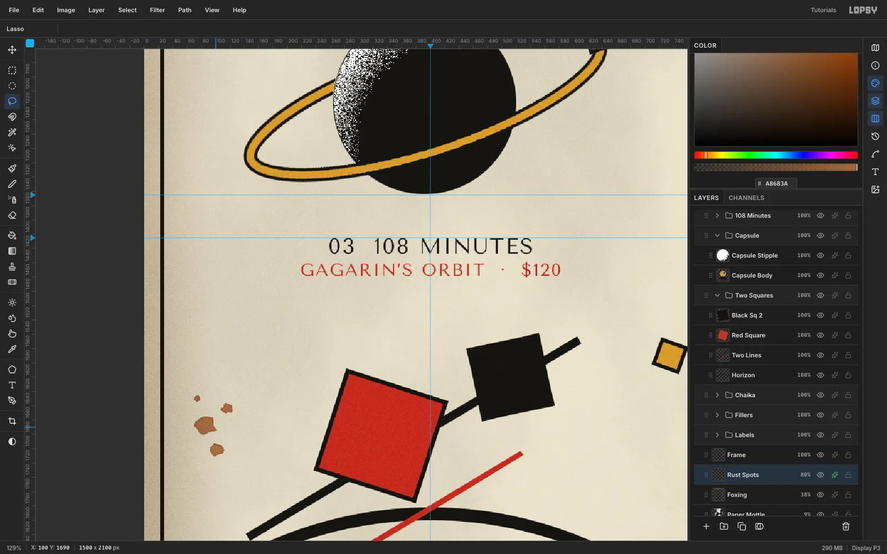

1. **Paper Mottle:** above the Background, fill a layer white and run **Filter → Clouds…** at Scale 5. Set it to **Multiply** at **9%**.
2. **Foxing:**
   - Add a layer and pick the **Brush** at Size 340 with Hardness 0 in toning brown.
   - Paint soft strokes along each edge. Start every stroke on the grey pasteboard, not on a ruler, or you'll add a guide instead of paint.
   - Set the layer to **Multiply** at 38%.
3. **Rust Spots:**
   - Lasso a few irregular blobs in two or three clusters near the margins, and fill them with rust `#A8683A`.
   - Run **Gaussian Blur** 1.2.
   - Add an **Inner Glow** in `#5E3217`, Size 4, for a darker rim.
   - Set the layer to **Multiply** at 80%.
4. **Grain:**
   - Fill a layer mid-grey `#808080` and run **Add Noise** 100, **Mono**, **Gaussian**.
   - Set it to **Overlay** at 45%.
   - Drag it to the top of the layer stack.
5. Export with **File → Quick Export PNG**.
