Surrealist logos work by showing something impossible, drawn with plain,
confident shapes. This one borrows two ideas from René Magritte:

- *The Empire of Light*, a daytime sky above a night street
- the floating bowler hat

In this tutorial you'll build an emblem for an imaginary arthouse cinema,
**Xanadu Cinema**. A navy night disc has a keyhole cut into it, and through
the keyhole you see a bright blue sky where a bowler hat floats. One cloud
escapes past the edge of the badge. Theatre marquee bulbs ring it, and a
curved seal line reads *Ceci n'est pas un film*, a nod to Magritte's
*This is not a pipe*.

You'll use selections, gradients, the brush, copy and paste, transforms,
layer effects, radial symmetry, the Pen tool, text on a path, filters, blend
modes, and a group adjustment.

## Set up the paper, guides and night disc

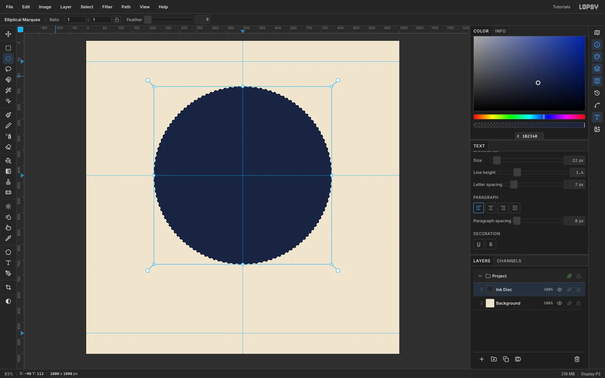

Open [Lopsy](/) and create a **1000 × 1000** document with a white
background. Click the `Background` layer, set the foreground color to
`#EEE4CF` in the Color panel's hex field, and choose **Edit → Fill** to get a
warm paper tone.

Click the top ruler at x = `500` to drop a vertical guide. Then click the
left ruler at y = `430` (the center of the badge), `66` (top margin) and
`934` (bottom margin) for three horizontal guides.

Double-click `Layer 1` and rename it `Ink Disc`. Pick the **Elliptical
Marquee** and drag from (216, 146) to (784, 714) to make a 568 px circle
centered on the guides. Set the foreground to `#1B2340` and choose
**Edit → Fill**. Press [[Cmd+D]] to deselect.

## Draw the keyhole with the Lasso and a 1 px feather

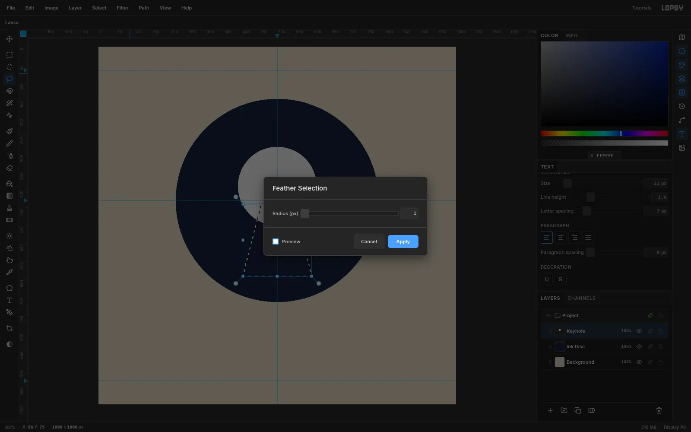

Click **Add Layer** and name it `Keyhole`. This white shape is a stencil
you'll use to cut other layers, and you'll delete it at the end.

1. Set the foreground to `#FFFFFF`. With the Elliptical Marquee, drag from
   (390, 280) to (610, 500) and choose **Edit → Fill** for the round top.
   Press [[Cmd+D]].
2. Pick the **Lasso**. Drag straight lines from (456, 440) to (544, 440),
   to (596, 642), to (404, 642), and back to the start. That's the tapered
   bottom of the keyhole.
3. Choose **Select → Feather…**, set **Radius** to `1` and click **Apply**.
   The 1 px feather smooths the stair-stepped diagonal edges.

## Fill the keyhole stencil

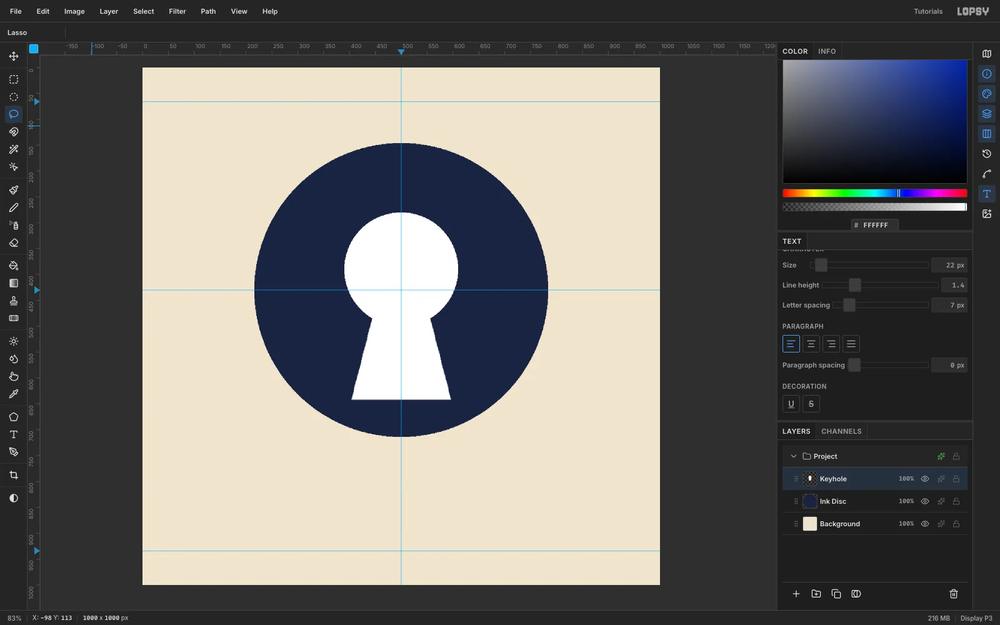

Choose **Edit → Fill** to fill the trapezoid white, then press [[Cmd+D]].
The two white shapes overlap at the neck, so they read as one keyhole.

## Build a daylight sky gradient

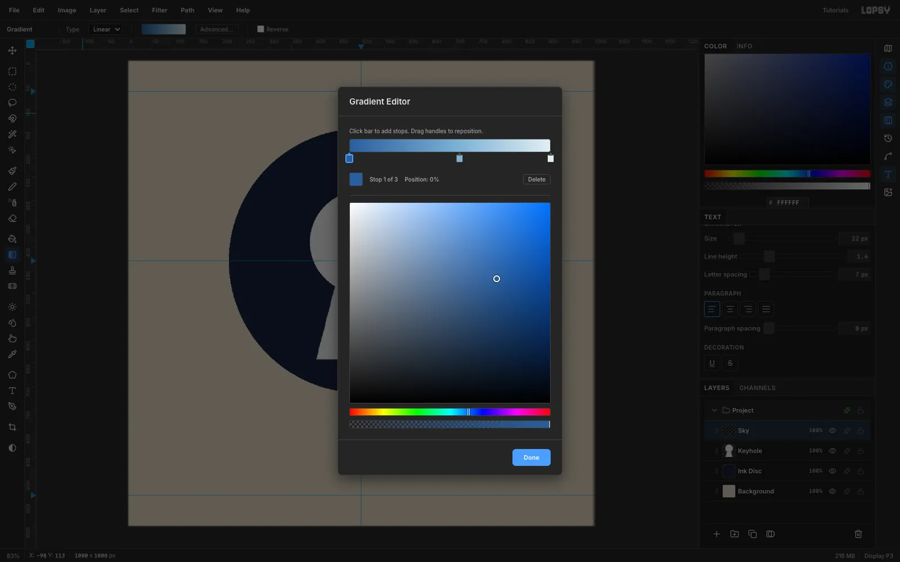

Click **Add Layer** and name it `Sky`. Pick the **Gradient** tool and click
**Advanced…**. In the **Gradient Editor**, click the bar at about 55% to add
a middle stop. Select each stop and pick its color in the square and hue
strip:

1. A deep cerulean, about `#295C9E`, at 0%
2. A soft sky blue, about `#7CB1D6`, at 55%
3. A pale haze, about `#DFEDF2`, at 100%

Click **Done**, then drag from (500, 282) straight down to (500, 644). The
sky runs from the top of the keyhole to its bottom.

## Clip the sky to the keyhole

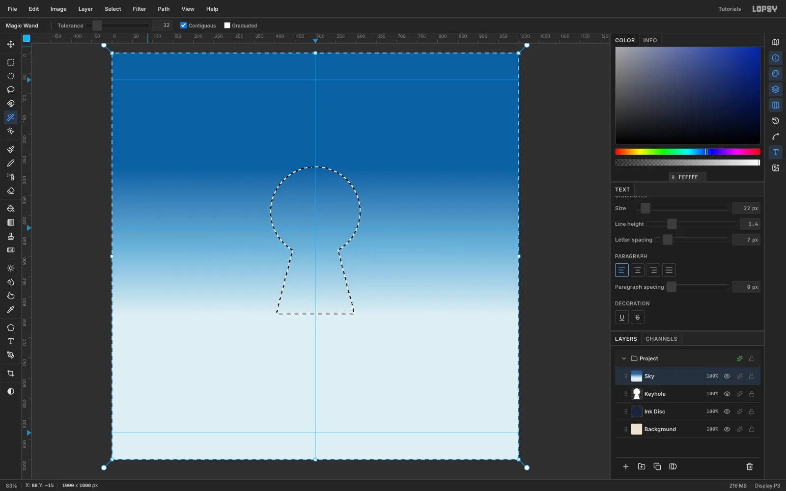

The sky covers the whole canvas, so cut it down to the stencil:

1. Click the `Keyhole` layer and pick the **Magic Wand**. Click inside the
   white keyhole to select it.
2. Click the `Sky` layer and choose **Select → Inverse**. Everything *except*
   the keyhole is now selected.
3. Press [[Delete]], then [[Cmd+D]].

Now the daytime sky only shows through the keyhole.

## Outline the keyhole in cream

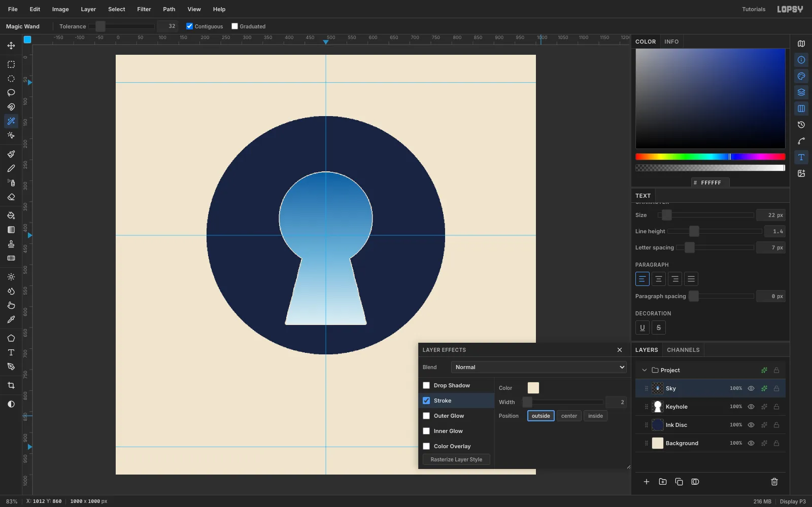

A thin light edge makes the keyhole read as a cut-out, even at small sizes.
With `Sky` active, open its **Layer effects** (the sparkle icon on the layer
row) and turn on **Stroke**. Set the color to `#F1E4CC`, the position to
**Outside** and **Width** to `2`.

## Paint Magritte-style clouds

Click **Add Layer** and name it `Clouds`. Pick the **Brush** and set
**Hardness** `80` and **Opacity** `100`. Each cloud is five or six
overlapping round dabs, so click instead of dragging.

1. Set the foreground to `#A9BED3` and click the underside of each cloud,
   a few pixels lower than where the white will go.
2. Set the foreground to `#FFFFFF` and click the same spots again, about
   6 px higher and at full size. The blue dabs that peek out below become
   the soft shadow on each cloud's belly.

Vary the **Size** between `20` and `52` so the puffs look natural. Paint a
cloud in the upper left of the keyhole, one on the right edge, one small
cloud at the neck and one in the stem. It's fine for clouds to spill past
the keyhole edge, because you'll trim them in a moment.

## Copy a cloud to let it escape

Here's the surreal move: one cloud slips out of the keyhole and drifts off
the badge. With the **Rectangular Marquee**, drag around the upper-left
cloud, from (396, 280) to (506, 362). Press [[Cmd+C]], then [[Cmd+V]]. The
copy is pasted in place on a new layer. Rename it `Drifter`.

> **Tip:** Paste straight after copying. Pressing Delete on any layer
> between the copy and the paste makes the paste land in the top-left corner
> of the canvas instead of in place.

## Move the escaping cloud

Draw the same marquee again over the copy and press [[V]] for the **Move**
tool. Drag from inside the selection up and to the right, until the cloud
sits across the top-right edge of the disc at about (770, 215).

## Scale and rotate the cloud

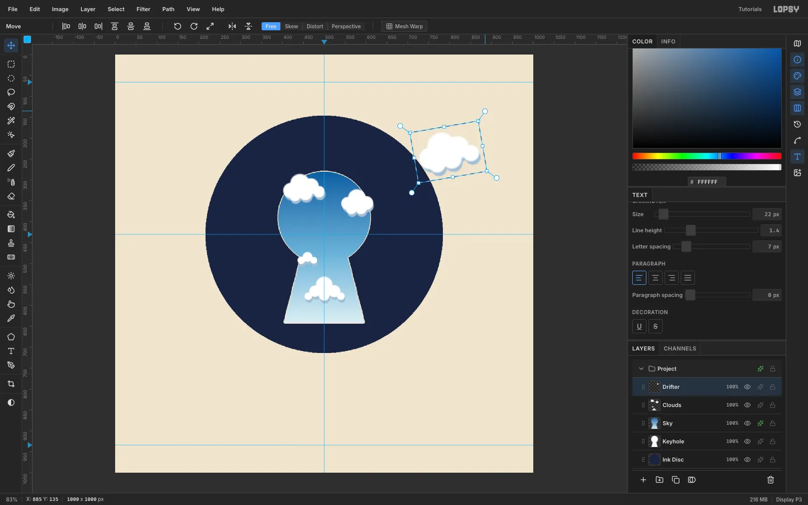

Press [[Cmd+D]] to drop the moved cloud. Draw a marquee around it again, and
use these steps:

1. [[Shift]]-drag the bottom-right corner handle out until the cloud is
   about 1.45× its size, then press [[Cmd+D]].
2. Marquee the bigger cloud once more. Drag the round **rotation handle**
   just outside the top-right corner counterclockwise by about 10°.
3. Press [[Cmd+D]] to commit.

> **Tip:** Commit with [[Cmd+D]] between moving, scaling and rotating. Each
> transform then starts from a fresh box whose handles match what you see.

## Trim the clouds to the keyhole

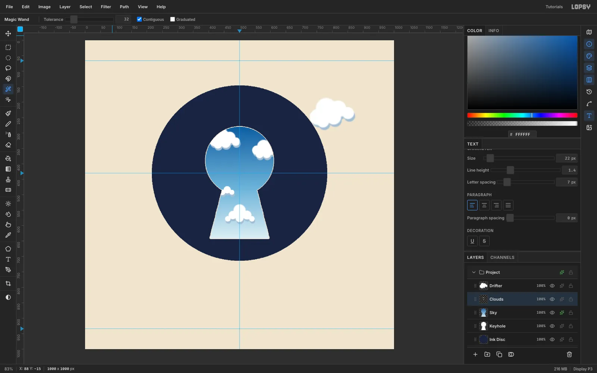

Repeat the clipping trick on `Clouds`:

1. Magic Wand the `Keyhole` stencil.
2. Click `Clouds` and choose **Select → Inverse**.
3. Press [[Delete]], then [[Cmd+D]].

`Drifter` is on its own layer, so it stays outside the keyhole.

## Build the floating bowler hat

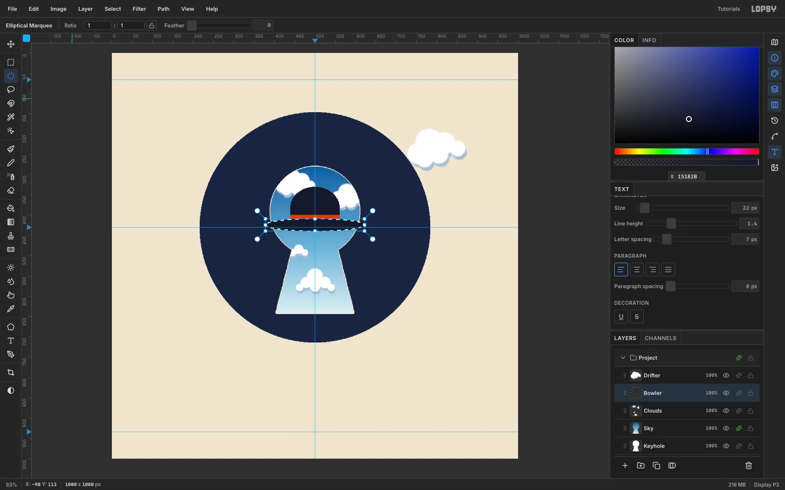

The hat is the hero, so make it big. Click the `Clouds` layer and then
**Add Layer**, and name the new layer `Bowler`. Set the foreground to
`#15182B` and build the hat from simple marquee fills. Press [[Cmd+D]]
between shapes.

1. **Crown top:** Elliptical Marquee from (439, 330) to (561, 434), then
   **Edit → Fill**.
2. **Crown sides:** Rectangular Marquee from (439, 381) to (561, 419), then
   **Fill**. This gives the dome straight sides.
3. **Band:** Rectangular Marquee from (439, 399) to (561, 417). Set the
   foreground to `#D9481C` and **Fill**.
4. **Brim:** set the foreground back to `#15182B`. Elliptical Marquee from
   (378, 409) to (622, 439), then **Fill**.

The brim pokes out past the keyhole onto the night sky. That's a second
small paradox: the hat is in the daytime and the night at once.

## Give the hat form and an outline

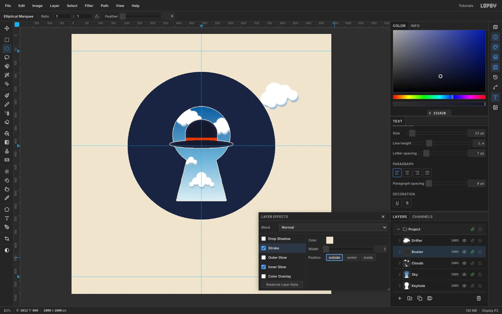

Open the **Layer effects** for `Bowler`:

- **Inner Glow**: color `#4B5A8C`, **Size** `16`, **Opacity** `70`. It adds a
  soft sheen to the crown.
- **Stroke**: color `#F1E4CC`, **Outside**, **Width** `2`. This matches the
  keyhole outline and makes the brim visible where it crosses the navy disc.

## Add a crescent moon and stars

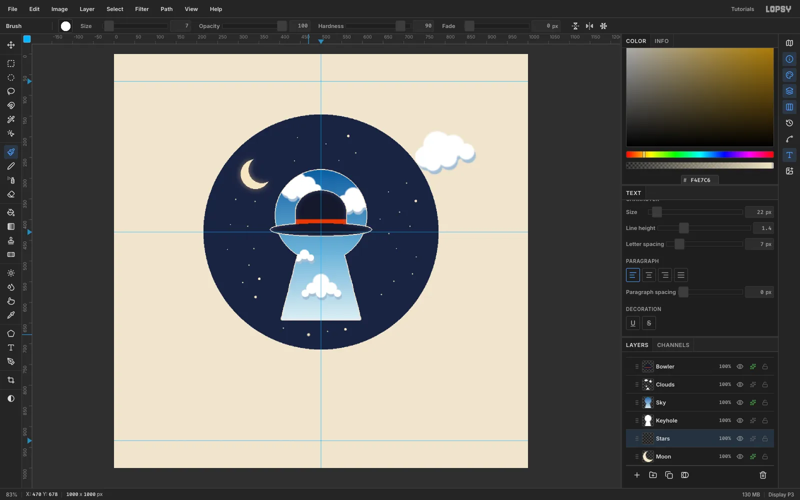

Click `Ink Disc` and then **Add Layer**, so the new layers sit under the sky.
Name the new layer `Moon`.

1. Set the foreground to `#F4E7C6`. Elliptical Marquee from (306, 254) to
   (378, 326) and **Fill**.
2. Marquee a second circle from (325, 248) to (389, 312) and press
   [[Delete]] to bite out a crescent.
3. Give the moon an **Outer Glow** in `#F6D58E` with **Size** `22` and
   **Opacity** `55`.

Add another layer, `Stars`. Click about 30 small brush dabs across the disc
with **Size** `3`, `4` and a few `7`. Keep them away from the keyhole, the
moon and the escaping cloud.

## Trail the cloud out of the keyhole

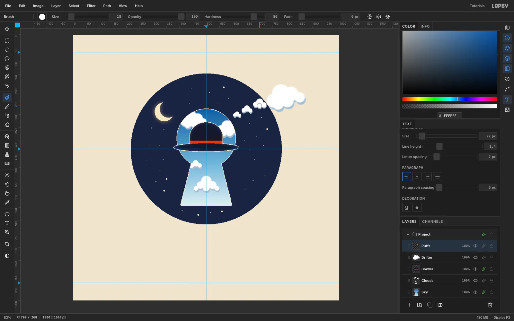

The big cloud should look like it came *through* the keyhole. Click
`Drifter`, add a layer called `Puffs`, and paint three tiny clouds with the
same shadow-then-white dabs. They step from the keyhole's upper-right edge
toward the big cloud and get bigger as they go, from dabs of about
**Size** `14` up to `30`.

Give `Drifter` a soft **Drop Shadow** in `#1B2340`, with Offset X `6`,
Offset Y `8`, Blur `10` and Opacity `35`, so it floats above the badge.

## Frame it with a terracotta ring

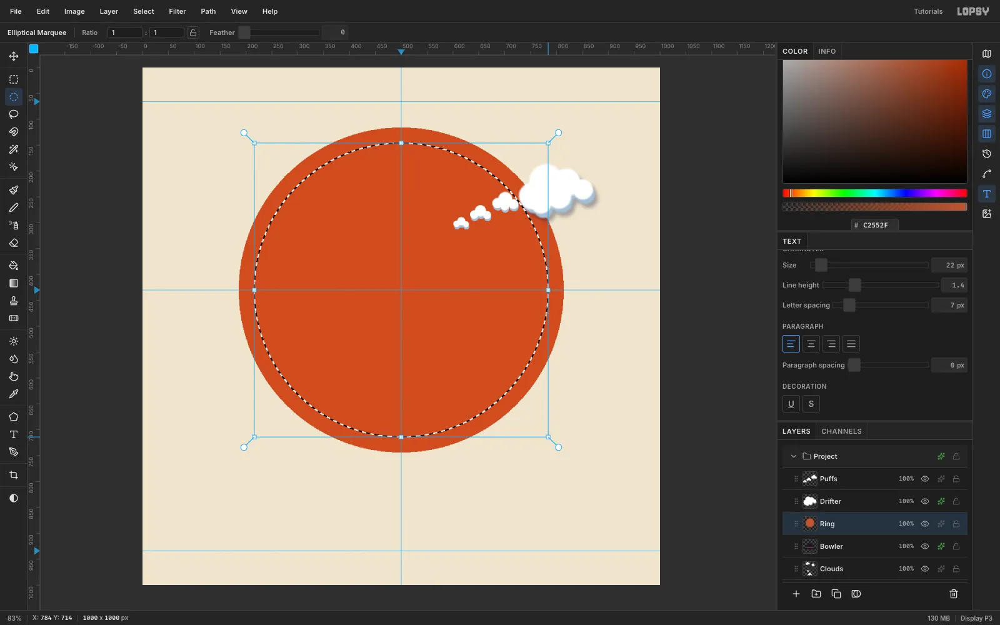

Click `Bowler` and **Add Layer** so the ring sits below the drifting clouds.
Name it `Ring`.

1. Set the foreground to `#C2552F`. Elliptical Marquee from (186, 116) to
   (814, 744), then **Fill**.
2. Marquee from (216, 146) to (784, 714) and press [[Delete]] to hollow it
   out.
3. For a gold hairline, set the foreground to `#F3B35A`. Marquee from
   (211, 141) to (789, 719) and **Fill**, then marquee from (213, 143) to
   (787, 717) and press [[Delete]].

This leaves a thin gold line on the inside of the terracotta and a sliver of
cream between the gold and the navy.

## Place 32 marquee bulbs with radial symmetry

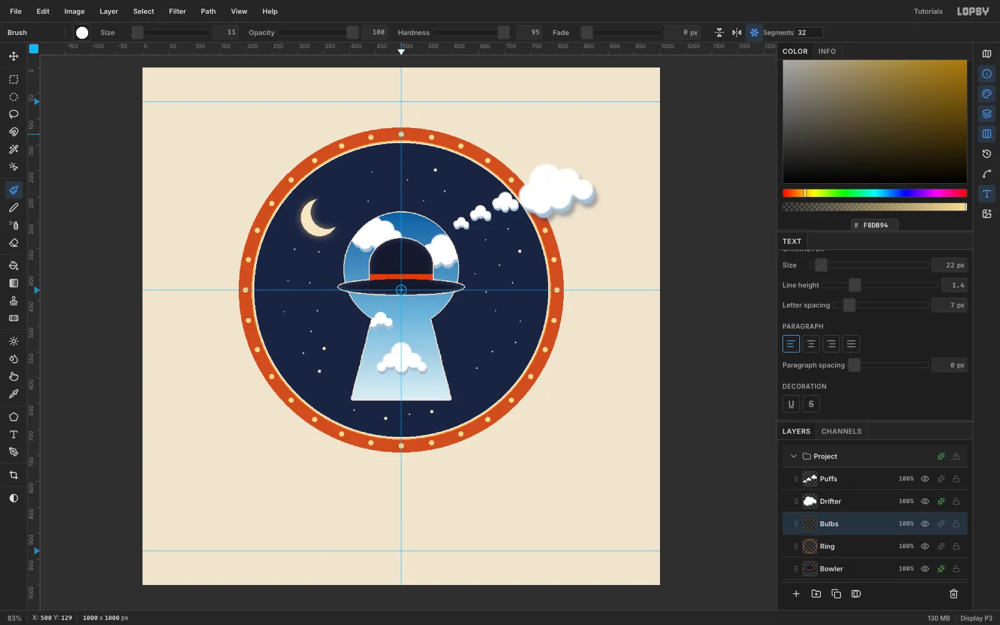

Add a layer named `Bulbs` and pick the **Brush**.

1. Click the **Radial Symmetry** button in the options bar and set
   **Segments** to `32`.
2. [[Cmd]]-click the center of the disc at (500, 430) to move the symmetry
   center there.
3. Set the foreground to `#F8DB94`, **Size** `11` and **Hardness** `95`.
   Click once on the middle of the ring at (500, 129).

One click stamps all 32 bulbs. Turn **Radial Symmetry** off again, then give
`Bulbs` an **Outer Glow** in `#FFD27A` with **Size** `10` and **Opacity**
`70`.

## Delete the stencil and group the emblem

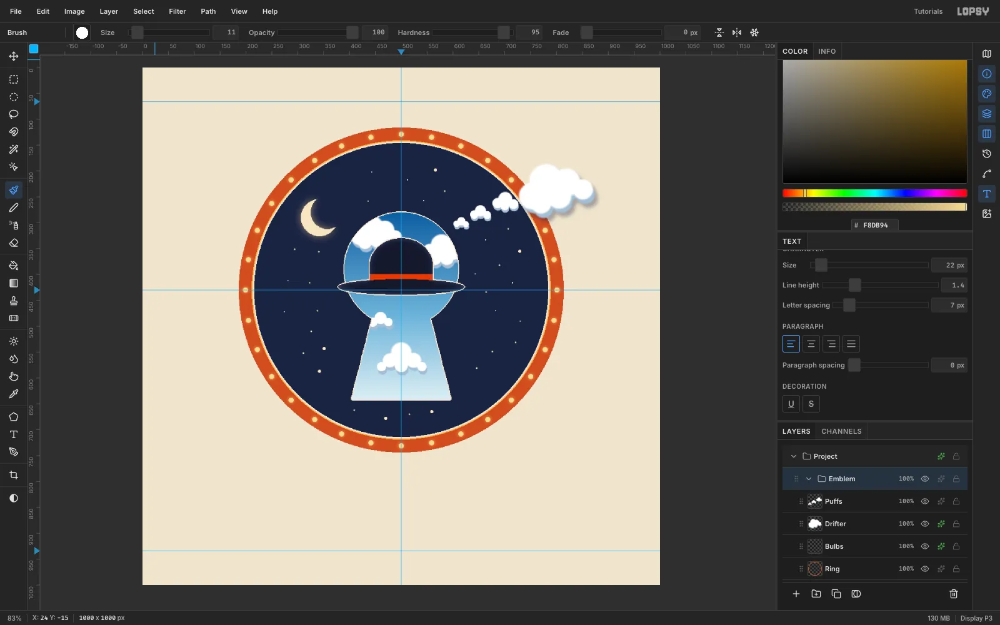

You don't need the stencil any more. Click the `Keyhole` layer and click
**Delete Layer**.

Click `Ink Disc`, then [[Shift]]-click `Puffs` to select everything in
between. Choose **Layer → Group Layers** and rename the group `Emblem`. Now
you can move the whole badge in one drag or adjust it as a unit.

## Make the seal float with a soft shadow

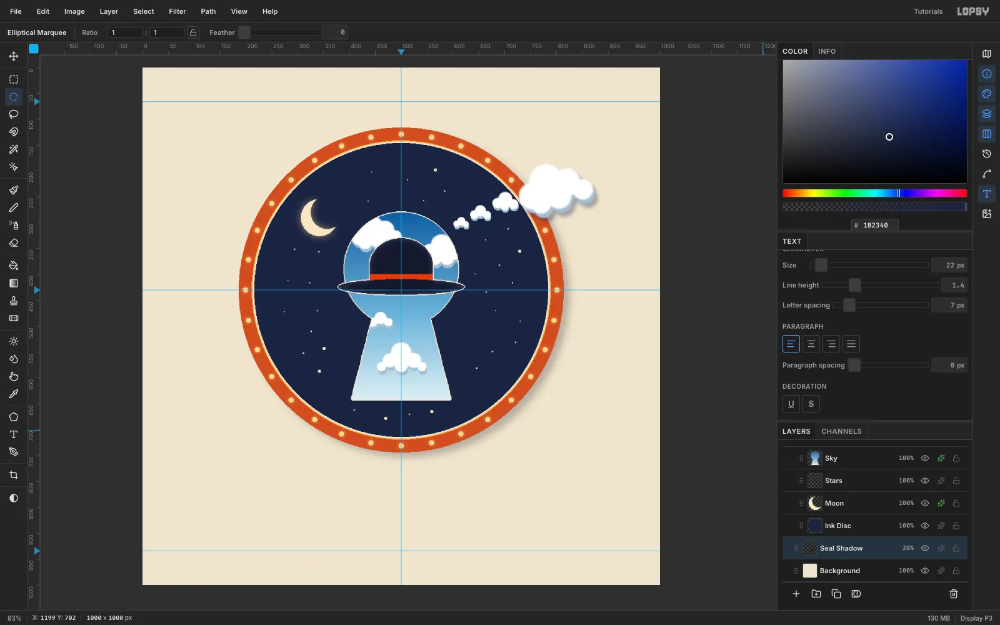

Floating objects that cast shadows are a staple of surrealism. Click
`Background` and add a layer called `Seal Shadow`.

1. Set the foreground to `#1B2340`. Marquee from (200, 128) to (824, 752),
   which is slightly lower and to the right of the badge, and **Fill**.
2. Choose **Filter → Gaussian Blur…**, set **Radius** to `22` and click
   **Apply**.
3. Marquee from (200, 130) to (800, 730) and press [[Delete]]. Only the
   shadow outside the ring is left, so it doesn't gray out the cream sliver.
4. Set the layer's blend mode to **Multiply** and its opacity to `28%`.

## Set the wordmark

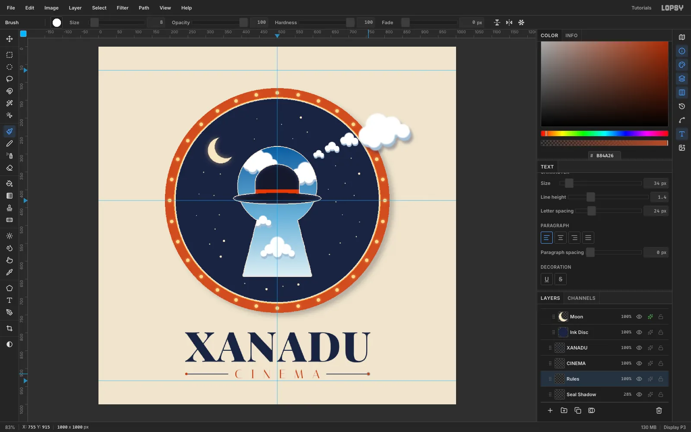

With `Seal Shadow` still active (so you don't restyle another text layer),
pick the **Text** tool:

- **XANADU**: font **Playfair Display**, weight **Black**, size `116`.
  Set **Letter spacing** to `4` in the Text panel and the color to
  `#1B2340`. Click in empty canvas, type `XANADU`, press [[Tab]], then
  **Move**-drag it so it's centered on the vertical guide, with its top
  about 55 px below the ring.
- **CINEMA**: font **Italiana**, size `34`, **Letter spacing** `24`, color
  `#B84A26`. Center it just under XANADU.

Add a `Rules` layer. With the **Brush** at **Size** `3` and **Hardness**
`100`, click and then [[Shift]]-click to draw a navy line on each side of
CINEMA, matching XANADU's width. Finish each outer end with a single
**Size** `8` terracotta dot.

## Draw an arc with the Pen tool

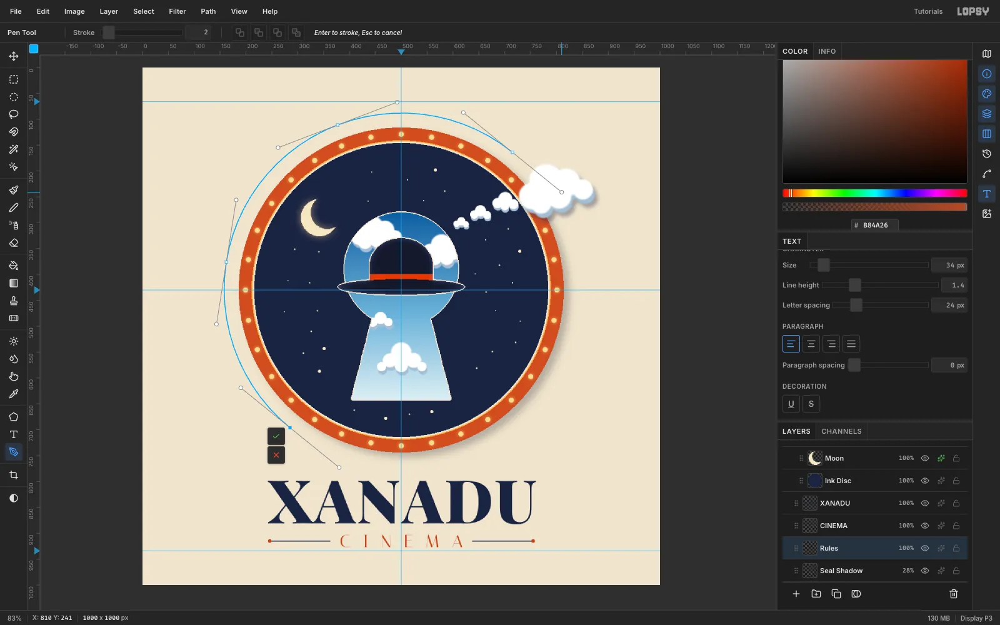

The seal text will run along a circle concentric with the ring. Pick the
**Pen** tool and place four smooth anchors on a 342 px radius around
(500, 430). Press at each point and drag along the circle to pull out
handles about 122 px long:

1. (285, 696), bottom left
2. (162, 376), left
3. (377, 111), top left
4. (715, 164), top right

Click the ✓ **Commit path** button to store it as a path.

## Put the seal text on the path

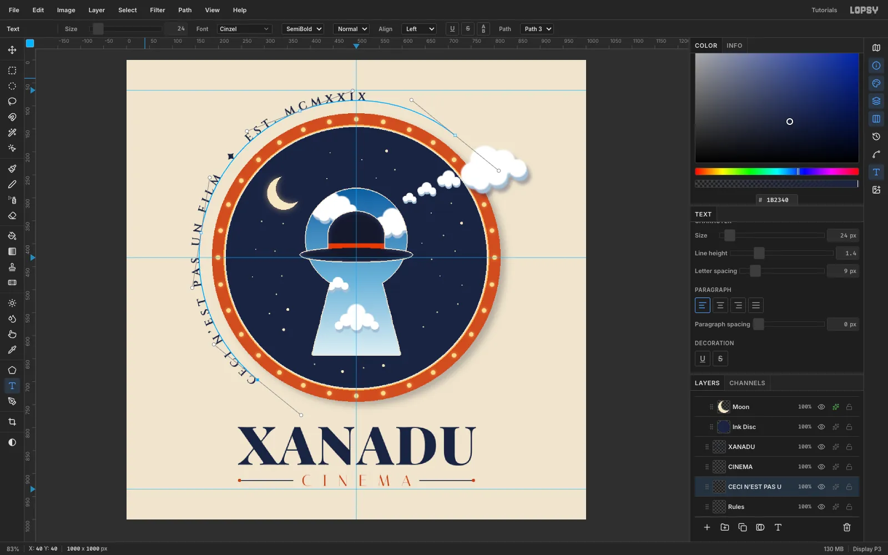

Click the `Rules` layer so you start from a raster layer. Set the Text tool to
**Cinzel**, weight **SemiBold**, size `24`, **Letter spacing** `9`, color
`#1B2340`. Click in empty canvas near the top-left corner and type:

`CECI N’EST PAS UN FILM  ✦  EST. MCMXXIX`

Press [[Tab]]. Then set the **Path** dropdown in the options bar to your new
path. The line wraps around the badge, and the ✦ lands at about ten-thirty.

> **Tip:** Binding to a path doesn't add its own undo step yet. Don't press
> [[Cmd+Z]] straight after binding, or the typing is undone too.

## Add film grain

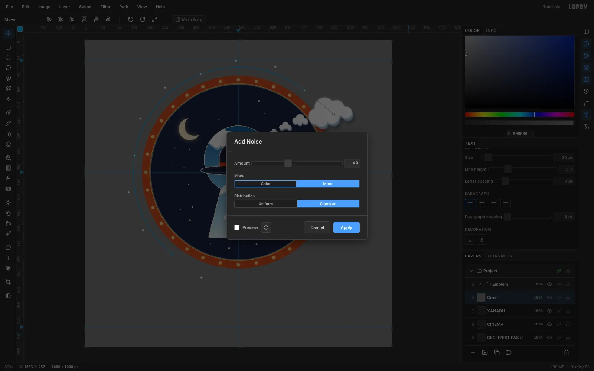

Add a layer called `Grain`, set the foreground to `#808080` and choose
**Edit → Fill**. Choose **Filter → Add Noise…**, pick **Mono** and
**Gaussian**, set **Amount** to `40` and click **Apply**.

Set `Grain` to **Overlay** at `30%` opacity. Collapse the `Emblem` group, then
drag `Grain` by its grip to the top of the Layers panel so it covers
everything.

## Warm the badge with a Photo Filter

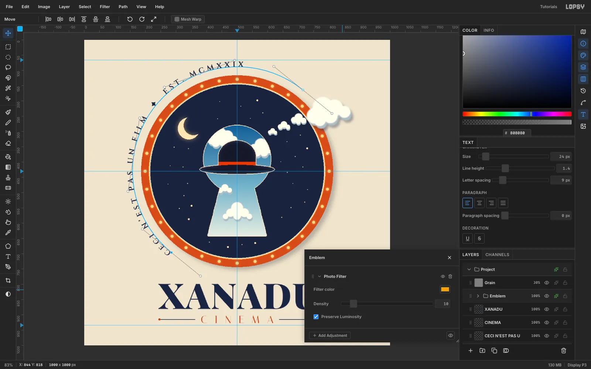

Open the `Emblem` group's effects drawer, click **Add Adjustment** and choose
**Photo Filter**. Set **Density** to `10`. The warm filter turns the white
clouds a creamy color and gives the terracotta a vintage-print feel, without
touching the type.

## Export the finished logo

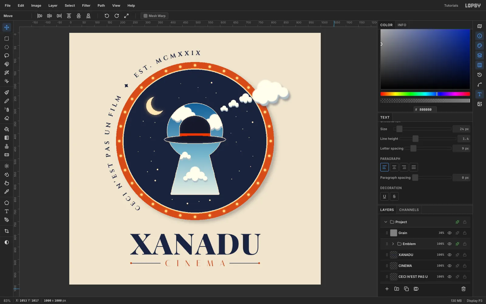

Toggle **View → Show Guides** off to check the composition. Choose
**File → Quick Export PNG** for the artwork, and **File → Save Project** to
keep the layered `.lopsy` file.

For favicons and small sizes, save a simplified variant as well: hide the
seal text and cut the bulbs down to 16. The keyhole and hat still read at
64 px.
