The Swiss International Typographic Style grew up in Zürich and Basel in the
1950s. Designers like Josef Müller-Brockmann and Emil Ruder built posters from
a strict grid, flush-left sans-serif type, flat colour and a single strong
geometric idea. Their concert posters often turned sound into concentric or
offset circles.

In this tutorial you'll use that approach for an invented exhibition about
the deep sea called **deep blue**. A red sounding line drops through the gap
between two letters, into a tunnel of offset blue discs, and ends at a
glowing probe. You'll work with a grid and guides, elliptical marquees, a
feathered selection turned into halftone dots, shape-tool rings, copy and
paste, a rotation transform and a grain overlay.

The palette is: paper `#EDEBE4`, ink `#111111`, four blues (`#A3B5FF`,
`#5470FF`, `#1F2FD6`, `#0A0F3C`) and one signal red `#FF3D1F`.

## Set up the canvas, grid and guides

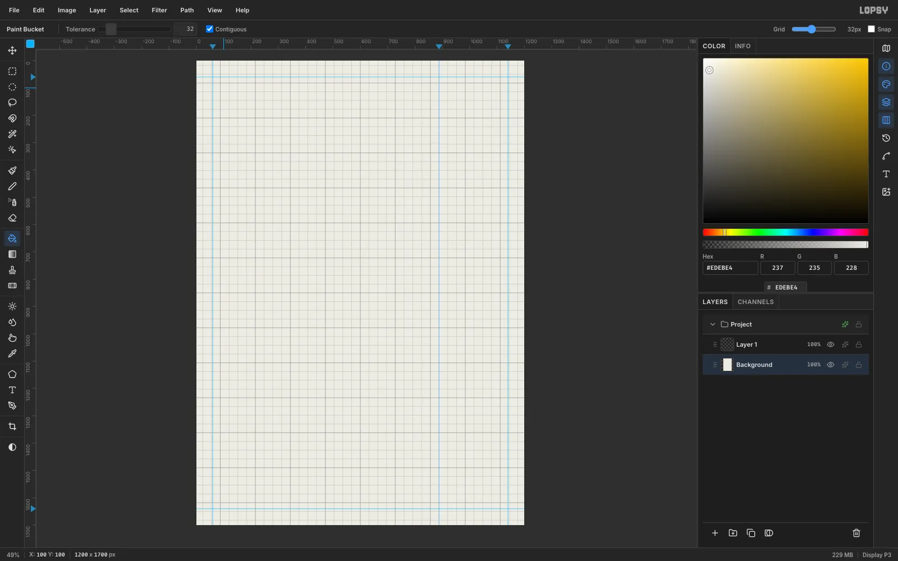

Open [Lopsy](/). In the **New Document** dialog, type `1200` for **Width** and
`1700` for **Height**, choose a **White** background, and click **Create**.

Choose **View → Show Grid**, then set the **Grid** slider in the options bar
to `32px` and tick **Snap**. Click the top ruler at `60`, `1140` and `888` to
add vertical guides, and click the left ruler at `60` and `1640` for
horizontal ones. The guide at 888 is where the sounding line will go.

Select the **Background** layer, set the foreground colour to `#EDEBE4` in
the Color panel's hex field, press [[G]] for the **Paint Bucket** and click
the canvas.

## Set the headline

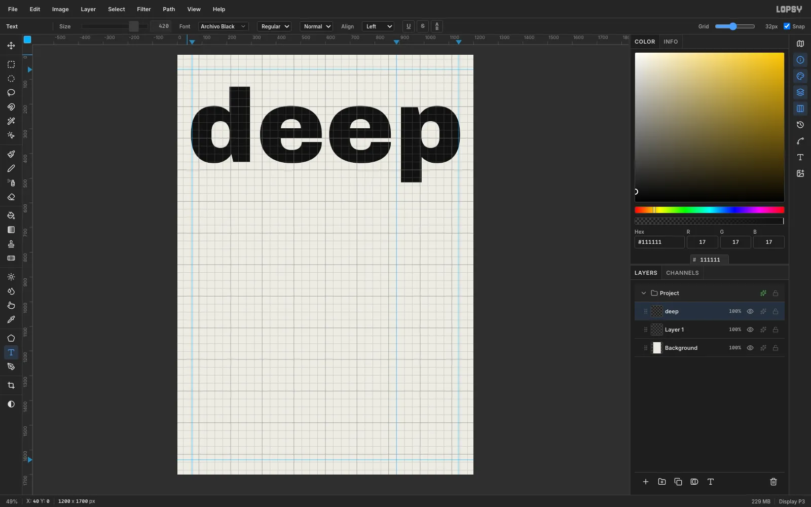

Select **Layer 1** and set the foreground to `#111111`. Press [[T]] for the
**Text** tool. In the options bar, open the **Font** browser, search for
`Archivo Black` and pick it, then set **Size** to `420`. Click near the top-left
corner at about (40, 0), type `deep` in lowercase, and press [[Tab]] to commit.

At this size the word runs from margin to margin. Notice the gap between
the second **e** and the **p**: it sits right on the 888 guide.

## Marquee the trench discs

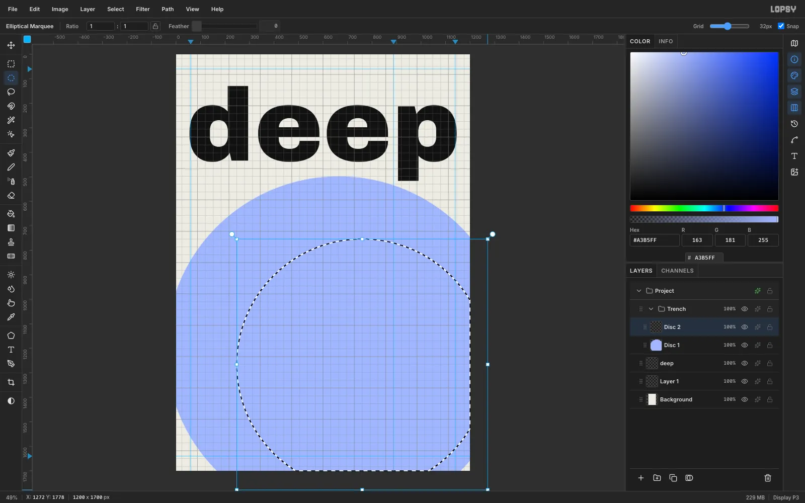

With `deep` active, click **New Group** in the Layers panel footer and name the
group `Trench`. The group goes above `deep`, so the discs will cover the
descender of the **p**.

Click **Add Layer**, name it `Disc 1`, pick the **Elliptical Marquee** and drag
a circle from (−40, 498) to (1368, 1906). It bleeds off the left, right and
bottom edges. Set the foreground to `#A3B5FF` and fill the circle with the
**Paint Bucket**. Then add `Disc 2` and marquee from (248, 754) to
(1272, 1778).

> **Tip:** With snap on, marquee corners jump to the 32 px grid, so each disc
> lands on exact numbers.

## Complete the eccentric trench

Fill `Disc 2` with `#5470FF`. Add `Disc 3` with a marquee from (504, 978) to
(1144, 1618), filled with `#1F2FD6`. Add `Disc 4` from (728, 1138) to
(1048, 1458), filled with `#0A0F3C`. Press [[Cmd+D]] to deselect.

Each disc is smaller, darker and shifted towards the lower right, so the
circles read as a tunnel dropping away. Four big steps work better than lots
of small ones, which look like a UI gradient.

## Feather a shade selection

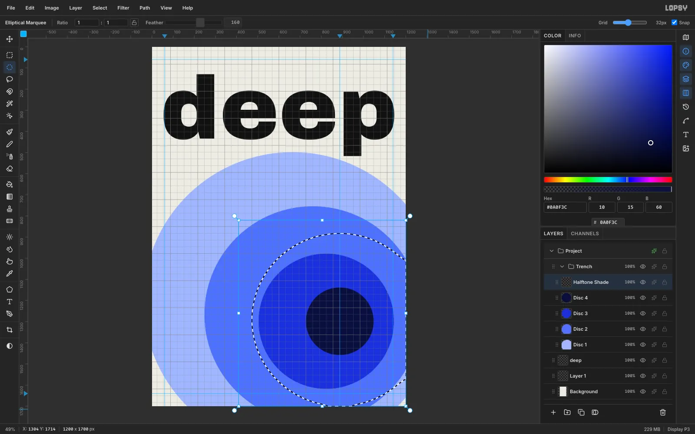

Click **Add Layer** and name it `Halftone Shade`. Choose the **Elliptical
Marquee**, set **Feather** to `160` in the options bar, and drag a circle from
(472, 882) to (1304, 1714), centred on the probe point at (888, 1298). Fill it
with `#0A0F3C`. Deselect, then set **Feather** back to `0` so later marquees
stay crisp.

## Turn the shade into halftone dots

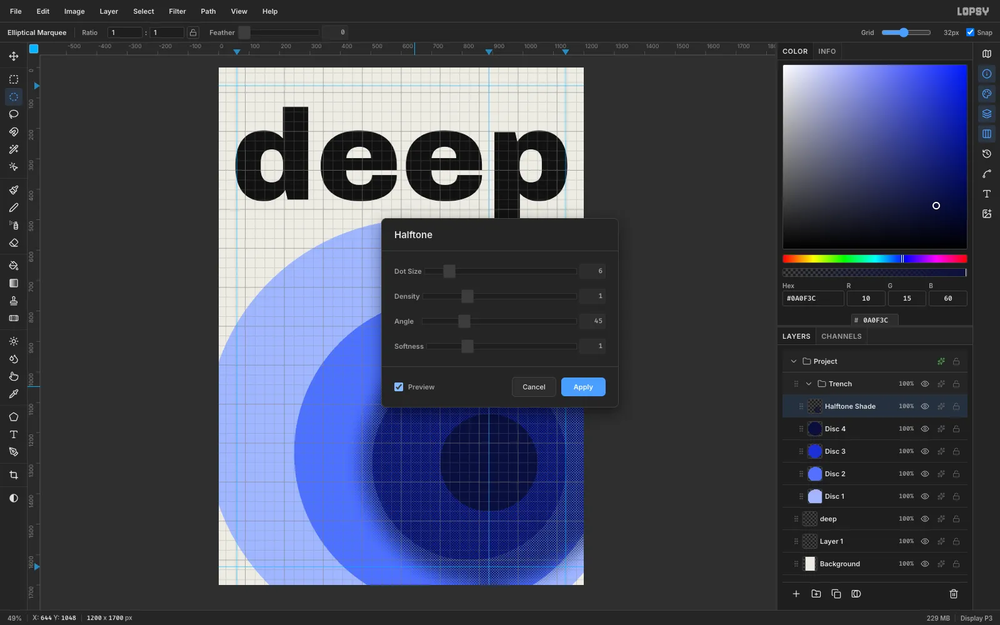

Choose **Filter → Halftone…**, set **Dot Size** to `6`, tick **Preview**, and
click **Apply**. The soft falloff becomes a dot screen that grows denser
towards the centre, a classic Swiss print detail.

## Clip the dots to the discs

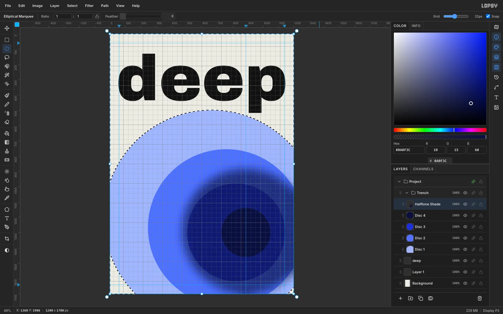

The halftone mustn't spill onto the paper. With the **Elliptical Marquee**,
drag the same circle as `Disc 1`, from (−40, 498) to (1368, 1906). Press
[[Cmd+Shift+I]] to invert the selection, press [[Delete]], and deselect.

## Multiply the halftone

Click the **✦** button on the `Halftone Shade` row to open **Layer Effects** and
set **Blend** to **Multiply**. Then click the row's opacity readout and drag
the slider to `60%`. The dots now darken the discs underneath, not just cover
them.

## Drop the sounding line

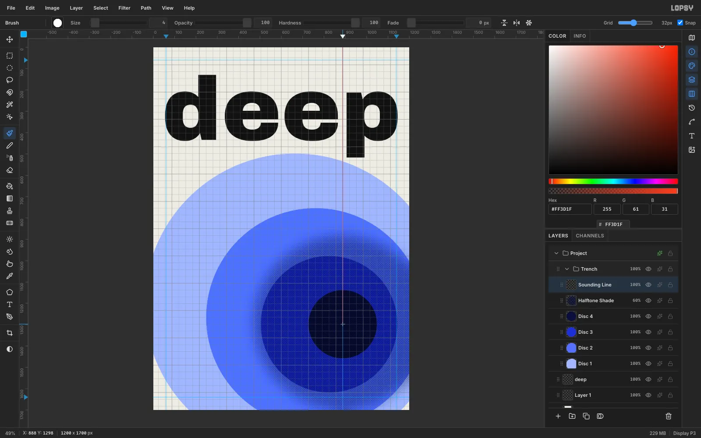

Add a layer named `Sounding Line`. Set the foreground to `#FF3D1F`, press
[[B]] for the **Brush**, and set **Size** `4`, **Hardness** `100` and **Opacity**
`100`. Click at (888, 0), then [[Shift]]-click at (888, 1298) to draw a
perfectly straight line down the guide.

## Add the probe and its glow

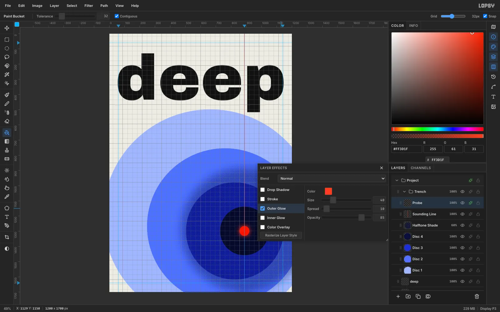

Add a layer named `Probe`. Marquee a circle from (856, 1266) to (920, 1330)
and fill it with the same red. In **Layer Effects**, tick **Outer Glow**, set
the glow colour to `#FF3D1F`, and set **Size** `40`, **Spread** `10` and
**Opacity** `85`.

## Draw the sonar rings

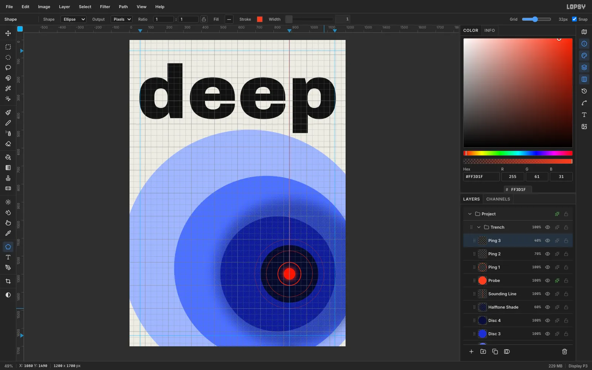

Add a layer named `Ping 1`. Press [[U]] for the **Shape** tool and choose
**Ellipse**. Click the **Fill** swatch and choose **Remove fill**, then click
**Add stroke color** and type `FF3D1F` in its hex field. Set **Width** to `2`,
hold [[Cmd]], and drag from the probe centre (888, 1298) out 64 px for a
perfect circle.

Add `Ping 2` and `Ping 3` the same way, with **Width** `1` and radii of 128 and
192. Set their opacities to `70%` and `40%`, so the signal fades as it
spreads.

## Knock out the second word

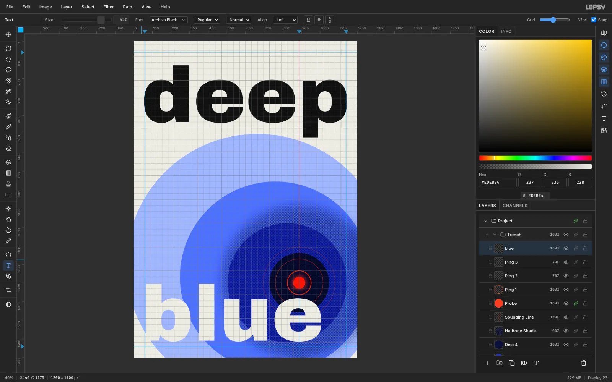

With `Ping 3` active, set the foreground to the paper colour `#EDEBE4`, press
[[T]], and click at (40, 1175). Type `blue` and press [[Tab]]. It uses the
same Archivo Black at 420 px, flush left under `deep`.

Because the word is paper-coloured, it looks like a hole cut through the
discs. It also sits above the rings, so the **e** cleanly cuts the outer ping.

## Paste the first depth tick

With `blue` active, click **New Group** and name it `Depth Scale`, then add a
layer named `Ticks`. Untick **Snap** first, because the grid would collapse
a 4 px marquee.

The scale starts at the baseline of `deep` (y 448 = 0 m) and ends at the probe
(y 1298 = 10 935 m, the depth of the Challenger Deep), so every 2 000 m is about
155 px. Marquee a 40 × 4 px tick at (60, 446) and fill it with `#111111`. Marquee
slightly around it, press [[Cmd+C]] and [[Cmd+V]], then drag the pasted tick
down with the **Move** tool [[V]] to y 603.

## Finish the tick column

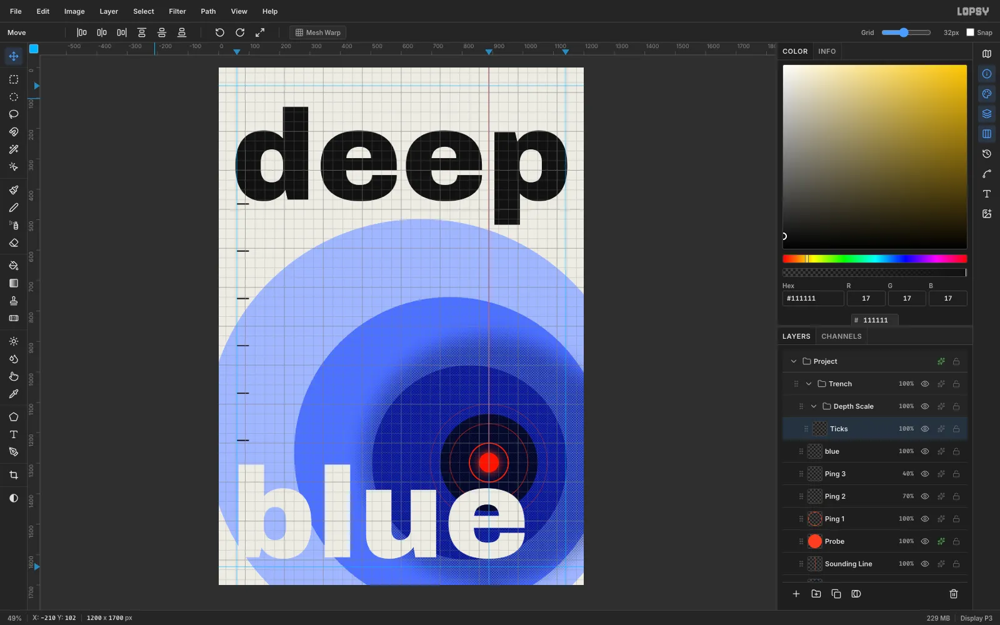

Paste and drag four more ticks to y 759, 914, 1070 and 1225. Then choose
**Layer → Merge Down** five times to fold all the pasted layers back into
`Ticks`.

## Label the scale

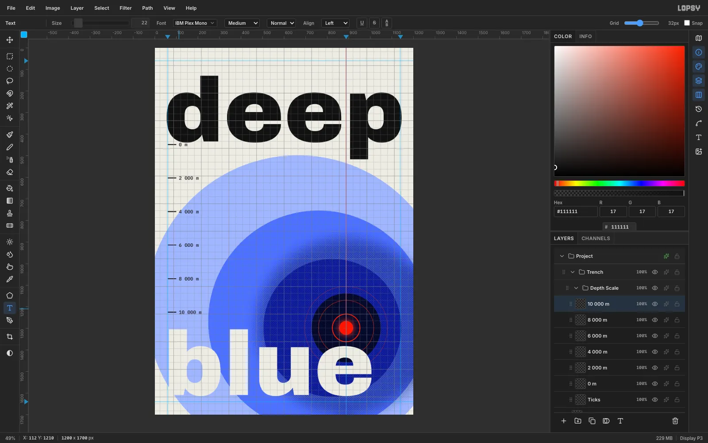

With `Ticks` selected, set the foreground back to `#111111`, press [[T]], and
choose **IBM Plex Mono** at weight **Medium (500)** and **Size** `22`. Click at
x 112, about 15 px above each tick, and type `0 m`, `2 000 m`, `4 000 m`,
`6 000 m`, `8 000 m` and `10 000 m`. Press [[Tab]] after each one.

> **Tip:** Clicking with the Text tool inside an existing text layer's box
> edits that layer and loads its font and size. Check that `deep` isn't
> under your click, or rasterize it first.

## Add the probe's reading

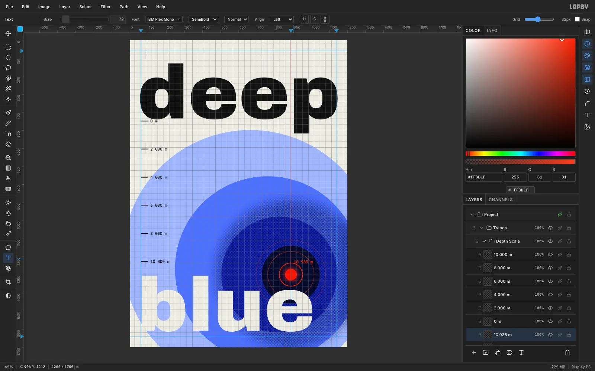

Select `Ticks` again so you don't restyle the last label. Set the foreground
to `#FF3D1F`, switch the weight to **SemiBold (600)**, and click at (904, 1212)
to type `10 935 m`. The final depth reading belongs to the probe itself, so it
sits right beside the red dot.

## Set the header in three columns

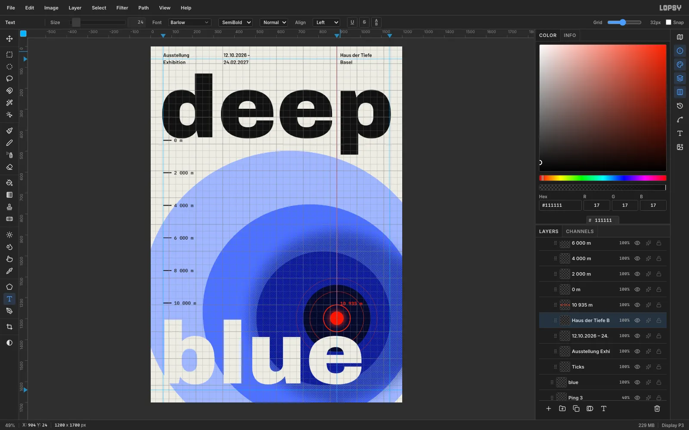

Select `Ticks` once more, choose **Barlow** at **SemiBold (600)** and **Size**
`24`, and set the foreground to `#111111`. At y 24, create three two-line blocks
(press [[Enter]] for the line break):

- x 60: `Ausstellung` / `Exhibition`
- x 348: `12.10.2026 –` / `24.02.2027`
- x 904: `Haus der Tiefe` / `Basel`

The third column starts 16 px right of the sounding line, so the red line acts
as its column rule.

## Select the caption

Select `Ticks` again. With **IBM Plex Mono Medium** at **Size** `18` and the
foreground `#0A0F3C`, click in empty space at (300, 540) and type
`SOUNDING THE ABYSS · 10 935 M`. Click **Rasterize Layer** in the Layers panel
footer. Then use the **Rectangular Marquee** to draw a box tightly around the
text.

## Rotate the caption 90°

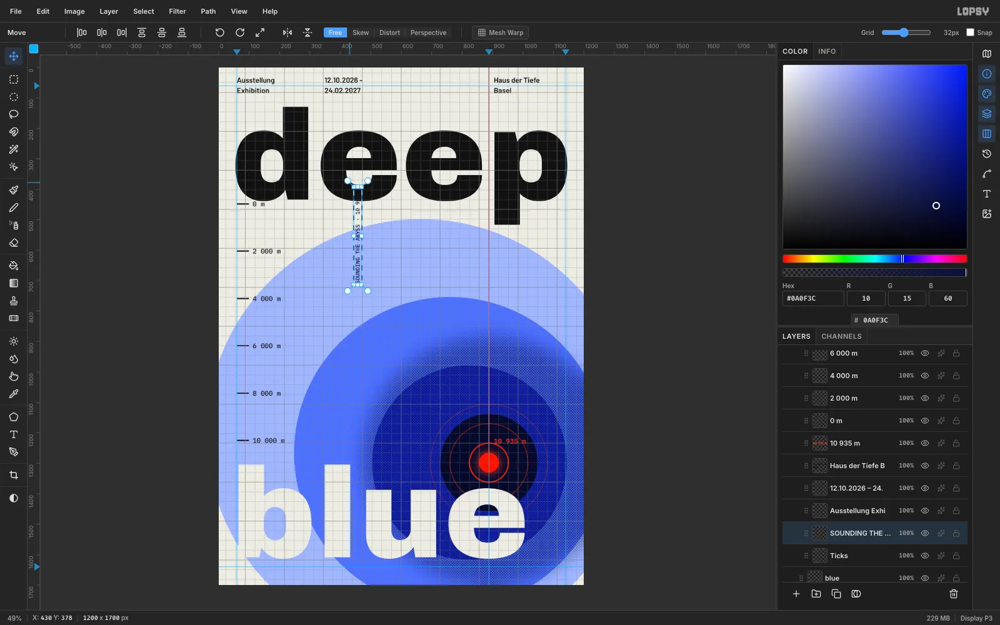

Press [[V]] for the **Move** tool. Hold [[Cmd]] so rotation snaps to 15° steps,
and drag the top-right rotation handle a quarter turn anticlockwise. Press
[[Enter]] to commit the transform, then [[Cmd+D]].

## Place the caption on the right margin

Drag the caption with the **Move** tool until its right edge is on the 1140
guide and its top is at about y 560, just under the **p** of `deep`. It now
runs over the paper and the pale disc, where it's easy to read.

## Make paper grain

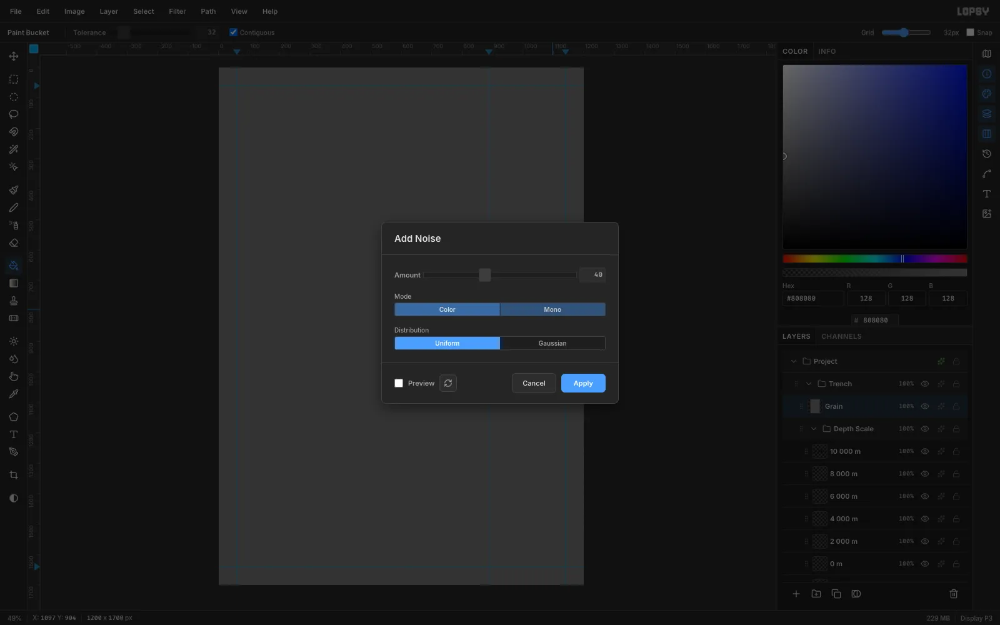

Select the `Trench` group and click **Add Layer** to put a `Grain` layer at the
top. Fill it with `#808080`. Choose **Filter → Add Noise…**, set **Amount** to
`40`, pick **Mono** and **Gaussian**, and click **Apply**.

## Blend the grain

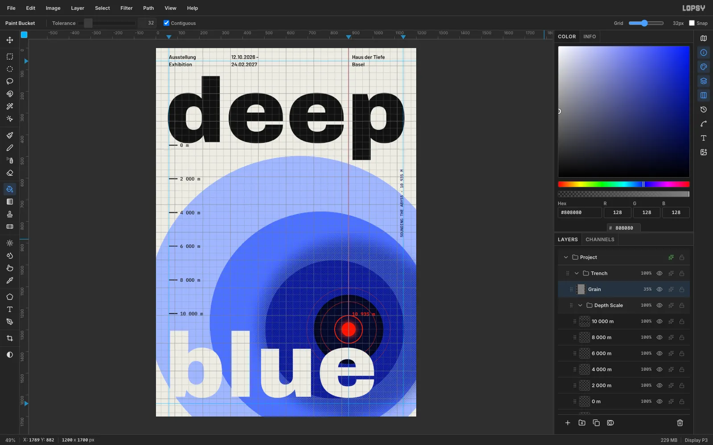

Set the `Grain` layer's blend mode to **Overlay** and its opacity to about
`35%`. Mid-grey disappears in Overlay, so only the speckle remains. It takes
the digital flatness off the colour fields.

## Export the poster

Turn off **View → Show Grid** and **View → Show Guides** to check the clean
result. Then choose **File → Quick Export PNG** to export it, and **File →
Save Project** to keep an editable `.lopsy` file with all the groups.

For a series, keep the grid and type and change only the idea in the middle.
Try "high tide" with stacked horizontal bands, or "echo" with rings that
repeat outwards.
