Propaganda posters were printed in a few loud inks. Red rays burst out of
the page, a heroic figure stood in front of them, and a block of heavy
capitals shouted the message. This tutorial builds that look in Lopsy for
**TARDIGRADE INSURGENCY**, an imaginary zine cover for the Water Bear
Liberation Front, on a 1100 × 1700 px page.

It is a **hybrid project**. The planet is a real photograph, the public-domain
NASA picture [The Earth seen from Apollo 17](https://commons.wikimedia.org/wiki/File:The_Earth_seen_from_Apollo_17.jpg)
(the "Blue Marble") from Wikimedia Commons. You'll cut it out, posterize it
and recolour it into a duotone so it sits in the same print world as the
drawn parts. The tardigrade, flag, type and badge are all drawn and typeset
in Lopsy.

Along the way you'll use:

- the **Sunburst** filter, **Posterize**, **Halftone** and **Add Noise**
- a **Gradient Map** adjustment on a group
- **Lasso**, **Elliptical** and **Rectangular Marquee** fills, and the **Magic Wand**
- the **Brush** with [[Shift]]-click straight lines
- **Stroke** and **Drop Shadow** layer effects
- **Text**, **Text Path** binding with **Selection → Path**, and rotating rasterized text
- **groups**, group moves and scaling with the **Move** tool, **guides**, **undo / redo**
- **blend modes** (Multiply, Overlay) and feathered selections

The palette is a handful of warm inks:

- Propaganda red `#B82A1C`
- Sunburst peach `#E9D6A8`
- Cream `#F1E3BD`
- Ink black `#1A1511`
- Ochre `#E0A030` and warm body ochre `#E8A62E`
- Dark ochre `#A8661A`
- Beret red `#8F1D14`
- Earth blue-grey `#24394A` and `#4A6A7C`
- Pole brown `#5A3216`
- Glow `#F6D98A`
- Shade brown `#7A3A10`

## Start a new document

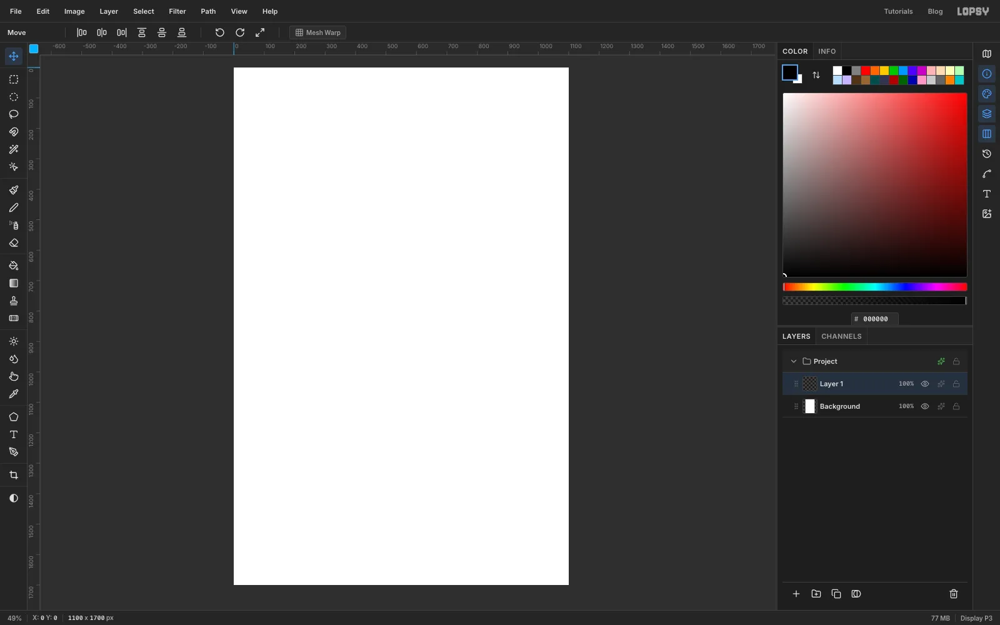

Choose **File → New**, set the units to **Pixels**, make the document
**1100 × 1700** and click **Create**.

## Fill it red

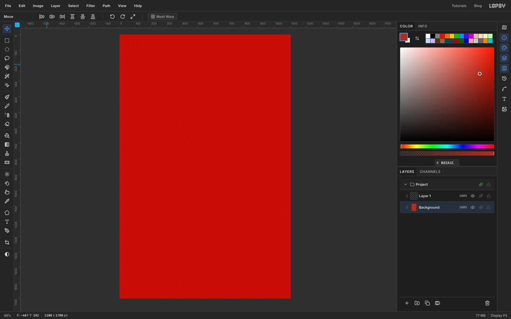

Set the foreground colour to `#B82A1C`, select the **Background** layer and
choose **Edit → Fill**. The whole page turns red.

## Add the sunburst

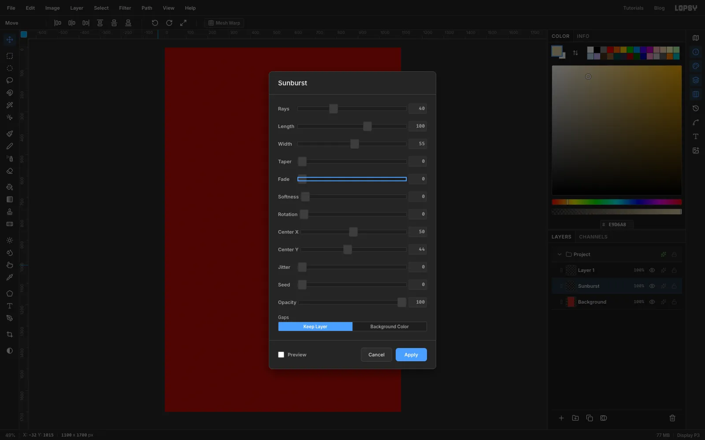

Add a new layer, name it *Sunburst* (delete any empty spare layer the app adds above it) and set the foreground to `#E9D6A8`.
Choose **Filter → Sunburst**. Set **Rays** to **40**, **Width** to **55**,
**Center Y** to **44** and **Taper** to **0**, so the rays start a little
above the middle of the page. Click **Apply**.

## Lower the sunburst opacity

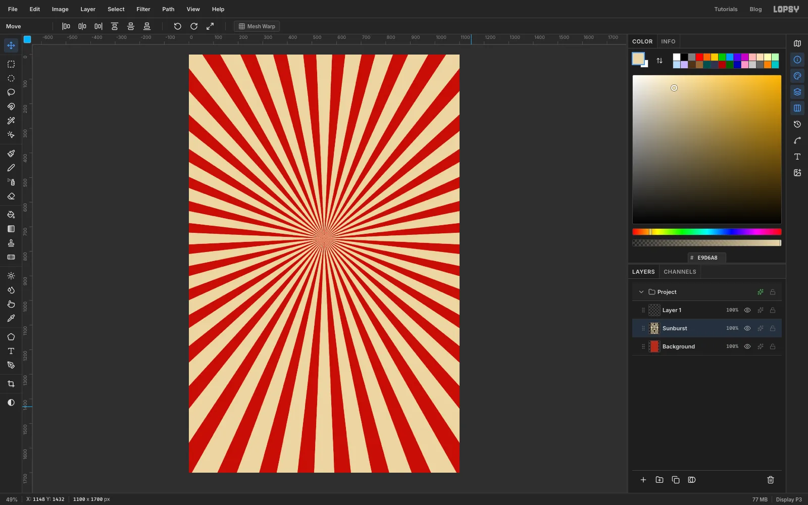

Drop the *Sunburst* layer opacity to **65%** so the red glows through and
the rays stop looking quite so flat.

## Bring in the Earth

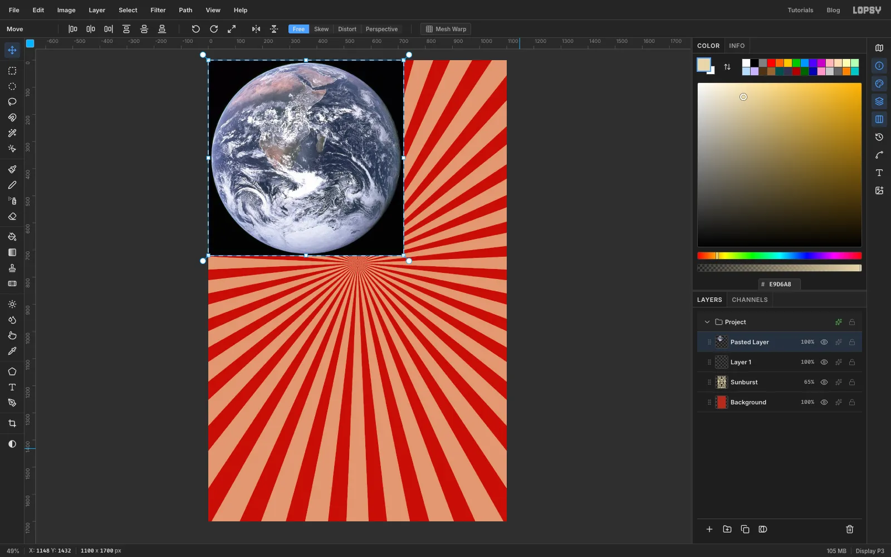

Open the Apollo 17 photograph in your browser, copy it, and press [[Cmd+V]] in Lopsy. It lands on a new layer.

## Place the Earth

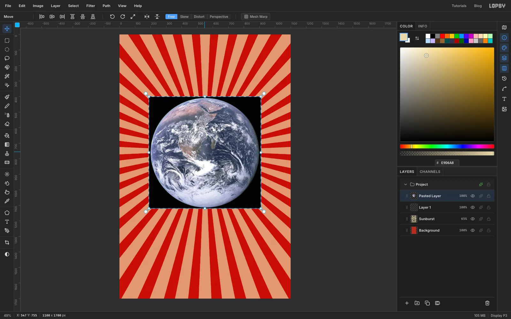

With the **Move** tool, drag the picture so the globe sits in the upper middle
of the page, leaving room for the tardigrade below it. Press [[Enter]] to commit the paste, then double-click the layer name and rename it *Earth*.

## Cut the Earth out of its space

Pick the **Elliptical Marquee** and drag a circle that follows the edge of
the globe. Hold [[Shift]] for a perfect circle, and keep the ants just inside the edge of the globe. Then choose **Select → Inverse**.

## Delete the black space

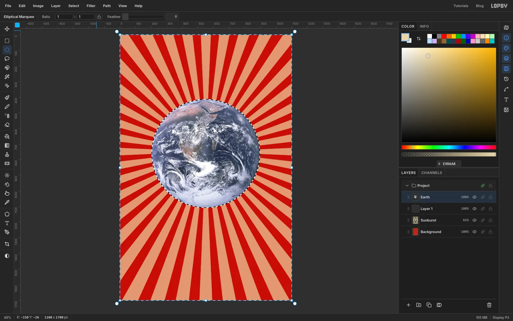

Press [[Delete]] to remove the black sky, then **Select → Deselect**. The
planet floats cleanly over the rays.

## Posterize the planet

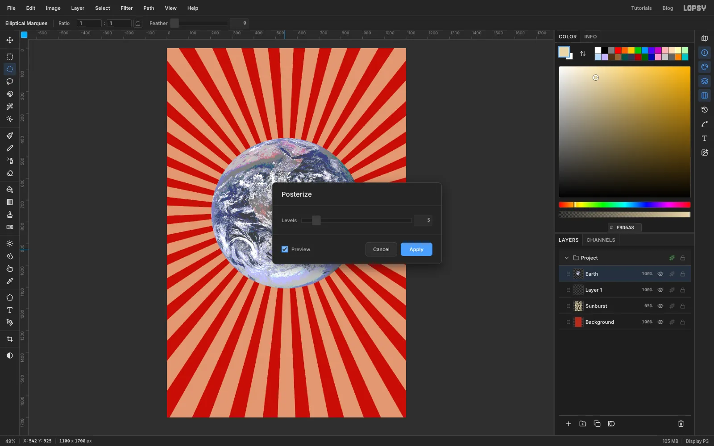

Choose **Filter → Posterize**, set **Levels** to **5**, and leave
**Preview** on while you check that the clouds still read as clouds. Click
**Apply**. Flat bands of tone are what make a photograph feel printed
instead of photographed.

## Group the planet

Click the **New Group** button in the Layers footer, name it *Planet*, and
drag the *Earth* layer onto it so it sits inside. Putting the photo in a
group lets you recolour it as a unit without touching the pixels.

## Recolour it with a Gradient Map

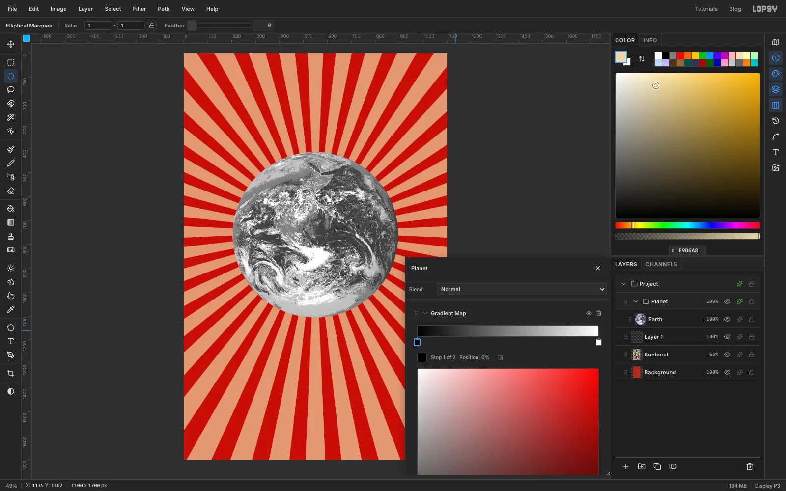

With the *Planet* group selected, open the **Adjustments** panel and add a
**Gradient Map**. A short tip appears the first time you do this; dismiss it
with **Got it**.

## Set the Gradient Map stops

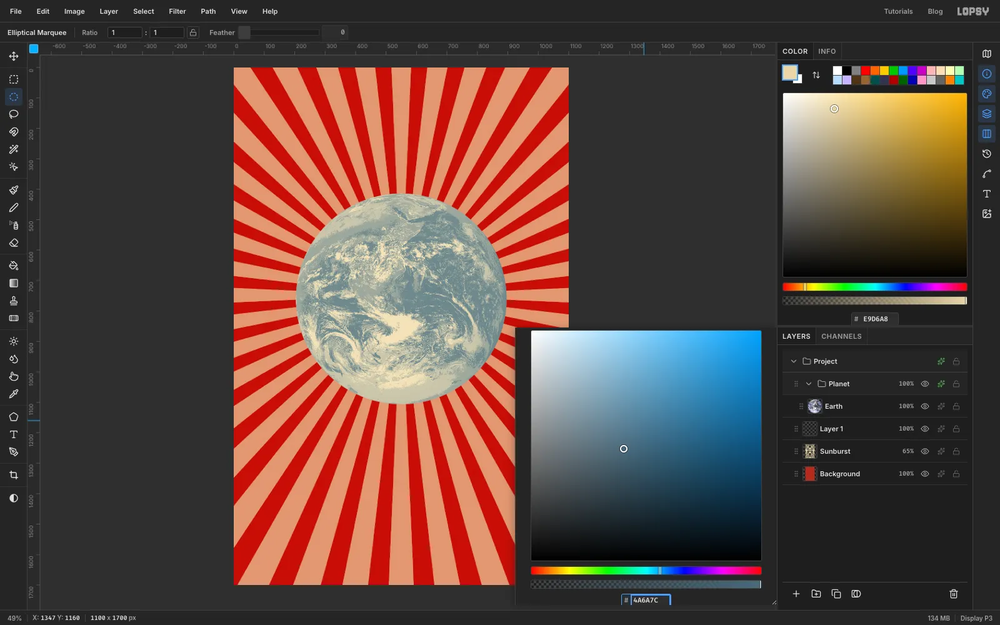

Click the left stop to open its colour picker and type `#24394A` into the hex field. Do the same for the right stop with `#F1E3BD`. Click the middle of the gradient bar to add a third
stop, and set it to `#4A6A7C`. Dark tones now map to deep blue-grey, midtones
to a cooler grey, and highlights to cream.

## The duotone planet

The Earth is now a duotone that belongs to the same palette as the page. The
photograph is done. Everything from here is drawn.

## Start the hero group

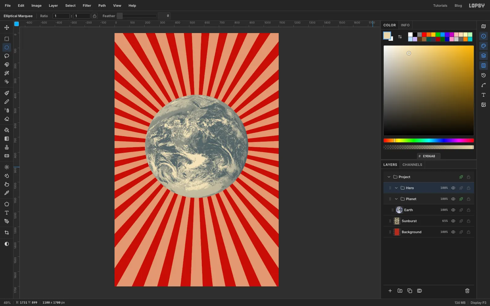

Select the *Planet* group, click **New Group** so the new group appears above
it, and name it *Hero*. Every layer of the tardigrade goes inside this group,
so you can move or scale the whole character later.

## Draw the legs

Add a layer in *Hero* named *Legs back*, set the foreground to `#A8661A` and
use the **Lasso** to draw two rounded stumps for the back legs. Choose **Edit → Fill**.

## Draw the front legs

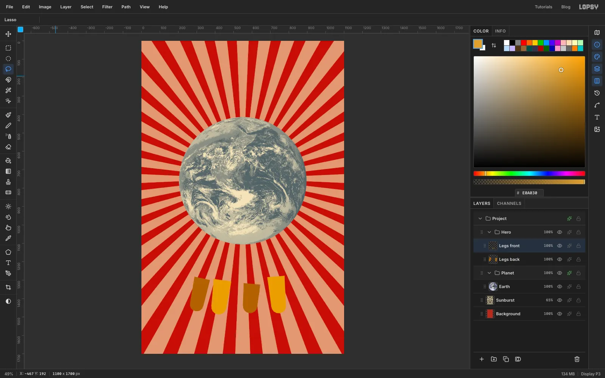

Add *Legs front* above it, set the foreground to `#E0A030`, and lasso and fill
the front two legs in the same way, a little apart from the back pair. The
lighter colour reads as nearer the viewer.

## Draw the body

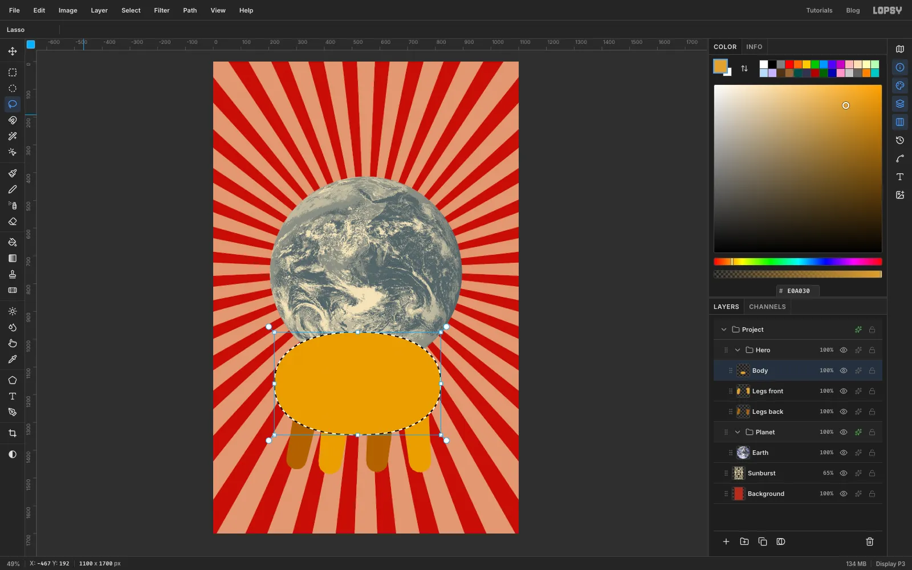

Add a layer named *Body*. With the **Lasso**, draw a fat, rounded oval over the legs, wide enough to fill most of the page width. Fill it with `#E0A030`.

## Outline everything

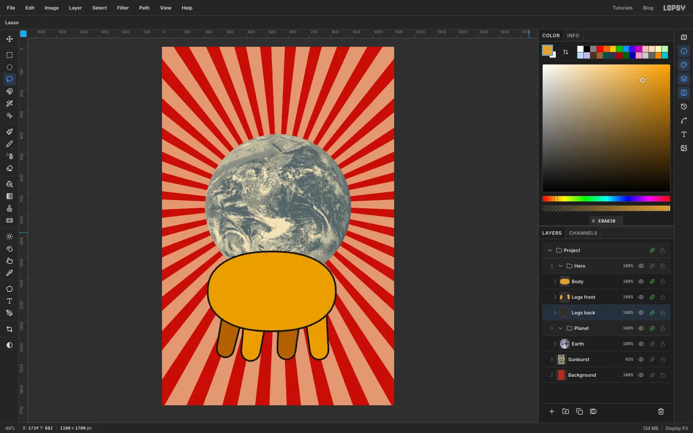

Select *Body* and open its layer effects with the **fx** button. Switch on
**Stroke**, set the colour to `#1A1511` and the width to **8**. Do the same for
*Legs front* and *Legs back*. A consistent heavy outline is a big part of the
propaganda look.

## Add the segment lines

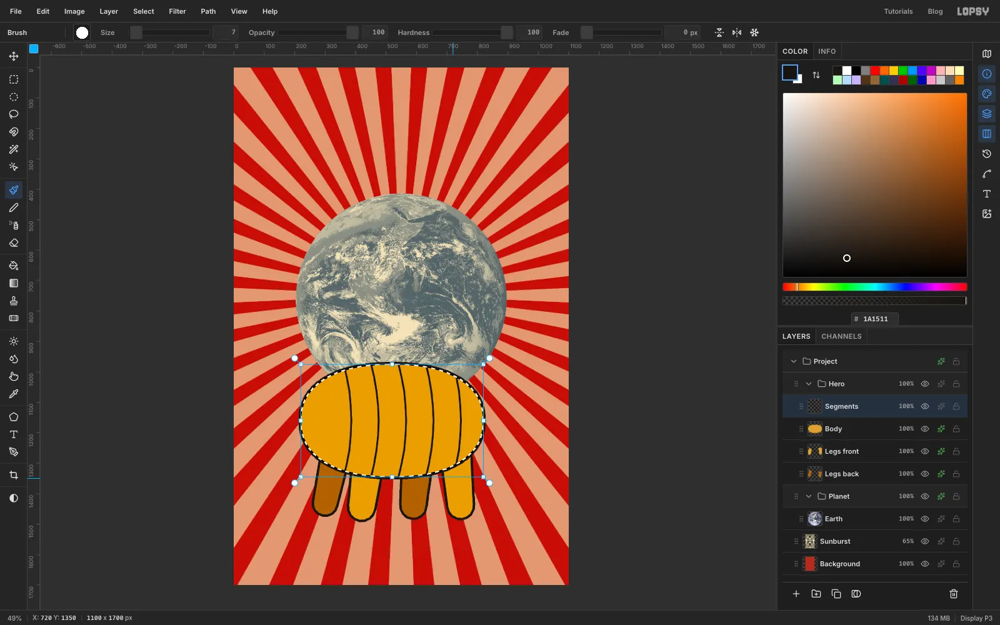

Add a layer named *Segments*. Hold [[Cmd]] and click the *Body* thumbnail to
load the body as a selection, so the lines can't spill past its edge. Pick the
**Brush**, size **7**, hardness **100**, and colour `#1A1511`. For each
segment, click at the top edge of the body, then [[Shift]]-click at the bottom
edge. Space the five lines evenly. For a curved ring, add a middle [[Shift]]-click point so each line bends gently, like hoops around a barrel. Deselect when you're done.

## Draw the head

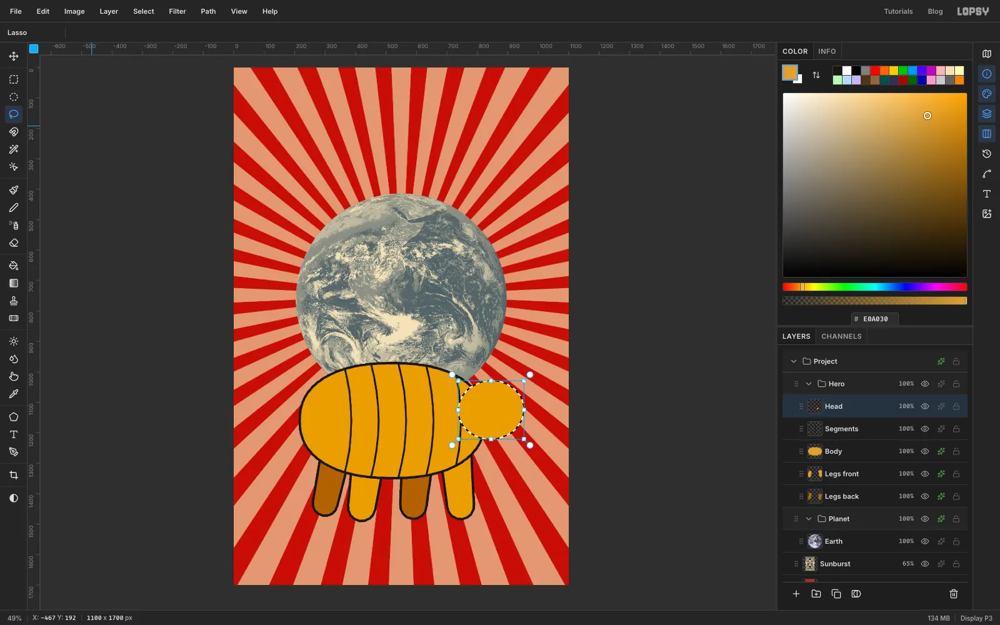

Add a layer named *Head*, lasso an oval to the right of the body, fill it with
`#E0A030` and give it the same **Stroke** effect (`#1A1511`, width **8**).

## Give it a face

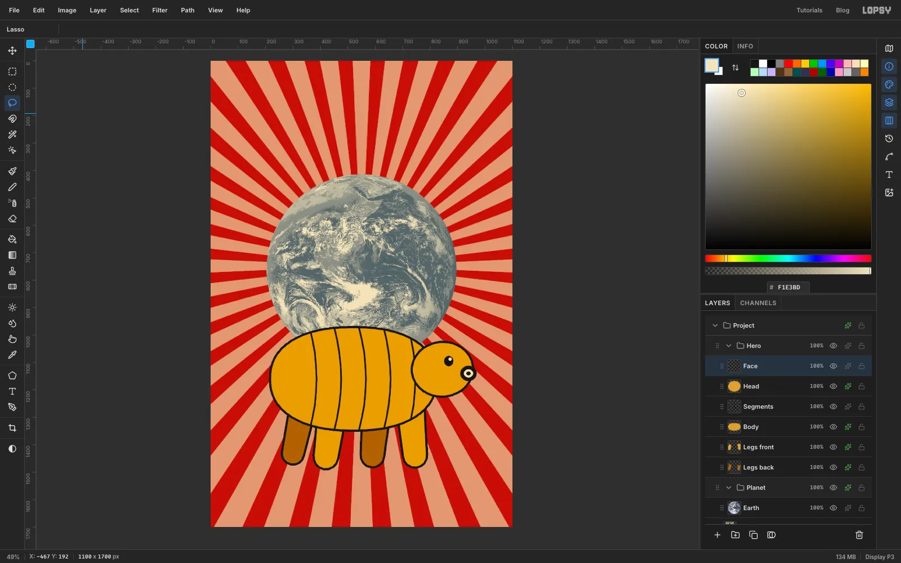

Add a layer named *Face*. Use the **Elliptical Marquee** and **Edit → Fill**
to fill a small black eye. For the snout, fill a bigger black oval at the front of the head, switch to cream and fill a smaller oval inside it, then switch back to black for a small pupil.

## Plant the flag

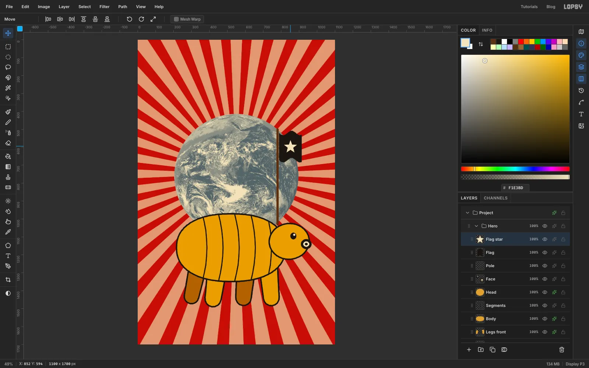

Add a layer named *Pole* and draw a tall vertical line with the **Brush** at
size **13** in `#5A3216`: click at the bottom, then [[Shift]]-click at the top.
Add a *Flag* layer, and lasso a wavy rectangle at the top of the pole; fill it
`#1A1511`. Add *Flag star*, lasso a five-pointed star in the middle of the flag
and fill it `#F1E3BD`. Keep the pole just left of the head, so the flag hangs over the right edge of the globe.

## Raise an arm

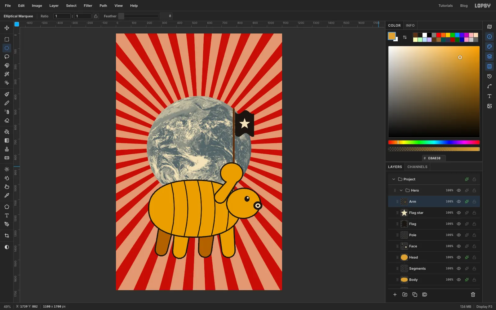

Add *Arm*. Lasso a tapered limb that reaches up from the body to the pole and
add an oval fist on the end. Fill it `#E0A030` and give it the outline effect
(**8** px, `#1A1511`).

## Add a beret

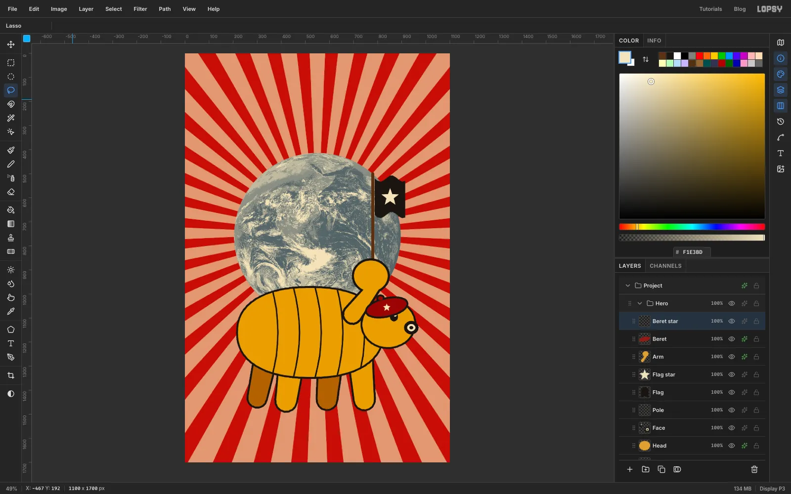

Add *Beret*. Lasso a flattened oval on top of the head with a little pom on
the crown, and fill it `#8F1D14` with the same outline. Add *Beret star* above
it and lasso a small cream star on the front.

## Sharpen the claws

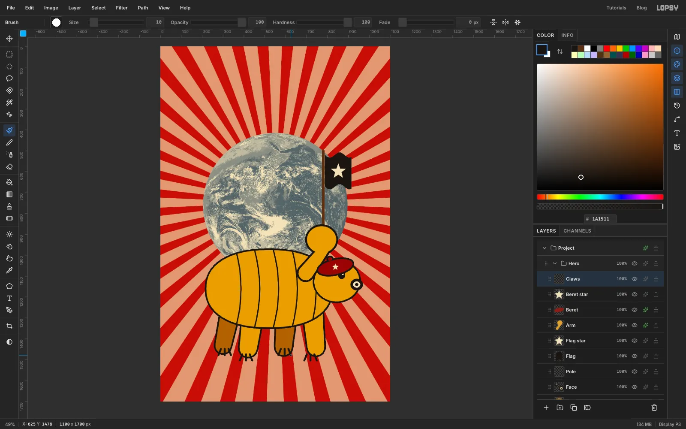

Add a layer named *Claws*. Use the **Brush** at size **10** in `#1A1511`, and
for each foot click, then [[Shift]]-click a short distance to draw a small claw.

## Shade the body

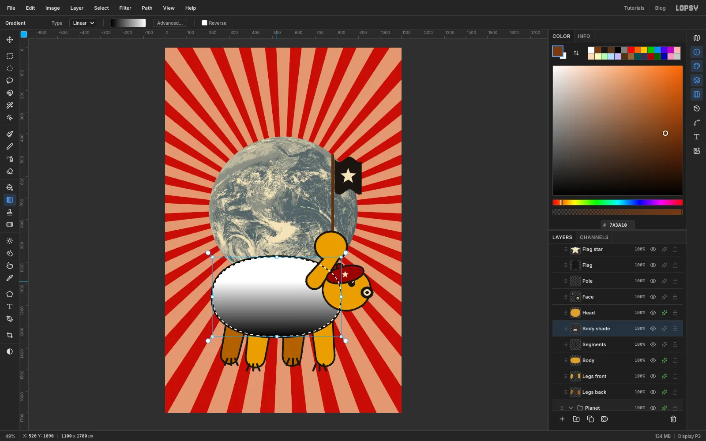

Add a layer named *Body shade* (make sure it's the selected layer), then load the *Body* as a selection with [[Cmd]]-click on its thumbnail. Set the foreground to `#7A3A10` and the
background to white. With the **Gradient** tool, drag from the bottom of the
body up toward the middle.

## Set it to Multiply

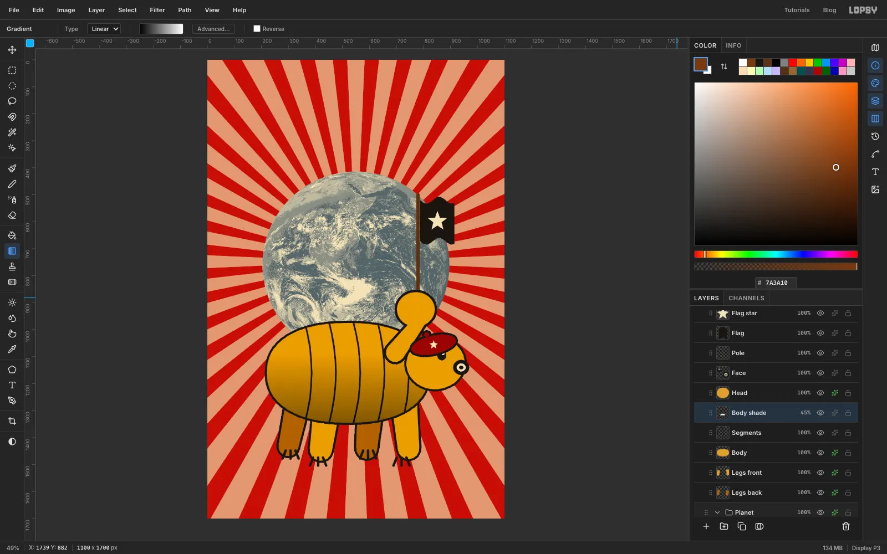

Set the layer's blend mode to **Multiply** and its opacity to **45%**. The
belly darkens and the body feels round. Deselect.

## Frame the page

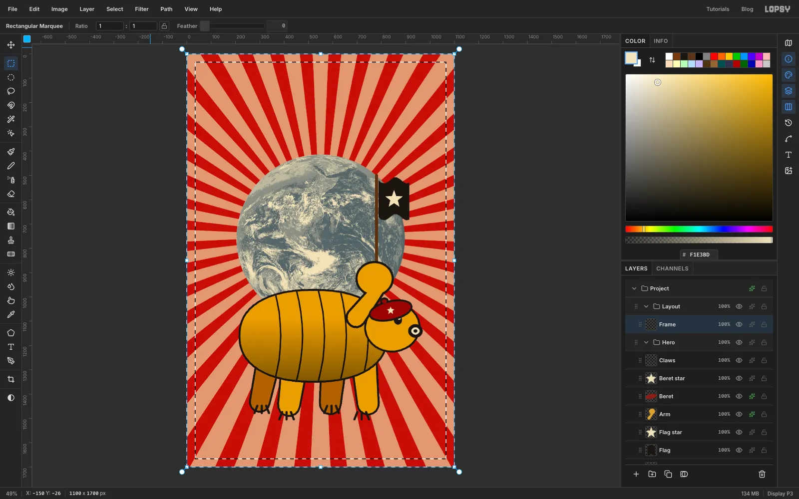

Add a new group above *Hero* named *Layout*. Everything from here on (frame, bands, type and badge) goes in this group. Inside it, add a layer named *Frame*. Drag a **Rectangular Marquee** larger than the canvas,
choose **Select → Shrink** with **34** px, then **Select → Inverse**.

## Fill the frame

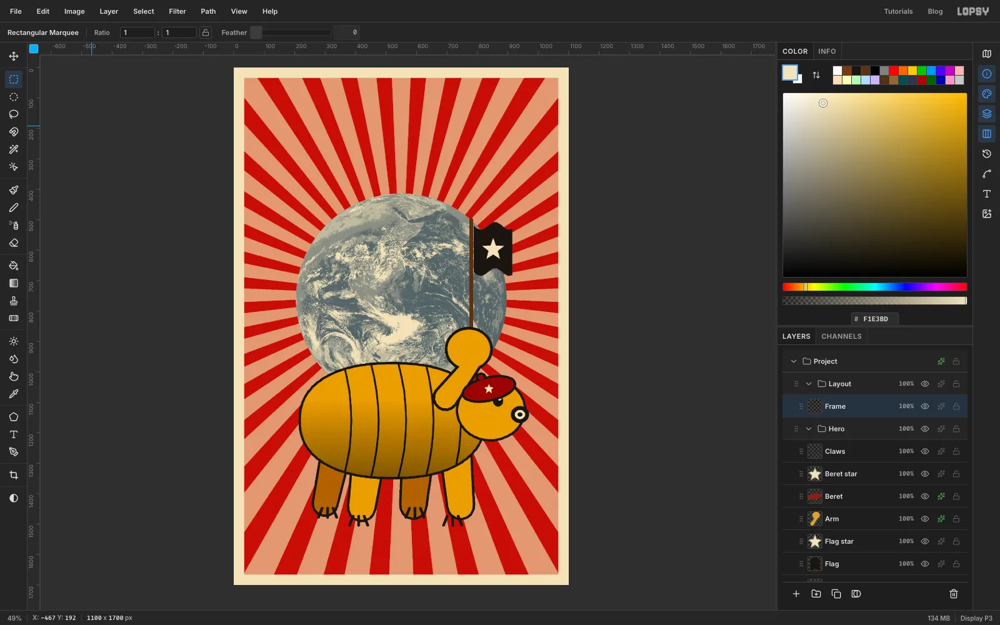

Set the foreground to `#F1E3BD` and choose **Edit → Fill**. Deselect. You now
have a cream border to keep the type off the edge.

## Title band

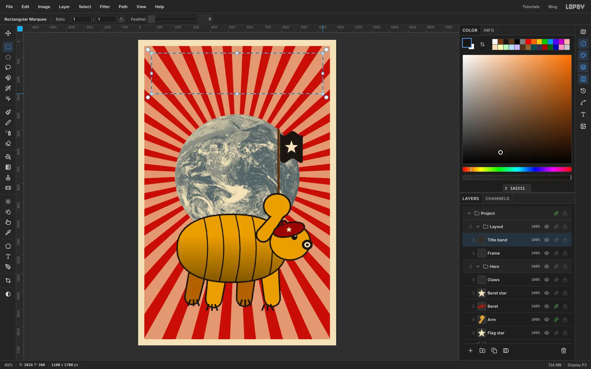

Add a layer *Title band*. Drag a **Rectangular Marquee** across the top of the frame, inset a little from the cream border and tall enough to hold the title. Fill it
with `#1A1511` and deselect.

## Set the title

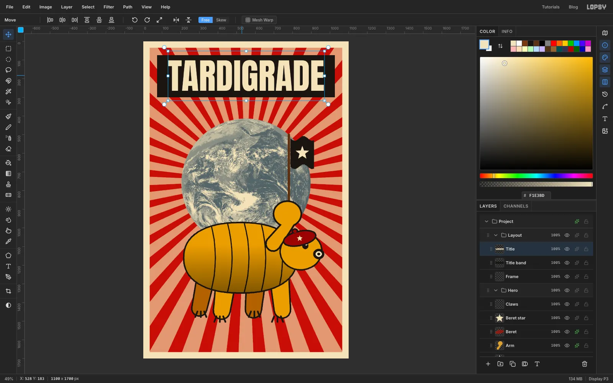

Pick the **Text** tool, choose **Anton**, set the size to **190** and the
colour to `#F1E3BD`, click in the band and type **TARDIGRADE**. Use the
align buttons to centre it horizontally, then drag it with the **Move** tool so it sits inside the band with even margins.

## Subtitle

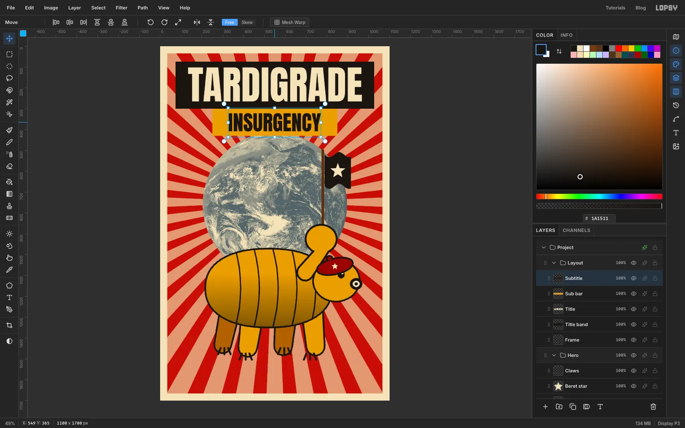

Add a layer *Sub bar* and fill an ochre `#E0A030` rectangle just under the title, narrower than the band and overlapping its bottom edge. Then type
**INSURGENCY** in **Anton** at **100** px in `#1A1511`, and centre it on the
bar.

## Tilt the labels

Click **Rasterize Layer** on the subtitle text so the rotation is baked into pixels. Select the bar and its text with a marquee, pick the **Move** tool, and drag just outside a corner handle to rotate about **−3°**. The title stays straight. Press [[Cmd+D]] to commit. A slight tilt makes the lockup feel
stamped on.

## Footer band

Add *Foot band* and fill an ink rectangle across the bottom of the frame, roughly a tenth of the page tall.

## Slogan

With the **Text** tool in **Anton** at **46** px and `#F1E3BD`, type
**SMALL · EIGHT-LEGGED · UNSTOPPABLE**. Centre it horizontally and place it in
the band.

## Small print

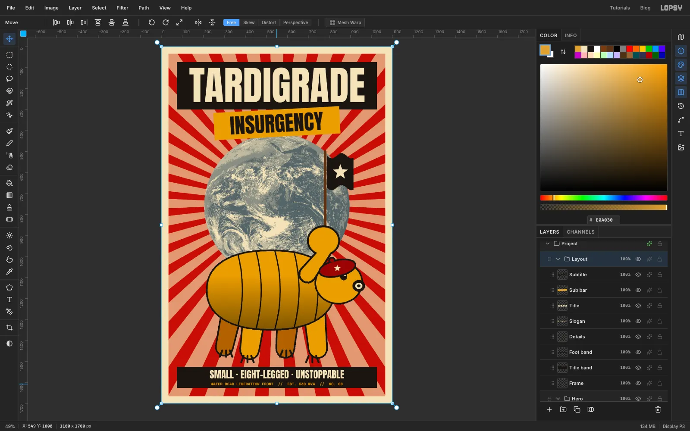

Add one more line with **Space Mono Bold** at **16** px in cream: **WATER BEAR
LIBERATION FRONT // EST. 530 MYA // NO. 08**. Centre it and drag it with the **Move** tool so it sits neatly under the slogan, with equal space above and below.

## Make a badge

Add a layer named *Badge*. With the **Elliptical Marquee**, draw a circle on the left of the page, a little below the title, big enough to hold a ring of text.

## Fill the badge

Fill it with `#E0A030`, deselect, and give the layer a **Stroke** effect in
`#1A1511` at **6** px.

## Text around the rim

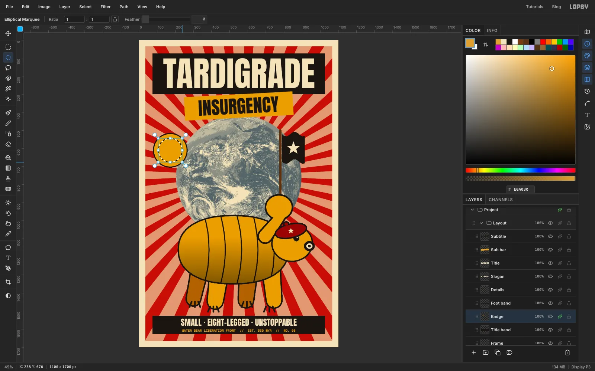

Draw a smaller circle inside the badge, leaving a margin for the outline, and choose **Select → Selection to Path**. A circular path appears in the Paths panel.
Deselect.

## Bind the text to the path

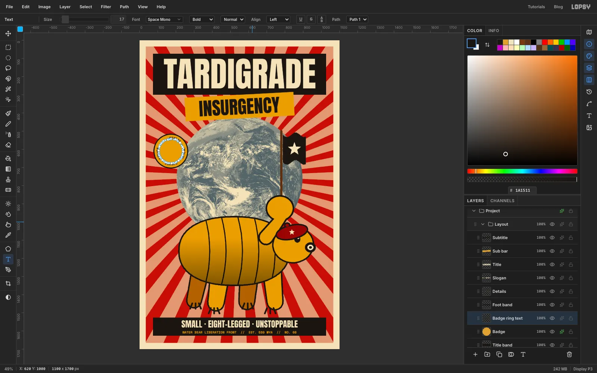

Pick the **Text** tool, choose **Space Mono Bold** at **17** px in `#1A1511`,
and type **RESIST · ENDURE · RESIST · ENDURE ·** (with a final space). In the
Text options, set the **Path** dropdown to *Path 1*. The words wrap
around the rim of the badge.

## A star for the middle

Add a layer named *Badge star* and lasso a five-pointed star in the middle of
the badge in `#1A1511`. Add *Badge star inner* above it with a smaller cream
`#F1E3BD` star centred on top.

## Drop shadows

Open the effects for the *Badge*, *Sub bar* and *Title band* in turn and add a
**Drop Shadow**: offset about **7 / 8** px, a tight **Blur**, `#1A1511` at 85% for the badge and bar, and `#5A3216` at 80% for the title band. A crisp, offset shadow looks like a second ink pass.

## Move the whole hero

Select the *Hero* group in the Layers panel, pick the **Move** tool and drag the tardigrade up a little, so its feet clear the footer band. Moving the group moves every layer inside it,
the flag, the beret and the shade included.

## Undo it

Press [[Cmd+Z]]. The hero snaps back to where it was. Press
[[Cmd+Shift+Z]] to redo it.

## Redo it

Checking undo and redo on a group move is a quick way to confirm nothing was left behind, flag and beret included.

## Guides

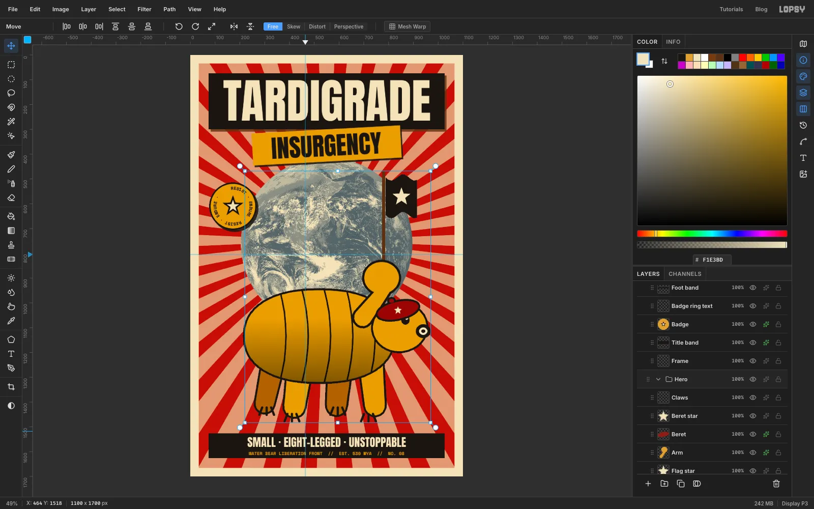

Drag a vertical guide out of the left ruler and park it down the middle of the title and the globe, then pull a horizontal guide out of the top ruler and set it through the centre of the globe. Use them to check that the title, the planet and the badge line up, and that the hero sits comfortably below the globe's centre.

That is a complete cover. Choose **File → Quick Export PNG** to save a
first version, then keep going: the second pass tightens the character and
adds the print texture.

## Scale the hero up

Select the *Hero* group and pick the **Move** tool. Hold [[Cmd]] and drag a
corner handle outward to scale the whole group by about a tenth. The character
now fills the lower half of the page and overlaps the Earth more.

## Commit the scale

Press [[Cmd+D]] to commit.

## Select the body

Select *Body*, pick the **Magic Wand**, set **Tolerance** to **110** and click the body. The whole body shape is selected, including its outline.

## Fill the body

Set the foreground to `#E8A62E` and choose **Edit → Fill** to give the body a slightly warmer ochre than the legs and head, which separates the pieces. Deselect.

## Posterize the shading

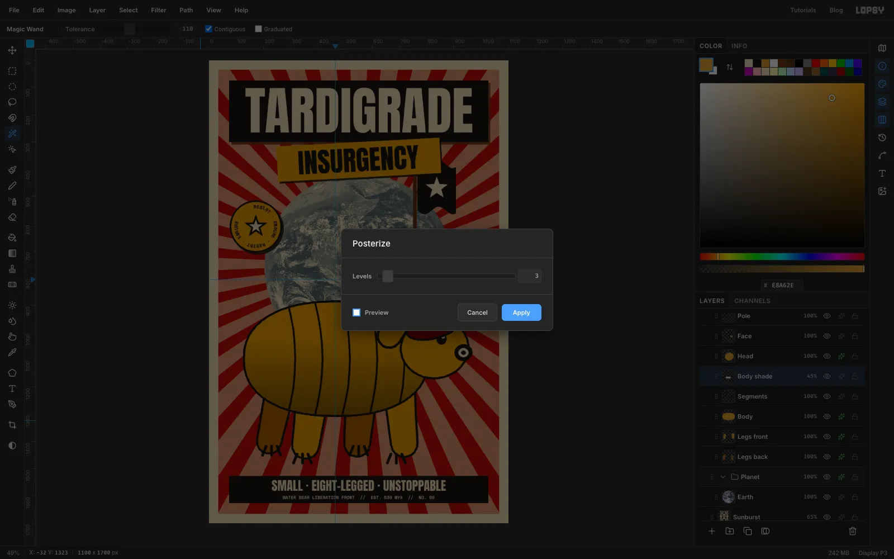

Select *Body shade* and choose **Filter → Posterize** with **Levels** at
**3**, then **Apply**.

## Set the shade opacity

Raise the layer opacity to **55%**. The soft gradient is now crisp bands, like a three-colour screen print.

## Shade the planet with halftone

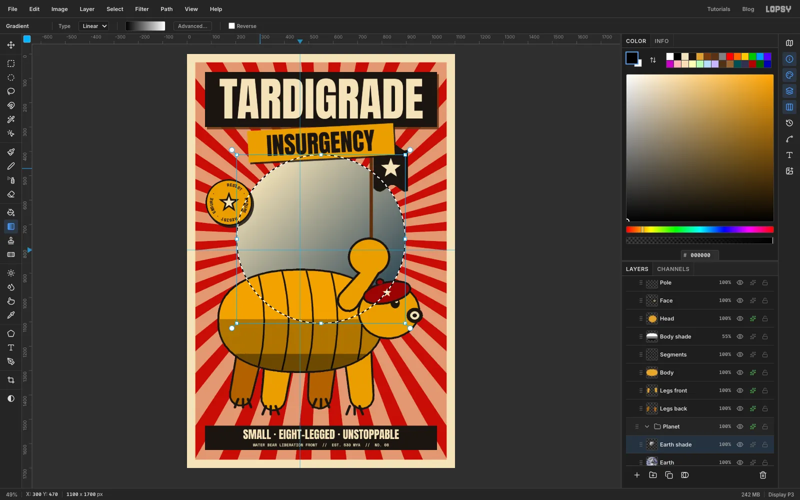

Select the *Earth* layer inside the *Planet* group, add a layer named *Earth shade*, and make an **Elliptical Marquee** that hugs the globe. Set the foreground to black and
the background to white. Using the **Gradient** tool, drag from the lower right
of the planet up toward the upper left.

## Run the halftone

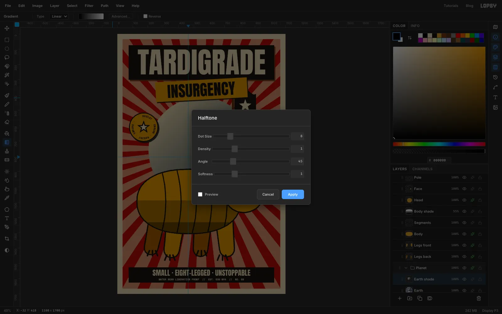

Choose **Filter → Halftone**, set **Dot Size** to **12**, and click **Apply**.

## Multiply the dots

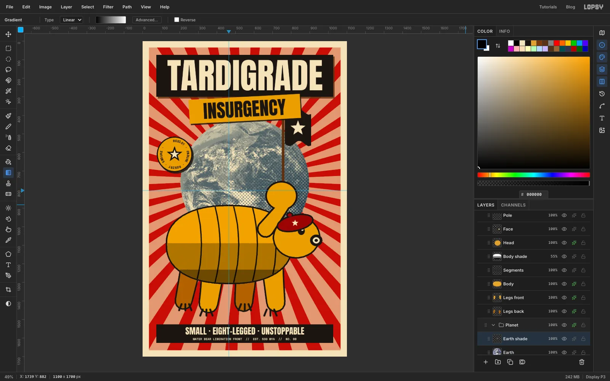

Set the layer's blend mode to **Multiply**. Dots swell in the shadow and
vanish in the light.

## Give the planet a glow

Add a layer named *Earth glow* directly above *Sunburst*. Draw an **Elliptical Marquee** a good deal larger than the planet, centred on it. Set **Feather** to a big soft value (about **90**), and fill it with `#F6D98A`.

## Soften the glow

Set the layer's opacity to **70%**. The planet now glows against the rays.

## Paper grain

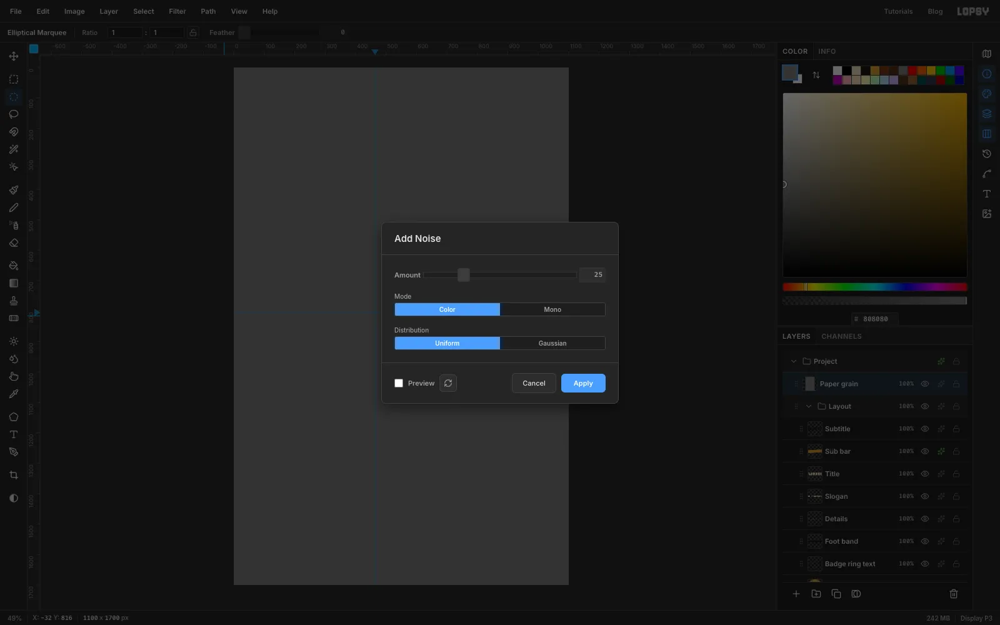

At the very top of the *Project* group, add a layer named *Paper grain*. Deselect, fill it with `#808080`, then choose **Filter → Add Noise** and raise **Amount** to **70**.

## Overlay the grain

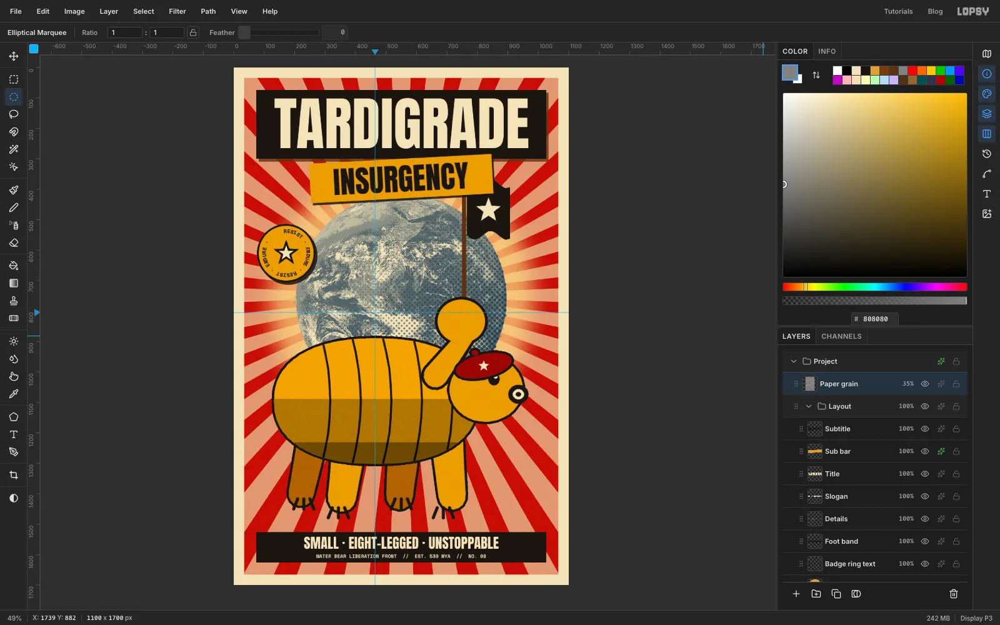

Set the blend mode to **Overlay** and the opacity to **35%**. Overlay leaves
the middle grey untouched and only lets the speckle through, so every colour
underneath picks up a soft print grain.

Zoom in and out one last time and check the planet, the type edges and the
badge at 100%. Then choose **File → Quick Export PNG** to save the finished
cover.
