Assembly manuals and patent drawings have a look everyone recognises:

- an **exploded isometric view**, with parts floating along dashed lines
- numbered **balloons** that point at each part
- a circled **detail view**
- a **parts list**, and a **title block** in the corner of the sheet

In this tutorial you'll use that look to make a Christmas card. It's a flat-pack gingerbread house with the headline *Some Assembly Required.*

The trick that makes it fast is the one technical illustrators use. **Draw each wall and roof panel flat, as a front-on elevation, then distort it onto its isometric face.** You never have to draw a window in perspective.

Along the way you'll use:

- **Define Pattern** and **Fill with Pattern** (grid paper, roof shingles and section hatching)
- the Move tool's **Distort** transform
- the **Stroke** effect for ink outlines
- nested **groups**, group moves and a multi-select move
- the **Gradient** tool
- Google fonts, including a rasterized and rotated label

The palette is small:

- paper `#EFE6D0`
- ink `#2A1C12`
- gingerbread `#B9773F` (lit face) and `#9A5C2C` (shaded face)
- icing `#FBF8F1`
- candy red `#B8322C`
- blueprint teal `#3E86A6` → `#1D4A63`

## Set up the sheet and its double border

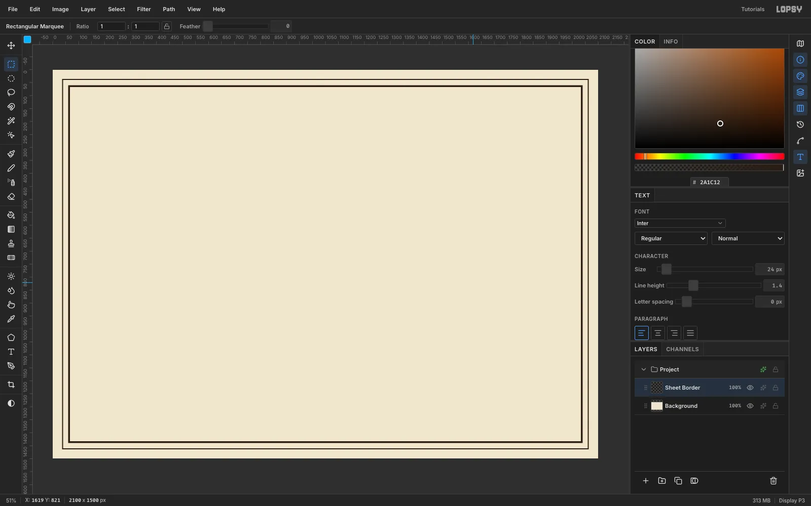

Create a **2100 × 1500** px document with a **White** background. That's a landscape 7 × 5 card at 300 ppi.

Select **Background**, set the foreground to `#EFE6D0` and choose **Edit → Fill**. Then run **Filter → Add Noise…** at **Amount 7**, **Mono**, for a little paper tooth.

Rename **Layer 1** to `Sheet Border` and set the foreground to ink `#2A1C12`. Each rule is a filled marquee with its middle deleted:

1. With the **Rectangular Marquee**, drag a rectangle over almost the whole sheet, leaving a margin of about 36 px on every side. Choose **Edit → Fill**, then **Select → Shrink…** by 3 and press [[Delete]]. That leaves a 3 px outer rule.
2. Drag a second rectangle about 24 px inside the first (roughly 60 px in from the edges). **Fill**, **Shrink…** by 6 and [[Delete]]. That leaves a 6 px inner frame.

> **Tip:** For rules that sit exactly parallel, press [[Cmd+D]] so nothing is selected, then click once with the marquee (don't drag). A dialog opens where you can type the corners: **From** 36, 36 **To** 2064, 1464 for the outer rule, and 60, 60 to 2040, 1440 for the inner one.

## Draw one tile of engineering grid

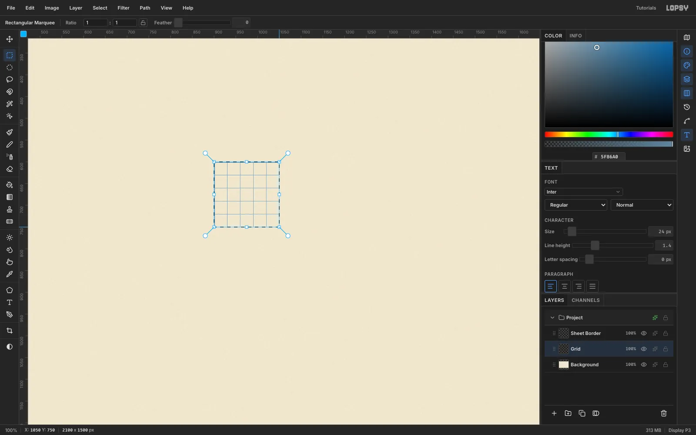

Add a layer called `Grid` above Background and press [[Cmd+1]] to zoom to 100%, so you can place 1 px lines. On an empty spot:

- **Minor lines:** with foreground `#8FAFC2`, fill 1 px-wide marquees every 30 px inside a 150 × 150 square.
- **Major lines:** with foreground `#5F86A0`, fill a 2 px line along the square's top edge and another along its left edge.

Marquee exactly the 150 × 150 square and choose **Edit → Define Pattern**. Then press [[Delete]] to clear the tile.

> **Tip:** Precise little marquees are easier to type than to drag. With nothing selected, a single click with the Rectangular Marquee opens a dialog with **From X / From Y / To X / To Y** fields.

## Tile the grid across the sheet

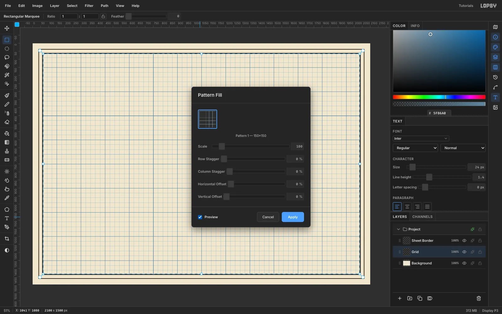

Press [[Cmd+0]] to fit the view. Marquee the area just inside the thick frame and choose **Edit → Fill with Pattern…**. Pick the grid thumbnail and tick **Preview** to check it, then click **Apply**.

To finish the grid:

1. Press [[Cmd+D]].
2. Open the layer's effects drawer (✦) and set **Blend** to **Multiply**.
3. Drop the layer's opacity to **45%** so the grid reads as printed paper, not a cage.

## Draw the cake board and trees in isometric

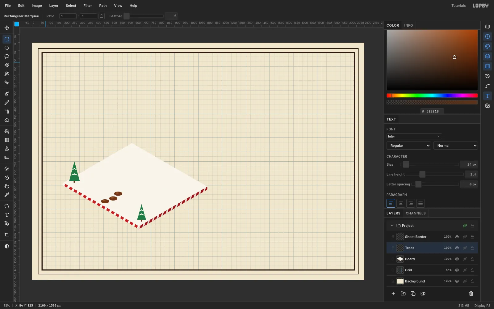

Isometric drawing only uses three directions. Verticals stay vertical, and the other two axes slope **30°** up to the left and up to the right. The board is a flat slab, so draw it straight in isometric with the **Lasso** ([[L]]) and **Edit → Fill**:

- The top face is a rhombus in white `#FBF8F1` whose edges all slope at 30°. Its left point sits a little inside the left border, its right point just past the middle of the sheet, its top point about 40% of the way down and its bottom point about three-quarters of the way down.
- Under the two front edges go thin parallelograms in red `#B8322C` and a darker `#8F2320`, each 18 px deep.
- Short slanted white quads along those edges make the candy stripes.

The grid paper makes the angle easy to judge. Each major square is 150 px, and a 30° line drops about one major square for every 1¾ squares across.

The trees are three-point triangles in green `#3D7A4A` with white chevrons for snow. The stepping stones are ellipse-marquee fills in chocolate `#6B3A1E`.

## Draw the side wall flat, as an elevation

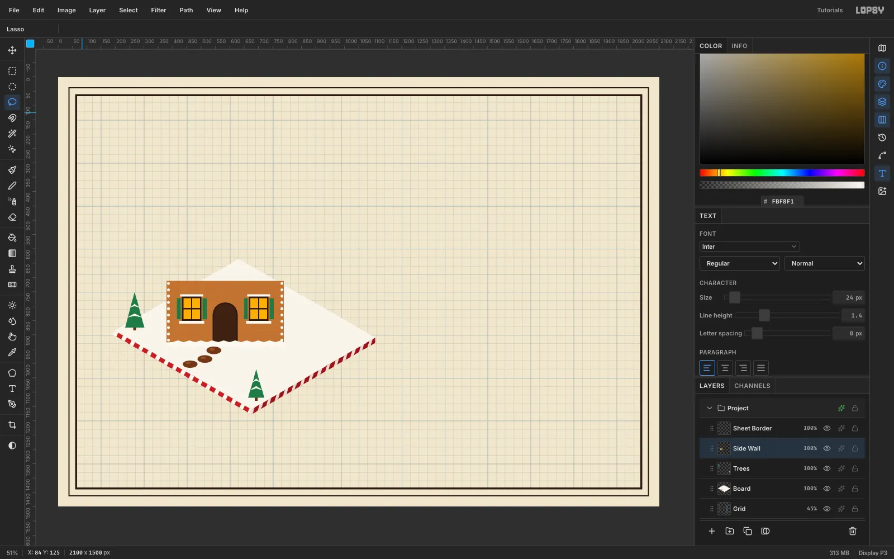

Add a layer called `Side Wall`. Don't draw it in perspective. Draw it **straight on**, the way it would look on the kitchen counter before assembly:

- a 410 × 225 tan `#B9773F` rectangle
- two windows: an ink frame, a glass fill `#F3B23E` and 4 px muntins
- green `#3D7A4A` shutters and white icing sills
- a dark arched doorway: an ink arch, then a `#3A2215` arch inset 5 px
- a row of white piping dots down each edge
- a wavy white snow skirt along the bottom

Everything is marquee, ellipse and lasso fills. Draw it roughly where the wall will stand, over the back-left half of the board, so the distort in the next step only has to bend it.

## Distort the elevation onto its isometric face

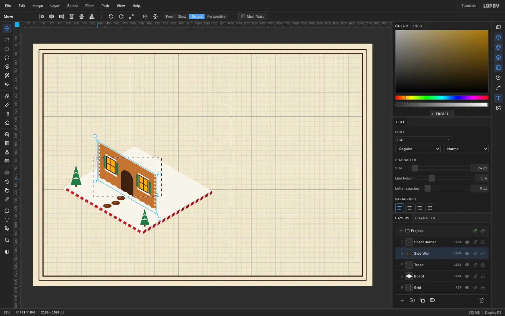

Marquee the whole elevation, switch to the **Move** tool ([[V]]) and click **Distort** in the options bar. In Distort mode each corner handle moves on its own:

1. Drag the two left corners straight up about 105 px, and pull them in about 30 px.
2. Drag the two right corners straight down by the same amount, and pull them in about 30 px too. The narrower face is the foreshortening.
3. Keep both sides vertical. The top and bottom edges should now slope down to the right at 30°, parallel to the board's front-left edge.

The windows, shutters and doorway all come along in correct isometric. Press [[Cmd+D]] to commit.

> **Tip:** The marching ants stay rectangular in Distort mode (that's by design). Only the blue handle box shows the new shape, so judge the result from the pixels.

## Build the gable wall and door the same way

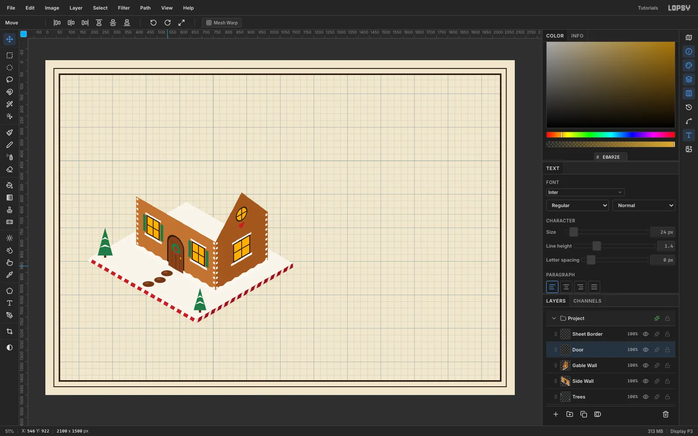

The **gable wall** is a pentagon in the darker `#9A5C2C`, 270 wide and 380 tall at the peak. It has a round attic window, a piped red heart and one big window. Draw it flat to the right of the side wall, then Distort it onto the right-hand face. This face turns the other way:

- drag the two left corners down about 70 px, and the two right corners up by the same amount, so the top and bottom rise to the right at 30°
- line its bottom-left corner up with the side wall's bottom-right corner, so the two walls meet at the front corner of the house

The **door** is its own layer. Draw it as a brown `#7E4523` arch with plank lines, a green ring wreath with a red bow, and a gold knob. Distort it into the doorway so it can be pulled out later.

## Make a fish-scale shingle tile

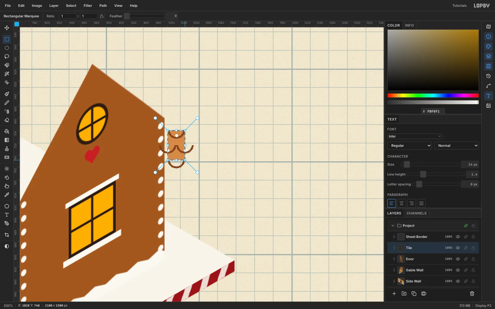

On a temporary layer, zoom in and fill a **28 × 48** rectangle with `#CB8C52`. Then:

1. Lasso half-rings (lower half of a 14 px circle, 3 px thick) in `#7A4524`. Put them at the top-centre and at mid-height on both side edges. The side-edge ones are cut in half, so the scallops stagger when the tile repeats.
2. Add a 2.5 px white icing dot inside each scale.

Marquee exactly the 28 × 48 tile and choose **Edit → Define Pattern**. Delete the temporary layer.

## Pattern-fill the roof panel

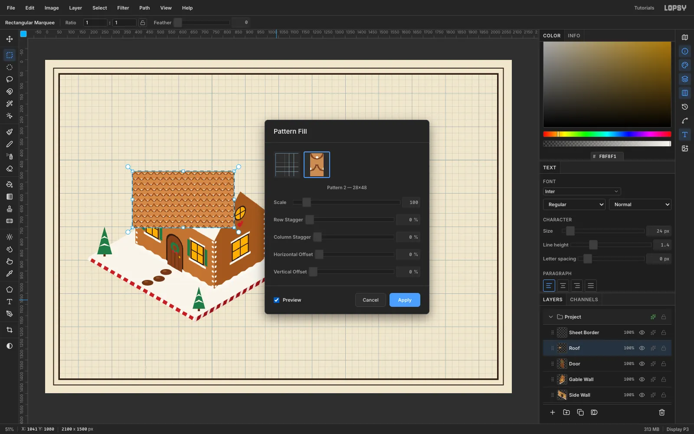

Add a layer called `Roof` above the door. Marquee a flat roof panel about 460 × 255 px in the empty space above the side wall, then choose **Edit → Fill with Pattern…** and pick the **28×48** thumbnail. Tick **Preview**, then **Apply**.

Add the icing on top of the shingles:

- an 18 px white band along the ridge (top edge)
- scalloped white drips hanging below the eave (bottom edge), made from one lasso zig-zag

## Distort the roof onto its slope

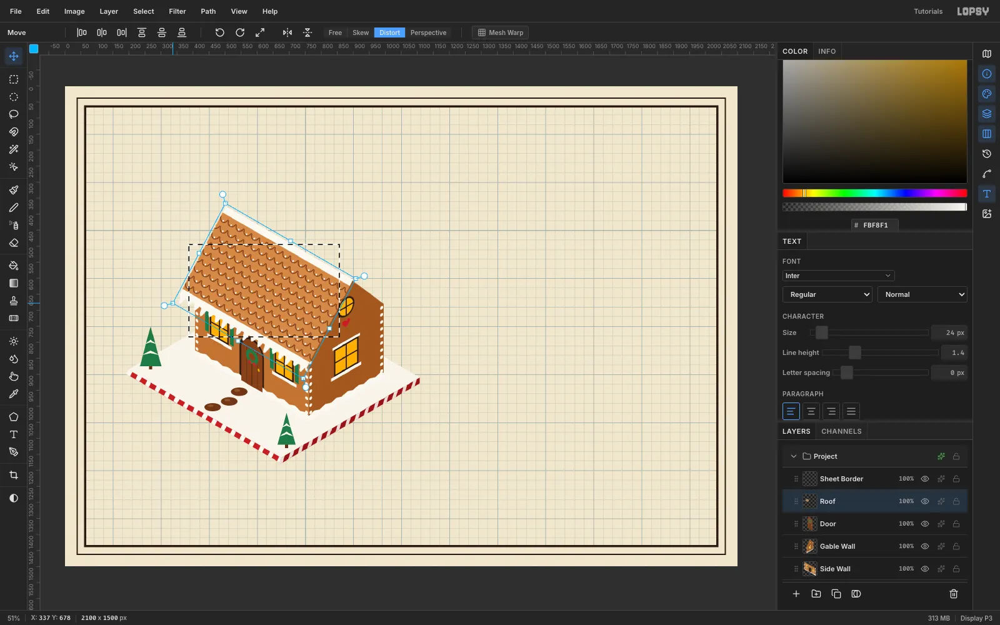

Marquee the roof and use **Distort** again. The roof slopes back to the ridge, so its face is a steeper parallelogram:

- Drag the two top corners up and to the right, until the ridge (the top edge) runs parallel to the wall tops and its right end sits on the gable's peak.
- Drag the two bottom corners down and to the left, until the eave overhangs the side wall a little.
- The left and right edges should follow the slope of the gable's roof line.

The shingles shrink toward the ridge automatically, which is exactly what they should do.

## Add the rake icing, gumdrops and chimney

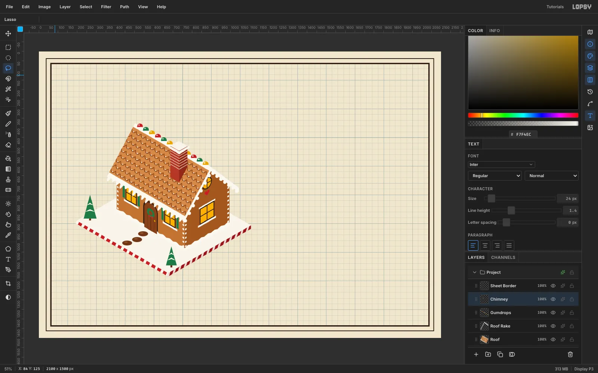

These pieces are small, so draw them straight in isometric with the lasso:

- **Roof Rake:** a white chevron strip that follows the gable's roof line, with 9 px white scallops underneath.
- **Gumdrops:** twelve half-domes in red, green and gold, evenly spaced along the ridge, each with a white highlight.
- **Chimney:** two brick faces (`#A8402F` lit, `#86301F` shaded) with pale mortar lines, and a white snow cap on top. Its bottom edge follows the roof slope, so it can sit *on* the roof.

## Outline every part with a Stroke effect

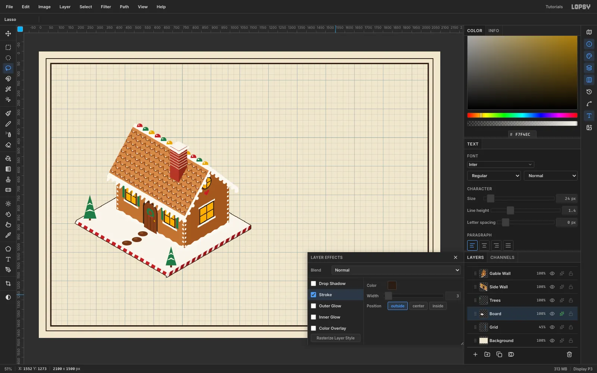

Technical illustrations have a crisp outer contour on every part. Select each part layer, open the effects drawer (✦), tick **Stroke** and set:

- **Color** `#2A1C12`
- **Width** `3` (use `2` for the gumdrops and trees)
- **Position** **outside**

Because each part is its own layer, the shared edges get a double-weight line. That's the classic "silhouette heavier than detail" hierarchy, for free.

## Group the parts

Group the layers into sub-assemblies. For each group, click the first layer, [[Shift]]-click the last, and choose **Layer → Group Layers**:

- **Base:** Board + Trees
- **Walls:** Side Wall + Gable Wall
- **Roof Assembly:** Roof + Roof Rake + Gumdrops

Collapse those three groups. Then click **Base**, [[Shift]]-click **Chimney** and group everything into **House**.

> **Tip:** Always collapse sub-groups before you [[Shift]]-click a range. An expanded group's child rows join the range too, and grouping would pull them out of their sub-assembly.

## Explode the house with group moves

Now take the kit apart. Select a group or layer, switch to **Move** and drag. Arrow keys finish each move neatly: each press nudges 1 px, and [[Shift]]+arrow nudges 10 px.

- **Roof Assembly:** straight up about **165 px**, so there's a clear gap above the walls
- **Chimney:** straight up about **370 px**, well clear of the roof (you'll lift it once more later)
- **Door:** out of the doorway, down and to the left along the isometric axis (about 145 px left and 85 px down)
- **Base:** straight down about **130 px**

Every move of a group carries its children with it. [[Cmd+Z]] and [[Cmd+Shift+Z]] step through the moves if you want to compare.

## Draw dashed assembly lines

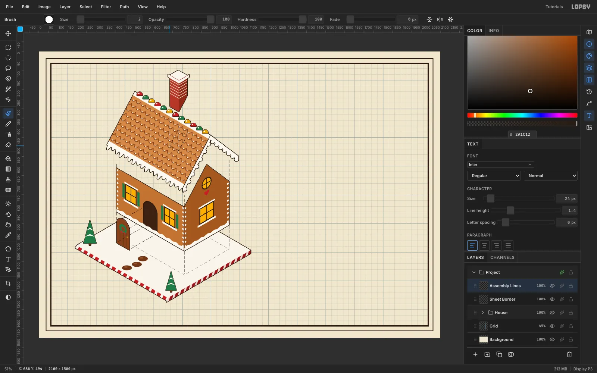

Add an `Assembly Lines` layer above House. Use a hard **Brush** at **Size 2** in ink and draw each dash as a short drag, 14 px on and 9 px off:

- straight up from each visible wall-top corner to the roof's underside
- straight down from each wall-bottom corner to the board
- three lines guiding the door home

On the **Board** layer, dash the walls' **footprint** onto the snow in grey `#8A7F72`. That shows where the walls land.

## Start the X-ray detail view

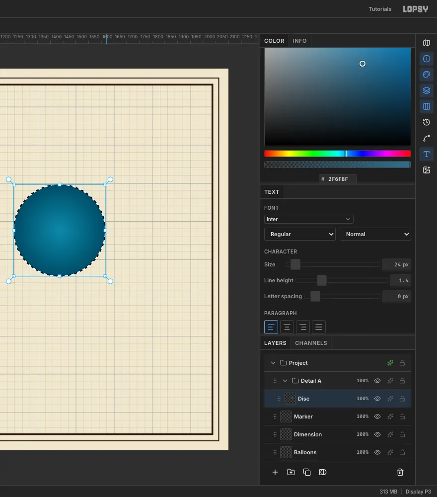

A detail view blows up one joint in a circle. Here it's an "X-ray" of how the walls are glued.

Make a new group called `Detail A` and add a layer called `Disc`. In the right half of the sheet, about a third of the way down, [[Cmd]]-drag an elliptical marquee **360 px** across (radius 180). The right column of text will line up with its left edge later. Then:

1. Pick the **Gradient** tool and set **Type** to **Radial**. In **Advanced…**, set the stops to `#3E86A6` → `#1D4A63`.
2. Drag from the centre to the edge.
3. Give the disc a **Stroke** of 4 px ink.

## Hatch the section and pipe the icing

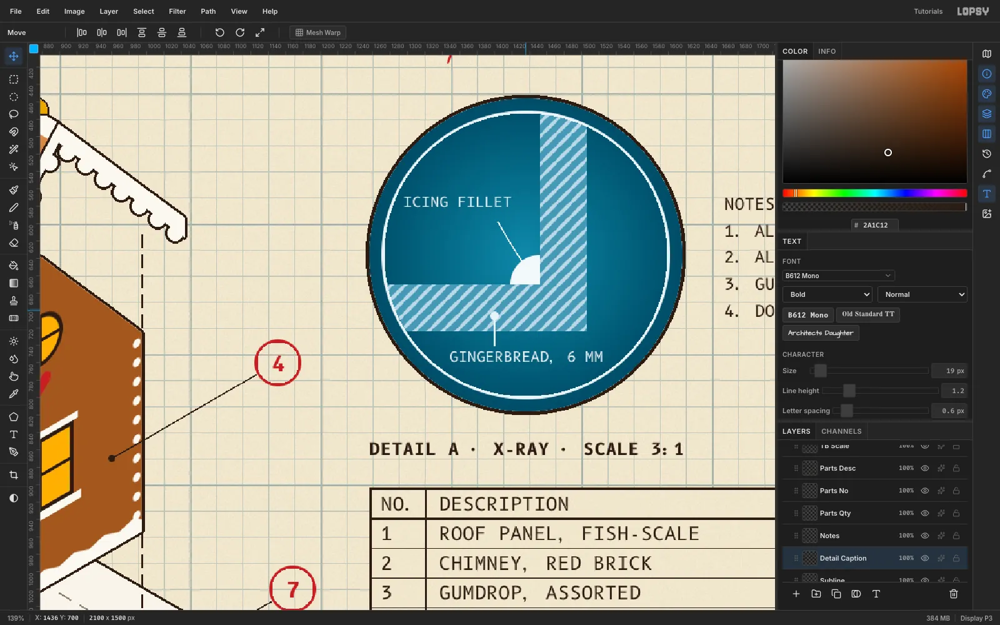

Section views mark cut material with **45° hatching**:

1. **Section layer:** fill an L of two wall slabs in `#5C97B4`. Clip it to the circle: [[Cmd]]-drag an ellipse marquee about 17 px inside the disc's edge (radius 163), then **Select → Inverse** and [[Delete]].
2. **Hatch tile:** make a **16 × 16** pattern tile holding three thin white diagonal bands: one through the middle from bottom-left to top-right, and one clipping each of the other two corners. The corner pieces meet up with the next tile, so the lines join seamlessly.
3. **Hatch layer:** [[Cmd]]-click the Section thumbnail to select the slabs. On a new `Hatch` layer, use **Fill with Pattern…** with the 16 × 16 tile, then set the layer to **70%**.
4. **Icing layer:** fill a white circle of radius 34 in the inside corner. [[Cmd]]-click the Section thumbnail again, click the `Icing` row so [[Delete]] clears only the selection, and press [[Delete]]. The walls cut it back to a quarter-round **icing bead**.
5. **Ring:** add a thin white ring just inside the disc's edge (radius about 166).

Label the section in **B612 Mono** 16 px white, each label with a short leader.

## Rule up the parts list and title block

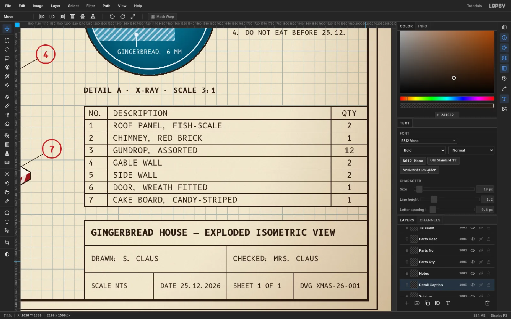

Every engineering sheet ends in a **title block** in its bottom-right corner:

1. On a `Table Fill` layer, fill paper-coloured rectangles behind the parts list and the title block. Keep them *inside* the frame, so the thick border still shows.
2. On a `Table Rules` layer, draw the rules with filled marquees: 3 px for the outer lines and header, 1 px between rows.

Set the type in **B612 Mono**:

- **Parts list:** 21 px with **Line height 1.62**, so each 34 px row holds one line. Make the QTY column an **area text** box (drag with the Text tool) set to **Align center**, so `12` and `2` centre in their cells.
- **Title block:** 24 px bold for the title, and 19 px and 17 px for the cells.

The jokes live here too: DRAWN S. CLAUS, CHECKED MRS. CLAUS, SCALE NTS.

## Set the headline and notes

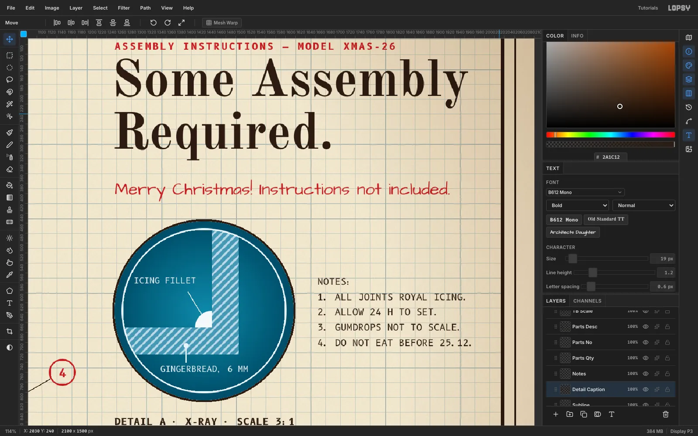

Every block in the right column shares one left edge, the left edge of the detail circle. Click the top ruler there to drop a guide, then nudge each block to it with the arrow keys.

- **Kicker:** `ASSEMBLY INSTRUCTIONS — MODEL XMAS-26` in **B612 Mono** Bold 19, red, with **Letter spacing 3**.
- **Headline:** `Some Assembly` / `Required.` in **Old Standard TT** Bold 104 with **Line height 1.02**.
- **Greeting:** `Merry Christmas! Instructions not included.` in **Architects Daughter** 34, red. It's the drafter's handwriting.
- **Notes:** B612 Mono 18 at Line height 1.7, beside the detail circle. For example, *4. DO NOT EAT BEFORE 25.12.*
- **Caption:** `DETAIL A · X-RAY · SCALE 3:1` under the circle. Add **Letter spacing 0.6** so it spans the circle's full width.

## Rebalance the drawing with one multi-select move

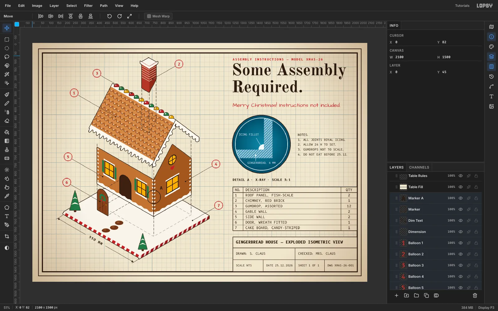

Step back and check the balance. Here the lifted chimney crowded the ridge, and there was spare room at the bottom of the sheet.

1. Click **House**, then [[Cmd]]-click every other layer of the drawing: Assembly Lines, plus any callout layers you've already added (the screenshot has the balloons, Dimension and the detail marker selected too).
2. With the Move tool, drag down about **45 px**. Every selected layer moves together, and one undo reverts them all.
3. Expand **House** and lift **Chimney** another **50 px** or so, so its base clears the gumdrops.
4. Extend its three dashed drop lines to a dashed footprint on the roof.

## Call out the parts with balloons

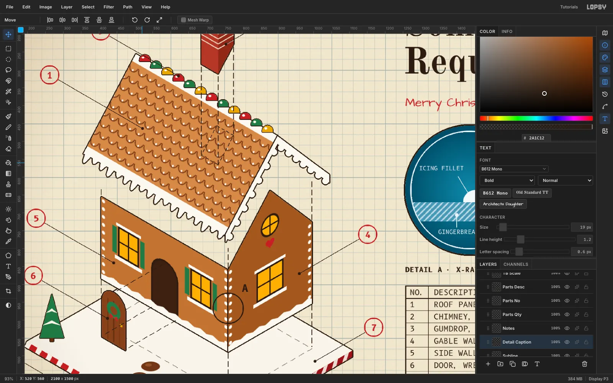

Balloons are **27 px** red rings, made with an ellipse fill, **Shrink** by 3 and [[Delete]]. The numbers are **B612 Mono** Bold 24, centred with arrow nudges.

> **Tip:** If Shrink leaves the inside of such a small circle looking squared off, delete the middle with a second circle instead: [[Cmd]]-drag a 21 px ellipse marquee centred inside the ring and press [[Delete]].

Keep the leaders consistent. Every leader is a **1.8 px** ink line at the isometric angle, **30°**, and ends in a 4 px dot on the part. With the **Brush**, click the start of a leader, then hold [[Shift]]+[[Cmd]] and click its end to snap the line to 15° steps. Parallel leaders make the sheet look engineered rather than scribbled. Number the balloons in the same order as the parts list.

## Add a dimension with a rotated label

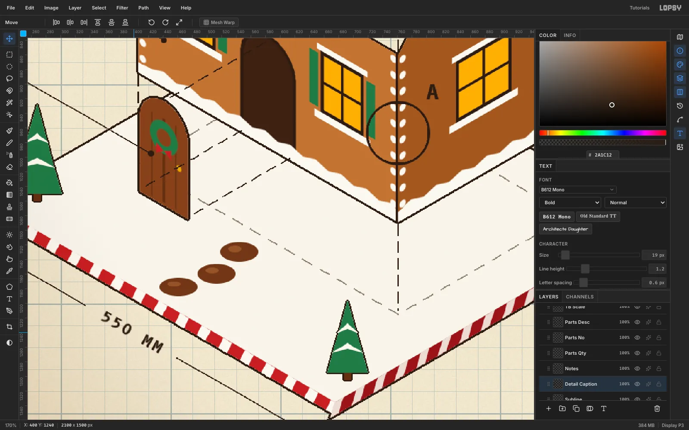

Run a dimension line parallel to the board's front edge:

1. Draw two extension lines that start just clear of the board corners.
2. Draw the dimension line with a gap in the middle, and lasso a small ink triangle at each end for the arrowheads.
3. Type `550 MM` in B612 Mono Bold 20 in empty space, then click **Rasterize Layer**.
4. Marquee the label, switch to **Move** and drag a rotation handle while holding [[Cmd]]. That snaps the angle to 15° steps, so it lands on exactly **30°**.
5. Press [[Cmd+D]] and move the label into the gap.

> **Tip:** Rasterize type before you rotate or distort it. Live text re-renders from its settings, so a later edit would set it straight again.

## Age the paper and finish

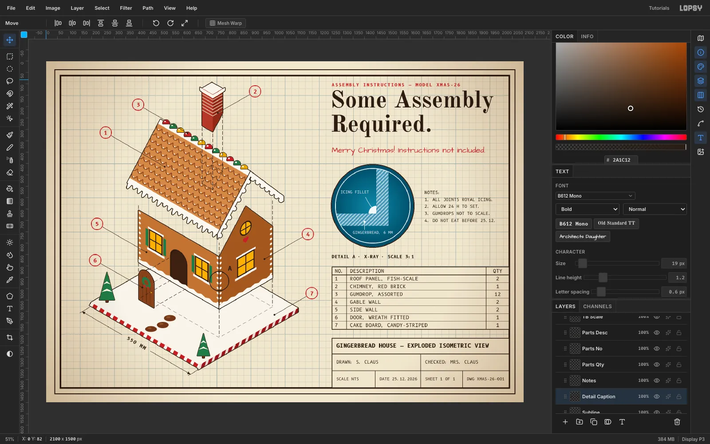

Add a top layer called `Vignette`. Marquee the whole canvas, then pick the **Gradient** tool set to **Radial**. In **Advanced…**, use three stops of `#8A6A3A`:

- 0% opacity at 0
- 0% opacity at 0.6
- 100% opacity at 1

Drag from the centre of the sheet to beyond a corner. Set the layer to **Multiply** at **35%**. The edges warm up like an old blueprint.

Export with **File → Quick Export PNG** and save the project with **File → Save Project**.
