Technical illustration makes a great hero for a website. One honest cutaway drawing tells visitors you know how the thing works. This tutorial mocks up a desktop landing page for **Lumen Glassworks**, an invented workshop that restores vintage camera lenses. The hero is a cross-section of a classic **double-Gauss** lens, the six-element design inside most 50 mm lenses. It has a hatched metal barrel, glass elements, a ray trace and drafting-style callouts, next to the headline, buttons and stats you'd find on a real page.

The fun part is the glass. Every lens surface is a slice of a sphere, so in a section drawing each surface is an arc of a circle. Each element is built from exactly that: a rectangle **intersected** with one circle and trimmed by another.

Along the way you'll use:

- the **Elliptical** and **Rectangular Marquee** with **Shift+Alt** to intersect and **Alt** to subtract
- **Define Pattern** and **Fill with Pattern** for section hatching, an engineering grid and a dash-dot centre line
- a **radial gradient**, dithered with **Add Noise**
- **Grow** and **Shrink** to outline parts
- the **Outer Glow** and **Stroke** effects
- the **Shape** tool for the panel, pill buttons and cards
- live text in **Space Grotesk**, **Inter**, **IBM Plex Mono** and **Instrument Serif** italic
- **Rotate 90°**, scaling, **Duplicate Layer**, group nudging and **Canvas Size**

The palette is near-black with warm off-white ink, glass in teal and blue, and one safety orange:

- Background `#141619`, panel `#1A1D21`, panel glow `#2A3A3A`, footer `#0E0F11`
- Ink `#E6E0D2`, headline `#EEE8DA`, outlines `#CFC8B8`, leaders `#BDB6A6`
- Grey text `#A7ADB4` / `#8A9097`, rules `#2A2E34` / `#2B2F35` / `#4A4F57`
- Hatch lines `#7D828A`, section fill `#22262C`, grid `#23272D`
- Crown glass `#74CFC3`, flint glass `#4F7FE8`
- Accent orange `#FF5B22`

> **Tip:** The lens is an engineering drawing, so those steps give exact positions. The **Info** panel shows the pointer's position and the size of the current selection as you drag. If you'd rather not measure, open the project with the **Follow along** button and trace over it.

## Set up the page and guides

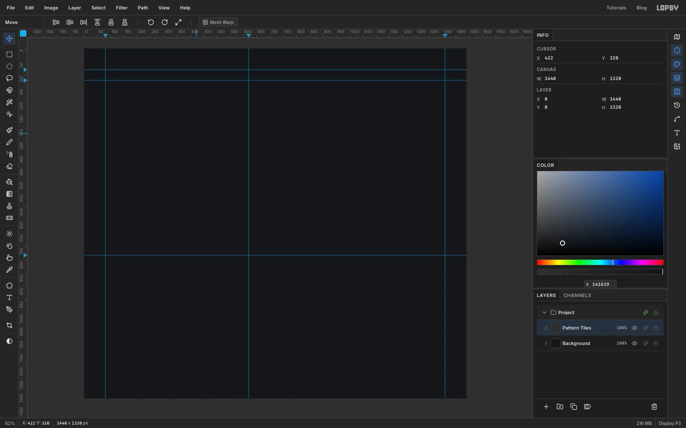

Open [Lopsy](/). In the **New Document** dialog, set **Width** to `1440` and **Height** to `1320`, a common desktop frame. Click **Create**.

1. Select **Background**, set the foreground colour to `#141619` and choose **Edit → Fill**. With nothing selected, it fills the whole layer.
2. Double-click **Layer 1** and rename it `Pattern Tiles`. You'll use it as a scratch area in the next step.
3. Click the top ruler at `80` and `1360` for the page margins, and at `620` where the drawing panel starts.
4. Click the left ruler at `80` (the bottom of the nav bar), then at `120` and `780` (the top and bottom of the hero).
5. Turn off **View → Snap to Guides**. Many of the small marquees you'll draw sit a few pixels from a guide, and snapping would pull them onto it.

## Draw four pattern tiles

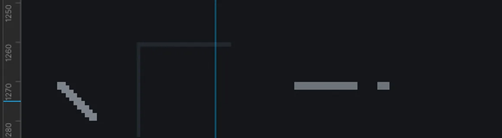

Patterns do the tedious drafting work. Zoom into an empty corner of `Pattern Tiles`.

1. **Forward hatch.** Draw a 10 × 10 px rectangular marquee. Pick the **Pencil** at **Size** `2` and colour `#7D828A`. Click just outside the box's bottom-left corner, then **Shift-click** just outside its top-right corner. The selection clips the line into a clean diagonal. Choose **Edit → Define Pattern**. With a selection active, only the selected pixels become the tile.
2. **Back hatch.** Do the same in a second 10 × 10 box, this time running from the top-left corner to the bottom-right.
3. **Grid.** In a 24 × 24 box, fill a 1 px strip along the top and another down the left side with `#23272D`. Then select the whole 24 × 24 box and define it.
4. **Dash-dot.** In a 30 × 2 box, fill a 16 px dash, leave a 5 px gap, fill a 3 px dot and leave the last 6 px empty. Define the whole box, empty end included, so the gaps repeat.

The Pattern Fill dialog now lists Patterns 1 to 4 in that order.

## Draw the drawing panel and its glow

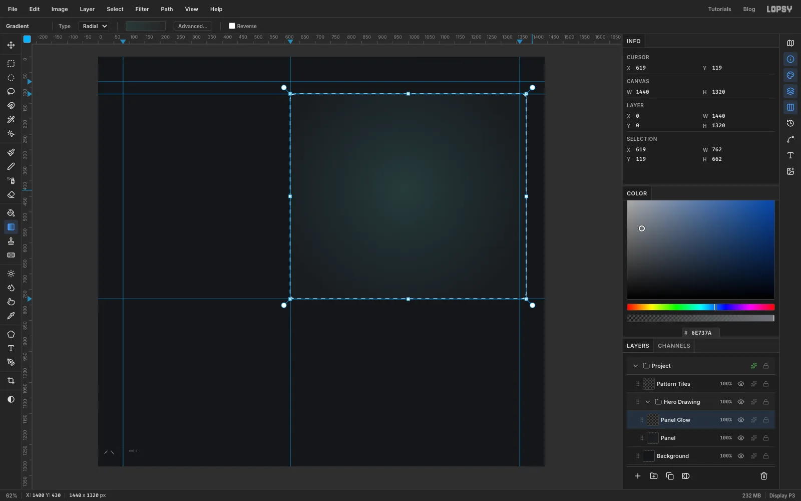

1. Select `Background` and click **New Group** in the Layers panel. Name it `Hero Drawing`, then click **Add Layer** and name the new layer `Panel`.
2. Pick the **Shape** tool and set **Shape** to **Rectangle**, **Corner Radius** to `14`, **Fill** to `#1A1D21`, and add a **Stroke** of `#2B2F35` at **Width** `1`.
3. Shapes grow from where you press. Press at the panel's centre, (1000, 450), and drag to its bottom-right corner, (1380, 780). The panel bleeds 20 px past the right margin guide, and everything inside it stays within the guide.
4. Add a layer named `Panel Glow` and **Cmd-click** the `Panel` thumbnail to select its shape.
5. Pick the **Gradient** tool and set it to **Radial**. Click **Advanced…**, then set both stops to `#2A3A3A` with the right-hand stop at `0` opacity. Drag from the middle of the lens area, about (985, 430), out past the panel's right edge.

The glow stops the panel looking flat and pulls the eye to the drawing.

## Dither the glow with noise

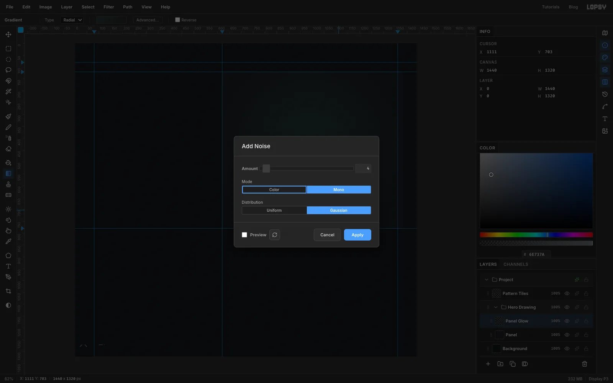

A dark, slow gradient can show as visible rings on some screens. A pinch of noise breaks them up.

1. With `Panel Glow` selected, choose **Filter → Add Noise…**.
2. Set **Amount** to `4`, click **Mono** and **Gaussian**, and click **Apply**.

The grain is too fine to read as texture. You'll just notice that the rings are gone.

## Fill an engineering grid

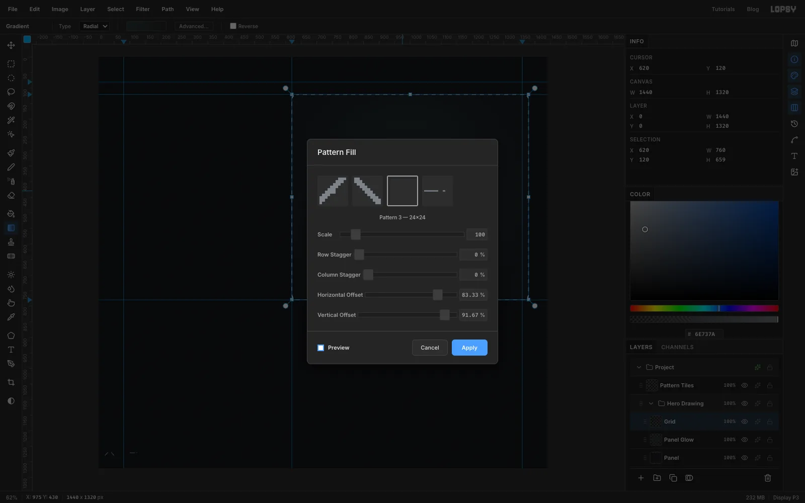

The lens will sit on a horizontal **optical axis** at y `430`, with its front at x `740`. The grid should line up with both.

1. Add a layer named `Grid`. **Cmd-click** the `Panel` thumbnail, then choose **Select → Shrink…** by `1` px so the grid stays inside the border.
2. Choose **Edit → Fill with Pattern…** and pick the 24 × 24 grid tile.
3. Set **Horizontal Offset** to `83.33%` and **Vertical Offset** to `91.67%`. Those are 20 px and 22 px of the 24 px tile, the amounts that put grid lines on x 740 and y 430. Click **Apply** and deselect.

## Lasso the barrel in section

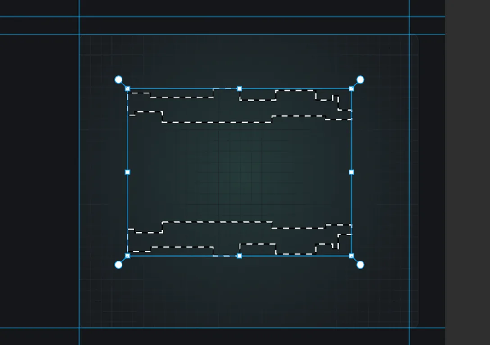

A section view slices the lens down its axis, so the metal barrel shows twice: once above the axis and once mirrored below it.

1. Add a layer named `Barrel Section`.
2. Pick the **Lasso** and drag around the top wall, corner to corner. From left to right it has:
   - a front name ring
   - a long tube whose inner wall steps down where the middle glass sits
   - a raised **aperture ring**, which sets the f-number
   - a wider **focus ring**
   - a stepped **bayonet**, the mount that locks into the camera
3. Hold **Shift** and lasso the same shape mirrored below the axis. Every y becomes 860 − y.

> **Tip:** These are the top wall's corners, clockwise from the front: (728, 302), (744, 302), (744, 294), (806, 294), (806, 318), (1052, 318), (1052, 304), (1172, 304), (1172, 312), (1230, 312), (1230, 290), (1200, 290), (1200, 258), (1188, 258), (1188, 268), (1150, 268), (1150, 246), (1060, 246), (1060, 268), (980, 268), (980, 242), (920, 242), (920, 262), (780, 262), (780, 252), (728, 252). A quick, steady drag through them gives crisp steps.

## Hatch the parts in opposite directions

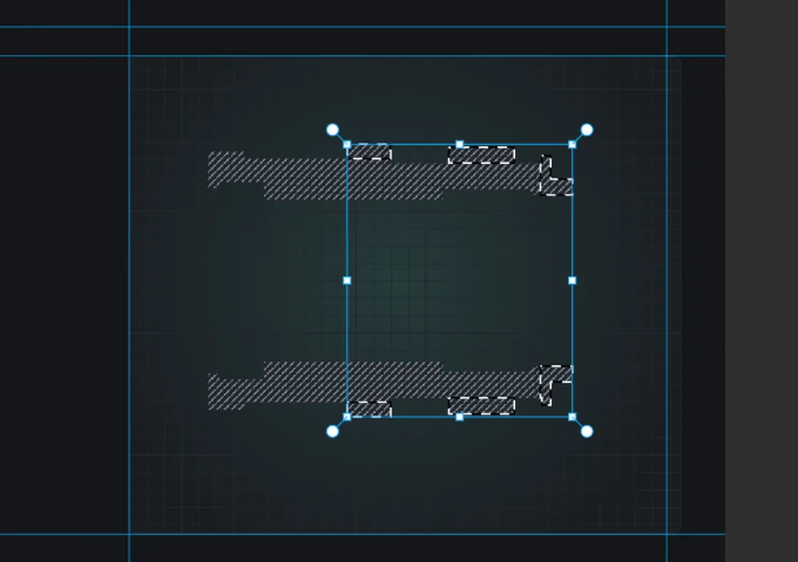

1. Fill the selection with `#22262C` (**Edit → Fill**). Then choose **Edit → Fill with Pattern…**, pick the forward hatch and click **Apply**. Deselect.
2. In a section drawing, separate parts are hatched in **opposite directions**, so the rings mustn't read as one casting with the tube.
   - **Cmd-click** the `Barrel Section` thumbnail.
   - **Shift+Alt-drag** a rectangle over the bayonet, from (1186, 200) to (1250, 660). That intersects the selection down to just the mount.
   - **Shift-drag** a rectangle over each raised ring to add it: (920, 242)–(980, 262) and (1060, 246)–(1150, 268), plus their mirrors (920, 598)–(980, 618) and (1060, 592)–(1150, 614).
3. Fill with `#22262C` again, then **Fill with Pattern** using the back hatch. The solid fill covers the old hatch first.

## Add the retaining rings

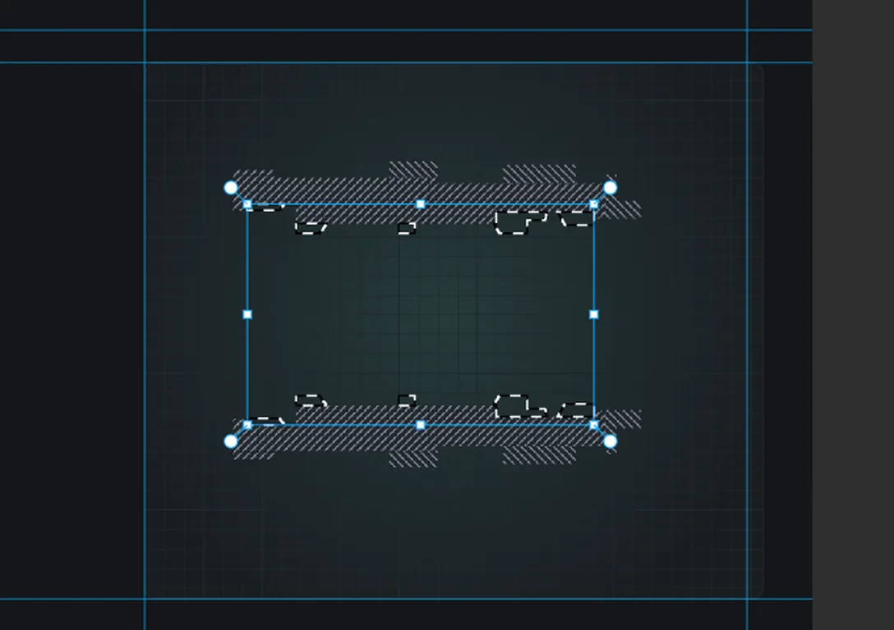

Glass doesn't float. Each element is clamped by a threaded **retaining ring** or rests against a **spacer**. Without them the drawing looks wrong to anyone who has opened a lens.

1. Add a layer named `Retainers`.
2. Lasso these five rings above the axis, then **Shift-lasso** each one's mirror below it:
   - **front ring:** (746, 294), (791, 294), (791, 295), (785, 302), (746, 302)
   - **ring ahead of the first pair:** (806, 318), (843, 318), (835, 330), (806, 330)
   - **stop ring**, which will hold the iris: a box from (932, 318) to (952, 330)
   - **spacer** between the rear pair and the last element: (1052, 304), (1114, 304), (1112, 314), (1090, 314), (1090, 330), (1056, 330), (1049, 318), (1052, 318)
   - **rear ring:** (1127, 304), (1172, 304), (1172, 320), (1136, 320)
3. Fill with `#22262C`, then with the back hatch, the same direction as the rings they belong with.

The slanted corners follow the curve of the glass that will sit against them.

## Outline every part

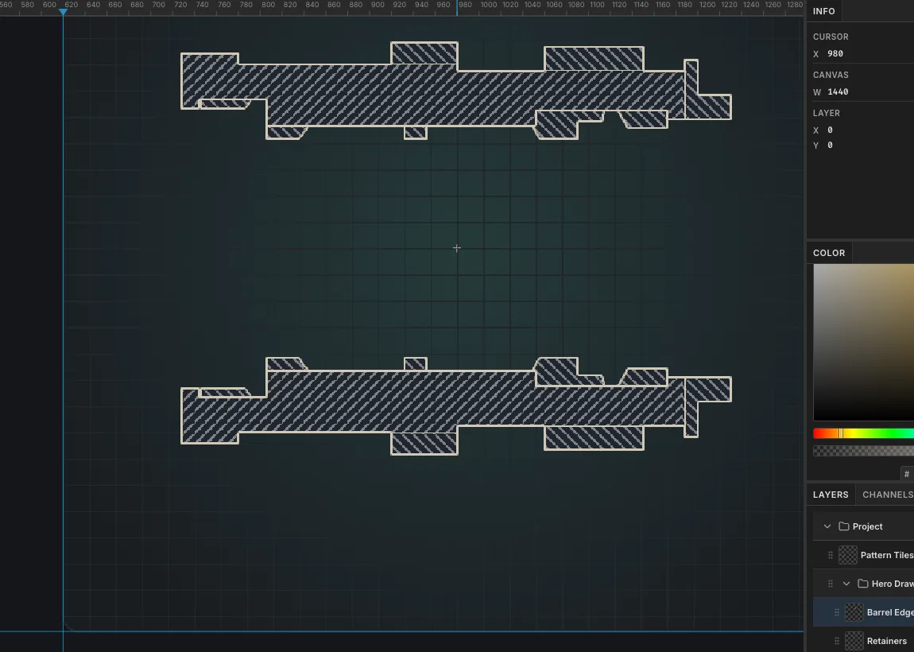

1. Add a layer named `Barrel Edges` and set the colour to `#CFC8B8`.
2. **Cmd-click** the `Barrel Section` thumbnail, choose **Select → Grow…** by `1` px and **Edit → Fill**. Then choose **Select → Shrink…** by `2` px and press [[Delete]]. That leaves a 2 px line centred on the edge.
3. Repeat with the `Retainers` thumbnail.
4. For the seams between the tube and its rings, select each ring's rectangle again, **Fill**, **Shrink** by `1` and **Delete**. Use the Pencil at Size `1` to **Shift-click** a short vertical line where the bayonet meets the tube, at x 1188.

## Build a lens element from circles

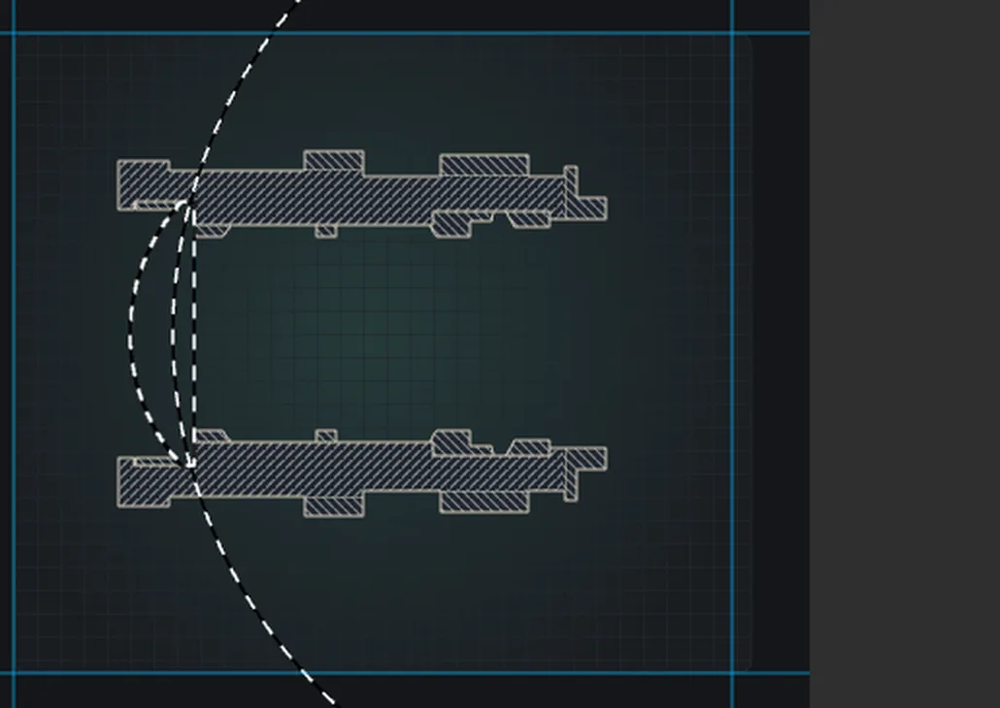

Zoom out to about **50%**, or further, so the big circles fit on screen. They hang off the canvas, which is fine.

1. Select `Retainers` and add three layers: `Glass`, then `Glass Shine` above it and `Glass Edges` above that. They sit under `Barrel Edges`, so the barrel outlines stay on top.
2. For the **Shine** gradient, set the Gradient tool to **Linear**, click **Advanced…**, and set both stops to white, the left at `55%` opacity and the right at `0%`.
3. Build the first element on `Glass`:
   - **Height:** with the **Rectangular Marquee**, drag from (736, 294) to (806, 566).
   - **Front surface:** a circle centred on (940, 430) with a radius of `200`. With the **Elliptical Marquee**, hold **Shift+Alt** and drag its bounding box, from (740, 230) to (1140, 630). Only the overlap stays selected.
   - **Back surface:** a circle centred on (1304, 430) with a radius of `520`. Hold **Alt** and drag from (784, −90) to (1824, 950) to cut away everything behind it.
4. Fill it with `#74CFC3`.
5. Select `Glass Shine` and drag the gradient from the element's top edge down to just above the axis.
6. Select `Glass Edges`, **Grow** by `1`, fill with `#E6E0D2`, **Shrink** by `2` and press [[Delete]].

## Build the other five elements

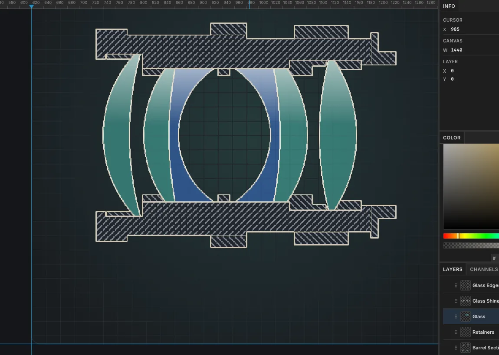

Repeat the recipe from the last step for each element. **Shift+Alt** keeps the inside of a circle and **Alt** removes it. The two halves of each cemented pair share one circle, so they fit together with no gap. Boxes run from y 318 to y 542 unless noted, and every circle is centred on the axis at y 430.

- **Element 2** (crown): box x 804–865. Keep inside a circle at x 998, radius 190. Remove inside one at x 1450, radius 600.
- **Element 3** (flint): box x 846–930. Keep inside x 1450, radius 600. Remove inside x 1001, radius 135.
- **Element 4** (flint): box x 956–1040. Remove inside x 885, radius 135. Keep inside x 436, radius 600.
- **Element 5** (crown): box x 1021–1086. Remove inside x 436, radius 600. Keep inside x 882, radius 200.
- **Element 6** (crown): box x 1098–1168, from y 304 to y 556. Keep inside x 1622, radius 520, and inside x 934, radius 230.

To draw a circle, drag from (centre − radius, 430 − radius) to (centre + radius, 430 + radius). Crown glass gets `#74CFC3`, and the denser **flint** glass gets the bluer `#4F7FE8`. Give each element its shine and edge before you start the next one, while its selection is still live.

When all six are done, set the `Glass` layer's opacity to **45%** so the grid shows through.

## Add the iris and trace the rays

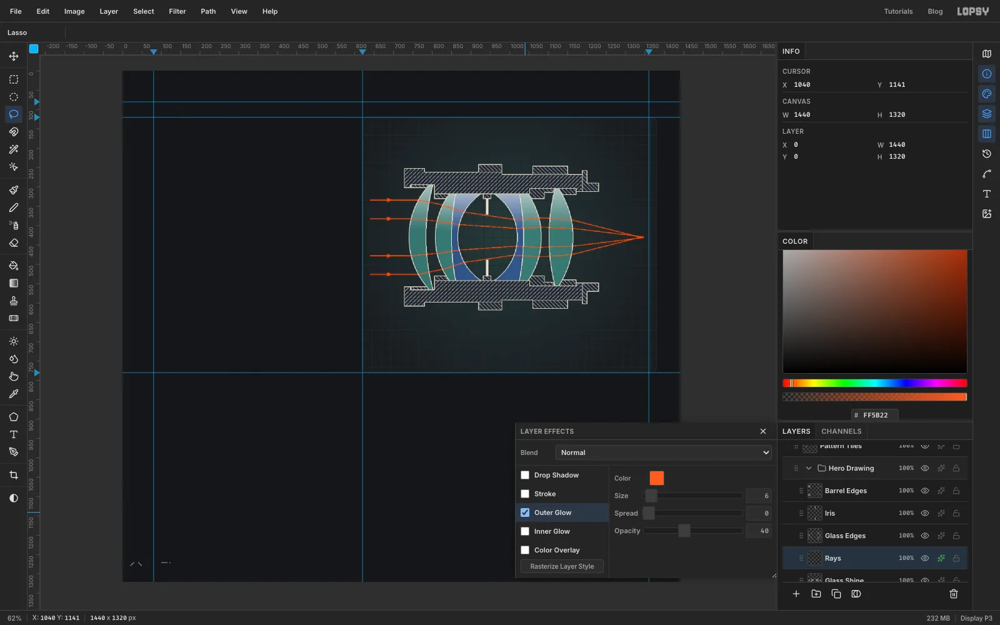

1. Select `Glass Edges` and add a layer named `Iris`. With the Rectangular Marquee, select x 939–945 from y 330 to y 372, **Shift-add** x 939–945 from y 488 to y 530, and fill both with `#E6E0D2`. The gap between them is the aperture.
2. Select `Glass Shine` and add a layer named `Rays`. Pick the **Brush** at **Size** `2`, **Hardness** `100`, colour `#FF5B22`.
3. Draw four rays that enter parallel to the axis at y 334, 382, 478 and 526. For each one, click at the panel's left edge, **Shift-click** where it meets each glass surface, and finish at the focus point on the axis, (1346, 430).

The top ray bends at (764, 334), (792, 340), (827, 347), (855, 356), (883, 365), (1012, 384), (1034, 382), (1076, 380), (1104, 381) and (1160, 385). The bottom ray mirrors it. Converging (positive) elements bend a ray toward the axis and the blue diverging ones bend it slightly away, so the path wobbles before it closes on the focus. The outermost rays should just graze the iris.

4. Lasso a small arrowhead on each incoming ray around x 690, **Shift-adding** each one, and fill.
5. Click the **fx** button on the `Rays` row and turn on **Outer Glow**: colour `#FF5B22`, **Size** `6`, **Spread** `0`, **Opacity** `40`.

## Add the centre line and image plane

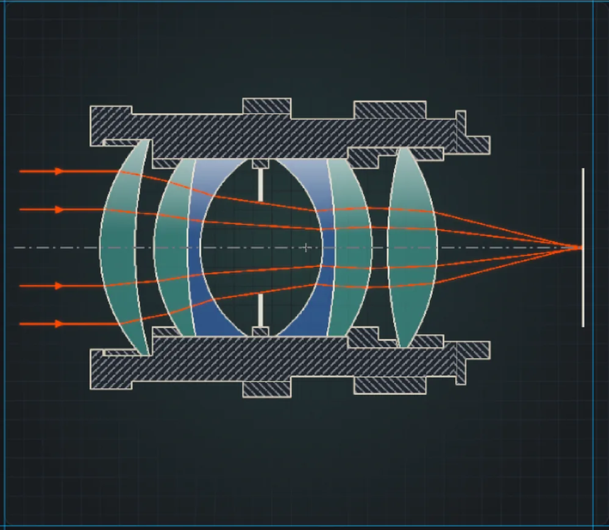

1. Select `Glass Edges` and add a layer named `Axis`. Select a 2 px tall strip from (632, 429) to (1349, 431), choose **Edit → Fill with Pattern…** and pick the dash-dot tile. In drafting, a dash-dot line marks a centre line.
2. Add a layer named `Image Plane` and fill a 3 px wide bar from (1346, 330) to (1349, 530). That's where the film or sensor sits.

## Draw leaders with a dark halo

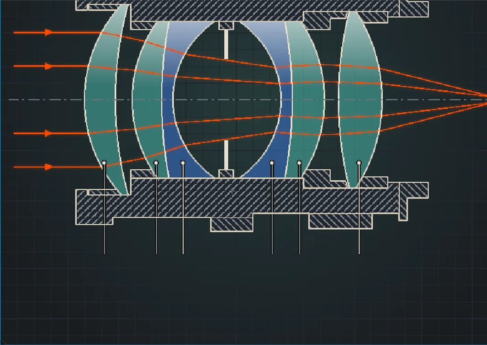

**Leaders** are the thin lines that connect a part to its number.

1. Add a layer named `Leaders`. Use the Pencil at **Size** `1` in `#BDB6A6`.
2. Pick a point inside each element at y 520, at x `768`, `842`, `880`, `1006`, `1046` and `1130`. Click there, then **Shift-click** straight below at y 649.
3. Brush a `6` px dot of `#E6E0D2` at the top of each leader. Drafters use a dot when a leader points at a surface, and an arrow when it points at an edge.
4. Turn on the **Stroke** effect for `Leaders`: colour `#1A1D21`, **Outside**, **Width** `2`. The thin dark halo keeps each leader readable where it crosses the hatching.

## Number the balloons

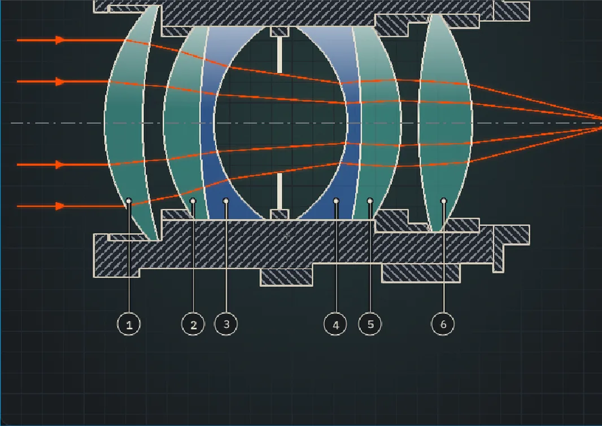

1. Add a layer named `Balloons`. Pick the **Shape** tool, set it to **Ellipse**, and set **Fill** to `#1A1D21` and **Stroke** to `#E6E0D2` at width `1`.
2. For each leader, press at (x, 662) and drag to (x + 13, 675). That gives identical 26 px circles centred 13 px below each leader's end, and their dark fill hides the end of the line.
3. Add an empty layer named `Type Anchor` above `Balloons`.
4. Select `Type Anchor`, pick the **Text** tool, and set **IBM Plex Mono Medium**, size `13`, **Align center**, colour `#E6E0D2`. For each balloon, click 8 px above its centre and type its number. Point text hangs from the click point, so that puts the digit in the middle of the circle.

> **Tip:** Always click an empty pixel layer, like `Type Anchor`, before you start a new piece of text. A Text-tool click within a few pixels of an existing text layer edits that text instead of starting a new one, and new text is created just above the selected layer.

Balloons 2–3 and 4–5 sit in pairs, matching the two cemented doublets.

## Add the dimension, legend and title block

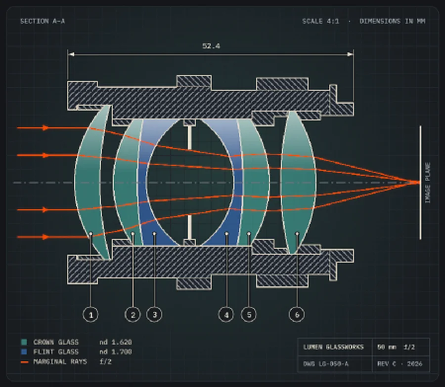

1. **Dimension.** On `Leaders`, **Shift-click** two extension lines up from the barrel's front and back ends: x 728 from y 248 to y 196, and x 1230 from y 286 to y 196. Draw a dimension line between them at y 204 and lasso a small arrowhead at each end. Then, from `Type Anchor`, add `52.4` in Plex Mono 13, centred just above the line.
2. **Captions.** Add `SECTION A–A` at the panel's top left and `SCALE 4:1 · DIMENSIONS IN MM` right-aligned at the top right, both in Plex Mono 12, `#A7ADB4`.
3. **Legend.** Add three lines in Plex Mono 12, `#CFC8B8`: `CROWN GLASS     nd 1.620`, `FLINT GLASS     nd 1.700` and `MARGINAL RAYS   f/2`. **nd** is the refractive index, and **marginal rays** are the outermost rays the aperture lets through. The monospace font lines the values up in a column.
4. **Swatches.** Add a `Legend Swatches` layer. Click the **Eyedropper** on a crown element, then fill a 10 × 10 px square beside the first line. Do the same with a flint element for the second line, so each swatch matches the glass as it actually reads. Fill a short orange bar for the rays.
5. **Title block.** Add a `Title Block` layer. With the Shape tool, set no fill and a 1 px `#4A4F57` stroke, then press at (1248, 734) and drag to (1364, 764). Pencil one line across the middle and one down at x 1262. Add four size-11 labels: `LUMEN GLASSWORKS`, `DWG LG-050-A`, `50 mm  f/2` and `REV C · 2026`.
6. **Rotated label.** Add `IMAGE PLANE` in Plex Mono 11. With the **Move** tool, click **Rotate 90° CCW** in the options bar, then use the arrow keys to nudge it just right of the image plane, centred on the axis.

## Make the logo mark

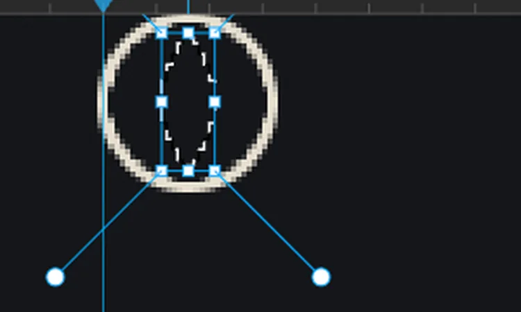

The logo reuses the lens trick at a tiny scale.

1. Select `Pattern Tiles`, which sits outside every group, and click **New Group**. Name it `Nav` and add a layer named `Logo Mark`.
2. **Ring.** Drag a circle from (79, 23) to (113, 57) and fill it with `#E6E0D2`. Then **Shrink** by `2` and press [[Delete]].
3. **Lens.** Drag a circle from (63, 21) to (101, 59), then **Shift+Alt-drag** one from (91, 21) to (129, 59). The overlap is a narrow lens. Fill it with orange.
4. Pencil a 1 px cream line through the middle, from x 74 to x 118. It reads as an optical axis.

## Build the nav bar

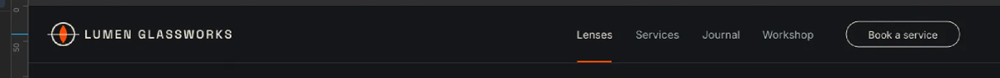

1. Add a `Nav Rule` layer and **Shift-click** a 1 px `#2A2E34` line across the page at y 80.
2. Add a `CTA Pill` layer. With the Shape tool, draw a **Rectangle** with **Corner Radius** `18`, no fill and a 1 px `#E6E0D2` stroke, pressing at (1280, 40) and dragging to (1360, 58).
3. Add an empty `Nav Type Anchor` layer and set this type from it:
   - `LUMEN GLASSWORKS` in **Space Grotesk SemiBold** 17, at x 126 beside the logo. Select it and set **Letter spacing** to `2.5` in the Text panel. Then select the anchor again and set **Letter spacing** back to `0`, because Text panel settings also become the defaults for your next text.
   - `Lenses`, `Services`, `Journal` and `Workshop` in **Inter Medium** 15, starting at x 820 and 34 px apart. Make the current page, `Lenses`, `#E6E0D2` and the others `#A7ADB4`.
   - `Book a service` in Inter SemiBold 14, centred in the pill.
4. On `Nav Rule`, fill a 2 px orange bar under `Lenses`, sitting on the rule. That marks the current page.

## Set the hero copy

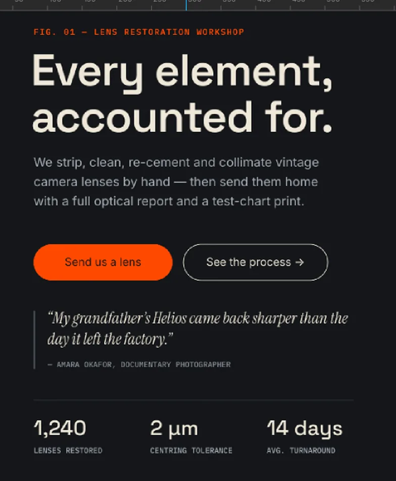

Make a `Hero Copy` group the same way as `Nav`. Add the shapes first, so the text you create afterwards sits on top of them.

1. Add a **Primary Button** layer: a Rectangle, radius `26`, fill `#FF5B22`, no stroke, pressed at (180, 486) and dragged to (280, 512).
2. Add a **Secondary Button** layer: the same, but with no fill and a 1 px cream stroke, pressed at (400, 486) and dragged to (504, 512).
3. Add a **Rules** layer. Shift-click a `#2A2E34` divider from (80, 684) to (540, 684), and fill a 2 px `#4A4F57` bar from y 556 to 640 at x 80 for the quote.
4. Add an empty `Copy Anchor` layer and set the text from it:
   - **Eyebrow** at (80, 146): `FIG. 01 — LENS RESTORATION WORKSHOP` in IBM Plex Mono Medium 12, orange, letter spacing `1.5`.
   - **Headline** at (76, 176): `Every element,` and `accounted for.` on two lines, Space Grotesk SemiBold 64, `#EEE8DA`, **Line height** `1.05`, **Letter spacing** `-1.5`. Big display type looks better slightly tightened.
   - **Body:** drag a text box from (80, 328) to (520, 440) so it wraps. Use Inter 18, `#A7ADB4`, line height `1.55`: "We strip, clean, re-cement and collimate vintage camera lenses by hand — then send them home with a full optical report and a test-chart print." To collimate means to align the elements precisely on the axis.
   - **Button labels**, Inter 16, **Align center**, clicked at the middle of each button: `Send us a lens` in SemiBold `#141619`, and `See the process →` in Medium cream.
   - **Quote:** a text box from (100, 552) to (540, 620) in **Instrument Serif Italic** 23, line height `1.3`: "“My grandfather’s Helios came back sharper than the day it left the factory.”" Under it, at (100, 626), add `— AMARA OKAFOR, DOCUMENTARY PHOTOGRAPHER` in Plex Mono 11, `#8A9097`.
   - **Stats** at y 704, x 80, 248 and 416: `1,240`, `2 µm` and `14 days` in Space Grotesk Medium 30. Under each, at y 750, add `LENSES RESTORED`, `CENTRING TOLERANCE` and `AVG. TURNAROUND` in Plex Mono 11, `#A7ADB4`.

## Nudge the column into line

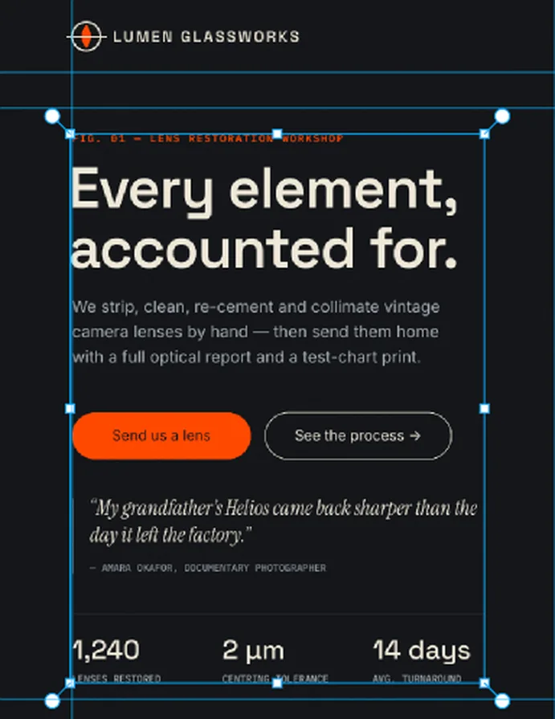

Now compare the eyebrow with `SECTION A–A` in the panel. The column sits 8 px lower, and when two tops are that close the gap looks like a mistake. Lining them up makes it look deliberate.

1. Collapse `Hero Copy` and click its row so the whole group is active.
2. With the **Move** tool, press the up arrow 8 times. Every button, text and rule moves together.

The stat labels now line up with the bottom row of the title block too.

## Duplicate the process cards

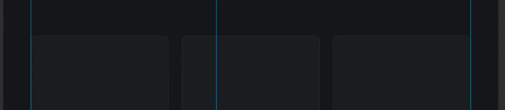

1. Make a `Process Cards` group and add a layer named `Card 1`.
2. Draw a Rectangle with radius `14`, fill `#1A1D21` and a 1 px `#2B2F35` stroke, pressing at (280, 1006) and dragging to (480, 1120).
3. Choose **Layer → Duplicate Layer**, rename the copy `Card 2`, click its row, and drag it 440 px to the right with the **Move** tool. Keep an eye on the Info panel's layer position.
4. Duplicate `Card 2` the same way to make `Card 3`.

Keep all three cards identical. In a static mockup, a "hover" highlight on one card just looks stuck.

## Draw the icons, the doublet at double size

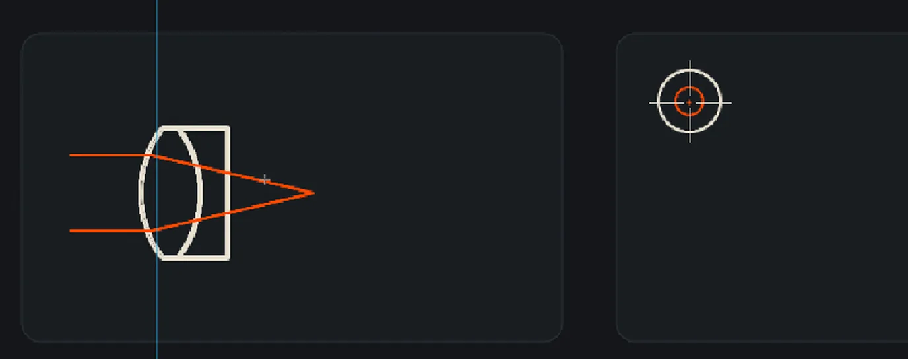

Each icon goes on its own layer above the cards, drawn in cream and orange lines.

1. **Icon Rings** (card 1): three ellipse rings, 48 × 14 px, stacked 16 px apart around (134, 942). For each, drag the outer ellipse, then **Alt-drag** a 44 × 10 px ellipse inside it to hollow it out, and fill. Make the middle ring orange and the others cream, and Pencil a thin grey axis through the stack.
2. **Icon Reticle** (card 3): around (1014, 942), make a cream ring 48 px across and 2 px thick with **Shrink**, and a thin orange ring 22 px across inside it. Pencil four crosshair arms with a gap in the middle, and brush an orange dot at the centre.
3. **Icon Doublet** (card 2): small icons are easier to draw big, so draw this one at twice its final size over the middle of card 2. Work around a centre point (cx, cy):
   - **Biconvex lens:** a box from (cx − 32, cy − 48) to (cx + 12, cy + 48). Shift+Alt a circle of radius 80 centred 80 px right of the box's left edge, then another centred 80 px left of its right edge.
   - **Plano-concave lens:** a box from (cx − 20, cy − 48) to (cx + 32, cy + 48). Alt-subtract the second circle above. The flat back is just the box edge.
   - Outline each lens with **Grow** `2`, **Fill**, **Shrink** `4` and **Delete**. Then brush two orange 3 px rays that run in parallel and converge to a point past the lens.

## Scale the doublet and place it

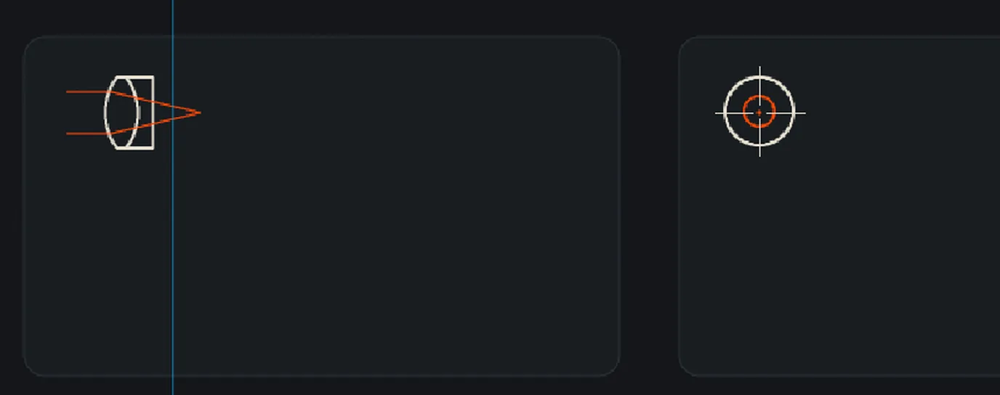

1. Draw a rectangle marquee just around the doublet drawing and switch to the **Move** tool.
2. Hold [[Cmd]] and drag the bottom-right handle halfway toward the top-left one. That scales it to 50% in proportion, and the 4 px outlines become 2 px, matching the other icons.
3. Press [[Cmd+D]], then drag the doublet so its left edge sits 28 px inside the card, on the text margin, and its middle is level with the other icons at y 942.

## Write the card text

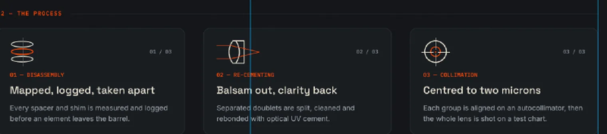

1. Add `Section Rule` and `Cards Anchor` layers above the icons.
2. From `Cards Anchor`, type `02 — THE PROCESS` at (80, 852) in Plex Mono 12, orange, letter spacing 1.5. On `Section Rule`, Shift-click a hairline from just past it to the right margin.
3. For each card, start 28 px in from its left edge:
   - a step label at y 984 in orange Plex Mono 12
   - a title at y 1009 in Space Grotesk Medium 22
   - a body text box from y 1052 to y 1106 in Inter 15, `#A7ADB4`, line height 1.5
   - a right-aligned `01 / 03` counter in `#8A9097` Plex Mono 11, ending 28 px from the card's right edge and centred on the icon's height
4. Use this copy:
   - `01 — DISASSEMBLY`, "Mapped, logged, taken apart", "Every spacer and shim is measured and logged before an element leaves the barrel."
   - `02 — RE-CEMENTING`, "Balsam out, clarity back", "Separated doublets are split, cleaned and rebonded with optical UV cement."
   - `03 — COLLIMATION`, "Centred to two microns", "Each group is aligned on an autocollimator, then the whole lens is shot on a test chart."

## Add a closing CTA and footer

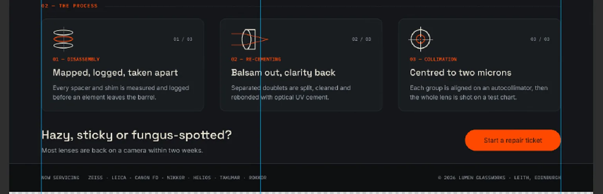

A landing page should end with an action, not just a footer. Make a `Footer` group above `Background`.

1. **Footer bar.** Add a `Footer Bar` layer. Fill from y 1248 to the bottom of the page with `#0E0F11`, and Shift-click a `#2A2E34` rule along its top.
2. **Button.** Add a `Closing Button` layer: an orange Rectangle with radius `26`, pressed at (1242, 1192) and dragged to (1360, 1218).
3. **Text.** Add an empty `Footer Anchor` layer and set the type from it, lowest and rightmost first, so no click lands on text you've already made:
   - `Start a repair ticket`, Inter SemiBold 16, `#141619`, centred on the button.
   - `Most lenses are back on a camera within two weeks.`, Inter 16, `#A7ADB4`, at (80, 1206).
   - `Hazy, sticky or fungus-spotted?`, Space Grotesk Medium 30, at (80, 1158).
   - In the footer, in Plex Mono 12 `#8A9097`: `NOW SERVICING   ZEISS · LEICA · CANON FD · NIKKOR · HELIOS · TAKUMAR · ROKKOR` on the left, and `© 2026 LUMEN GLASSWORKS · LEITH, EDINBURGH` right-aligned to the margin.

Look at the spacing. The row is jammed between the cards and the footer, and it doesn't read as its own section.

## Give the page more room

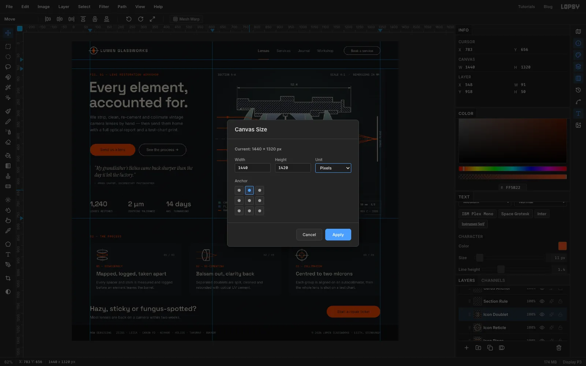

1. Choose **Image → Canvas Size…**.
2. Click the **top-centre** anchor so everything stays put and the new space is added at the bottom. Set **Height** to `1420` and click **Apply**.
3. The new strip is transparent, so select `Background` and **Edit → Fill** it with `#141619` again.

## Space out the closing row

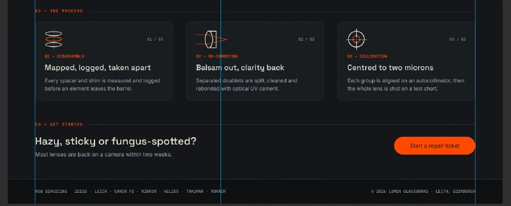

1. Click `Footer Bar`, then **Cmd-click** the two footer text layers. With the **Move** tool, press [[Shift]] and the down arrow 10 times to move them 100 px down to the bottom of the page.
2. Select the closing button, headline, subline and button label the same way, and move them down 60 px.
3. From `Footer Anchor`, add `03 — GET STARTED` at (80, 1182) in orange Plex Mono 12 with letter spacing 1.5. On a `Closing Rule` layer, Shift-click a hairline from just past it to the margin, matching section 02.

The row now has its own section heading and room to breathe. To finish, delete the `Pattern Tiles` layer; your patterns stay in the Pattern Fill dialog. You can also delete the empty anchor layers. Choose **File → Quick Export PNG** for the mockup and **File → Save Project** to keep every layer editable.
