In 1920 a young physicist in Petrograd, Lev Termen, built an instrument you
play without touching it. One hand moves near an upright antenna to change
the pitch. The other hovers over a loop to change the volume. The West
called him **Léon Theremin**, and the instrument took his name.

That makes him a good cover star in the style of his own time. Soviet
constructivists like Gustav Klutsis and Alexander Rodchenko built posters
from **photomontage**: a cut-out photo, flat geometric shapes, steep
diagonals and heavy sans-serif type. Two-colour printing, black plus one
flat colour, was common, and this cover borrows that look for the photo.

In this tutorial you'll make the cover of an imaginary zine, *Theremin
Dispatch*, issue 11. The page is 1100 × 1700 px, the proportions of an
11 × 17 inch tabloid sheet. You'll start from a
real photo of Theremin playing, cut him out with the **Lasso**, and print him
as two plates. Around him you'll build a ray burst, radio waves and a
cabinet, then finish with two slanted bands of type.

You'll need the photo **Termen playing his invention.jpg** from Wikimedia
Commons (commons.wikimedia.org/wiki/File:Termen_playing_his_invention.jpg).
It's an old press photo that Commons marks as public domain, so you can use
it freely. It's small (430 × 595 px), but the threshold and halftone steps
hide that.

The tools you'll use along the way:

- **Filter → Sunburst** through a **Lasso** selection
- the **Elliptical Marquee**'s exact-size dialog, plus [[Alt]]-drag to cut a ring and [[Shift]]-drag to add to a selection
- **Paste**, **Free Transform** scaling and the **Move** tool's rotate handle
- **Desaturate**, **Gaussian Blur**, **Threshold**, **Brightness/Contrast** and **Halftone**
- the **Magic Wand** with **Contiguous** off, and **Select → Grow**
- the layer effects **Color Overlay** and **Stroke**
- **Russo One** and **PT Sans Narrow** text, rotated while it's still live text
- **guides**, the **grid**, and layer **groups**

The palette is paper, ink and three colours:

- Paper `#ECE7DA`, photo white `#F7F5ED`
- Ink black `#18161A`
- Vermilion `#D65636`
- Ray yellow `#E9B940`
- Ultramarine `#2A3FA2`
- Grain grey `#F4F4F4` (only for the texture layer)

> **Tip:** On a wide-gamut (Display P3) screen, Lopsy reads a typed hex code as a P3 colour. The codes above are P3 values. They export close to sRGB vermilion `#E84A27`, yellow `#F2B705` and ultramarine `#2340A8`. On a standard sRGB screen, type those three instead.

> **Note:** The Layers panel in most screenshots comes from the finished file, so it lists layers you haven't made yet. Follow the step text, not the panel. Shortcuts are written for a Mac; on Windows use [[Ctrl]] wherever it says [[Cmd]].

## Create the page

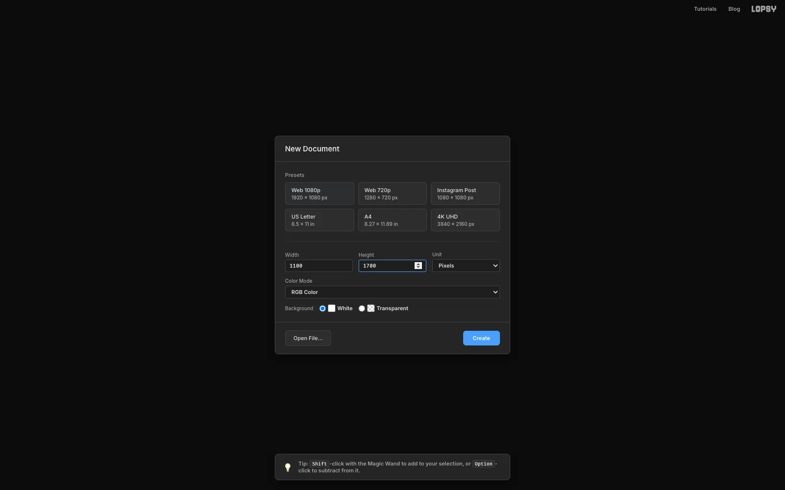

Choose **File → New**. Keep the units on **Pixels**, type **1100** for the
width and **1700** for the height, and click **Create**. That's a tall zine
page with the proportions of a tabloid sheet.

## Paint the paper and add guides

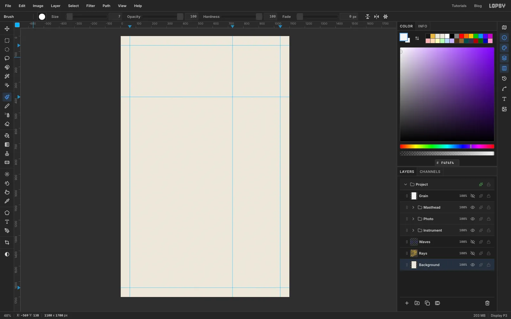

Click the *Background* row, set the foreground colour to paper `#ECE7DA`
and choose **Edit → Fill**. Then choose **Filter → Add Noise**, pick
**Mono** and **Gaussian**, set **Amount** to **8** and click **Apply**. It
adds a faint newsprint speckle.

Now add guides by clicking the rulers. A click on the top ruler makes a
vertical guide, and a click on the left ruler makes a horizontal one.

- Margins: vertical guides at **60** and **1040**, horizontal guides at **60** and **1640**.
- The antenna tip: a vertical guide at **729** and a horizontal guide at **396**.

Everything radiates from the point where the last two guides cross.

## Select the area above the bands

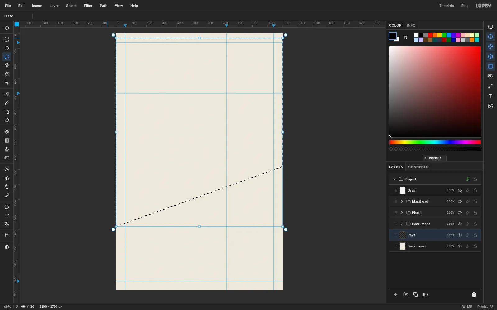

Click **Add Layer** and name the new layer *Rays*. The rays should stop
under the slanted bands you'll add later, so select only the area above
them.

Pick the **Lasso**. Start just off the left edge of the canvas near the
top, drag across past the right edge, go down the right side to about
**860**, and then come back diagonally to the left edge at about **1300**.
Close the shape where you started. The bands will cover that slanted edge,
so it doesn't have to be precise.

> **Tip:** Start the Lasso on the grey pasteboard, not on a ruler. A press that starts on a ruler drags out a guide instead of a selection.

## Burst the rays from the antenna point

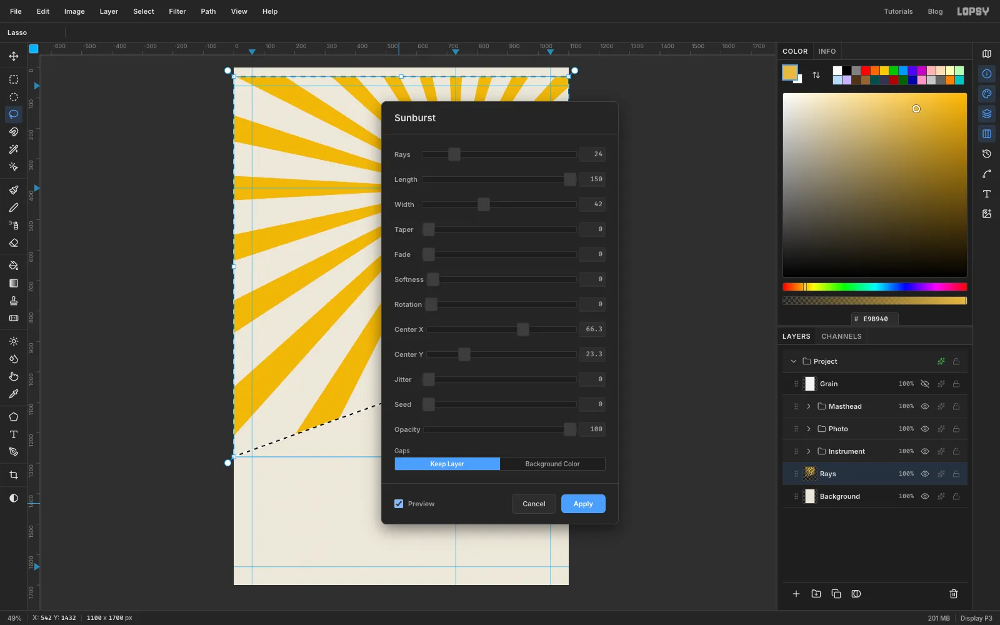

Set the foreground to ray yellow `#E9B940` and choose **Filter →
Sunburst**. Set:

- **Rays** 24, **Length** 150, **Width** 42, **Taper** 0
- **Center X** 66.3 and **Center Y** 23.3

The centre values are percentages of the page, and they put the burst
exactly on the crossed guides (729 ÷ 1100 and 396 ÷ 1700). Leave **Gaps** on
**Keep Layer** and click **Apply**.

## Check the burst

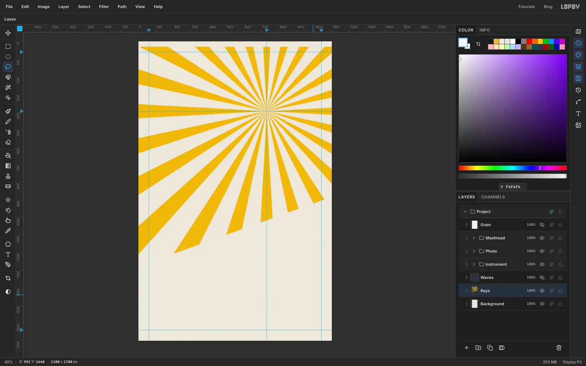

Press [[Cmd+D]] to deselect. The rays bleed off the top and right edges and
end in a straight slant at the bottom, which the bands will hide.

Klutsis's electrification posters use radiating lines like these. Here they
stand for the electric field round the antenna.

## Cut a ring for the radio waves

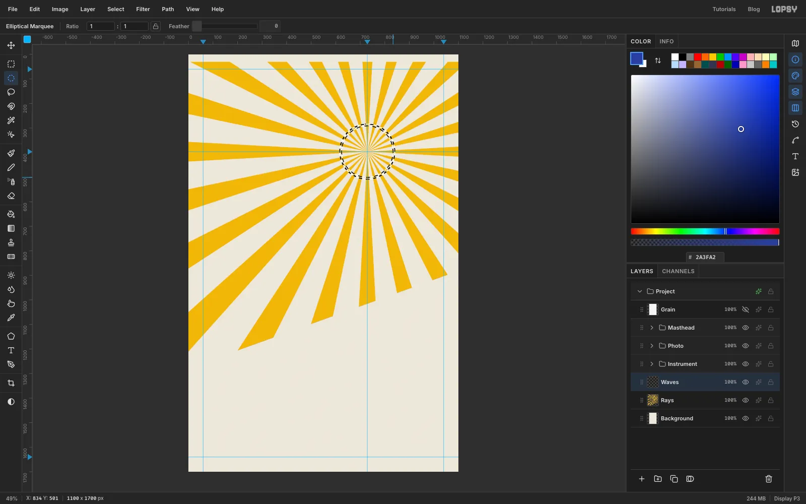

Add a layer called *Waves* and set the foreground to ultramarine `#2A3FA2`.

Pick the **Elliptical Marquee** and click once on the canvas without
dragging. The **Elliptical Selection** dialog opens. Enter **From** 617, 284
and **To** 841, 508, and click **Select**. That gives a 224 px circle
centred on the antenna point.

Now hold [[Alt]] and drag a slightly smaller circle inside it, from about
(624, 291) to (834, 501), so it sits 7 px in from the edge all round. The
pointer position is shown at the bottom left of the window as you drag.
[[Alt]] subtracts from the selection, so a thin ring is left. Choose **Edit →
Fill**.

Make two more rings the same way, each one thicker than the last:

- From 651, 318 to 807, 474, cut about **10 px** in
- From 687, 354 to 771, 438, cut about **14 px** in

## Keep only the side arcs

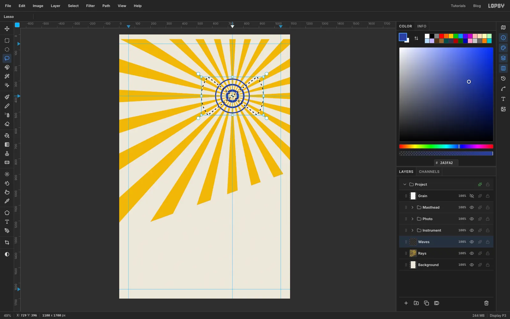

Pick the **Lasso**. Draw a wedge that starts at the antenna point and opens
to the left, about 40° above and below horizontal, and reaches past the
biggest ring. Then hold [[Shift]] and draw the mirror wedge on the right.
[[Shift]] adds the second wedge to the first.

Choose **Select → Inverse** and press [[Delete]]. Only the arcs inside the
two wedges are left.

## Look at the waves

Deselect. The arcs get thinner as they move outward, like a signal fading.
Paired arcs on both sides read as a broadcasting mast. Arcs on one side
only look like a Wi-Fi icon.

## Draw the cabinet

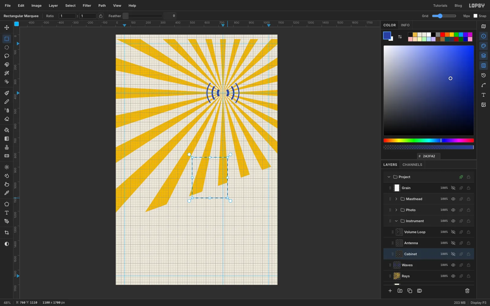

Click **New Group** in the Layers panel and name the group *Instrument*.
Then click **Add Layer** with the group row selected, so the new layer goes
inside it, and name it *Cabinet*.

Turn on **View → Show Grid** to help you line up the box. With the
**Rectangular Marquee**, drag from **(520, 834)** to **(760, 1110)** and
fill it with ink black `#18161A`. The bottom of the box will go under the
band, so it can run long.

Add the details on the same layer:

- Two thin vermilion `#D65636` stripes right across the box, each 10 px tall and 10 px apart, starting about 30 px below its top edge. Drag a marquee for each and fill it.
- A grille: pick the **Pencil** at **Size 5** and set the foreground to paper `#ECE7DA`. Click about 26 px in from the box's left edge, then hold [[Shift]] and click about 150 px further right, to draw a straight line. Draw three of these lines 16 px apart, starting about 90 px below the top of the box. Keep the grille on the left, clear of the antenna, which rises from the right-hand end of the box.

Turn the grid off again when you're done.

## Add the antenna and volume loop

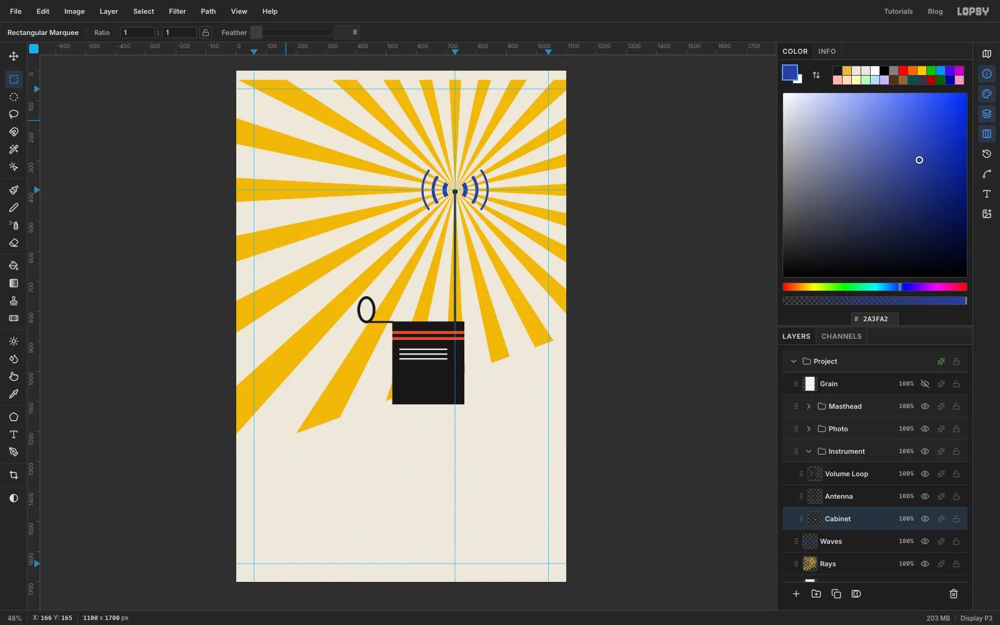

Add a layer called *Antenna* inside the group. Pick the **Brush** with
**Size 8** and **Hardness 100**. Click at **(729, 400)**, then hold
[[Shift]] and click at **(729, 836)**, so the rod runs straight up the
guide into the cabinet. Set the size to 18 and click once on the tip for a
small ball.

Add a layer called *Volume Loop*. Click with the **Elliptical Marquee** to
open the dialog again and enter **From** 404, 750 and **To** 464, 840. That
gives a tall oval. [[Alt]]-drag a smaller oval about 9 px inside it, fill
it with ink, and deselect. Then use the Brush at **Size 7** to
[[Shift]]-click a rod from **(434, 836)** to **(522, 836)**. The rod runs
from the bottom of the loop into the cabinet. A real theremin's volume loop lies flat, but drawn
flat it looks like a frying pan; upright, it reads as a loop at a glance.

## Paste the photo

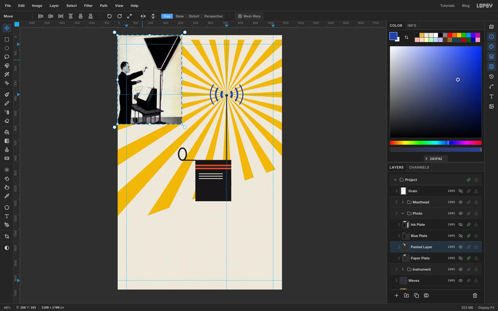

Click the *Project* row at the top of the Layers panel, click **New Group**
and name the group *Photo*. Open the photo in your browser or an image
viewer, copy it, and press [[Cmd+V]] in Lopsy. The photo arrives at its
real size in the top-left corner, inside a transform box, and the **Move**
tool is selected.

## Scale the photo up three times

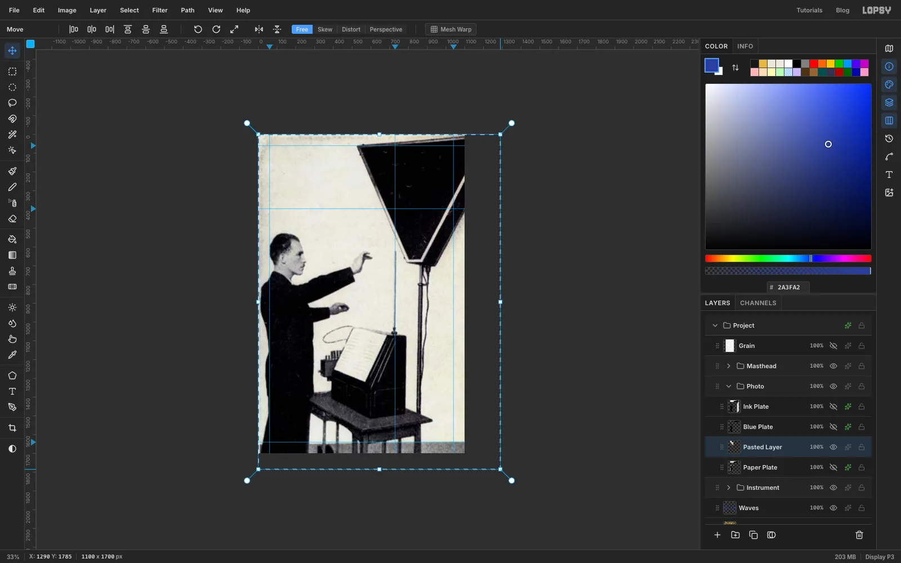

Press [[Cmd+-]] to zoom out so you can reach the corner. Hold [[Cmd]] (to
keep the proportions) and drag the bottom-right handle down and right until
the pointer readout at the bottom left of the window shows about **X 1290,
Y 1785**. That's three times the original size. Press [[Cmd+D]] to apply the
transform.

Press [[Cmd+0]] to fit the page again. With the **Move** tool, drag the
photo straight up. Watch the Y readout and move it **225 px**, so the top of
his head sits about 300 px from the top of the page and his raised hand
stops just short of the waves.

## Trace around Theremin

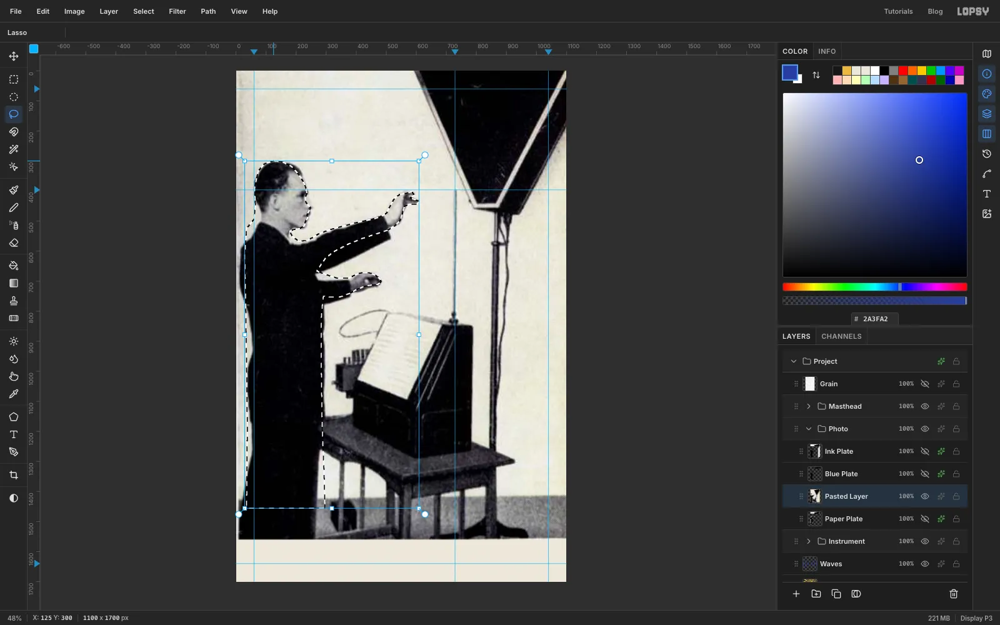

Pick the **Lasso** and trace slowly around him:

1. Start at the back of his neck and go over the top of his hair.
2. Come down his forehead, nose and chin.
3. Go out along the top of his raised arm, round the fingers, and back under the arm.
4. Go round the lower hand the same way.
5. Go down the front of his body.
6. Cross straight over below his waist and come back up his back.

Leave out the triangle loudspeaker, the table and the instrument. You've
already drawn your own instrument.

Take your time round the face and fingers. A clean edge here is what makes
the cutout look like a cutout and not a smudge.

## Cut him out and remove the colour

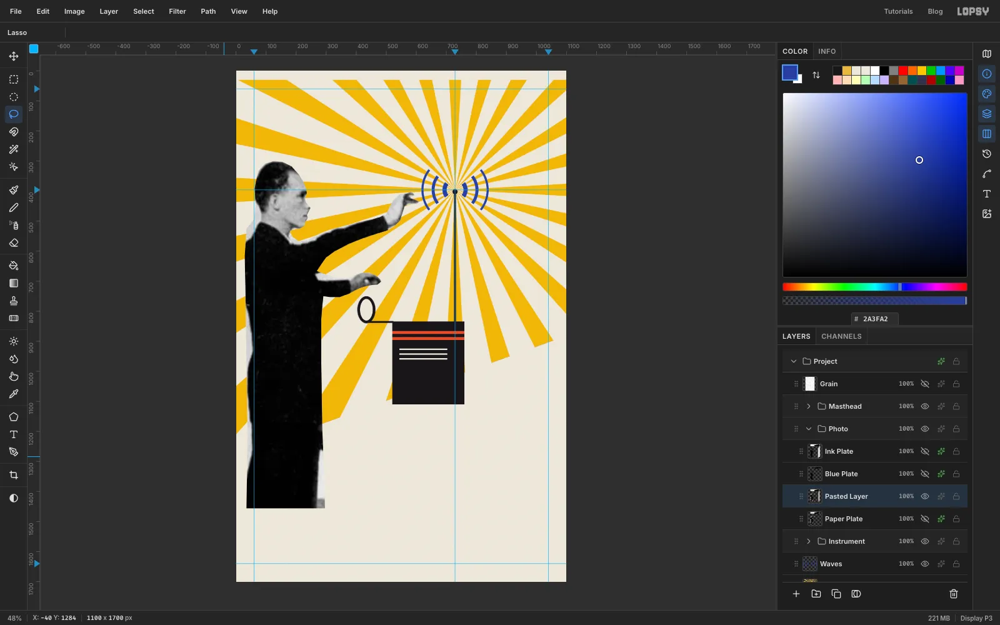

Choose **Select → Inverse**, press [[Delete]] and deselect. Then choose
**Filter → Desaturate**. Double-click the layer name and rename it *Paper
Plate*.

Click **Duplicate Layer** twice. Rename the copies: the middle one is *Blue
Plate* and the top one is *Ink Plate*. You now have three identical grey
cutouts stacked on top of each other.

## Make the black plate

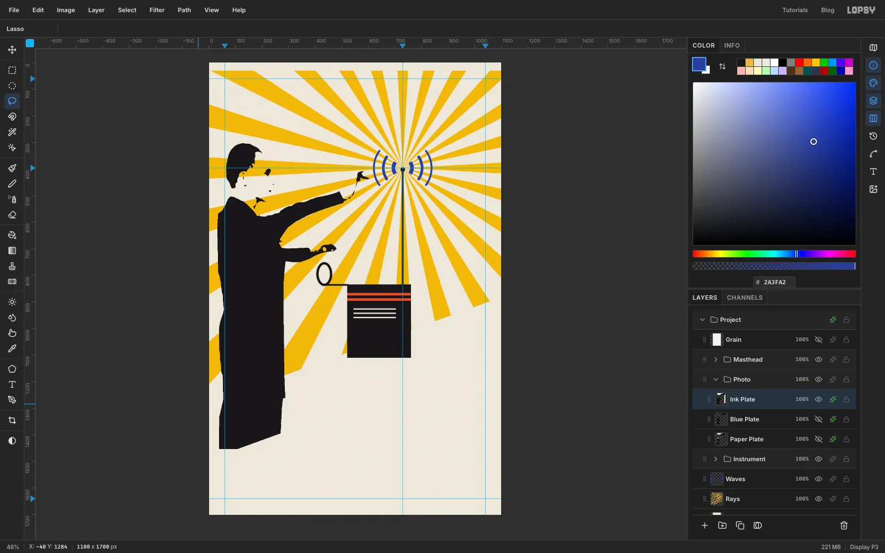

Click the *Ink Plate* row. Choose **Filter → Gaussian Blur**, set
**Radius** to **1.5** and apply it. The blur smooths the edges of the
enlarged photo before the next step. Then choose **Filter → Threshold**,
set **Level** to **110** and apply it. His suit and hair go solid black,
and the face keeps the eye, the nostril and the line of the mouth.

The light parts are now solid white, not transparent. Pick the **Magic
Wand**, untick **Contiguous**, click on his white cheek and press
[[Delete]]. Every white area on the layer goes at once. Deselect, open the
layer's effects drawer, and switch on **Color Overlay** with ink black
`#18161A`. The overlay turns the threshold's pure black into the same soft
ink black as the rest of the cover.

## Add the blue halftone plate

Click the *Blue Plate* row. Choose **Filter → Brightness/Contrast** with
**Brightness −10** and **Contrast 45**, and apply. That gives the mid-tones
more weight. Then choose **Filter → Halftone** with **Dot Size 9**,
**Angle 15** and **Softness 0.5**. Switch on **Color Overlay** in
ultramarine `#2A3FA2`.

With the **Move** tool, nudge the plate **7 px right** and **5 px down**
with the arrow keys. On a real press the two plates never line up exactly.

Now trim both plates to the silhouette:

1. Click the *Paper Plate* row and pick the **Magic Wand** (Contiguous still off).
2. Click an empty part of the page, so everything outside Theremin is selected.
3. Choose **Select → Grow**, enter **3** and apply.
4. Click the *Ink Plate* row and press [[Delete]].
5. Click the *Blue Plate* row and press [[Delete]].

The selection stays when you click other rows. This removes the thin dark
outline the blur and threshold leave round the edge, plus any loose dots.

## Give him a cut-out border

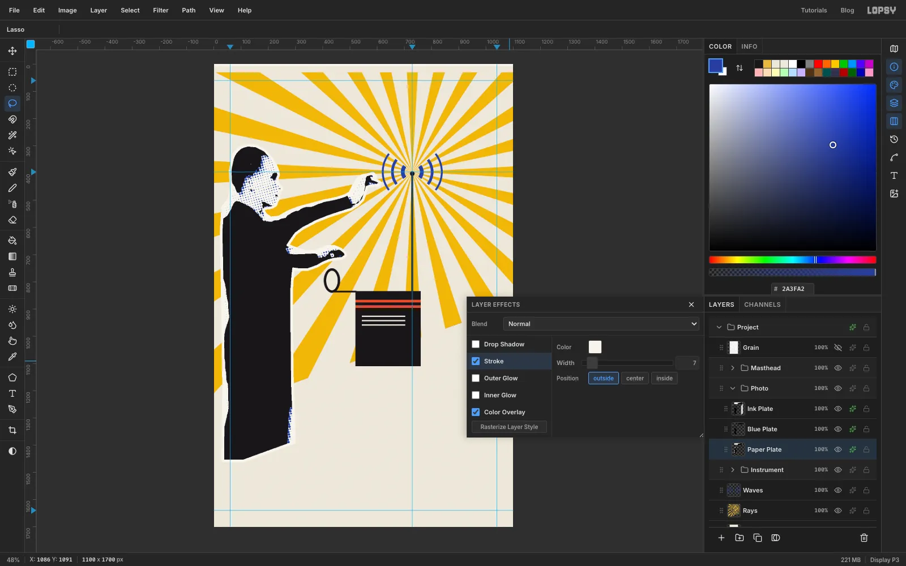

Deselect and click the *Paper Plate* row. Open the effects drawer and
switch on **Color Overlay** with photo white `#F7F5ED`, a little brighter
than the page. Then switch on **Stroke**: the same white, **Width 7**,
position **Outside**.

He now looks like a photo cut out with scissors and glued down, which is
exactly what photomontage was.

## Draw the vermilion band

Click the *Project* row and click **New Group**. Name the group *Masthead*
and add a layer inside it called *Red Band*.

With the **Lasso**, draw a long slanted band that rises **20°** from left to
right:

1. Start off the left edge at about **y 1273**.
2. Go off the right edge at about **y 837**.
3. Go down **250 px** on the right.
4. Come back off the left edge at about **y 1523**.

Fill it with vermilion `#D65636`.

> **Tip:** You could draw a straight rectangle and rotate it 20° instead. Don't then stretch it with the side handles: scaling a box that's already rotated currently makes it drift sideways (issue #1138). Drawing the slant directly avoids that.

## Hide his legs behind the band

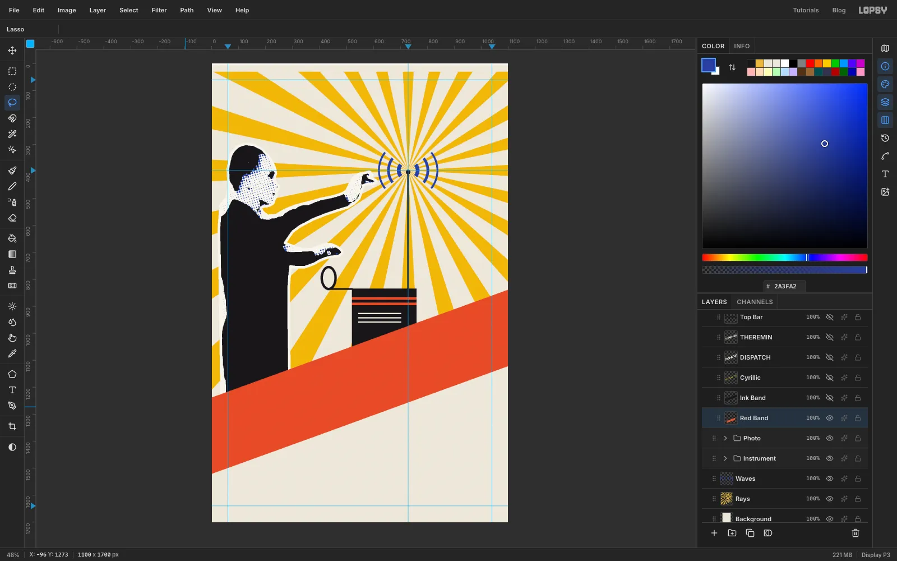

Deselect. The band covers the bottom of the cabinet and Theremin from the
waist down. If any of his legs shows below the band, Lasso the area under
the band's lower edge. Then click each of the three plate rows in turn and
press [[Delete]].

## Set and rotate the headline

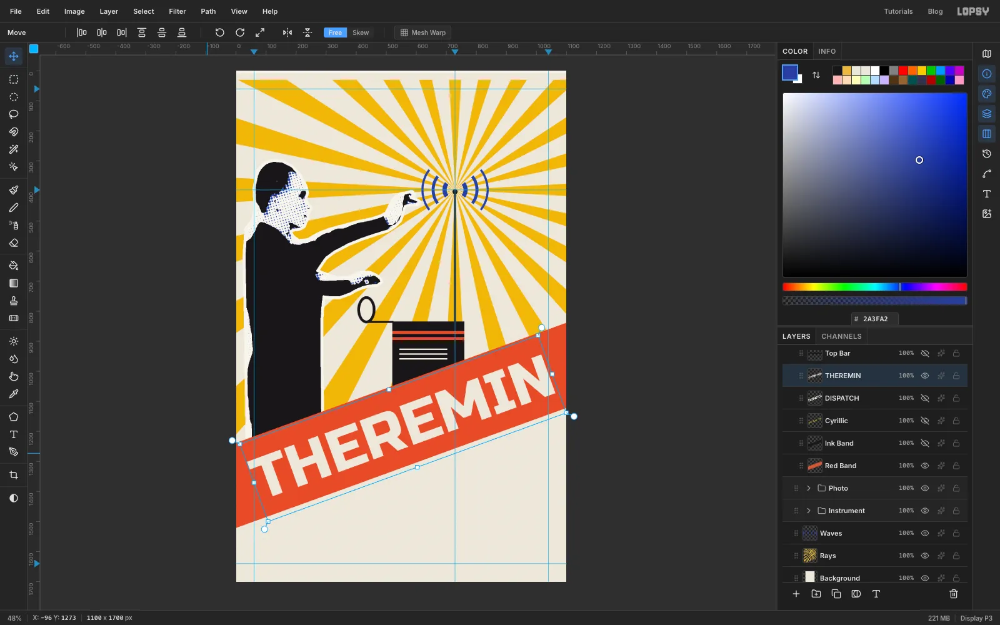

Click the *Red Band* row first. If a text layer is selected when you change
the text settings, Lopsy restyles that layer instead.

Pick the **Text** tool. Choose **Russo One** in the font menu, set **Size**
to **196** and the foreground to paper `#ECE7DA`. Click in the empty area
near the top of the page, type **THEREMIN** and press [[Tab]] to finish.

Switch to the **Move** tool. Drag the round rotate handle off the top-right
corner about **20° anticlockwise**, until the words match the slope of the
band. Press [[Cmd+D]]. Then drag the text down onto the band so it sits in
the middle, with the same red margin above and below the capitals. The
middle of the band is at about **(550, 1180)**.

## Add the black band and DISPATCH

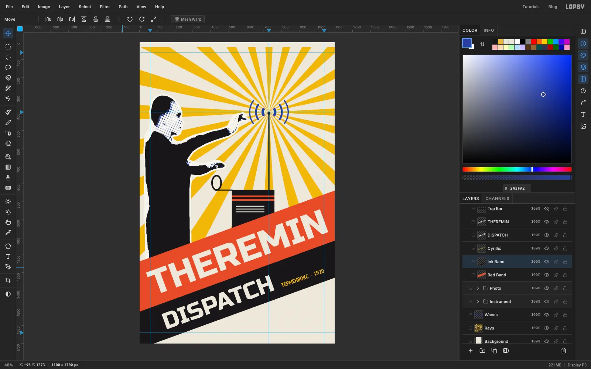

Click *Red Band* and add a layer called *Ink Band*. Lasso a second slanted
band directly below the red one, touching it, about **200 px** thick:

1. Start off the left edge at about **y 1520**, along the red band's lower edge.
2. Go off the right edge at about **y 1085**.
3. Go down **200 px** on the right.
4. Come back off the left edge at about **y 1720**, below the page.

Fill it with ink black. Its lower edge should leave through the bottom edge
of the page, not exactly at the corner. A band that ends right in the
corner looks like a mistake.

With *Ink Band* selected, make a second text layer: **Russo One**, **Size
130**, paper colour, **DISPATCH**. Rotate it 20° the same way. Move it into
the middle of the black band, then slide it along the slant until its D
sits directly under the T of THEREMIN, measured across the band.

Then click *Ink Band* again and make one more text layer: **PT Sans
Narrow**, weight **Bold**, **Size 32**, ray yellow `#E9B940`. The text is
**ТЕРМЕНВОКС · 1920**, the Russian name of the instrument and the year it was
invented. If you don't have a Cyrillic keyboard, copy the text and paste it
with [[Cmd+V]]. Rotate it 20°, rest it on the same baseline as DISPATCH, at
least 40 px after the H, and end it at the right margin guide.

## Add the top bar

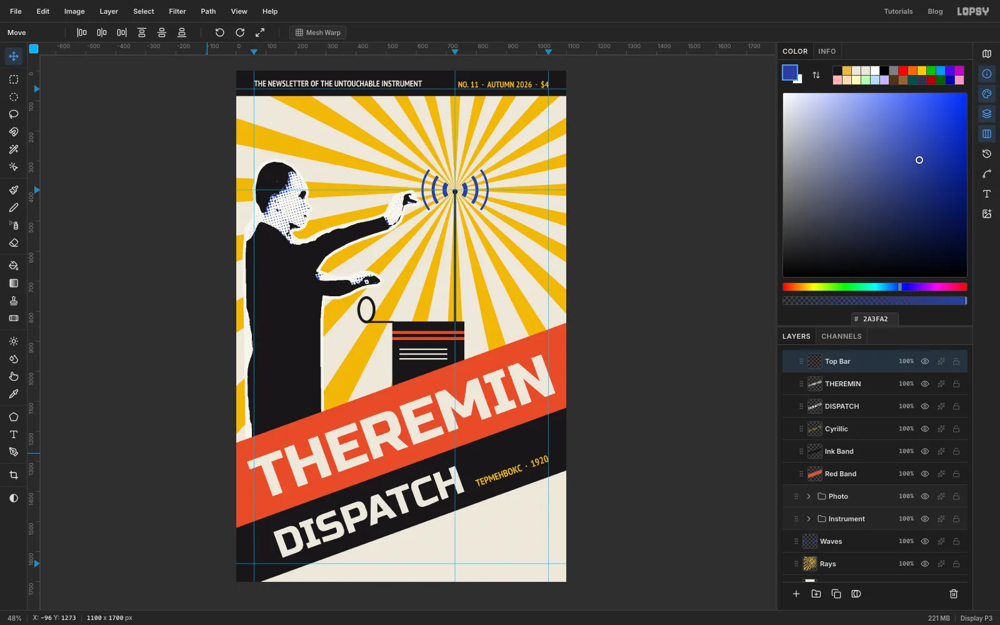

Add a layer called *Top Bar*. Drag a rectangular marquee across the full
width from the top edge down to **84** and fill it with ink black.

Set two lines of **PT Sans Narrow Bold** at **Size 28**. Remember to click
the *Top Bar* row before each one.

- **THE NEWSLETTER OF THE UNTOUCHABLE INSTRUMENT** in paper colour, starting on the 60 px margin.
- **NO. 11 · AUTUMN 2026 · $4** in ray yellow `#E9B940`, ending on the 1040 margin. The colour makes the issue details stand out from the tagline. (If you already set it in cream, a **Color Overlay** in yellow does the same job.)

Move both so their capitals sit in the vertical centre of the bar.

## Add the coverlines and badge

Click the *Top Bar* row first, so you don't restyle the issue line. Then
make a three-line text layer in **PT Sans Narrow Bold**, **Size 30**, ink
black. Press [[Enter]] between the lines:

- PLAY WITHOUT TOUCHING
- BUILD A 9-VOLT ETHERPHONE
- ROCKMORE'S VIBRATO, DECODED

The **Text** panel's **Line height** should be **1.4**. Move the block so
its right edge sits on the 1040 guide and its top is at least 40 px below
the black band.

On a new *Bullets* layer, add a **14 px** square to the left of each line,
centred on the capitals. Click once with the **Rectangular Marquee** to open
its size dialog, and enter a box 14 px wide and tall, 10 px left of the
text. Fill each square with vermilion. Snap to Guides can stretch a small
square that's near a guide, so turn off **View → Snap to Guides** while you
draw them.

For the badge, add a layer called *Badge*. Click once with the
**Elliptical Marquee** and enter **From** 914, 172 and **To** 1040, 298 for a
126 px circle whose right edge sits on the margin. Fill it with
ultramarine.

Add **FREE** in **Russo One 30** and paper colour. Then click the *Badge* row
again, so you don't restyle FREE, and add **SCHEMATIC** in **PT Sans Narrow
Bold 21**. Move the two words by eye until they're stacked in the middle of
the circle, with FREE just above the centre and SCHEMATIC just below.

If you built the badge somewhere else first, click the *Badge* row and
[[Shift]]-click the two text rows, so all three layers are selected, then
drag them together into the top-right corner. Moving them as one keeps the
words centred.

## Print it with grain

Click the *Project* row and click **Add Layer**. The new layer goes on top
of everything. Name it *Grain*. Set the foreground to grain grey `#F4F4F4` and choose
**Edit → Fill**, then
choose **Filter → Add Noise** with **Mono**, **Gaussian** and **Amount
45**. Open its effects drawer and set the **Blend** mode to **Multiply**.

The noise darkens every flat colour by a different few levels, pixel by
pixel. The paper, the rays and the bands now look printed rather than
digital. Save the project with **File → Save Project** and export the cover
with **File → Quick Export PNG**.
