Paper-cut illustration builds depth from flat shapes. Each layer of leaves
is a single colour, and a soft drop shadow lifts it off the layer behind.
In this tutorial you'll use that trick to make a menu for **Xocolatl
Jungle**, an imaginary cacao bar and tropical kitchen. The card is
1200 × 1700 px.

Every leaf is a **Lasso** fill, cut with more lasso shapes and the Delete
key. The flowers and cacao pods add gradients and brush details. The menu
itself is three blocks of **area text** per section (names, descriptions,
prices) so the columns line up exactly.

The palette:

- Jungle greens: `#061A13`, `#0B3727`, `#11513A`, `#17603F`, `#2A8452` and `#4FAA5E`
- Paper `#F6EAD2`, terracotta rule `#C8553D`
- Cacao brown `#3B1A0E`, mango `#F2A531`, coral `#C24A26`, leaf-green type `#2A8452`
- Hibiscus to crimson `#FF5A5F` → `#A0103A`, cacao pods `#FFC04A` → `#7E2610`

## Paint the jungle backdrop

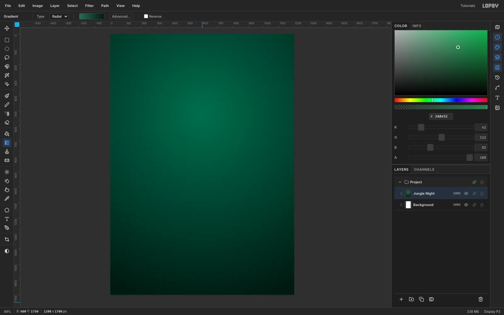

Choose **File → New**, set the unit to **Pixels**, and create a
**1200 × 1700** document with a white background. Rename *Layer 1* to
**Jungle Night**.

Pick the **Gradient** tool and set **Type** to **Radial**. Click
**Advanced…** and set three stops: `#2A6B4F` at 0%, `#123F2F` at 55% and
`#061A13` at 100%. Start the drag on the centre line, about a third of the
way down, and drag straight down to just past the bottom edge. The glow
sits behind where the title will go, and the corners fall away into
darkness.

## Add guides and a grid

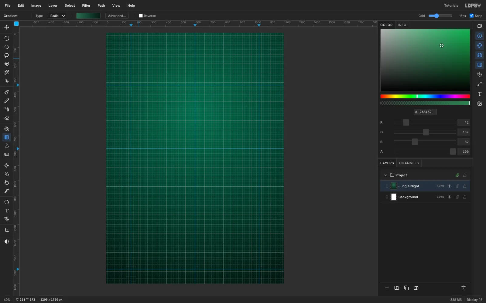

Guides mark the arch's sides, its centre line, the top of the dome, where
the dome meets the straight sides, and the bottom. The ruler shows a
readout as you hover, so you can place them by eye:

- **Top ruler:** [[Cmd]]-click the middle for a guide exactly on the centre
  line. Then click about **168** px in from each side (168 and 1032).
- **Left ruler:** click at about **354** (the top of the dome), **786**
  (where the dome meets the straight sides) and **1602** (the bottom).

Turn on **View → Show Grid**. Snap switches on with it, so your marquees
land on the 16 px lattice.

> **Tip:** Guides are reference lines only. Marquees snap to the grid, not
> to guides, so these guides sit on grid lines.

## Draw the dome of the arch

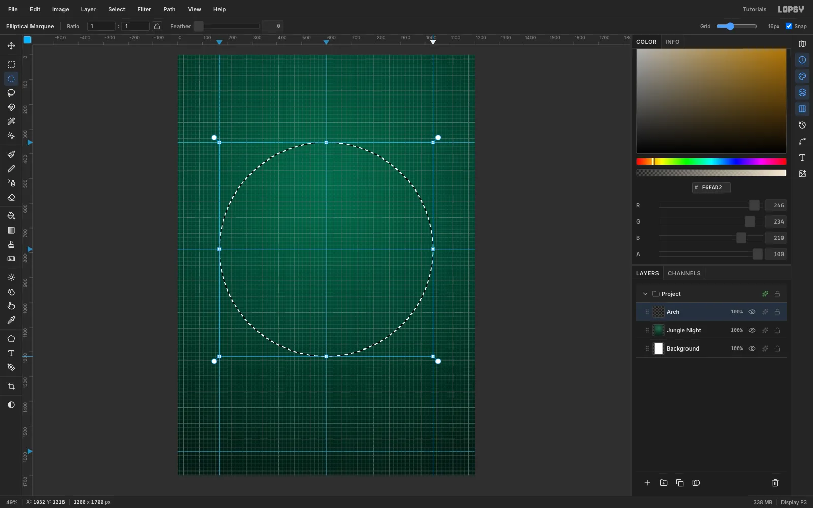

Add a layer named **Arch**. Set the foreground colour to `#F6EAD2`. With
the **Elliptical Marquee**, [[Cmd]]-drag a circle from where the left guide
meets the dome-top guide, until it reaches the right guide. That's 864 px
wide, so its centre sits exactly on the middle horizontal guide. Choose
**Edit → Fill**.

> **Tip:** To type the circle instead, click once with the Elliptical
> Marquee while nothing is selected and enter **From** 168, 354 **To**
> 1032, 1218.

## Add the straight sides

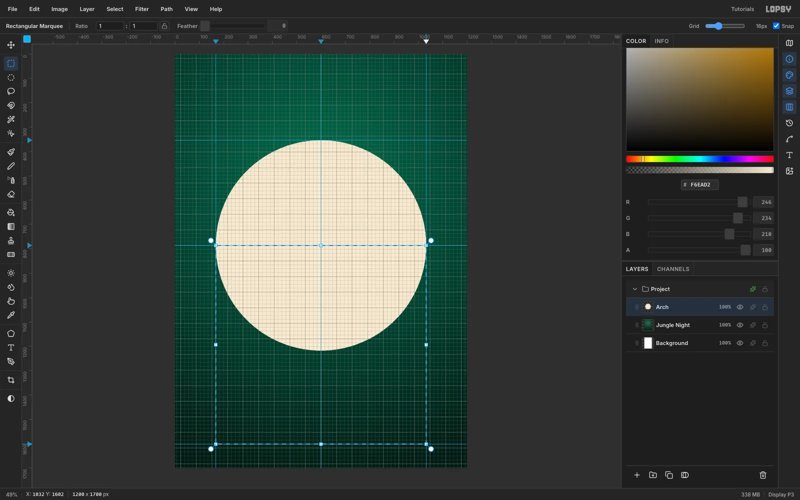

Switch to the **Rectangular Marquee** and drag from where the left guide
crosses the middle horizontal guide down to the bottom-right guide
crossing. Choose **Edit → Fill** again. The rectangle's top edge
cuts through the circle's widest point, so the two shapes merge into one
seamless arched window. Press [[Cmd+D]] to deselect.

Untick **Snap** in the options bar before you continue. The organic shapes
that follow should land exactly where you draw them.

## Give the paper some grain

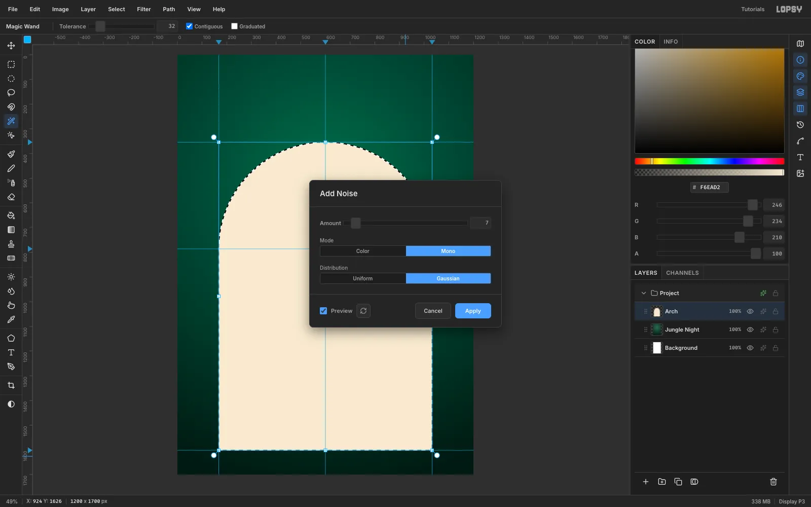

Click inside the arch with the **Magic Wand** to select it. Choose
**Filter → Add Noise**, pick **Mono** and **Gaussian**, set **Amount** to
**7**, and click **Apply**. The grain is faint, but it stops the cream
looking like flat plastic.

## Draw an inset rule

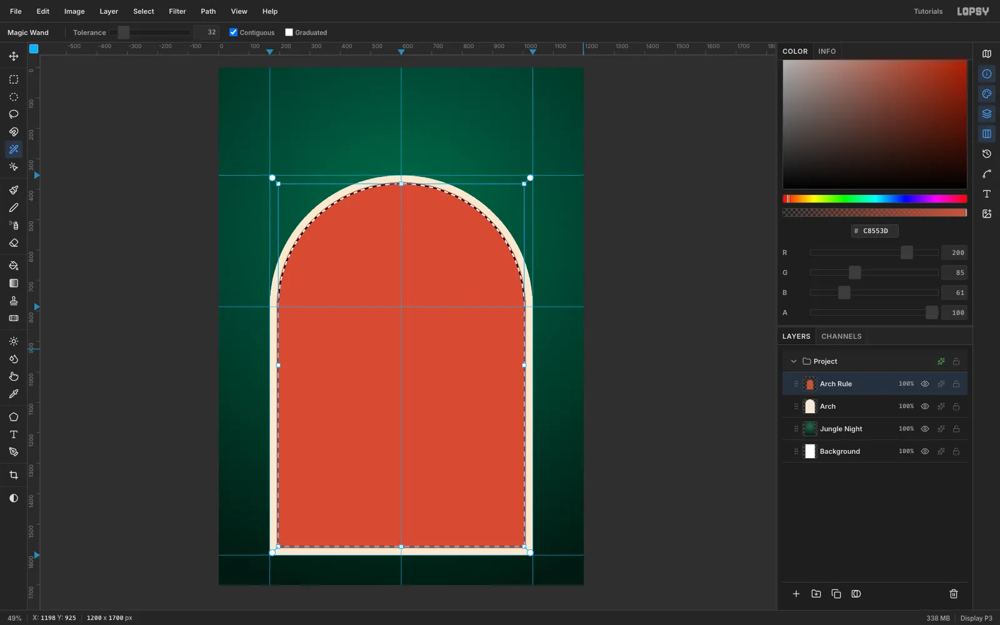

Keep the selection. Choose **Select → Shrink…** and shrink by **22** px.
Add a layer named **Arch Rule**, and fill it with terracotta `#C8553D`.
Choose **Select → Shrink…** again with **4** px, then press **Delete**.
That leaves a 4 px line that follows the arch 22 px in from its edge. Press
[[Cmd+D]].

## Lift the card with a shadow

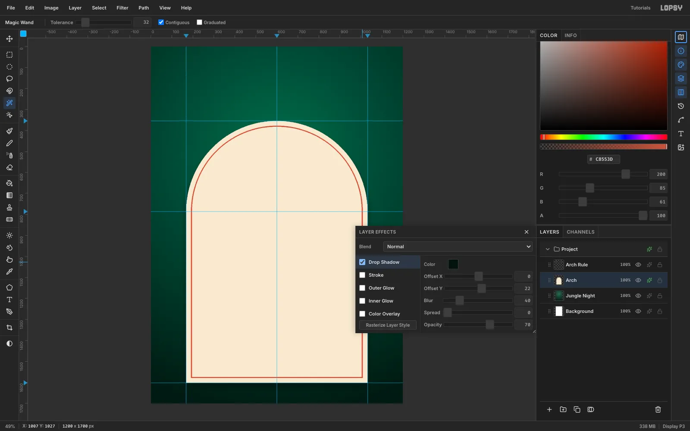

Select **Arch** and open its layer effects. Enable **Drop Shadow** with
colour `#03140E`, **Offset X** 0, **Offset Y** 22, **Blur** 40, **Spread**
0 and **Opacity** 70. It's subtle against the dark green, but it
separates the paper from the jungle once leaves start overlapping it.

## Cut the back palm fronds

Select **Jungle Night** and click **New Group**. The group lands above the
active layer, so it sits *under* the arch. Name it **Back Jungle** and add
a layer inside called **Back Fronds**.

Each frond is one **Lasso** polygon:

1. Plan a curved spine, for example from the bottom-left corner up and over
   towards the top centre.
2. Along one side of the spine, walk out to a leaflet tip and back to the
   spine. Repeat about 26 times. Make the leaflets longest in the middle,
   and let them droop more towards the tip.
3. Come back down the other side the same way and close the shape.

Fill six fronds in the darkest green, `#0B3727`: two from the top corners,
one from each side, and two meeting at the bottom centre. Then fill four
bigger fronds in `#11513A`, sweeping in from each corner. The two tones
give the back layer some depth of its own.

## Add back monstera leaves

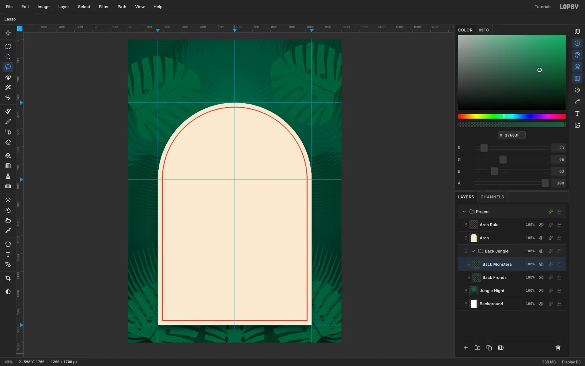

Add a layer named **Back Monstera**. A monstera leaf is a rounded heart
shape, about as wide as it is tall, with a notch where the stem joins:

1. Lasso the outline and fill it with `#17603F`.
2. Cut seven slits on each side with thin, slightly curved lasso wedges.
   Each slit starts just outside the edge and tapers to a point about
   three-quarters of the way to the midrib. Press **Delete** after each one.
3. Delete four small oval holes near the midrib, and a hairline down the
   midrib itself.

Place leaves in each corner and one at the bottom centre, rotated so they
point out from the arch.

> **Tip:** Make sure every cut really selects something. With no active
> selection, **Delete** removes the whole layer instead of clearing pixels.

## Frame the arch with front leaves

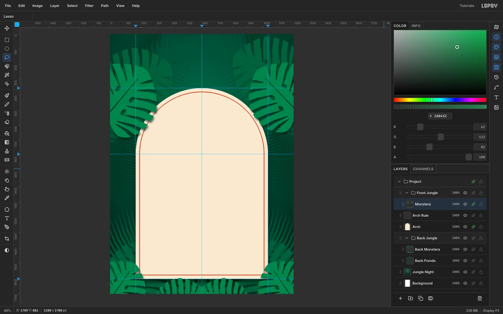

Select **Arch Rule** and create another group, **Front Jungle**, with a
layer called **Monstera**. Cut six larger leaves in `#2A8452`:

- one at each top shoulder, tilted about 42° outwards, just overlapping the dome
- one in each bottom corner
- two lying almost flat along the bottom edge, so the card sits *in* the
  foliage

Keep the leaf tips out of the dome's interior; the title goes there. Add a
**Drop Shadow** of `#041C14`, **Offset** 6 / 12, **Blur** 16 and
**Opacity** 60. That shadow is the whole paper-cut effect: each layer now
floats over the one behind it.

## Add light palm fronds

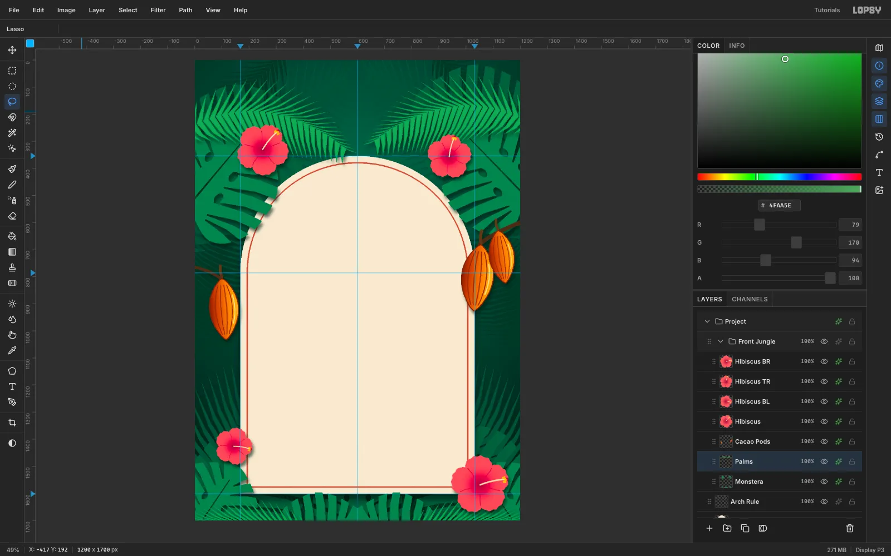

Add a layer named **Palms** and cut four fronds in `#4FAA5E`. Two arc over
the top corners, and their leaflets droop towards the arch. Two run low
along the bottom edge, below the arch, so their leaflets never reach the
text.

Give the layer an **Inner Glow** in `#1E6B3A` (**Size** 7, **Opacity** 45),
so each leaflet has a darker edge. Then add the same Drop Shadow as the
monstera layer.

## Hang some cacao pods

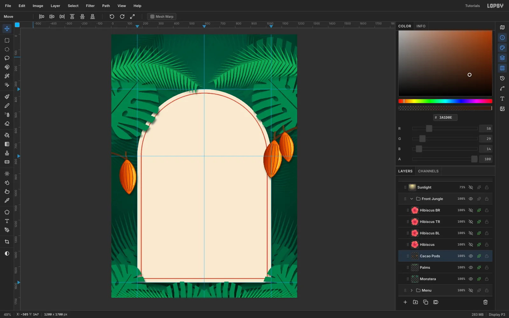

Xocolatl is the Nahuatl drink that gave us chocolate, so the menu needs
cacao pods. Add a **Cacao Pods** layer. With a hard 16 px **Brush** in
`#4A2E18`, paint a stem in from the right edge, and a thinner one from the
left.

For each pod:

1. Lasso a long lemon shape that's pointed at both ends, and fill it with
   `#7A2A12`.
2. **Select → Shrink…** 3 px, then drag a **Linear** gradient across the
   pod's width: `#FFC04A`, `#F08A24`, `#C24A17` and `#7E2610`. The shrink
   leaves a dark rim.
3. Brush four curved ribs down the pod in `#8E3212`, plus one pale
   `#FFE08A` highlight on the lit side.

Add the leaf Drop Shadow. Lasso fills have smooth, anti-aliased edges, so
the pods need no extra softening.

## Paint a hibiscus

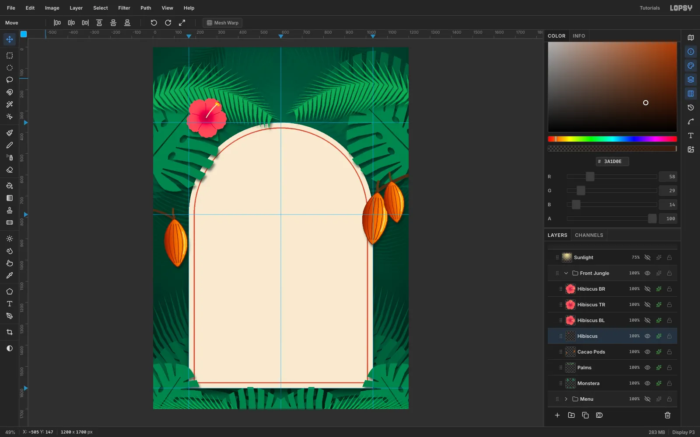

Add a **Hibiscus** layer. Lasso a five-lobed flower about 190 px across,
with rounded, slightly ruffled petals, and fill it with `#FF5A5F`. While
it's still selected, drag a **Radial** gradient from the centre outwards:
`#A0103A`, `#E0304F` and `#FF5A5F` fading to transparent. The throat of
the flower goes deep crimson.

Then add the details with a hard brush:

- five short `#C81E45` lines from the centre towards the gaps between petals
- a curved stamen, 6 px wide, in `#FFE3B0`
- a cluster of small `#FFC23A` pollen dots at the stamen's tip, with three
  crimson dots at the very end

Add the leaf Drop Shadow.

## Copy, scale and rotate more flowers

Draw a marquee around the flower, press [[Cmd+C]], then [[Cmd+V]]. The
copy lands in place on a new layer. Rename it **Hibiscus
BR**, then:

1. Drag it with the **Move** tool to the bottom-right corner of the arch,
   and press [[Cmd+D]].
2. Marquee it again and hold [[Cmd]] while you drag a corner handle to
   scale it to about 112%. Press [[Cmd+D]].
3. Marquee it once more and drag just outside the top-right handle to
   rotate it. Press [[Cmd+D]] to commit.

Committing between moves, scales and rotations keeps each transform clean.
Rotating each copy also changes the angle of its stamen, so the flowers
don't look stamped.

## Finish the flower quartet

Paste two more copies. **Hibiscus TR** goes on the top-right shoulder,
scaled to 85% and rotated −25°. **Hibiscus BL** goes on the lower-left edge,
scaled to 72% and rotated 60°. Pasted layers don't bring their effects
with them, so add the Drop Shadow to each copy.

The big–small–small–big diagonal balances the frame without making it
symmetrical.

## Set the title

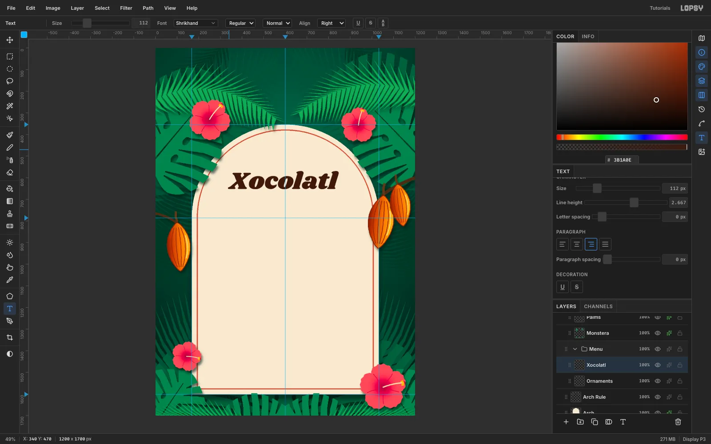

Create a **Menu** group above **Arch Rule** with a raster layer inside
called **Ornaments**. New text goes above the active layer, and keeping a
raster layer active means changing type settings never restyles a text
layer you've already committed.

Pick the **Text** tool, choose **Shrikhand**, set **Size** to **112**, and
set the colour to cacao brown `#3B1A0E`. Click inside the dome, type
**Xocolatl**, and press **Tab** to commit.

## Build the title lockup

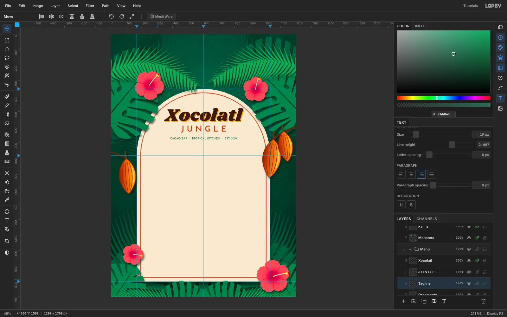

With the **Move** tool, click **Align center horizontally**, then use the
arrow keys to settle the title in the upper part of the dome, about a
third of the way down the arch. Add a **Drop
Shadow** with colour mango `#F2A531`, **Offset** 5 / 6, **Blur** 0 and
**Opacity** 100. It gives the title a retro, screen-printed feel.

Just below it, add **J U N G L E** in **Josefin Sans SemiBold** at **52**
px in coral `#C24A26`. Under that, add the tagline
**CACAO BAR · TROPICAL KITCHEN · EST. 2019** in Josefin Sans **19** px,
`#2A6B4F`. Centre both with **Align center horizontally**, and keep the
gaps between the three lines tight so they read as one lockup.

> **Tip:** Create each new line of type in an empty area of the canvas,
> then move it into place. Clicking inside an existing text layer's box
> edits that layer instead of starting a new one.

## Set the first section

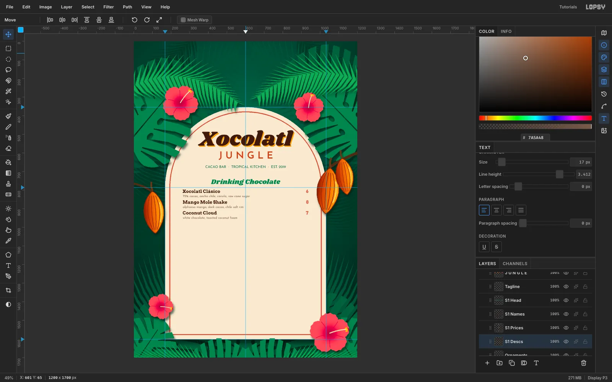

Each section has four text layers:

- **Header:** Shrikhand, 36 px, `#2A8452`, centred a comfortable gap
  below the tagline.
- **Names:** an area-text box in **Arvo Bold**, 24 px, `#3B1A0E`. Drag it
  from about 70 px inside the terracotta rule on the left to a little past
  the centre line. One item per line, with **Line height** set to
  **2.417** in the Text panel, which gives a 58 px pitch. Put its first
  line about 56 px below the header.
- **Prices:** a narrow area-text box with the same font, size and line
  height, set to **Align right**, in `#C8553D`. Drag it from just right of
  the names box to about 70 px inside the rule on the right, so the menu
  has even margins. Line its first line up with the names.
- **Descriptions:** an area-text box in **Josefin Sans** 17 px, `#7A5A48`,
  with **Line height** **3.412** (the same 58 px pitch). Put it about
  28 px below the names, so each description sits closer to its own item
  than to the next one.

Set the line height in the **Text** panel *before* you drag each box.
Because the three blocks share a pitch, every price stays level with its
dish.

## Add the other two sections

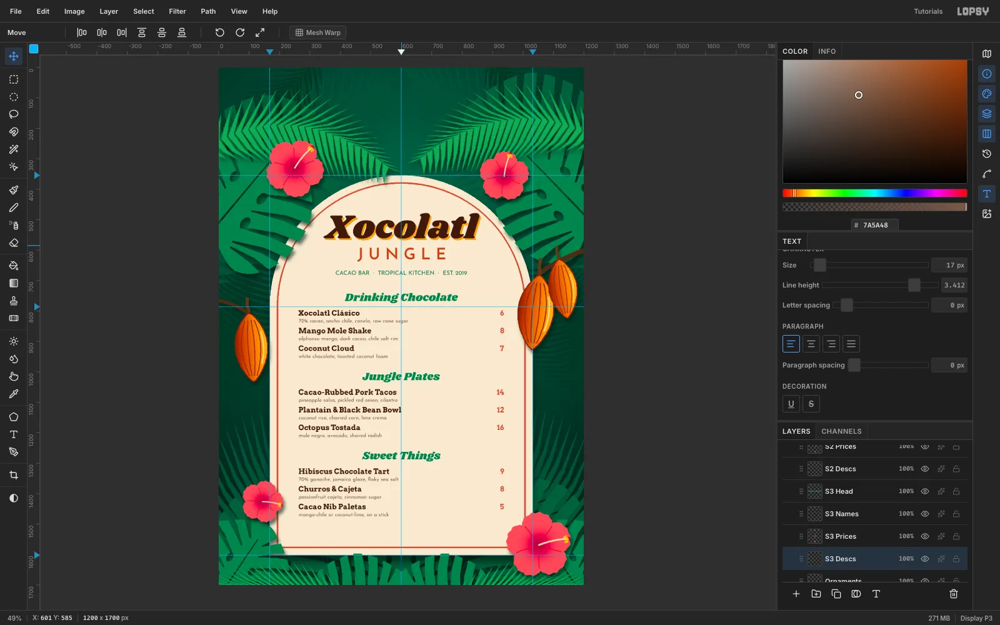

Repeat for **Jungle Plates** and **Sweet Things**, stacking them down the
arch. Leave about 45 px between each section's last description and
the next header. That's clearly more than the space between items, so the
sections read as separate groups.

## Draw the header rules

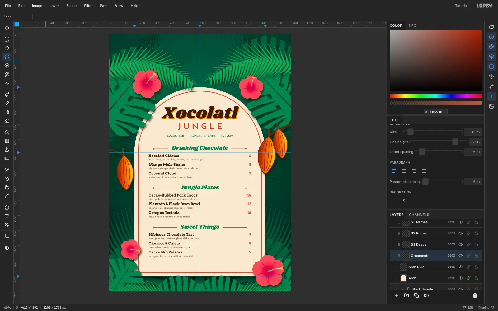

On **Ornaments**, draw a **2 px** tall rectangular marquee level with the
middle of each header. Start it about 110 px inside the arch rule and stop
it about 22 px short of the header's first letter. Mirror it on the right
side. Fill both with `#C8553D`. At the outer ends, lasso a small diamond,
12 px across, and fill it with the same colour. The rules frame each
header like a label on a crate.

## Add the footer

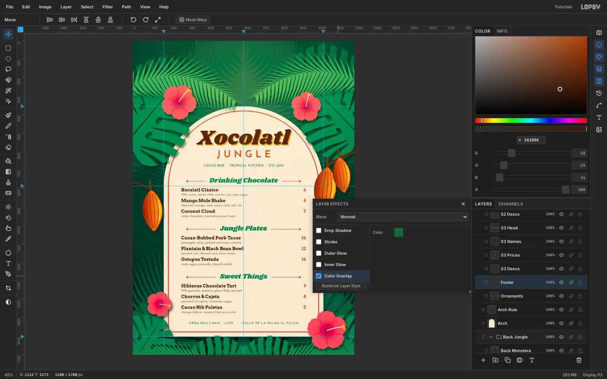

Set **Letter spacing** to **2** in the Text panel. Then type **OPEN DAILY
8AM – LATE · CALLE DE LA PALMA 14, TULUM** in Josefin Sans at **16** px.
Centre it horizontally, and nudge it up or down until the space above it
(to the last description) matches the space below it (to the rule).

Give it a **Color Overlay** of deep leaf green `#0F6B3A`, so it's strong
enough to hold the bottom of the card. Reset **Letter spacing** to 0
afterwards.

## Warm it up with sunlight

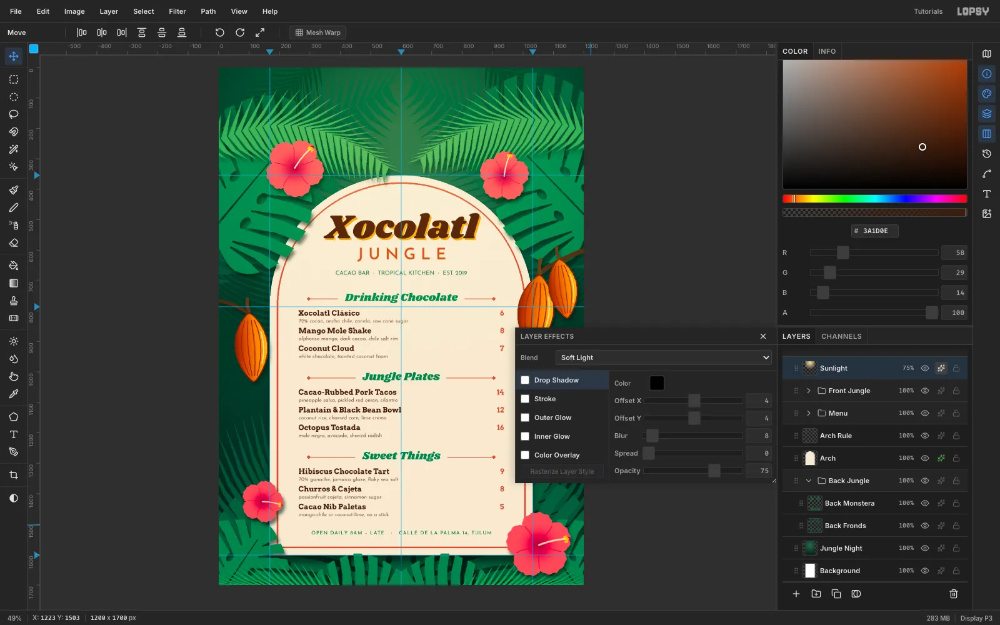

Add a layer named **Sunlight** and drag its row above **Front Jungle**,
so it sits at the top of the stack. Drag a **Radial** gradient of
`#FFE7A0` at full opacity fading to transparent, from just above the top of
the dome straight down to about the middle of the card. Set the blend mode to **Soft Light** and the layer opacity
to **75%**.

The top leaves pick up a warm, sunlit yellow-green, and the glow draws the
eye to the title.

## Check your groups

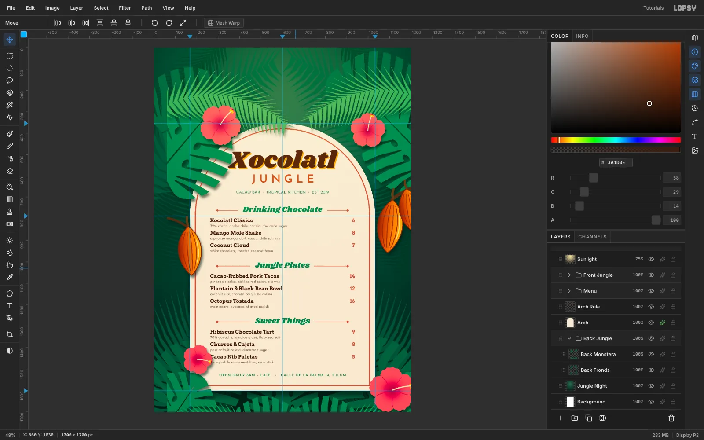

Before exporting, select the **Front Jungle** group and drag it with the
**Move** tool. Everything in the group should move together: leaves, pods
and flowers. If a piece stays behind, it's on a layer outside the group, so
drag its row in. Press [[Cmd+Z]] to put the group back.

Finally, choose **File → Save Project** to keep the editable `.lopsy`, and
**File → Quick Export PNG** for the finished menu.
