Long before computers, typists made pictures on their typewriters. In
1898 a secretary named Flora Stacey typed a butterfly out of brackets,
dashes and slashes, and *typewriter art* has had a following ever since.
Artists turned the paper in the roller to type at an angle, and typed
over the same spot twice for darker tones. ASCII art grew out of the
same idea.

This tutorial uses that idea for a birthday card. It's a bouquet of
**Queen Anne's lace**, the wild carrot with flat, lacy flower heads.
Each head is made of dozens of tiny florets in clusters, with a single
dark red floret in the very middle. Everything in the picture is typed:

- the lace from `*`, `o` and `.`
- the stems from `=`
- the leaves from `%` and `&`
- a bow, a moth and a botanist's specimen label

The card is 1500 × 2100 px, a 5 × 7 in card at 300 dpi.

You'll type most of it as live text in **Courier Prime**, a monospaced
typewriter font. In a monospaced font every character is the same width,
so the rows line up into a grid you can draw on. The tools you'll meet
along the way:

- the **Text** tool with **Line height**, **Align** and the **Path**
  dropdown, which sets type along a curve
- the **Pen** tool for the stems
- the **Move** tool's rotate and scale handles on live text, and on
  several layers at once
- **Filter → Fibers**, **Clouds**, **Hue/Saturation**, **Add Noise** and
  **Emboss**
- the **Darken**, **Soft Light**, **Multiply** and **Overlay** blend modes
- a selection made from a layer's thumbnail, with **Grow** and **Feather**
- the **Brush** with the **Chalk** preset, the **Lasso**, **Drop Shadow**
  and **Duplicate Layer**

The palette is cream and raspberry on dark green, with a paper label:

- Card stock `#1C2620`
- Lace and title `#F3EEDF`
- Stems `#9DB08A`, leaves `#7E9466`
- Raspberry `#D64876` (centre florets and bow), red ribbon `#C23A5A`
- Label `#EFE6D2`, typewriter ink `#2A2522`, tape `#E9E1CB`

> **Tip:** Typing the flower heads by hand takes a while. You can copy any
> block from the project file: open it with the button above,
> double-click a text layer with the **Text** tool, then press
> [[Cmd+A]] and [[Cmd+C]].

## Create the card

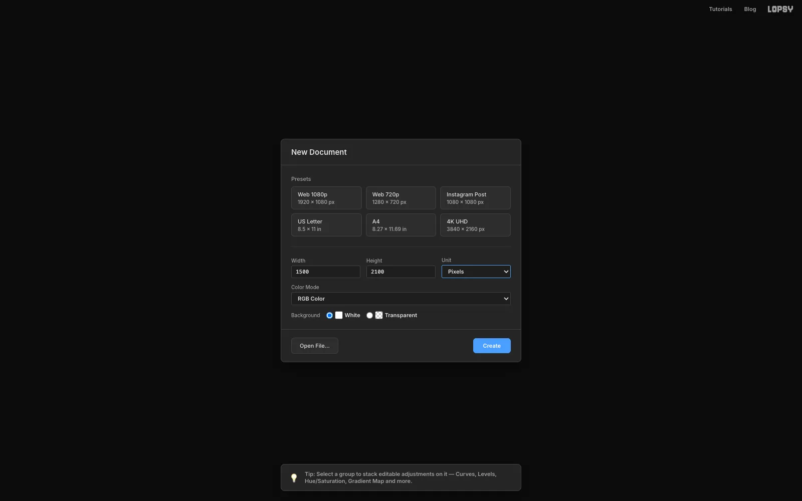

Choose **File → New**. Set **Unit** to **Pixels**, type **1500** for the
width and **2100** for the height, keep the **White** background and click
**Create**.

## Fill the card stock

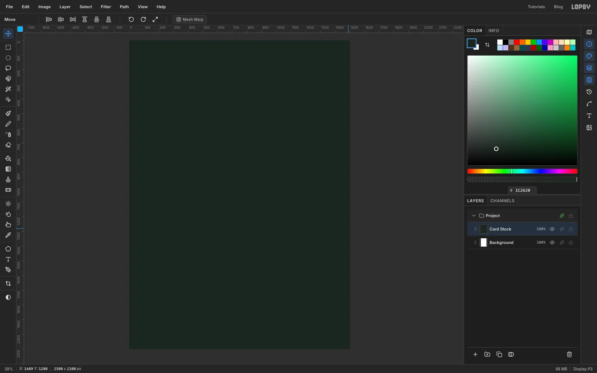

Rename *Layer 1* to *Card Stock* by double-clicking its name. Set the
foreground colour to dark green `#1C2620` and choose **Edit → Fill**. With
nothing selected, it fills the whole layer.

Real card isn't perfectly flat, so choose **Filter → Add Noise…**, pick
**Mono** and set **Amount** to **8**.

## Add paper fibres

Click **Add Layer** at the bottom of the Layers panel and name the new
layer *Paper Grain*. Choose **Filter → Fibers…** and set **Variance** to
**24** and **Strength** to **10**. This fills the layer with long
vertical streaks.

Open the layer's effects with the ✦ button and set its blend mode to
**Soft Light**. Then lower the layer's opacity to **15%** so the streaks
only just show, like pressed fibres in the card.

## Darken the edges and set guides

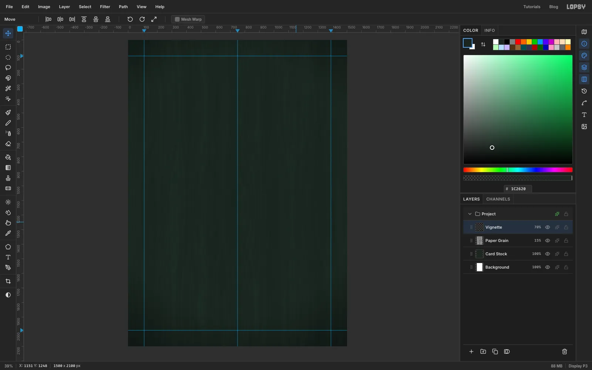

Add a layer called *Vignette* and pick the **Gradient** tool. Set **Type**
to **Radial** and click **Advanced…**. Make three stops, all black:

- transparent at the left end
- transparent again a little past halfway
- solid black at the right end

Drag from the centre of the card out past the bottom-right corner. Set
the layer to **Multiply** at **70%**.

Now add guides. Click the top ruler at **110**, **750** and **1390** to
make vertical guides, and the left ruler at **110** and **1990** for
horizontal ones. That gives you a margin all round and a centre line.

## Type the title

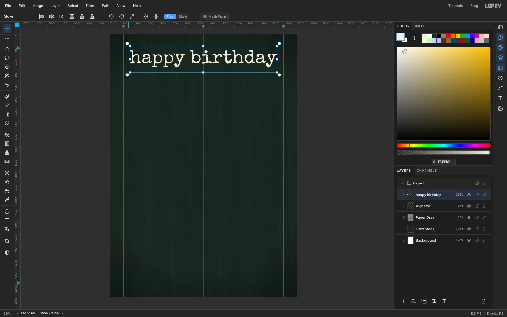

Pick the **Text** tool. Choose **Special Elite** in the font browser. It's
a typewriter face with chewed, inky edges. Set **Size** to **150** and the
colour to cream `#F3EEDF`. Click near the top-left margin, type *happy
birthday* in lower case and press [[Tab]] to commit.

Switch to the **Move** tool and click **Align center horizontally** in the
options bar. The title should sit between the left and right guides with
its top just under the top guide.

## Type the lace caps

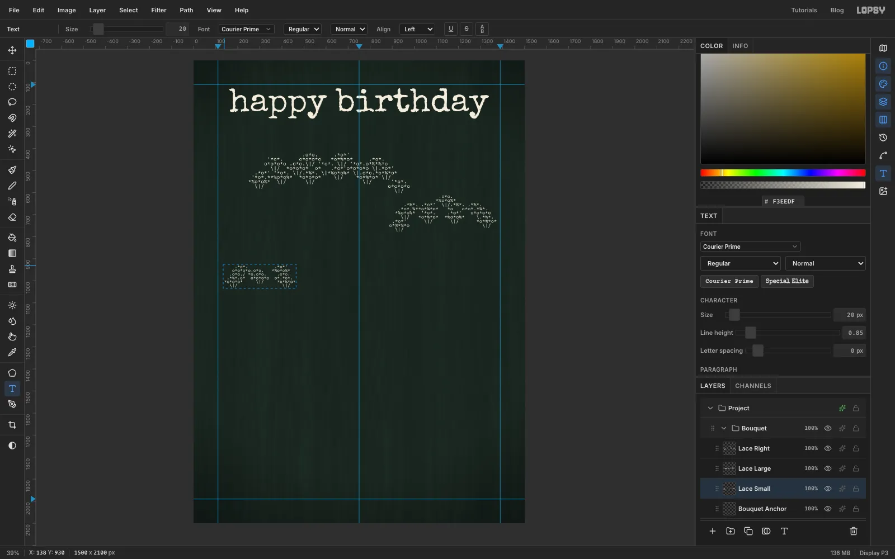

Choose **Layer → New Group** and name it *Bouquet*. Click **Add Layer** to
put an empty layer inside it, called *Bouquet Anchor*. New layers appear
just above the active one, so with this layer selected everything you add
next lands inside the group.

Pick the **Text** tool and set it up before you type: **Courier Prime**,
cream `#F3EEDF`, size **24**. In the **Text** panel, set **Line height**
to **0.85** so the rows sit close together.

Each flower head is made of small clusters called **umbellets**. One
umbellet is two typed rows with a short stalk under it:

- `.*o*.`
- `*o*%*o*`
- `\|/`

A whole head is one text block about 50 characters wide and 8 lines
tall. Each line runs through several umbellets side by side, with a space
or two between them. Stagger them in three rows: the back row two lines
higher than the middle row, and the front row lower still, so the cap
looks gently domed. In the middle row, leave three empty cells in the
centre umbellet for the red floret. For example, two lines from the
large head's back and middle rows:

- `'*o*.     o*o*o*o   *o*%*o*     .*o*.`
- `o*o*o*o .o*o.\|/ '*o*. \|/ '*o*.o*%*%*o`

Click in the upper middle of the card, type the large head and press
[[Tab]]. Name the layer *Lace Large*. Make a medium head at size **22**,
lower down on the right (*Lace Right*), and a small one at **20** on the
left (*Lace Small*).

> **Tip:** To skip the typing, copy any head from the project file as
> described above.

## Add the rays

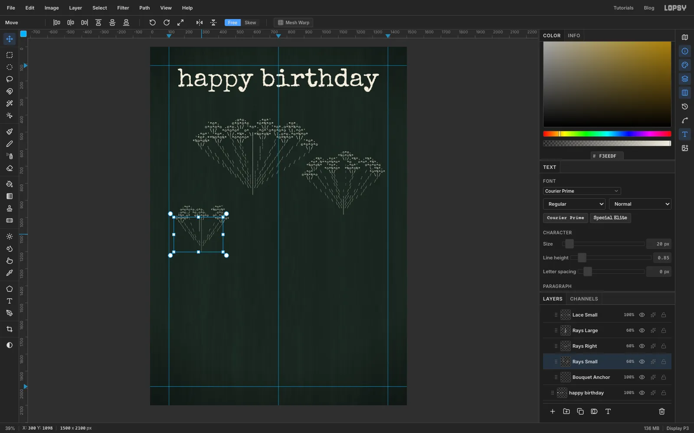

On the real flower, a spray of thin stalks called **rays** joins every
umbellet to the top of the main stem. Type them on a separate layer so
you can fade them.

Make a new text layer at the same size and line height as its cap, and
name it *Rays Large* (then *Rays Right* and *Rays Small*). Start
each ray under an umbellet's stalk and step it one row down and a little
sideways each time:

- use `\` on the left
- use `|` in the middle
- use `/` on the right

All the rays meet at one point about 11 rows below the cap. For the rays
behind the cap, type `:` on every other row so they read as further away.

Line the ray layer up exactly with its cap. Type it in empty space, then
use the **Move** tool and the arrow keys to slide it into place, checking
that each ray starts right under a stalk. Set each ray layer to **60%**
opacity so the lace stays brightest.

## Drop in the red centre florets

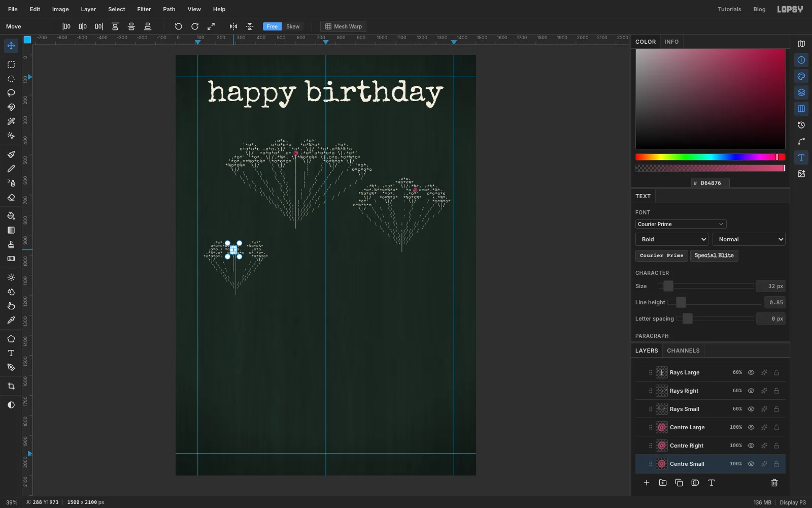

Click empty canvas with the **Text** tool, then:

1. Set the colour to raspberry `#D64876`, **Size** to **40** and
   **Courier Prime Bold**.
2. Type a single `@`, commit it and name the layer *Centre Large*.
3. Move it into the gap in the middle of the large cap.

Make two more for the other heads at **36** and **32** (*Centre Right*
and *Centre Small*). They're bigger
than the florets around them, so the red reads even at thumbnail size.

## Draw the stem paths

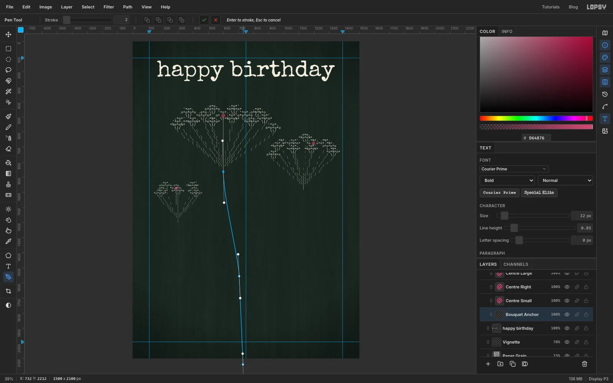

Pick the **Pen** tool. Each stem is one path with three anchors:

1. Press at the point under a flower head and drag downwards to pull out
   a handle.
2. Press at a point on the centre line about three-quarters of the way
   down, where all three stems will be tied. Drag along the direction the stem
   should keep going.
3. Press a little below the bottom edge of the canvas and drag a short
   way.

Click the ✓ (**Commit path**) button in the options bar to keep the path
without stroking it.

Draw one path for each flower. Make the stems cross at the tie point,
so the right-hand flower's stem ends on the left and the small flower's
stem ends on the right. Take the small flower's stem down and around
below the spot where the left leaf will go.

## Set the stems on the paths

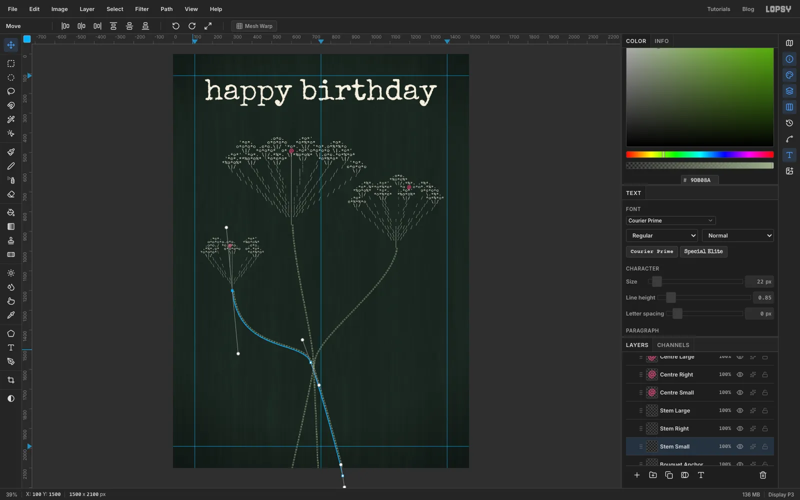

With *Bouquet Anchor* active, pick the **Text** tool. Set **Courier
Prime**, regular weight, size **22** and sage green `#9DB08A`. Click in
empty space and type a generous row of `=` signs, about 100. Press
[[Tab]] and name the layer *Stem Large*.

With the new text layer still active, choose **Path 1** in the **Path**
dropdown in the options bar. The equals signs jump onto the
curve and follow it, which gives a ribbed stem. Repeat for the other two
paths (*Stem Right* and *Stem Small*). If a row runs out before the end
of its path, select the layer and type more equals signs.

> **Tip:** From here on, start each new piece of type in a clear part of
> the canvas, away from the stems, then move it into place.

## Turn the leaves like the typist turned the paper

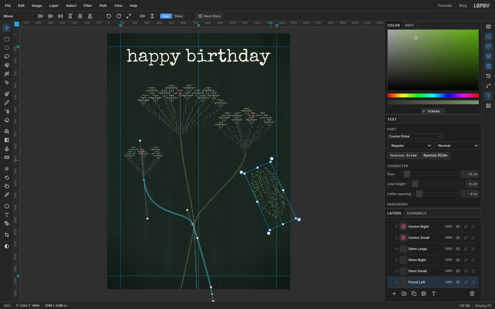

Queen Anne's lace has feathery, finely cut leaves. Each leaf is about 20
lines tall: a central stalk of `|` and `}` running down the middle, with
leaflets of `%`, `&`, `*` and `;` on both sides. The rows start a
character or two wide at the tip, grow to about seven each side in the
middle and narrow again, then three lines of plain `|` make the leaf
stalk. A middle row looks like `%&*; &%}*&;% *&`.

Click *Bouquet Anchor* first so the leaves sit behind the stems. Type the
left leaf in olive `#7E9466` at size **26**, in empty space, and name it
*Frond Left*.
Switch to the **Move** tool. Handles appear around the live text. Drag
just outside a corner to rotate it about **24°** anticlockwise, so its
tip leans towards the top-left. Typists turned the paper in the same way
to type at an angle.

## Scale and place the leaves

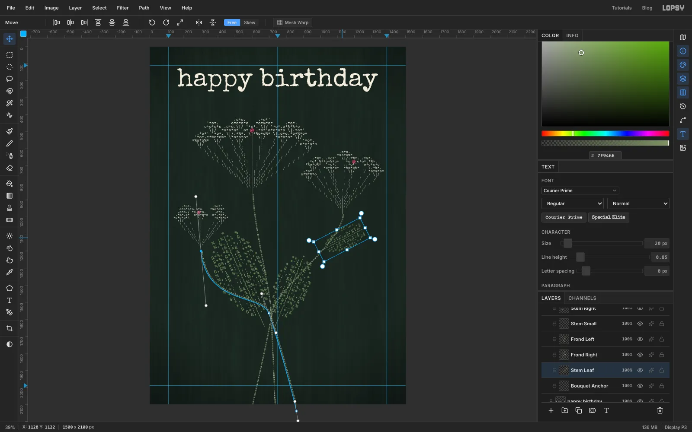

Hold [[Cmd]] and drag the leaf's top corner outward to scale it up by
about a fifth without stretching it. Then drag it so its stalk ends at the
tie point and it fans up and to the left behind the stems.

Make a second, shorter leaf at size **24** (*Frond Right*). Rotate it about **22°**
clockwise and scale it to match. Then a third at size **20** (*Stem Leaf*), rotated
about **62°** clockwise and placed so its stalk meets the edge of the
right-hand stem. It fills the empty space on that side.

## Type the bow

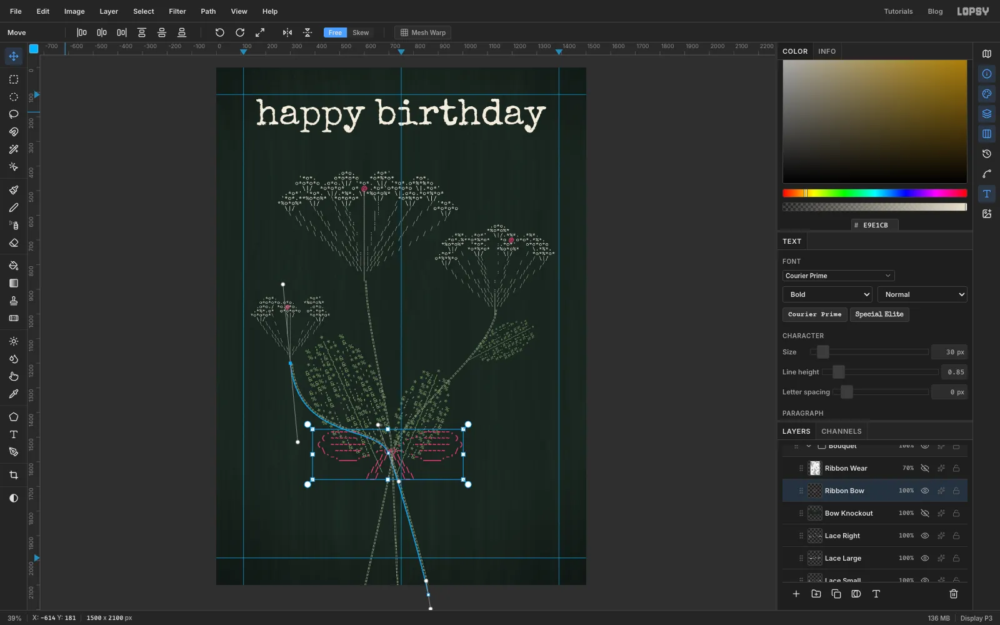

The bow goes on top of everything else in the bouquet. Click the top
layer in the *Bouquet* group and add a layer called *Bow Knockout*. You'll
use it in the next step.

Type the bow in **Courier Prime Bold**, size **30**, raspberry
`#D64876`, and name it *Ribbon Bow*. It's eight lines and about 35
characters wide:

- two loops drawn with `( ) - . ' _` and filled with rows of `~`. Make
  the right loop an exact mirror of the left, so both reach the same
  distance from the knot
- a knot of `(@)` in the middle
- double tails of `//` and `\\` with `/_/` and `\_\` notched ends

Move it so the knot sits exactly on the tie point. The project file has
the full bow if you'd rather copy it.

## Knock the leaves out behind the bow

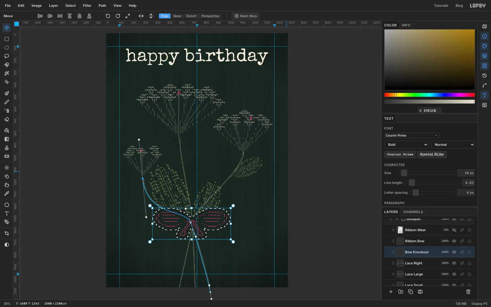

The leaves and stems show through the bow's loops. To hide them, give it
a patch of card colour behind it.

[[Cmd]]-click the bow's thumbnail in the Layers panel to load its
letters as a selection. Choose **Select → Grow…** and grow it by **28 px**,
then **Select → Feather…** by **3 px**.

## Fill the knockout

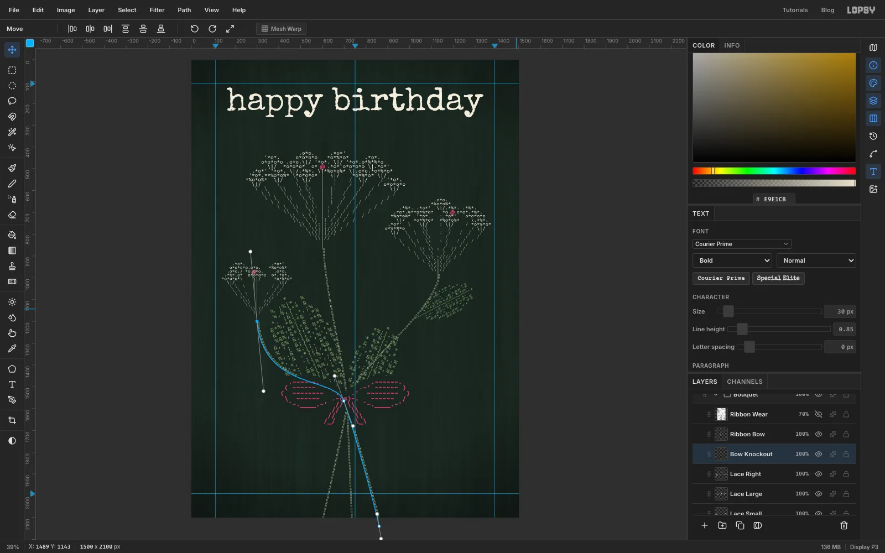

Click *Bow Knockout*, set the foreground colour to card green `#1C2620`
and choose **Edit → Fill**. Press [[Cmd+D]] to deselect.

## Type the moth

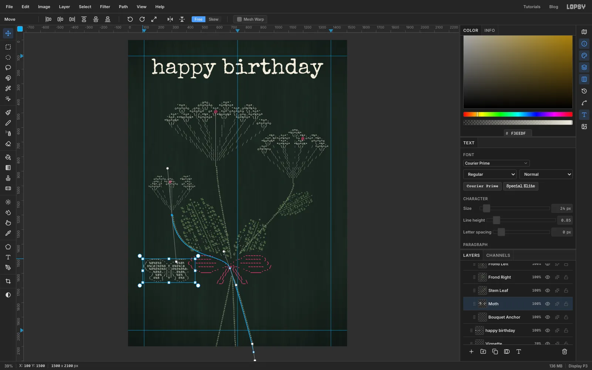

In honour of Flora Stacey's butterfly, add a moth. Type it in cream,
size **24**, regular weight, about 24 characters wide and 8 lines tall,
and name it *Moth*. Don't just outline the wings: fill them with
`%` and `8` so they look solid. Give each wing an eyespot `(@)` and the
body a column of `|:|` under a `Y` for the antennae.

## Fly the moth towards the florets

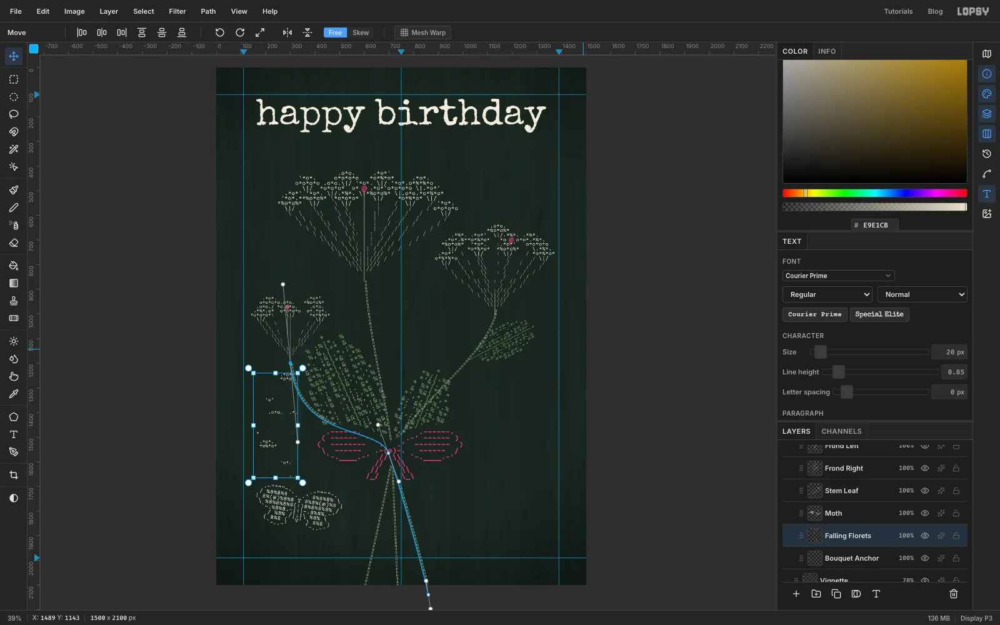

With the **Move** tool, rotate the moth about **8°** clockwise so it heads
up and to the right. Then drag it into the empty lower-left corner, the
same distance from the left edge as the title.

Some florets are drifting down from the small flower towards the moth.
Type them as one text block, *Falling Florets*, with blank lines between
the clusters.

Vary them so they don't look like a list:

- a two-row cluster (`.*o*.` over `*o*o*`)
- a single `'o'`
- a pair side by side
- a lone `*`

Indent each cluster so they swing out to the left and curve back in to
just above the moth's head.

## Wear the ribbon

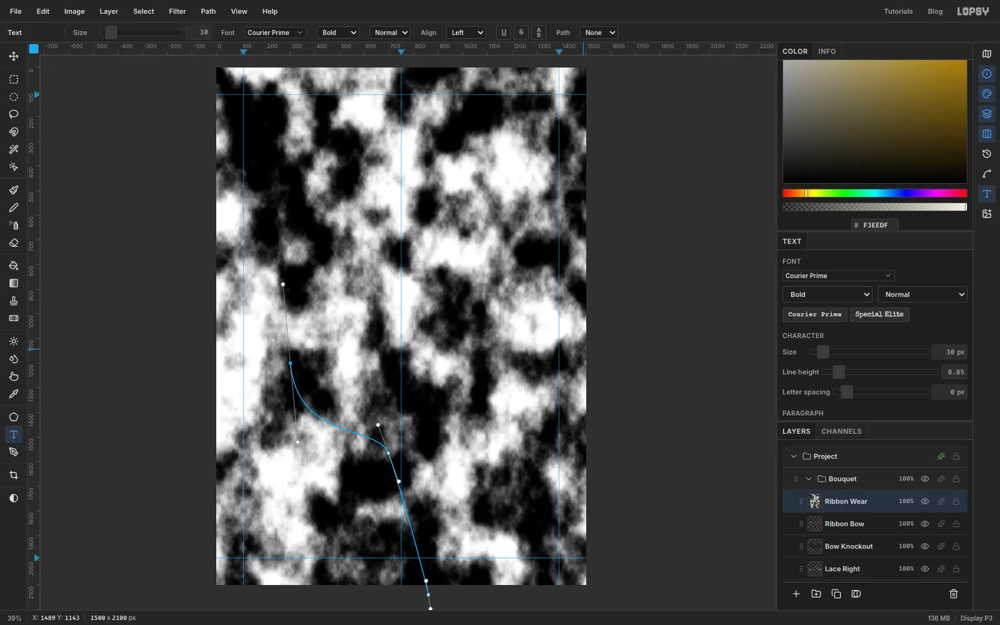

A typewriter ribbon never inks evenly, so some letters print fainter. At
the top of the *Bouquet* group, add a layer called *Ribbon Wear*:

1. Choose **Filter → Clouds…** with **Scale** at **14**.
2. Choose **Filter → Hue/Saturation…** and raise **Lightness** to **55**.
   The clouds now run from mid grey to white.
3. Choose **Filter → Add Noise…**, **Mono**, **30**, for speckle.

## Set the wear to Darken

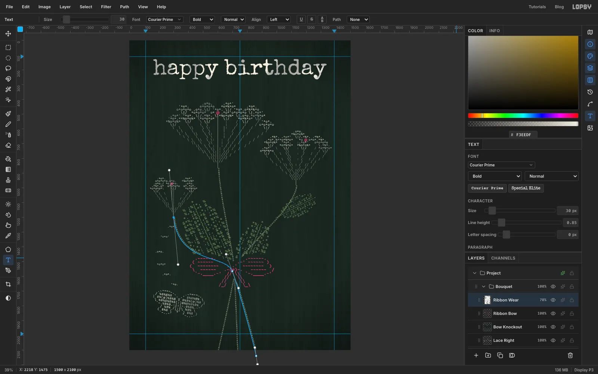

Set the layer's blend mode to **Darken** and its opacity to **70%**.
For now it wears the title too; you'll change that in the next step.
Darken only keeps the parts of a layer that are darker than what's below
them. The grey clouds are darker than the cream type, so they wear it
down in patches. They're lighter than the dark green card, so the card
doesn't change at all.

## Wear the title by hand

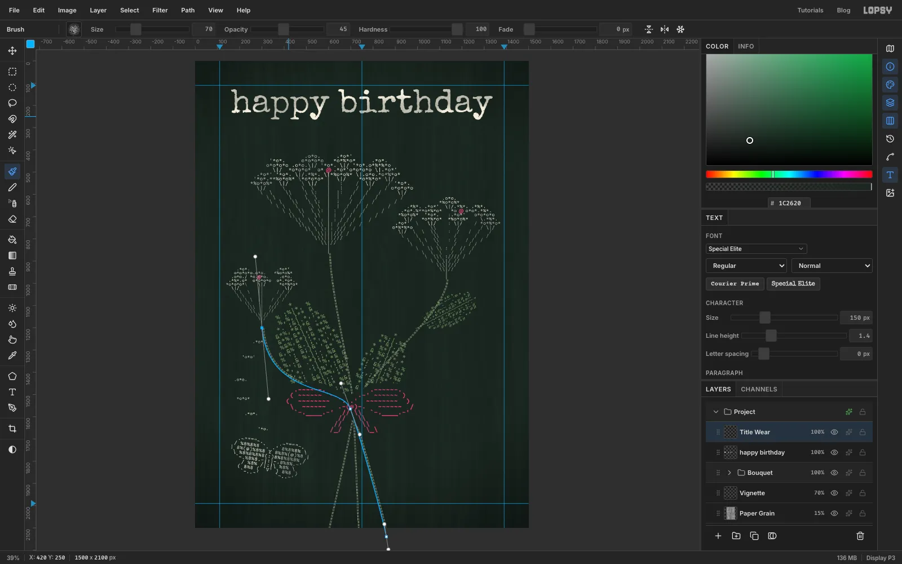

Collapse the *Bouquet* group and drag the title's row above it in the
Layers panel. The title now sits outside the clouds and gets its own wear.

Add a layer above the title called *Title Wear* and set it to **Darken**.
Pick the **Brush** and open the brush presets. Choose **Chalk**, then set
**Size** to **70** and **Opacity** to **45%**. With the foreground still
card green `#1C2620`, brush a few quick strokes across parts of the
letters. The Chalk tip's speckle makes the ink look like it skipped. Since
it's on Darken, the strokes can't lighten the card around the letters.
Then lower the layer to about **65%** so the title stays the brightest
thing on the card.

## Cut the label card

Botanists mount pressed plants on a sheet with a typed label in the
corner. This card gets one as well.

With *Title Wear* active, choose **Layer → New Group** and call it
*Label*. It sits above the bouquet. Add a layer called *Label Card*
inside it. Pick the **Rectangular Marquee** and drag a box about 480 × 365
px in the bottom-right corner, inside the guides. Fill it with cream
`#EFE6D2` using **Edit → Fill**.

Press [[Cmd+D]], add **Mono** noise at **7** for paper texture, and give
it a **Drop Shadow**: offset **6** and **10**, **Blur** **18**,
**Opacity** **60**.

## Type the specimen label

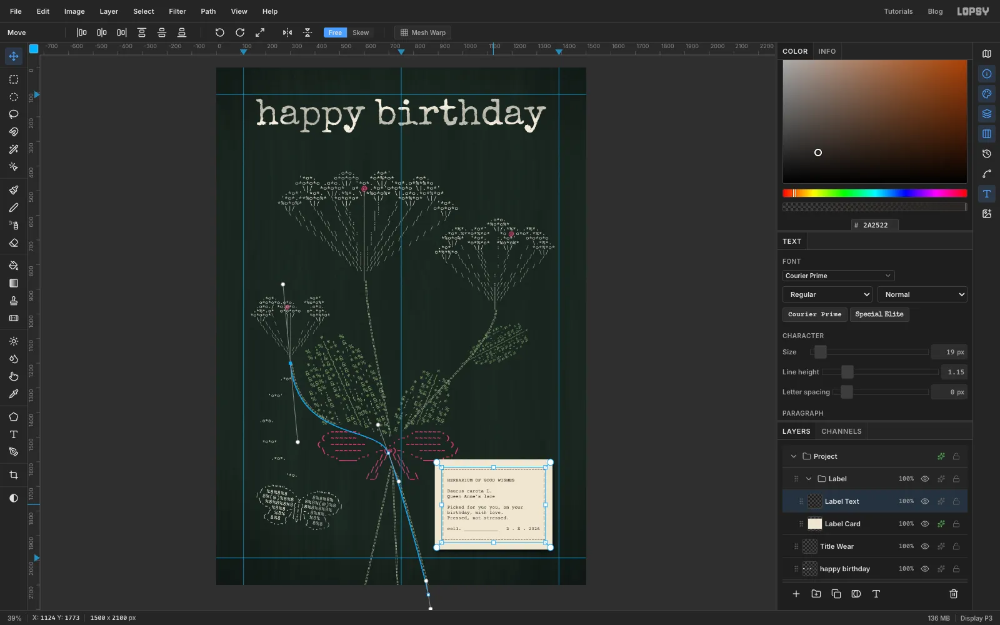

With *Label Card* active, type the label in **Courier Prime**, size
**19**, in typewriter ink `#2A2522`, and set **Line height** to **1.15**.
Name the layer *Label Text*. Every row is exactly 37 characters wide:

- the top and bottom rows are a border of `+` and `-`
- every row in between starts and ends with `|`, padded with spaces
- leave an empty row just inside the top and bottom borders

Between the borders, the rows read:

- *HERBARIUM OF GOOD WISHES*
- (empty)
- *Daucus carota L.*
- *Queen Anne's lace*
- (empty)
- *Picked for yuo you, on your*
- *birthday, with love.*
- *Pressed, not stressed.*
- (empty)
- *coll. ____________   2 . X . 2026*

Move it so the border sits evenly inside the card: about 30 px from each
edge.

## Strike out the typo

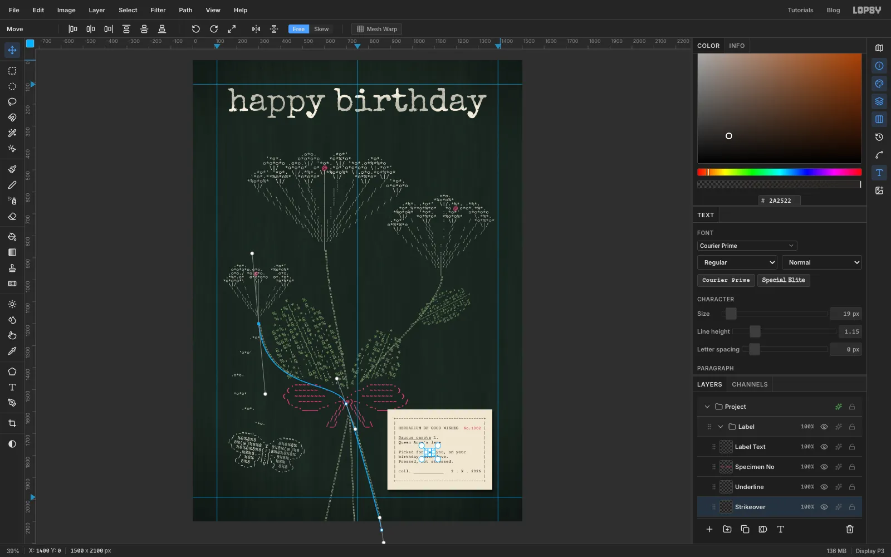

Typewriters can't delete, so typists x'd out their mistakes. Make three
small text layers in the same font and size, then:

1. Type `xxx`, name the layer *Strikeover* and line it up exactly over
   *yuo*.
2. Type 13 underscores (*Underline*) and put them under *Daucus
   carota*. Scientific names are underlined in typescript, but not the
   author's initial *L.*
3. Type *No.1002* in red `#C23A5A` (*Specimen No*), the red half of a
   two-colour ribbon, and move it into the empty space at the right of
   the heading.

Because the font is monospaced, each one lines up on the same character
cells as the text underneath. Use the arrow keys for the last few pixels.

## Press the type into the paper

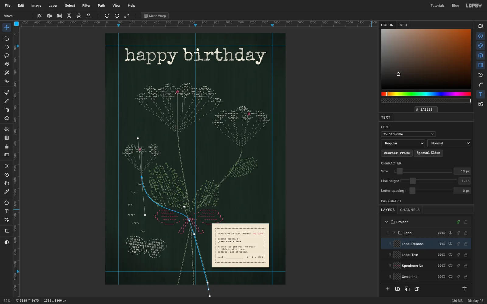

A typewriter's keys dent the paper. Select *Label Text* and click
**Duplicate Layer**. Name the copy *Label Deboss* and click **Rasterize
Layer**. Choose **Filter → Emboss…** with **Strength** at **30**. Set the
copy to **Overlay** at **60%**. With the **Move** tool, nudge it 1 px
right and 1 px down so the relief sits just off the letters.

## Turn the label

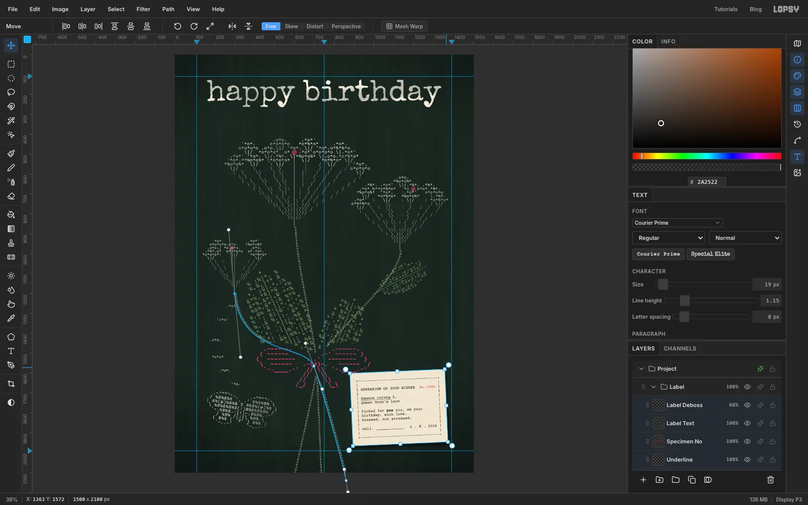

Click *Label Card*, then [[Shift]]-click *Label Deboss* to select all six
label layers. With the **Move** tool, drag just outside the top-right
handle and turn the label about **2.5°** anticlockwise. The card, the
live text and the embossed copy all turn together. Press [[Cmd+D]] to
finish the transform.

## Tape it down

Add a layer called *Tape* above the label. Pick the **Lasso** and draw a
strip across the top-right corner at about 45°. Make it about 130 px
long and 44 px wide, and zigzag the two short ends so they look torn.
Fill it with `#E9E1CB`. Draw a second strip across the bottom-left
corner and fill that too. Keep the tape off the top-left corner, or it
will run into the bow's tail.

## Finish the tape

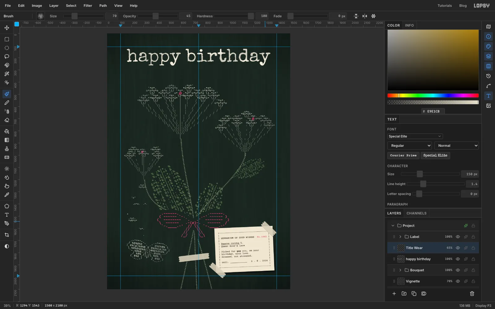

Press [[Cmd+D]] and add **Mono** noise at **10**. Lower the layer to
**82%** so the label shows faintly through the tape. Give it a soft
**Drop Shadow**: offset **2** and **3**, **Blur** **5**, **Opacity**
**40**. Add a third strip on its own layer, *Stem Tape*, across the stems
below the bow, the way a botanist straps down a specimen. Give it the
same noise, opacity and shadow.

## Check the spacing

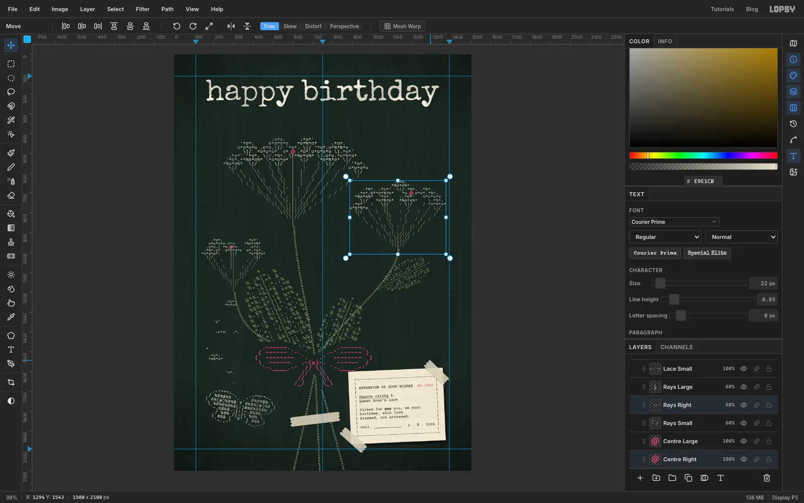

Zoom out and look at the gaps between things. If two flower heads crowd
each other, move one of them as a unit:

1. Click its lace layer, for example *Lace Right*.
2. [[Cmd]]-click its rays and centre floret layers to add them.
3. With the **Move** tool, nudge them with the arrow keys. Hold
   [[Shift]] for 10 px steps.

Here the right head moved down a little, and its rays still meet the top
of the stem. Check the margins too: the title, moth, right-hand flower
and label should all sit inside the guides.

Export with **File → Quick Export PNG** and save the project with **File →
Save Project**.
