In a typographic poster the letters *are* the picture. This tutorial builds
**Hot Sauce Social**, a 1200 × 1680 px (5 × 7) invitation in the style of an
old wood-type print shop. It has three big words in three contrasting faces,
each with its own print trick, plus a small, well-organised details block.

Along the way you'll use rasterized type with the **Magic Wand** for
gradient fills, **Brush** drips, a hand-offset second ink plate, a gradient
**heat scale**, a **Layer Mask**, **Halftone**, **Text on a path**, and a
grain made from **Add Noise** and **Threshold**.

The palette:

- Paper `#F1E6D0`, ink `#1B1714`
- Chili red `#D62718`, deep sauce red `#A80F12`, habanero `#F28A1E`
- Jalapeño green `#2E6B3A`, plus `#3E7D2A` and olive `#8C8A1A` for the heat scale
- Sunburst peach `#F4CF9C`, halftone red `#E0301A`

One rule keeps it coherent: every display element gets the **same hard
offset**, 12 px right and 10 px down with no blur. Dark type gets a red
plate. Colored type gets an ink shadow.

## Set up the paper and margins

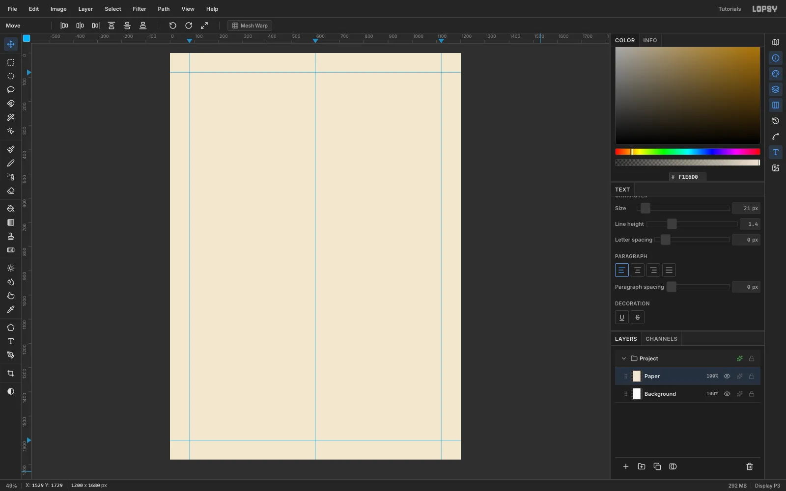

Choose **File → New**, keep the unit on **Pixels**, and create a
**1200 × 1680** document. Rename **Layer 1** to *Paper*. Select all, then
**Edit → Fill** it with `#F1E6D0`.

Click the top ruler at **80**, **600** and **1120**, and the left ruler at
**80** and **1600**. That gives an 80 px safe margin on every side and a
centre line. Guides only drop while **View → Show Guides** is ticked.

## Draw a sunburst with the Lasso

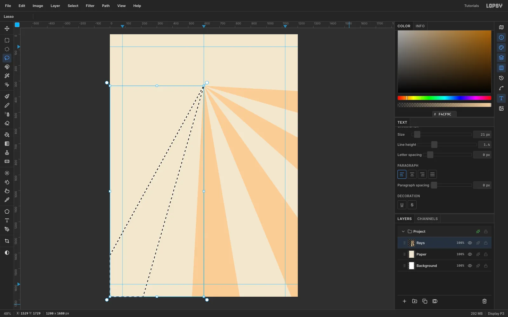

Add a layer called *Rays*. Every ray starts at the same point, **(600, 330)**,
which will sit inside the O of HOT. Split the circle into 28 equal slices and
fill every other one with `#F4CF9C`. That's 14 rays.

For each ray, use the **Lasso** to click from the centre out to the canvas
edge, trace along the edge, and come back to the centre. Then choose
**Edit → Fill**. Let the far points run about 40 px past the canvas edge, so
no ray ends in a sliver.

## Fade the rays with a layer mask

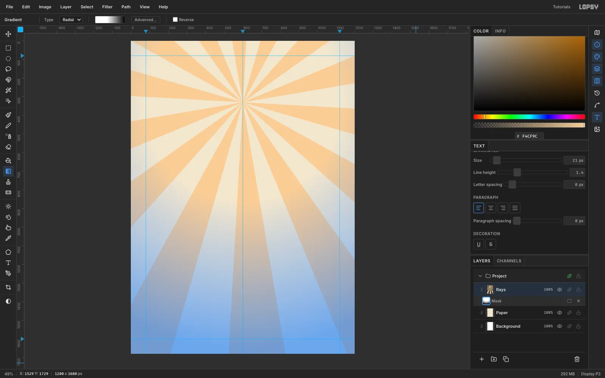

With *Rays* selected, click **Add Mask** in the Layers panel, then click the
**Mask** row to edit it. Open the Gradient tool's **Advanced…** editor and set
three stops: white at 0, white at 40% and black at 100%. Pick **Radial** and
drag from **(600, 330)** down to **(600, 1650)**.

The rays stay strong behind the headline and fade out behind the small type,
where they would hurt readability. Click the *Rays* layer row to stop editing
the mask.

## Halftone the corners

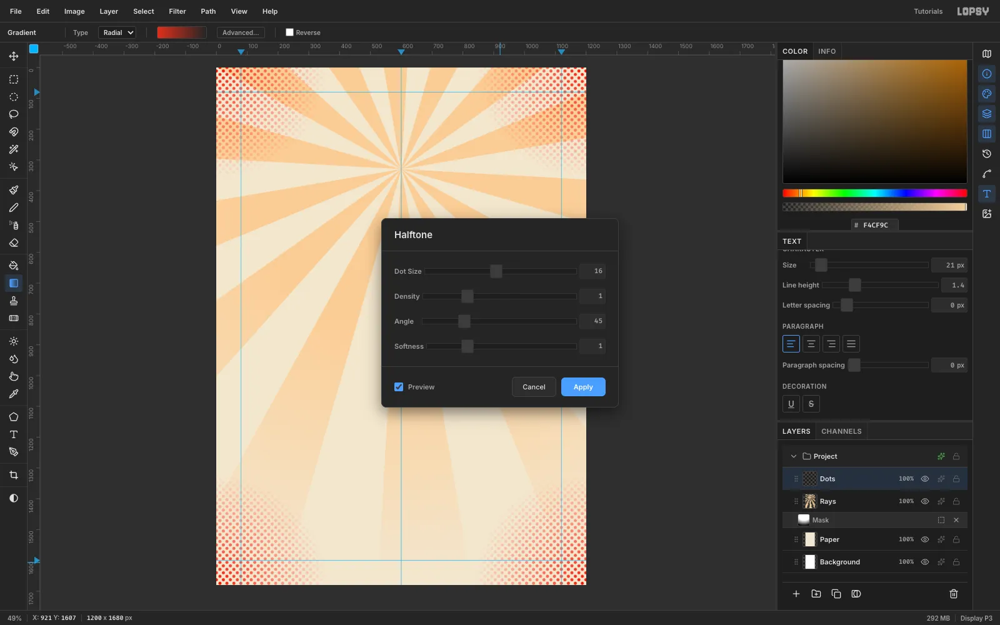

Add a layer called *Dots*. For each corner, draw a **360 × 360** Rectangular
Marquee tucked into it. Drag a **Radial** gradient from the corner outwards,
from `#E0301A` at full opacity to the same red at 0% opacity.

Deselect, then choose **Filter → Halftone…** with **Dot Size 16**. Set the
layer to **Multiply** at **40%** in the effects drawer. Dots in all four
corners keep the page from feeling top-heavy.

## Set the kicker and the HOT headline

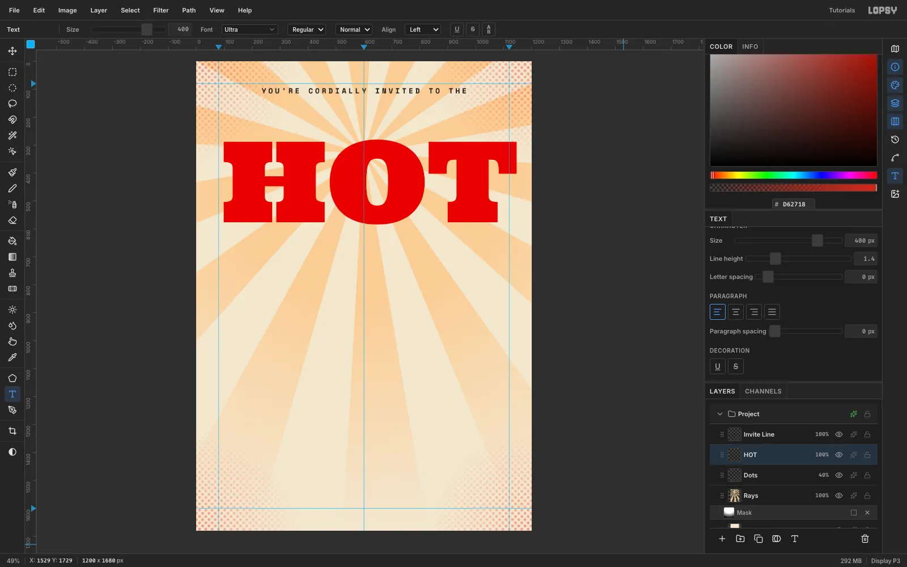

Select the *Dots* layer, so new type doesn't restyle anything, and pick the
**Text** tool. In the Text panel, set **Letter spacing** to 8. Type
`YOU'RE CORDIALLY INVITED TO THE` in **Space Mono**, weight 700, at 26 px in
ink. With the Move tool, click **Align center horizontally**, then nudge it
so the tops of the letters sit at **y 96**.

Reset the letter spacing to 0 and type **HOT** in **Ultra** at **400 px**.
Ultra is a chunky slab serif that looks like cut wood type.

## Scale HOT to the margins

Click **Rasterize Layer** at the bottom of the Layers panel. Draw a marquee
around the letters, switch to the **Move** tool, and hold [[Cmd]] while you
drag the bottom-right handle. [[Cmd]] keeps the scale uniform. Stop when the
letters are **1040 px** wide, then press [[Cmd+D]] to commit.

Move the word so its top-left corner is at **(80, 150)**. Use the arrow keys
for the last few pixels.

## Fill the letters with a flame gradient

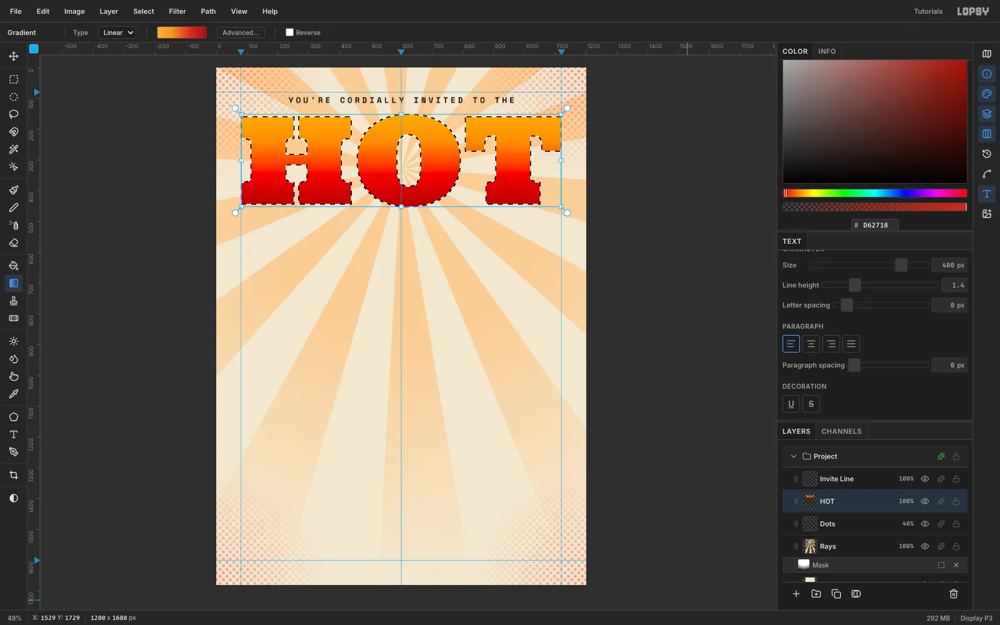

Pick the **Magic Wand**, untick **Contiguous**, and click one letter. All three
letters are now selected.

Set gradient stops of `#FFB22E` (0), `#F7931E` (30%), `#E0301A` (65%) and
`#A80F12` (100%). Drag a **Linear** gradient straight down from the top of the
letters (y 150) to the bottom (y 453). Heat rises, so the top is hot yellow
and the bottom is thick sauce red.

## Paint the sauce drips

Deselect. Pick the **Brush** at **Hardness 100** with `#A80F12`, the same red
as the bottom of the gradient. Starting just inside a letter's bottom edge
(y 436), paint ten vertical drips at sizes **16–26 px**, 38 to 98 px long.

Finish each drip with an Elliptical Marquee blob about 1.6 times the brush
width and **Edit → Fill**. Put the drips where letters have flat feet: two or
three under each H stem, the O's curve and the T's stem. Vary the lengths so
they don't look like a comb.

## Add a keyline and a hard shadow

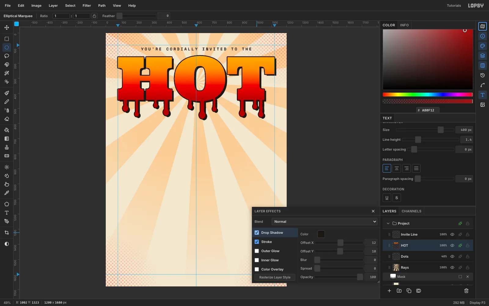

Open **Layer effects** on *HOT*. Enable **Stroke** in `#1B1714`, **Width 5**,
and **Drop Shadow** in `#1B1714`: **Offset X 12**, **Offset Y 10**,
**Blur 0**, **Opacity 100**.

The keyline keeps the pale top of the gradient from dissolving into the
cream paper. The hard shadow is the first use of the 12 / 10 offset. Because
the effects wrap the whole layer, the drips get them too.

## Set Sauce in a tilted script

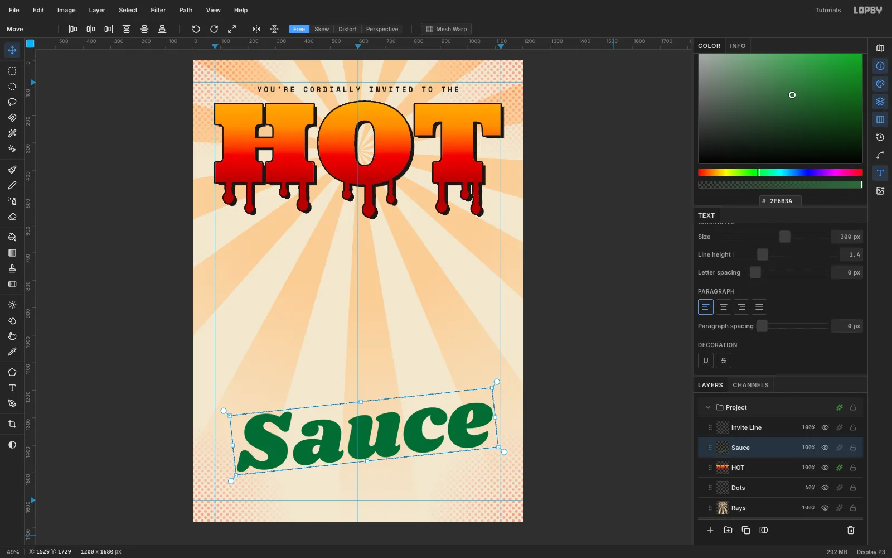

With *HOT* selected, type **Sauce** in **Shrikhand** at **300 px** in
`#2E6B3A`. It's the one cool colour in the design. Rasterize it, draw a
marquee around it, and drag just outside the top-right corner with the Move
tool to rotate it **−6°**. Press [[Cmd+D]].

Rasterize type before you rotate it. That way the next text click can't pick
up the live layer.

Draw a new marquee and [[Cmd]]-scale Sauce to **1000 px** wide, then move it
to **(100, 590)**. Its left edge should sit just inside the margin, and every
drip should clear its cap line. Give it the same **Stroke 5** and **Drop
Shadow 12 / 10** as HOT.

## Cut an inline stripe through SOCIAL

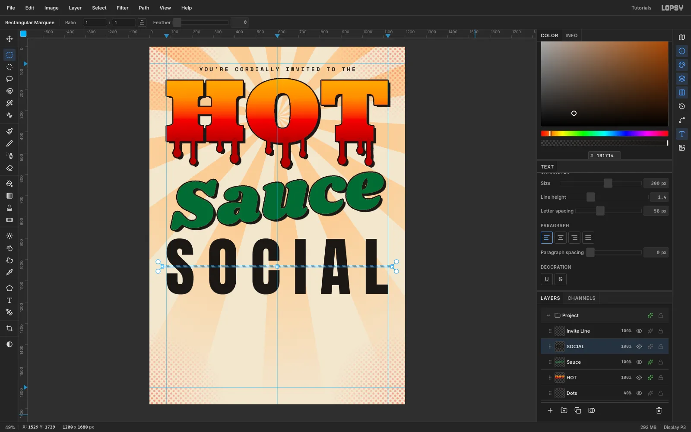

Set **Letter spacing** to 58 and type **SOCIAL** in **Anton** at **300 px**
in ink. Adjust the tracking until the word spans exactly **1040 px**, then
centre it with its top at **y 900**. Rasterize it.

Untick **Snap**, because it can collapse a thin marquee. Draw a **5 px** tall
Rectangular Marquee right across the middle of the cap height (y 1030) and
press [[Delete]]. This one clean cut gives an "inline" wood-type look. Two
cuts looked like a glitch.

## Offset a red plate under SOCIAL

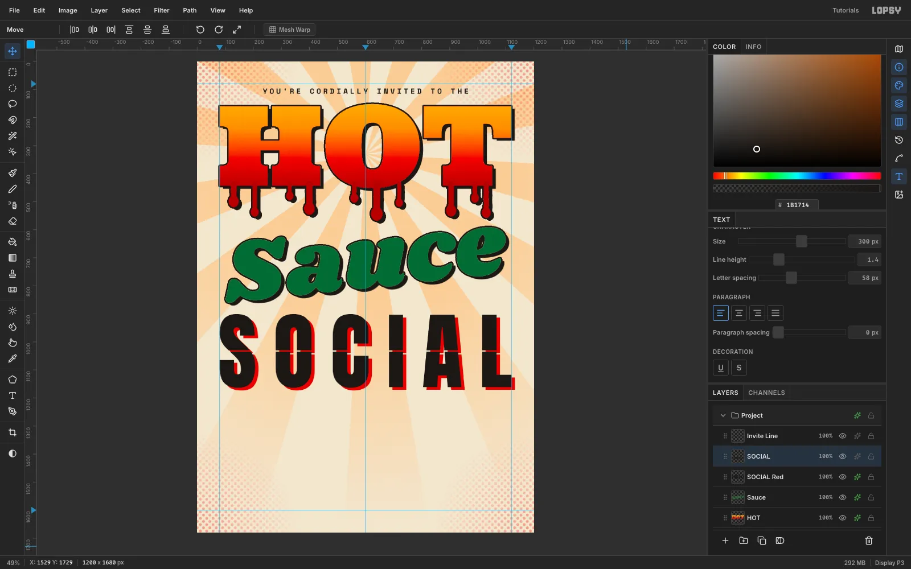

Choose **Layer → Duplicate Layer**. The copy lands 10 px down and right, so
nudge it back with [[Shift+Left]] and [[Shift+Up]].

Select the original underneath, add a **Color Overlay** in `#D62718`, and
nudge it **12 px right, 10 px down**: [[Shift+Right]] then two [[Right]]
presses, and [[Shift+Down]]. Rename the layers *SOCIAL* and *SOCIAL Red*.

The red plate peeks through the inline cut, like a second ink run that
missed the first.

## Type the heat scale

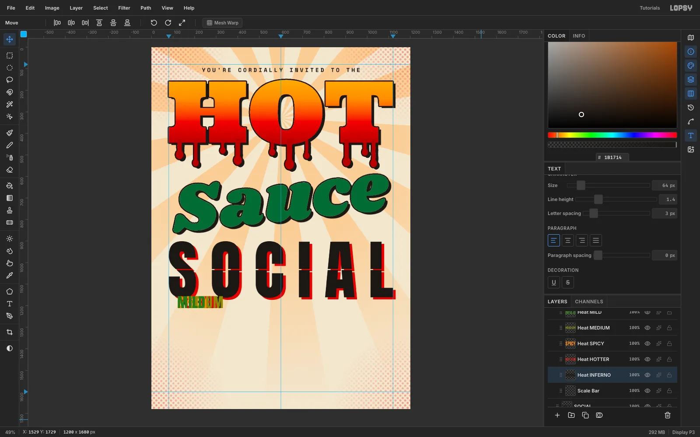

With *SOCIAL* selected, click **New Group** and name it *Heat Scale*. Add a
layer inside it called *Scale Bar*. Select *Scale Bar* before each word, so
the words land in the group without restyling each other.

Type each word in **Anton 64 px** with letter spacing 3, then rasterize it.
Use a single face for the whole scale. Five different fonts read as a font
sampler, and "SPICY" avoids repeating the headline's HOT.

- **MILD** `#3E7D2A`
- **MEDIUM** `#8C8A1A`
- **SPICY** `#F28A1E`
- **HOTTER** `#D62718`
- **INFERNO** `#1B1714`

Justify the row across the margins with equal gaps. The words total 868 px,
so each of the four gaps is 43 px. Their left edges sit at x **80, 248, 500,
687 and 913**, all on one baseline at **y 1275**.

## Add a gradient scale bar

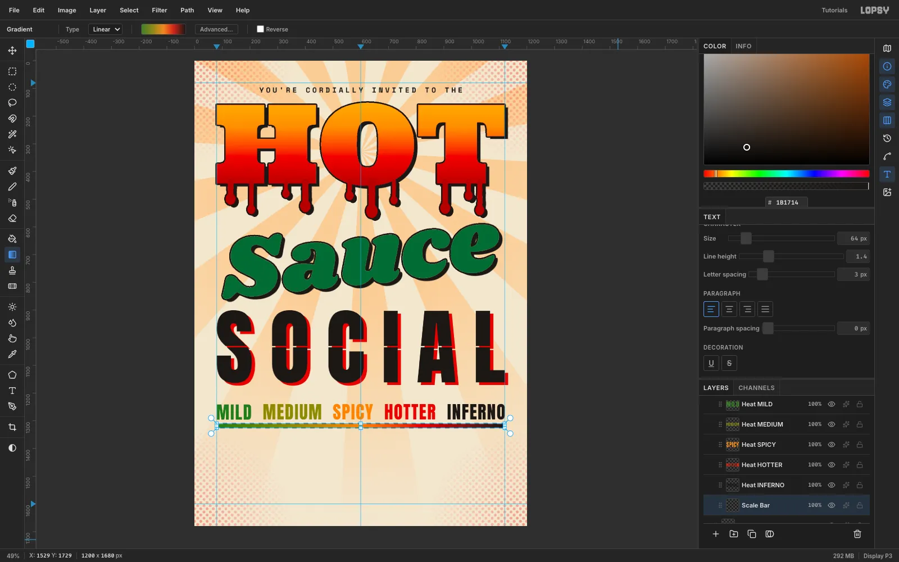

On *Scale Bar*, build a **1040 × 16** capsule at **y 1290** from a
Rectangular Marquee plus two circle ends, filled in ink. Magic Wand it, then
drag a **Linear** gradient from x 80 to x 1120 using the five heat colours as
stops: 0, 25, 50, 72 and 100%.

Label the ends in **Space Mono 700, 20 px**: `0 SHU` flush left and
`2,000,000+ SHU` flush right, with their tops at **y 1318**.

> **Tip:** Once the row is built, click the *Heat Scale* group row and drag
> it with the Move tool to move the words, bar and labels together. Undo and
> redo put the whole group back exactly.

## Build the BYOB badge

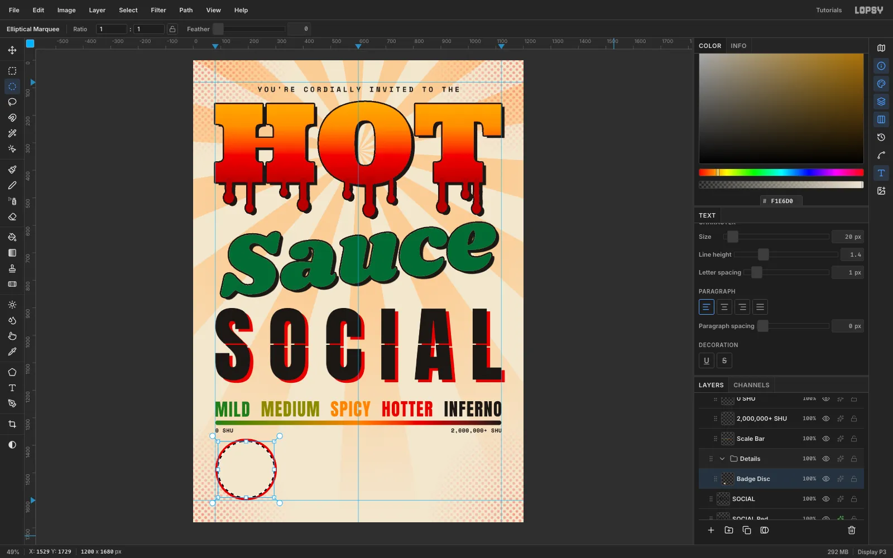

Select *SOCIAL* again and create a *Details* group with a *Badge Disc* layer
inside it. Draw a **224 px** Elliptical Marquee centred on **(192, 1488)**.
Its left edge sits on the 80 px margin and its bottom on the 1600 guide. Fill
it with `#D62718`.

Choose **Select → Shrink…** by **9** and fill with the paper colour. Then
**Shrink** by **4** more and fill red again. That leaves a crisp 4 px cream
ring. Add a **Drop Shadow** in ink at **8 / 7**, blur 0. The badge is
smaller, so it gets a slightly smaller offset.

## Draw a chili with the Lasso

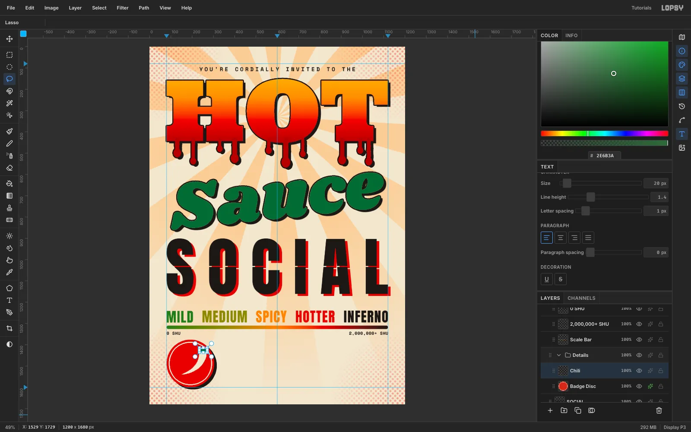

On a new *Chili* layer, lasso a tapered crescent in `#F1E6D0`. It should be
fat at the shoulder and curve down to a sharp point. Lasso a small green
`#2E6B3A` calyx on top and a thin curled stem.

Draw a marquee around the chili and [[Cmd]]-scale it to about **64%**. Then
drag it with the Move tool until it's centred on the badge.

## Run text around the badge

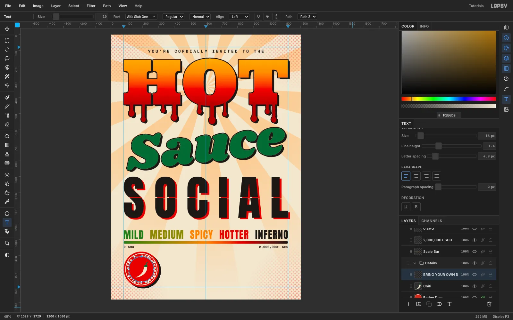

Pick the **Shape** tool, set Shape to **Ellipse** and Output to **Path**, and
drag from the badge centre out 80 px. That makes a circular path starting at
12 o'clock.

With *Chili* selected, set letter spacing to **6** and type
`BRING YOUR OWN BOTTLE • BYOB • ` in **Alfa Slab One**, 16 px, `#F1E6D0`.
Paste it if your keyboard can't type the bullets. Press [[Tab]], then choose
the path in the Text options bar's **Path** dropdown.

Adjust the letter spacing until the gap at the seam matches the gaps around
the bullets. At this size and radius, 6 closes the circle evenly.

## Set the details block

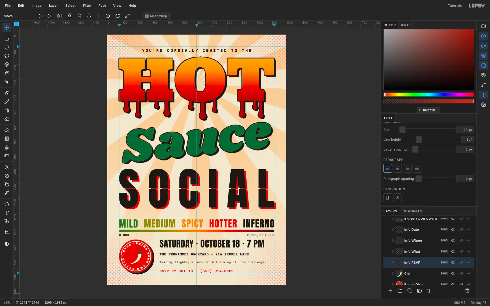

Line the details up with the badge. The block starts at **x 352**, its first
line's cap top matches the badge top (**y 1376**), and its last line sits on
the 1600 guide:

- **Date:** `SATURDAY · OCTOBER 18 · 7 PM`, Anton 60 px, letter spacing 3.5, so it ends right on the 1120 margin under INFERNO. Top at y 1376.
- **Where:** `THE FERNANDEZ BACKYARD — 214 PEPPER LANE`, Courier Prime 700, 25 px. Top at y 1467.
- **What:** `Tasting flights, a taco bar & the wing-of-fire challenge.`, Courier Prime 400, 21 px. Top at y 1520.
- **RSVP:** `RSVP BY OCT 10 · (555) 014-8822`, Space Mono 700, 23 px, `#D62718`. Top at y 1576.

The three gaps between the lines are equal, so the block reads as one unit
with the badge.

## Trim the drips so Sauce can breathe

Check that every drip clears Sauce by at least 30 px. For any that don't,
draw a marquee over the bottom of the drip on the *HOT* layer and scrub it
out with the **Eraser** at **Size 60**. The marquee keeps the eraser off
everything else.

Fill a new ellipse drop about 22 px higher. The stroke and shadow re-wrap the
new end automatically.

## Add a fine print grain

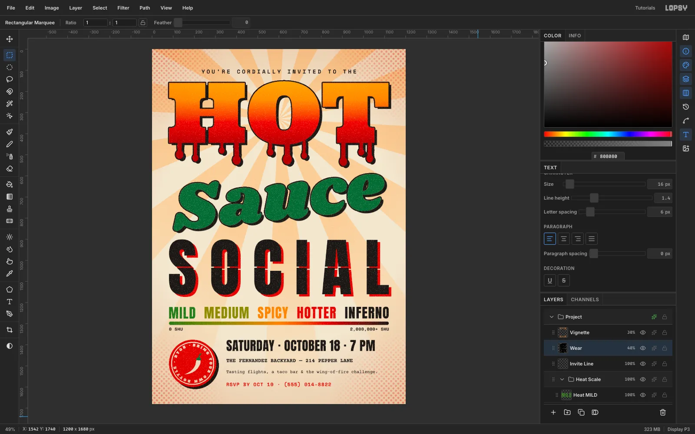

Add a layer called *Wear*. Fill it with `#808080`, run **Filter → Add
Noise…** at **Amount 100** in **Mono**, then **Filter → Threshold…** at
**174**. About 4% of the pixels are now white specks on black.

Set the layer to **Lighten** at **40%**. The black does nothing, and the white
specks knock tiny holes of paper colour into the ink.

Drag the layer's grip to the top of the Layers panel, so the grain covers
every element evenly.

> **Tip:** Skip the Clouds filter here. Clumpy wear looks like dirt at poster
> size. An even, fine grain looks like ink on paper.

## Finish with a warm vignette

Add a top layer called *Vignette*. Drag a **Radial** gradient from the page
centre **(600, 840)** to **(600, 1900)**. Use `#C77A3A` stops: transparent
from 0 to 55%, then fully opaque at 100%. Set it to **Multiply** at **30%**.

This warms the edges without the muddy brown of a burn. Hide the guides with
**View → Show Guides**, then **File → Quick Export PNG**.
