A type foundry checks a new stencil face by cutting the letters out of card, photographing them and spraying a few test proofs. Then it marks up the contact sheet with a grease pencil. This tutorial recreates that sheet for **Rivet & Kerf**, an invented stencil typeface. (A *kerf* is the width of a cut.) Three strips of 35 mm film run across the page. Each frame shows a manila card with one letter cut through it, so together they spell the name. The last two frames are spray-paint proofs.

Typography carries this piece. The letters are cut-out holes, the header sits on a baseline grid, and the film's edge print is set in a mono font so the frame numbers land exactly under each frame.

Along the way you'll use:

- **Define Pattern** and **Fill with Pattern** to punch rows of sprocket holes
- **Cmd-clicking** a layer thumbnail to load a letter as a selection, then **Delete** to cut it out of another layer
- the **Spray** tool inside a selection, both for overspray residue and for solid spray-painted letters
- rotating selections with the **Move** tool, **Select → Inverse**, **Grow** and **Shrink**
- **Copy Merged** and a **Cmd**-corner scale to build a magnifying loupe
- the **Drop Shadow**, **Inner Glow** and **Color Overlay** effects, a radial gradient vignette, and the **Screen** blend mode
- live text in **Stardos Stencil**, **Big Shoulders Stencil**, **IBM Plex Mono** and **Permanent Marker**, with **Line height** and a rotated note
- copy and paste, groups and group nudges

The palette is warm paper and black film, with manila card and two inks:

- Paper `#EFEAE0`, film `#16140F`, workbench `#2C2823`, hole shade `#0D0B08`
- Manila `#D9BC84`, proof card `#F3EFE7`, masking tape `#E6DAB8`
- Spray black `#1A1714`, spray red `#D42A1E`
- Edge print `#E3C04A`
- Sheet number `#C8231B` → `#A8382C`, grease pencil `#C42A20`
- Loupe ring `#1B1916`, ring highlight `#A8A196`

> **Tip:** The film strips are a grid, so the early steps give exact positions. The **Info** panel shows the pointer position and the size of the selection while you drag. If you'd rather not measure, open the project with the **Follow along** button and trace over it.

## Set up the paper and guides

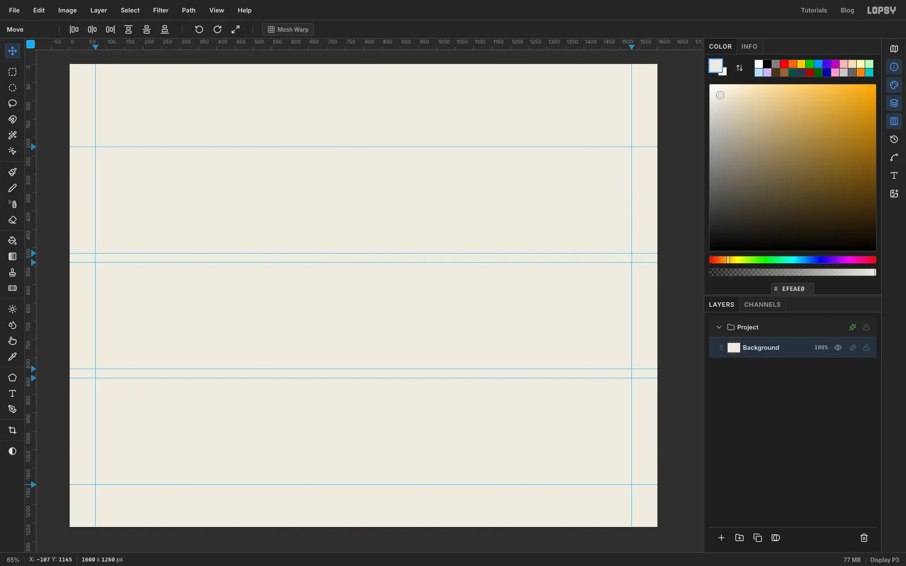

Open [Lopsy](/). In the **New Document** dialog, set **Width** to `1600` and **Height** to `1260`, choose a **White** background and click **Create**.

1. Delete **Layer 1** with the trash button at the bottom of the Layers panel. You'll make every layer yourself.
2. Select **Background**, set the foreground colour to `#EFEAE0` and choose **Edit → Fill**. With nothing selected, it fills the whole layer.
3. Choose **Filter → Add Noise…**, set **Amount** to `4` and pick **Mono** and **Gaussian**. That gives the paper a faint tooth.
4. Click the top ruler at `70` and `1530` for the side margins.
5. Click the left ruler at `225`, `515`, `540`, `830`, `855` and `1145`. Those are the top and bottom of three film strips, 290 px tall with 25 px of paper between them.

> **Tip:** Marquees snap to guides. If a small marquee near a guide jumps onto it, zoom in, or turn off **View → Snap to Guides** for that step.

## Lay down the first film strip

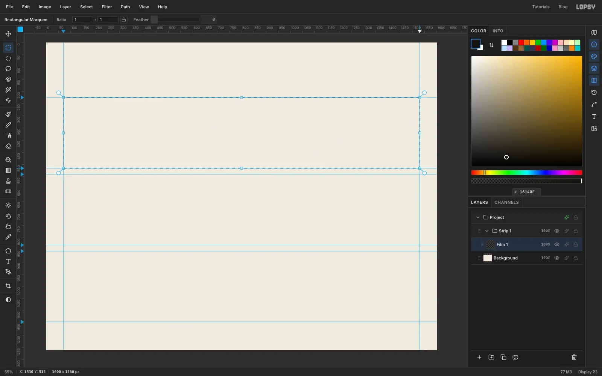

Click **New Group** in the Layers panel and rename the group `Strip 1` (double-click its name). With the group selected, click **Add Layer**. The new layer goes inside the group. Rename it `Film 1`.

Pick the **Rectangular Marquee**. Drag from where the left margin guide meets the `225` guide to where the right margin guide meets the `515` guide. Set the foreground to `#16140F`, choose **Edit → Fill**, then deselect with [[Cmd+D]].

## Cut four frame windows

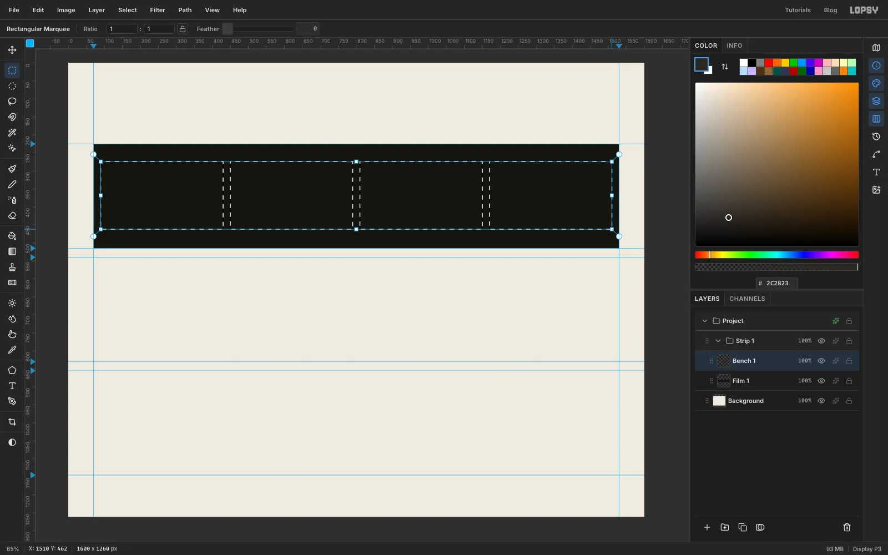

Each frame is a photo, and the dark workbench in it shows around the stencil card. Add a layer named `Bench 1`.

The frames sit 20 px in from the strip ends, with room above for the edge print and below for the frame numbers. Draw a 340 × 188 marquee whose top-left corner is at `90, 274`. Hold [[Shift]] and drag three more of the same size starting at `450`, `810` and `1170` on the same line. **Shift** adds each new rectangle to the selection, so you get four windows with 20 px gaps.

Fill them with `#2C2823`. Then run **Add Noise** with **Amount** `7`, Mono and Gaussian, so the bench has some grain. Deselect.

## Draw a perforation tile

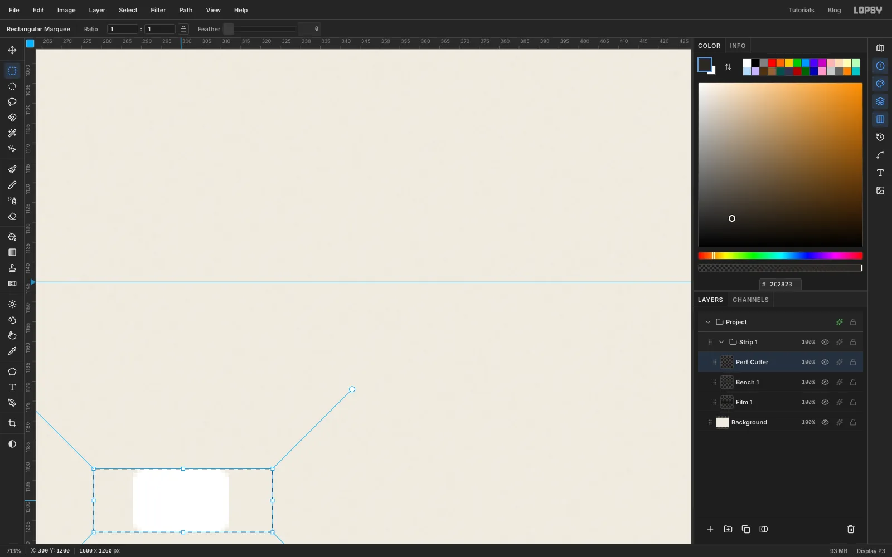

Sprocket holes are a repeating pattern, so you make one and let **Fill with Pattern** do the rest. Add a layer named `Perf Cutter` and zoom into an empty patch of paper below the strips.

1. Pick the **Shape** tool, set **Shape** to **Rectangle**, **Corner Radius** to `3` and the fill to white. Click once (without dragging) and enter `24` × `16` in the size dialog.
2. Draw a marquee around the hole that is **45 px wide and exactly 16 px tall**, with the hole 10 px from its left edge. The width is the spacing from one hole to the next. The height matches the hole, so the holes stack without seams.
3. Choose **Edit → Define Pattern**. With a selection active, only the selected pixels become the tile.
4. Press [[Delete]] to clear the tile (it has served its purpose) and deselect.

## Fill the perforation rows

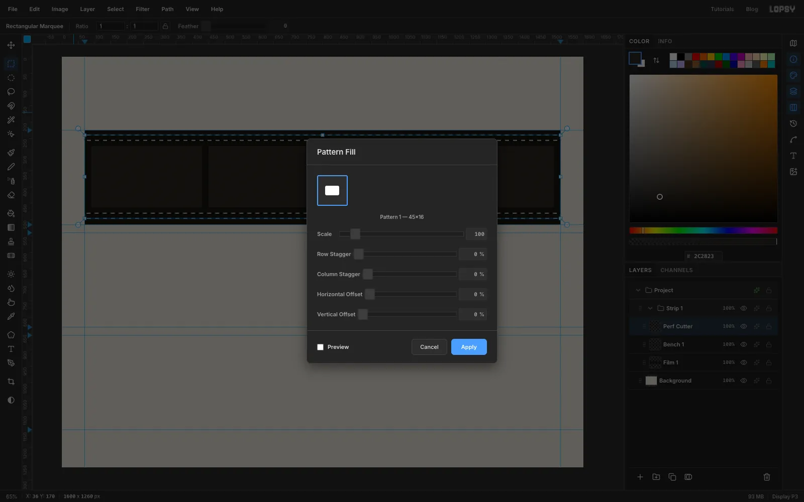

Lopsy tiles a pattern from the canvas's top-left corner. So if a row starts on a multiple of the tile's 16 px height, each row of tiles covers exactly one row of holes.

Still on `Perf Cutter`, draw a marquee across the whole strip from `y 240` to `256`. Hold [[Shift]] and add a second row from `480` to `496`. Choose **Edit → Fill with Pattern…**, pick the pattern you just made, leave **Scale** at `100` and click **Apply**. Deselect.

The holes land 10 px off the frame grid, so switch to the **Move** tool and press [[←]] ten times. Now the first hole starts at x `90`, in line with the first frame, and there's 20 px to spare at each end.

## Punch the holes through the film

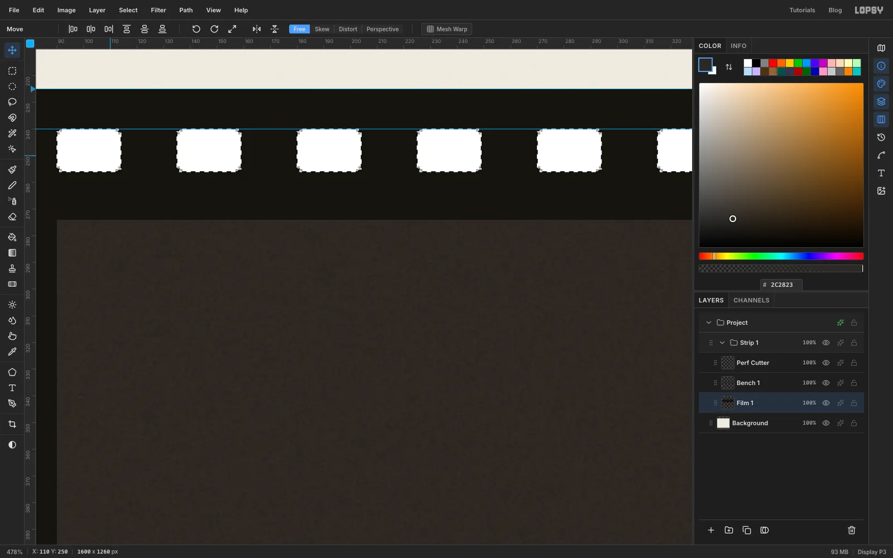

1. **Cmd-click** the `Perf Cutter` thumbnail in the Layers panel. That loads its pixels as a selection.
2. Click the `Film 1` row and press [[Delete]]. The holes are now cut through the film, and the paper shows through.
3. Deselect and delete the `Perf Cutter` layer.
4. Select `Bench 1` and choose **Layer → Merge Down** so the strip is one layer.

## Copy the strip twice

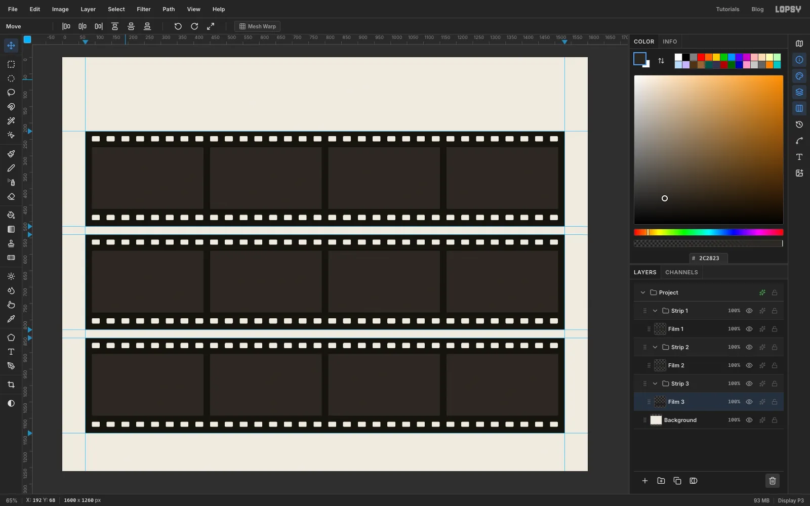

1. Click **Background**, then **New Group**. The group lands above Background, outside `Strip 1`. Name it `Strip 2` and add a placeholder layer inside it.
2. Select `Film 1` and press [[Cmd+A]], then [[Cmd+C]].
3. Select the placeholder and press [[Cmd+V]]. The copy is pasted in exactly the same place, already selected, with the Move tool active.
4. Press [[Shift+↓]] 31 times and [[↓]] 5 times to move it down 315 px. (**Shift**+arrow moves 10 px at a time.)
5. Deselect, rename the pasted layer `Film 2` and delete the placeholder.
6. Do the same for `Strip 3`, moving it down 630 px.

## Cut manila cards and set the letters

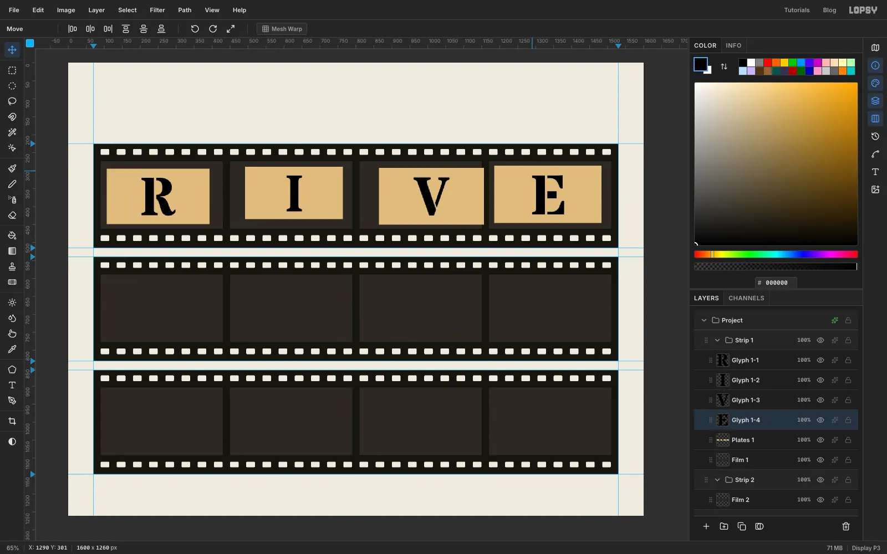

Select `Film 1` and add a layer named `Plates 1` above it.

With the **Rectangular Marquee**, draw a card in each frame: a rectangle about 286 × 154 px. Shift-add the other three. Don't centre them perfectly. Offset each one by up to 15 px and make them slightly different sizes, so the frames look like four separate photos. Place the third card about 30 px right of centre, so it hangs off its frame. Fill with `#D9BC84` and run **Add Noise** with **Amount** `5`.

Now set the letters. Pick the **Text** tool, choose **Stardos Stencil**, weight **Bold**, size `150`, colour black. Click on the first card, type `R` and press [[Tab]] to commit. Click with `Plates 1` selected each time and type `I`, `V` and `E` on the other cards. Each letter lands on its own layer above `Plates 1`.

Switch to the **Move** tool and centre each letter on its card with the arrow keys. Then select each letter layer and click **Rasterize Layer** (the **T** button at the bottom of the Layers panel). You're about to use them as cutters.

## Knock the letters out of the card

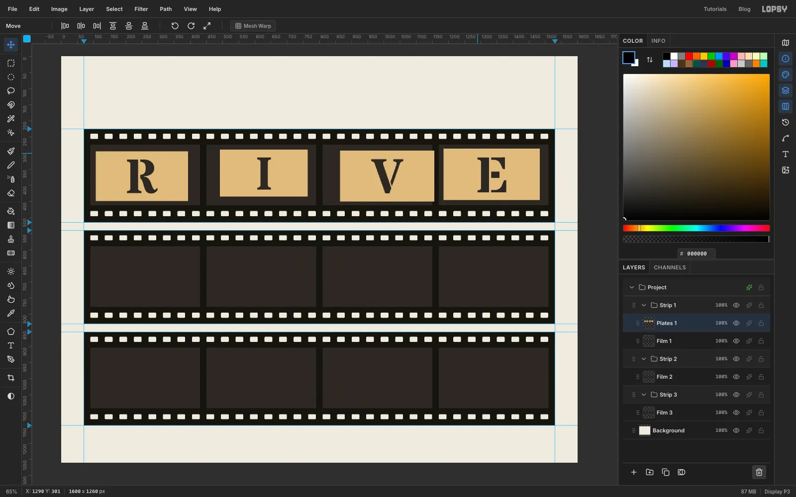

For each letter:

1. **Cmd-click** the letter's thumbnail to select its shape.
2. Click `Plates 1` and press [[Delete]].
3. Delete the letter layer.

Stardos Stencil has bridges in its letterforms: the little gaps that keep a stencil's inner pieces from falling out. They come through as card. What you see through the holes is the bench on the film layer, just as you'd see the bench through a real stencil.

## Spray some residue around the cuts

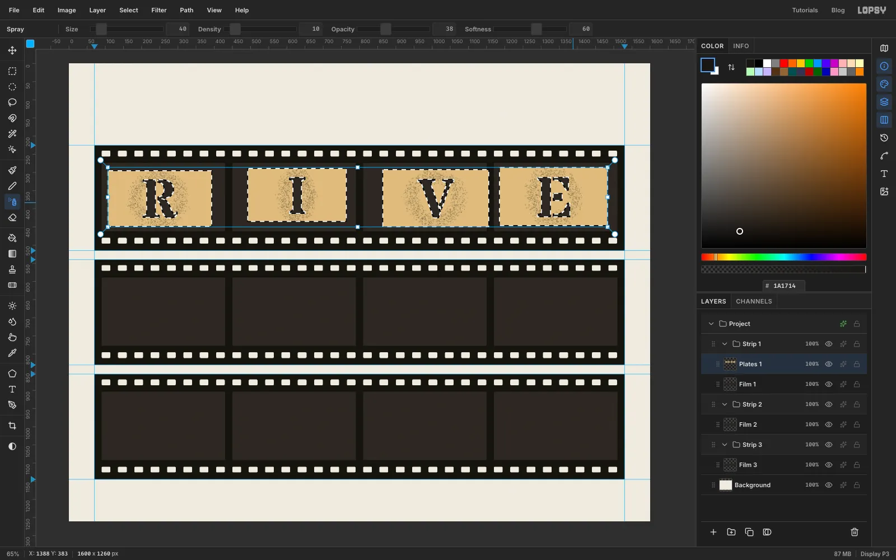

A used stencil has paint on it. **Cmd-click** the `Plates 1` thumbnail. That selects the card but not the holes, so no paint can land in them.

Pick the **Spray** tool and set **Size** `40`, **Density** `10`, **Opacity** `38` and **Softness** `60`. With the foreground at `#1A1714`, drag a loose, wobbly loop around each letter, then a second, tighter one. Make each loop a slightly different shape so no two cards match. Deselect when you're done.

## Tilt each card

Real cards never sit square. For each card:

1. Draw a rectangular marquee around the card with a few pixels to spare.
2. Switch to the **Move** tool. Transform handles appear around the box, with round rotation handles sticking out from the corners. Drag a rotation handle to turn the card a degree or two, just enough that its edges aren't square.
3. Press [[Cmd+D]] to commit.

Turn neighbouring cards in opposite directions. The holes and the residue are on the same layer, so they turn with the card.

## Crop the cards to their frames

The third card hangs past the right edge of its frame, the way a careless photographer would frame it. It needs trimming at the frame line.

Draw the four 340 × 188 frame windows again (Shift-add as before), then choose **Select → Inverse**. With `Plates 1` active, press [[Delete]] and deselect. Anything outside the frames is gone, and the third card now looks cropped by the camera.

## Give the cards depth

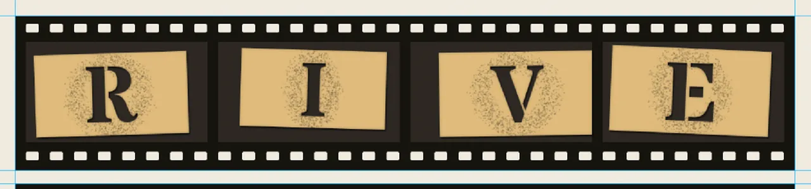

Click the effects button (the sparkle icon) on the `Plates 1` row to open the effects drawer. Tick and set:

- **Drop Shadow**: **Offset X** `2`, **Offset Y** `3`, **Blur** `4`, **Opacity** `60`
- **Inner Glow**: colour black, **Size** `8`, **Opacity** `25`

The shadow lifts the card off the bench and falls into the top and left edges of each cut, which helps them read as holes. The inner glow darkens the card's edges like a photo would.

## Repeat for strips two and three

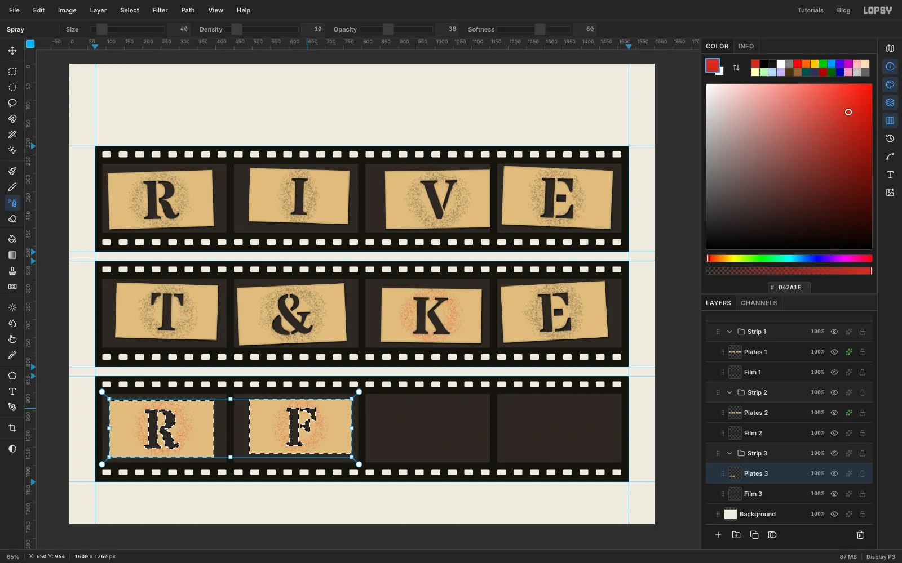

Repeat the last six steps for the other two strips. Each time, select the strip's film layer first (`Film 2`, then `Film 3`) so the new `Plates 2` and `Plates 3` layers land in the right group. Everything sits 315 px lower per strip: strip 2's frame windows start at `y 589` and strip 3's at `904`.

- **Strip 2:** `T`, `&`, `K` and `E`.
- **Strip 3:** `R` and `F` in frames 9 and 10. Leave frames 11 and 12 empty for now.

Vary the details so the frames don't look cloned. The K plate in strip 2 and both plates in strip 3 were used for red paint, so spray their residue in `#D42A1E`. Give the second E a different tilt and offset from the first, so it doesn't look like a duplicate photo.

## Spray paint inside a letter

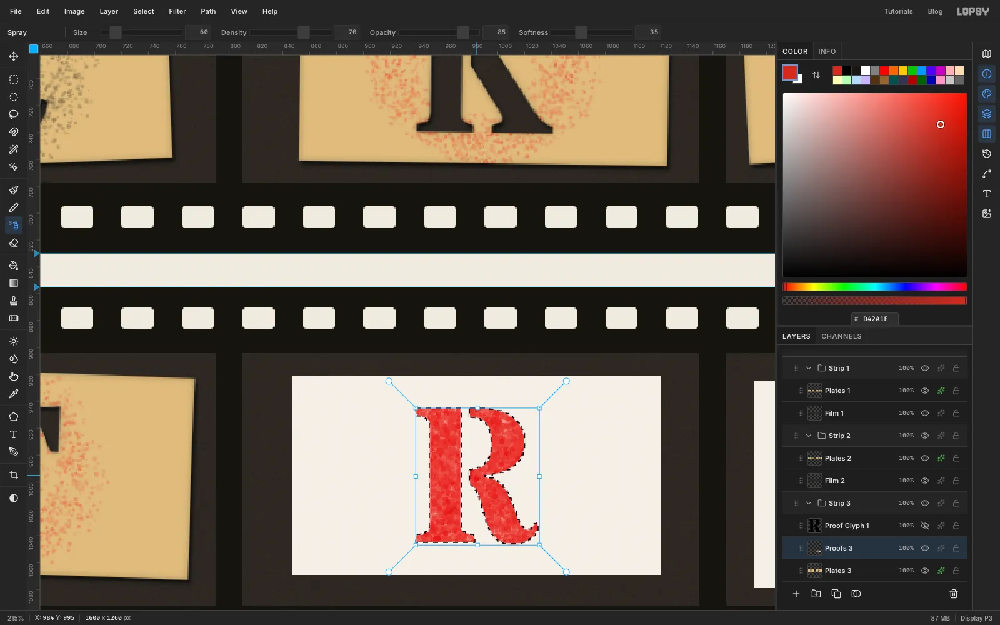

The last two frames are test proofs: what the stencil sprays onto paper. Add a layer named `Proofs 3` above `Plates 3` and draw two cards with the marquee in frames 11 and 12. Fill them with `#F3EFE7` and add noise at `3`.

1. Type an `R` in Stardos Stencil Bold at `144`, slightly smaller than the cut letters because the proof card is smaller. Centre it on the first proof card and rasterize it.
2. **Cmd-click** its thumbnail, then hide the letter layer with its eye icon so you can see the paint.
3. Select `Proofs 3`. Set the **Spray** tool to **Size** `60`, **Density** `70`, **Opacity** `85` and **Softness** `35`.
4. With the foreground at `#D42A1E`, zigzag back and forth over the letter until it is nearly solid.

The selection keeps the edges crisp and the speckle inside reads as spray paint. Deselect and delete the letter layer.

## Spray a misregistered proof

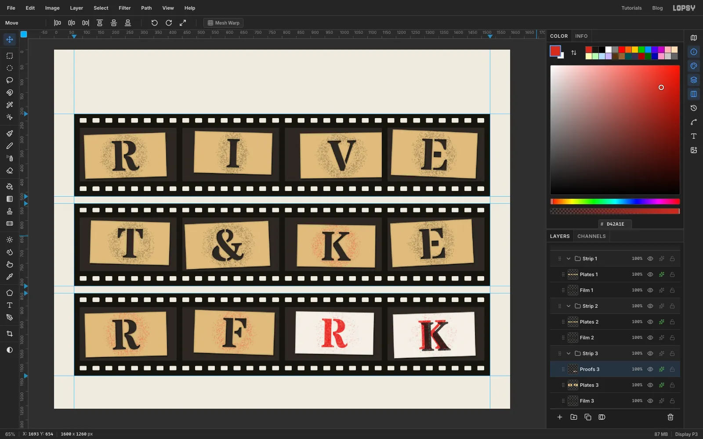

Frame 12 gets two coats that don't quite line up:

1. **Red pass:** type a `K`, centre it on the second card, then press [[↑]] and [[←]] 4 times each. Rasterize it and spray it red exactly as before.
2. **Black pass:** type a second `K`, centre it, then press [[↓]] and [[→]] 5 times each. Rasterize it and spray it in `#1A1714`.

The red peeks out along one side, like a stencil that slipped between coats.

To finish the proofs:

1. **Cmd-click** the `Proofs 3` thumbnail. Spray a soft red mist around both letters with **Size** `46`, **Density** `6`, **Opacity** `28` and **Softness** `70`.
2. Tilt each card with a marquee and a rotation handle.
3. Give the layer the same Drop Shadow, with an Inner Glow at `14` opacity.

## Add a photographic vignette to every frame

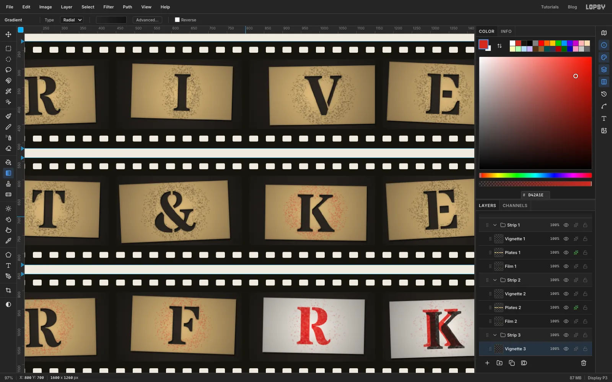

Pick the **Gradient** tool, set **Type** to **Radial** and open **Advanced…**. Use two black stops: the first at **0%** opacity and the last at **50%**.

Add a layer named `Vignette 1` above `Plates 1`. For each frame, marquee the 340 × 188 window and drag the gradient from the frame's centre to just past its bottom-right corner. Do the same for strips 2 and 3. In strip 3, put the layer above `Proofs 3` so the proof cards get the vignette too.

## Set the header type

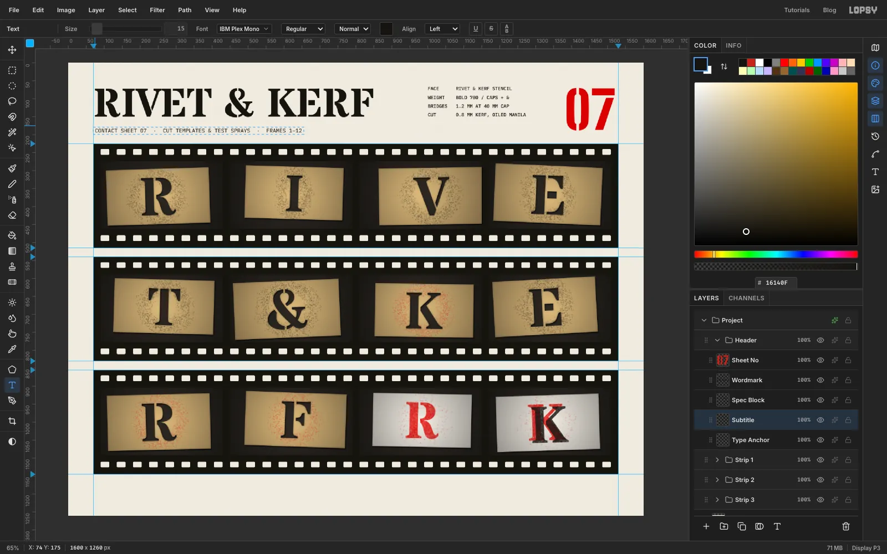

Collapse `Strip 1`, `Strip 2` and `Strip 3` with the arrows on their rows. When a group is expanded, a new group goes inside it; when it's collapsed, the new group goes above it.

Click the collapsed `Strip 1` group and click **New Group**. Name it `Header`, then add an empty layer inside it called `Type Anchor`. New text appears above the selected layer, and if a text layer is selected, changing the font restyles it. Selecting the empty `Type Anchor` before each new piece of type avoids that. Commit each piece with [[Tab]].

- **Sheet number:** `07` in **Big Shoulders Stencil**, **Black**, size `145`, colour `#C8231B`.
- **Wordmark:** `RIVET & KERF` in **Stardos Stencil Bold**, size `112`, colour `#16140F`.
- **Spec block:** four lines in **IBM Plex Mono Medium**, size `13`, colour `#16140F`, pressing [[Enter]] between them. The lines are `FACE`, `WEIGHT`, `BRIDGES` and `CUT`, each padded with spaces to 10 characters, then the value. So `FACE` gets 6 spaces before `RIVET & KERF STENCIL`, `WEIGHT` 4 before `BOLD 700 / CAPS + &`, `BRIDGES` 3 before `1.2 MM AT 40 MM CAP`, and `CUT` 7 before `0.8 MM KERF, OILED MANILA`.
- **Line height:** open the **Text** panel (the **T** icon in the strip on the right) and set **Line height** to `1.86`. Text panel settings carry over to your next text, so set it back to `1.4` before the subtitle.
- **Subtitle:** `CONTACT SHEET 07 · CUT TEMPLATES & TEST SPRAYS · FRAMES 1–12` in **IBM Plex Mono Regular**, size `15`, colour `#16140F`.

## Put the header on a baseline grid

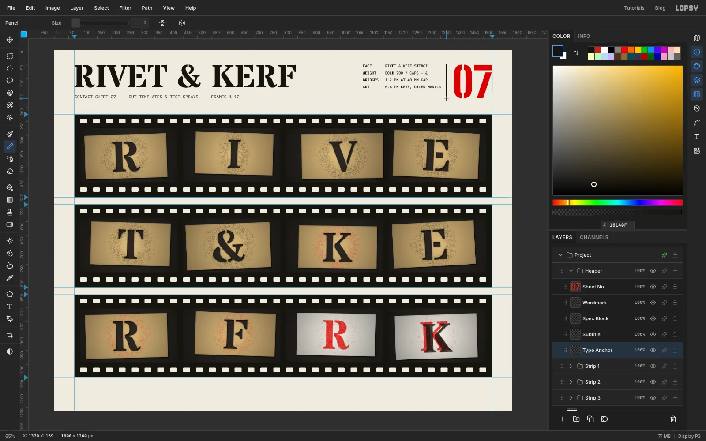

Use the **Move** tool and the arrow keys to line everything up:

1. Put the wordmark on the left margin, with its cap tops at `50`.
2. Put the subtitle on the same margin, with its cap tops at `158`.
3. Put the `07` with its right edge on the `1530` guide and its top at `50`. Its foot lands on the subtitle's baseline.
4. Put the spec block with its cap tops at `50` and its right edge at `1350`.

The **Line height** of 1.86 drops the last spec line onto the wordmark's baseline, so all three blocks share a top and bottom.

Select `Type Anchor` and pick the **Pencil** at **Size** `2` with colour `#16140F`.

- Click at the left margin on `y 192` and **Shift-click** at the right margin for a straight rule.
- Draw a vertical rule the same way at x `1373`, from `y 50` to `169`. That puts it halfway between the spec block and the 07, with 23 px on each side.

## Add the edge print and frame numbers

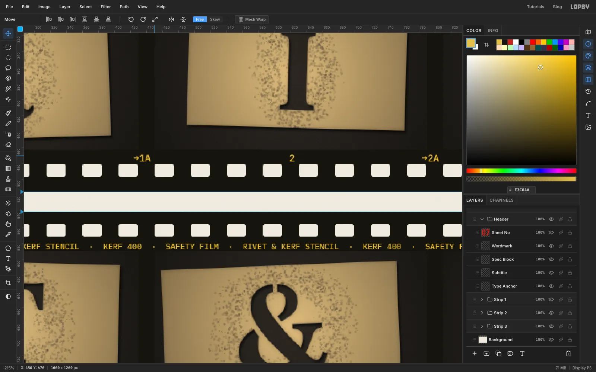

Real film carries a line of yellow writing along its edge. Expand `Strip 1` and select `Film 1`, so the text lands inside the strip.

- **Edge print:** in **IBM Plex Mono Medium** at `10`, colour `#E3C04A`, type `RIVET & KERF STENCIL · KERF 400 · SAFETY FILM ·` over and over. Make it long enough to run from the first frame to the end of the strip, just under the top row of holes. Start strips 2 and 3 a few words into the sequence, so the three strips don't line up like copies.
- **Frame numbers:** in **IBM Plex Mono Medium** at `12`, also `#E3C04A`, one line per strip, just above the bottom holes. Plex Mono's characters are 7.2 px wide at 12 px, so 50 characters is exactly one frame plus its gap (360 px). Click under the centre of the first frame and type the frame number. Add spaces until you've typed 23 characters, then `→1A` to mark the frame line, then spaces until you reach 50. Repeat for each frame, using one fewer space after a two-digit number. Stop after the last number in each strip. Strip 2 counts from 5 and strip 3 from 9.

Collapse each strip again when you're done.

> **Tip:** Use `→` for the arrow. The smaller `▸` triangle that real film uses has no glyph in these fonts and draws as an empty box.

## Add the footer credit and a rotated note

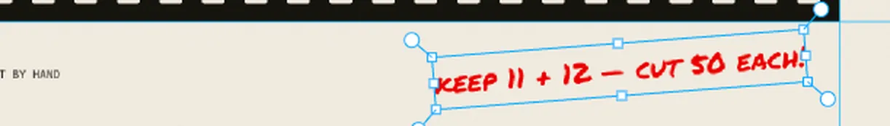

Click the collapsed `Header` group, click **New Group** and name it `Annotations`. Add a layer inside it named `Grease Pencil`.

1. **Credit:** type `RIVET & KERF TYPE CO. · PROOFED 04 OCT 2026 · ROLL RK-07 · EVERY GLYPH CUT BY HAND` in **IBM Plex Mono Regular** at `12`, colour `#16140F`. Put it on the left margin, about 55 px from the bottom.
2. **Note:** type `keep 11 + 12 — cut 50 each!` in **Permanent Marker** at `30`, colour `#D42A1E`. Place it in the bottom-right corner.
3. With the **Move** tool, drag one of the note's corner rotation handles to tip it about 5 degrees anticlockwise. It stays live, editable text.

## Copy a circle of the finished frame

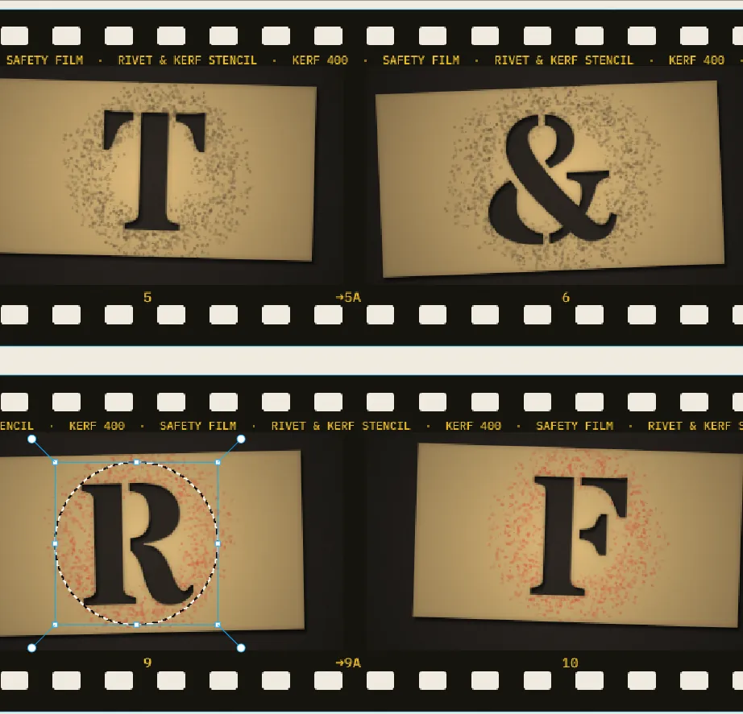

A loupe on frame 9 shows off the stencil bridges. Collapse `Annotations`, click it and click **New Group**, and name the group `Loupe`. Add a temporary layer inside it.

Pick the **Elliptical Marquee** and draw a circle about 140 px across, centred on frame 9's `R`. Choose **Edit → Copy Merged**. That copies everything you can see inside the circle, not just one layer. Select the temporary layer and press [[Cmd+V]]. The circle is pasted in place on a new layer. Rename it `Loupe View` and delete the temporary layer.

## Magnify the view

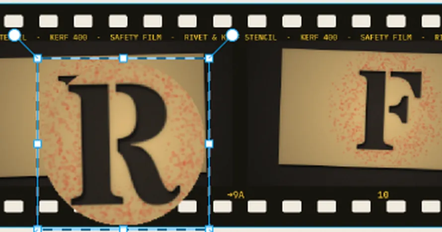

Draw a rectangular marquee around the pasted circle and switch to the **Move** tool. Hold [[Cmd]] and drag the bottom-right handle until the circle is 1.5× its size, about 210 px across. **Cmd** keeps it in proportion. Release, deselect, and nudge it with the arrow keys until it's centred over the R again.

## Add the glass and the rim

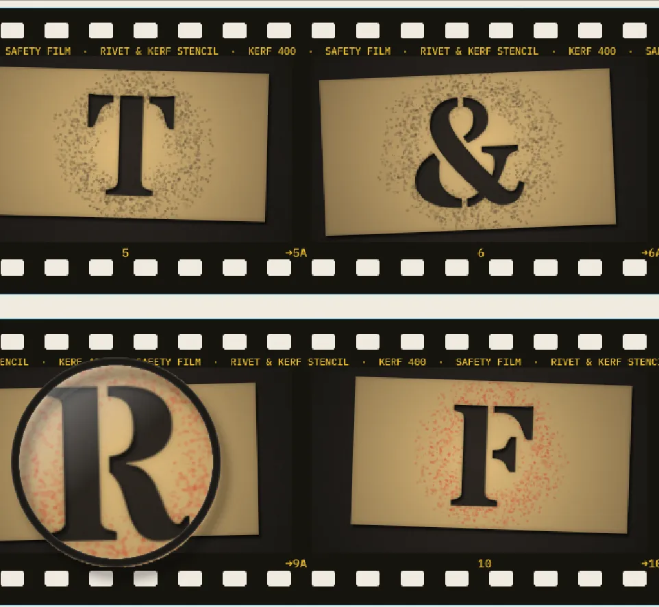

1. **Glass:** add a layer named `Loupe Glass` and draw a circle selection about 196 px across, centred on the loupe. Set the **Gradient** tool to **Linear**, then open **Advanced…** and make both stops white: the first at 100% opacity and the last at 0%. Drag from just inside the top-left of the circle towards its centre. With a white **Brush** at size `6`, draw a short arc at about ten o'clock for a highlight. Set the layer to **Screen** at `40%` opacity.
2. **Rim:** add a layer named `Loupe Ring`. Draw a circle about 212 px across, fill it with `#1B1916`, choose **Select → Shrink…** with `8` px and press [[Delete]]. That leaves an 8 px ring.
3. **Rim effects:** a **Drop Shadow** of **Offset X** `8`, **Offset Y** `12`, **Blur** `16` and **Opacity** `45`, so the loupe sits above the sheet. An **Inner Glow** in `#A8A196`, **Size** `3` and **Opacity** `70`, for a polished metal edge.

## Nudge the loupe

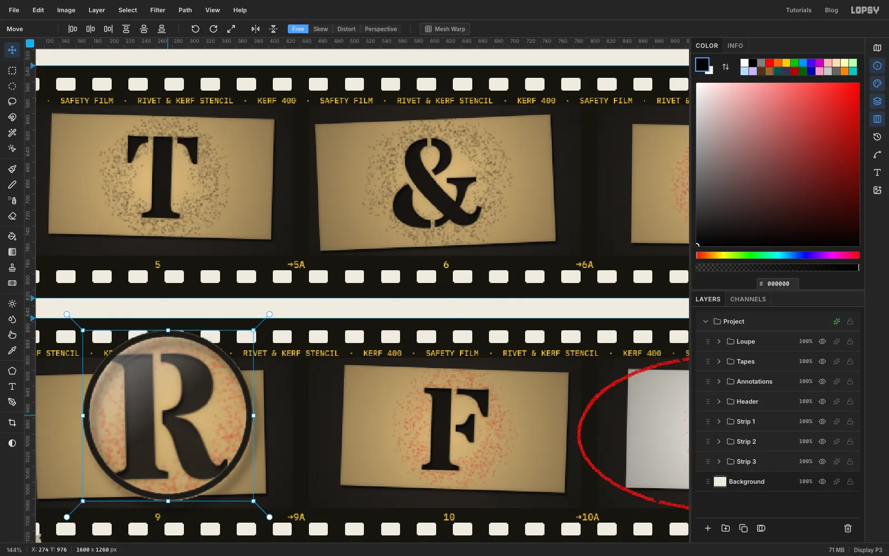

The loupe covers frame 9's number. Select the `Loupe` group itself (not a layer inside it), switch to the **Move** tool and press [[→]] 22 times and [[↑]] 24 times. The view, glass and rim move together, and the 9 shows again.

## Tape the strips down

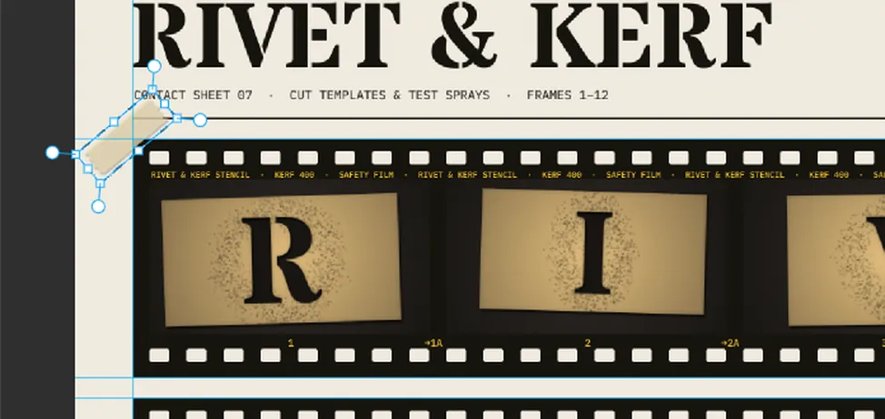

Collapse `Loupe`, click the collapsed `Annotations` group and click **New Group** named `Tapes`, with a layer inside it named `Tape Pieces`. Set the foreground to `#E6DAB8`.

For each piece of tape:

1. With the **Rectangular Marquee**, draw a rectangle about 110 × 34 px.
2. Hold [[Alt]] and use the **Lasso** to draw a zigzag across each end. **Alt** subtracts from the selection, which gives the tape torn ends.
3. Fill and deselect. Then marquee the piece, switch to the **Move** tool and drag a rotation handle to turn it into place.

Don't make the tapes symmetrical. This sheet has:

- a piece across the top-left corner turned 40°
- a short one on the top-right corner at 12°
- one at the bottom-left at a slight angle
- one across each end of the middle strip

Finish with **Add Noise** at `6` and layer opacity `78%`. Add a small **Drop Shadow** of **Offset X** `1`, **Offset Y** `2`, **Blur** `3` and **Opacity** `25`.

## Finishing pass: darken the cut letters

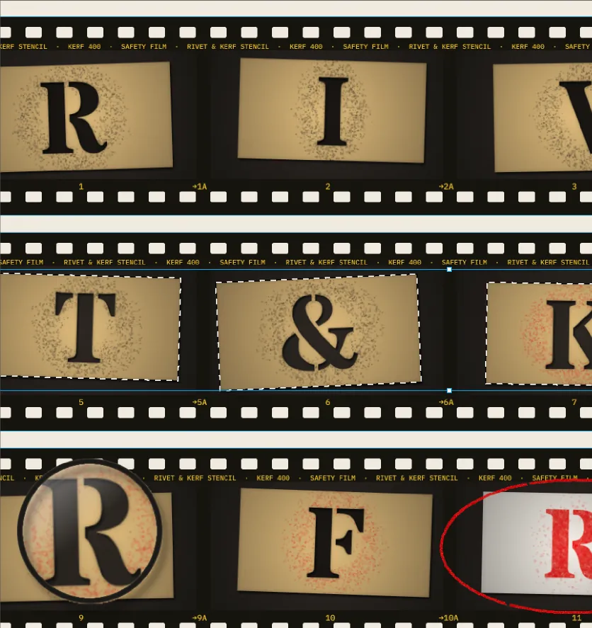

Step back and look at the whole sheet. At this size the bench showing through the holes is about as light as the bench around the cards, so the letters can read as printed rather than cut. Real holes look darker because the card shades them. Add a shade under each layer of cards:

1. **Cmd-click** the `Plates 1` thumbnail. The selection covers the card but not the holes.
2. Choose **Select → Grow…** `20`, then **Select → Shrink…** `20`. Growing fills in every letter-shaped hole, since no stroke is wider than 40 px. Shrinking brings the outer edges back but leaves the holes filled.
3. Select `Film 1`, add a layer named `Hole Shade 1` (it goes between the film and the cards), fill with `#0D0B08` and set it to `60%` opacity.

The cards cover the shade everywhere except through the cuts. Repeat for strips 2 and 3. While you're there, run **Add Noise** at `4` on each **Plates** layer to give the photos some grain.

> **Tip:** If two cards sit closer than 40 px, the grown selection joins them and the shade shows in the gap. Marquee the gap on the **Hole Shade** layer and press **Delete**.

## Refresh the loupe

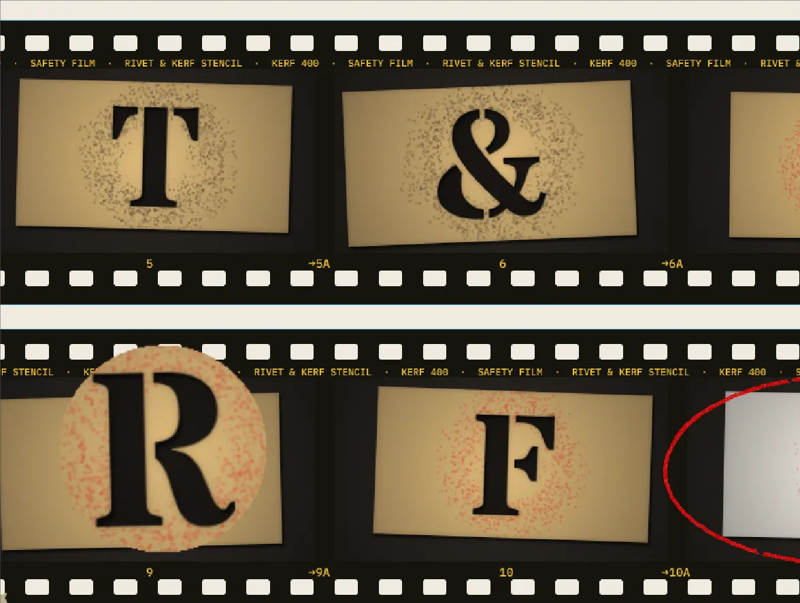

**Copy Merged** takes a snapshot, so the loupe still shows the old, lighter holes. Rebuild just the view:

1. Expand `Loupe` and hide `Loupe Ring`, `Loupe Glass` and `Loupe View` with their eye icons.
2. Draw the same 140 px circle over frame 9's R and choose **Edit → Copy Merged**.
3. Select `Loupe View` and paste. Delete the old `Loupe View` and give the new layer its name.
4. Scale the new view to 150% as before, then nudge it to the loupe's new spot, up and to the right of the R.
5. Show the glass and rim again.

## Mark it up with grease pencil

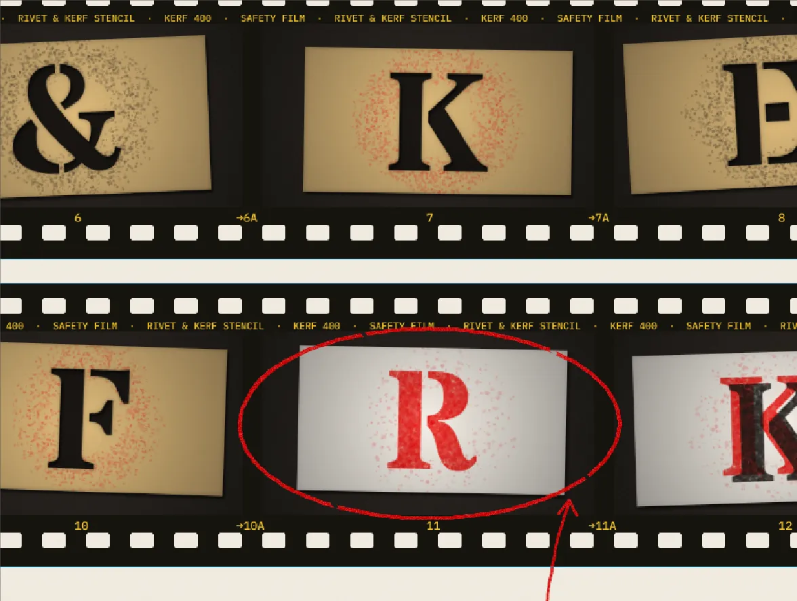

Expand `Annotations` and select `Grease Pencil`. Pick the **Brush** at **Size** `5`, **Hardness** `75`, colour `#C42A20`.

1. Draw one loop around frame 11, overlapping where it starts. Try to keep the bottom between the frame and its number so you don't cross out the 11. The top can brush the edge print, as a hurried pencil would.
2. At **Size** `4`, draw an arrow from the note up to the circle's lower-right edge, with two short strokes for the head.
3. Run **Add Noise** at `60` (Mono) on the layer to break up the colour like wax.
4. Dab a size `4` **Eraser** at a few points to make skips.
5. Set the layer to `92%` opacity.

## Print the 07 in a deeper red

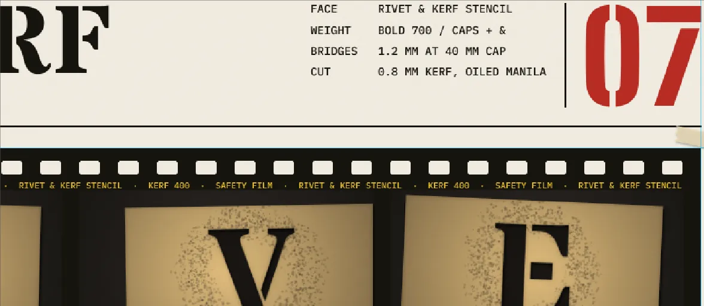

With the grease pencil on, the bright `07` competes with it for attention. Select the `07` layer and add a **Color Overlay** in `#A8382C`, a deeper printed vermilion. An effect is quicker than editing the text colour, because you can toggle it on and off to compare the two reds, and the type stays live.

## Check the spacing and move the header

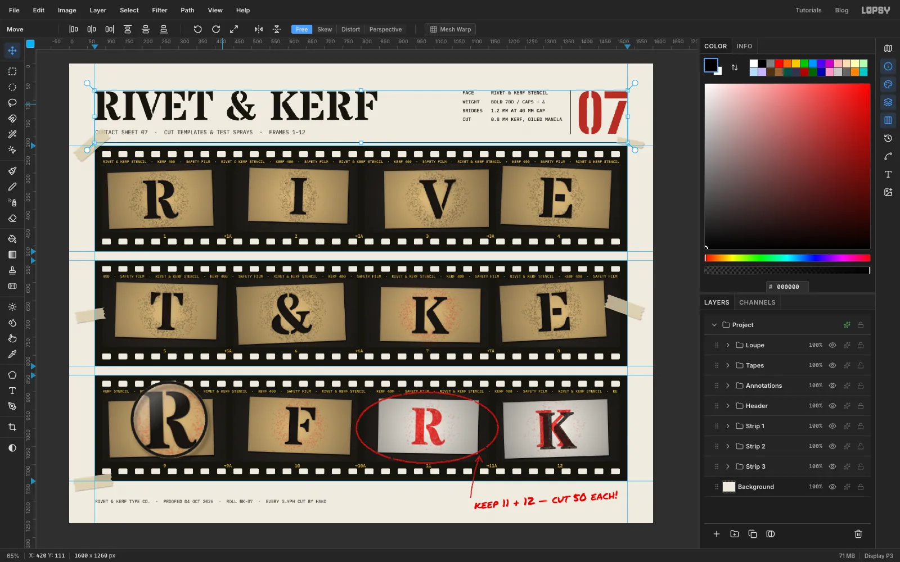

Finally, check the vertical rhythm. The gap from the header rule to the first strip should match the 25 px between strips, but right now it's 33 px. Select the `Header` group and drag the wordmark down with the **Move** tool: all the type and both rules move as one. Use the arrow keys to settle it exactly 8 px lower than where it started.

Save the project with **File → Save Project** and export with **File → Quick Export PNG**.
