Ukiyo-e prints are built from a few flat colours, one dark outline block and a
lot of pattern. You get Prussian-blue gradients (*bokashi*), stepped mist
bands (*kasumi*), and a cartouche and seal that carry the title.

In this tutorial you'll make **Abyssal Lanterns**, a 1500 × 1500 px album
cover for the band KURAGE (海月, "jellyfish"). It's a great wave in the style
of Hokusai curling toward a full moon, with floating *tōrō nagashi* paper
lanterns on a patterned night sea. Everything is drawn in Lopsy with lasso
and marquee fills, gradients, one pattern, a few filters and layer effects.

The palette:

- Sky: `#0A1532` → `#1B3764` → `#3F6190` → `#7D95B5`
- Wave: `#2F6FB5` → `#0E2A5C`, stripes `#6FA3DA`, trough `#0A2A5E`
- Foam and moon: `#F2EDE1`, `#F4E6C0`
- Lanterns: `#F5B04A`, `#C8541E`, `#FFE3A0`, frame `#2B160C`
- Ink `#0D1A33` / `#1A2340`, seal red `#C23A22`, paper `#EEE2C6`

## Set up the sheet and paint a bokashi sky

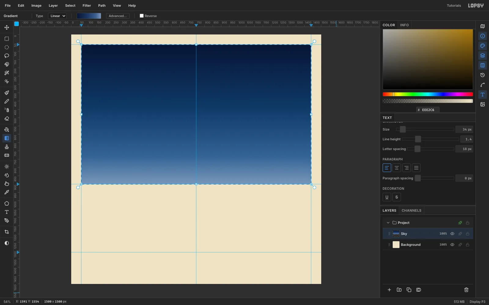

Choose **File → New**, set the unit to **Pixels**, and create a
**1500 × 1500** document with a white background.

Add the margins:

1. Click the top ruler at **60**, **750** and **1440**.
2. Click the left ruler at **60**, **900** (the horizon) and **1310** (the bottom of the picture area).

Fill the **Background** with paper cream `#EEE2C6` (Rect Marquee over the whole
page, then **Edit → Fill**).

Rename **Layer 1** to *Sky*. Marquee the picture area from (60, 60) to
(1440, 900). Pick the **Gradient** tool, open **Advanced…** and set four stops:

- `#0A1532` at 0%
- `#1B3764` at 45%
- `#3F6190` at 80%
- `#7D95B5` at 100%

Drag a **Linear** gradient from the top guide straight down to the horizon.
Keep the horizon a cool blue-grey. A warm peach band reads as sunset and
fights the moon.

## Add the moon, Mount Fuji and kasumi clouds

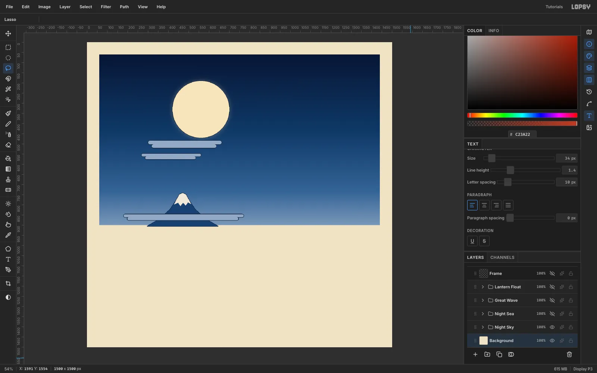

Build these three pieces on new layers:

- **Moon.** Draw an Elliptical Marquee circle from (420, 190), 280 px wide. Fill it `#F4E6C0`. Open **Layer effects** and add an **Outer Glow** (`#F3DDA6`, Size 34, Opacity 35) and a **Stroke** (`#0D1A33`, Width 2).
- **Fuji.** Lasso a low cone from (296, 905) up to a flat peak at about (470, 742) and back down to (644, 905). Fill it `#22406E`. Lasso a zigzag snow cap over the top, fill it `#EFE8DA`, and add the same 2 px Stroke.
- **Mist.** Kasumi are long ribbons whose ends step in as two rounded lobes: the upper lobe sticks out further than the lower one. Lasso three of them and fill them `#97A8C2` at 100% opacity:
  - x 300–662 at y 484
  - x 268–560 at y 548
  - x 180–770 across Fuji's lower slopes at y 846

  Give them the 2 px Stroke too.

> **Tip:** Keep every outline at the same 2 px weight. In a woodblock print one key block draws all the lines, so mixed weights look wrong.

## Draw a seigaiha tile

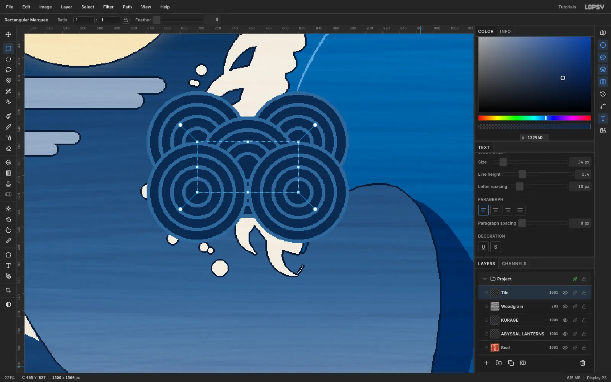

Seigaiha ("blue ocean waves") is overlapping fans of concentric rings. Make
one tile on a scratch layer:

1. Rect Marquee a **120 × 60** box and fill it `#13294D`.
2. Circles are centred on the tile's corners (0,0), (120,0), (0,60), (120,60) and its middle (60,30). Draw them in rows: top corners first, then the middle, then the bottom corners, so each row overlaps the one above.
3. For each circle, fill concentric Elliptical Marquee discs with radius 60 `#3E6899`, 56 `#13294D`, 46 `#3E6899`, 42 `#13294D`, 32 `#3E6899`, 28 `#13294D`, 18 `#3E6899` and 14 `#13294D`. Each smaller disc covers the last, which leaves 4 px light rings.

Marquee exactly the 120 × 60 tile, choose **Edit → Define Pattern**, then
delete the scratch layer.

## Fill the sea in receding zones

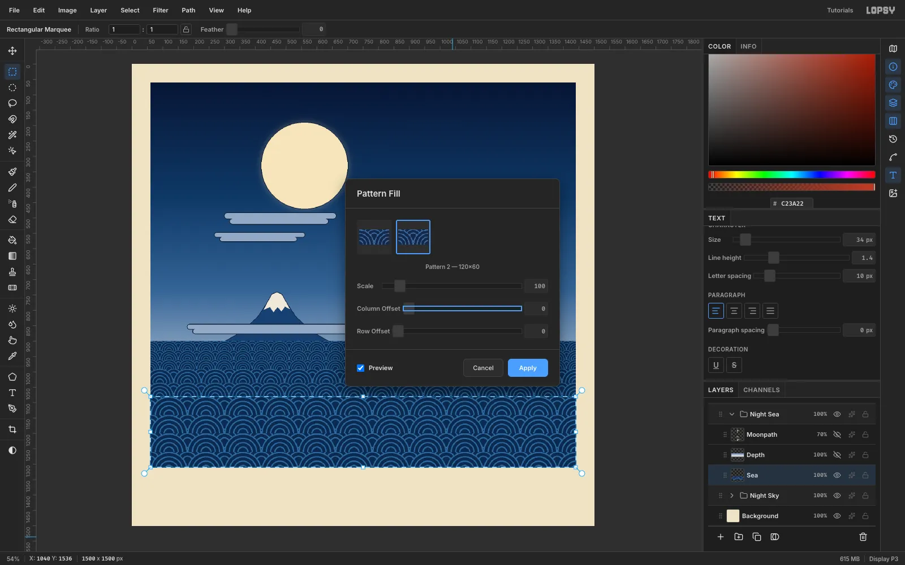

Add a *Sea* layer. The pattern should get smaller toward the horizon, so fill
it in three bands with **Edit → Fill with Pattern…**:

- y 900–990 at **Scale 50**
- y 990–1080 at **Scale 75**
- y 1080–1310 at **Scale 100**

Each band's height is a whole number of tile rows (30, 45 and 60 px), so the
zone edges fall on tile edges.

## Add depth and a broken moon path

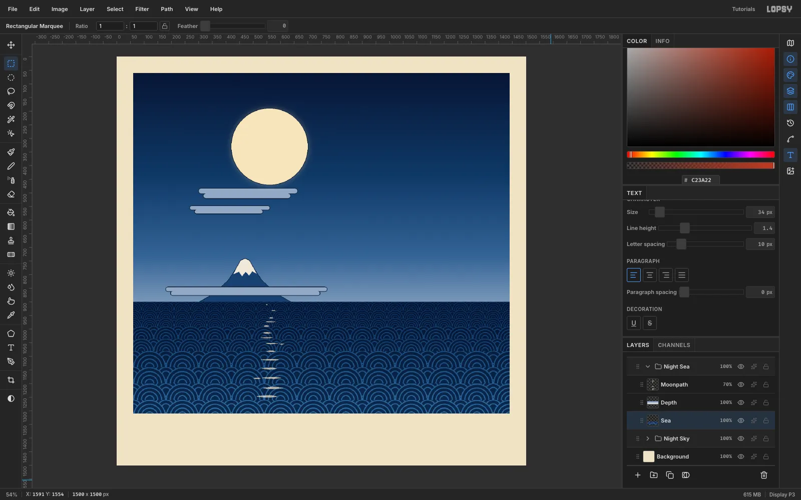

**Depth.** Add a *Depth* layer. Marquee the sea and drag a vertical Linear
gradient from `#5B769C` at the horizon to white at the bottom. Set the layer to
**Multiply**. White multiplies to nothing, so only the far sea darkens.

**Moon path.** Add a *Moonpath* layer and lasso about a dozen thin, pointed
shards in `#F3E3B0` under the moon (x ≈ 560):

- Near the horizon, make them about 20 × 3 px. Near the bottom, make them about 90 × 8 px.
- Vary the x-offset by ±15 px and use uneven gaps.
- Split a few into two pieces.

Set the layer to **Screen** at 70%. An evenly spaced stack reads as a ladder,
so irregularity is the point.

## Build the wave body and its stripes

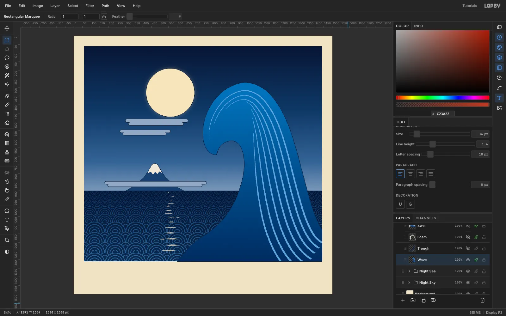

Add a *Wave* layer. Lasso the wave's outline:

1. Start at the right edge around (1440, 1125). Climb the back slope to a crest at about (1000, 272).
2. Curl over and down to a lip that hooks inward at about (826, 692).
3. Run back up under the lip, then down the concave face through (990, 760) and (880, 1050) to the bottom at about (600, 1310).

Fill the lasso with a vertical Linear gradient from `#2F6FB5` under the crest to
`#0E2A5C` at the base.

For the stripes, lasso seven thin bands (about 9 px wide, tapering to a point)
that follow the crest line at increasing depths inside the wave. Fill them
`#6FA3DA`. Let the outer ones run almost to the lip and end the inner ones
sooner, so they don't pinch together at the summit.

They'll spill outside the wave. To clip them, lasso the wave outline again,
choose **Select → Inverse** and press [[Delete]]. Then marquee the picture area
(60, 60 to 1440, 1310), **Inverse**, and [[Delete]] again to trim anything past
the frame. Add a 2 px `#0D1A33` Stroke.

## Break up the trough

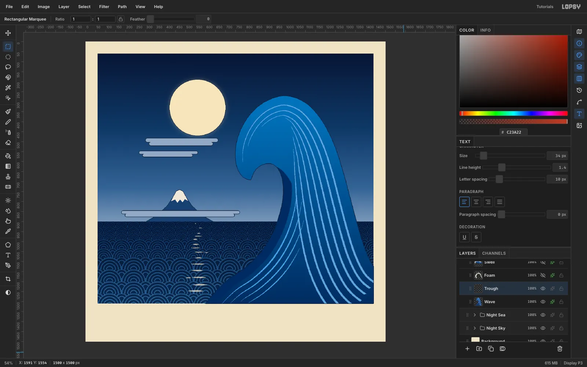

The face under the curl is a big empty slab. On a new *Trough* layer above
*Wave*:

- Lasso a band about 46 px wide that hugs the inside of the face. Fill it `#0A2A5E`.
- Lasso four short stripes, 5–6 px at their widest and tapering at both ends, at 64, 94, 124 and 154 px from the face. Fill them `#5FA0E0`.

Clip them to the wave the same way (lasso the wave, Inverse, Delete).

## Add the foam claws and spray

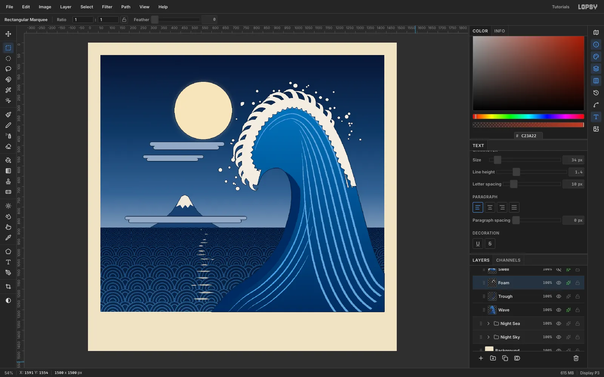

On a *Foam* layer, use `#F2EDE1` for:

- **The foam band.** Lasso a band along the top of the crest that starts thin on the back slope, grows to about 40 px, and has a scalloped inner edge.
- **The claws.** Lasso a dozen or more curved, tapering fingers off the front of the crest. Give them different lengths (40–100 px) and bend angles, each ending in a small hook back toward the wave. Identical teeth look like a comb.
- **The spray.** Fill about 45 small Elliptical Marquee circles (radius 3–10 px) in a loose cloud outside the claws.

Trim to the frame and add a 2 px Stroke.

## Add a foreground swell

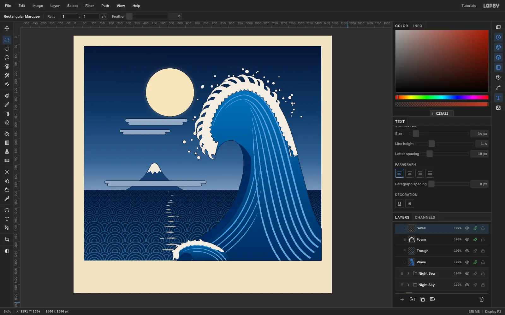

A second, smaller wave gives the big one scale. On a *Swell* layer:

1. Lasso a small curl from about (930, 1340) up to a crest at y 1198, hooking left to a tip at (614, 1300).
2. Give it the same blue gradient and three short `#6FA3DA` stripes, then clip it.
3. Add a thin foam band and a few small claws.

Trim to the frame and add the 2 px Stroke.

## Make one paper lantern

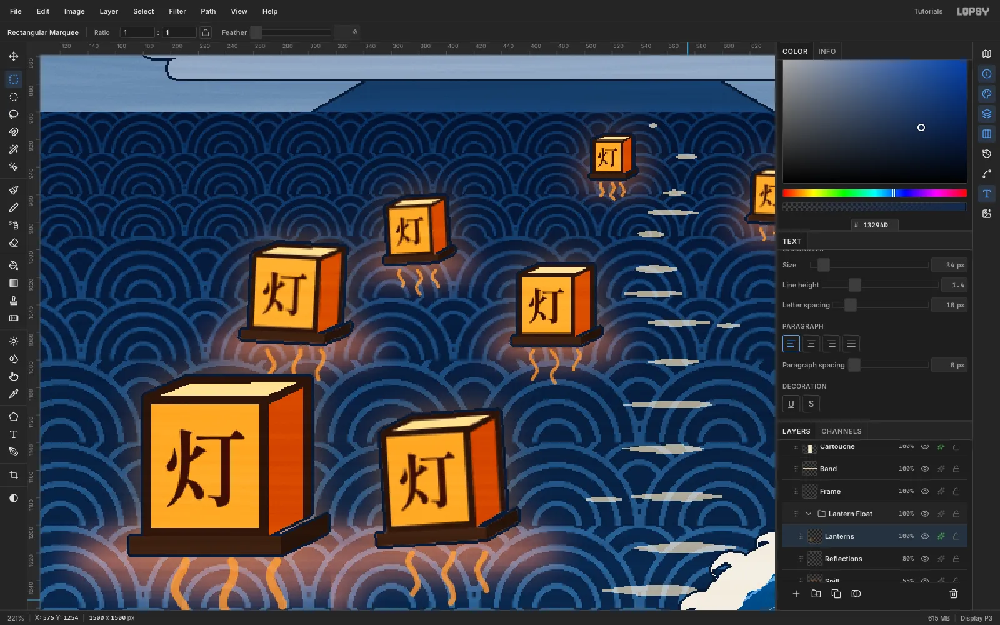

On a *Lantern* layer near the bottom-left, draw a small box with flat colours
only, using Lasso and Rect Marquee fills:

- **Top opening:** `#FFE3A0`.
- **Front face:** 90 × 100 px in `#F5B04A`.
- **Side face:** a narrow parallelogram in `#C8541E`.
- **Frame:** 6 px posts and rails in `#2B160C`.
- **Base:** a two-tone board, `#3A2214` and `#24140B`.

For the character, select the **Text** tool. Pick **Shippori Mincho B1**,
ExtraBold (800), size 62, colour `#3A1208`. Click in empty space and paste
**灯** ("light"). Press [[Tab]] to commit, click **Rasterize Layer**, drag the
glyph onto the centre of the front face, and choose **Layer → Merge Down**.

## Clone and scale the flotilla

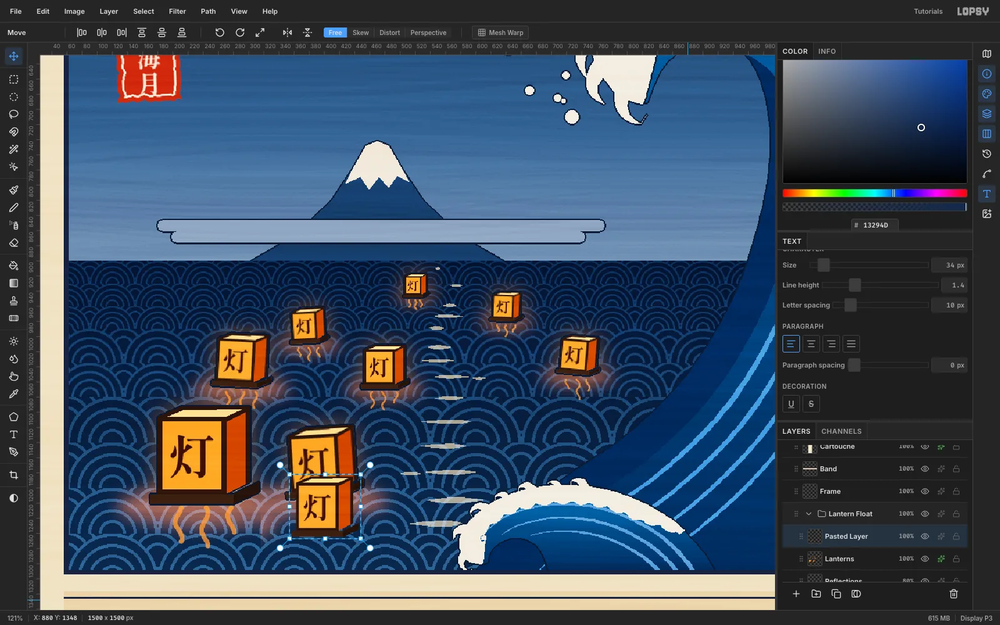

Marquee the lantern and press [[Cmd+C]], then [[Cmd+V]] straight away. The copy
pastes in place on a new layer.

1. Drag it to its spot with the **Move** tool.
2. Marquee it, hold [[Cmd]] and drag the bottom-right corner handle to scale it uniformly. Press [[Cmd+D]] to commit.
3. Tilt a few by 3–5° with the rotate handle just outside the top-right corner, then [[Cmd+D]].

Make seven copies at 72%, 55%, 45%, 40%, 36%, 30% and 24%. Place the smallest
near the horizon and the largest toward the viewer.

> **Tip:** Press [[Cmd+D]] after every scale or rotate before you move the piece again.

## Merge the lanterns and make them glow

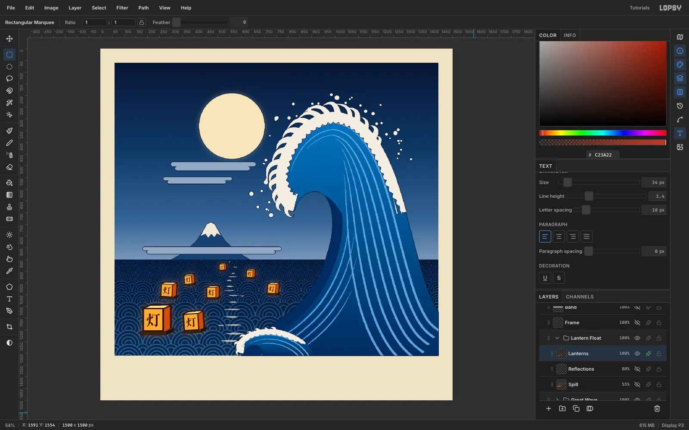

Select the top copy and run **Layer → Merge Down** seven times, so all eight
lanterns end up on one *Lanterns* layer. Add:

- a **Stroke** of `#0D1A33` at Width 2, the same key-block line as everything else
- an **Outer Glow** of `#FF9A3A` at Size 40, Opacity 45

## Paint wavering reflections

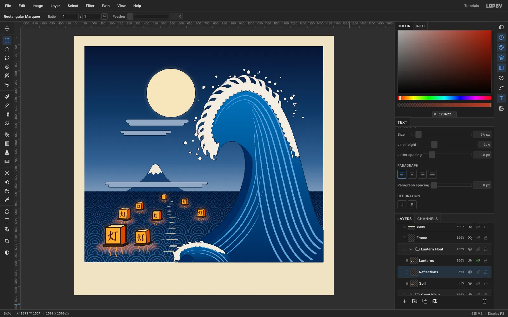

**Spill.** On a *Spill* layer below the lanterns, set the marquee **Feather**
to 20. Fill a flat orange (`#E8782C`) ellipse under each lantern, then set
Feather back to 0. Set the layer to **Screen** at about 50%.

**Reflections.** On a *Reflections* layer, use the **Brush** (Hardness 100,
colour `#F2A04A`, Size about 5% of the lantern's width). Draw three short,
gently wavy vertical strokes under each lantern: a long one in the middle and
shorter ones at the sides. Set the layer to 80%. They double as jellyfish
tentacles, which fits a band called KURAGE.

Select the layers of each part and choose **Layer → Group Layers** to make
four groups: *Night Sky*, *Night Sea*, *Great Wave* and *Lantern Float*.

## Frame the print and add the cartouche

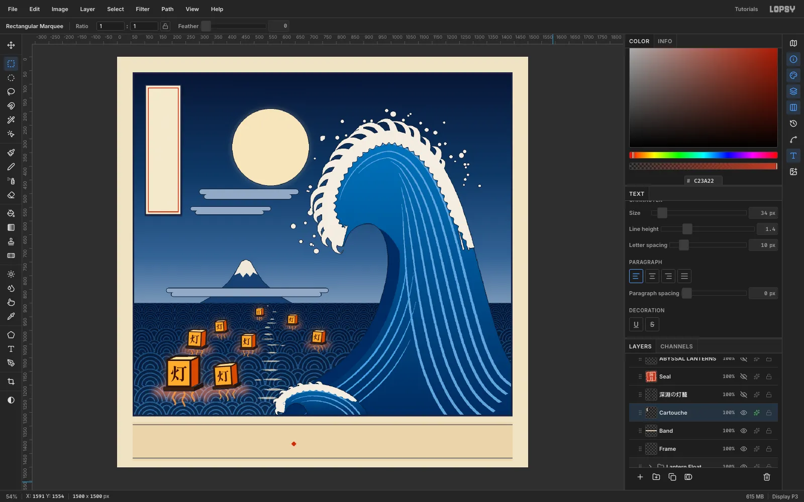

**Frame.** On a *Frame* layer at the top:

1. Marquee from (56, 56), 1388 × 1258. Fill it `#1A2340`.
2. Choose **Select → Shrink…** 5 px and press [[Delete]], which leaves a crisp 5 px keyline.

**Band.** On a *Band* layer, fill (56, 1336, 1388 × 140) with `#E8D5AE`. Draw
2 px `#1A2340` rules at y 1344 and y 1466.

**Cartouche.** On a *Cartouche* layer, marquee (100, 100, 136 × 480) and fill
it in rings using **Shrink**:

- `#1A2340`
- shrink 4, fill `#F3E9CF`
- shrink 6, fill `#C23A22`
- shrink 2, fill `#F3E9CF`

Add a soft **Drop Shadow** (Offset 2/3, Blur 5, Opacity 40).

## Set the vertical title

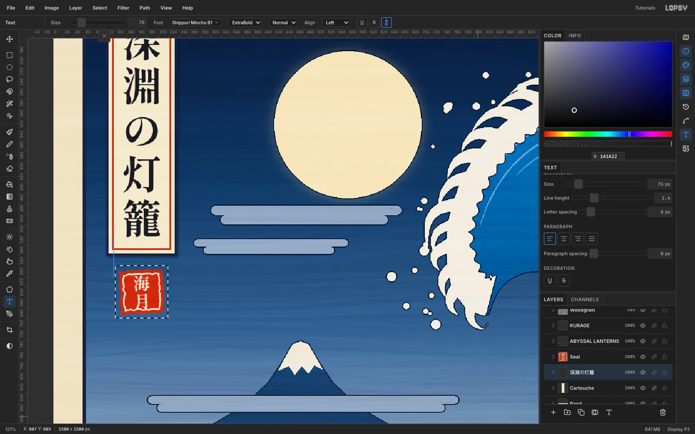

Select the **Text** tool with the Cartouche layer active. Set:

- **Shippori Mincho B1**, ExtraBold, size **76**
- **Vertical** on (the stacked A-over-B toggle in the options bar)
- Letter spacing **8** (in vertical mode that's the gap between glyphs), Line height 1.4

Click inside the cartouche, paste **深淵の灯籠** ("lanterns of the abyss")
and press [[Tab]].

Centre it with the Move tool and arrow keys. The glyphs should sit 25 px from
the red rule at both top and bottom, centred on x 168.

## Carve the hanko seal

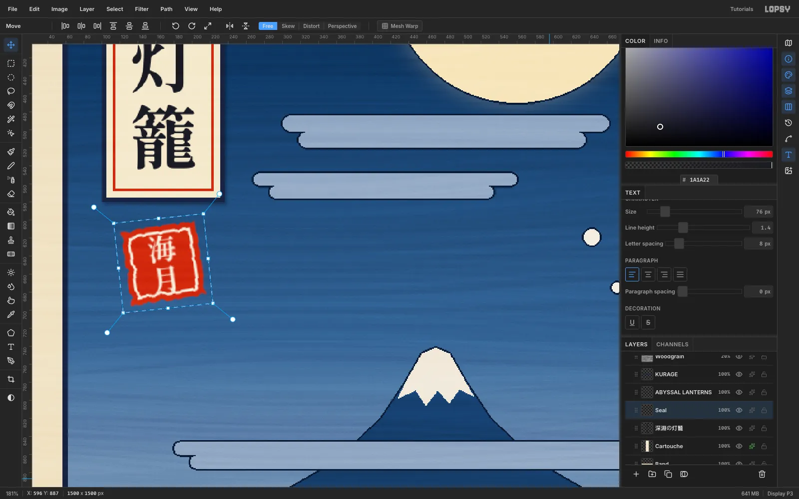

On a *Seal* layer, lasso an 84 px square at (126, 606) with slightly jittered
edges and a couple of nicks (a point every 5 px, pushed in 0–3 px at random).
Fill it `#C23A22`. For the inner keyline, shrink 5 and fill `#F6EEDC`, then
shrink 2 and fill `#C23A22` again.

Add vertical text **海月** at size 32 in `#F6EEDC`. Rasterize it, centre it
on the seal and Merge Down.

To rotate the seal by −2°, marquee it and drag just outside the top-right
corner with the **Move** tool, then press [[Cmd+D]]. A stamp that's slightly
off square looks hand-pressed.

## Add a woodgrain texture

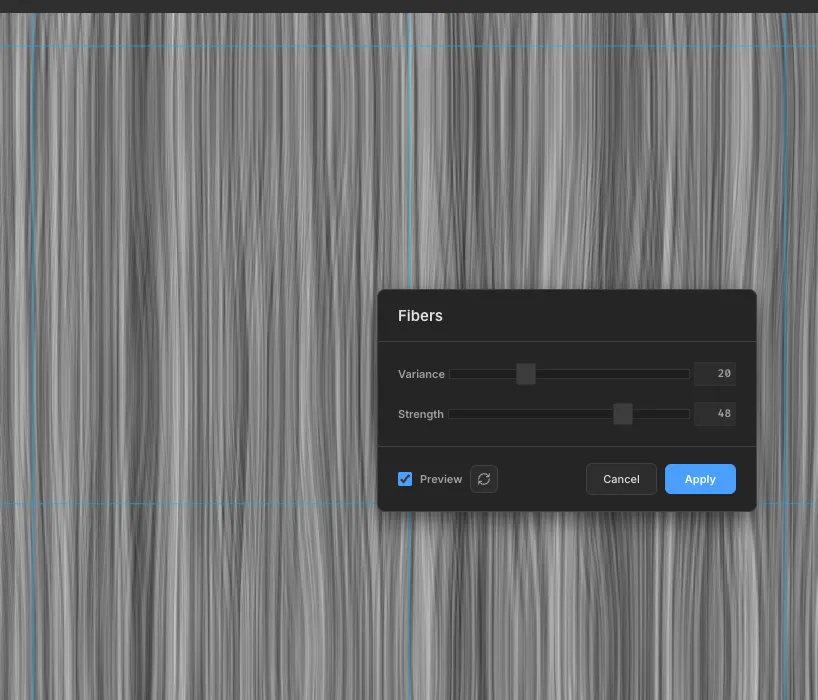

Add a *Woodgrain* layer at the very top and fill it `#808080`.

1. Run **Filter → Fibers…** with Variance **20** and Strength **48**.
2. The fibers are vertical. With the Move tool and no selection, click **Rotate 90° CW** in the options bar to turn them into horizontal grain.
3. Run **Filter → Add Noise…**, Mono, Amount 24.
4. Set the layer to **Overlay** at 20%.

The grain now runs through the sky, the sea and the paper, like ink printed
from a cherry block.

## Set the band typography

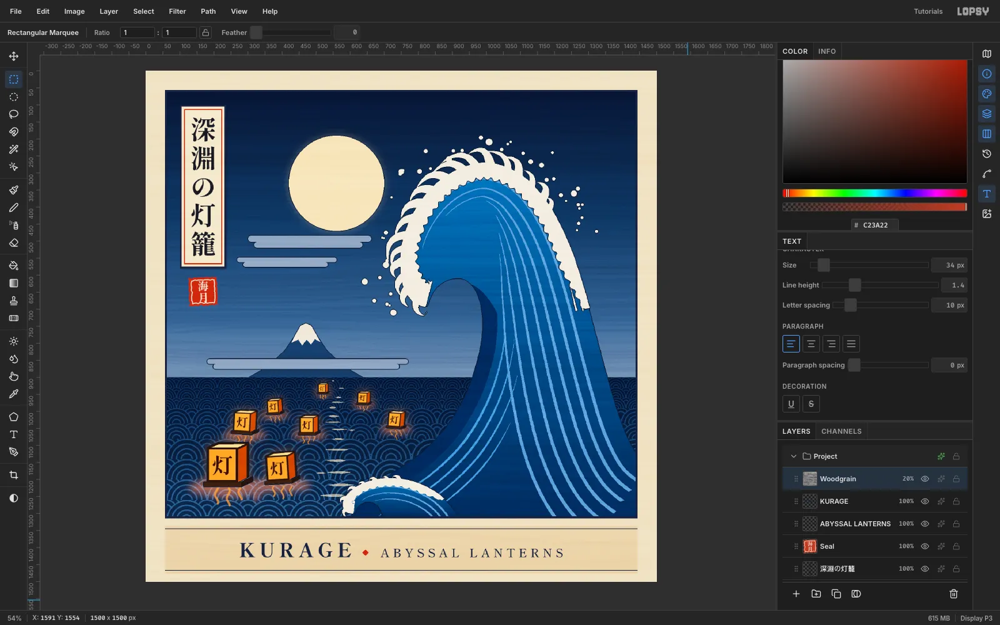

The band name should lead:

- **KURAGE:** Shippori Mincho B1 ExtraBold, size 56, letter spacing 12
- **ABYSSAL LANTERNS:** Medium (500), size 34, letter spacing 10

Both are `#1A2340`. Create each one in empty space so the text tool doesn't
grab the other layer, then line them up:

1. Put the two words on one shared baseline (y 1428).
2. Centre KURAGE's caps between the rules.
3. Leave 35 px, then a small `#C23A22` lassoed diamond, then another 35 px before the title.

Measure the whole line and nudge it until it centres on x 750. Finally, check
that *Woodgrain* is still the top layer, so the type is textured too, then
**File → Save Project** and **File → Quick Export PNG**.
