The look is built from a few parts. A classical marble bust, a sunset, a swimming pool, palms, Japanese type and old computer UI, all drenched in pink and cyan. In this tutorial you'll make **Roman Pools**, a 2400 × 1100 billboard for an imaginary 1995 mall water park. A real statue photo carries it. You'll cut it out, then recolour it with a Gradient Map. Everything else is built around it, step by step:

- a backlit temple
- a pool floor tiled with your own pattern and pushed into perspective
- caustics made with the Voronoi filter
- a chrome headline
- a pixel-perfect Windows 95 pop-up

The palette:

- Sky `#140A33` → `#5B2A9E` → `#F2459A` → `#FFC08A`
- Sun `#FFF27A` → `#FF9A3C` → `#FF2E97`
- Temple `#2A1458`, frieze `#3F2082`, rim glow `#FF6AD5`
- Pool tile `#35C9E2`, grout `#E4FCFF`, lane `#1C3C9E`
- Bust map `#22094E` → `#7A2AA8` → `#F0559E` → `#FFB8D2` → `#E6FFFF`
- Echo cyan `#2CF0FF`
- Window grey `#C0C0C0`, title bar `#000080` → `#1084D0`

The bust is *Alexander-Helios* (Capitoline Museums), a public-domain photo from Wikimedia Commons. The palm is *Palm Tree in Key West, Florida*, which is CC0 on Wikimedia Commons.

## Set up the billboard and guides

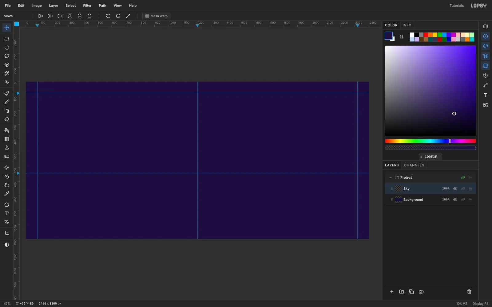

Open [Lopsy](/). In the **New Document** dialog, choose **Pixels** and enter `2400` × `1100`. That's close to the 2.2:1 shape of a 30-sheet poster billboard.

Click the rulers to drop guides:

- **Vertical guides:** click the top ruler at x `80`, `1200` and `2320`. These are the side margins and the centre line.
- **Horizontal guides:** click the left ruler at y `80` and `640`. The 640 guide is the horizon.

## Paint the sunset sky

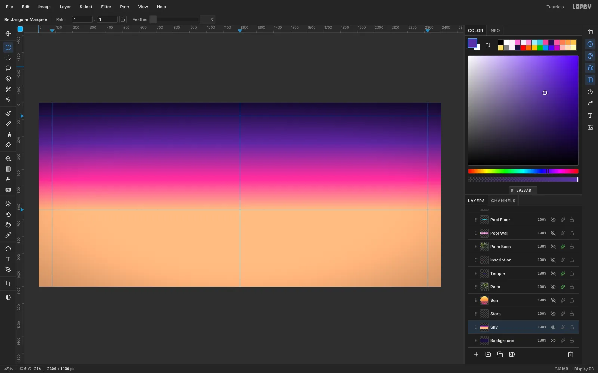

Fill the Background with `#1D0F3F` (**Edit → Fill** with nothing selected). Add a layer and name it `Sky`.

Pick the **Gradient** tool and click **Advanced…**. Set four stops: `#140A33`, `#5B2A9E` at 38%, `#F2459A` at 72% and `#FFC08A`. Then drag from the top of the canvas straight down to the horizon guide.

## Slice a striped sun

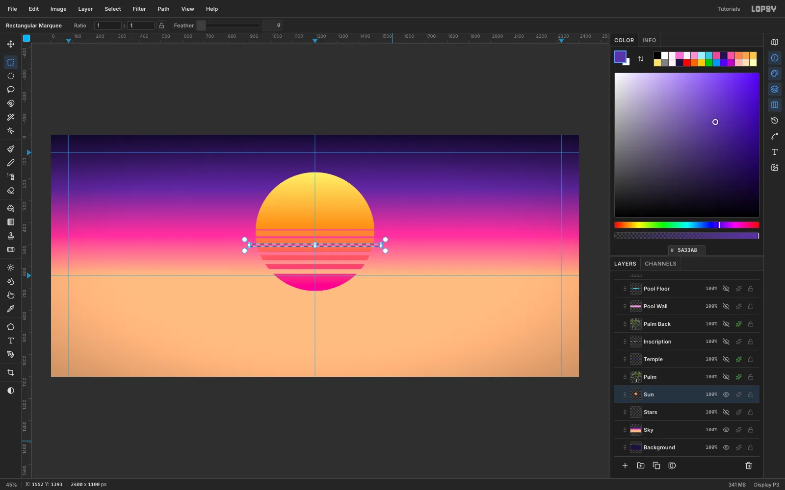

Add a layer named `Sun`.

1. With the **Elliptical Marquee**, select a 540 px circle centred at (1200, 440).
2. Fill it with a linear gradient: `#FFF27A`, then `#FF9A3C`, then `#FF2E97`, dragged top to bottom.
3. Switch to the **Rectangular Marquee**. Click the canvas once without dragging to open the **Region** dialog, which lets you type exact coordinates.
4. Cut six bands with **Delete**, each thicker than the last. Use y `430` (5 px tall), `462` (8), `496` (11), `532` (14), `570` (18) and `610` (22).

## Build the temple and its frieze

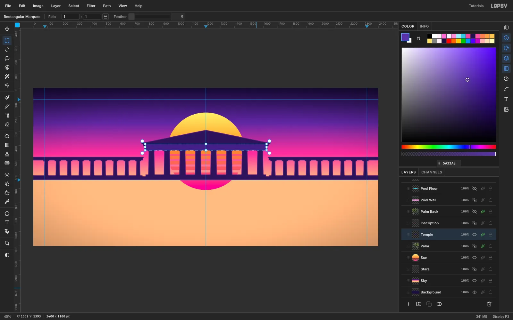

Add a layer named `Temple` and set FG to `#2A1458`.

1. Draw the temple from rectangles and lasso polygons, filling each with **Edit → Fill**: steps, eight tapered columns with capitals, the entablature and a triangular pediment.
2. Add low colonnades that run out to both edges of the canvas.
3. Open the layer effects and add **Inner Glow** in `#FF6AD5` (Size 9, Spread 10, Opacity 85). The sun now rims every edge.
4. Marquee the whole temple, switch to the **Move** tool and drag the top-middle handle down until the height is about 80%. Press [[Cmd+D]] to commit. That lets the striped sun rise above the roof.
5. Fill a 44 px frieze band in `#3F2082`. Deselect, and draw 2 px fillet lines in `#5A33A8` along its top and bottom edges with the **Pencil** at Size 2: click at one end, then [[Cmd+Shift]]-click at the other for a dead-level line.

## Tile the pool and push it into perspective

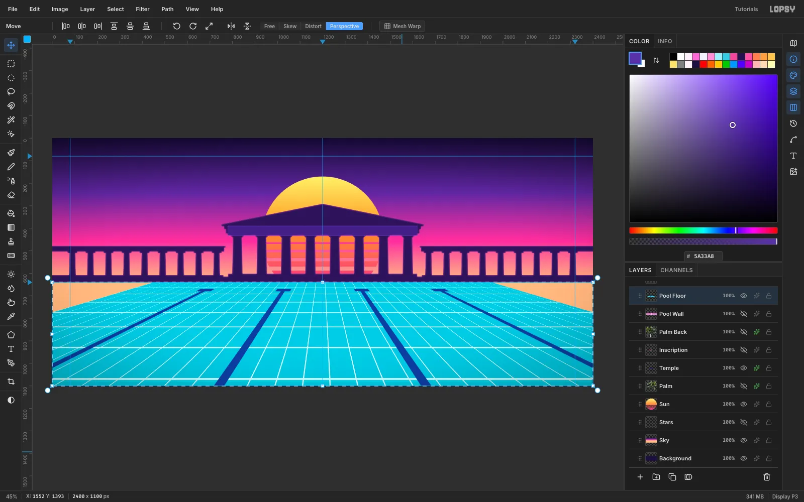

Make a pool tile:

1. Add a layer and fill a 64 × 64 square with `#35C9E2`.
2. Deselect, and with the **Pencil** at Size 3 draw a `#E4FCFF` grout line along its top and left edges, with a `#5AD8EC` line just inside. Click at one end of each line and [[Cmd+Shift]]-click at the other.
3. Select the tile and choose **Edit → Define Pattern**.
4. Clear the tile, name the layer `Pool Floor`, and select everything below the horizon (0, 640 → 2400, 1100).
5. Choose **Edit → Fill with Pattern…** and pick the tile.
6. Fill four 24 px `#1C3C9E` lane lines, each with a T-shaped end at the far wall.

Put the floor in perspective:

1. Select the floor again and switch to the **Move** tool.
2. Choose **Perspective** in the options bar.
3. Drag the bottom-left corner handle about 1100 px further left. The bottom-right corner mirrors it.
4. Drag the top-left handle 450 px inward.
5. Press [[Cmd+D]] to commit.

Perspective mode foreshortens properly, so the far rows of tiles shrink toward the horizon.

## Add the side walls and Voronoi caustics

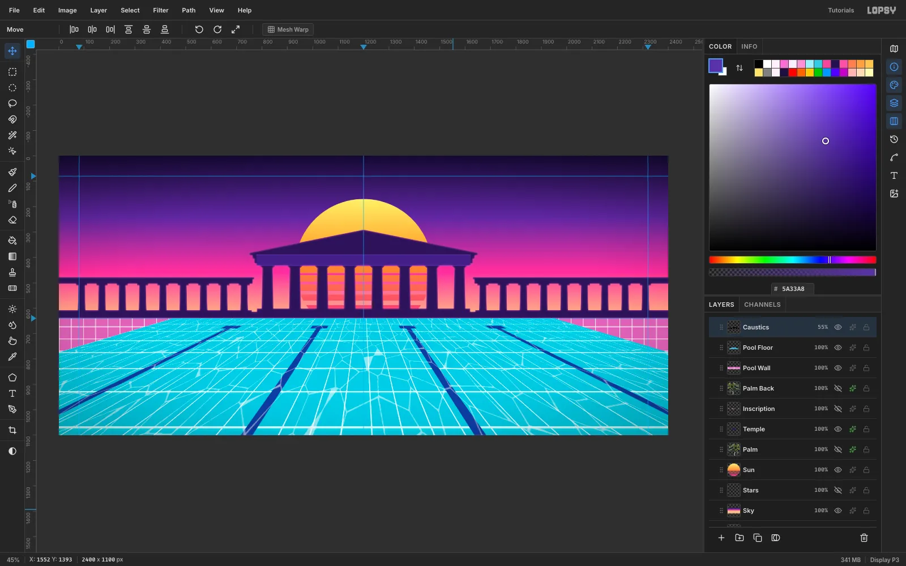

**Side walls.** Add a `Pool Wall` layer under the floor. Pattern-fill the same area at Scale 75. Then run **Filter → Hue/Saturation…** with Hue 128, Saturation −25 and Lightness 8, which turns the tiles pink. They show around the edges of the floor.

**Caustics.** Add a `Caustics` layer and fill the pool area with mid-grey, then run these filters in order:

1. **Add Noise** (Amount 100, Mono).
2. **Voronoi** (Cells 16, Edge Width 5, Seed 42). This draws a web of cell edges.
3. **Invert**, so the edges turn white.
4. **Threshold** at 205, so only the edges stay white.
5. **Gaussian Blur** (Radius 2).

Set the layer to **Screen** at 55% opacity. Give it the same Perspective transform as the floor (bottom corner −1100, top corner +450).

## Tint the water and add the sun's reflection

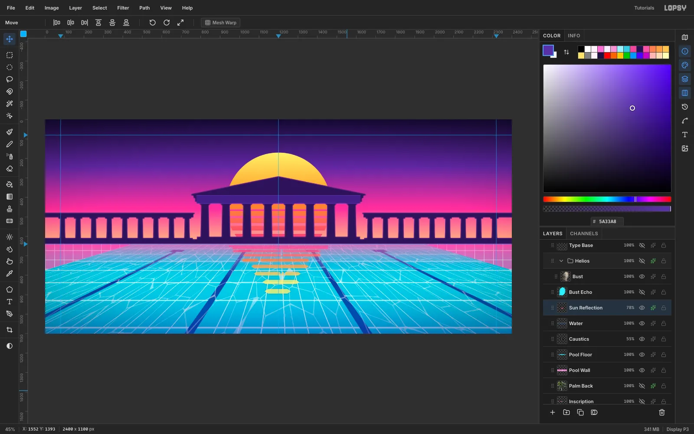

**Tint.** Add a `Water` layer. Select the pool and drag a gradient from the horizon down, with three stops:

- `#FF4FA6` at 70% alpha
- `#40D8F0` at 0% alpha (40%)
- `#1838B8` at 45% alpha

The pink reflects the sky at the far end.

**Reflection.**

1. On a `Sun Reflection` layer, lasso nine flat, pointed bars under the sun. Make each one shorter and thicker than the one above, and offset each a little sideways.
2. Fill them white. Then [[Cmd]]-click the layer thumbnail to select the bars and drag a pink-to-orange-to-yellow gradient through them.
3. Run **Gaussian Blur** at 1.5 px.
4. Cut a few narrow gaps with Region-dialog marquees, so the ripples break up.
5. Add an orange **Outer Glow** (Size 18, Opacity 45) and set the layer to 78% opacity.

## Cut out the marble bust

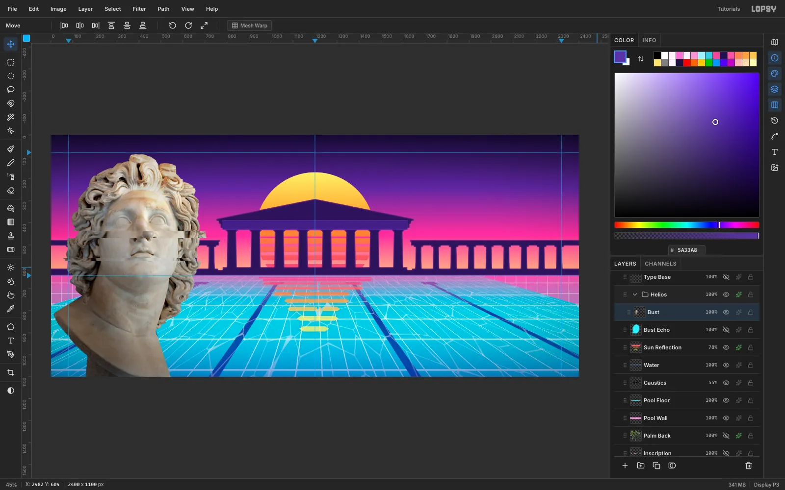

Click **New Group** and name it `Helios`. Paste the bust photo with [[Cmd+V]]. Lopsy places it with a live transform. Click **Flip Horizontal** in the Move options bar so he looks toward the temple, then press [[Cmd+D]].

The photo has a dark blue backdrop. **Magic Wand** (Tolerance 40) picks most of it, but it leaks into the blue-lit shadow side of the neck. A traced outline is cleaner:

1. Trace the bust with the **Lasso**.
2. Choose **Select → Feather…** with a radius of 1 px.
3. Choose **Select → Inverse**, then press **Delete**.

Marquee the bust and [[Cmd]]-drag the bottom-right corner handle to scale it to 117%.

## Recolour it with a Gradient Map

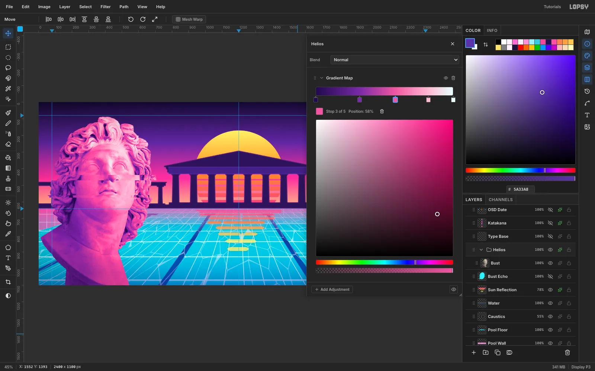

Select the `Helios` group row and open its drawer. Click **Add Adjustment → Gradient Map**. Click the gradient bar to add stops and set five colours: `#22094E`, `#7A2AA8` at 32%, `#F0559E` at 58%, `#FFB8D2` at 82% and `#E6FFFF`.

Because the adjustment lives on the group, the photo underneath stays untouched. You can turn it off with **Disable adjustments** at any time.

## Glitch the face with slice offsets

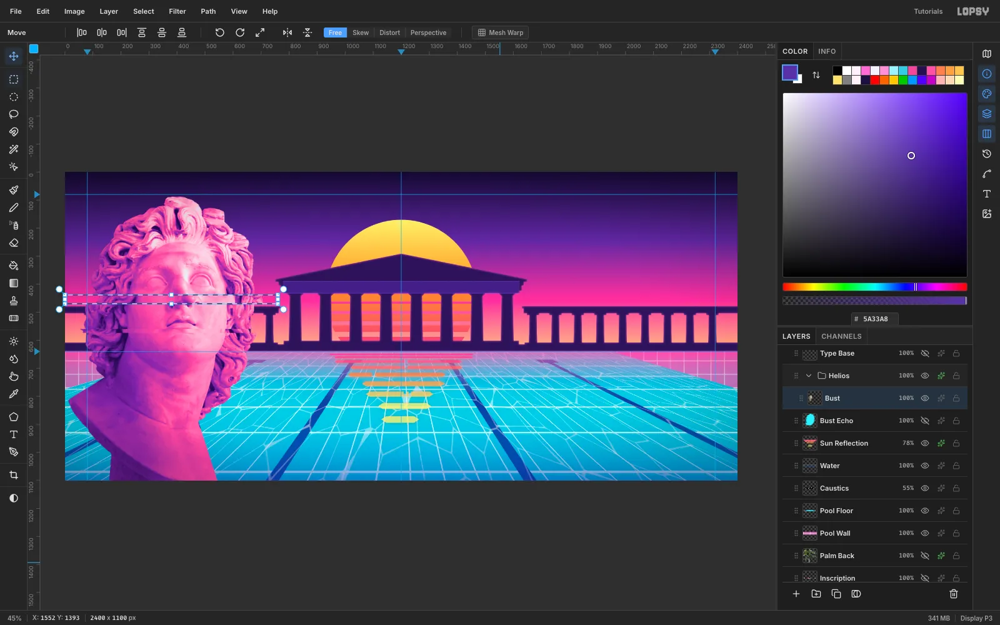

Click the `Bust` layer.

1. Select a 32 px band across the nose with the Region dialog (0, 438 → 760, 470).
2. Switch to **Move**. Press [[Shift+Right]] three times to slide the band 30 px.
3. Press [[Cmd+D]].
4. Select a thinner band at y 560–574 and press [[Shift+Left]] twice.

Keep the slices small, about 15–30 px. Bigger offsets read as broken letterforms rather than a VHS glitch.

## Add a cyan echo

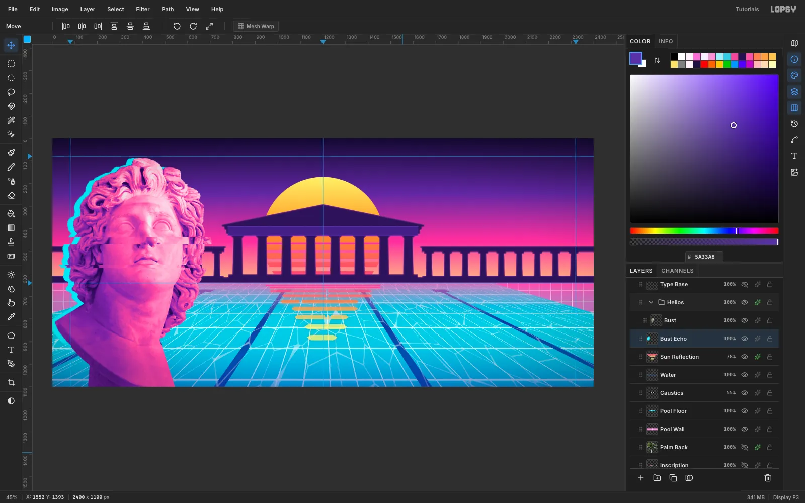

[[Cmd]]-click the `Bust` thumbnail to select its outline. Add a layer named `Bust Echo` below the group and fill the selection with `#2CF0FF`. Press [[Cmd+D]], switch to **Move**, and nudge it 26 px left.

Set the **Eraser** to Size 180 and Opacity 55. Brush along the bottom so the echo fades out.

## Place the palm silhouettes

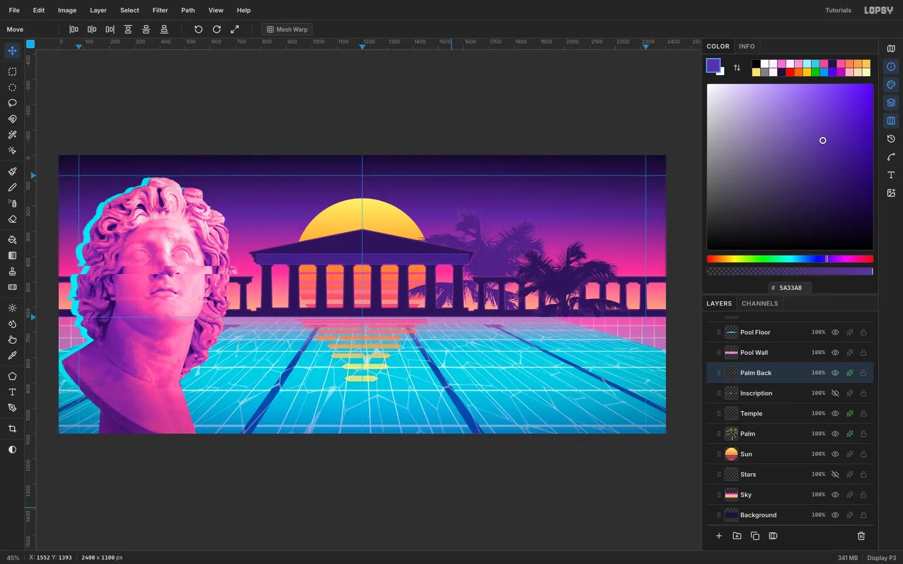

Paste the palm photo. Its sky is clean blue, so here the wand works well:

1. Choose **Magic Wand** with Tolerance 48 and **Contiguous** off, and click the sky.
2. [[Shift]]-click near the bottom to add the rest of the sky.
3. Press **Delete**.

Add a **Color Overlay** in `#2A1458` and a thin pink **Inner Glow** so the palm turns into a backlit silhouette. Scale it to 60%.

Click **Duplicate Layer**, scale the copy to 78%, and drag it right.

Drag the first palm's row below `Temple` so the temple sits in front of it. Then give that palm a slightly lighter overlay (`#4A2384`) so the two silhouettes don't merge.

## Set the chrome headline

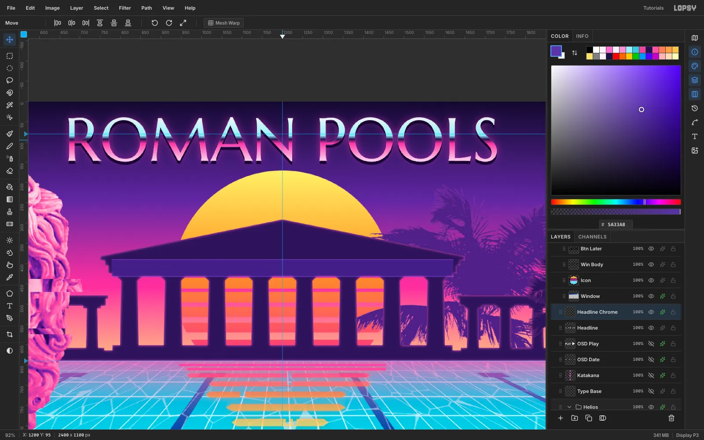

**Set the type.** Choose the **Text** tool with **Marcellus SC** at 150 px and colour `#FFF0FA`. Type `ROMAN POOLS` in empty sky. With the **Move** tool, click **Align center horizontally**, then nudge it up to y 38.

**Make it chrome:**

1. [[Cmd]]-click the text thumbnail to select the letters.
2. Add a `Headline Chrome` layer.
3. Drag a five-stop gradient from the cap tops to the baseline: `#FFFFFF`, `#A8F4FF` at 42%, `#24104F` at 50%, `#FF4FA6` at 60% and `#FFE0F2`. The hard dark stop at 50% is the "horizon" that makes it read as chrome.
4. Add a **Drop Shadow** (Offset Y 8, Blur 0, Opacity 100, `#160630`) and a pink **Outer Glow** (Size 28, Opacity 55).

## Add the inscription, katakana and VHS labels

**Inscription.** Type `THERMAE ROMANAE · MCMXCV` in Marcellus SC at 26 px, colour `#FF8FD6`. Centre it in the frieze band.

**Katakana.**

1. Click `Headline Chrome` and turn on the **Toggle vertical text** button.
2. Type or paste `ローマのプール` in **Dela Gothic One** at 56 px. A Japanese input method works in the text tool.

Give the column a 5 px hard drop shadow and a pale `#FFE3F6` Color Overlay.

**VHS labels.** Click `Headline Chrome`, turn vertical text off, and type `PLAY ▶` in **VT323** at 48 px at the top left. Click `Headline Chrome` again and type `SEP. 30 1995  11:59 PM` at 40 px, 60 px up from the bottom edge.

1. Rasterize both labels.
2. Run **Filter → Chromatic Aberration…** with Amount 1. Higher amounts split the thin pixel strokes into rainbow blocks.
3. Give the date a 3 px dark **Stroke** so it reads over both the bust and the water.

## Draw a Windows 95 dialog on the grid

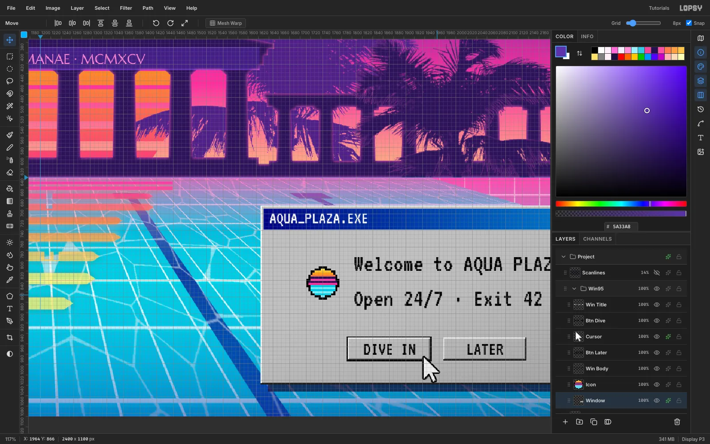

Click **New Group** and name it `Win95`. Turn on **View → Show Grid**, set the **Grid size** to 8 px and leave **Snap** on. Drag the window marquee and it snaps to the grid (1624, 694 → 2304, 1038).

**Chrome.** Build the classic bevel from 2 px strips:

- a `#C0C0C0` face
- a white top and left edge
- a black bottom and right edge, with a grey `#808080` strip inside it

Drag a `#000080` → `#1084D0` gradient across the title bar. Bevel the three title buttons and the two dialog buttons the same way. Give `DIVE IN` an extra black outline, because it's the default button.

**Text.** Use VT323. Pick each colour before you click, and set the size while the caret is still in the text: a white `AQUA_PLAZA.EXE` title at 34 px, two black body lines at 48 px, and 36 px button labels centred in their buttons.

**Cursor.** Draw a white arrow with a 3 px black **Stroke** and rest its tip on the lower-right of the DIVE IN button. Give the window a hard 14 px **Drop Shadow**.

## Draw the pixel-art icon with the Pencil

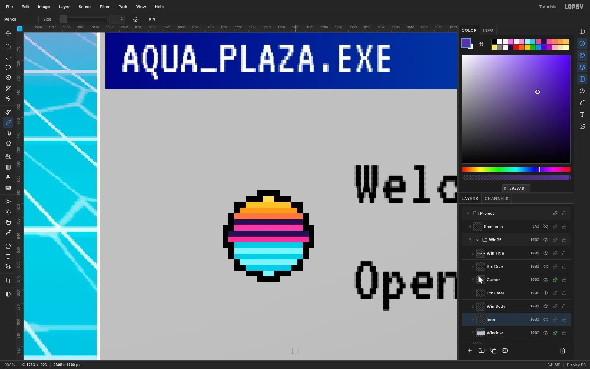

Zoom to about 400% over the dialog. Choose the **Pencil** at Size 4, so each "pixel" is a crisp 4 × 4 block.

Draw a black 16 × 16 circle outline. Fill the top half with sun bands (`#FFF27A` to `#FF4FA6`, with two `#24104F` gaps) and the bottom half with alternating `#35C9E2` and `#9AF0FF` water rows.

The Pencil has no anti-aliasing, so the icon stays sharp at any zoom.

## Finish with stars, scanlines and a vignette

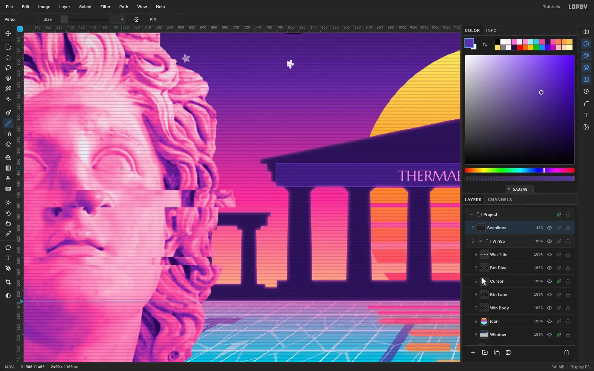

**Stars.** On a `Stars` layer above the sky, open the brush presets and pick **Star**. On the **Dynamics** tab, set Size Jitter 70, Angle Jitter 100 and Opacity Jitter 55, then set Size 18 on the Shape tab. Click about 45 times in the upper sky. Then marquee-delete any stars that touch the headline, PLAY or the katakana.

**Scanlines.** Fill a 2 px `#0B0420` strip in an 8 × 6 selection and choose **Define Pattern**. On a top-level `Scanlines` layer, **Fill with Pattern** across the whole canvas and set the layer to 14% opacity.

**Vignette.** Add a root **Vignette** adjustment of 28.

Finally, save with **File → Save Project** and export with **File → Quick Export PNG**.
