Vaporwave billboards run on a few reliable ingredients: a sunset gradient, a
striped sun sinking into a neon grid, palm silhouettes, and chunky glowing type.
In this tutorial you'll build a wide roadside billboard for an imaginary motel,
the **Flamingo Hotel**. You'll use gradients, marquee cuts, brush strokes,
transforms, layer effects and a couple of filters. Everything stays on separate
layers, so you can rearrange it later.

## Create a wide billboard canvas

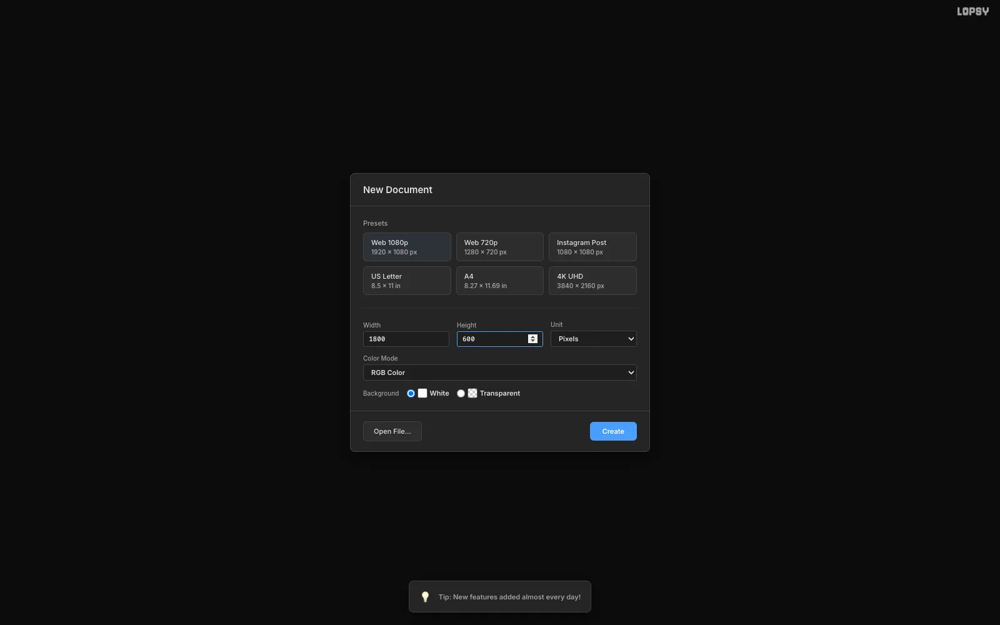

Billboards are wide and short. Open [Lopsy](/). When the **New Document**
dialog appears, type `1800` for **Width** and `600` for **Height**, then click
**Create**. That's a 3:1 canvas, close to a real roadside bulletin board.

## Set up a sunset gradient

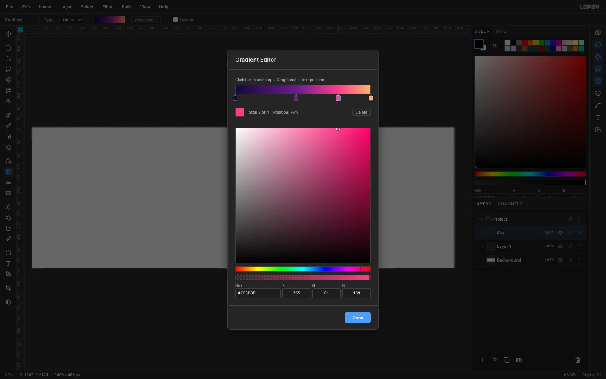

Click **Add Layer** in the Layers panel and rename the new layer `Sky` by
double-clicking its name. Pick the **Gradient** tool, then click
**Advanced…** to open the **Gradient Editor**.

Click the gradient bar to add stops, and enter these hex values from left to
right:

1. `#120A3A` (deep indigo)
2. `#6A1D8F` at about 45%
3. `#FF3D8B` at about 76%
4. `#FFB36B` (peach)

Click **Done**.

## Paint the sky

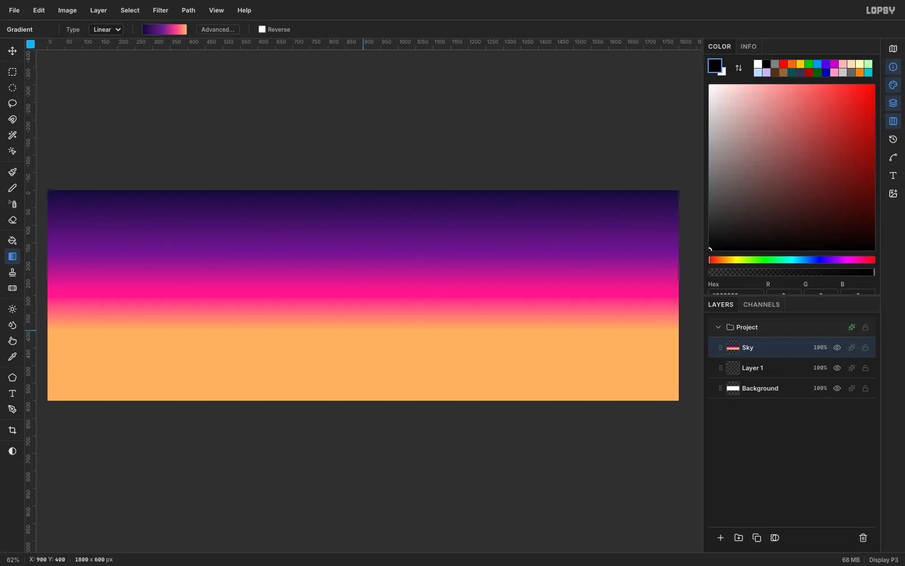

Drag from the top edge of the canvas straight down to about y = 400, where the
horizon will sit. Hold [[Cmd]] while you drag to snap the angle to a perfect
vertical.

## Draw the retro sun

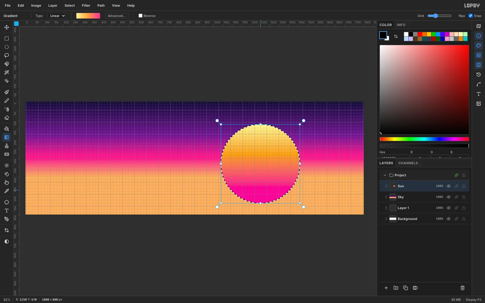

Add a layer named `Sun`. With the **Elliptical Marquee**, drag a 420 px circle
on the right-hand side of the canvas, from about (1040, 120) to (1460, 540).

Open the Gradient Editor again, delete one stop, and set the rest to `#FFF59A`,
`#FFA53D` and `#FF2E97`. Drag a vertical gradient inside the selection. Only
the circle is filled.

## Slice the sun into stripes

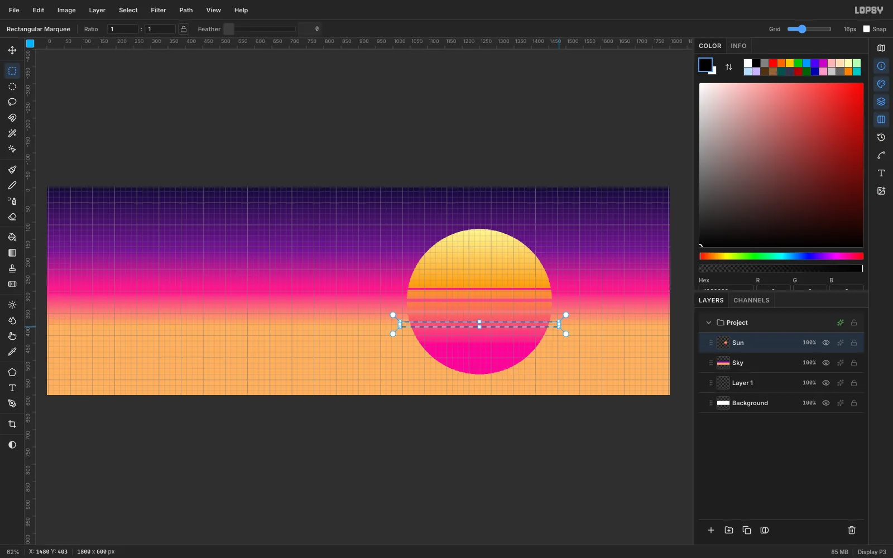

Press [[Cmd+D]] to deselect, then press [[M]] for the **Rectangular Marquee**.
Drag a thin horizontal band across the lower half of the sun and press
[[Delete]]. Repeat about seven times, making each band a little thicker and
the gaps a little wider as you go down. That's the classic 80s sunset look.

> **Tip:** Turn off **Snap** in the options bar first. With grid snapping on,
> very thin marquees can snap to zero height.

Finally, open the Sun layer's **Layer Effects** (the sparkle icon) and turn on
**Outer Glow** in `#FF4FB0`, Size `70`.

## Build the neon grid floor

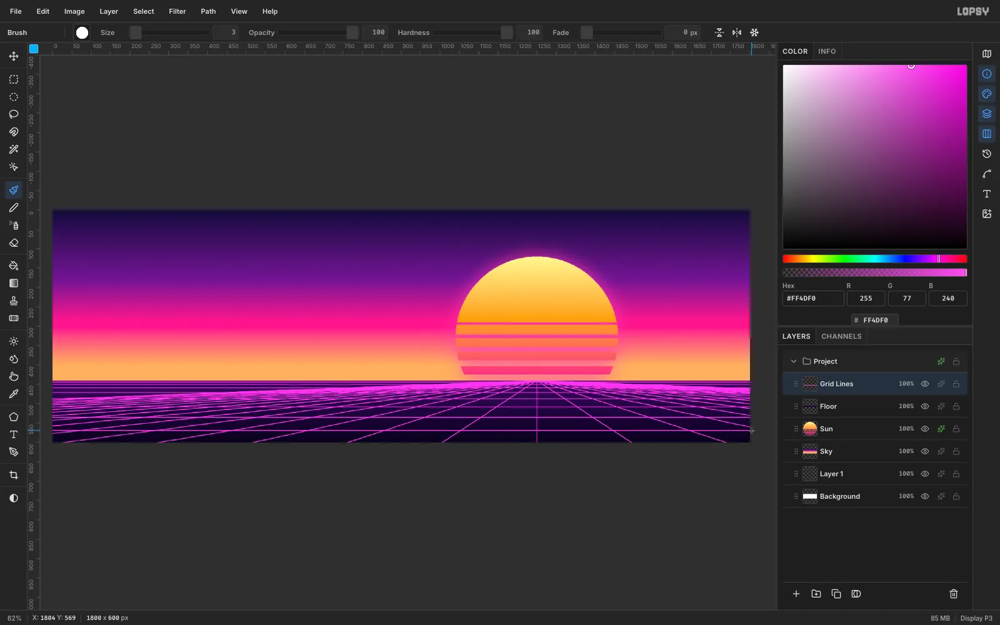

Add a `Floor` layer. Marquee everything below y = 440 and fill it with a dark
gradient from `#3A0A5E` to `#07011A`.

Add a `Grid Lines` layer. Pick the **Brush** with Size `3`, Hardness `100` and
color `#FF4DF0`. Draw straight lines fanning out from a vanishing point under
the sun to the bottom edge. Then draw horizontal lines that get farther apart
as they come toward the viewer.

Give the layer an **Outer Glow** in `#FF2BD6`, Size `14`. For depth, use the
**Eraser** at 45% opacity to soften the crowded lines at the horizon.

## Paint a palm silhouette

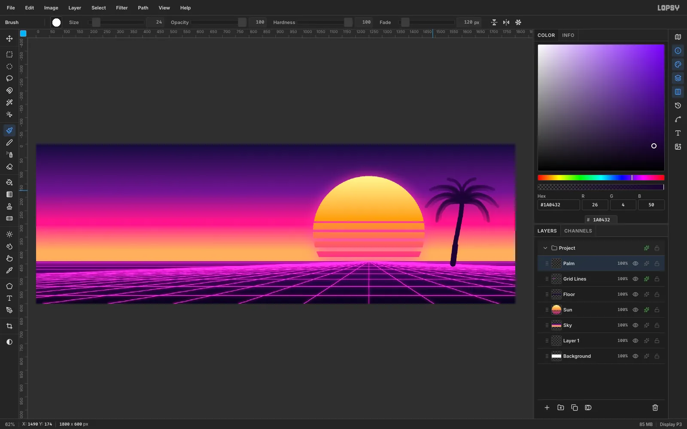

Add a `Palm` layer and set the color to `#1A0432`. Paint a slightly curved
trunk with a Size `18` brush. For the fronds, raise **Fade** to about `150`
so each stroke tapers to a point, then sweep arcs out and down from the top of
the trunk.

## Duplicate, move and scale a second palm

Click **Duplicate Layer**, then click the copy's row. Marquee around the palm,
press [[V]] for **Move**, and drag the copy to the other side of the sun. Drag
a corner handle while holding [[Cmd]] to scale it down evenly, then press
[[Enter]] to commit.

Select both palms and choose **Layer → Group Layers**. You can then move them
together by selecting the group and dragging.

## Make a neon flamingo sign

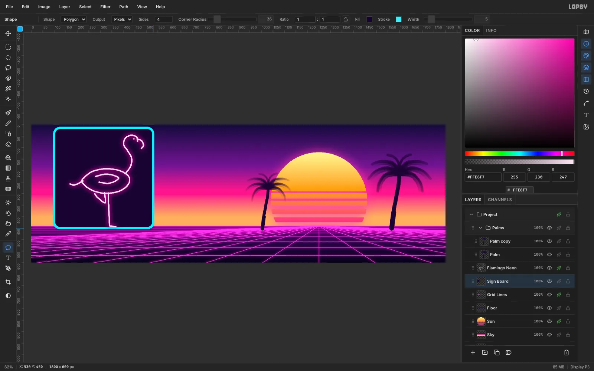

Add a `Sign Board` layer. Press [[U]] for the **Shape** tool, choose
**Polygon** with **Sides** `4` and **Corner Radius** `26`, set the Fill to
`#150430` and add a Stroke. Drag the board out on the left side of the canvas.

On a new layer above it, draw a simple flamingo with a Size `7` brush in
`#FFE6F7`: an oval body, an S-curved neck, a hooked beak, and one straight leg
with the other tucked up like a 4. Give it an **Outer Glow** in `#FF1FB4`,
Size `26`, and a thin pink **Inner Glow**. The pale core with a hot glow is
what makes it read as neon tubing.

## Set the script headline

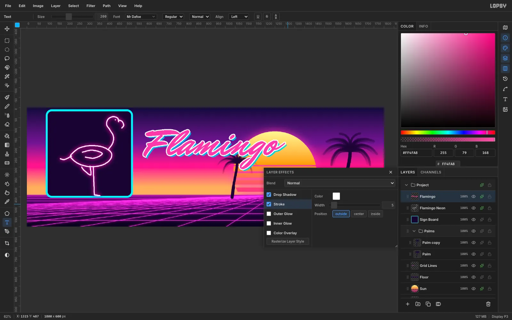

Press [[T]] for the **Text** tool. Choose the **Mr Dafoe** font, Size `200`,
color `#FF4FA8`. Click in empty sky and type `Flamingo`, then press [[Tab]] to
commit.

In **Layer Effects**, add a white **Stroke** (Width `5`) and a hard cyan
**Drop Shadow** (`#26D9FF`, offset `9`/`9`, Blur `0`). The offset shadow is a
signature synthwave detail.

## Tilt the headline

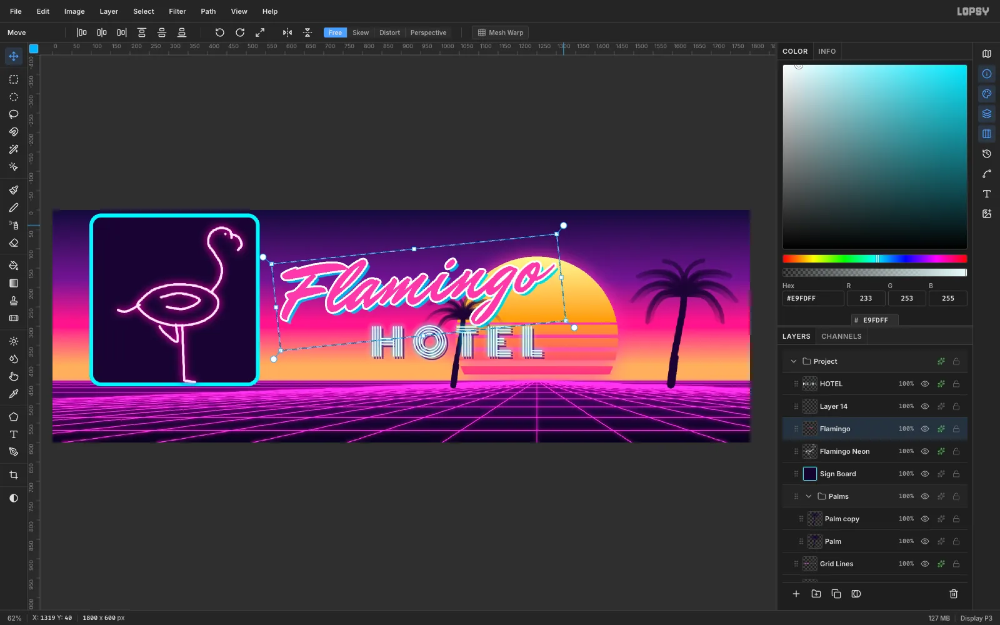

Script titles look livelier with a slight upward tilt. Marquee around the
headline, switch to **Move**, and drag a round rotation handle (just outside a
corner) about 6° counterclockwise. Press [[Enter]], then [[Cmd+D]].

## Add bold HOTEL lettering

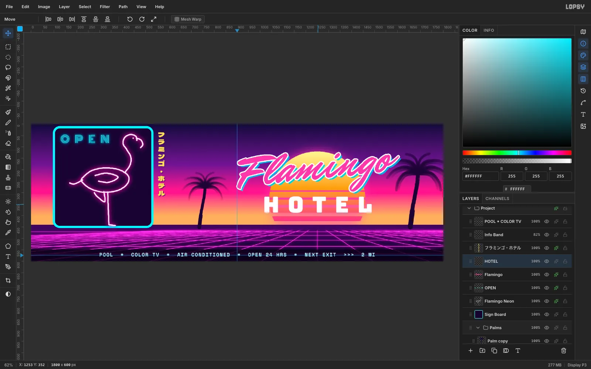

Drag the headline so it sits centered over the sun. Then type `HOTEL` in
**Bungee** at Size `96` in white. In the **Text** panel, set **Letter
spacing** to `36`. Center it under the script.

Add a dark **Drop Shadow** (`#2A0845`, offset `7`, Blur `0`) and a cyan
**Outer Glow** (`#00E5FF`). Solid white letters stay readable from a moving
car in a way thin outlined type can't.

## Add vertical katakana

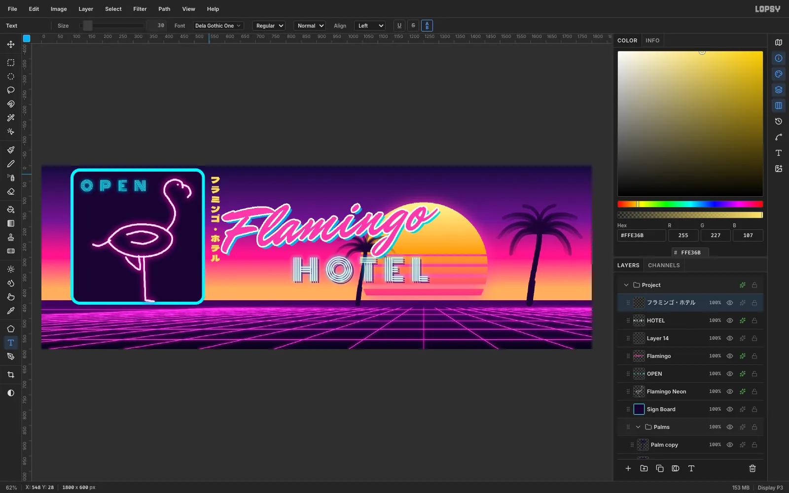

Japanese text is a staple of the style. Choose **Dela Gothic One**, Size `30`,
color `#FFE36B`, and click the **Vertical text** toggle (the stacked A over B)
in the options bar. Click beside the sign and paste `フラミンゴ・ホテル`.

> **Tip:** Pick a font that ships as a single static weight, such as Dela
> Gothic One, for heavy Japanese type.

## Recolor the sign frame

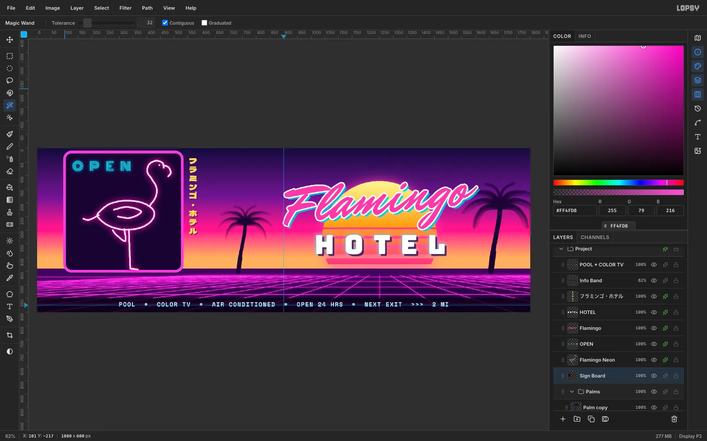

To change just the frame's color, select the `Sign Board` layer, press [[W]]
for the **Magic Wand**, and click the frame. Set the foreground color to
`#FF4FD8` and choose **Edit → Fill**. Add an **Outer Glow** to the board and
give the `OPEN` text a red **Color Overlay** and glow so it reads like a
vacancy light.

## Add the info band

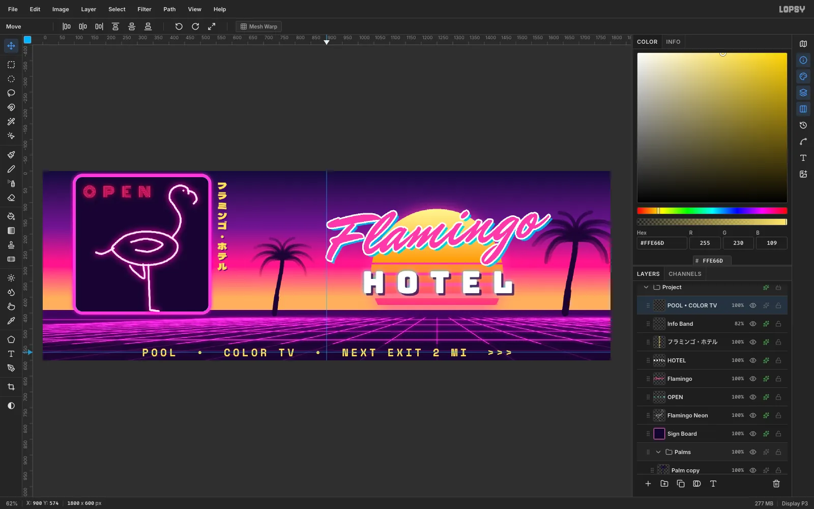

Billboards need a short call to action. Marquee a strip across the bottom
52 px, fill it with near-black, and set the layer's opacity to about 80%.

Type a short tagline in **Space Mono** Bold at Size `34`, color `#FFE66D`, with
letter spacing `8`. Click the top ruler to drop a vertical guide at x = 900,
and center the text on it with the Move tool. Keep it to three items. Nobody
reads six items at highway speed.

## Finish with glow and grain

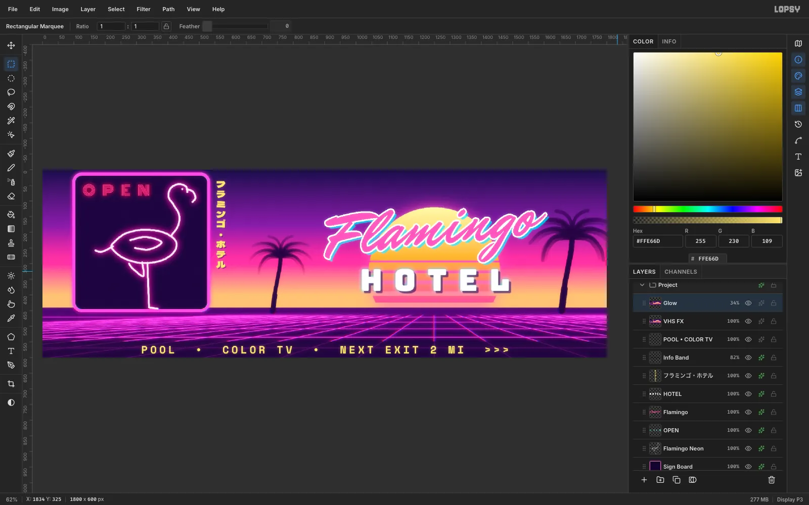

Press [[Cmd+A]], then [[Cmd+Shift+C]] (**Copy Merged**) and [[Cmd+V]], and
name the layer `VHS FX`. Marquee just the floor, apply **Filter → Chromatic
Aberration** at Amount `2`, deselect, and apply **Add Noise** at `5` (Mono)
for grain.

For an overall glow, repeat Copy Merged and Paste into a new `Glow` layer. Apply
**Gaussian Blur** with Radius `14`, set its blend mode to **Screen**, and drop
its opacity to about 35%.

## Export your billboard

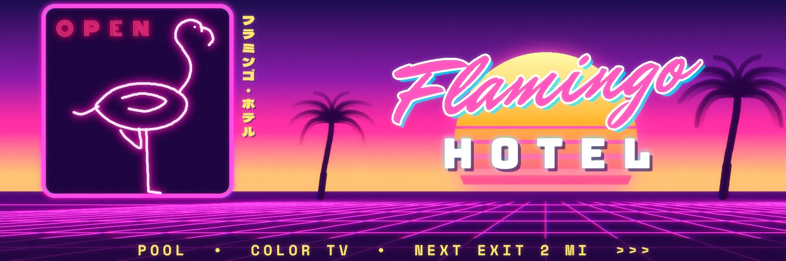

Choose **File → Quick Export PNG** to save the image, and **File → Save
Project** to keep an editable `.lopsy` file with all your layers. For more
glowing type, try [Make a Neon Glow Text Effect](/tutorials/neon-glow-text-effect/).
