Vaporwave takes something familiar and makes it dreamlike. Here that's
Venice. In this tutorial you'll make **Pink Gondola**, a 1200 × 1600 poster
where a gondola floats across a checkerboard floor in front of a pastel Doge's
Palace. A halftone sun sets behind it, and a Windows-style `gondola.exe` dialog
reports that you're drifting to 1989.

Along the way you'll use:

- gradients with transparent stops
- the Clouds, Halftone and Pattern Fill filters
- the **Perspective** transform mode
- groups, Merge Down and rotations
- stroke, glow and drop-shadow effects
- three Google Fonts
- a root-level Vignette adjustment

Every piece stays on its own layer, so you can rearrange it later.

## Set up a pastel sunset gradient

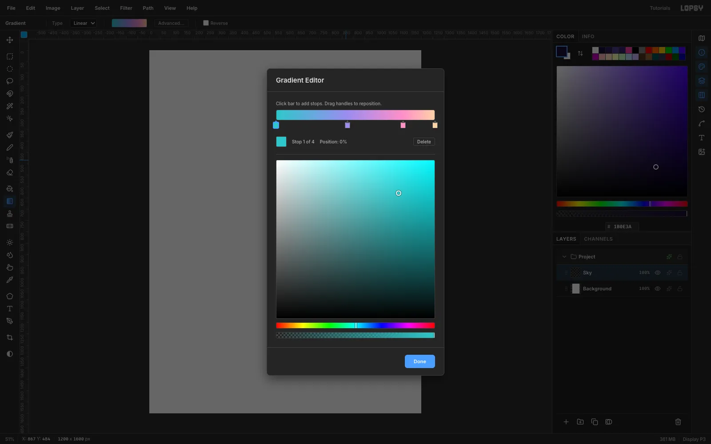

Choose **File → New**, set **Width** to `1200` and **Height** to `1600`, keep
a white background and click **Create**. Double-click `Layer 1` and rename it
`Sky`.

Pick the **Gradient** tool and click **Advanced…** to open the Gradient
Editor. Click the handle row to add stops. Select each stop and pick its colour
on the saturation square and hue strip:

- teal `#2EC4C9` at 0 %
- lavender `#9D8CF0` at about 45 %
- pink `#FF8FC8` at about 80 %
- peach `#FFD1A8` at 100 %

Click **Done**.

## Paint the sky and place guides

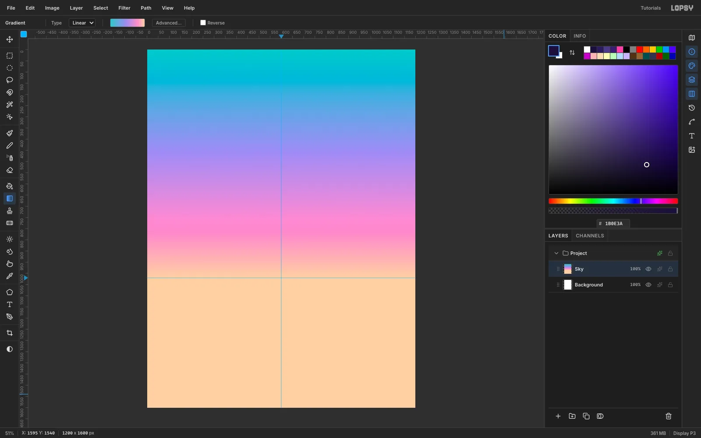

Drag the gradient straight down from the top edge to **y 1020**. That line
will be the horizon, and everything below it is peach for now.

Click the top ruler above x 600 to drop a vertical center guide. Then click
the left ruler at y 1020 to drop a horizontal horizon guide. You'll line up
the sun, the palace and the floor against these two guides.

## Render clouds

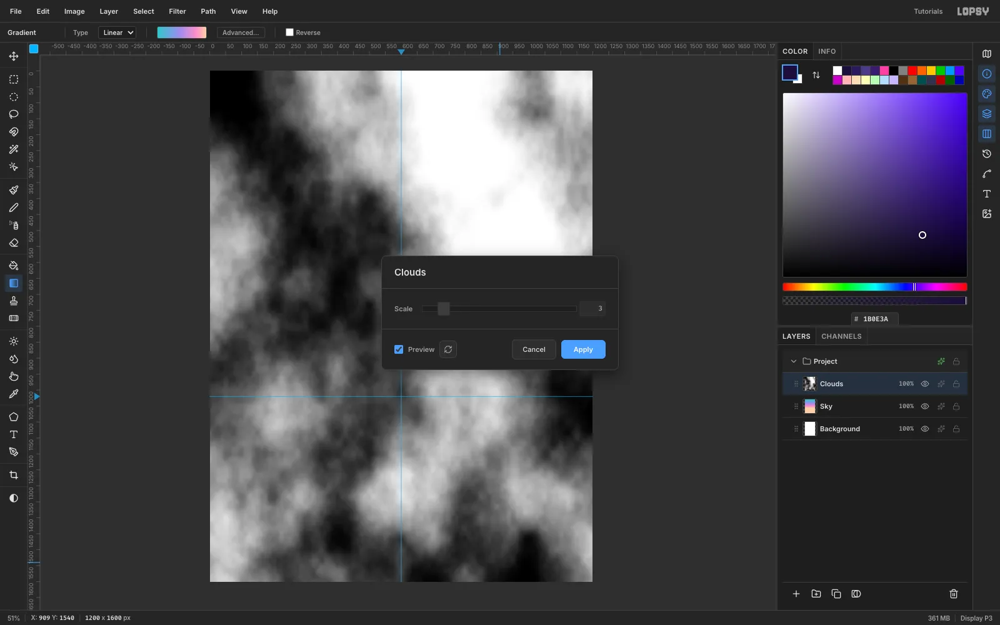

Click **Add Layer** and name the new layer `Clouds`. Choose
**Filter → Clouds…**, set **Scale** to `3` and tick **Preview**. Clouds is
randomized, so if you don't like the pattern, preview it again for a new one.
Click **Apply**.

## Blend the clouds into the sky

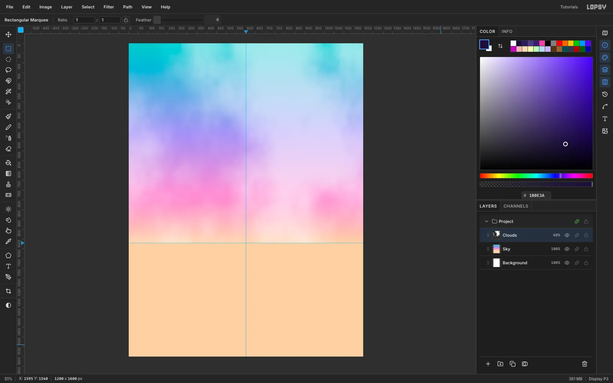

Open the layer's effects drawer (the ✦ button on its row), set **Blend** to
**Screen** and close the drawer. Then set the row's opacity to **60 %**.
Screen only brightens, so the clouds glow over the gradient and don't go grey.

Rectangular-marquee everything below the horizon guide and press
[[Delete]]. Press [[Cmd+D]] to deselect.

## Draw the sun

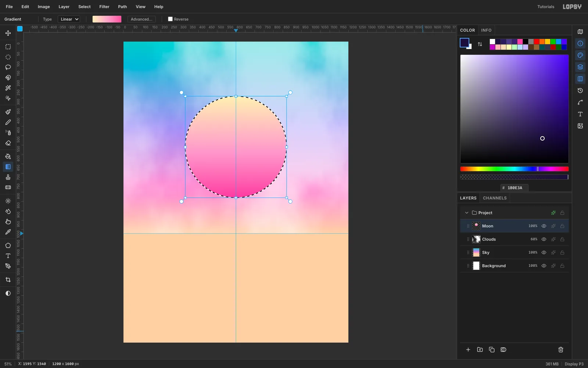

Add a layer named `Moon`. In the Gradient Editor, set three stops: pale yellow
`#FFF1B8`, pink `#FF9CC8` at 55 % and hot pink `#FF4F9E`.

With the **Elliptical Marquee**, draw a 540 × 540 circle from (330, 290). The
Options bar's ratio lock or the guides help keep it round. Drag the gradient
from the top of the circle to the bottom. Deselect.

Open the effects drawer, enable **Outer Glow** in cream `#FFF4D6`, then set
**Size** `60`, **Spread** `10` and **Opacity** `70`.

## Add a halftone fade

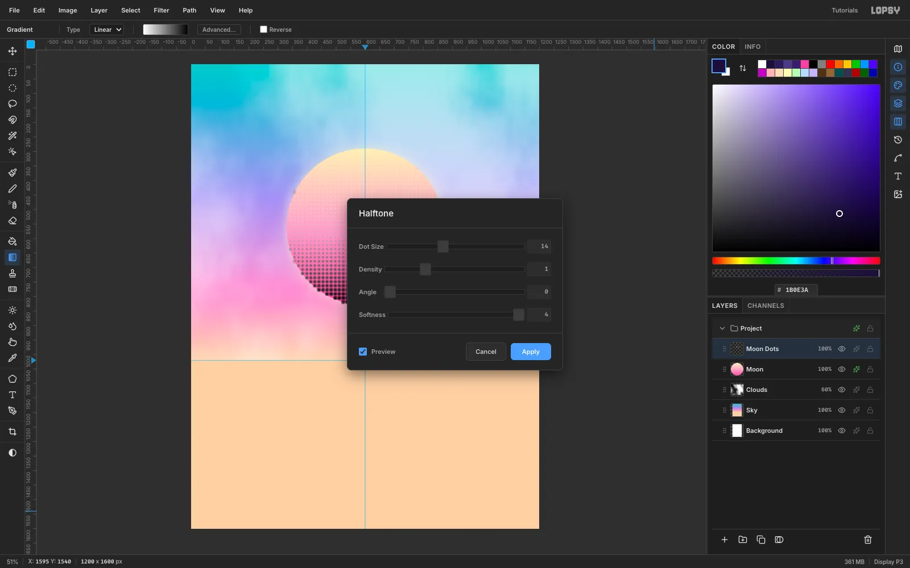

Most vaporwave suns are cut into stripes. This one fades out in halftone dots
instead.

1. Add a layer named `Moon Dots` and set the gradient to plain white → black.
2. Re-draw the same circle and drag the gradient from **y 470** to the bottom
   of the sun, then deselect.
3. Choose **Filter → Halftone…** and set **Dot Size** `14`, **Angle** `0` and
   **Softness** `10`. Dark areas become big dots and light areas become tiny
   ones. Click **Apply**.

## Recolor and trim the dots

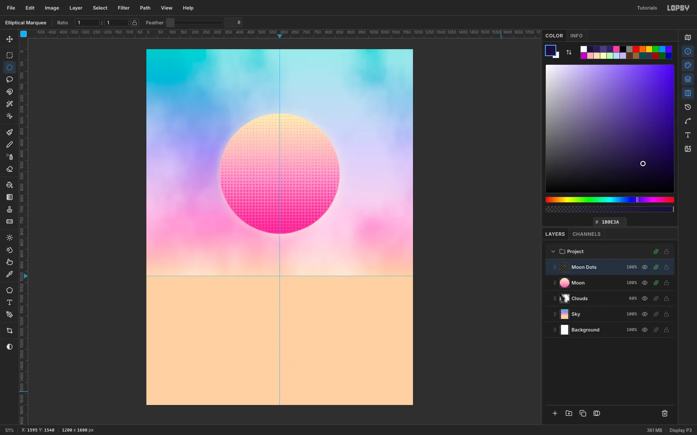

Enable **Color Overlay** on `Moon Dots` in `#E23C93`, so every dot turns a
deep sunset pink.

Dots near the rim poke out past the circle. Draw a slightly smaller circle
(about 532 px) over the sun, choose **Select → Inverse** and press
[[Delete]]. The edge is clean again.

## Make a checkerboard tile

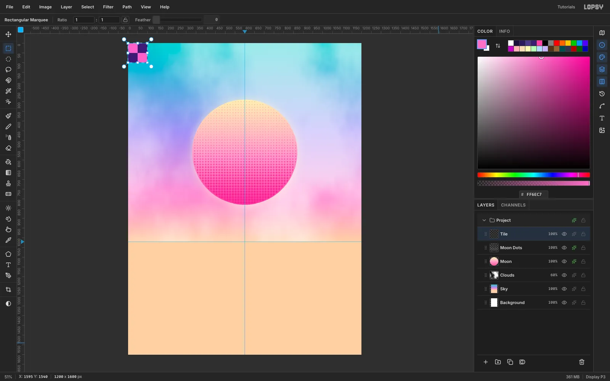

Add a temporary layer.

1. Marquee a 100 × 100 square at the top-left corner and **Edit → Fill** it
   with deep purple `#3A1C71`.
2. Fill the top-left and bottom-right 50 px quarters with pink `#FF6EC7`.
3. Marquee the whole 100 × 100 tile and choose **Edit → Define Pattern**.

Delete the temporary layer.

## Tilt the floor with Perspective

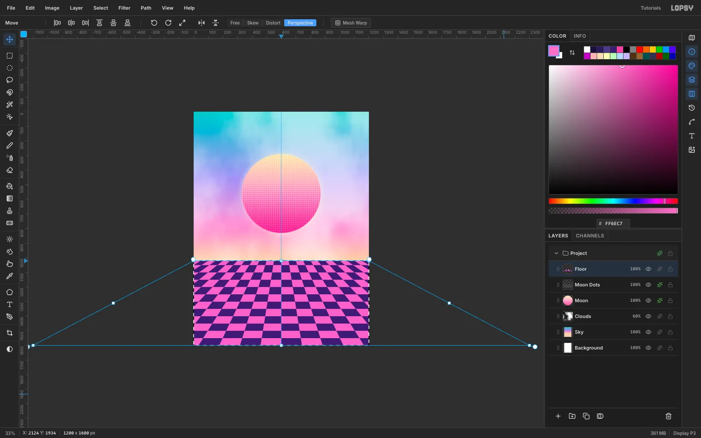

Click the `Moon Dots` row, then add a layer named `Floor`. Marquee from the
horizon to the bottom of the canvas (0, 1020 to 1200, 1600). Choose
**Edit → Fill with Pattern…**, pick the checker tile and click **Apply**.

Zoom out with [[Cmd+-]] a couple of times so there's room around the canvas.
Keep the marquee, switch to the **Move** tool and click **Perspective** in the
Options bar. Drag the **bottom-left corner** about 1100 px out to the left. The
bottom-right corner mirrors it, so the tiles now converge toward the horizon.

## Commit the floor

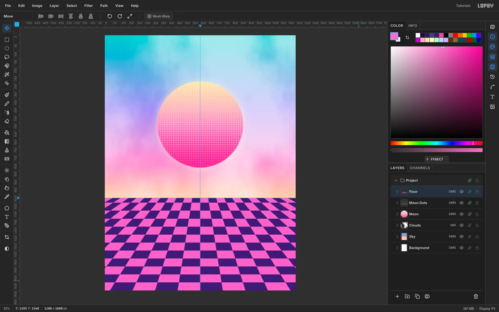

Click **Free**, then press [[Cmd+D]] to commit the transform. Press
[[Cmd+0]] to fit the canvas back in the window. Anything pulled past the
canvas edge is simply cropped away.

## Fade the floor into haze

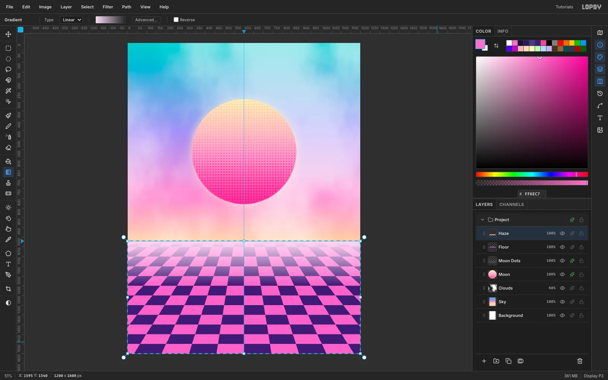

Add a layer named `Haze`. Set two gradient stops, both pale pink `#F8D8F2`.
Select the right-hand stop and drag the **Opacity** bar under the colour
picker all the way to transparent.

Marquee the floor area, then drag the gradient from the horizon down to about
**y 1250**. The far rows now dissolve into mist. Because the haze fades out,
there's no hard seam between it and the floor.

## Block in the palace

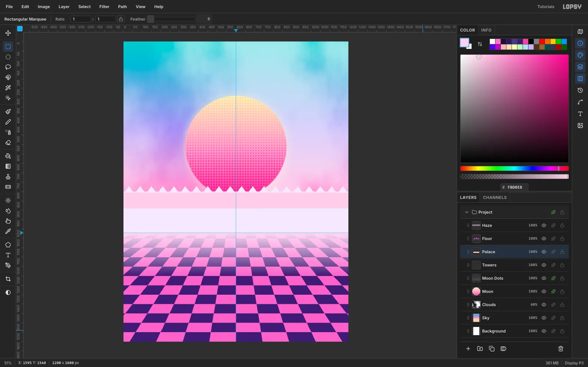

Click `Moon Dots` and add two layers: `Towers`, then `Palace` above it.

1. On `Palace`, marquee a band from y 800 down to the horizon and fill it with
   `#F3E9FF`.
2. Crenellate the roofline with the **Lasso**: make one small triangle every
   60 px along y 800 and **Edit → Fill** each one.
3. Fill a band from y 805 to 890 with pink `#FBD0E8`. That's the Doge's Palace
   pink upper wall.

## Cut the arches

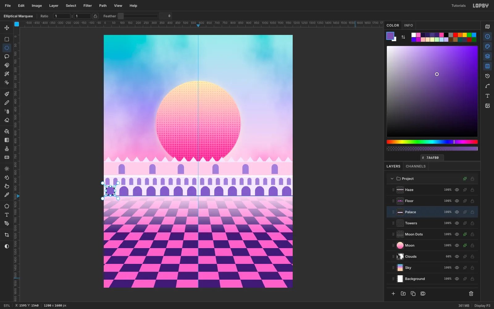

Each arch is a rectangle plus a circle on top, filled with the same colour:

- **Wall windows:** six tall windows in `#9C7FD6`, each a 40 × 45 rectangle
  under a 40 px circle.
- **Upper loggia:** small arches every 50 px, 26 px wide.
- **Lower arcade:** large 58 px arches every 86 px in deeper `#7E5DC4`.

Finish with a white 8 px cornice at y 889 and a thin `#7A4FB0` line on the
horizon. The line gives the palace a clean base.

## Add domes and the campanile

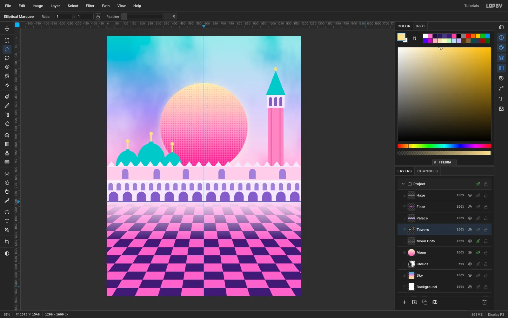

On `Towers`, which sits behind the palace:

- **Domes:** three teal `#3FC6C8` domes made from elliptical fills, with a
  small lasso triangle on each for the onion point. Add gold `#FFE08A`
  finials: a thin rectangle plus a small circle.
- **Campanile:** a pink `#F48CC0` shaft at x 995–1091 with two darker
  pilaster strips, a lavender belfry with three arches, a lasso-filled teal
  spire, and a gold angel at the tip.

The tower sits far enough right to leave room for the subtitle later.

## Group the skyline

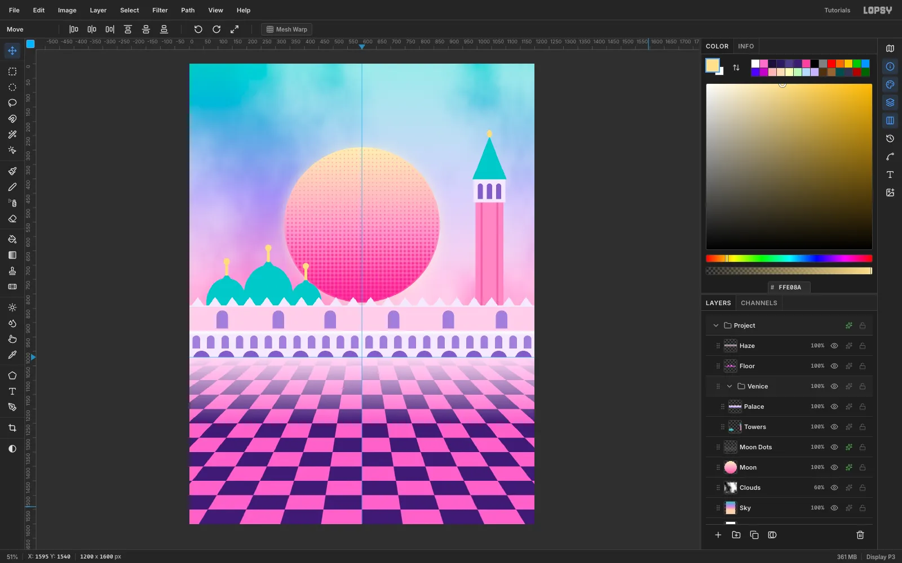

Click `Towers`, [[Shift]]-click `Palace` and choose **Layer → Group Layers**.
Rename the group `Venice`.

To try it out, click the group and drag with the **Move** tool, and the whole
skyline moves together. Press [[Cmd+Z]] to put it back. Undo and redo restore
it pixel-for-pixel.

## Draw the gondola hull

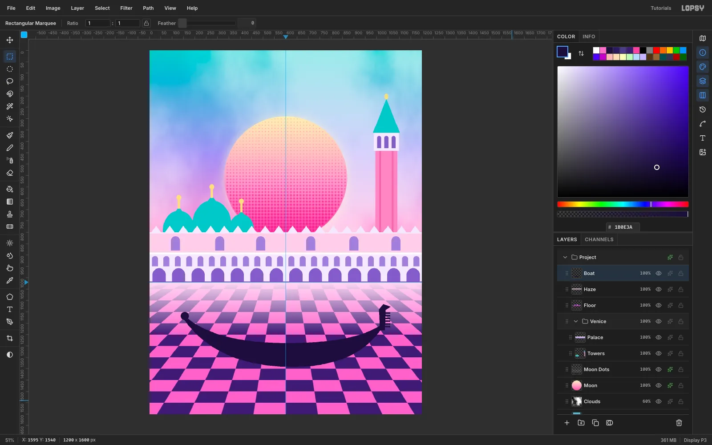

Click `Haze` and add a layer named `Boat`. With the **Lasso**, trace a long
crescent that sits low in the middle and rises at both ends, and fill it with
near-black purple `#1B0E3A`. Add:

- a small circle for the stern curl
- a lasso blade for the bow **ferro**, with six short 6 px teeth made from
  marquee rectangles

## Add the gondolier

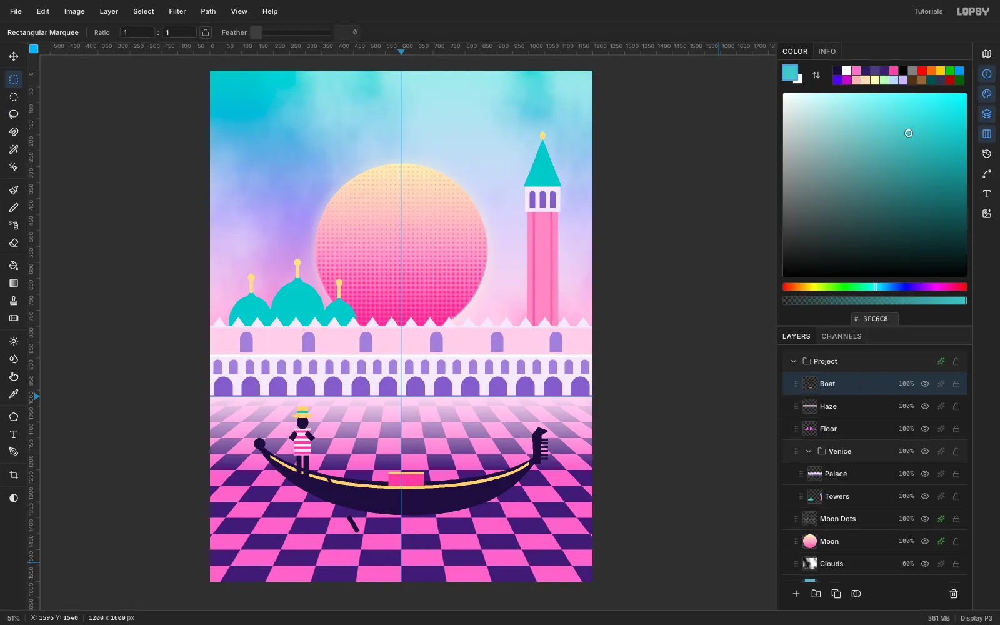

1. Fill a pink `#FF4FA3` velvet seat in the middle of the boat.
2. Lasso a thin gold `#FFD27A` rail along the gunwale so it overlaps the
   bottom of the seat.
3. Build the gondolier from simple shapes:
   - two dark legs
   - a white torso with 8 px pink stripes every 17 px
   - small lasso arms
   - a round head
   - a straw boater: a gold brim ellipse and crown, with a teal ribbon
4. Press [[Cmd+D]] so no selection is left active.

## Outline it in neon

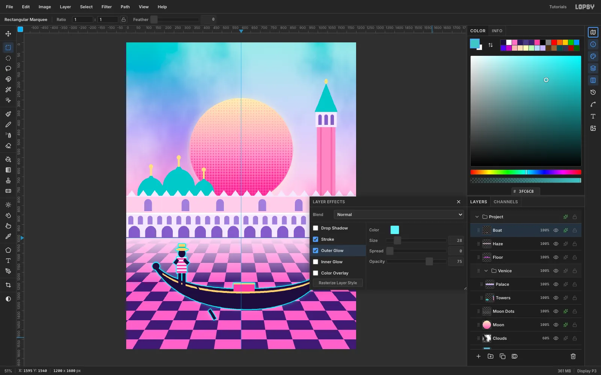

Open `Boat`'s effects drawer:

- Enable **Stroke** in cyan `#5CF6FF` with **Width** `4`, and click the
  **outside** position.
- Enable **Outer Glow** in the same cyan with **Size** `28` and **Opacity**
  `75`.

The boat now reads like a neon sign against the busy floor.

Under the boat, add a `Gondola Shadow` layer. Set the marquee **Feather** to
`30`, fill a wide ellipse in `#2A1450` and set the layer to **Multiply** at
90 %. Reset Feather to `0`.

## Rock the boat

Click `Boat` and marquee tightly around it, leaving a couple of spare pixels.
Switch to **Move**, then drag just outside the top-right corner handle to
rotate it about 3° counter-clockwise. Press [[Cmd+D]] to commit. The small
tilt makes the gondola look like it's afloat, not parked.

## Give the gondolier an oar

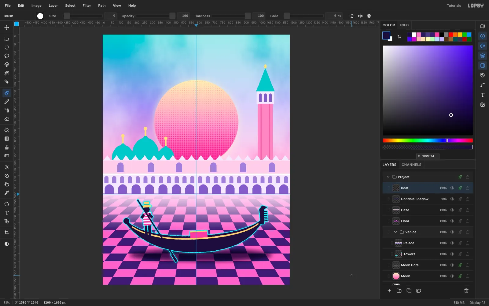

With no selection active, pick the **Brush** at **Size** `9` and **Hardness**
`100` in the dark purple. Click above the gondolier's hands, then
[[Shift]]-click down past the hull to draw a straight oar.

> **Tip:** An active lasso or marquee clips brush strokes, so a stroke drawn
> right after a lasso fill can seem to vanish. Press [[Cmd+D]] first.

## Pattern-fill striped mooring poles

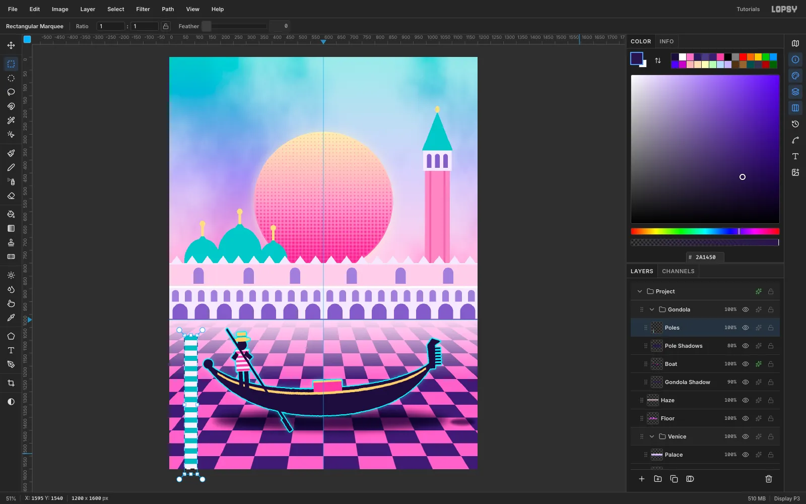

Venice's striped *pali* poles are just another pattern:

1. On a temporary layer, make a 40 × 40 tile: white on the bottom half, teal
   `#2FB8C0` on the top half. **Define Pattern**, then delete the layer.
2. Add a `Poles` layer. Marquee a 50 px-wide column at the bottom left and
   **Fill with Pattern…** with it.
3. Add two thinner poles on the right at **Scale** `50`, running down to about
   y 1420.
4. Cap each pole with a teal ellipse. Put soft feathered Multiply shadows at
   the base of the right-hand poles.

## Lean the foreground pole

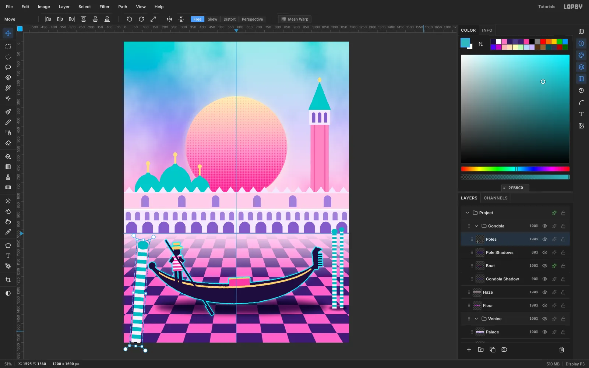

Marquee just the left pole and rotate it about 4° clockwise with the Move
tool's rotate handle. Only the selected pixels turn, so the right-hand poles
stay upright. Press [[Cmd+D]] to commit.

## Set the Shrikhand headline

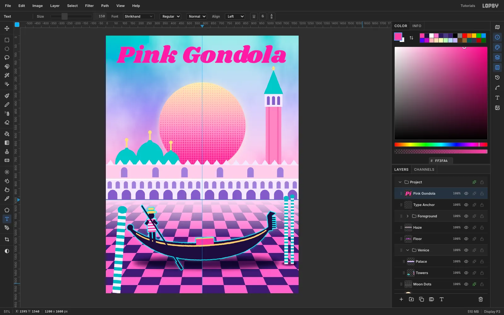

Add an empty layer, drag it to the top of the Layers panel, and click it. New
text lands above the active layer, so this puts the type above everything
else.

Pick the **Text** tool, set **Size** to `150`, choose **Shrikhand** in the
font browser and set the colour to `#FF3FA4`. Click near the top-left of the
sky and type `Pink Gondola`. Press [[Tab]] to commit.

## Style the headline

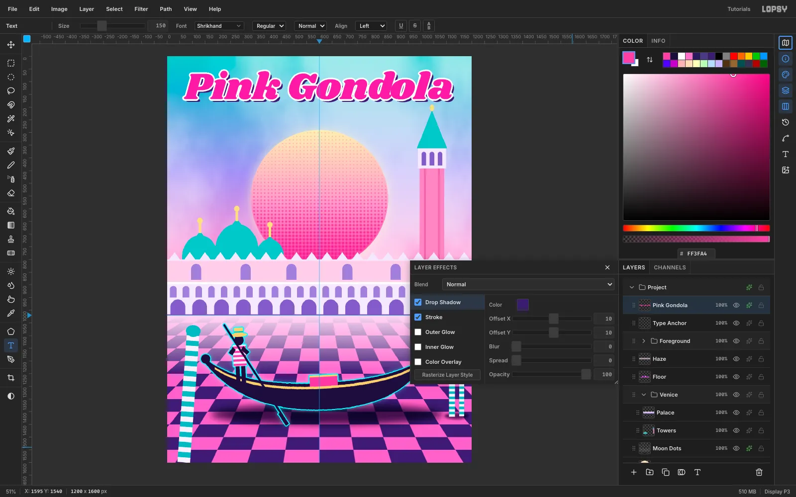

Open the headline's effects drawer:

- Enable an outside **Stroke** in white with **Width** `6`.
- Enable **Drop Shadow** in `#3A1C71` with **Offset X** and **Offset Y**
  `10`, **Blur** `0` and **Opacity** `100`.

The hard purple shadow stands out against the teal sky. A cyan shadow would
disappear into it.

## Add the full-width subtitle

Vaporwave loves full-width characters. Copy
`ＶＥＮＥＺＩＡ　・　ＮＩＧＨＴ　ＣＲＵＩＳＥ　・　１９８９` to your clipboard.
Click the anchor layer, set **Size** `26`, choose **DotGothic16** and white,
click in empty sky, then paste with [[Cmd+V]] and press [[Tab]].

Give it an outside `#3A1C71` **Stroke** of `3`, so the thin letters stay
readable over the scanlines you'll add later. Then drag it with **Move** until
it's centred under the headline, clear of the spire.

## Scatter sparkles

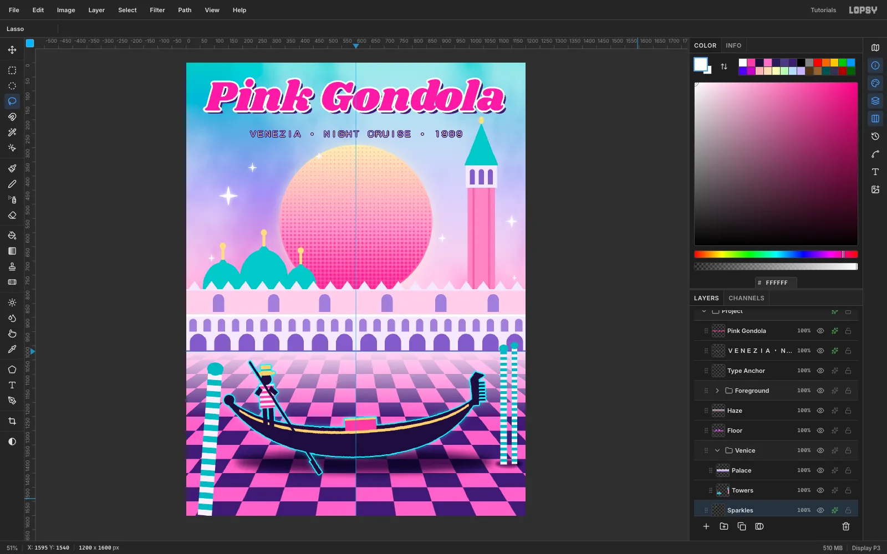

Click `Moon Dots` and add a `Sparkles` layer. Lasso a few eight-point
four-pointed stars in white, in a few sizes. Keep them in open sky, away from
the type. Enable **Outer Glow** in white, **Size** `18`, **Opacity** `90`.

## Build a retro dialog window

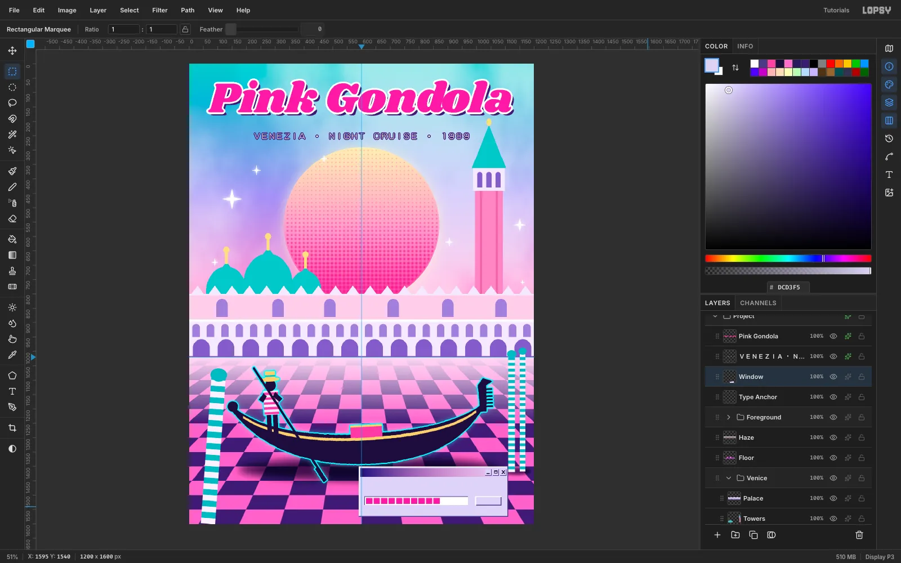

Click the anchor layer and add a `Window` layer. Marquee a 520 × 175 box at
(590, 1400) and fill it with lavender `#DCD3F5`. Fake the bevel with 3 px
fills: white on the top and left edges, dark `#4B3A86` on the bottom and
right.

Then add the details:

- a navy-to-pink gradient title bar
- three small bevelled buttons, with a bar, a box and two lasso slashes for
  the × symbol
- a progress bar with ten pink blocks
- an OK button

## Label the dialog

Click `Window` before each new text layer, so changing the font doesn't
restyle the previous one:

- `gondola.exe` in **VT323** 28 white, in the title bar
- `ゴンドラ  Now drifting to 1989...` in **DotGothic16** 26 dark purple
  (paste it)
- `OK` in VT323 on the button

Then click each text layer from the top down and choose **Layer → Merge Down**
until everything is flattened into `Window`.

## Tilt the dialog

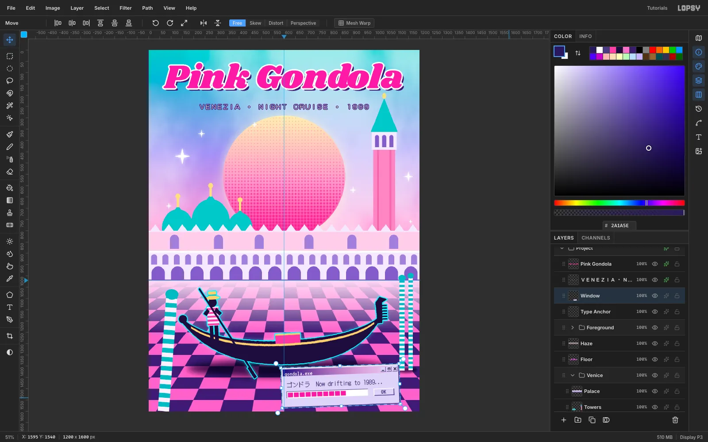

Marquee the window and rotate it about 2° counter-clockwise. A slight tilt
makes it look dropped onto the poster, not printed on it. Press [[Cmd+D]].

## Drop a hard shadow under the dialog

Enable **Drop Shadow** on `Window` in `#2A1A5E`, with offset `10`/`10`,
**Blur** `0` and **Opacity** `90`. It's the same flat, hard shadow as the
headline, which ties the two together.

## Add CRT scanlines

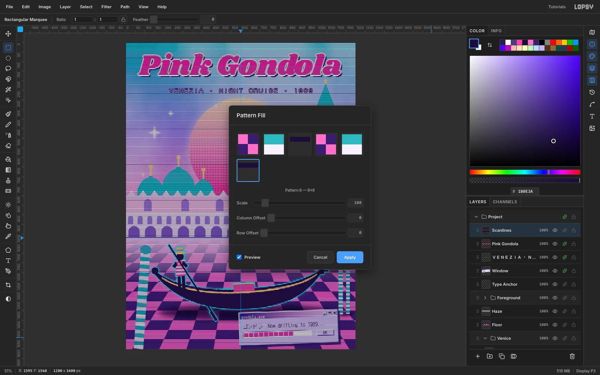

Click the headline row and add a `Scanlines` layer on top.

1. Fill an 8 × 2 strip at the top-left corner with `#1B0E3A`.
2. Marquee 8 × 6 and **Define Pattern**. The transparent rows are part of the
   tile.
3. Deselect and **Fill with Pattern…** the whole layer.
4. Set the layer to **Multiply** at **14 %**, for a faint old-monitor texture.

## Finish with a vignette

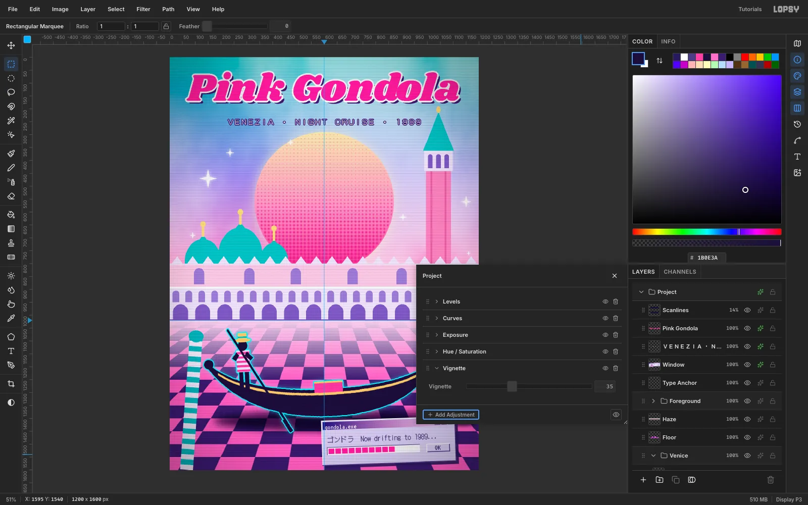

Choose **Layer → Adjustment Layer…** (click **Got it** on the info dialog).
Click **Add Adjustment → Vignette** and set it to `35`. The corners darken
slightly, which pulls the eye into the centre and gives the pastel palette a
little more depth.

Save your project with **File → Save Project**, then **File → Quick Export
PNG** to export your poster.
