Y2K design is the future as people imagined it in 1999. Everything is glossy, translucent or chrome. Buttons look like sweets, type is wide and techno, and the background is a soft pastel sky full of sparkles, bubbles and grids. In this tutorial you'll make a 1200 × 1800 px menu for **Jupiter Dumplings**, an imaginary dumpling bar whose four dumplings are named after Jupiter's four big moons.

The page has:

- a pastel sky with grain, a bulging cyber grid made with **Pattern Fill** and **Lens Distortion**, scanlines and **Sunburst** rays
- a banded planet painted with stripes and the **Smudge** tool, rounded out with **Liquify**, then shaded and glossed
- a chrome ring that passes behind the planet and in front of it, with a shadow where it crosses
- a chrome title with a hard reflection line, made with a multi-stop gradient on rasterized type
- gel pills and buttons built from rounded rectangles and layer effects
- a frosted-glass "OS window" made with **Copy Merged** and a blur, holding the four dishes
- dumpling icons drawn once and recoloured with **Hue/Saturation**
- sparkles drawn with the **Pen** tool, copied around the page and given a **Bloom**

The fonts are free Google Fonts:

- **Zen Dots** for the JUPITER title
- **Krona One** for DUMPLINGS, the dish names and the sides bar
- **Michroma** for the dish descriptions
- **Silkscreen** for the window title, tagline, prices and footer

The palette:

- Sky `#7FD3FF` → `#E9E4FF` → `#FFB3DF`
- Planet bands `#B9A6FF`, `#FF8FD0`, `#7FD3FF`, `#C59BFF`, `#FF6FC0`, `#5CC8F0`, `#A98BFF`
- Chrome `#FFFFFF` → `#C6ECFF` → `#6FA3FF` → `#1E1660` → `#FF5FB8` → `#FFD3EC`
- Hot pink `#FF3FA4`, navy ink `#1E1660`
- Window bar `#8FE3FF` → `#2F9BEA` → `#1F6FD6` → `#1A4FB8`
- Price tags `#2B2470`, sides bar `#8E6BFF`
- Dumpling pink `#FF9ACD`, pleats `#D9468F`

Each part of the page gets its own group: `Planet`, `Title` and `Menu`. New layers appear above whichever layer is selected, so select a layer inside a group before you add to it. Collapse a group before you select it and click **New Group**, so the new group sits next to it instead of inside it.

## Paint the sky

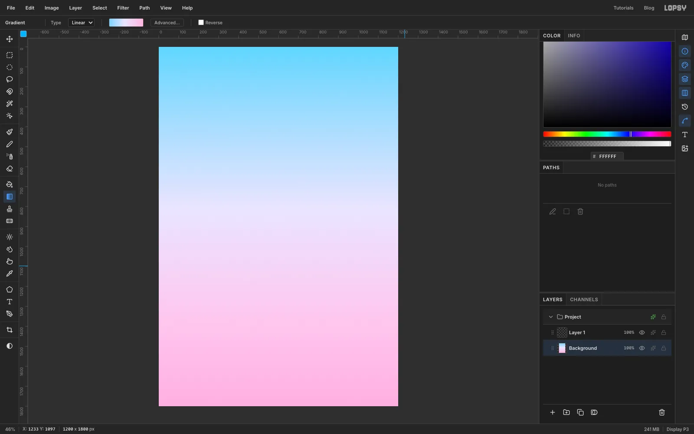

Create a **1200 × 1800** document and select `Background`. Choose the **Gradient** tool, set the type to **Linear** and click **Advanced...**. Make three stops: `#7FD3FF` at the left, `#E9E4FF` at about 45%, and `#FFB3DF` at the right. Drag from the top edge of the canvas straight down to the bottom.

Run **Filter → Add Noise...** at **3**, **Mono**. You'll barely see it, but it stops the gradient looking like flat plastic.

## Draw one grid cell

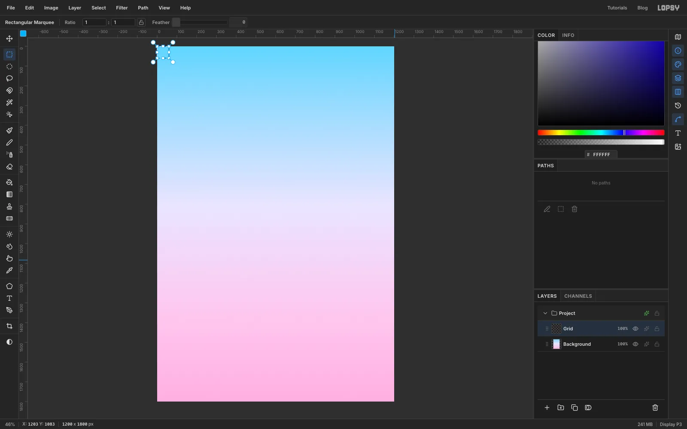

Rename `Layer 1` to `Grid`. The grid is one 60 px cell repeated across the page.

Choose the **Pencil** at **Size 2** with white. Click at the very top-left corner of the canvas and [[Shift]]-click 60 px to the right. Then click the corner again and [[Shift]]-click 60 px straight down. To select the cell exactly, click once on the canvas with the **Rectangular Marquee** (without dragging) and enter **From 0, 0** and **To 60, 60**.

Choose **Edit → Define Pattern**.

## Tile the grid

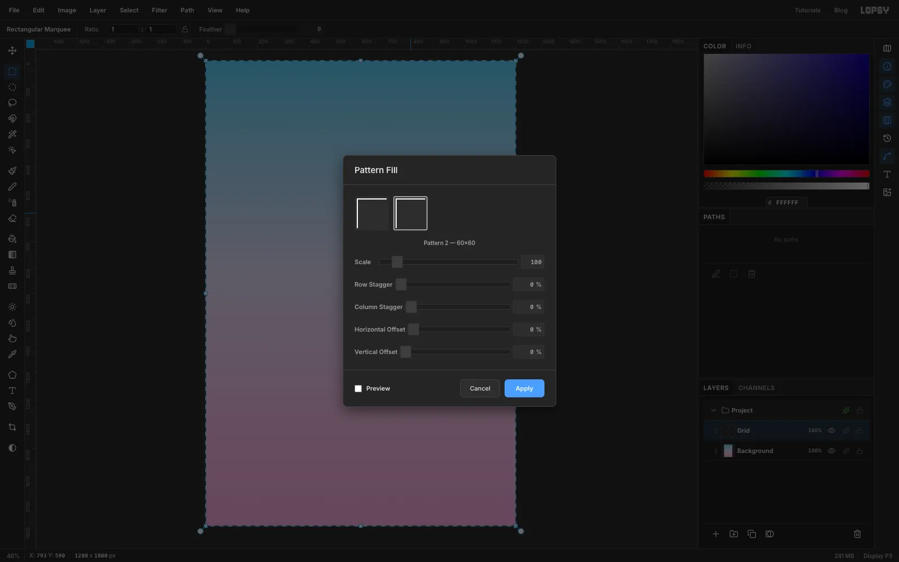

Select all and press [[Delete]] to clear the cell you drew. Choose **Edit → Fill with Pattern...**, pick the new 60 × 60 pattern and click **Apply**. The whole layer fills with a white grid.

## Bend the grid

Run **Filter → Lens Distortion...** with **Strength 60** and **Zoom 160**. Positive strength bows the lines outward, and the high zoom pushes the bent edges back out past the canvas so no empty corners show. The grid now looks like it's wrapped around a globe, a very Y2K effect.

Set the `Grid` layer to **50%** opacity.

## Add scanlines

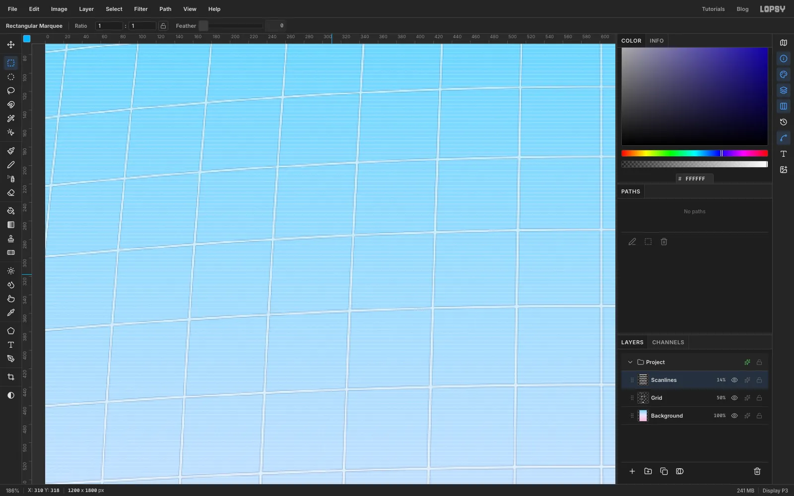

Add a layer called `Scanlines`. Use the same pattern trick at a tiny size:

1. Set the Pencil to **Size 1**, click at the top-left corner and [[Shift]]-click a few pixels to the right.
2. Click once with the **Rectangular Marquee** and enter **From 0, 0**, **To 4, 4**, then choose **Edit → Define Pattern**.
3. Select all, press [[Delete]], then **Edit → Fill with Pattern...** with the new 4 × 4 pattern.

Set the layer to **14%** opacity. Zoom in to check it. You should see a fine stripe every 4 px, like an old monitor.

## Add sunburst rays

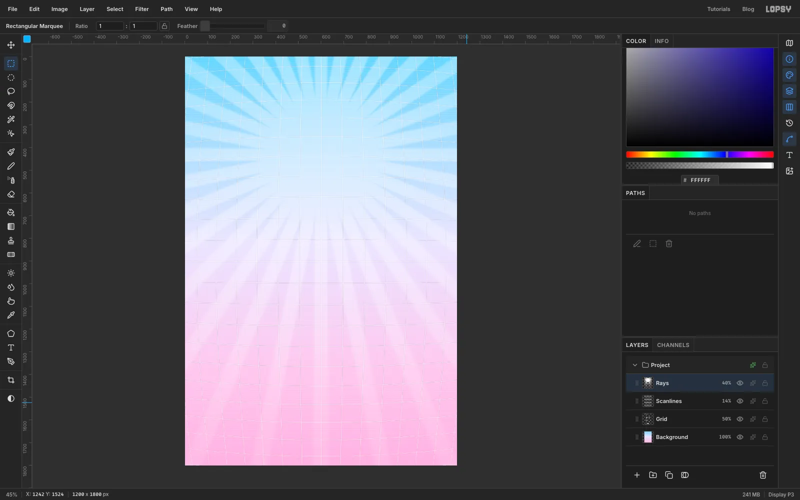

Add a layer called `Rays` and set the foreground to white. Run **Filter → Sunburst...** with **Rays 32**, **Width 42**, **Taper 40**, **Fade 75**, **Softness 25** and **Center Y 24**. That puts the burst's centre about a quarter of the way down, where the planet will sit. Set the layer to **40%** opacity.

## Stripe the planet

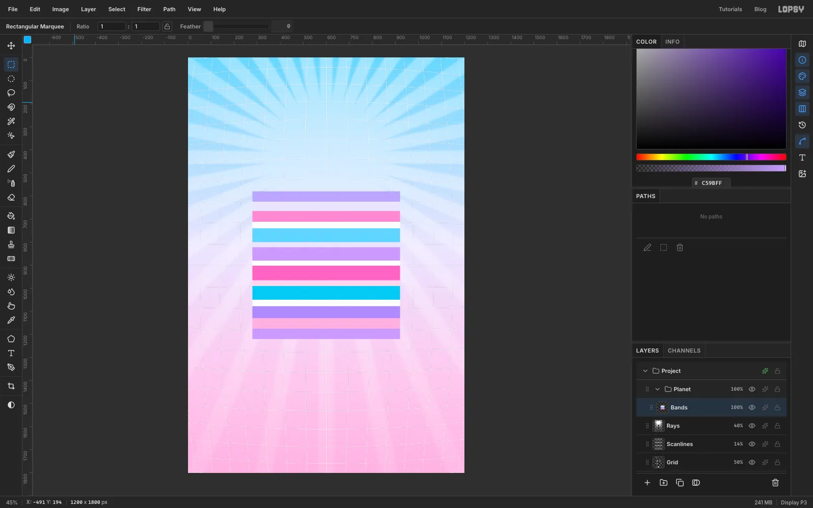

Click **New Group** and call it `Planet`, then add a layer inside it called `Bands`. Build the planet in the middle of the canvas, where there's room to work. You'll move it up once it's finished.

With the **Rectangular Marquee**, fill a stack of 15 stripes from x 280 to x 920, starting at y 580. Start each stripe exactly where the last one ended. From the top, the colours and heights are:

1. `#B9A6FF`, 45 px
2. `#E9E4FF`, 40 px
3. `#FF8FD0`, 47 px
4. white, 28 px
5. `#7FD3FF`, 60 px
6. `#E9E4FF`, 22 px
7. `#C59BFF`, 58 px
8. white, 22 px
9. `#FF6FC0`, 63 px
10. `#FFD6EE`, 25 px
11. `#5CC8F0`, 60 px
12. white, 28 px
13. `#A98BFF`, 52 px
14. `#FFB3DF`, 45 px
15. `#C59BFF`, 45 px

For each one, draw the marquee, set the foreground and choose **Edit → Fill**. Uneven stripe heights look more like a gas giant than even ones.

## Swirl the stripes

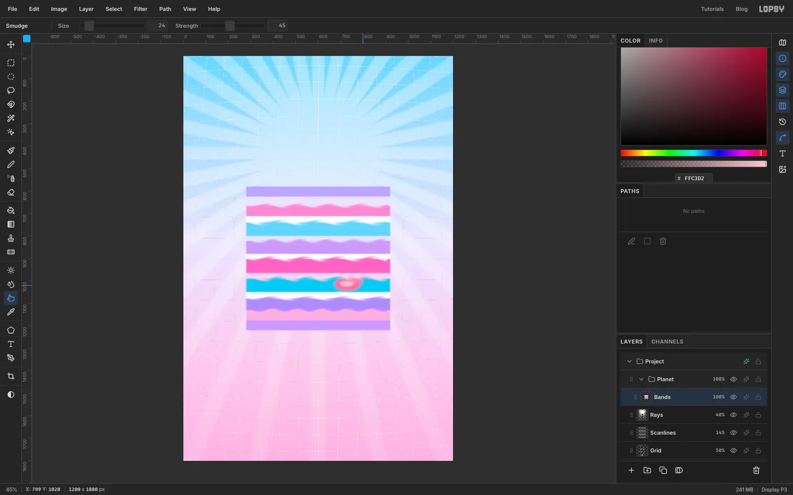

Run **Filter → Gaussian Blur...** at **5** to soften the stripe edges.

Now paint a storm. Draw an **Elliptical Marquee** about 116 × 60 px on the lower blue band, right of centre. Choose **Select → Feather…** at **8** and fill it with `#FF7A9E`. Draw a smaller oval inside it, about 60 × 26 px, feather it by **6** and fill it with `#FFC3D2` for a lighter core.

Choose the **Smudge** tool at **Size 34** and **Strength 70**. Drag a gentle wave along each line where two stripes meet, from the left end of the block to the right. A shallow up-and-down zigzag is enough. Finish with a loop around the storm at **Size 24**, **Strength 45**, so it looks like it's turning.

## Cut out the planet

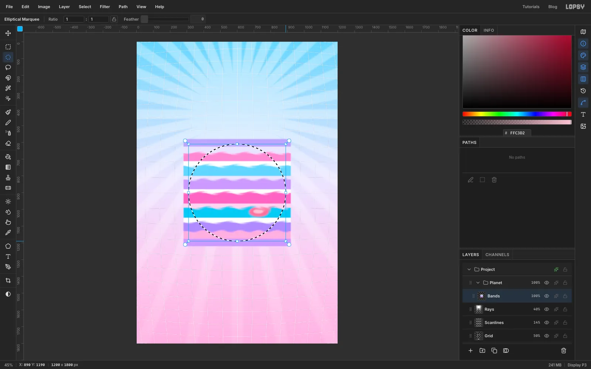

Draw an **Elliptical Marquee** circle **580 px** across, centred on the stripes. Choose **Select → Inverse** and press [[Delete]]. You're left with a striped disc.

## Round it out with Liquify

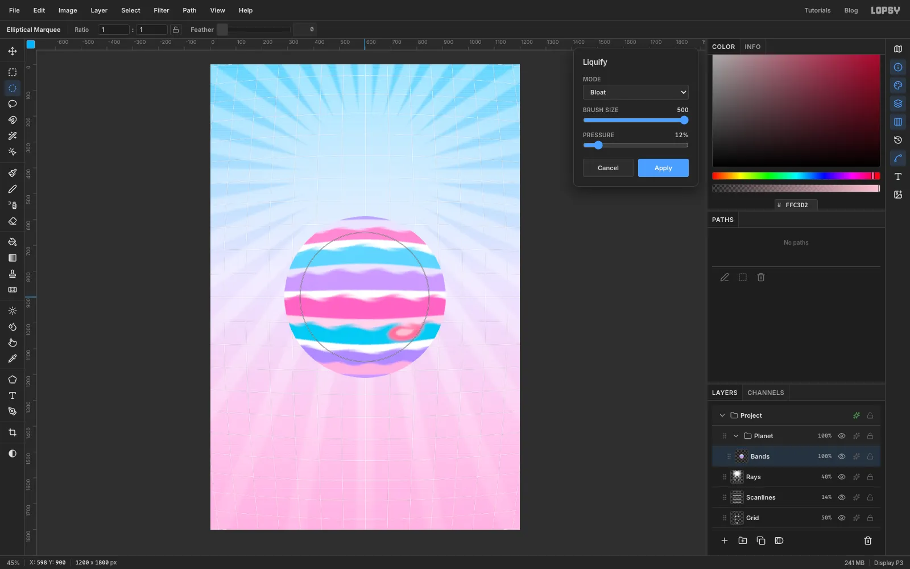

Stripes on a flat disc look like a badge, not a ball. A small bloat in the middle fixes that by stretching the centre bands and squeezing the edge ones.

Choose **Filter → Liquify...**, set **Mode** to **Bloat**, **Brush Size** to **500** and **Pressure** to **12%**. Press on the centre of the planet and hold it for half a second without moving, then click **Apply**. If the bands bulge too much, cancel and try a shorter press.

Bloat also pushes the disc's edge outward a little, so trim it again: draw the same 580 px circle, choose **Select → Inverse** and press [[Delete]].

## Shade the planet

Add a layer called `Shade` above `Bands` and draw the 580 px circle selection again.

Choose the **Gradient** tool, set the type to **Radial** and open **Advanced...**. Use four stops:

- white at **0%** opacity, at the left end
- `#B4A6FF` at **0%** opacity, at about 40%
- `#6B55D8` at about **55%** opacity, at about 75%
- `#2B1D7A` at full opacity, at the right end

Drag from the upper left of the planet to its lower-right edge. Deselect and set the layer's blend mode to **Multiply**. The light now seems to come from the upper left.

## Add a glossy highlight

Add a layer called `Gloss`. Draw an **Elliptical Marquee** about 300 × 150 px over the upper left of the planet and choose **Select → Feather…** at **14**.

Make a linear gradient from white at **95%** opacity to white at **0%**, and drag it from the top of the oval to its bottom. Deselect. Draw a rectangle around the highlight, switch to the **Move** tool and drag a corner's rotate handle to tilt it about **32°** counter-clockwise, so it follows the curve of the planet. Press [[Cmd+D]] to finish.

## Make it glow

The feathered highlight is a little faint, so click **Duplicate Layer** on `Gloss` to double its strength. Then choose **Layer → Merge Down** to fold `Gloss copy` back into `Gloss`.

Select `Bands` and open the layer effects:

- **Outer Glow** in `#CFF6FF`, **Size 44**, **Spread 6**, **Opacity 90**, for a hazy atmosphere
- **Inner Glow** in white, **Size 22**, **Opacity 70**, for a glassy rim

## Draw the ring

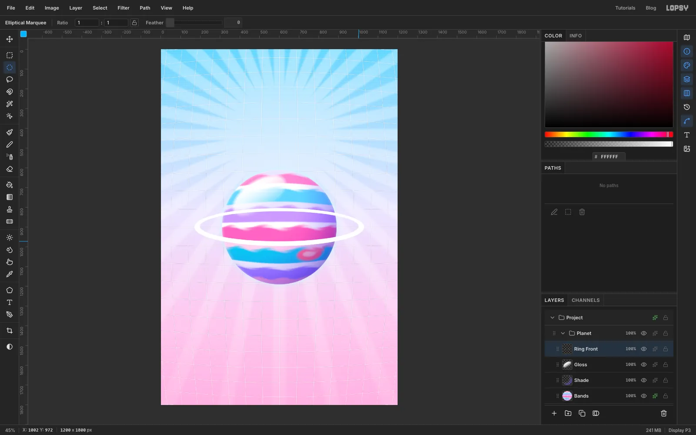

Add a layer called `Ring Front` above `Gloss`. Draw an **Elliptical Marquee** **860 × 192 px** centred on the planet and fill it white. Then draw an inner ellipse **804 × 152 px**, centred 4 px higher, and press [[Delete]]. The ring is thicker at the bottom, which reads as perspective: the near side is closer to you.

## Give the ring a chrome finish

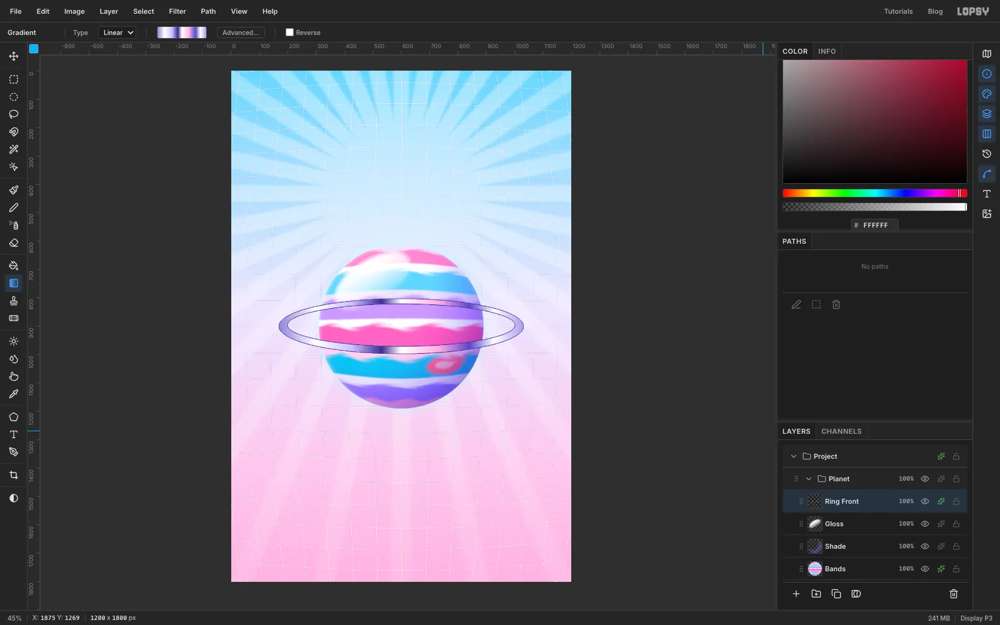

[[Cmd]]-click the `Ring Front` thumbnail to select its pixels. Make a linear gradient with nine stops, evenly spaced: `#8F86D6`, white, `#C9C0FF`, `#3A2E8C`, white, `#FFB3E0`, `#5546C4`, white, `#A99EE8`. Drag it from the left end of the ring to the right end.

On a ring this thin, alternating light and dark bands *along its length* read as polished metal much better than a top-to-bottom gradient would. Deselect and add a **Stroke** effect, **Width 2**, in `#3A2E8C`.

## Tilt the ring

Draw a rectangle around the whole ring, switch to the **Move** tool and drag a rotate handle to tilt it **14°** counter-clockwise, so the right end rises. Press [[Cmd+D]].

## Send the back of the ring behind the planet

Right now the whole ring is in front of the planet. You'll keep a copy behind the planet and cut the back half out of the front one.

1. With `Ring Front` selected, select all, copy, then select the `Rays` layer and paste. The copy lands in the same place, above `Rays` and below the planet. Rename it `Ring Back`.
2. Run **Filter → Hue/Saturation...** on `Ring Back` with **Lightness −20**, so the far side of the ring is a bit darker. Give it the same **Stroke** as the front.
3. Select `Ring Front` again and draw the 580 px circle over the planet. Then hold [[Shift+Alt]] and, with the **Lasso**, drag a rough shape over the top of the planet whose lower edge runs along the middle of the ring. The ring hides small wobbles. Holding both keys keeps only the overlap: the part of the planet above the ring's centre line.
4. Press [[Delete]]. The top arc of the ring now disappears behind the planet, and the bottom arc still crosses in front.

## Cast the ring's shadow

The ring needs a shadow on the planet to really sit in front of it. Select all on `Ring Front`, copy, select `Gloss` and paste. Rename the copy `Ring Shadow`.

With the **Move** tool, press [[Down]] 12 times to move it 12 px down. Run **Filter → Gaussian Blur...** at **6** and turn on **Color Overlay** in `#3A2A9A`. Set the layer to **Multiply** at **40%**. Raise it to about 65% later if the shadow gets lost once the title is in place; the finished file uses 65%. Finally, draw the 580 px circle, choose **Select → Inverse** and press [[Delete]], so the shadow only falls on the planet.

## Move the planet into place

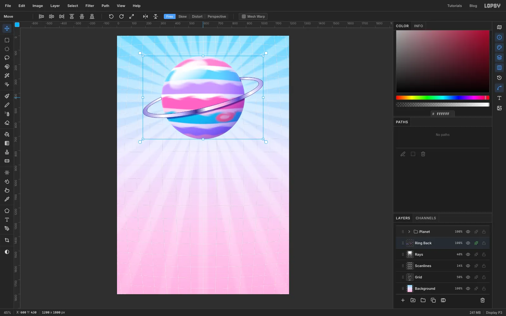

Collapse the `Planet` group and click it, then [[Cmd]]-click `Ring Back` so both are selected. Press [[Cmd+D]] so nothing is selected on the canvas, and the Move tool moves whole layers. With the **Move** tool, drag the planet straight up about **470 px**, so its centre sits roughly a quarter of the way down the page, right on the centre of the sunburst.

## Set and chrome the title

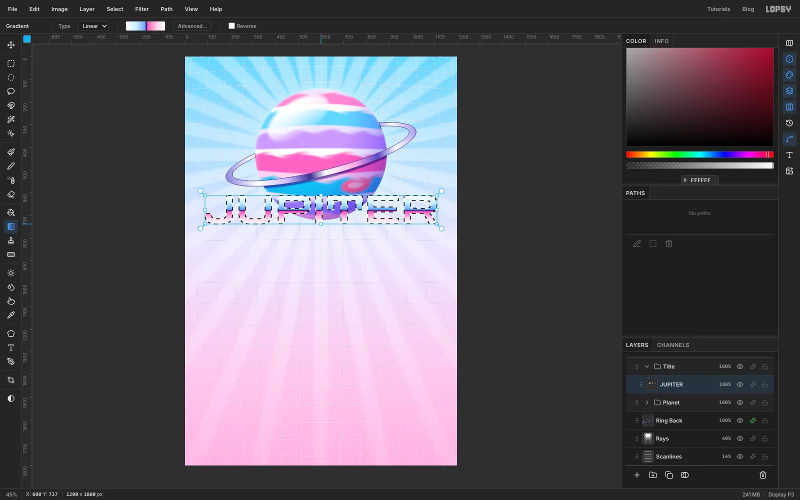

Click the `Planet` row on its own, so only it is selected, and click **New Group**. Call it `Title`. Choose the **Text** tool, set **Zen Dots** at **174 px** in white and type `JUPITER` in some empty space. Move it so it's centred across the page with its top just over the bottom of the planet. The planet should peek out from behind the letters.

Click **Rasterize Layer**, then [[Cmd]]-click its thumbnail to select the letters. Make a linear gradient with seven stops:

- white at the left end
- `#C6ECFF` at about 28%
- `#6FA3FF` at about 49%
- `#1E1660` at about 52%
- `#FF5FB8` at about 56%
- `#FFD3EC` at about 80%
- white at the right end

Drag it from the top of the letters to the bottom. The two close-together stops around 50% make the hard "horizon" line that makes chrome look like chrome: sky reflected above, ground below.

## Outline the title

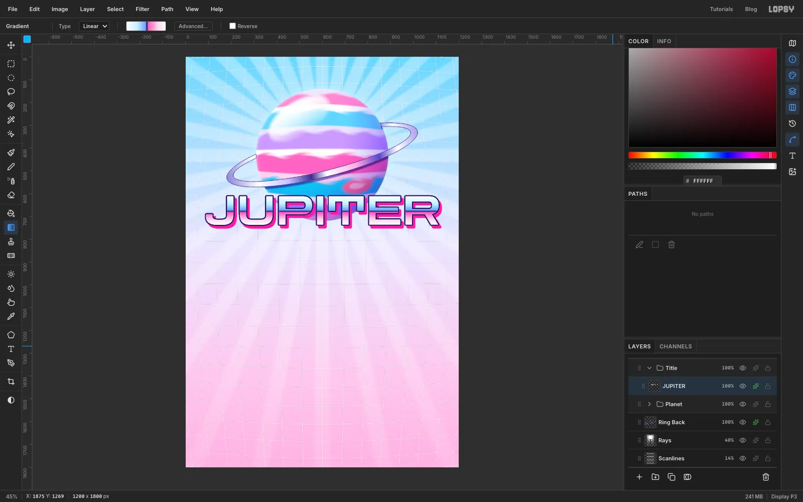

Deselect and add three effects to the title:

- **Stroke** in `#1E1660`, **Width 5**
- **Drop Shadow** in `#FF3FA4`, **Offset X 10**, **Offset Y 12**, **Blur 0**, **Spread 3**, **Opacity 100**, for a hard sticker-style shadow
- **Inner Glow** in white, **Size 3**, **Opacity 90**, a thin bright edge inside the outline

## Add the DUMPLINGS pill

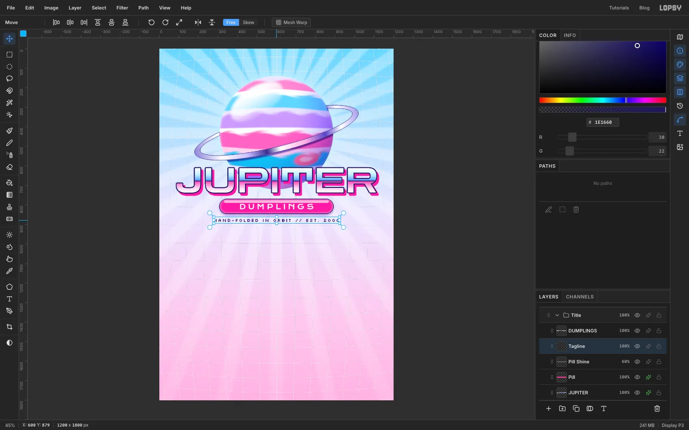

Add a layer called `Pill`. Choose the **Shape** tool, set **Shape** to **Rectangle**, **Output** to **Pixels**, **Corner Radius** to **36** and the fill to `#FF3FA4`. Shapes grow out from where you press, so press at the pill's centre, about **600, 807**, and drag out to **890, 843** to make a **580 × 72** pill. That leaves about 30 px between the title's pink shadow and the top of the pill. Give it:

- **Stroke**, `#1E1660`, **Width 3**
- **Inner Glow**, white, **Size 16**, **Opacity 60**
- **Drop Shadow**, `#5A2AA8`, **Offset Y 8**, **Blur 14**, **Opacity 45**

For the gel shine, add a layer called `Pill Shine` and draw a white rounded rectangle about 536 × 14 px with **Corner Radius 7**, just inside the top of the pill. Set it to **60%** opacity. Keep the shine thin so the lettering sits on solid pink.

Set `DUMPLINGS` in **Krona One** at **36 px** in white, then set **Letter spacing** to **12** in the Text panel. Centre it in the pill both ways. Under the pill, set `HAND-FOLDED IN ORBIT // EST. 2000` in **Silkscreen**, **24 px**, `#1E1660`, letter spacing **4**, centred, and rename the layer `Tagline`.

## Float some bubbles

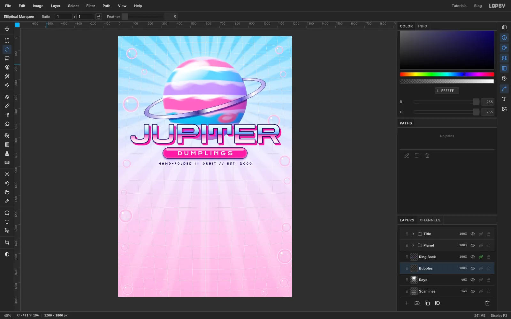

Collapse `Title`, select `Rays` and add a layer called `Bubbles`. Each bubble is a circle with a radial gradient that's clear in the middle and bright at the rim. Make a radial gradient with four stops:

- white at **0%** opacity, at the left end
- `#BFEFFF` at **10%** opacity, at about 60%
- `#FF9FD6` at **60%** opacity, at about 85%
- white at full opacity, at the right end

Start with one: draw a 90 px circle with the **Elliptical Marquee** in the left margin and drag the gradient from its centre to its edge. Then draw a 12 px circle near its upper left and fill it white with **Edit → Fill** for the highlight.

Repeat at different sizes until you have about 18 bubbles, from 30 to 110 px across. Keep them in the margins and the sky, clear of the middle of the page where the menu will go. Keep every highlight dot in the same upper-left spot so they all share one light source.

## Make a frosted-glass window

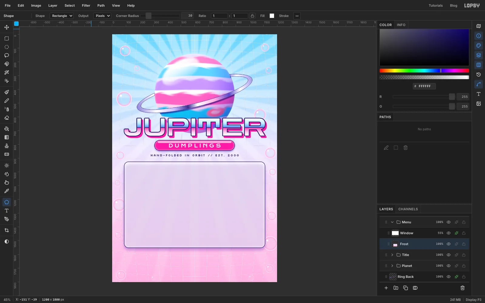

Select the `Title` group, click **New Group** and call it `Menu`.

Frosted glass blurs whatever is behind it. Click once with the **Rectangular Marquee** and enter **From 90, 928**, **To 1110, 1550**. Then choose **Edit → Copy Merged**, which copies everything visible in that area as one image. Paste it, rename the layer `Frost` and run **Filter → Gaussian Blur...** at **14**.

Add a layer called `Window` above it. With the **Shape** tool set to a white **Rectangle** with **Corner Radius 30**, press at the centre of that area, **600, 1239**, and drag out to its bottom-right corner at **1110, 1550**. Set it to **55%** opacity and add:

- **Stroke**, `#1E1660`, **Width 3**
- **Inner Glow**, white, **Size 24**, **Opacity 80**
- **Drop Shadow**, `#5A2AA8`, **Offset Y 18**, **Blur 30**, **Opacity 35**

The blurred copy still has square corners. [[Cmd]]-click the `Window` thumbnail, choose **Select → Inverse**, select `Frost` and press [[Delete]].

## Add the title bar

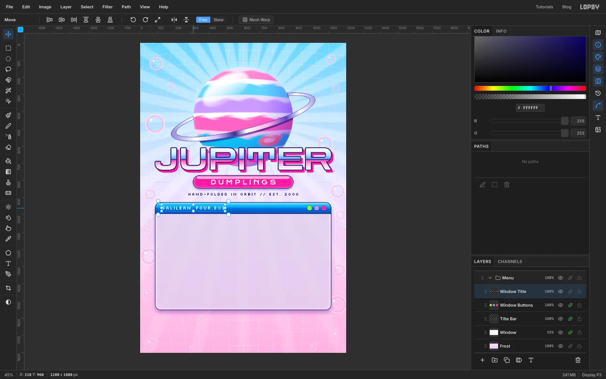

Add a layer called `Title Bar`. With the same **Corner Radius 30**, press at **600, 972** and drag out to **1110, 1016**. That makes a rounded rectangle the full width of the window, sitting on its top edge. Then click once with the **Rectangular Marquee**, enter **From 80, 990** and **To 1120, 1024**, and press [[Delete]], so only the top corners stay rounded and the bar is 62 px tall.

[[Cmd]]-click the thumbnail and fill it with a linear gradient from top to bottom: `#8FE3FF` at the left end, `#2F9BEA` at about 45%, `#1F6FD6` at about 55%, and `#1A4FB8` at the right end. It's deep enough for white text to read. Add a **Stroke** in `#1E1660`, **Width 3**.

On a layer called `Window Buttons`, draw three 28 px circles at the right end of the bar in `#9DFF5A`, `#B98BFF` and `#FF3FA4`. Give them a **Stroke** of `#1E1660` at **Width 2** and a white **Inner Glow** at **Size 6**. Then set `galilean_four.exe` in **Silkscreen**, **28 px**, white, letter spacing **3**, about 38 px in from the left of the bar and centred vertically.

## Draw a dumpling

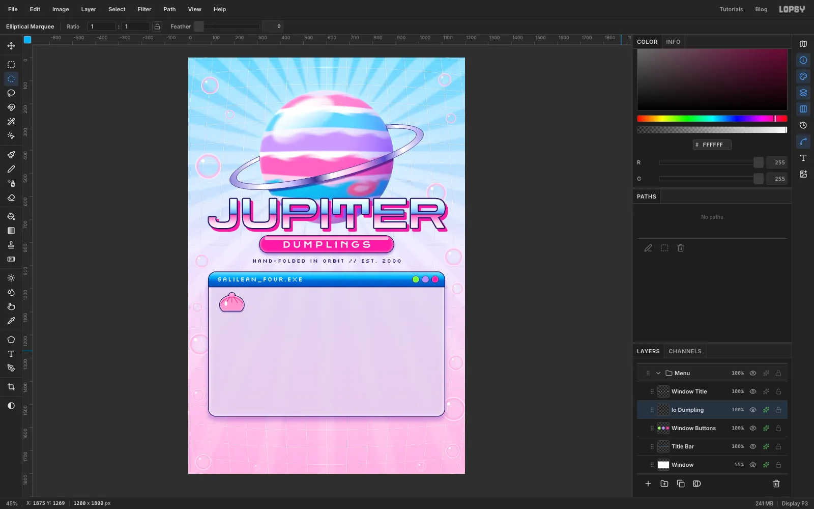

Add a layer called `Io Dumpling`. The window has room for four rows of 140 px each, and the icon goes about 100 px in from the window's left edge.

1. Draw an **Elliptical Marquee** about **104 × 80 px**, centred about **190, 1070**, and **Edit → Fill** it with `#FF9ACD`. Select a strip across its bottom fifth and press [[Delete]] to give it a flat base.
2. Draw a small **24 × 20 px** ellipse on top for the twisted knob, and fill it with the same pink.
3. Choose the **Brush** at **Size 4**, **Hardness 100**, in `#D9468F`. Paint five short curved pleats fanning out from the knob down over the top of the dumpling.
4. Add a small white oval highlight on its left side.

Give the layer a **Stroke** in `#1E1660` at **Width 3**, a white **Inner Glow** at **Size 10**, **Opacity 70**, and a soft **Drop Shadow** in `#3A2A9A`, **Offset Y 5**, **Blur 6**, **Opacity 30**.

## Make four moons

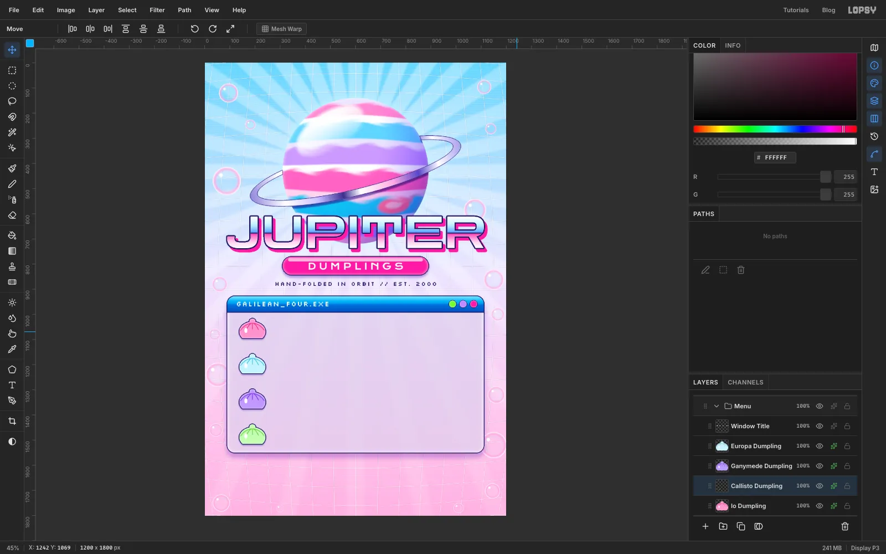

Click **Duplicate Layer**, click the copy's row and, with the **Move** tool, press [[Shift+Down]] 14 times. Each press moves it 10 px, so it lands 140 px down, in the next row. Rename it `Europa Dumpling` and run **Filter → Hue/Saturation...** with **Hue −135** and **Lightness +10** to turn it ice blue. Duplicate the original twice more:

- `Ganymede Dumpling`: 280 px down, **Hue −70** for lilac
- `Callisto Dumpling`: 420 px down, **Hue +130**, **Saturation −10**, **Lightness +5** for lime green

Duplicating keeps the effects, so every copy already has its outline, rim and shadow.

## Set the dishes

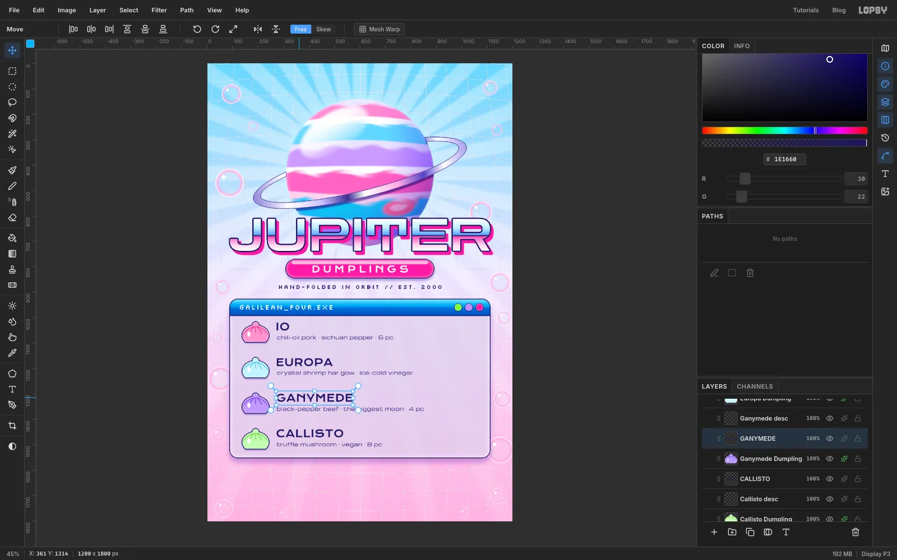

> **Tip:** Click a dumpling layer before starting each new text layer. If a text layer is selected, changing the font or size restyles it instead.

Set the names in **Krona One**, **40 px**, `#1E1660`, letter spacing **2**, starting about 80 px right of the icons, with the top of each name level with the top of its icon. Krona One's round O keeps a two-letter name like IO legible. Just below each name, set the description in **Michroma**, **20 px**, `#2E2470`:

- `chili-oil pork · sichuan pepper · 6 pc`
- `crystal shrimp har gow · ice-cold vinegar`
- `black-pepper beef · the biggest moon · 4 pc`
- `truffle mushroom · vegan · 8 pc`

> **Tip:** Thin lines of text are only a few pixels tall at fit-to-screen zoom. Dragging from their middle with the Move tool can grab a scale handle and stretch them. Start the drag from the left part of the line instead, or zoom in first.

## Add the price tags

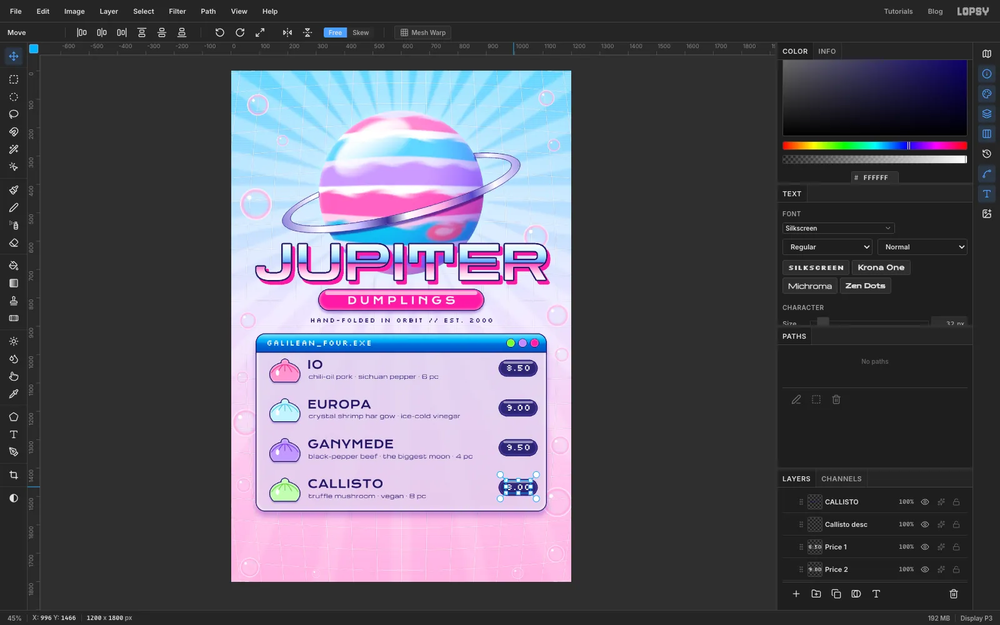

On a layer called `Price Tags`, draw a **132 × 54** rounded rectangle, **Corner Radius 27**, in `#2B2470` at the right end of each row, a little above the row's middle. Add a **Stroke** of `#1E1660` at **Width 3** and an **Inner Glow** in `#8E7BFF` at **Size 10**, **Opacity 85**, which gives navy gel a lit edge.

On a `Price Shine` layer, add a slim white rounded bar, about 104 × 8 px, along the top of each tag at **50%** opacity. Keep it clear of where the digits will go.

Set each price in **Silkscreen**, **32 px**, white: `8.50`, `9.00`, `9.50`, `8.00`. Centre each one in its tag, then nudge it up 2 px. Pixel digits look low when they're mathematically centred.

## Add the sides bar and footer

On a layer called `Dividers`, choose the **Pencil** at **Size 2** in `#A98BFF`. Between each pair of rows, click near the left of the window and [[Shift]]-click near the right.

Under the window, add a `Sides Bar` layer with a **1020 × 56** rounded rectangle, **Corner Radius 28**, in `#8E6BFF`, with the same Stroke, Inner Glow and Drop Shadow as the window. On a layer called `Sides Shine`, add a slim white shine along its top at **50%** opacity. Inside the bar, set `BUBBLE TEA 5.00  +  RING NOODLES 6.00  +  CHILI OIL 1.50` in **Krona One**, **22 px**, white, letter spacing **1**, centred, and call the text layer `Sides`.

Below the bar, set `OPEN 24/7/365 // 2000 ORBIT AVE // PRESS ENTER TO ORDER` in **Silkscreen**, **22 px**, `#1E1660`, letter spacing **1**, centred, and call it `Footer`.

## Put two dumplings in orbit

Duplicate `Io Dumpling`, click the copy and drag it up onto the front of the ring, on the left, so its base sits on the ribbon. Rename it `Moon Io`. Draw a rectangle around it and rotate it **14°** counter-clockwise to match the ring's tilt. Its drop shadow now reads as a contact shadow on the ring.

Do the same with a copy of `Callisto Dumpling` on the right-hand part of the ring. Call it `Moon Callisto`.

## Draw a sparkle with the Pen

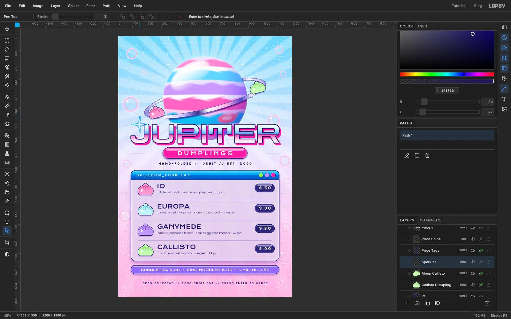

Select `Moon Callisto` and add a layer called `Sparkles` above it, so the sparkles sit over the title and the window. Choose the **Pen** tool and click eight points around the top-left corner of the J, going clockwise: a long point straight up, a short one just to the upper right of the centre, a long point to the right, and so on round. The long points are about 50 px from the centre and the short ones about 10 px. Click the first point again to close the shape.

Open the **Paths** panel, click **Path to Selection**, then fill the selection with white. Click the path in the panel again to deselect it. Add an **Outer Glow** in `#FF5FB8`, **Size 16**, **Opacity 90**.

## Copy the sparkle around

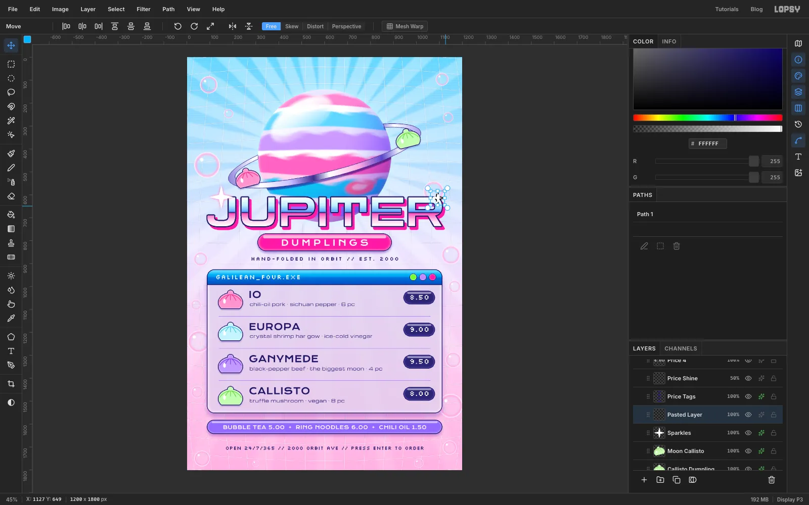

Draw a rectangle around the sparkle, copy, and paste. The paste lands in place, already selected and with the **Move** tool active. Drag it somewhere new, then hold [[Cmd]] and drag a corner handle inward to shrink it. [[Cmd]] keeps its proportions. Press [[Cmd+D]] and choose **Layer → Merge Down** to fold it back into `Sparkles`.

Make about eight sparkles at different sizes. Put one on the top-right corner of the R to balance the J, one near the planet's highlight, and the rest in the sky and margins.

## Make the sparkles bloom

With `Sparkles` selected, run **Filter → Bloom...** with its default settings. It picks out the brightest pixels and spreads a soft glow around them, so the sparkles look like light instead of cut-out shapes.

## Polish the spacing

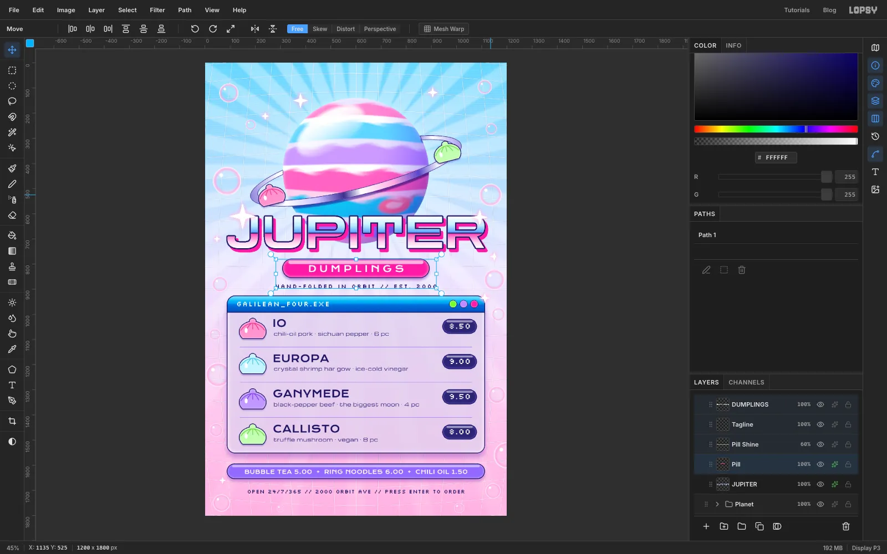

Step back and look at the whole page at fit zoom. Check these:

- **Tiny sparkles.** Anything under about 20 px across, like the one under the footer in the last screenshot, reads as a stray mark rather than a sparkle. Select it with the marquee on the `Sparkles` layer and delete it.
- **Depth.** A sparkle sitting on the planet's surface looks stuck to it instead of floating in front. Select it and drag it out into the sky.
- **Crowding.** Move any bubble that's half hidden behind the window, or crowding a letter, fully clear of it. Select it on the `Bubbles` layer and drag it.
- **Even gaps.** The gap between the window and the sides bar should match the gap between the bar and the footer, about 45 px each. [[Cmd]]-click `Sides Bar`, `Sides Shine` and `Sides` in the Layers panel and press [[Down]] with the Move tool until they match. All three move together. Do the same with `Pill`, `Pill Shine`, `DUMPLINGS` and `Tagline` until there's about 30 px of air between the title's shadow and the pill.
- **Small type.** Against the frosted glass and scanlines, the descriptions look a little thin. Raise them to **22 px** and add a **Color Overlay** in `#241B5C` to darken them. Give `Tagline` and `Footer` a white **Outer Glow** at **Size 4**, **Spread 20**, **Opacity 55**, so the scanlines don't eat into the pixel type.

## Check the margins with guides

Click the top ruler at **90**, **600** and **1110**, and the left ruler at **928** and **1550**. Everything should line up: the title's left and right edges, the window, the sides bar and the centre of every centred line.

With **View → Snap to Guides** on, drag a marquee from near the window's top-left corner to near its bottom-right. It snaps exactly to the guides, which is a quick way to confirm nothing has drifted.

Save the project, then use **File → Quick Export PNG** for the finished menu.
